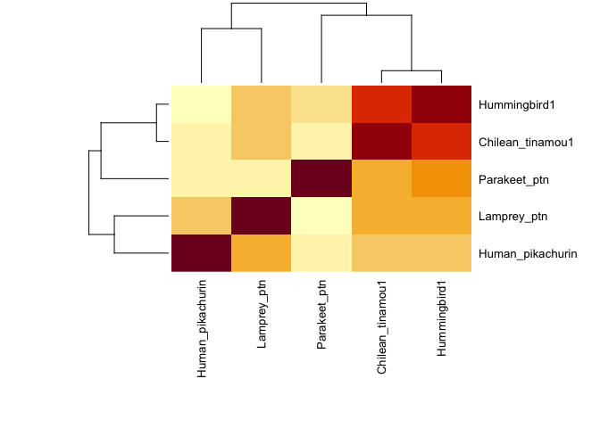
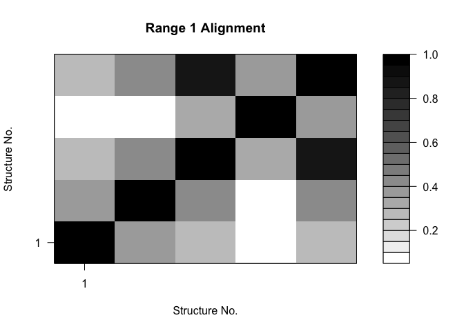
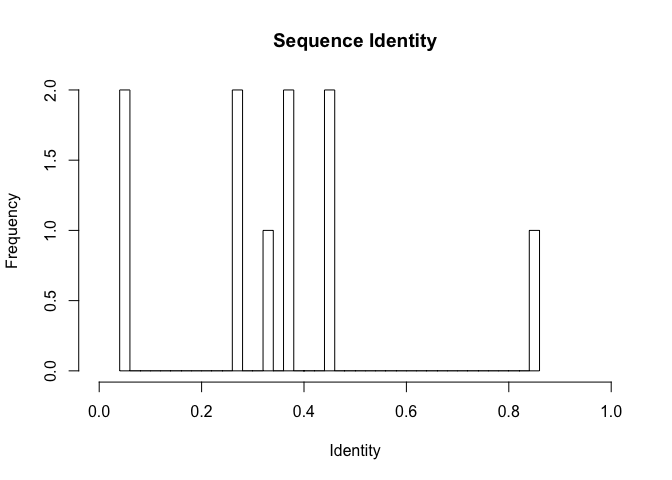
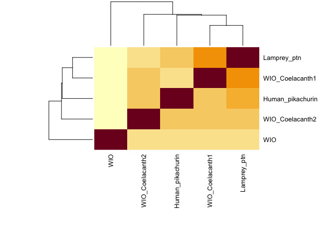
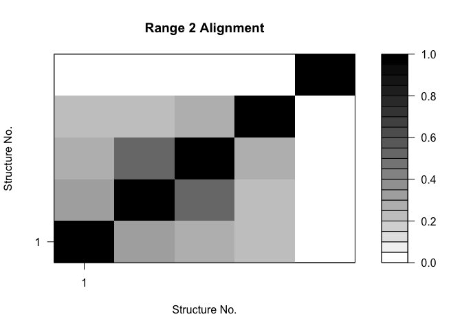
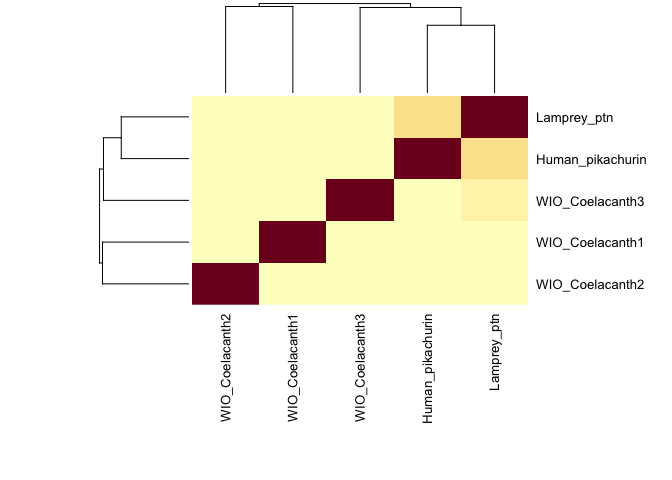
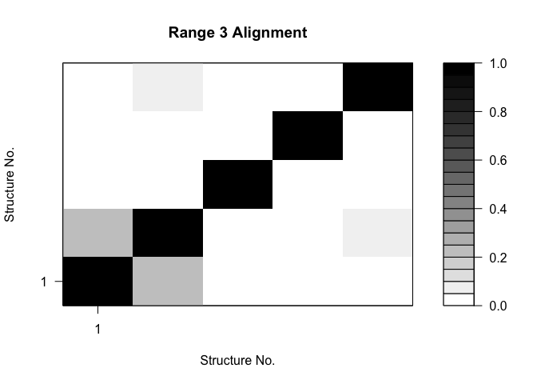

Find a Gene
================
Michael Nguyen
12/3/2019

``` r
library("bio3d")
```

``` r
x<- read.fasta("SeqAlign1.1")
x
```

    ##                    1        .         .         .         .         .         60 
    ## Human_pikachurin   RESLRSY---AATPWPLEPQHYLSFMEFE--ITFRPDSGDGVLLYS-YDTGSK-DFLSIN
    ## Lamprey_ptn        REVLRPYFPPGAGAYVSLPAMKGAYKRFEARVTFRPDTADGLVLYNGQKQGSGVDFLSFG
    ## Chilean_tinamou1   RERLVPYFTQTPRSFLPLPTIKDAYKRFEIRITFRPDAADGMLLYNGQRKSSGADFISFG
    ## Parakeet_ptn       ERLLPYFGQTLRSFLPLPTIKDAYKRFEILITFRPDAADGLLLYNGQRKTSGADFISFGL
    ## Hummingbird1       RESLVPYFGQTPRSFLPLPTIKDAYKRFEILITFRPDAADGLLLYNGQQKNSGADFISFG
    ##                       *  ^                                  ^^                  
    ##                    1        .         .         .         .         .         60 
    ## 
    ##                   61        .         .         .         .         .         120 
    ## Human_pikachurin   LAGGHVEFRFDCGSGTGVLRSEDPLTLGNWHELRVSRTAKNGILQVDKQKIVEGMAEGGF
    ## Lamprey_ptn        LVGGRPEFRFDVGSGMAVIRYPMPLELGEYHTVTLRRNLTEGSLTVNNEAPVVGSSQGKF
    ## Chilean_tinamou1   LVGGRPEFRFDAGSGMATIRHPTPLRLGEYHTVRLLRNLTQGSLALDGFPPVNGTSQGKF
    ## Parakeet_ptn       VGGRPEFRFDAGSGMATIRHPTQLRLGEYHTIRLLRNLTWGSLALEGHPSVNGTSQGRFQ
    ## Hummingbird1       LVDGRPEFRFDAGSGMATIRHPTPLRLGQYHTVRLRRNLTRGSLELEGHPPVNGTSQGKF
    ##                    ^                  ^              ^                          
    ##                   61        .         .         .         .         .         120 
    ## 
    ##                  121        .         .         .         .         .         180 
    ## Human_pikachurin   TQIKCNTDIFIGGVPNYDDVKKNSGVLKPFSGSIQKIILNDRTIHVKHDFTSGVNVENAA
    ## Lamprey_ptn        QGLDLNEEMYVGGVPSFSRVTRITGIKTGFTGCVREMELQGEQVNFLTQPIKSVAVRDCP
    ## Chilean_tinamou1   QGLDLNEELYLGGYPDYGAVAKTGLSSGFVGCVRQLLIQGEEVTFSEAQLRAQGIANCPT
    ## Parakeet_ptn       GLDLNEELYLGGYPDFSAVEK-TGLSRGFMGCVRQLRIQGEEVAFGDMDLQAHGITSCPT
    ## Hummingbird1       QGLDLNEELYLGGYPDFSALAKTGLSTGFVGCVRQLRIQGEEVAFGDMDLQAHGVTNCPT
    ##                               *                                                 
    ##                  121        .         .         .         .         .         180 
    ## 
    ##                  181        .         .         .         .  223 
    ## Human_pikachurin   HPCVRAPCAHGGSCRPRKEG-YDCDCPLGFEGLHCQKECGNYC
    ## Lamprey_ptn        T-CQDGPCQNEGVCHPSEEGGYECECPPGYTGTNCELPVASSC
    ## Chilean_tinamou1   CQDQPCQNGGVCQDAESSAYVCRCPPGFTGSNCEYSQALHC--
    ## Parakeet_ptn       CQDQPCQNGGVCQDAESGTYVCRCPHGFTGSNCEYSQASHC--
    ## Hummingbird1       CQDQPCQNGGVCQDAESGTYICRCPHGFTGSNCEYSQALHC--
    ##                                           *                    
    ##                  181        .         .         .         .  223 
    ## 
    ## Call:
    ##   read.fasta(file = "SeqAlign1.1")
    ## 
    ## Class:
    ##   fasta
    ## 
    ## Alignment dimensions:
    ##   5 sequence rows; 223 position columns (211 non-gap, 12 gap) 
    ## 
    ## + attr: id, ali, call

``` r
ide.mat<- seqidentity(x, normalize = TRUE, similarity = FALSE, ncore =1, nseg.scale = 1)
ide.mat
```

    ##                  Human_pikachurin Lamprey_ptn Chilean_tinamou1
    ## Human_pikachurin            1.000       0.364            0.272
    ## Lamprey_ptn                 0.364       1.000            0.445
    ## Chilean_tinamou1            0.272       0.445            1.000
    ## Parakeet_ptn                0.057       0.059            0.323
    ## Hummingbird1                0.263       0.441            0.860
    ##                  Parakeet_ptn Hummingbird1
    ## Human_pikachurin        0.057        0.263
    ## Lamprey_ptn             0.059        0.441
    ## Chilean_tinamou1        0.323        0.860
    ## Parakeet_ptn            1.000        0.368
    ## Hummingbird1            0.368        1.000

``` r
heatmap(ide.mat, margin = c(11,3), cexRow =1.0, cexCol = 1.0)
```

<!-- -->

``` r
# Plot identity matrix
plot.dmat(ide.mat, color.palette=mono.colors,
          main="Range 1 Alignment", xlab="Structure No.",
          ylab="Structure No.")
```

<!-- -->

``` r
# Histogram of pairwise identity values
hist(ide.mat[upper.tri(ide.mat)], breaks=30,xlim=c(0,1),
     main="Sequence Identity", xlab="Identity")
```

<!-- -->

``` r
y <- read.fasta("SeqAlign2")
y
```

    ##                    1        .         .         .         .         .         60 
    ## Human_pikachurin   SYVTFEPLKNSYQAFQITLEFRAEAEDGLLLYCGENEHGRGDFMSLAIIRRSLQFRFNCG
    ## Lamprey_ptn        AYVSLPAMKGAYKRFEARVTFRPDTADGLVLYNGQKQGSGVDFLSFGLVGGRPEFRFDVG
    ## WIO_Coelacanth1    SYLTLPTIKDAYKMFEIKITFRPDTPDGMIIYNGQKKASGADFISFGLVGGRPEFRFDVG
    ## WIO_Coelacanth2    SFISYPPLTNIHYELRIDLEFKPVGPTGLLFFSGGRKTKVEDFISVAMINKHIEFRYELG
    ## WIO                GKGKDFISLGLKDGQLIFSYQLGSGEANIVSEDIITDGEWHKITAVREGRQGYIQVDGEE
    ##                                                ^^                               
    ##                    1        .         .         .         .         .         60 
    ## 
    ##                   61        .         .         .         .         .         120 
    ## Human_pikachurin   TGVAIIVSETKIKLGGWHTVMLYRDGLNGLLQLNNGTPVTGQSQGQYSKITFRTPLYLGG
    ## Lamprey_ptn        SGMAVIRYPMPLELGEYHTVTLRRNLTEGSLTVNNEAPVVGSSQGKFQGLDLNEEMYVGG
    ## WIO_Coelacanth1    SGMATIRYPTPIKLGEFHTVTLYRNLTQGSLLVDQESPVNGSSQGKFQGLDLNEELHVGG
    ## WIO_Coelacanth2    SGLAVLRSPKPLDLGRWHKVTAERINKDGTLQVNSDLKIKRSSPGKSQGLNIQTAMFLGG
    ## WIO                ATWGLSAGTKIMVNTKGNIYLGGAPDADALTGGKFSPEFSGCIKNVVFRNSRPDPQPQQP
    ##                       ^       ^                ^                                
    ##                   61        .         .         .         .         .         120 
    ## 
    ##                  121        .         .         .         .         .         180 
    ## Human_pikachurin   APSAYWLVRATGTNRGFQGCVQSLAVNGRRIDMRPWPLGKALSGADVGECSSGICDEASC
    ## Lamprey_ptn        VPSFSRVTRITGIKTGFTGCVREMELQGEQVNFLTQPI-KSVAVRDCPTCQDGPCQNE--
    ## WIO_Coelacanth1    YPNYDAISKTAGLKNGFIGCIRQLIIQGEEVIFQDLDLSSQGISNCPTCRDRPCQNGGVC
    ## WIO_Coelacanth2    VPDFDILPKDANMSDGFHGCIGQVSINGKKVDISYSFLESQEITQCYDSSPCDRMPCLNG
    ## WIO                IDLEAQAEARVSLEECPS------------------------------------------
    ##                                                                                 
    ##                  121        .         .         .         .         .         180 
    ## 
    ##                  181        .         .       208 
    ## Human_pikachurin   IHGGTCTAIKADSYICLCPLGFKGRHCE
    ## Lamprey_ptn        ---GVCHPSEEGGYECECPPGYTGTNCE
    ## WIO_Coelacanth1    QDSEASSYVCLCPQGFTGSNCE------
    ## WIO_Coelacanth2    GICLPSVEYEYQCICRDGYHGDHCE---
    ## WIO                ----------------------------
    ##                                                 
    ##                  181        .         .       208 
    ## 
    ## Call:
    ##   read.fasta(file = "SeqAlign2")
    ## 
    ## Class:
    ##   fasta
    ## 
    ## Alignment dimensions:
    ##   5 sequence rows; 208 position columns (138 non-gap, 70 gap) 
    ## 
    ## + attr: id, ali, call

``` r
ide.mat2<- seqidentity(y, normalize = TRUE, similarity = FALSE, ncore =1, nseg.scale = 1)
ide.mat2
```

    ##                  Human_pikachurin Lamprey_ptn WIO_Coelacanth1
    ## Human_pikachurin            1.000       0.347           0.272
    ## Lamprey_ptn                 0.347       1.000           0.515
    ## WIO_Coelacanth1             0.272       0.515           1.000
    ## WIO_Coelacanth2             0.244       0.266           0.302
    ## WIO                         0.043       0.029           0.022
    ##                  WIO_Coelacanth2   WIO
    ## Human_pikachurin           0.244 0.043
    ## Lamprey_ptn                0.266 0.029
    ## WIO_Coelacanth1            0.302 0.022
    ## WIO_Coelacanth2            1.000 0.036
    ## WIO                        0.036 1.000

``` r
heatmap(ide.mat2, margin = c(11,3), cexRow =1.0, cexCol = 1.0)
```

<!-- -->

``` r
plot.dmat(ide.mat2, color.palette=mono.colors,
          main="Range 2 Alignment", xlab="Structure No.",
          ylab="Structure No.")
```

<!-- -->

``` r
z <- read.fasta("SeqAlign3")
z
```

    ##                    1        .         .         .         .         .         60 
    ## Human_pikachurin   RSNVFMRFKTTAKDGLLLWRGDSPMRPNSDFISLGLRDGALVFSYNLGSGVASIMVNGSF
    ## Lamprey_ptn        RFEARVTFRPDTADGLVLYNGQK-QGSGVDFLSFGLVGGRPEFRFDVGSGMAVIRYPMPL
    ## WIO_Coelacanth1    FEIKITFRPDTPDGMIIYNGQKKASGADFISFGLVGGRPEFRFDVGSGMATIRYPTPIKL
    ## WIO_Coelacanth2    HYELRIDLEFKPVGPTGLLFFSGGRKTKVEDFISVAMINKHIEFRYELGSGLAVLRSPKP
    ## WIO_Coelacanth3    GKGKDFISLGLKDGQLIFSYQLGSGEANIVSEDIITDGEWHKITAVREGRQGYIQVDGEE
    ##                                                                                 
    ##                    1        .         .         .         .         .         60 
    ## 
    ##                   61        .         .         .         .         .         120 
    ## Human_pikachurin   NDGRWHRVKAVRDGQSGKITVDDYGARTGKSPGMMRQLNINGALYVGGMKEIALHTNRQY
    ## Lamprey_ptn        ELGEYHTVTLRRNLTEGSLTVNNEAPVVGSSQGKFQGLDLNEEMYVGGVPSFSRVTRITG
    ## WIO_Coelacanth1    GEFHTVTLYRNLTQGSLLVDQESPVNGSSQGKFQGLDLNEELHVGGYPNYDAISKTAGLK
    ## WIO_Coelacanth2    LDLGRWHKVTAERINKDGTLQVNSDLKIKRSSPGKSQGLNIQTAMFLGGVPDFDILPKDA
    ## WIO_Coelacanth3    ATWGLSAGTKIMVNTKGNIYLGGAPDADALTGGKFSPEFSGCIKNV--------------
    ##                                                                                 
    ##                   61        .         .         .         .         .         120 
    ## 
    ##                  121        .         .         .    155 
    ## Human_pikachurin   MR-GLVGCISHFTLSTDYHISLVEDAVDGKNINTC
    ## Lamprey_ptn        IKTGFTGCVREMELQGE-QVNFLTQPIKSVAVRDC
    ## WIO_Coelacanth1    NGFIGCIRQLIIQGEEVIFQDLDLSSQGISNC---
    ## WIO_Coelacanth2    NMSDGFHGCIGQVSINGKKVDISYSFLESQEITQC
    ## WIO_Coelacanth3    -----------------------------------
    ##                                                        
    ##                  121        .         .         .    155 
    ## 
    ## Call:
    ##   read.fasta(file = "SeqAlign3")
    ## 
    ## Class:
    ##   fasta
    ## 
    ## Alignment dimensions:
    ##   5 sequence rows; 155 position columns (105 non-gap, 50 gap) 
    ## 
    ## + attr: id, ali, call

``` r
ide.mat3<- seqidentity(z, normalize = TRUE, similarity = FALSE, ncore =1, nseg.scale = 1)
ide.mat3
```

    ##                  Human_pikachurin Lamprey_ptn WIO_Coelacanth1
    ## Human_pikachurin            1.000       0.270           0.066
    ## Lamprey_ptn                 0.270       1.000           0.060
    ## WIO_Coelacanth1             0.066       0.060           1.000
    ## WIO_Coelacanth2             0.045       0.065           0.066
    ## WIO_Coelacanth3             0.085       0.095           0.066
    ##                  WIO_Coelacanth2 WIO_Coelacanth3
    ## Human_pikachurin           0.045           0.085
    ## Lamprey_ptn                0.065           0.095
    ## WIO_Coelacanth1            0.066           0.066
    ## WIO_Coelacanth2            1.000           0.066
    ## WIO_Coelacanth3            0.066           1.000

``` r
heatmap(ide.mat3, margin = c(11,3), cexRow =1.0, cexCol = 1.0)
```

<!-- -->

``` r
plot.dmat(ide.mat3, color.palette=mono.colors,
          main="Range 3 Alignment", xlab="Structure No.",
          ylab="Structure No.")
```

<!-- -->

``` r
library("bio3d")
```

``` r
con <- consensus(x, cutoff = 0.4)
con
```

    ## $seq
    ##   [1] "R" "E" "-" "L" "-" "P" "Y" "F" "-" "-" "-" "-" "-" "-" "-" "-" "-"
    ##  [18] "L" "P" "-" "-" "K" "-" "A" "Y" "K" "R" "F" "E" "-" "-" "I" "T" "F"
    ##  [35] "R" "P" "D" "A" "A" "D" "G" "L" "L" "L" "Y" "N" "G" "Q" "-" "-" "-"
    ##  [52] "S" "G" "-" "D" "F" "-" "S" "F" "G" "L" "V" "G" "G" "R" "P" "E" "F"
    ##  [69] "R" "F" "D" "-" "G" "S" "G" "M" "A" "-" "I" "R" "-" "P" "-" "P" "L"
    ##  [86] "-" "L" "G" "-" "Y" "H" "T" "V" "R" "L" "R" "R" "N" "L" "T" "-" "G"
    ## [103] "S" "L" "-" "-" "-" "-" "-" "-" "P" "V" "-" "G" "-" "S" "Q" "G" "K"
    ## [120] "F" "Q" "G" "L" "D" "L" "N" "E" "E" "-" "Y" "-" "G" "G" "-" "P" "-"
    ## [137] "-" "-" "-" "V" "-" "K" "T" "G" "L" "S" "-" "G" "F" "-" "G" "C" "V"
    ## [154] "R" "Q" "L" "-" "I" "Q" "G" "E" "E" "V" "-" "F" "-" "-" "-" "D" "L"
    ## [171] "-" "A" "-" "G" "-" "-" "-" "C" "P" "T" "C" "Q" "D" "Q" "P" "C" "Q"
    ## [188] "N" "G" "G" "V" "C" "Q" "D" "A" "E" "S" "-" "-" "Y" "-" "C" "R" "C"
    ## [205] "P" "-" "G" "F" "T" "G" "S" "N" "C" "E" "Y" "S" "Q" "A" "-" "H" "C"
    ## [222] "-" "-"
    ## 
    ## $freq
    ##     1   2   3 4   5   6   7   8   9  10  11  12  13  14  15  16  17  18
    ## V 0.0 0.0 0.2 0 0.4 0.0 0.0 0.0 0.0 0.0 0.0 0.0 0.0 0.0 0.0 0.2 0.0 0.0
    ## I 0.0 0.0 0.0 0 0.0 0.0 0.0 0.0 0.0 0.0 0.0 0.0 0.0 0.0 0.0 0.0 0.0 0.0
    ## L 0.0 0.0 0.2 1 0.0 0.0 0.0 0.0 0.0 0.0 0.2 0.0 0.0 0.0 0.2 0.4 0.4 0.6
    ## M 0.0 0.0 0.0 0 0.0 0.0 0.0 0.0 0.0 0.0 0.0 0.0 0.0 0.0 0.0 0.0 0.0 0.0
    ## F 0.0 0.0 0.0 0 0.0 0.0 0.2 0.6 0.0 0.0 0.0 0.0 0.0 0.2 0.4 0.0 0.0 0.0
    ## W 0.0 0.0 0.0 0 0.0 0.0 0.0 0.0 0.0 0.0 0.0 0.0 0.0 0.0 0.2 0.0 0.0 0.0
    ## Y 0.0 0.0 0.0 0 0.0 0.2 0.8 0.0 0.0 0.0 0.0 0.0 0.0 0.0 0.2 0.0 0.0 0.0
    ## S 0.0 0.0 0.4 0 0.0 0.2 0.0 0.0 0.0 0.0 0.0 0.0 0.2 0.4 0.0 0.0 0.2 0.0
    ## T 0.0 0.0 0.0 0 0.0 0.0 0.0 0.0 0.2 0.2 0.4 0.0 0.2 0.0 0.0 0.0 0.0 0.0
    ## N 0.0 0.0 0.0 0 0.0 0.0 0.0 0.0 0.0 0.0 0.0 0.0 0.0 0.0 0.0 0.0 0.0 0.0
    ## Q 0.0 0.0 0.0 0 0.0 0.0 0.0 0.0 0.2 0.4 0.0 0.0 0.0 0.0 0.0 0.0 0.0 0.0
    ## H 0.0 0.0 0.0 0 0.0 0.0 0.0 0.0 0.0 0.0 0.0 0.0 0.0 0.0 0.0 0.0 0.0 0.0
    ## K 0.0 0.0 0.0 0 0.0 0.0 0.0 0.0 0.0 0.0 0.0 0.0 0.0 0.0 0.0 0.0 0.0 0.0
    ## R 0.8 0.2 0.2 0 0.4 0.0 0.0 0.0 0.0 0.0 0.0 0.2 0.4 0.0 0.0 0.0 0.0 0.0
    ## D 0.0 0.0 0.0 0 0.0 0.0 0.0 0.0 0.0 0.0 0.0 0.0 0.0 0.0 0.0 0.0 0.0 0.0
    ## E 0.2 0.8 0.0 0 0.0 0.0 0.0 0.0 0.0 0.0 0.0 0.0 0.0 0.0 0.0 0.0 0.0 0.2
    ## A 0.0 0.0 0.0 0 0.0 0.0 0.0 0.0 0.0 0.0 0.2 0.4 0.0 0.2 0.0 0.0 0.0 0.0
    ## G 0.0 0.0 0.0 0 0.0 0.0 0.0 0.2 0.2 0.0 0.2 0.0 0.2 0.0 0.0 0.0 0.0 0.0
    ## P 0.0 0.0 0.0 0 0.2 0.6 0.0 0.0 0.2 0.2 0.0 0.4 0.0 0.2 0.0 0.4 0.4 0.2
    ## C 0.0 0.0 0.0 0 0.0 0.0 0.0 0.0 0.0 0.0 0.0 0.0 0.0 0.0 0.0 0.0 0.0 0.0
    ## - 0.0 0.0 0.0 0 0.0 0.0 0.0 0.2 0.2 0.2 0.0 0.0 0.0 0.0 0.0 0.0 0.0 0.0
    ## X 0.0 0.0 0.0 0 0.0 0.0 0.0 0.0 0.0 0.0 0.0 0.0 0.0 0.0 0.0 0.0 0.0 0.0
    ##    19  20  21  22  23  24  25  26  27  28  29  30  31  32  33  34  35  36
    ## V 0.0 0.0 0.0 0.0 0.0 0.0 0.0 0.0 0.0 0.0 0.0 0.0 0.0 0.2 0.0 0.0 0.0 0.0
    ## I 0.0 0.2 0.4 0.0 0.0 0.0 0.0 0.0 0.0 0.0 0.2 0.4 0.2 0.6 0.0 0.0 0.0 0.0
    ## L 0.0 0.0 0.0 0.0 0.2 0.0 0.0 0.0 0.0 0.0 0.0 0.2 0.2 0.0 0.0 0.0 0.0 0.0
    ## M 0.0 0.0 0.2 0.0 0.0 0.0 0.0 0.2 0.0 0.0 0.0 0.0 0.0 0.0 0.0 0.0 0.0 0.0
    ## F 0.0 0.0 0.0 0.0 0.0 0.0 0.2 0.0 0.2 0.8 0.0 0.0 0.0 0.0 0.2 0.8 0.0 0.0
    ## W 0.0 0.0 0.0 0.0 0.0 0.0 0.0 0.0 0.0 0.0 0.0 0.0 0.0 0.0 0.0 0.0 0.0 0.0
    ## Y 0.0 0.0 0.0 0.2 0.0 0.2 0.6 0.0 0.0 0.0 0.0 0.0 0.0 0.0 0.0 0.0 0.0 0.0
    ## S 0.0 0.0 0.0 0.0 0.0 0.2 0.0 0.0 0.0 0.0 0.0 0.0 0.0 0.0 0.0 0.0 0.0 0.0
    ## T 0.2 0.4 0.0 0.0 0.0 0.0 0.0 0.0 0.0 0.0 0.0 0.0 0.0 0.2 0.8 0.0 0.0 0.0
    ## N 0.0 0.0 0.0 0.0 0.0 0.0 0.0 0.0 0.0 0.0 0.0 0.0 0.0 0.0 0.0 0.0 0.0 0.0
    ## Q 0.0 0.2 0.0 0.0 0.0 0.0 0.0 0.0 0.0 0.0 0.0 0.0 0.0 0.0 0.0 0.0 0.0 0.0
    ## H 0.0 0.0 0.2 0.0 0.0 0.0 0.0 0.0 0.0 0.0 0.0 0.0 0.0 0.0 0.0 0.0 0.0 0.0
    ## K 0.0 0.0 0.2 0.6 0.0 0.0 0.2 0.6 0.0 0.0 0.0 0.0 0.0 0.0 0.0 0.0 0.0 0.0
    ## R 0.0 0.0 0.0 0.0 0.0 0.0 0.0 0.2 0.6 0.0 0.0 0.0 0.4 0.0 0.0 0.2 0.8 0.0
    ## D 0.0 0.0 0.0 0.2 0.4 0.0 0.0 0.0 0.0 0.0 0.0 0.0 0.0 0.0 0.0 0.0 0.0 0.2
    ## E 0.0 0.0 0.0 0.0 0.0 0.0 0.0 0.0 0.2 0.2 0.8 0.0 0.0 0.0 0.0 0.0 0.0 0.0
    ## A 0.0 0.2 0.0 0.0 0.2 0.6 0.0 0.0 0.0 0.0 0.0 0.2 0.0 0.0 0.0 0.0 0.0 0.0
    ## G 0.0 0.0 0.0 0.0 0.2 0.0 0.0 0.0 0.0 0.0 0.0 0.0 0.0 0.0 0.0 0.0 0.0 0.0
    ## P 0.8 0.0 0.0 0.0 0.0 0.0 0.0 0.0 0.0 0.0 0.0 0.0 0.0 0.0 0.0 0.0 0.2 0.8
    ## C 0.0 0.0 0.0 0.0 0.0 0.0 0.0 0.0 0.0 0.0 0.0 0.0 0.0 0.0 0.0 0.0 0.0 0.0
    ## - 0.0 0.0 0.0 0.0 0.0 0.0 0.0 0.0 0.0 0.0 0.0 0.2 0.2 0.0 0.0 0.0 0.0 0.0
    ## X 0.0 0.0 0.0 0.0 0.0 0.0 0.0 0.0 0.0 0.0 0.0 0.0 0.0 0.0 0.0 0.0 0.0 0.0
    ##    37  38  39  40  41  42  43  44  45  46  47  48  49  50  51  52  53  54
    ## V 0.0 0.0 0.0 0.0 0.0 0.2 0.2 0.0 0.0 0.0 0.0 0.0 0.0 0.0 0.0 0.0 0.0 0.2
    ## I 0.0 0.0 0.0 0.0 0.0 0.0 0.0 0.0 0.0 0.0 0.0 0.0 0.0 0.0 0.0 0.0 0.0 0.0
    ## L 0.0 0.0 0.0 0.0 0.2 0.6 0.8 0.8 0.0 0.0 0.0 0.0 0.0 0.0 0.0 0.0 0.0 0.0
    ## M 0.0 0.0 0.0 0.0 0.0 0.2 0.0 0.0 0.0 0.0 0.0 0.0 0.0 0.0 0.0 0.0 0.0 0.0
    ## F 0.0 0.0 0.0 0.0 0.0 0.0 0.0 0.0 0.0 0.0 0.0 0.0 0.0 0.0 0.0 0.0 0.0 0.0
    ## W 0.0 0.0 0.0 0.0 0.0 0.0 0.0 0.0 0.0 0.0 0.0 0.0 0.0 0.0 0.0 0.0 0.0 0.0
    ## Y 0.0 0.0 0.0 0.0 0.0 0.0 0.0 0.2 0.8 0.0 0.0 0.2 0.0 0.0 0.0 0.0 0.0 0.0
    ## S 0.0 0.2 0.0 0.0 0.0 0.0 0.0 0.0 0.0 0.2 0.0 0.0 0.0 0.0 0.4 0.8 0.0 0.0
    ## T 0.0 0.2 0.0 0.0 0.0 0.0 0.0 0.0 0.0 0.0 0.0 0.0 0.0 0.4 0.0 0.0 0.0 0.0
    ## N 0.0 0.0 0.0 0.0 0.0 0.0 0.0 0.0 0.2 0.6 0.0 0.0 0.0 0.0 0.2 0.0 0.0 0.0
    ## Q 0.0 0.0 0.0 0.0 0.0 0.0 0.0 0.0 0.0 0.0 0.2 0.6 0.2 0.2 0.0 0.0 0.0 0.0
    ## H 0.0 0.0 0.0 0.0 0.0 0.0 0.0 0.0 0.0 0.0 0.0 0.0 0.0 0.0 0.0 0.0 0.0 0.0
    ## K 0.0 0.0 0.0 0.0 0.0 0.0 0.0 0.0 0.0 0.0 0.0 0.0 0.4 0.4 0.0 0.0 0.2 0.0
    ## R 0.0 0.0 0.0 0.0 0.0 0.0 0.0 0.0 0.0 0.0 0.0 0.2 0.2 0.0 0.0 0.0 0.0 0.0
    ## D 0.8 0.0 0.2 0.8 0.0 0.0 0.0 0.0 0.0 0.0 0.0 0.0 0.2 0.0 0.0 0.0 0.0 0.2
    ## E 0.0 0.0 0.0 0.0 0.0 0.0 0.0 0.0 0.0 0.0 0.0 0.0 0.0 0.0 0.0 0.0 0.0 0.0
    ## A 0.2 0.6 0.6 0.0 0.0 0.0 0.0 0.0 0.0 0.0 0.0 0.0 0.0 0.0 0.0 0.0 0.2 0.4
    ## G 0.0 0.0 0.2 0.2 0.8 0.0 0.0 0.0 0.0 0.2 0.6 0.0 0.0 0.0 0.4 0.2 0.6 0.0
    ## P 0.0 0.0 0.0 0.0 0.0 0.0 0.0 0.0 0.0 0.0 0.0 0.0 0.0 0.0 0.0 0.0 0.0 0.0
    ## C 0.0 0.0 0.0 0.0 0.0 0.0 0.0 0.0 0.0 0.0 0.0 0.0 0.0 0.0 0.0 0.0 0.0 0.0
    ## - 0.0 0.0 0.0 0.0 0.0 0.0 0.0 0.0 0.0 0.0 0.2 0.0 0.0 0.0 0.0 0.0 0.0 0.2
    ## X 0.0 0.0 0.0 0.0 0.0 0.0 0.0 0.0 0.0 0.0 0.0 0.0 0.0 0.0 0.0 0.0 0.0 0.0
    ##    55  56  57  58  59  60  61  62  63  64  65  66  67  68  69  70  71  72
    ## V 0.0 0.0 0.0 0.0 0.0 0.0 0.2 0.6 0.0 0.0 0.0 0.2 0.0 0.0 0.0 0.0 0.0 0.2
    ## I 0.0 0.2 0.4 0.0 0.2 0.0 0.0 0.0 0.0 0.0 0.0 0.0 0.0 0.0 0.0 0.0 0.0 0.0
    ## L 0.0 0.0 0.4 0.0 0.0 0.2 0.8 0.0 0.0 0.0 0.0 0.0 0.0 0.0 0.0 0.0 0.0 0.0
    ## M 0.0 0.0 0.0 0.0 0.0 0.0 0.0 0.0 0.0 0.0 0.0 0.0 0.0 0.0 0.0 0.0 0.0 0.0
    ## F 0.2 0.8 0.0 0.2 0.6 0.0 0.0 0.0 0.0 0.0 0.0 0.0 0.2 0.8 0.2 0.8 0.0 0.0
    ## W 0.0 0.0 0.0 0.0 0.0 0.0 0.0 0.0 0.0 0.0 0.0 0.0 0.0 0.0 0.0 0.0 0.0 0.0
    ## Y 0.0 0.0 0.0 0.0 0.0 0.0 0.0 0.0 0.0 0.0 0.0 0.0 0.0 0.0 0.0 0.0 0.0 0.0
    ## S 0.0 0.0 0.2 0.8 0.0 0.0 0.0 0.0 0.0 0.0 0.0 0.0 0.0 0.0 0.0 0.0 0.0 0.0
    ## T 0.0 0.0 0.0 0.0 0.0 0.0 0.0 0.0 0.0 0.0 0.0 0.0 0.0 0.0 0.0 0.0 0.0 0.0
    ## N 0.0 0.0 0.0 0.0 0.0 0.2 0.0 0.0 0.0 0.0 0.0 0.0 0.0 0.0 0.0 0.0 0.0 0.0
    ## Q 0.0 0.0 0.0 0.0 0.0 0.0 0.0 0.0 0.0 0.0 0.0 0.0 0.0 0.0 0.0 0.0 0.0 0.0
    ## H 0.0 0.0 0.0 0.0 0.0 0.0 0.0 0.0 0.0 0.0 0.2 0.0 0.0 0.0 0.0 0.0 0.0 0.0
    ## K 0.0 0.0 0.0 0.0 0.0 0.0 0.0 0.0 0.0 0.0 0.0 0.0 0.0 0.0 0.0 0.0 0.0 0.0
    ## R 0.0 0.0 0.0 0.0 0.0 0.0 0.0 0.0 0.0 0.2 0.6 0.0 0.0 0.2 0.8 0.0 0.0 0.0
    ## D 0.8 0.0 0.0 0.0 0.0 0.0 0.0 0.0 0.2 0.0 0.0 0.0 0.0 0.0 0.0 0.2 0.8 0.0
    ## E 0.0 0.0 0.0 0.0 0.0 0.0 0.0 0.0 0.0 0.0 0.0 0.2 0.8 0.0 0.0 0.0 0.0 0.0
    ## A 0.0 0.0 0.0 0.0 0.0 0.0 0.0 0.2 0.0 0.0 0.0 0.0 0.0 0.0 0.0 0.0 0.2 0.4
    ## G 0.0 0.0 0.0 0.0 0.2 0.6 0.0 0.2 0.8 0.8 0.0 0.0 0.0 0.0 0.0 0.0 0.0 0.2
    ## P 0.0 0.0 0.0 0.0 0.0 0.0 0.0 0.0 0.0 0.0 0.2 0.6 0.0 0.0 0.0 0.0 0.0 0.0
    ## C 0.0 0.0 0.0 0.0 0.0 0.0 0.0 0.0 0.0 0.0 0.0 0.0 0.0 0.0 0.0 0.0 0.0 0.2
    ## - 0.0 0.0 0.0 0.0 0.0 0.0 0.0 0.0 0.0 0.0 0.0 0.0 0.0 0.0 0.0 0.0 0.0 0.0
    ## X 0.0 0.0 0.0 0.0 0.0 0.0 0.0 0.0 0.0 0.0 0.0 0.0 0.0 0.0 0.0 0.0 0.0 0.0
    ##    73  74  75  76  77  78  79  80  81  82  83  84  85  86  87  88  89  90
    ## V 0.0 0.0 0.0 0.0 0.0 0.4 0.0 0.0 0.0 0.0 0.0 0.0 0.0 0.0 0.0 0.0 0.0 0.0
    ## I 0.0 0.0 0.0 0.0 0.0 0.2 0.6 0.0 0.0 0.0 0.0 0.0 0.0 0.0 0.0 0.0 0.0 0.0
    ## L 0.0 0.0 0.0 0.0 0.0 0.0 0.2 0.0 0.0 0.0 0.0 0.2 0.8 0.2 0.8 0.0 0.0 0.0
    ## M 0.0 0.0 0.2 0.6 0.0 0.0 0.0 0.0 0.0 0.0 0.2 0.0 0.0 0.0 0.0 0.0 0.0 0.0
    ## F 0.0 0.0 0.0 0.0 0.0 0.0 0.0 0.0 0.0 0.0 0.0 0.0 0.0 0.0 0.0 0.0 0.0 0.0
    ## W 0.0 0.0 0.0 0.0 0.0 0.0 0.0 0.0 0.0 0.0 0.0 0.0 0.0 0.0 0.0 0.0 0.0 0.2
    ## Y 0.0 0.0 0.0 0.0 0.0 0.0 0.0 0.0 0.2 0.0 0.0 0.0 0.0 0.0 0.0 0.0 0.2 0.6
    ## S 0.2 0.8 0.0 0.0 0.0 0.0 0.0 0.0 0.2 0.0 0.0 0.0 0.0 0.0 0.0 0.0 0.0 0.0
    ## T 0.0 0.0 0.0 0.2 0.2 0.4 0.0 0.0 0.0 0.2 0.4 0.0 0.0 0.2 0.0 0.0 0.0 0.0
    ## N 0.0 0.0 0.0 0.0 0.0 0.0 0.0 0.0 0.0 0.0 0.0 0.0 0.0 0.0 0.0 0.0 0.2 0.0
    ## Q 0.0 0.0 0.0 0.0 0.0 0.0 0.0 0.0 0.0 0.0 0.2 0.0 0.0 0.0 0.0 0.0 0.2 0.0
    ## H 0.0 0.0 0.0 0.0 0.0 0.0 0.0 0.2 0.4 0.0 0.0 0.0 0.0 0.0 0.0 0.0 0.0 0.2
    ## K 0.0 0.0 0.0 0.0 0.0 0.0 0.0 0.0 0.0 0.0 0.0 0.0 0.0 0.0 0.0 0.0 0.0 0.0
    ## R 0.0 0.0 0.0 0.0 0.0 0.0 0.2 0.8 0.0 0.0 0.0 0.0 0.2 0.4 0.0 0.0 0.0 0.0
    ## D 0.0 0.0 0.0 0.0 0.0 0.0 0.0 0.0 0.0 0.0 0.2 0.0 0.0 0.0 0.0 0.0 0.0 0.0
    ## E 0.0 0.0 0.0 0.0 0.0 0.0 0.0 0.0 0.0 0.2 0.0 0.0 0.0 0.2 0.0 0.2 0.4 0.0
    ## A 0.0 0.0 0.0 0.2 0.6 0.0 0.0 0.0 0.0 0.0 0.0 0.0 0.0 0.0 0.0 0.0 0.0 0.0
    ## G 0.8 0.2 0.8 0.0 0.2 0.0 0.0 0.0 0.0 0.0 0.0 0.0 0.0 0.0 0.2 0.8 0.0 0.0
    ## P 0.0 0.0 0.0 0.0 0.0 0.0 0.0 0.0 0.2 0.6 0.0 0.8 0.0 0.0 0.0 0.0 0.0 0.0
    ## C 0.0 0.0 0.0 0.0 0.0 0.0 0.0 0.0 0.0 0.0 0.0 0.0 0.0 0.0 0.0 0.0 0.0 0.0
    ## - 0.0 0.0 0.0 0.0 0.0 0.0 0.0 0.0 0.0 0.0 0.0 0.0 0.0 0.0 0.0 0.0 0.0 0.0
    ## X 0.0 0.0 0.0 0.0 0.0 0.0 0.0 0.0 0.0 0.0 0.0 0.0 0.0 0.0 0.0 0.0 0.0 0.0
    ##    91  92  93  94  95  96  97  98  99 100 101 102 103 104 105 106 107 108
    ## V 0.0 0.0 0.6 0.0 0.2 0.0 0.0 0.0 0.0 0.0 0.0 0.0 0.0 0.0 0.0 0.4 0.0 0.0
    ## I 0.0 0.2 0.0 0.0 0.0 0.0 0.0 0.0 0.0 0.0 0.0 0.0 0.2 0.0 0.0 0.0 0.0 0.0
    ## L 0.0 0.0 0.2 0.2 0.8 0.2 0.0 0.2 0.6 0.0 0.0 0.0 0.2 0.8 0.2 0.4 0.0 0.0
    ## M 0.0 0.0 0.0 0.0 0.0 0.0 0.0 0.0 0.0 0.0 0.0 0.0 0.0 0.0 0.0 0.0 0.0 0.0
    ## F 0.0 0.0 0.0 0.0 0.0 0.0 0.0 0.0 0.0 0.0 0.0 0.0 0.0 0.0 0.0 0.0 0.0 0.0
    ## W 0.0 0.0 0.0 0.0 0.0 0.0 0.0 0.0 0.0 0.2 0.0 0.0 0.0 0.0 0.0 0.0 0.0 0.0
    ## Y 0.0 0.0 0.0 0.0 0.0 0.0 0.0 0.0 0.0 0.0 0.0 0.0 0.0 0.0 0.0 0.0 0.0 0.0
    ## S 0.0 0.0 0.0 0.0 0.0 0.2 0.0 0.0 0.0 0.0 0.0 0.2 0.6 0.0 0.0 0.0 0.0 0.0
    ## T 0.2 0.6 0.0 0.2 0.0 0.0 0.0 0.2 0.2 0.6 0.0 0.0 0.0 0.0 0.2 0.0 0.0 0.0
    ## N 0.0 0.0 0.0 0.0 0.0 0.0 0.2 0.6 0.0 0.0 0.2 0.0 0.0 0.0 0.0 0.0 0.2 0.2
    ## Q 0.0 0.0 0.0 0.0 0.0 0.0 0.0 0.0 0.0 0.0 0.2 0.0 0.0 0.0 0.2 0.0 0.0 0.0
    ## H 0.8 0.0 0.0 0.0 0.0 0.0 0.0 0.0 0.0 0.0 0.0 0.0 0.0 0.0 0.0 0.0 0.0 0.2
    ## K 0.0 0.0 0.0 0.0 0.0 0.0 0.0 0.0 0.0 0.2 0.0 0.0 0.0 0.0 0.0 0.0 0.0 0.2
    ## R 0.0 0.0 0.2 0.6 0.0 0.6 0.8 0.0 0.0 0.0 0.2 0.0 0.0 0.0 0.0 0.0 0.0 0.0
    ## D 0.0 0.0 0.0 0.0 0.0 0.0 0.0 0.0 0.0 0.0 0.0 0.0 0.0 0.0 0.0 0.0 0.4 0.0
    ## E 0.0 0.2 0.0 0.0 0.0 0.0 0.0 0.0 0.0 0.0 0.2 0.0 0.0 0.0 0.2 0.2 0.2 0.0
    ## A 0.0 0.0 0.0 0.0 0.0 0.0 0.0 0.0 0.2 0.0 0.0 0.0 0.0 0.2 0.2 0.0 0.0 0.0
    ## G 0.0 0.0 0.0 0.0 0.0 0.0 0.0 0.0 0.0 0.0 0.2 0.8 0.0 0.0 0.0 0.0 0.2 0.4
    ## P 0.0 0.0 0.0 0.0 0.0 0.0 0.0 0.0 0.0 0.0 0.0 0.0 0.0 0.0 0.0 0.0 0.0 0.0
    ## C 0.0 0.0 0.0 0.0 0.0 0.0 0.0 0.0 0.0 0.0 0.0 0.0 0.0 0.0 0.0 0.0 0.0 0.0
    ## - 0.0 0.0 0.0 0.0 0.0 0.0 0.0 0.0 0.0 0.0 0.0 0.0 0.0 0.0 0.0 0.0 0.0 0.0
    ## X 0.0 0.0 0.0 0.0 0.0 0.0 0.0 0.0 0.0 0.0 0.0 0.0 0.0 0.0 0.0 0.0 0.0 0.0
    ##   109 110 111 112 113 114 115 116 117 118 119 120 121 122 123 124 125 126
    ## V 0.0 0.0 0.2 0.8 0.2 0.0 0.0 0.0 0.0 0.0 0.0 0.0 0.0 0.0 0.0 0.0 0.0 0.0
    ## I 0.0 0.0 0.2 0.0 0.0 0.0 0.0 0.0 0.0 0.0 0.0 0.0 0.0 0.0 0.2 0.0 0.0 0.0
    ## L 0.0 0.0 0.0 0.0 0.0 0.0 0.0 0.0 0.0 0.0 0.0 0.0 0.0 0.2 0.6 0.2 0.6 0.0
    ## M 0.0 0.0 0.0 0.0 0.0 0.0 0.2 0.0 0.0 0.0 0.0 0.0 0.0 0.0 0.0 0.0 0.0 0.0
    ## F 0.2 0.0 0.0 0.0 0.0 0.0 0.0 0.0 0.0 0.0 0.2 0.8 0.0 0.0 0.0 0.0 0.0 0.0
    ## W 0.0 0.0 0.0 0.0 0.0 0.0 0.0 0.0 0.0 0.0 0.0 0.0 0.0 0.0 0.0 0.0 0.0 0.0
    ## Y 0.0 0.0 0.0 0.0 0.0 0.0 0.0 0.0 0.0 0.0 0.0 0.0 0.0 0.0 0.0 0.0 0.0 0.0
    ## S 0.0 0.2 0.0 0.0 0.0 0.0 0.4 0.6 0.0 0.0 0.0 0.0 0.0 0.0 0.0 0.0 0.0 0.0
    ## T 0.0 0.0 0.0 0.0 0.0 0.2 0.4 0.0 0.0 0.0 0.0 0.0 0.2 0.0 0.0 0.0 0.0 0.0
    ## N 0.0 0.0 0.0 0.2 0.4 0.0 0.0 0.0 0.0 0.0 0.0 0.0 0.0 0.0 0.0 0.0 0.2 0.8
    ## Q 0.2 0.0 0.0 0.0 0.0 0.0 0.0 0.2 0.6 0.0 0.0 0.2 0.6 0.2 0.0 0.0 0.0 0.0
    ## H 0.2 0.0 0.0 0.0 0.0 0.0 0.0 0.0 0.0 0.0 0.0 0.0 0.0 0.0 0.0 0.0 0.0 0.0
    ## K 0.0 0.2 0.0 0.0 0.0 0.0 0.0 0.0 0.0 0.0 0.6 0.0 0.0 0.0 0.0 0.2 0.0 0.0
    ## R 0.0 0.0 0.0 0.0 0.0 0.0 0.0 0.0 0.0 0.2 0.0 0.0 0.0 0.0 0.0 0.0 0.0 0.0
    ## D 0.0 0.0 0.0 0.0 0.0 0.0 0.0 0.0 0.0 0.0 0.0 0.0 0.0 0.0 0.2 0.6 0.0 0.0
    ## E 0.2 0.0 0.0 0.0 0.2 0.0 0.0 0.0 0.2 0.0 0.0 0.0 0.0 0.0 0.0 0.0 0.0 0.2
    ## A 0.0 0.2 0.0 0.0 0.0 0.0 0.0 0.2 0.0 0.0 0.0 0.0 0.0 0.0 0.0 0.0 0.0 0.0
    ## G 0.0 0.0 0.0 0.0 0.2 0.8 0.0 0.0 0.2 0.8 0.2 0.0 0.2 0.6 0.0 0.0 0.0 0.0
    ## P 0.2 0.4 0.6 0.0 0.0 0.0 0.0 0.0 0.0 0.0 0.0 0.0 0.0 0.0 0.0 0.0 0.0 0.0
    ## C 0.0 0.0 0.0 0.0 0.0 0.0 0.0 0.0 0.0 0.0 0.0 0.0 0.0 0.0 0.0 0.0 0.2 0.0
    ## - 0.0 0.0 0.0 0.0 0.0 0.0 0.0 0.0 0.0 0.0 0.0 0.0 0.0 0.0 0.0 0.0 0.0 0.0
    ## X 0.0 0.0 0.0 0.0 0.0 0.0 0.0 0.0 0.0 0.0 0.0 0.0 0.0 0.0 0.0 0.0 0.0 0.0
    ##   127 128 129 130 131 132 133 134 135 136 137 138 139 140 141 142 143 144
    ## V 0.0 0.0 0.0 0.0 0.2   0 0.0 0.4 0.0 0.0 0.0 0.0 0.2 0.6 0.0 0.0 0.0 0.0
    ## I 0.0 0.0 0.2 0.0 0.2   0 0.0 0.0 0.0 0.0 0.0 0.0 0.0 0.0 0.0 0.0 0.2 0.0
    ## L 0.0 0.2 0.4 0.2 0.4   0 0.0 0.0 0.0 0.0 0.0 0.0 0.0 0.2 0.0 0.0 0.0 0.0
    ## M 0.0 0.0 0.2 0.0 0.0   0 0.0 0.0 0.0 0.0 0.0 0.0 0.0 0.0 0.0 0.0 0.0 0.0
    ## F 0.0 0.0 0.0 0.2 0.0   0 0.0 0.0 0.0 0.2 0.4 0.0 0.0 0.0 0.0 0.0 0.0 0.0
    ## W 0.0 0.0 0.0 0.0 0.0   0 0.0 0.0 0.0 0.0 0.0 0.0 0.0 0.0 0.0 0.0 0.0 0.0
    ## Y 0.0 0.0 0.2 0.6 0.0   0 0.2 0.4 0.0 0.0 0.4 0.0 0.0 0.0 0.0 0.0 0.0 0.0
    ## S 0.0 0.0 0.0 0.0 0.0   0 0.0 0.0 0.0 0.2 0.2 0.4 0.0 0.0 0.0 0.0 0.0 0.2
    ## T 0.2 0.0 0.0 0.0 0.0   0 0.0 0.0 0.0 0.0 0.0 0.0 0.0 0.0 0.2 0.0 0.6 0.2
    ## N 0.0 0.0 0.0 0.0 0.0   0 0.0 0.0 0.0 0.2 0.0 0.0 0.0 0.0 0.0 0.0 0.2 0.0
    ## Q 0.0 0.0 0.0 0.0 0.0   0 0.0 0.0 0.0 0.0 0.0 0.0 0.0 0.0 0.0 0.0 0.0 0.0
    ## H 0.0 0.0 0.0 0.0 0.0   0 0.0 0.0 0.0 0.0 0.0 0.0 0.0 0.0 0.0 0.0 0.0 0.0
    ## K 0.0 0.0 0.0 0.0 0.0   0 0.0 0.0 0.0 0.0 0.0 0.0 0.0 0.0 0.4 0.6 0.0 0.0
    ## R 0.0 0.0 0.0 0.0 0.0   0 0.0 0.0 0.0 0.0 0.0 0.0 0.2 0.0 0.0 0.2 0.0 0.0
    ## D 0.0 0.2 0.0 0.0 0.0   0 0.0 0.0 0.2 0.4 0.0 0.2 0.2 0.0 0.0 0.0 0.0 0.0
    ## E 0.8 0.6 0.0 0.0 0.0   0 0.0 0.0 0.0 0.0 0.0 0.0 0.0 0.2 0.0 0.0 0.0 0.0
    ## A 0.0 0.0 0.0 0.0 0.0   0 0.0 0.0 0.0 0.0 0.0 0.2 0.4 0.0 0.4 0.0 0.0 0.0
    ## G 0.0 0.0 0.0 0.0 0.2   1 0.8 0.0 0.0 0.0 0.0 0.2 0.0 0.0 0.0 0.0 0.0 0.6
    ## P 0.0 0.0 0.0 0.0 0.0   0 0.0 0.2 0.8 0.0 0.0 0.0 0.0 0.0 0.0 0.0 0.0 0.0
    ## C 0.0 0.0 0.0 0.0 0.0   0 0.0 0.0 0.0 0.0 0.0 0.0 0.0 0.0 0.0 0.0 0.0 0.0
    ## - 0.0 0.0 0.0 0.0 0.0   0 0.0 0.0 0.0 0.0 0.0 0.0 0.0 0.0 0.0 0.2 0.0 0.0
    ## X 0.0 0.0 0.0 0.0 0.0   0 0.0 0.0 0.0 0.0 0.0 0.0 0.0 0.0 0.0 0.0 0.0 0.0
    ##   145 146 147 148 149 150 151 152 153 154 155 156 157 158 159 160 161 162
    ## V 0.0 0.2 0.0 0.0 0.0 0.4 0.0 0.0 0.6 0.2 0.0 0.0 0.0 0.0 0.0 0.0 0.0 0.0
    ## I 0.0 0.2 0.0 0.0 0.0 0.0 0.0 0.0 0.0 0.2 0.0 0.0 0.2 0.8 0.0 0.0 0.0 0.0
    ## L 0.6 0.0 0.2 0.0 0.0 0.0 0.0 0.0 0.0 0.0 0.0 0.6 0.2 0.0 0.4 0.0 0.0 0.0
    ## M 0.0 0.0 0.0 0.0 0.0 0.2 0.0 0.0 0.0 0.0 0.0 0.0 0.2 0.0 0.0 0.0 0.0 0.0
    ## F 0.0 0.0 0.0 0.0 0.6 0.4 0.0 0.0 0.0 0.0 0.0 0.0 0.0 0.0 0.0 0.0 0.0 0.0
    ## W 0.0 0.0 0.0 0.0 0.0 0.0 0.0 0.0 0.0 0.0 0.0 0.0 0.0 0.0 0.0 0.0 0.0 0.0
    ## Y 0.0 0.0 0.0 0.0 0.0 0.0 0.0 0.0 0.0 0.0 0.0 0.0 0.0 0.0 0.0 0.0 0.0 0.0
    ## S 0.0 0.6 0.2 0.0 0.0 0.0 0.2 0.0 0.2 0.0 0.0 0.0 0.0 0.0 0.0 0.0 0.0 0.0
    ## T 0.0 0.0 0.2 0.2 0.0 0.0 0.2 0.0 0.0 0.0 0.0 0.0 0.0 0.0 0.0 0.0 0.0 0.0
    ## N 0.0 0.0 0.0 0.0 0.0 0.0 0.0 0.0 0.0 0.0 0.0 0.0 0.0 0.0 0.0 0.2 0.0 0.0
    ## Q 0.0 0.0 0.0 0.0 0.0 0.0 0.0 0.0 0.0 0.0 0.8 0.0 0.0 0.0 0.6 0.2 0.0 0.0
    ## H 0.0 0.0 0.0 0.0 0.0 0.0 0.0 0.0 0.0 0.0 0.0 0.0 0.0 0.0 0.0 0.0 0.0 0.0
    ## K 0.0 0.0 0.2 0.2 0.0 0.0 0.0 0.0 0.0 0.0 0.0 0.2 0.0 0.0 0.0 0.0 0.0 0.0
    ## R 0.0 0.0 0.2 0.0 0.0 0.0 0.0 0.0 0.0 0.6 0.2 0.0 0.4 0.0 0.0 0.0 0.0 0.2
    ## D 0.0 0.0 0.0 0.0 0.0 0.0 0.0 0.0 0.0 0.0 0.0 0.0 0.0 0.0 0.0 0.0 0.2 0.0
    ## E 0.0 0.0 0.0 0.0 0.0 0.0 0.0 0.0 0.0 0.0 0.0 0.2 0.0 0.2 0.0 0.0 0.6 0.8
    ## A 0.0 0.0 0.0 0.0 0.0 0.0 0.0 0.0 0.0 0.0 0.0 0.0 0.0 0.0 0.0 0.0 0.0 0.0
    ## G 0.4 0.0 0.0 0.6 0.2 0.0 0.6 0.4 0.0 0.0 0.0 0.0 0.0 0.0 0.0 0.6 0.2 0.0
    ## P 0.0 0.0 0.0 0.0 0.2 0.0 0.0 0.0 0.0 0.0 0.0 0.0 0.0 0.0 0.0 0.0 0.0 0.0
    ## C 0.0 0.0 0.0 0.0 0.0 0.0 0.0 0.6 0.2 0.0 0.0 0.0 0.0 0.0 0.0 0.0 0.0 0.0
    ## - 0.0 0.0 0.0 0.0 0.0 0.0 0.0 0.0 0.0 0.0 0.0 0.0 0.0 0.0 0.0 0.0 0.0 0.0
    ## X 0.0 0.0 0.0 0.0 0.0 0.0 0.0 0.0 0.0 0.0 0.0 0.0 0.0 0.0 0.0 0.0 0.0 0.0
    ##   163 164 165 166 167 168 169 170 171 172 173 174 175 176 177 178 179 180
    ## V 0.6 0.2 0.0 0.2 0.0 0.0 0.0 0.0 0.0 0.0 0.0 0.4 0.2 0.4 0.0 0.0 0.0 0.0
    ## I 0.0 0.2 0.0 0.0 0.0 0.0 0.0 0.0 0.2 0.0 0.0 0.0 0.4 0.0 0.0 0.0 0.0 0.0
    ## L 0.0 0.0 0.0 0.0 0.2 0.0 0.0 0.6 0.0 0.0 0.0 0.0 0.0 0.0 0.0 0.0 0.0 0.0
    ## M 0.0 0.0 0.0 0.0 0.0 0.4 0.0 0.0 0.0 0.0 0.0 0.0 0.0 0.0 0.0 0.0 0.0 0.0
    ## F 0.0 0.0 0.6 0.2 0.0 0.0 0.0 0.2 0.0 0.0 0.0 0.0 0.0 0.0 0.0 0.0 0.0 0.0
    ## W 0.0 0.0 0.0 0.0 0.0 0.0 0.0 0.0 0.0 0.0 0.0 0.0 0.0 0.0 0.0 0.0 0.0 0.0
    ## Y 0.0 0.0 0.0 0.0 0.0 0.0 0.0 0.0 0.0 0.0 0.0 0.0 0.0 0.0 0.0 0.0 0.0 0.0
    ## S 0.0 0.0 0.0 0.2 0.0 0.0 0.0 0.0 0.0 0.2 0.2 0.0 0.0 0.0 0.2 0.0 0.0 0.0
    ## T 0.2 0.2 0.0 0.0 0.0 0.2 0.0 0.0 0.2 0.0 0.0 0.0 0.0 0.4 0.0 0.0 0.0 0.6
    ## N 0.0 0.0 0.2 0.0 0.0 0.0 0.0 0.0 0.0 0.0 0.0 0.0 0.2 0.0 0.4 0.2 0.0 0.0
    ## Q 0.2 0.0 0.0 0.0 0.0 0.0 0.4 0.0 0.4 0.0 0.2 0.0 0.0 0.0 0.0 0.0 0.0 0.0
    ## H 0.0 0.0 0.2 0.0 0.0 0.2 0.0 0.0 0.0 0.0 0.4 0.0 0.0 0.0 0.0 0.0 0.0 0.0
    ## K 0.0 0.0 0.0 0.0 0.2 0.0 0.0 0.0 0.0 0.2 0.0 0.0 0.0 0.0 0.0 0.0 0.0 0.0
    ## R 0.0 0.0 0.0 0.0 0.0 0.0 0.0 0.0 0.2 0.0 0.0 0.0 0.0 0.0 0.2 0.0 0.0 0.0
    ## D 0.0 0.0 0.0 0.0 0.4 0.0 0.6 0.0 0.0 0.0 0.0 0.0 0.0 0.0 0.0 0.2 0.0 0.0
    ## E 0.0 0.0 0.0 0.0 0.2 0.0 0.0 0.0 0.0 0.0 0.0 0.0 0.0 0.0 0.2 0.0 0.0 0.0
    ## A 0.0 0.4 0.0 0.0 0.0 0.2 0.0 0.0 0.0 0.6 0.0 0.0 0.2 0.2 0.0 0.0 0.2 0.2
    ## G 0.0 0.0 0.0 0.4 0.0 0.0 0.0 0.0 0.0 0.0 0.2 0.6 0.0 0.0 0.0 0.0 0.0 0.0
    ## P 0.0 0.0 0.0 0.0 0.0 0.0 0.0 0.2 0.0 0.0 0.0 0.0 0.0 0.0 0.0 0.0 0.6 0.2
    ## C 0.0 0.0 0.0 0.0 0.0 0.0 0.0 0.0 0.0 0.0 0.0 0.0 0.0 0.0 0.0 0.6 0.2 0.0
    ## - 0.0 0.0 0.0 0.0 0.0 0.0 0.0 0.0 0.0 0.0 0.0 0.0 0.0 0.0 0.0 0.0 0.0 0.0
    ## X 0.0 0.0 0.0 0.0 0.0 0.0 0.0 0.0 0.0 0.0 0.0 0.0 0.0 0.0 0.0 0.0 0.0 0.0
    ##   181 182 183 184 185 186 187 188 189 190 191 192 193 194 195 196 197 198
    ## V 0.0 0.0 0.0 0.2 0.0 0.0 0.0 0.0 0.0 0.0 0.6 0.0 0.2 0.0 0.0 0.0 0.0 0.0
    ## I 0.0 0.0 0.0 0.0 0.0 0.0 0.0 0.0 0.0 0.0 0.0 0.0 0.0 0.0 0.0 0.0 0.0 0.0
    ## L 0.0 0.0 0.0 0.0 0.0 0.0 0.0 0.0 0.0 0.0 0.0 0.0 0.0 0.0 0.0 0.0 0.0 0.0
    ## M 0.0 0.0 0.0 0.0 0.0 0.0 0.0 0.0 0.0 0.0 0.0 0.0 0.0 0.0 0.0 0.0 0.0 0.0
    ## F 0.0 0.0 0.0 0.0 0.0 0.0 0.0 0.0 0.0 0.0 0.0 0.0 0.0 0.0 0.0 0.0 0.0 0.0
    ## W 0.0 0.0 0.0 0.0 0.0 0.0 0.0 0.0 0.0 0.0 0.0 0.0 0.0 0.0 0.0 0.0 0.0 0.0
    ## Y 0.0 0.0 0.0 0.0 0.0 0.0 0.0 0.0 0.0 0.0 0.0 0.0 0.0 0.0 0.0 0.0 0.0 0.0
    ## S 0.0 0.0 0.0 0.0 0.0 0.0 0.0 0.0 0.0 0.0 0.0 0.0 0.2 0.0 0.0 0.0 0.8 0.2
    ## T 0.2 0.0 0.0 0.0 0.0 0.0 0.0 0.0 0.0 0.0 0.0 0.0 0.0 0.0 0.0 0.0 0.0 0.0
    ## N 0.0 0.0 0.0 0.0 0.0 0.0 0.0 0.6 0.0 0.2 0.0 0.0 0.0 0.0 0.0 0.0 0.0 0.0
    ## Q 0.0 0.6 0.0 0.8 0.0 0.0 0.6 0.0 0.2 0.0 0.0 0.0 0.6 0.0 0.0 0.0 0.0 0.0
    ## H 0.2 0.0 0.0 0.0 0.0 0.0 0.0 0.0 0.0 0.2 0.0 0.0 0.0 0.0 0.2 0.0 0.0 0.0
    ## K 0.0 0.0 0.0 0.0 0.0 0.0 0.0 0.0 0.0 0.0 0.0 0.0 0.0 0.0 0.0 0.0 0.0 0.2
    ## R 0.0 0.0 0.0 0.0 0.2 0.0 0.0 0.0 0.0 0.0 0.0 0.0 0.0 0.0 0.2 0.0 0.2 0.0
    ## D 0.0 0.0 0.6 0.0 0.2 0.0 0.0 0.0 0.0 0.0 0.0 0.0 0.0 0.6 0.0 0.0 0.0 0.0
    ## E 0.0 0.0 0.0 0.0 0.0 0.0 0.0 0.0 0.0 0.0 0.2 0.0 0.0 0.0 0.0 0.6 0.0 0.2
    ## A 0.0 0.0 0.0 0.0 0.0 0.2 0.0 0.0 0.2 0.0 0.0 0.0 0.0 0.0 0.6 0.0 0.0 0.0
    ## G 0.0 0.0 0.0 0.0 0.0 0.2 0.0 0.0 0.6 0.6 0.2 0.4 0.0 0.0 0.0 0.0 0.0 0.4
    ## P 0.0 0.2 0.0 0.0 0.6 0.0 0.4 0.0 0.0 0.0 0.0 0.0 0.0 0.0 0.0 0.4 0.0 0.0
    ## C 0.6 0.0 0.4 0.0 0.0 0.6 0.0 0.4 0.0 0.0 0.0 0.6 0.0 0.4 0.0 0.0 0.0 0.0
    ## - 0.0 0.2 0.0 0.0 0.0 0.0 0.0 0.0 0.0 0.0 0.0 0.0 0.0 0.0 0.0 0.0 0.0 0.0
    ## X 0.0 0.0 0.0 0.0 0.0 0.0 0.0 0.0 0.0 0.0 0.0 0.0 0.0 0.0 0.0 0.0 0.0 0.0
    ##   199 200 201 202 203 204 205 206 207 208 209 210 211 212 213 214 215 216
    ## V 0.0 0.0 0.4 0.0 0.0   0 0.0 0.0 0.0 0.0 0.0 0.0 0.0 0.0 0.0 0.0 0.0 0.0
    ## I 0.0 0.0 0.2 0.0 0.0   0 0.0 0.0 0.0 0.0 0.0 0.0 0.0 0.0 0.0 0.0 0.0 0.0
    ## L 0.0 0.0 0.0 0.0 0.0   0 0.0 0.0 0.0 0.2 0.0 0.0 0.0 0.0 0.2 0.0 0.0 0.0
    ## M 0.0 0.0 0.0 0.0 0.0   0 0.0 0.0 0.0 0.0 0.0 0.0 0.0 0.0 0.0 0.0 0.0 0.0
    ## F 0.0 0.0 0.0 0.0 0.0   0 0.0 0.0 0.0 0.6 0.0 0.2 0.0 0.0 0.0 0.0 0.0 0.0
    ## W 0.0 0.0 0.0 0.0 0.0   0 0.0 0.0 0.0 0.0 0.0 0.0 0.0 0.0 0.0 0.0 0.0 0.0
    ## Y 0.0 0.6 0.0 0.4 0.0   0 0.0 0.0 0.0 0.0 0.0 0.2 0.0 0.0 0.0 0.0 0.6 0.0
    ## S 0.0 0.0 0.0 0.0 0.0   0 0.0 0.0 0.0 0.0 0.0 0.0 0.6 0.0 0.0 0.0 0.0 0.6
    ## T 0.4 0.0 0.0 0.0 0.0   0 0.0 0.0 0.0 0.0 0.6 0.0 0.2 0.0 0.2 0.0 0.0 0.0
    ## N 0.0 0.0 0.0 0.0 0.0   0 0.0 0.0 0.0 0.0 0.0 0.0 0.0 0.6 0.0 0.2 0.0 0.0
    ## Q 0.0 0.0 0.0 0.0 0.0   0 0.0 0.0 0.0 0.0 0.0 0.0 0.0 0.0 0.0 0.0 0.0 0.2
    ## H 0.0 0.0 0.0 0.0 0.0   0 0.0 0.4 0.0 0.0 0.0 0.0 0.0 0.0 0.0 0.2 0.0 0.0
    ## K 0.0 0.0 0.0 0.0 0.0   0 0.0 0.0 0.0 0.0 0.0 0.0 0.0 0.0 0.0 0.0 0.0 0.0
    ## R 0.0 0.0 0.0 0.0 0.6   0 0.0 0.0 0.0 0.0 0.0 0.0 0.0 0.0 0.0 0.0 0.0 0.0
    ## D 0.0 0.0 0.0 0.0 0.2   0 0.2 0.0 0.0 0.0 0.0 0.0 0.0 0.0 0.0 0.0 0.0 0.0
    ## E 0.4 0.0 0.0 0.0 0.2   0 0.2 0.0 0.0 0.0 0.0 0.0 0.2 0.0 0.0 0.6 0.0 0.2
    ## A 0.2 0.0 0.0 0.0 0.0   0 0.0 0.0 0.0 0.0 0.0 0.0 0.0 0.0 0.0 0.0 0.0 0.0
    ## G 0.0 0.4 0.2 0.0 0.0   0 0.0 0.0 0.6 0.0 0.4 0.6 0.0 0.4 0.0 0.0 0.0 0.0
    ## P 0.0 0.0 0.0 0.0 0.0   0 0.6 0.2 0.4 0.2 0.0 0.0 0.0 0.0 0.0 0.0 0.0 0.0
    ## C 0.0 0.0 0.0 0.6 0.0   1 0.0 0.4 0.0 0.0 0.0 0.0 0.0 0.0 0.6 0.0 0.4 0.0
    ## - 0.0 0.0 0.2 0.0 0.0   0 0.0 0.0 0.0 0.0 0.0 0.0 0.0 0.0 0.0 0.0 0.0 0.0
    ## X 0.0 0.0 0.0 0.0 0.0   0 0.0 0.0 0.0 0.0 0.0 0.0 0.0 0.0 0.0 0.0 0.0 0.0
    ##   217 218 219 220 221 222 223
    ## V 0.0 0.0 0.2 0.0 0.0 0.0 0.0
    ## I 0.0 0.0 0.0 0.0 0.0 0.0 0.0
    ## L 0.2 0.0 0.4 0.0 0.0 0.0 0.0
    ## M 0.0 0.0 0.0 0.0 0.0 0.0 0.0
    ## F 0.0 0.0 0.0 0.0 0.0 0.0 0.0
    ## W 0.0 0.0 0.0 0.0 0.0 0.0 0.0
    ## Y 0.0 0.0 0.0 0.0 0.0 0.2 0.0
    ## S 0.0 0.0 0.2 0.0 0.2 0.2 0.0
    ## T 0.0 0.0 0.0 0.0 0.0 0.0 0.0
    ## N 0.0 0.0 0.0 0.0 0.2 0.0 0.0
    ## Q 0.6 0.0 0.0 0.0 0.0 0.0 0.0
    ## H 0.0 0.0 0.0 0.6 0.0 0.0 0.0
    ## K 0.2 0.0 0.0 0.0 0.0 0.0 0.0
    ## R 0.0 0.0 0.0 0.0 0.0 0.0 0.0
    ## D 0.0 0.0 0.0 0.0 0.0 0.0 0.0
    ## E 0.0 0.2 0.0 0.0 0.0 0.0 0.0
    ## A 0.0 0.6 0.0 0.2 0.0 0.0 0.0
    ## G 0.0 0.0 0.0 0.2 0.0 0.0 0.0
    ## P 0.0 0.2 0.0 0.0 0.0 0.0 0.0
    ## C 0.0 0.0 0.2 0.0 0.6 0.0 0.4
    ## - 0.0 0.0 0.0 0.0 0.0 0.6 0.6
    ## X 0.0 0.0 0.0 0.0 0.0 0.0 0.0
    ## 
    ## $seq.freq
    ##   1   2   3   4   5   6   7   8   9  10  11  12  13  14  15  16  17  18 
    ## 0.8 0.8 0.4 1.0 0.4 0.6 0.8 0.6 0.2 0.4 0.4 0.4 0.4 0.4 0.4 0.4 0.4 0.6 
    ##  19  20  21  22  23  24  25  26  27  28  29  30  31  32  33  34  35  36 
    ## 0.8 0.4 0.4 0.6 0.4 0.6 0.6 0.6 0.6 0.8 0.8 0.4 0.4 0.6 0.8 0.8 0.8 0.8 
    ##  37  38  39  40  41  42  43  44  45  46  47  48  49  50  51  52  53  54 
    ## 0.8 0.6 0.6 0.8 0.8 0.6 0.8 0.8 0.8 0.6 0.6 0.6 0.4 0.4 0.4 0.8 0.6 0.4 
    ##  55  56  57  58  59  60  61  62  63  64  65  66  67  68  69  70  71  72 
    ## 0.8 0.8 0.4 0.8 0.6 0.6 0.8 0.6 0.8 0.8 0.6 0.6 0.8 0.8 0.8 0.8 0.8 0.4 
    ##  73  74  75  76  77  78  79  80  81  82  83  84  85  86  87  88  89  90 
    ## 0.8 0.8 0.8 0.6 0.6 0.4 0.6 0.8 0.4 0.6 0.4 0.8 0.8 0.4 0.8 0.8 0.4 0.6 
    ##  91  92  93  94  95  96  97  98  99 100 101 102 103 104 105 106 107 108 
    ## 0.8 0.6 0.6 0.6 0.8 0.6 0.8 0.6 0.6 0.6 0.2 0.8 0.6 0.8 0.2 0.4 0.4 0.4 
    ## 109 110 111 112 113 114 115 116 117 118 119 120 121 122 123 124 125 126 
    ## 0.2 0.4 0.6 0.8 0.4 0.8 0.4 0.6 0.6 0.8 0.6 0.8 0.6 0.6 0.6 0.6 0.6 0.8 
    ## 127 128 129 130 131 132 133 134 135 136 137 138 139 140 141 142 143 144 
    ## 0.8 0.6 0.4 0.6 0.4 1.0 0.8 0.4 0.8 0.4 0.4 0.4 0.4 0.6 0.4 0.6 0.6 0.6 
    ## 145 146 147 148 149 150 151 152 153 154 155 156 157 158 159 160 161 162 
    ## 0.6 0.6 0.2 0.6 0.6 0.4 0.6 0.6 0.6 0.6 0.8 0.6 0.4 0.8 0.6 0.6 0.6 0.8 
    ## 163 164 165 166 167 168 169 170 171 172 173 174 175 176 177 178 179 180 
    ## 0.6 0.4 0.6 0.4 0.4 0.4 0.6 0.6 0.4 0.6 0.4 0.6 0.4 0.4 0.4 0.6 0.6 0.6 
    ## 181 182 183 184 185 186 187 188 189 190 191 192 193 194 195 196 197 198 
    ## 0.6 0.6 0.6 0.8 0.6 0.6 0.6 0.6 0.6 0.6 0.6 0.6 0.6 0.6 0.6 0.6 0.8 0.4 
    ## 199 200 201 202 203 204 205 206 207 208 209 210 211 212 213 214 215 216 
    ## 0.4 0.6 0.4 0.6 0.6 1.0 0.6 0.4 0.6 0.6 0.6 0.6 0.6 0.6 0.6 0.6 0.6 0.6 
    ## 217 218 219 220 221 222 223 
    ## 0.6 0.6 0.4 0.6 0.6 0.2 0.4 
    ## 
    ## $cutoff
    ## [1] 0.4

``` r
con2 <- consensus(y, cutoff = 0.2)
con2
```

    ## $seq
    ##   [1] "S" "Y" "V" "S" "L" "P" "P" "L" "K" "N" "A" "Y" "K" "-" "F" "E" "I"
    ##  [18] "-" "L" "T" "F" "R" "P" "D" "T" "E" "D" "G" "L" "V" "L" "Y" "N" "G"
    ##  [35] "Q" "K" "K" "G" "S" "G" "-" "D" "F" "I" "S" "V" "A" "L" "V" "R" "G"
    ##  [52] "R" "P" "E" "F" "R" "F" "D" "V" "G" "S" "G" "M" "A" "V" "I" "R" "Y"
    ##  [69] "P" "T" "P" "I" "K" "L" "G" "E" "W" "H" "T" "V" "T" "L" "Y" "R" "N"
    ##  [86] "L" "T" "D" "G" "L" "L" "Q" "V" "N" "N" "E" "-" "P" "V" "-" "G" "S"
    ## [103] "S" "Q" "G" "K" "F" "Q" "G" "L" "D" "L" "N" "T" "E" "L" "Y" "V" "G"
    ## [120] "G" "V" "P" "S" "F" "D" "-" "L" "-" "K" "-" "T" "G" "L" "K" "-" "G"
    ## [137] "F" "-" "G" "C" "V" "R" "Q" "L" "-" "I" "N" "G" "E" "-" "V" "D" "F"
    ## [154] "-" "-" "-" "P" "L" "-" "S" "Q" "-" "I" "-" "-" "D" "-" "-" "-" "C"
    ## [171] "-" "-" "G" "-" "C" "-" "-" "-" "-" "C" "-" "-" "-" "G" "-" "S" "-"
    ## [188] "-" "-" "E" "-" "-" "-" "Y" "-" "C" "-" "G" "P" "-" "G" "-" "-" "G"
    ## [205] "-" "-" "C" "E"
    ## 
    ## $freq
    ##     1   2   3   4   5   6   7   8   9  10  11  12  13  14  15  16  17  18
    ## V 0.0 0.0 0.4 0.0 0.0 0.0 0.0 0.0 0.0 0.0 0.0 0.0 0.0 0.0 0.0 0.0 0.0 0.0
    ## I 0.0 0.0 0.2 0.0 0.0 0.0 0.2 0.2 0.0 0.0 0.2 0.0 0.0 0.0 0.0 0.0 0.8 0.0
    ## L 0.0 0.0 0.2 0.0 0.4 0.0 0.0 0.4 0.2 0.0 0.2 0.0 0.0 0.0 0.2 0.2 0.0 0.0
    ## M 0.0 0.0 0.0 0.0 0.0 0.0 0.0 0.2 0.0 0.0 0.0 0.0 0.0 0.2 0.0 0.0 0.0 0.0
    ## F 0.0 0.2 0.0 0.0 0.2 0.2 0.0 0.0 0.0 0.0 0.0 0.0 0.0 0.0 0.6 0.0 0.0 0.2
    ## W 0.0 0.0 0.0 0.0 0.0 0.0 0.0 0.0 0.0 0.0 0.0 0.0 0.0 0.0 0.0 0.0 0.0 0.0
    ## Y 0.0 0.6 0.0 0.0 0.2 0.0 0.0 0.0 0.0 0.0 0.0 0.6 0.2 0.0 0.0 0.0 0.0 0.0
    ## S 0.6 0.0 0.0 0.4 0.0 0.0 0.0 0.2 0.0 0.0 0.2 0.0 0.0 0.0 0.0 0.0 0.0 0.0
    ## T 0.0 0.0 0.0 0.4 0.0 0.0 0.2 0.0 0.2 0.0 0.0 0.0 0.0 0.0 0.0 0.0 0.0 0.2
    ## N 0.0 0.0 0.0 0.0 0.0 0.0 0.0 0.0 0.0 0.4 0.0 0.0 0.0 0.0 0.0 0.0 0.0 0.0
    ## Q 0.0 0.0 0.0 0.0 0.0 0.0 0.0 0.0 0.0 0.0 0.0 0.0 0.2 0.0 0.2 0.2 0.0 0.0
    ## H 0.0 0.0 0.0 0.0 0.0 0.0 0.0 0.0 0.0 0.0 0.0 0.2 0.0 0.0 0.0 0.0 0.0 0.0
    ## K 0.0 0.2 0.0 0.2 0.0 0.0 0.0 0.0 0.6 0.0 0.0 0.2 0.4 0.0 0.0 0.0 0.0 0.2
    ## R 0.0 0.0 0.0 0.0 0.0 0.0 0.0 0.0 0.0 0.0 0.0 0.0 0.0 0.2 0.0 0.2 0.0 0.2
    ## D 0.0 0.0 0.0 0.0 0.2 0.0 0.0 0.0 0.0 0.2 0.0 0.0 0.2 0.0 0.0 0.0 0.0 0.2
    ## E 0.0 0.0 0.0 0.0 0.0 0.2 0.0 0.0 0.0 0.0 0.0 0.0 0.0 0.2 0.0 0.4 0.0 0.0
    ## A 0.2 0.0 0.0 0.0 0.0 0.0 0.2 0.0 0.0 0.0 0.4 0.0 0.0 0.2 0.0 0.0 0.2 0.0
    ## G 0.2 0.0 0.2 0.0 0.0 0.0 0.0 0.0 0.0 0.4 0.0 0.0 0.0 0.2 0.0 0.0 0.0 0.0
    ## P 0.0 0.0 0.0 0.0 0.0 0.6 0.4 0.0 0.0 0.0 0.0 0.0 0.0 0.0 0.0 0.0 0.0 0.0
    ## C 0.0 0.0 0.0 0.0 0.0 0.0 0.0 0.0 0.0 0.0 0.0 0.0 0.0 0.0 0.0 0.0 0.0 0.0
    ## - 0.0 0.0 0.0 0.0 0.0 0.0 0.0 0.0 0.0 0.0 0.0 0.0 0.0 0.0 0.0 0.0 0.0 0.0
    ## X 0.0 0.0 0.0 0.0 0.0 0.0 0.0 0.0 0.0 0.0 0.0 0.0 0.0 0.0 0.0 0.0 0.0 0.0
    ##    19  20  21  22  23  24  25  26  27  28  29  30  31  32  33  34  35  36
    ## V 0.2 0.0 0.0 0.0 0.0 0.2 0.0 0.0 0.0 0.0 0.0 0.4 0.0 0.0 0.0 0.0 0.0 0.0
    ## I 0.2 0.0 0.0 0.0 0.0 0.0 0.0 0.0 0.0 0.0 0.2 0.2 0.2 0.0 0.0 0.2 0.2 0.0
    ## L 0.4 0.0 0.0 0.2 0.0 0.0 0.0 0.0 0.0 0.0 0.6 0.4 0.4 0.0 0.0 0.0 0.0 0.0
    ## M 0.0 0.0 0.0 0.0 0.0 0.0 0.0 0.0 0.0 0.0 0.2 0.0 0.0 0.0 0.0 0.0 0.0 0.0
    ## F 0.0 0.0 0.8 0.0 0.0 0.0 0.0 0.0 0.0 0.0 0.0 0.0 0.2 0.2 0.0 0.0 0.0 0.0
    ## W 0.0 0.0 0.0 0.0 0.0 0.0 0.0 0.0 0.0 0.0 0.0 0.0 0.0 0.0 0.0 0.0 0.0 0.0
    ## Y 0.0 0.2 0.0 0.0 0.0 0.0 0.0 0.0 0.0 0.0 0.0 0.0 0.0 0.6 0.0 0.0 0.0 0.0
    ## S 0.2 0.0 0.0 0.0 0.0 0.2 0.0 0.0 0.0 0.0 0.0 0.0 0.2 0.0 0.2 0.0 0.0 0.0
    ## T 0.0 0.4 0.0 0.0 0.0 0.0 0.4 0.0 0.2 0.0 0.0 0.0 0.0 0.0 0.0 0.0 0.0 0.2
    ## N 0.0 0.0 0.0 0.0 0.0 0.0 0.0 0.0 0.0 0.2 0.0 0.0 0.0 0.0 0.4 0.0 0.0 0.2
    ## Q 0.0 0.0 0.2 0.0 0.0 0.0 0.0 0.0 0.0 0.0 0.0 0.0 0.0 0.0 0.0 0.0 0.4 0.0
    ## H 0.0 0.0 0.0 0.0 0.0 0.0 0.0 0.0 0.0 0.0 0.0 0.0 0.0 0.0 0.0 0.0 0.0 0.0
    ## K 0.0 0.0 0.0 0.2 0.0 0.0 0.0 0.0 0.0 0.0 0.0 0.0 0.0 0.0 0.0 0.0 0.0 0.4
    ## R 0.0 0.0 0.0 0.6 0.0 0.0 0.0 0.0 0.0 0.0 0.0 0.0 0.0 0.0 0.0 0.0 0.0 0.2
    ## D 0.0 0.0 0.0 0.0 0.0 0.4 0.0 0.0 0.6 0.0 0.0 0.0 0.0 0.0 0.2 0.0 0.0 0.0
    ## E 0.0 0.4 0.0 0.0 0.0 0.2 0.0 0.4 0.0 0.0 0.0 0.0 0.0 0.2 0.0 0.0 0.2 0.0
    ## A 0.0 0.0 0.0 0.0 0.2 0.0 0.2 0.2 0.2 0.0 0.0 0.0 0.0 0.0 0.0 0.0 0.0 0.0
    ## G 0.0 0.0 0.0 0.0 0.2 0.0 0.4 0.0 0.0 0.8 0.0 0.0 0.0 0.0 0.0 0.8 0.2 0.0
    ## P 0.0 0.0 0.0 0.0 0.6 0.0 0.0 0.4 0.0 0.0 0.0 0.0 0.0 0.0 0.0 0.0 0.0 0.0
    ## C 0.0 0.0 0.0 0.0 0.0 0.0 0.0 0.0 0.0 0.0 0.0 0.0 0.0 0.0 0.2 0.0 0.0 0.0
    ## - 0.0 0.0 0.0 0.0 0.0 0.0 0.0 0.0 0.0 0.0 0.0 0.0 0.0 0.0 0.0 0.0 0.0 0.0
    ## X 0.0 0.0 0.0 0.0 0.0 0.0 0.0 0.0 0.0 0.0 0.0 0.0 0.0 0.0 0.0 0.0 0.0 0.0
    ##    37  38  39  40  41  42  43  44  45  46  47  48  49  50  51  52  53  54
    ## V 0.0 0.0 0.0 0.2 0.2 0.0 0.0 0.0 0.0 0.4 0.0 0.0 0.4 0.0 0.0 0.0 0.0 0.0
    ## I 0.0 0.0 0.0 0.0 0.0 0.0 0.2 0.4 0.0 0.0 0.0 0.2 0.4 0.0 0.0 0.0 0.2 0.2
    ## L 0.0 0.0 0.0 0.0 0.0 0.0 0.0 0.2 0.0 0.2 0.0 0.4 0.0 0.0 0.0 0.0 0.2 0.0
    ## M 0.0 0.0 0.0 0.0 0.0 0.0 0.0 0.2 0.0 0.0 0.0 0.2 0.0 0.0 0.0 0.0 0.0 0.0
    ## F 0.0 0.0 0.0 0.0 0.0 0.0 0.8 0.0 0.0 0.4 0.0 0.0 0.0 0.0 0.0 0.0 0.0 0.0
    ## W 0.0 0.0 0.0 0.2 0.0 0.0 0.0 0.0 0.0 0.0 0.0 0.0 0.0 0.0 0.0 0.0 0.0 0.0
    ## Y 0.0 0.0 0.0 0.0 0.0 0.0 0.0 0.0 0.0 0.0 0.0 0.0 0.0 0.0 0.0 0.0 0.2 0.0
    ## S 0.0 0.0 0.4 0.0 0.0 0.0 0.0 0.0 0.8 0.0 0.0 0.0 0.0 0.0 0.0 0.2 0.0 0.0
    ## T 0.0 0.2 0.0 0.0 0.0 0.0 0.0 0.2 0.0 0.0 0.0 0.0 0.0 0.0 0.0 0.0 0.0 0.0
    ## N 0.0 0.0 0.0 0.0 0.0 0.0 0.0 0.0 0.0 0.0 0.0 0.0 0.0 0.2 0.0 0.0 0.0 0.0
    ## Q 0.2 0.0 0.0 0.0 0.0 0.0 0.0 0.0 0.0 0.0 0.0 0.0 0.0 0.0 0.2 0.0 0.0 0.2
    ## H 0.0 0.2 0.0 0.0 0.2 0.0 0.0 0.0 0.0 0.0 0.0 0.0 0.0 0.0 0.0 0.2 0.0 0.0
    ## K 0.4 0.0 0.2 0.0 0.0 0.2 0.0 0.0 0.0 0.0 0.0 0.0 0.0 0.0 0.2 0.0 0.0 0.0
    ## R 0.0 0.0 0.0 0.2 0.0 0.0 0.0 0.0 0.0 0.0 0.2 0.0 0.0 0.4 0.2 0.4 0.0 0.0
    ## D 0.2 0.0 0.0 0.0 0.0 0.8 0.0 0.0 0.0 0.0 0.0 0.0 0.0 0.0 0.0 0.0 0.0 0.0
    ## E 0.2 0.0 0.2 0.0 0.2 0.0 0.0 0.0 0.0 0.0 0.0 0.2 0.0 0.0 0.0 0.0 0.0 0.6
    ## A 0.0 0.2 0.0 0.0 0.2 0.0 0.0 0.0 0.2 0.0 0.4 0.0 0.0 0.0 0.0 0.0 0.0 0.0
    ## G 0.0 0.4 0.2 0.4 0.2 0.0 0.0 0.0 0.0 0.0 0.4 0.0 0.2 0.4 0.4 0.2 0.0 0.0
    ## P 0.0 0.0 0.0 0.0 0.0 0.0 0.0 0.0 0.0 0.0 0.0 0.0 0.0 0.0 0.0 0.0 0.4 0.0
    ## C 0.0 0.0 0.0 0.0 0.0 0.0 0.0 0.0 0.0 0.0 0.0 0.0 0.0 0.0 0.0 0.0 0.0 0.0
    ## - 0.0 0.0 0.0 0.0 0.0 0.0 0.0 0.0 0.0 0.0 0.0 0.0 0.0 0.0 0.0 0.0 0.0 0.0
    ## X 0.0 0.0 0.0 0.0 0.0 0.0 0.0 0.0 0.0 0.0 0.0 0.0 0.0 0.0 0.0 0.0 0.0 0.0
    ##    55  56  57  58  59  60  61  62  63  64  65  66  67  68  69  70  71  72
    ## V 0.0 0.2 0.0 0.0 0.4 0.0 0.0 0.0 0.2 0.0 0.4 0.0 0.2 0.0 0.0 0.0 0.0 0.0
    ## I 0.0 0.0 0.0 0.0 0.0 0.0 0.0 0.0 0.0 0.0 0.2 0.6 0.0 0.0 0.0 0.0 0.2 0.4
    ## L 0.0 0.0 0.0 0.0 0.2 0.0 0.0 0.0 0.2 0.0 0.2 0.2 0.0 0.0 0.0 0.0 0.0 0.4
    ## M 0.0 0.0 0.0 0.0 0.0 0.0 0.0 0.0 0.4 0.0 0.0 0.0 0.0 0.0 0.0 0.2 0.0 0.2
    ## F 0.8 0.0 0.6 0.0 0.0 0.0 0.0 0.0 0.0 0.0 0.0 0.0 0.0 0.0 0.0 0.0 0.0 0.0
    ## W 0.0 0.0 0.0 0.0 0.0 0.0 0.0 0.0 0.2 0.0 0.0 0.0 0.0 0.0 0.0 0.0 0.0 0.0
    ## Y 0.0 0.0 0.2 0.0 0.0 0.0 0.0 0.0 0.0 0.0 0.0 0.0 0.0 0.4 0.0 0.0 0.0 0.0
    ## S 0.0 0.0 0.0 0.0 0.0 0.0 0.6 0.0 0.0 0.0 0.0 0.2 0.0 0.4 0.0 0.0 0.0 0.0
    ## T 0.0 0.0 0.0 0.0 0.0 0.0 0.2 0.2 0.0 0.0 0.2 0.0 0.0 0.0 0.2 0.4 0.0 0.0
    ## N 0.0 0.0 0.0 0.2 0.0 0.0 0.0 0.0 0.0 0.0 0.0 0.0 0.0 0.0 0.0 0.0 0.0 0.0
    ## Q 0.2 0.0 0.0 0.0 0.0 0.0 0.0 0.0 0.0 0.0 0.0 0.0 0.0 0.0 0.0 0.0 0.0 0.0
    ## H 0.0 0.0 0.0 0.0 0.0 0.0 0.0 0.0 0.0 0.0 0.0 0.0 0.0 0.0 0.0 0.0 0.0 0.0
    ## K 0.0 0.0 0.0 0.0 0.0 0.0 0.0 0.0 0.0 0.0 0.0 0.0 0.0 0.0 0.0 0.4 0.2 0.0
    ## R 0.0 0.8 0.0 0.0 0.0 0.0 0.0 0.0 0.0 0.0 0.0 0.0 0.6 0.0 0.0 0.0 0.0 0.0
    ## D 0.0 0.0 0.2 0.4 0.0 0.0 0.0 0.0 0.0 0.0 0.0 0.0 0.0 0.0 0.0 0.0 0.0 0.0
    ## E 0.0 0.0 0.0 0.2 0.2 0.2 0.0 0.0 0.0 0.0 0.0 0.0 0.0 0.0 0.2 0.0 0.0 0.0
    ## A 0.0 0.0 0.0 0.0 0.0 0.0 0.2 0.0 0.0 0.8 0.0 0.0 0.2 0.0 0.0 0.0 0.0 0.0
    ## G 0.0 0.0 0.0 0.2 0.0 0.8 0.0 0.8 0.0 0.2 0.0 0.0 0.0 0.2 0.0 0.0 0.0 0.0
    ## P 0.0 0.0 0.0 0.0 0.0 0.0 0.0 0.0 0.0 0.0 0.0 0.0 0.0 0.0 0.6 0.0 0.6 0.0
    ## C 0.0 0.0 0.0 0.0 0.2 0.0 0.0 0.0 0.0 0.0 0.0 0.0 0.0 0.0 0.0 0.0 0.0 0.0
    ## - 0.0 0.0 0.0 0.0 0.0 0.0 0.0 0.0 0.0 0.0 0.0 0.0 0.0 0.0 0.0 0.0 0.0 0.0
    ## X 0.0 0.0 0.0 0.0 0.0 0.0 0.0 0.0 0.0 0.0 0.0 0.0 0.0 0.0 0.0 0.0 0.0 0.0
    ##    73  74  75  76  77  78  79  80  81  82  83  84  85  86  87  88  89  90
    ## V 0.2 0.0 0.0 0.0 0.0 0.0 0.0 0.8 0.0 0.0 0.0 0.0 0.0 0.0 0.0 0.0 0.0 0.0
    ## I 0.0 0.0 0.0 0.0 0.0 0.0 0.2 0.0 0.0 0.0 0.0 0.0 0.2 0.0 0.0 0.0 0.0 0.0
    ## L 0.0 0.8 0.0 0.0 0.0 0.0 0.0 0.0 0.2 0.6 0.0 0.0 0.0 0.4 0.2 0.0 0.0 0.4
    ## M 0.0 0.0 0.0 0.0 0.0 0.0 0.0 0.0 0.2 0.0 0.0 0.0 0.0 0.0 0.0 0.0 0.0 0.0
    ## F 0.0 0.0 0.0 0.0 0.2 0.0 0.0 0.0 0.0 0.0 0.0 0.0 0.0 0.0 0.0 0.0 0.0 0.0
    ## W 0.0 0.0 0.0 0.0 0.4 0.0 0.0 0.0 0.0 0.0 0.0 0.0 0.0 0.0 0.0 0.0 0.0 0.0
    ## Y 0.0 0.0 0.0 0.0 0.2 0.0 0.0 0.2 0.0 0.0 0.4 0.0 0.0 0.0 0.0 0.0 0.0 0.0
    ## S 0.0 0.0 0.0 0.0 0.0 0.0 0.0 0.0 0.0 0.0 0.0 0.0 0.0 0.0 0.0 0.0 0.0 0.4
    ## T 0.0 0.0 0.2 0.0 0.0 0.0 0.6 0.0 0.6 0.0 0.0 0.0 0.0 0.0 0.4 0.0 0.0 0.2
    ## N 0.0 0.2 0.0 0.0 0.0 0.2 0.0 0.0 0.0 0.0 0.0 0.0 0.4 0.2 0.0 0.2 0.0 0.0
    ## Q 0.0 0.0 0.0 0.0 0.0 0.0 0.0 0.0 0.0 0.0 0.0 0.0 0.0 0.0 0.0 0.2 0.0 0.0
    ## H 0.0 0.0 0.0 0.0 0.0 0.8 0.0 0.0 0.0 0.0 0.0 0.0 0.0 0.0 0.0 0.0 0.0 0.0
    ## K 0.4 0.0 0.0 0.2 0.0 0.0 0.2 0.0 0.0 0.0 0.0 0.0 0.0 0.0 0.2 0.0 0.0 0.0
    ## R 0.0 0.0 0.0 0.2 0.0 0.0 0.0 0.0 0.0 0.0 0.2 0.8 0.0 0.0 0.0 0.0 0.0 0.0
    ## D 0.2 0.0 0.0 0.0 0.0 0.0 0.0 0.0 0.0 0.0 0.0 0.0 0.2 0.2 0.0 0.4 0.0 0.0
    ## E 0.2 0.0 0.0 0.4 0.0 0.0 0.0 0.0 0.0 0.0 0.2 0.0 0.0 0.0 0.0 0.2 0.0 0.0
    ## A 0.0 0.0 0.0 0.0 0.0 0.0 0.0 0.0 0.0 0.2 0.0 0.2 0.0 0.0 0.2 0.0 0.2 0.0
    ## G 0.0 0.0 0.8 0.2 0.2 0.0 0.0 0.0 0.0 0.2 0.2 0.0 0.0 0.2 0.0 0.0 0.8 0.0
    ## P 0.0 0.0 0.0 0.0 0.0 0.0 0.0 0.0 0.0 0.0 0.0 0.0 0.2 0.0 0.0 0.0 0.0 0.0
    ## C 0.0 0.0 0.0 0.0 0.0 0.0 0.0 0.0 0.0 0.0 0.0 0.0 0.0 0.0 0.0 0.0 0.0 0.0
    ## - 0.0 0.0 0.0 0.0 0.0 0.0 0.0 0.0 0.0 0.0 0.0 0.0 0.0 0.0 0.0 0.0 0.0 0.0
    ## X 0.0 0.0 0.0 0.0 0.0 0.0 0.0 0.0 0.0 0.0 0.0 0.0 0.0 0.0 0.0 0.0 0.0 0.0
    ##    91  92  93  94  95  96  97  98  99 100 101 102 103 104 105 106 107 108
    ## V 0.0 0.0 0.6 0.0 0.0 0.0 0.0 0.0 0.6 0.2 0.0 0.0 0.0 0.0 0.0 0.2 0.2 0.0
    ## I 0.0 0.0 0.0 0.0 0.0 0.0 0.0 0.0 0.2 0.0 0.0 0.0 0.2 0.0 0.0 0.0 0.0 0.0
    ## L 0.8 0.2 0.2 0.0 0.0 0.0 0.2 0.0 0.0 0.0 0.0 0.0 0.0 0.0 0.0 0.0 0.0 0.0
    ## M 0.0 0.0 0.0 0.0 0.0 0.0 0.0 0.0 0.0 0.0 0.0 0.0 0.0 0.0 0.0 0.0 0.0 0.0
    ## F 0.0 0.0 0.0 0.0 0.2 0.0 0.0 0.0 0.2 0.0 0.0 0.0 0.0 0.0 0.0 0.0 0.4 0.2
    ## W 0.0 0.0 0.0 0.0 0.0 0.0 0.0 0.0 0.0 0.0 0.0 0.0 0.0 0.0 0.0 0.0 0.0 0.0
    ## Y 0.0 0.0 0.0 0.0 0.0 0.0 0.0 0.0 0.0 0.0 0.0 0.0 0.0 0.0 0.0 0.0 0.2 0.0
    ## S 0.0 0.0 0.0 0.0 0.2 0.2 0.2 0.0 0.0 0.2 0.0 0.6 0.8 0.0 0.0 0.0 0.2 0.2
    ## T 0.2 0.2 0.0 0.0 0.0 0.0 0.2 0.0 0.0 0.2 0.0 0.0 0.0 0.0 0.0 0.0 0.0 0.0
    ## N 0.0 0.0 0.0 0.6 0.4 0.0 0.0 0.0 0.0 0.2 0.0 0.0 0.0 0.0 0.2 0.0 0.0 0.0
    ## Q 0.0 0.4 0.0 0.0 0.2 0.0 0.0 0.0 0.0 0.0 0.0 0.2 0.0 0.6 0.0 0.2 0.0 0.6
    ## H 0.0 0.0 0.0 0.0 0.0 0.0 0.0 0.0 0.0 0.0 0.0 0.0 0.0 0.0 0.0 0.0 0.0 0.0
    ## K 0.0 0.0 0.0 0.2 0.0 0.0 0.0 0.2 0.0 0.2 0.0 0.0 0.0 0.2 0.0 0.6 0.0 0.0
    ## R 0.0 0.0 0.0 0.0 0.0 0.0 0.0 0.0 0.0 0.0 0.2 0.0 0.0 0.0 0.0 0.0 0.0 0.0
    ## D 0.0 0.0 0.0 0.2 0.0 0.2 0.0 0.0 0.0 0.0 0.0 0.0 0.0 0.0 0.0 0.0 0.0 0.0
    ## E 0.0 0.0 0.0 0.0 0.0 0.4 0.0 0.2 0.0 0.0 0.0 0.0 0.0 0.0 0.0 0.0 0.0 0.0
    ## A 0.0 0.0 0.0 0.0 0.0 0.0 0.2 0.0 0.0 0.0 0.0 0.0 0.0 0.0 0.0 0.0 0.0 0.0
    ## G 0.0 0.2 0.2 0.0 0.0 0.2 0.0 0.0 0.0 0.0 0.8 0.0 0.0 0.0 0.8 0.0 0.0 0.0
    ## P 0.0 0.0 0.0 0.0 0.0 0.0 0.2 0.6 0.0 0.0 0.0 0.0 0.0 0.2 0.0 0.0 0.0 0.0
    ## C 0.0 0.0 0.0 0.0 0.0 0.0 0.0 0.0 0.0 0.0 0.0 0.2 0.0 0.0 0.0 0.0 0.0 0.0
    ## - 0.0 0.0 0.0 0.0 0.0 0.0 0.0 0.0 0.0 0.0 0.0 0.0 0.0 0.0 0.0 0.0 0.0 0.0
    ## X 0.0 0.0 0.0 0.0 0.0 0.0 0.0 0.0 0.0 0.0 0.0 0.0 0.0 0.0 0.0 0.0 0.0 0.0
    ##   109 110 111 112 113 114 115 116 117 118 119 120 121 122 123 124 125 126
    ## V 0.0 0.0 0.0 0.0 0.0 0.0 0.0 0.0 0.0 0.4 0.0 0.0 0.4 0.0 0.0 0.0 0.0 0.0
    ## I 0.0 0.2 0.0 0.2 0.0 0.0 0.0 0.0 0.0 0.0 0.0 0.0 0.2 0.0 0.0 0.0 0.0 0.2
    ## L 0.0 0.6 0.0 0.4 0.0 0.0 0.0 0.4 0.0 0.4 0.0 0.0 0.0 0.0 0.2 0.0 0.0 0.0
    ## M 0.0 0.0 0.0 0.0 0.0 0.0 0.0 0.4 0.0 0.0 0.0 0.0 0.0 0.0 0.0 0.0 0.0 0.0
    ## F 0.0 0.0 0.0 0.2 0.0 0.0 0.0 0.0 0.2 0.0 0.0 0.0 0.0 0.0 0.0 0.4 0.0 0.0
    ## W 0.0 0.0 0.0 0.0 0.0 0.0 0.0 0.0 0.0 0.0 0.0 0.0 0.0 0.0 0.0 0.0 0.0 0.2
    ## Y 0.0 0.0 0.0 0.0 0.0 0.0 0.0 0.0 0.4 0.0 0.0 0.0 0.2 0.0 0.0 0.2 0.2 0.0
    ## S 0.0 0.0 0.2 0.0 0.0 0.0 0.0 0.0 0.0 0.0 0.0 0.0 0.0 0.0 0.4 0.0 0.2 0.0
    ## T 0.0 0.0 0.2 0.0 0.0 0.4 0.0 0.0 0.0 0.0 0.0 0.0 0.0 0.0 0.0 0.0 0.0 0.0
    ## N 0.0 0.2 0.2 0.0 0.4 0.0 0.0 0.0 0.0 0.0 0.0 0.0 0.0 0.0 0.2 0.0 0.0 0.0
    ## Q 0.0 0.0 0.0 0.0 0.2 0.0 0.0 0.2 0.0 0.2 0.2 0.0 0.0 0.0 0.0 0.0 0.0 0.2
    ## H 0.0 0.0 0.0 0.0 0.0 0.0 0.0 0.0 0.2 0.0 0.0 0.0 0.0 0.0 0.0 0.0 0.0 0.0
    ## K 0.2 0.0 0.0 0.0 0.0 0.0 0.0 0.0 0.0 0.0 0.0 0.0 0.0 0.0 0.0 0.0 0.0 0.0
    ## R 0.2 0.0 0.0 0.2 0.2 0.0 0.0 0.0 0.0 0.0 0.0 0.0 0.0 0.0 0.0 0.0 0.0 0.2
    ## D 0.0 0.0 0.4 0.0 0.0 0.2 0.0 0.0 0.0 0.0 0.0 0.0 0.0 0.2 0.2 0.0 0.4 0.0
    ## E 0.0 0.0 0.0 0.0 0.0 0.4 0.4 0.0 0.0 0.0 0.0 0.0 0.0 0.0 0.0 0.2 0.0 0.0
    ## A 0.0 0.0 0.0 0.0 0.0 0.0 0.2 0.0 0.0 0.0 0.0 0.0 0.2 0.0 0.0 0.2 0.2 0.2
    ## G 0.6 0.0 0.0 0.0 0.0 0.0 0.0 0.0 0.0 0.0 0.8 0.8 0.0 0.0 0.0 0.0 0.0 0.0
    ## P 0.0 0.0 0.0 0.0 0.2 0.0 0.4 0.0 0.2 0.0 0.0 0.2 0.0 0.8 0.0 0.0 0.0 0.0
    ## C 0.0 0.0 0.0 0.0 0.0 0.0 0.0 0.0 0.0 0.0 0.0 0.0 0.0 0.0 0.0 0.0 0.0 0.0
    ## - 0.0 0.0 0.0 0.0 0.0 0.0 0.0 0.0 0.0 0.0 0.0 0.0 0.0 0.0 0.0 0.0 0.0 0.0
    ## X 0.0 0.0 0.0 0.0 0.0 0.0 0.0 0.0 0.0 0.0 0.0 0.0 0.0 0.0 0.0 0.0 0.0 0.0
    ##   127 128 129 130 131 132 133 134 135 136 137 138 139 140 141 142 143 144
    ## V 0.2 0.2 0.0 0.0 0.2 0.0 0.0 0.0 0.0 0.0 0.0 0.0 0.0 0.0 0.4 0.0 0.0 0.2
    ## I 0.2 0.0 0.0 0.2 0.0 0.0 0.2 0.0 0.0 0.0 0.0 0.2 0.0 0.0 0.4 0.0 0.0 0.0
    ## L 0.4 0.0 0.0 0.0 0.0 0.0 0.4 0.0 0.0 0.0 0.0 0.0 0.0 0.0 0.0 0.0 0.0 0.4
    ## M 0.0 0.0 0.0 0.0 0.0 0.0 0.2 0.0 0.0 0.0 0.0 0.0 0.0 0.0 0.0 0.0 0.0 0.2
    ## F 0.0 0.0 0.0 0.0 0.0 0.0 0.0 0.0 0.0 0.0 0.8 0.0 0.0 0.0 0.0 0.0 0.0 0.0
    ## W 0.0 0.0 0.0 0.0 0.0 0.0 0.0 0.0 0.0 0.0 0.0 0.0 0.0 0.0 0.0 0.0 0.0 0.0
    ## Y 0.0 0.0 0.0 0.0 0.0 0.0 0.0 0.0 0.0 0.0 0.0 0.0 0.0 0.0 0.0 0.0 0.0 0.0
    ## S 0.0 0.2 0.0 0.0 0.0 0.2 0.0 0.2 0.0 0.0 0.0 0.2 0.0 0.0 0.0 0.0 0.2 0.0
    ## T 0.0 0.2 0.0 0.2 0.4 0.0 0.2 0.0 0.2 0.0 0.0 0.2 0.0 0.0 0.0 0.0 0.0 0.0
    ## N 0.0 0.0 0.0 0.0 0.0 0.2 0.0 0.2 0.2 0.0 0.0 0.0 0.0 0.0 0.0 0.0 0.0 0.0
    ## Q 0.0 0.0 0.0 0.0 0.0 0.0 0.0 0.0 0.0 0.0 0.0 0.2 0.0 0.0 0.0 0.2 0.4 0.0
    ## H 0.0 0.0 0.0 0.0 0.0 0.0 0.0 0.0 0.0 0.0 0.0 0.2 0.0 0.0 0.0 0.0 0.0 0.0
    ## K 0.0 0.0 0.4 0.0 0.0 0.0 0.0 0.4 0.0 0.0 0.0 0.0 0.0 0.0 0.0 0.0 0.0 0.0
    ## R 0.0 0.0 0.4 0.2 0.0 0.0 0.0 0.0 0.2 0.0 0.0 0.0 0.0 0.0 0.0 0.4 0.0 0.0
    ## D 0.0 0.0 0.0 0.2 0.0 0.0 0.0 0.0 0.2 0.0 0.0 0.0 0.0 0.0 0.0 0.0 0.0 0.0
    ## E 0.0 0.2 0.0 0.0 0.0 0.0 0.0 0.2 0.2 0.0 0.0 0.0 0.0 0.0 0.0 0.0 0.2 0.0
    ## A 0.2 0.0 0.2 0.2 0.4 0.0 0.0 0.0 0.0 0.0 0.0 0.0 0.0 0.0 0.0 0.0 0.0 0.0
    ## G 0.0 0.0 0.0 0.0 0.0 0.6 0.0 0.0 0.0 0.8 0.0 0.0 0.8 0.0 0.0 0.2 0.0 0.0
    ## P 0.0 0.2 0.0 0.0 0.0 0.0 0.0 0.0 0.0 0.0 0.2 0.0 0.0 0.0 0.0 0.0 0.0 0.0
    ## C 0.0 0.0 0.0 0.0 0.0 0.0 0.0 0.0 0.0 0.2 0.0 0.0 0.0 0.8 0.0 0.0 0.0 0.0
    ## - 0.0 0.0 0.0 0.0 0.0 0.0 0.0 0.0 0.0 0.0 0.0 0.0 0.2 0.2 0.2 0.2 0.2 0.2
    ## X 0.0 0.0 0.0 0.0 0.0 0.0 0.0 0.0 0.0 0.0 0.0 0.0 0.0 0.0 0.0 0.0 0.0 0.0
    ##   145 146 147 148 149 150 151 152 153 154 155 156 157 158 159 160 161 162
    ## V 0.0 0.2 0.0 0.0 0.0 0.0 0.6 0.0 0.0 0.0 0.0 0.0 0.0 0.0 0.0 0.0 0.0 0.2
    ## I 0.2 0.4 0.0 0.0 0.0 0.0 0.2 0.2 0.2 0.0 0.0 0.0 0.0 0.2 0.0 0.0 0.0 0.0
    ## L 0.0 0.2 0.0 0.0 0.0 0.0 0.0 0.0 0.0 0.2 0.0 0.2 0.0 0.6 0.0 0.0 0.0 0.2
    ## M 0.0 0.0 0.0 0.0 0.0 0.0 0.0 0.0 0.2 0.0 0.0 0.0 0.0 0.0 0.0 0.0 0.0 0.0
    ## F 0.0 0.0 0.0 0.0 0.0 0.0 0.0 0.0 0.4 0.0 0.0 0.0 0.2 0.0 0.0 0.0 0.0 0.0
    ## W 0.0 0.0 0.0 0.0 0.0 0.0 0.0 0.0 0.0 0.0 0.0 0.2 0.0 0.0 0.0 0.0 0.0 0.0
    ## Y 0.0 0.0 0.0 0.0 0.0 0.0 0.0 0.0 0.0 0.0 0.2 0.0 0.0 0.0 0.0 0.0 0.0 0.0
    ## S 0.2 0.0 0.0 0.0 0.0 0.0 0.0 0.0 0.0 0.2 0.0 0.2 0.0 0.0 0.2 0.4 0.2 0.0
    ## T 0.0 0.0 0.0 0.0 0.0 0.0 0.0 0.0 0.0 0.0 0.2 0.0 0.0 0.0 0.0 0.0 0.0 0.0
    ## N 0.0 0.0 0.4 0.0 0.0 0.0 0.0 0.2 0.0 0.0 0.0 0.0 0.0 0.0 0.0 0.0 0.0 0.0
    ## Q 0.0 0.0 0.4 0.0 0.0 0.2 0.0 0.0 0.0 0.2 0.0 0.2 0.0 0.0 0.0 0.0 0.4 0.0
    ## H 0.0 0.0 0.0 0.0 0.0 0.0 0.0 0.0 0.0 0.0 0.0 0.0 0.0 0.0 0.0 0.0 0.0 0.0
    ## K 0.0 0.0 0.0 0.0 0.2 0.2 0.0 0.0 0.0 0.0 0.0 0.0 0.0 0.0 0.0 0.4 0.0 0.0
    ## R 0.0 0.0 0.0 0.0 0.2 0.2 0.0 0.0 0.0 0.2 0.0 0.0 0.0 0.0 0.0 0.0 0.0 0.0
    ## D 0.0 0.0 0.0 0.0 0.0 0.0 0.0 0.4 0.0 0.0 0.2 0.0 0.2 0.0 0.0 0.0 0.0 0.0
    ## E 0.2 0.0 0.0 0.0 0.4 0.2 0.0 0.0 0.0 0.0 0.0 0.0 0.0 0.0 0.2 0.0 0.0 0.2
    ## A 0.2 0.0 0.0 0.0 0.0 0.0 0.0 0.0 0.0 0.0 0.0 0.0 0.0 0.0 0.0 0.0 0.2 0.0
    ## G 0.0 0.0 0.0 0.8 0.0 0.0 0.0 0.0 0.0 0.0 0.0 0.0 0.0 0.0 0.2 0.0 0.0 0.2
    ## P 0.0 0.0 0.0 0.0 0.0 0.0 0.0 0.0 0.0 0.0 0.2 0.0 0.4 0.0 0.0 0.0 0.0 0.0
    ## C 0.0 0.0 0.0 0.0 0.0 0.0 0.0 0.0 0.0 0.0 0.0 0.0 0.0 0.0 0.0 0.0 0.0 0.0
    ## - 0.2 0.2 0.2 0.2 0.2 0.2 0.2 0.2 0.2 0.2 0.2 0.2 0.2 0.2 0.4 0.2 0.2 0.2
    ## X 0.0 0.0 0.0 0.0 0.0 0.0 0.0 0.0 0.0 0.0 0.0 0.0 0.0 0.0 0.0 0.0 0.0 0.0
    ##   163 164 165 166 167 168 169 170 171 172 173 174 175 176 177 178 179 180
    ## V 0.0 0.2 0.0 0.0 0.2 0.0 0.0 0.0 0.0 0.0 0.0 0.0 0.0 0.0 0.0 0.0 0.2 0.0
    ## I 0.4 0.0 0.0 0.0 0.0 0.0 0.0 0.0 0.0 0.0 0.0 0.2 0.0 0.0 0.0 0.0 0.0 0.0
    ## L 0.0 0.0 0.0 0.0 0.0 0.0 0.0 0.0 0.0 0.0 0.0 0.0 0.0 0.0 0.0 0.2 0.0 0.0
    ## M 0.0 0.0 0.0 0.0 0.0 0.0 0.0 0.0 0.0 0.0 0.0 0.0 0.2 0.0 0.0 0.0 0.0 0.0
    ## F 0.0 0.0 0.0 0.0 0.0 0.0 0.0 0.0 0.0 0.0 0.0 0.0 0.0 0.0 0.0 0.0 0.0 0.0
    ## W 0.0 0.0 0.0 0.0 0.0 0.0 0.0 0.0 0.0 0.0 0.0 0.0 0.0 0.0 0.0 0.0 0.0 0.0
    ## Y 0.0 0.0 0.0 0.0 0.2 0.0 0.0 0.0 0.0 0.0 0.0 0.0 0.0 0.0 0.0 0.0 0.0 0.0
    ## S 0.2 0.2 0.0 0.0 0.0 0.0 0.2 0.2 0.2 0.2 0.0 0.0 0.0 0.0 0.0 0.0 0.2 0.0
    ## T 0.0 0.2 0.0 0.0 0.0 0.2 0.2 0.0 0.0 0.0 0.0 0.0 0.0 0.0 0.0 0.0 0.0 0.0
    ## N 0.0 0.0 0.2 0.0 0.0 0.0 0.0 0.0 0.0 0.0 0.0 0.0 0.0 0.2 0.2 0.0 0.2 0.0
    ## Q 0.0 0.0 0.2 0.0 0.0 0.0 0.0 0.0 0.2 0.0 0.0 0.0 0.2 0.2 0.0 0.0 0.0 0.0
    ## H 0.0 0.0 0.0 0.0 0.0 0.0 0.0 0.0 0.0 0.0 0.0 0.0 0.0 0.0 0.0 0.0 0.0 0.0
    ## K 0.0 0.0 0.0 0.0 0.0 0.0 0.0 0.0 0.0 0.0 0.0 0.0 0.0 0.0 0.0 0.0 0.0 0.0
    ## R 0.0 0.0 0.2 0.0 0.0 0.0 0.0 0.2 0.0 0.2 0.0 0.2 0.0 0.0 0.0 0.0 0.0 0.0
    ## D 0.0 0.0 0.0 0.4 0.0 0.2 0.0 0.0 0.2 0.2 0.2 0.0 0.0 0.2 0.0 0.0 0.0 0.0
    ## E 0.0 0.0 0.0 0.0 0.0 0.0 0.2 0.0 0.0 0.0 0.0 0.0 0.0 0.0 0.2 0.2 0.0 0.0
    ## A 0.2 0.0 0.2 0.0 0.0 0.0 0.0 0.0 0.0 0.0 0.0 0.0 0.0 0.0 0.0 0.2 0.0 0.0
    ## G 0.0 0.2 0.0 0.0 0.0 0.2 0.0 0.0 0.0 0.0 0.4 0.0 0.0 0.0 0.2 0.2 0.0 0.2
    ## P 0.0 0.0 0.0 0.0 0.2 0.2 0.0 0.0 0.2 0.0 0.2 0.2 0.0 0.2 0.0 0.0 0.0 0.0
    ## C 0.0 0.0 0.0 0.4 0.2 0.0 0.2 0.4 0.0 0.2 0.0 0.2 0.4 0.0 0.2 0.0 0.0 0.4
    ## - 0.2 0.2 0.2 0.2 0.2 0.2 0.2 0.2 0.2 0.2 0.2 0.2 0.2 0.2 0.2 0.2 0.4 0.4
    ## X 0.0 0.0 0.0 0.0 0.0 0.0 0.0 0.0 0.0 0.0 0.0 0.0 0.0 0.0 0.0 0.0 0.0 0.0
    ##   181 182 183 184 185 186 187 188 189 190 191 192 193 194 195 196 197 198
    ## V 0.0 0.0 0.0 0.0 0.2 0.0 0.2 0.0 0.2 0.0 0.0 0.0 0.0 0.0 0.0 0.0 0.0 0.0
    ## I 0.2 0.2 0.0 0.0 0.0 0.0 0.0 0.0 0.2 0.0 0.0 0.0 0.0 0.2 0.2 0.0 0.0 0.0
    ## L 0.0 0.0 0.0 0.2 0.0 0.0 0.0 0.0 0.0 0.0 0.2 0.0 0.0 0.0 0.0 0.0 0.2 0.0
    ## M 0.0 0.0 0.0 0.0 0.0 0.0 0.0 0.0 0.0 0.0 0.0 0.0 0.0 0.0 0.0 0.0 0.0 0.0
    ## F 0.0 0.0 0.0 0.0 0.0 0.0 0.0 0.0 0.0 0.0 0.0 0.0 0.0 0.0 0.0 0.2 0.0 0.0
    ## W 0.0 0.0 0.0 0.0 0.0 0.0 0.0 0.0 0.0 0.0 0.0 0.0 0.0 0.0 0.0 0.0 0.0 0.0
    ## Y 0.0 0.0 0.0 0.0 0.0 0.0 0.0 0.2 0.2 0.0 0.2 0.0 0.0 0.4 0.0 0.0 0.0 0.0
    ## S 0.0 0.0 0.2 0.0 0.0 0.4 0.2 0.0 0.2 0.0 0.0 0.0 0.2 0.0 0.0 0.0 0.0 0.0
    ## T 0.0 0.0 0.0 0.0 0.2 0.0 0.2 0.0 0.0 0.0 0.0 0.0 0.0 0.0 0.0 0.0 0.2 0.0
    ## N 0.0 0.0 0.0 0.0 0.0 0.0 0.0 0.0 0.0 0.0 0.0 0.0 0.0 0.0 0.0 0.0 0.0 0.0
    ## Q 0.2 0.0 0.0 0.0 0.0 0.0 0.0 0.0 0.0 0.0 0.0 0.2 0.0 0.2 0.0 0.0 0.0 0.0
    ## H 0.0 0.2 0.0 0.0 0.0 0.0 0.2 0.0 0.0 0.0 0.0 0.0 0.0 0.0 0.0 0.0 0.0 0.0
    ## K 0.0 0.0 0.0 0.0 0.0 0.0 0.0 0.0 0.0 0.2 0.0 0.0 0.0 0.0 0.0 0.0 0.0 0.0
    ## R 0.0 0.0 0.0 0.0 0.0 0.0 0.0 0.0 0.0 0.0 0.0 0.0 0.0 0.0 0.0 0.2 0.0 0.0
    ## D 0.0 0.2 0.0 0.0 0.0 0.0 0.0 0.0 0.0 0.0 0.0 0.2 0.0 0.0 0.0 0.0 0.2 0.0
    ## E 0.0 0.0 0.0 0.2 0.0 0.0 0.0 0.2 0.0 0.4 0.2 0.0 0.0 0.0 0.2 0.0 0.2 0.0
    ## A 0.0 0.0 0.0 0.0 0.2 0.0 0.0 0.2 0.0 0.0 0.2 0.0 0.0 0.0 0.0 0.0 0.0 0.0
    ## G 0.2 0.0 0.2 0.4 0.0 0.0 0.0 0.0 0.0 0.0 0.0 0.2 0.2 0.0 0.2 0.0 0.0 0.4
    ## P 0.0 0.0 0.0 0.0 0.2 0.0 0.0 0.2 0.0 0.0 0.0 0.0 0.2 0.0 0.0 0.0 0.0 0.0
    ## C 0.0 0.0 0.2 0.0 0.0 0.4 0.0 0.0 0.0 0.2 0.0 0.2 0.2 0.0 0.2 0.4 0.0 0.4
    ## - 0.4 0.4 0.4 0.2 0.2 0.2 0.2 0.2 0.2 0.2 0.2 0.2 0.2 0.2 0.2 0.2 0.2 0.2
    ## X 0.0 0.0 0.0 0.0 0.0 0.0 0.0 0.0 0.0 0.0 0.0 0.0 0.0 0.0 0.0 0.0 0.0 0.0
    ##   199 200 201 202 203 204 205 206 207 208
    ## V 0.0 0.0 0.0 0.0 0.0 0.0 0.0 0.0 0.0 0.0
    ## I 0.0 0.0 0.0 0.0 0.0 0.0 0.0 0.0 0.0 0.0
    ## L 0.0 0.2 0.0 0.0 0.0 0.0 0.0 0.0 0.0 0.0
    ## M 0.0 0.0 0.0 0.0 0.0 0.0 0.0 0.0 0.0 0.0
    ## F 0.0 0.0 0.0 0.2 0.0 0.0 0.0 0.0 0.0 0.0
    ## W 0.0 0.0 0.0 0.0 0.0 0.0 0.0 0.0 0.0 0.0
    ## Y 0.2 0.0 0.0 0.2 0.0 0.0 0.0 0.0 0.0 0.0
    ## S 0.2 0.0 0.0 0.0 0.0 0.0 0.0 0.0 0.0 0.0
    ## T 0.0 0.0 0.0 0.0 0.2 0.0 0.2 0.0 0.0 0.0
    ## N 0.0 0.2 0.0 0.0 0.0 0.0 0.0 0.2 0.0 0.0
    ## Q 0.0 0.0 0.0 0.0 0.0 0.0 0.0 0.0 0.0 0.0
    ## H 0.0 0.2 0.0 0.0 0.2 0.0 0.0 0.2 0.0 0.0
    ## K 0.0 0.0 0.0 0.0 0.2 0.0 0.0 0.0 0.0 0.0
    ## R 0.0 0.0 0.0 0.0 0.0 0.0 0.2 0.0 0.0 0.0
    ## D 0.0 0.0 0.0 0.2 0.0 0.0 0.0 0.0 0.0 0.0
    ## E 0.0 0.0 0.0 0.2 0.0 0.0 0.2 0.0 0.0 0.4
    ## A 0.0 0.0 0.0 0.0 0.0 0.0 0.0 0.0 0.0 0.0
    ## G 0.0 0.0 0.6 0.0 0.0 0.4 0.0 0.0 0.0 0.0
    ## P 0.4 0.2 0.0 0.0 0.0 0.0 0.0 0.0 0.0 0.0
    ## C 0.0 0.0 0.2 0.0 0.0 0.2 0.0 0.0 0.4 0.0
    ## - 0.2 0.2 0.2 0.2 0.4 0.4 0.4 0.6 0.6 0.6
    ## X 0.0 0.0 0.0 0.0 0.0 0.0 0.0 0.0 0.0 0.0
    ## 
    ## $seq.freq
    ##   1   2   3   4   5   6   7   8   9  10  11  12  13  14  15  16  17  18 
    ## 0.6 0.6 0.4 0.4 0.4 0.6 0.4 0.4 0.6 0.4 0.4 0.6 0.4 0.2 0.6 0.4 0.8 0.2 
    ##  19  20  21  22  23  24  25  26  27  28  29  30  31  32  33  34  35  36 
    ## 0.4 0.4 0.8 0.6 0.6 0.4 0.4 0.4 0.6 0.8 0.6 0.4 0.4 0.6 0.4 0.8 0.4 0.4 
    ##  37  38  39  40  41  42  43  44  45  46  47  48  49  50  51  52  53  54 
    ## 0.4 0.4 0.4 0.4 0.2 0.8 0.8 0.4 0.8 0.4 0.4 0.4 0.4 0.4 0.4 0.4 0.4 0.6 
    ##  55  56  57  58  59  60  61  62  63  64  65  66  67  68  69  70  71  72 
    ## 0.8 0.8 0.6 0.4 0.4 0.8 0.6 0.8 0.4 0.8 0.4 0.6 0.6 0.4 0.6 0.4 0.6 0.4 
    ##  73  74  75  76  77  78  79  80  81  82  83  84  85  86  87  88  89  90 
    ## 0.4 0.8 0.8 0.4 0.4 0.8 0.6 0.8 0.6 0.6 0.4 0.8 0.4 0.4 0.4 0.4 0.8 0.4 
    ##  91  92  93  94  95  96  97  98  99 100 101 102 103 104 105 106 107 108 
    ## 0.8 0.4 0.6 0.6 0.4 0.4 0.2 0.6 0.6 0.2 0.8 0.6 0.8 0.6 0.8 0.6 0.4 0.6 
    ## 109 110 111 112 113 114 115 116 117 118 119 120 121 122 123 124 125 126 
    ## 0.6 0.6 0.4 0.4 0.4 0.4 0.4 0.4 0.4 0.4 0.8 0.8 0.4 0.8 0.4 0.4 0.4 0.2 
    ## 127 128 129 130 131 132 133 134 135 136 137 138 139 140 141 142 143 144 
    ## 0.4 0.2 0.4 0.2 0.4 0.6 0.4 0.4 0.2 0.8 0.8 0.2 0.8 0.8 0.4 0.4 0.4 0.4 
    ## 145 146 147 148 149 150 151 152 153 154 155 156 157 158 159 160 161 162 
    ## 0.2 0.4 0.4 0.8 0.4 0.2 0.6 0.4 0.4 0.2 0.2 0.2 0.4 0.6 0.2 0.4 0.4 0.2 
    ## 163 164 165 166 167 168 169 170 171 172 173 174 175 176 177 178 179 180 
    ## 0.4 0.2 0.2 0.4 0.2 0.2 0.2 0.4 0.2 0.2 0.4 0.2 0.4 0.2 0.2 0.2 0.2 0.4 
    ## 181 182 183 184 185 186 187 188 189 190 191 192 193 194 195 196 197 198 
    ## 0.2 0.2 0.2 0.4 0.2 0.4 0.2 0.2 0.2 0.4 0.2 0.2 0.2 0.4 0.2 0.4 0.2 0.4 
    ## 199 200 201 202 203 204 205 206 207 208 
    ## 0.4 0.2 0.6 0.2 0.2 0.4 0.2 0.2 0.4 0.4 
    ## 
    ## $cutoff
    ## [1] 0.2
