lec05: Data exploration and visualization
================
Michael Nguyen
October 31, 2019

``` r
# Lecture 5: Data visualization 
x <- rnorm(1000)

# Some summary stats
mean(x)
```

    ## [1] -0.04947971

``` r
sd(x)
```

    ## [1] 1.015314

``` r
summary(x)
```

    ##     Min.  1st Qu.   Median     Mean  3rd Qu.     Max. 
    ## -3.23717 -0.70909 -0.03784 -0.04948  0.63784  3.50158

``` r
boxplot(x)
```

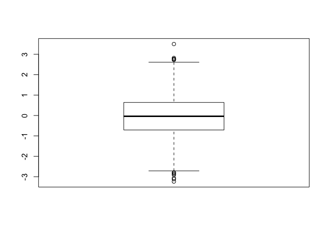<!-- -->

``` r
hist(x)
rug(x)
```

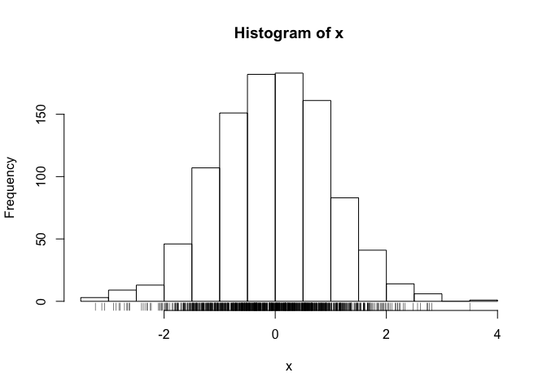<!-- -->

``` r
# The most important measurement should exploit the highest ranked encoding possible

# Lab: Section 2 Scatterplots
# let's read out input files first 

read.table("bimm143_05_rstats/weight_chart.txt", header = TRUE)
```

    ##    Age Weight
    ## 1    0    3.6
    ## 2    1    4.4
    ## 3    2    5.2
    ## 4    3    6.0
    ## 5    4    6.6
    ## 6    5    7.2
    ## 7    6    7.8
    ## 8    7    8.4
    ## 9    8    8.8
    ## 10   9    9.2

``` r
baby <- read.table("bimm143_05_rstats/weight_chart.txt", header = TRUE)

# Plotting weight_chart.txt , Section 2A

plot(baby$Age, baby$Weight, type = "o", pch = 15, cex = 1.5, lwd = 2, ylim = c(2,10), 
     xlab = "Months", ylab = "kg", main = "Baby weight with Age")
```

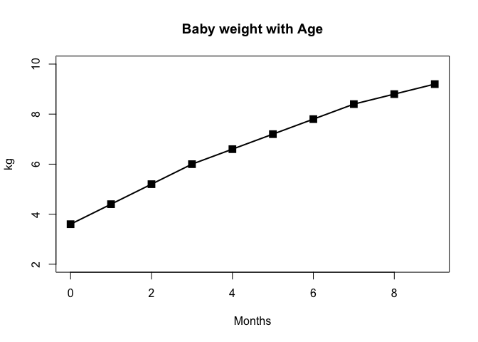<!-- -->

``` r
plot(1:5, pch = 1:5, cex = 1:5)
```

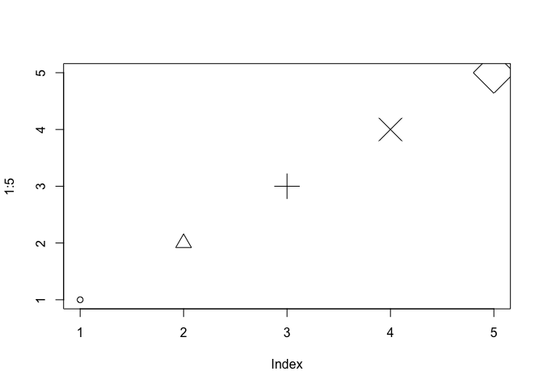<!-- -->

``` r
# Barry's plot: 
plot(baby$Age, baby$Weight, typ="o", 
     pch=15, cex=1.5, lwd=2, ylim=c(2,10), 
     xlab="Age (months)", ylab="Weight (kg)", 
     main="Baby weight with age", col="blue")
```

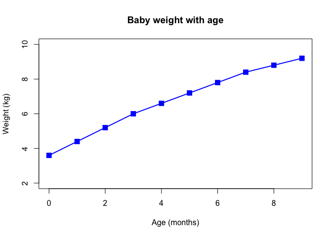<!-- -->

``` r
# Section 2B
read.delim("bimm143_05_rstats/feature_counts.txt")
```

    ##                    Feature Count
    ## 1            Messenger RNA 79049
    ## 2         Coding Sequences 50770
    ## 3                    Genes 32029
    ## 4            Transfer RNAs 26248
    ## 5              CpG islands 13840
    ## 6              Pseudogenes  5195
    ## 7               Micro-RNAs  1638
    ## 8     Small nucleolar RNAs  1602
    ## 9       Small nuclear RNAs  1431
    ## 10       Miscellaneous RNA   491
    ## 11 Immunoglobulin Segments   474
    ## 12          Ribosomal RNAs   341

``` r
# can also do...
mouselec5ex <- read.table("bimm143_05_rstats/feature_counts.txt", sep="\t", header=TRUE)
mouselec5 <- read.delim("bimm143_05_rstats/feature_counts.txt")
barplot(mouselec5$Count)
```

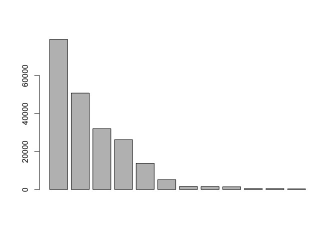<!-- -->

``` r
barplot(mouselec5$Count, names.arg = mouselec5$Feature, horiz = TRUE, ylab = "", 
        main = "Number of features in the mouse GRCm38 genome", las = 1, xlim = c(0,80000))
# par(mar) controls the numerical vector of the form c(bottom, left, top, right)
# do par(mar) before putting the box plot
par()$mar
```

    ## [1] 5.1 4.1 4.1 2.1

``` r
par(mar = c(3.1 , 11.1, 4.1, 2))
barplot(mouselec5$Count, names.arg = mouselec5$Feature, horiz = TRUE, ylab = "", 
        main = "Number of features in the mouse GRCm38 genome", las = 1, xlim = c(0,80000))
```

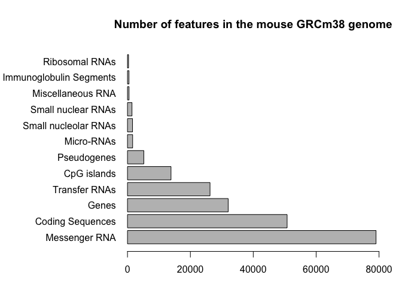<!-- -->

``` r
#Barry's 
par(mar=c(5, 11, 2, 2))
barplot(mouselec5$Count, names.arg = mouselec5$Feature, horiz = TRUE, las = 1, 
        main = "Number of features in the mouse GRCm38 genome", xlim = c(0,80000))
```

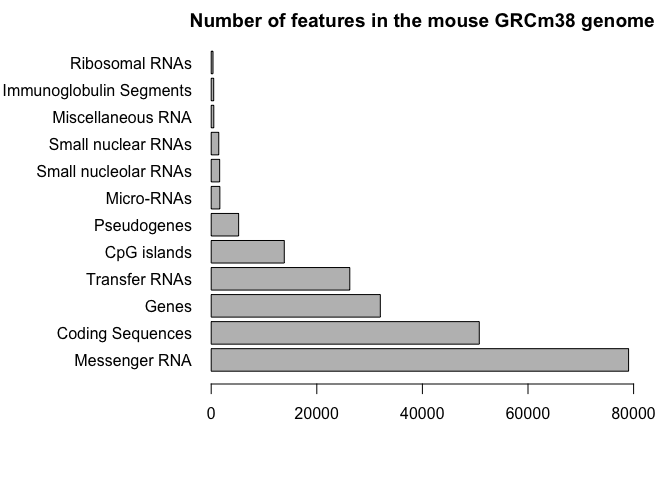<!-- -->

``` r
# Section 2C optional --> already did a histogram
x <- c(rnorm(10000),rnorm(10000)+4)
hist(x, breaks=80)
```

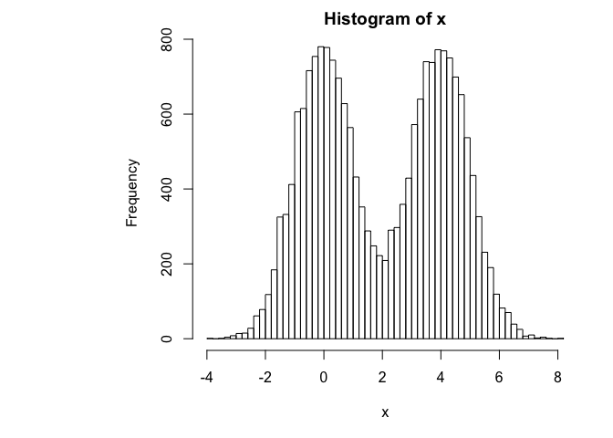<!-- -->

``` r
# Section 3A
read.csv2("bimm143_05_rstats/male_female_counts.txt", header = TRUE)
```

    ##     Sample.Count
    ## 1     D1 Male\t2
    ## 2   D1 Female\t1
    ## 3     D2 Male\t2
    ## 4   D2 Female\t3
    ## 5     D3 Male\t3
    ## 6   D3 Female\t6
    ## 7     D4 Male\t5
    ## 8  D4 Female\t10
    ## 9     D5 Male\t9
    ## 10 D5 Female\t18

``` r
read.delim("bimm143_05_rstats/male_female_counts.txt", header = TRUE)
```

    ##       Sample Count
    ## 1    D1 Male     2
    ## 2  D1 Female     1
    ## 3    D2 Male     2
    ## 4  D2 Female     3
    ## 5    D3 Male     3
    ## 6  D3 Female     6
    ## 7    D4 Male     5
    ## 8  D4 Female    10
    ## 9    D5 Male     9
    ## 10 D5 Female    18

``` r
mflec5 <- read.delim("bimm143_05_rstats/male_female_counts.txt", header = TRUE)
barplot(mflec5$Count, names.arg = mflec5$Sample, col = rainbow(nrow(mflec5)), ylab = "Count", las = 2)

# or...
barplot(mflec5$Count, names.arg = mflec5$Sample, col = rainbow(10), ylab = "Count", las = 2)
```

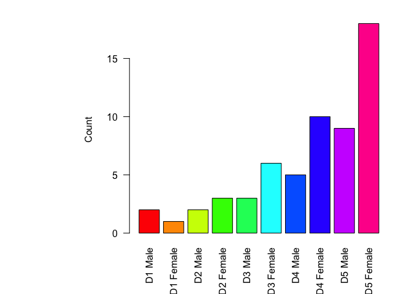<!-- -->

``` r
#col is for columns and las changes label orientation

par(mar = c(3, 5, 4, 7))
barplot(mflec5$Count, names.arg = mflec5$Sample, col = c("blue2", "red2"), 
        ylab = "Count", las = 2)
```

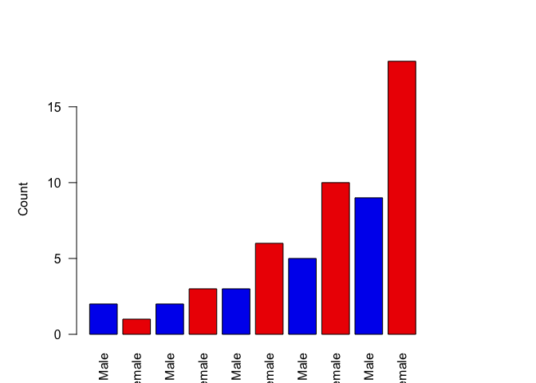<!-- -->

``` r
# Section 3B
geneslec5 <- read.delim("bimm143_05_rstats/up_down_expression.txt")
nrow(geneslec5)
```

    ## [1] 5196

``` r
table(geneslec5$State)
```

    ## 
    ##       down unchanging         up 
    ##         72       4997        127

``` r
plot(geneslec5$Condition1, geneslec5$Condition2, col=geneslec5$State, xlab = "Expression Condition 1", 
     ylab = "Expression Condition 2")
```

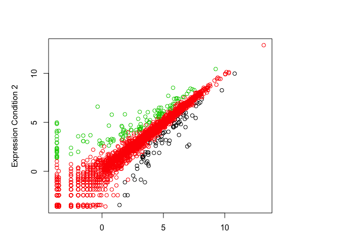<!-- -->

``` r
palette()
```

    ## [1] "black"   "red"     "green3"  "blue"    "cyan"    "magenta" "yellow" 
    ## [8] "gray"

``` r
# Run levels() on the State column. 
levels(geneslec5$State)
```

    ## [1] "down"       "unchanging" "up"

``` r
palette(c("blue", "grey", "red"))
plot(geneslec5$Condition1, geneslec5$Condition2, col=geneslec5$State, xlab = "Expression Condition 1", 
     ylab = "Expression Condition 2")
```

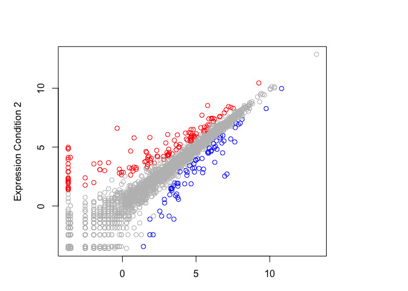<!-- -->

``` r
# Section 3C plotting expression vs gene regulation
read.delim("bimm143_05_rstats/expression_methylation.txt")
```

    ##                  X  expression promoter.meth   gene.meth
    ## 1            Aars2  3.75299720    3.55555560  85.3109200
    ## 2           Aarsd1  5.33575200   10.90277800  35.2551700
    ## 3            Aasdh  5.60503300    0.99358976  89.6558460
    ## 4         Aasdhppt  3.84279420    5.50245140  40.6645600
    ## 5             Aass  4.48465870    0.00000000  78.5156250
    ## 6             Aatf  6.16347800    0.46620050  81.7405500
    ## 7             Aatk -0.69325894    0.73529410   3.7727870
    ## 8         AB041803 -2.43022470    1.13636360   2.1280000
    ## 9         AB041806 -4.16719000    0.00000000   1.1672909
    ## 10        AB124611  0.84279400   96.59588000  83.6065800
    ## 11            Abat  3.27943370    0.65789473  56.5893800
    ## 12           Abca1  7.01271900    0.42735046   7.4488835
    ## 13          Abca12 -0.31474733    0.83333330  28.5724660
    ## 14          Abca13  1.65723820   95.52846000  92.0398400
    ## 15          Abca14 -1.69325900    1.47058820  17.6352800
    ## 16          Abca15 -1.20783210    0.82352940  15.5163930
    ## 17          Abca16  3.76617260    6.52173900  57.3751870
    ## 18          Abca17 -0.43022457    0.78726970   2.7419900
    ## 19           Abca2  8.39526500    1.65525110  87.2885100
    ## 20           Abca3  7.55987930    0.96926720  54.5029030
    ## 21           Abca4  1.15473800    0.91324210  77.4009400
    ## 22           Abca5  4.69561900    1.12745110  65.1148760
    ## 23           Abca6 -2.01518700    0.92592590   4.1559343
    ## 24           Abca7  2.61416960    1.66666660  81.9019850
    ## 25          Abca8a  3.10375400    0.00000000  10.1351320
    ## 26          Abca8b -4.01518730    0.00000000   6.1762543
    ## 27           Abca9 -1.69325900    0.00000000  67.4175100
    ## 28          Abcb10  5.29996250    1.16666670  79.8390600
    ## 29          Abcb11  1.02920720   91.66666400  23.4358860
    ## 30          Abcb1a  3.33354120    0.68965520  41.4842760
    ## 31          Abcb1b -0.20783208    2.62711860  83.3451160
    ## 32           Abcb4  1.81770300    0.75075080  72.8271900
    ## 33           Abcb5  1.79216790    0.00000000  67.8748300
    ## 34           Abcb6  7.54753200   16.00635000  69.1462400
    ## 35           Abcb7  4.87355600    0.00000000  85.9526100
    ## 36           Abcb8  4.73300600    1.30952380  53.3770140
    ## 37           Abcb9  5.42568200    2.38095240  88.5253500
    ## 38           Abcc1  8.13931500    1.98412700  89.3527900
    ## 39          Abcc10  7.14971970   10.43103400  76.4625850
    ## 40          Abcc12 -3.01518700   13.88888900   3.4212554
    ## 41           Abcc2 -3.01518700    7.89473700   6.4461937
    ## 42           Abcc3 -1.20783210    2.96610160  43.4428020
    ## 43           Abcc4  4.65014900    0.00000000  65.9554900
    ## 44           Abcc5  7.29996250    0.13071896  86.1845300
    ## 45           Abcc6  2.27021530    3.22580650  13.7921330
    ## 46           Abcc8 -1.20783210    0.00000000   4.4011400
    ## 47           Abcc9 -0.01518704    1.13636360   5.8490340
    ## 48           Abcd1  7.92842630   14.89675500  80.7091100
    ## 49           Abcd2 -2.43022470    0.24691360  11.1171180
    ## 50           Abcd3  6.48565500    0.90909094  69.9519800
    ## 51           Abcd4  2.69905850   96.89474000  95.0150200
    ## 52           Abce1  6.39208030   13.04347800  69.3132400
    ## 53           Abcf1  7.38835760    0.00000000  69.7120100
    ## 54           Abcf2  6.81453600    0.37878790  71.8470800
    ## 55           Abcf3  7.19913200    3.37837840  46.6365620
    ## 56           Abcg1  3.59952280    0.00000000  82.3135800
    ## 57           Abcg2  3.19426660   14.10256500   5.6264040
    ## 58           Abcg3 -4.16719000    2.93103460  10.9862230
    ## 59           Abcg4 -1.43022450   69.40000000  35.7970920
    ## 60           Abcg5 -4.16719000    2.79166670   2.3911254
    ## 61           Abcg8 -0.55575540    1.94805190   2.0837173
    ## 62           Abhd1  2.28859380    0.78828830  77.5600700
    ## 63          Abhd10  5.02647200    1.40845070  69.5614100
    ## 64          Abhd11  2.56977530    8.13915900  41.4684830
    ## 65          Abhd12  6.67568400    1.70454550  83.8131200
    ## 66         Abhd12b -4.16719000    6.00000000  35.2238120
    ## 67          Abhd13  5.64123770    0.84635420  43.9302020
    ## 68         Abhd14a  2.87963080   14.85175300  32.6262630
    ## 69         Abhd14b -1.20783210    7.18958600  40.0483100
    ## 70          Abhd15  0.15473793    1.53985510  52.4748460
    ## 71         Abhd16a  5.72796440    1.46520160  76.3562200
    ## 72         Abhd16b -2.43022470    1.78571430   4.7824306
    ## 73           Abhd2  5.26326230    1.57041540  67.7539600
    ## 74           Abhd3  1.07227580    0.00000000  76.3107000
    ## 75           Abhd4  5.97916600    2.11864420  71.0180300
    ## 76           Abhd5  4.28402100    1.55367240  58.3091300
    ## 77           Abhd6  2.19426630    1.49812750  89.9016400
    ## 78           Abhd8  2.97349790    0.10989012  20.3234020
    ## 79            Abi1  5.58843950    0.00000000  70.6731400
    ## 80            Abi2  6.39949800    0.74074070  74.4367750
    ## 81            Abi3  2.09333730    2.60416670   1.1589404
    ## 82          Abi3bp  5.42360450    7.22222230  74.0166500
    ## 83            Abl1  7.13836500    2.64026430  86.7186200
    ## 84            Abl2  8.28144300    1.93650800  87.5040700
    ## 85          Ablim1  7.30166050    2.78947380  53.1049730
    ## 86          Ablim2  2.96209290    0.15748031  90.9430800
    ## 87          Ablim3  2.13456000   19.24657400  83.8153500
    ## 88             Abo  2.44424460    4.66666700  12.7168940
    ## 89            Abp1 -4.16719000   86.47870000  33.7003700
    ## 90            Abpa -4.16719000   10.83333400  16.9444450
    ## 91            Abpb -4.16719000   21.83333400   4.9382720
    ## 92            Abpd -4.16719000   25.00000000   2.0408165
    ## 93            Abpe -4.16719000    9.02777800  27.9166680
    ## 94            Abpg -4.16719000    5.71428600   2.0833333
    ## 95            Abph -4.16719000   13.73626300  14.9122810
    ## 96            Abpz -4.16719000    8.33333300   7.5000000
    ## 97             Abr  6.33021830    0.91888470  73.3066500
    ## 98            Abra -4.16719000    0.00000000   0.6521739
    ## 99            Abt1  5.65014900    0.53191490  52.3232350
    ## 100          Abtb1  4.66780760    0.43402780  68.6846160
    ## 101          Abtb2  6.57071500    0.00000000  80.2096200
    ## 102     AC141469.5  8.66824600    7.81523230  87.0437600
    ## 103     AC152164.1 -4.16719000   82.50000000  19.5541970
    ## 104         Acaa1a  2.25159960    7.06293800  65.2478800
    ## 105         Acaa1b -4.16719000    2.12121220  21.9964470
    ## 106          Acaa2  3.73300580    4.74137930  70.3463440
    ## 107          Acaca  4.44424440   12.31656200  70.5520550
    ## 108          Acacb  5.08284500    8.48809500  93.2070800
    ## 109         Acad10  3.26093720    1.41485920  91.2222900
    ## 110         Acad11  5.98340370   18.33333400  83.2467960
    ## 111         Acad12  2.68525270   11.92080400  58.8171040
    ## 112          Acad8  3.46054650   11.37777800  77.2294400
    ## 113          Acad9  5.53748200    5.55555530  82.6401100
    ## 114          Acadl  2.67131350    1.61403520  43.3016930
    ## 115          Acadm  2.85517760    0.37878788  30.9296740
    ## 116          Acads  4.82401660    7.19047640  71.8644900
    ## 117         Acadsb  4.33354100    1.96606790  75.3267200
    ## 118         Acadvl  5.93464000    1.32275140  76.4486100
    ## 119           Acan  0.30674110    1.11940300   3.1999920
    ## 120          Acap1  0.30674110    6.66666650  26.7913880
    ## 121          Acap2  5.58843950    1.64835170  70.8545600
    ## 122          Acap3  6.07360100    2.11667920  61.5293050
    ## 123          Acat1  8.38034700    0.43290046  79.0046300
    ## 124          Acat2  3.46054650    1.64399100  61.6571040
    ## 125          Acat3  6.37067560    0.00000000  65.4589900
    ## 126          Acbd3  6.46560340    0.73529410  60.3905100
    ## 127          Acbd4 -0.84526205    1.06516290   1.5966387
    ## 128          Acbd5  3.47666600    2.78361320  61.0779300
    ## 129          Acbd6  6.73970030    1.46520160  76.2530400
    ## 130          Acbd7 -3.01518700    9.39716300  81.8415700
    ## 131          Accn1 -3.01518700    2.15053770   5.5672010
    ## 132          Accn2  0.68525267    0.00000000  24.4472400
    ## 133          Accn3  0.93900925   82.75000000  93.2173800
    ## 134          Accn4 -2.43022470    1.89873420   9.2640690
    ## 135          Accn5 -0.55575540    2.24358990   7.8463200
    ## 136           Accs -1.69325900   31.57894700  74.2496800
    ## 137          Accsl  0.15473793    0.00000000  79.8515850
    ## 138            Acd  6.31011800   14.39261400  24.9081380
    ## 139            Ace -0.10829648    0.79545456  10.4942530
    ## 140           Ace2 -4.16719000   10.41666700  14.2119000
    ## 141           Ace3 -4.01518730   21.78571500   3.2767134
    ## 142          Acer1 -2.43022470    5.00000000   2.7032378
    ## 143          Acer2  1.41107770   26.35262700  25.2104600
    ## 144          Acer3  3.52397160    3.94736840  40.6223870
    ## 145           Ache -4.16719000    2.12418300   1.3905039
    ## 146          Acin1  7.82677030   20.20202000  78.7019350
    ## 147           Acly  7.69734000    0.34722224  86.6032100
    ## 148          Acmsd -1.69325900    8.63095300  36.5844270
    ## 149           Acn9  1.47666610    1.16279070  83.2921800
    ## 150         Acnat1 -1.69325900    8.33333400   4.1968913
    ## 151         Acnat2 -4.16719000    0.00000000   6.2170550
    ## 152           Aco1  6.39738300    0.00000000  88.7974850
    ## 153           Aco2  7.13392500   18.25000000  83.9058200
    ## 154          Acot1 -4.01518730    1.14155260   1.9047620
    ## 155         Acot10  3.24220090    0.00000000   0.0000000
    ## 156         Acot11 -2.43022470    1.66666670  21.9235360
    ## 157         Acot12 -2.01518700    1.40151510   4.2026052
    ## 158         Acot13  2.65723820    4.67509940  75.7132700
    ## 159          Acot2 -0.10829648    7.52381000  46.5494800
    ## 160          Acot3 -4.01518730    0.00000000  46.4885700
    ## 161          Acot4 -4.01518730    7.79342800   5.0043488
    ## 162          Acot5 -4.01518730    0.64102566  24.2750000
    ## 163          Acot6 -1.01518700    0.00000000   2.0698780
    ## 164          Acot7  5.63047170    0.68139964  87.8596800
    ## 165          Acot8  3.77922900    5.33333350  53.8739740
    ## 166          Acot9  3.41944120    0.69182390  71.8086240
    ## 167          Acox1  6.17340200   14.62963000  64.6671400
    ## 168          Acox2 -4.16719000   96.66667000  38.6026230
    ## 169          Acox3  4.48465870    3.08219170  90.4570600
    ## 170          Acoxl  2.21363160   75.00000000  74.4864350
    ## 171           Acp1  3.62866930    2.03252030  80.0286100
    ## 172           Acp2  5.01271870    3.84615370  72.2113650
    ## 173           Acp5  0.37713045   48.35796400  56.2172160
    ## 174           Acp6  5.58472600    8.38383900  81.2452800
    ## 175          Acpl2  2.05090210    0.00000000   3.2224042
    ## 176           Acpp  0.56977540    1.17552340  22.8727190
    ## 177           Acpt  1.19426630   27.06632800  72.4003100
    ## 178            Acr -1.43022450    2.45791240   2.1801348
    ## 179          Acrbp  1.23274040   97.08333600  95.3895800
    ## 180          Acrv1 -4.16719000    7.14285700  18.6471880
    ## 181         Acsbg1  1.65723820    1.47058820   4.6131390
    ## 182         Acsbg2 -4.16719000    2.29885080   3.2073076
    ## 183          Acsf2 -0.55575540   99.00000000  96.8997040
    ## 184          Acsf3  5.22560450   31.29032300  88.1786200
    ## 185          Acsl1  7.04348130    0.73529410  79.2210700
    ## 186          Acsl3  4.95348000    0.00000000  66.8416440
    ## 187          Acsl4  3.68525300    1.82291660  85.6999100
    ## 188          Acsl5  0.50837500    3.52564120   7.9347060
    ## 189          Acsl6  3.24220090   21.66666800  39.8257030
    ## 190          Acsm1 -3.01518700    3.76811620  21.6504820
    ## 191          Acsm2 -4.16719000    0.00000000  31.7820200
    ## 192          Acsm3  3.46054650    6.92956350  78.5256500
    ## 193          Acsm4 -3.01518700   29.93333400  52.8200870
    ## 194          Acsm5 -4.16719000   89.85508000  60.8492470
    ## 195          Acss1 -2.01518700    2.32558130   2.9533489
    ## 196          Acss2  5.74636400    1.06995890  75.0524700
    ## 197          Acss3 -4.01518730    0.22675738   7.1735764
    ## 198          Acta1 -4.16719000   34.72222000  13.5619510
    ## 199          Acta2  0.07227574    3.41880370   2.3185732
    ## 200           Actb  7.21723400    0.65104170  28.5064950
    ## 201         Actbl2 -4.16719000    5.37766900   2.1825397
    ## 202          Actc1 -4.16719000    3.56321860   2.3433585
    ## 203          Actg1  7.05694530    0.98870057  31.4814820
    ## 204          Actg2  1.65723820    1.01010110  78.0728300
    ## 205         Actl6a  5.87203400   43.11904000  83.0524140
    ## 206         Actl6b -2.43022470    0.42955327   2.4370887
    ## 207         Actl7a -4.16719000   94.44445000  97.4359000
    ## 208         Actl7b -4.16719000   50.79365500   3.3603340
    ## 209          Actl9 -4.16719000    3.33333350   6.0185184
    ## 210          Actn1  4.13456000    2.04918030  78.7625050
    ## 211          Actn2  0.30674110    3.43137260   8.2036590
    ## 212          Actn3  3.68525300    1.49154590  80.9145100
    ## 213          Actn4  7.91296100    3.91737900  84.0909700
    ## 214         Actr10  6.34126500    4.11764700  83.8028800
    ## 215         Actr1a  6.68785140    0.97222227  81.3892300
    ## 216         Actr1b  6.62324860   98.91304000  80.0800100
    ## 217          Actr2  3.77271560    5.24809200  74.2839000
    ## 218          Actr3  4.63586470    2.95698950  63.7168700
    ## 219         Actr3b  3.17463780    1.73160180  90.6621400
    ## 220          Actr5  4.33354100    3.78787880  67.0646200
    ## 221          Actr6  3.94481500    0.73684210  69.4777760
    ## 222          Actr8  6.26558400    4.97076030  79.0281140
    ## 223         Actrt1 -4.16719000   80.47620000  92.2305760
    ## 224         Actrt2 -4.16719000    2.47747760   2.6403060
    ## 225          Acvr1  2.77922870    0.33783785  53.2896700
    ## 226         Acvr1b  4.51619430    1.73860920  80.9295700
    ## 227         Acvr1c -4.01518730    1.55038770   9.4857855
    ## 228         Acvr2a  3.62143750    0.92592597  72.2968300
    ## 229         Acvr2b  4.38995460    0.83333330  54.8138000
    ## 230         Acvrl1 -0.43022457    1.16959070   2.1014495
    ## 231           Acy1  2.97349790   29.73167200  53.1639180
    ## 232           Acy3 -1.69325900    8.26666600   5.4674797
    ## 233          Acyp1  2.21363160    0.00000000  34.4540200
    ## 234          Acyp2 -4.16719000   97.56097400  89.6479300
    ## 235            Ada -1.01518700    0.00000000  80.0155700
    ## 236          Adad1  5.70932670    1.26582280   5.7446580
    ## 237          Adad2  8.22351600    2.47747760  68.1128800
    ## 238           Adal  5.04009530   18.70466200  66.7282700
    ## 239         Adam10  6.21363200    2.21183800  76.3529600
    ## 240         Adam11  0.23274046    5.11111100   4.3383870
    ## 241         Adam12  5.91555000   51.86274300  88.6119000
    ## 242         Adam15  3.27021500    0.53846157  63.4864350
    ## 243         Adam17  5.80977200    0.34722220  74.2044300
    ## 244         Adam18 -4.16719000    1.32978730   6.1812930
    ## 245         Adam19  1.02920720    3.33333330   2.8477793
    ## 246         Adam1a  1.27021520   95.09804500  98.2608700
    ## 247         Adam1b -1.20783210   98.08943000  94.0476200
    ## 248          Adam2 -4.16719000    0.87719303  21.6912270
    ## 249         Adam21 -4.16719000  100.00000000  82.5378800
    ## 250         Adam22  5.67131400   96.66666000  84.4902800
    ## 251         Adam23  5.25860900    1.10091750  53.7364700
    ## 252         Adam24 -4.16719000   10.00000000   2.2988508
    ## 253         Adam25 -4.16719000    0.00000000   5.9259260
    ## 254        Adam26a -4.16719000   38.88889000   3.9181287
    ## 255        Adam26b -4.16719000   29.16666800   8.7681160
    ## 256         Adam28 -4.16719000    0.00000000  64.6342300
    ## 257         Adam29 -4.16719000   33.33333600  33.6785740
    ## 258          Adam3  1.37713040    1.42857150   4.8040420
    ## 259         Adam30 -4.01518730    0.87719300   1.6009852
    ## 260         Adam32 -3.01518700   99.76415000  72.5547300
    ## 261         Adam33 -1.43022450    0.31446543   2.8112738
    ## 262         Adam34 -4.16719000   18.48485000  20.1612700
    ## 263         Adam39 -4.16719000    0.00000000   1.0416667
    ## 264          Adam4 -4.16719000   96.42857000 100.0000000
    ## 265          Adam5 -0.69325894   14.58333500  56.3014700
    ## 266         Adam6a -4.16719000    3.50877210   2.6587303
    ## 267         Adam6b -4.16719000  100.00000000  96.4285700
    ## 268          Adam7 -4.16719000   29.54545400  72.8765500
    ## 269          Adam8  1.11409590   75.67567400  81.7185440
    ## 270          Adam9  4.95059730   14.75262800  93.0390500
    ## 271       Adamdec1 -3.01518700    7.76397500   8.1950850
    ## 272        Adamts1  2.32466300    0.88435380   1.5093538
    ## 273       Adamts10  1.84279400    1.07526890  27.3008040
    ## 274       Adamts12 -1.20783210    3.86904760  82.8076100
    ## 275       Adamts13 -2.01518700    1.72413790  10.0997960
    ## 276       Adamts14 -4.01518730    2.06093200   3.5144985
    ## 277       Adamts15  1.07227580    1.55844150   3.1598017
    ## 278       Adamts16  2.84279400    1.99275370   4.2152944
    ## 279       Adamts17  3.14468460    0.79365080  87.2417700
    ## 280       Adamts18  3.35985230   97.94118000  96.0781200
    ## 281       Adamts19  2.34236500    0.20491803  38.8687100
    ## 282        Adamts2  0.79216790    2.27272730   3.7669346
    ## 283       Adamts20 -0.31474733    1.85185190   2.5347884
    ## 284        Adamts3  3.21363160    1.00250640  84.3801600
    ## 285        Adamts4  0.93900925   34.44444700  47.4544000
    ## 286        Adamts5 -4.01518730    1.71985820   3.0888030
    ## 287        Adamts6  2.25159960   16.72514700  66.3059700
    ## 288        Adamts7  1.15473800    1.33333340  23.0389820
    ## 289        Adamts8  2.39420400    0.58823530   3.4407140
    ## 290        Adamts9  2.23274040    0.75255100  11.4561000
    ## 291       Adamtsl1  4.11923930    0.00000000  47.9529900
    ## 292       Adamtsl2 -4.16719000    1.77304970   5.8616843
    ## 293       Adamtsl3  0.07227574    0.43010756   5.7113380
    ## 294       Adamtsl4 -0.20783208   77.08920000  76.1995400
    ## 295       Adamtsl5 -4.01518730    0.69444450   1.1713885
    ## 296          Adap1 -4.16719000    1.13960120   4.6000620
    ## 297          Adap2 -1.20783210    1.47058830   5.1949615
    ## 298           Adar  6.32577560    0.33333337  79.2754400
    ## 299         Adarb1  5.97065500    5.49342100  85.7914700
    ## 300         Adarb2  2.69905850    0.00000000  43.3655600
    ## 301          Adat1  5.24925570   33.80952500  70.3449550
    ## 302          Adat2  3.00718070   23.18181800  34.0745280
    ## 303          Adat3  2.81770300    1.17370890  51.7264060
    ## 304            Adc  3.09333730    0.42372882   3.4897160
    ## 305          Adck1  6.06296350    0.00000000  91.0364000
    ## 306          Adck2  5.79377700    0.48309183  52.1872500
    ## 307          Adck3  8.81710900    0.00000000  65.8825000
    ## 308          Adck4  5.40687750    4.76190470  69.9612800
    ## 309          Adck5  3.83656220   24.83333400  80.9060100
    ## 310          Adcy1  3.07227560    0.57851240  79.5483550
    ## 311         Adcy10  5.07227560    9.96376800  22.6504080
    ## 312          Adcy2  0.98481300    0.14749263   6.6049476
    ## 313          Adcy3  4.00718070    3.41530060  24.7423930
    ## 314          Adcy4 -4.16719000    0.44642857   2.0764205
    ## 315          Adcy5  3.14468460    0.32894737  80.9816600
    ## 316          Adcy6  5.27943370   96.01450000  97.3150900
    ## 317          Adcy7  1.53940180    2.81690140  12.6508340
    ## 318          Adcy8  3.53940200   21.43410900  39.6237950
    ## 319          Adcy9  5.49854040    2.80112050  84.8581000
    ## 320        Adcyap1 -4.16719000    2.11864400   4.8863635
    ## 321      Adcyap1r1 -4.01518730   60.52380800  83.5312040
    ## 322           Add1  7.28402100    3.25925950  81.8887700
    ## 323           Add2  6.16844800  100.00000000  97.6811100
    ## 324           Add3  5.47666600    0.00000000  76.1008760
    ## 325           Adh1 -0.20783208    0.00000000   2.1527780
    ## 326           Adh4  0.30674110   66.42157000  26.3297860
    ## 327           Adh5  6.53748230   34.79437300  79.9698940
    ## 328          Adh6a -4.16719000    5.00000000   2.5874126
    ## 329          Adh6b -4.01518730    1.04166660   2.5000000
    ## 330       Adh6-ps1 -4.16719000    4.76190500   2.8917263
    ## 331           Adh7 -4.16719000    0.81699350  18.9039130
    ## 332         Adhfe1 -4.16719000    5.48245600  78.1301600
    ## 333           Adi1  3.89770220    2.64069270  48.2631570
    ## 334           Adig -4.16719000   84.59460000  47.2777750
    ## 335         Adipoq -4.16719000    2.26757380   5.1879090
    ## 336        Adipor1  6.95851040    2.31023120  61.5859680
    ## 337        Adipor2  7.17895400    0.79365087  40.4638020
    ## 338            Adk  5.41944100    1.35802470  82.4515840
    ## 339            Adm -1.20783210   86.43092000  80.8361050
    ## 340           Adm2 -4.16719000    6.16071400  38.4761920
    ## 341           Adnp  7.85748770   18.38148700  63.4121670
    ## 342          Adnp2  7.07955030    1.07526890  70.0370000
    ## 343            Ado  6.13456000    0.17543861   7.1025777
    ## 344         Adora1  2.72628000    0.87719300  10.3081720
    ## 345        Adora2a -3.01518700    4.10958900   2.7922258
    ## 346        Adora2b  2.11409600    1.22739030  68.6856200
    ## 347         Adora3 -1.69325900    2.95698950   5.3267170
    ## 348          Adpgk  6.06696200    0.00000000  69.0603800
    ## 349          Adprh  6.57727000    0.85669786  76.5294800
    ## 350        Adprhl1 -4.16719000   48.98990200  12.4608090
    ## 351        Adprhl2  3.71273330    3.78817770  52.3115100
    ## 352         Adra1a -1.43022450    1.19047620   4.2002826
    ## 353         Adra1b -2.43022470    0.00000000   4.0526660
    ## 354         Adra1d -4.16719000    1.53846160   1.6232964
    ## 355         Adra2a -0.84526205    2.07717590   0.2918587
    ## 356         Adra2b -4.16719000   10.22321400   2.0190477
    ## 357         Adra2c -2.43022470    2.27799220   0.6725480
    ## 358          Adrb1 -4.16719000    2.17013900   0.4254254
    ## 359          Adrb2 -3.01518700    0.70921993   2.1929827
    ## 360          Adrb3 -4.01518730   49.78070400  12.8319980
    ## 361         Adrbk1  5.33354100    2.93765000  76.2685900
    ## 362         Adrbk2  2.61416960    2.08333330   4.0058675
    ## 363          Adrm1  4.62505770   13.74278450  38.8821140
    ## 364           Adsl  6.16968800    0.32242063  81.3714700
    ## 365           Adss  7.60960800    1.93602690  54.2641400
    ## 366         Adssl1 -0.69325894    1.48514850  76.9055500
    ## 367          Aebp1  2.28859380    1.23456790  60.6398400
    ## 368          Aebp2  6.15973900   12.82608700  56.1730400
    ## 369            Aen  7.67917100    3.20512840  38.9960480
    ## 370            Aes  5.05895420    2.31374840  41.1670400
    ## 371       AF064781  0.15473793    3.35411980  13.8622800
    ## 372       AF085738  7.66780700   65.00000000  68.1077200
    ## 373       AF251705 -4.01518730    2.94117640   3.9682540
    ## 374       AF366264 -4.16719000   98.38710000  87.1705500
    ## 375       AF529169 -4.16719000    0.60975610   3.0890079
    ## 376          Afap1  1.47666610    0.24691358  72.2965800
    ## 377        Afap1l1  1.44424460    1.77777790  14.8008670
    ## 378        Afap1l2 -0.55575540    1.94647220  82.6004640
    ## 379           Aff1  3.36851720    0.00000000  74.2180940
    ## 380           Aff2  0.98481300    1.66666670  38.0252760
    ## 381           Aff3  6.75382400    7.49158300  72.9471900
    ## 382           Aff4  6.69561960    2.47723150  77.1689450
    ## 383         Afg3l1  6.10893440   14.51048900  81.3902600
    ## 384         Afg3l2  7.91518070    0.55031450  80.1301960
    ## 385            Afm -4.16719000   13.88888900  70.3507460
    ## 386          Afmid  4.22798700    2.42753620  67.2421950
    ## 387            Afp -4.01518730   98.38710000  81.3674400
    ## 388          Aftph  7.05426260    1.01010100  73.1242400
    ## 389            Aga  3.95635680    9.72222200   8.8543660
    ## 390          Agap1  8.66209200    0.57575756  86.5949860
    ## 391          Agap2 -1.20783210    1.81818190  13.4321880
    ## 392          Agap3  6.47064200    0.61349696  79.8212100
    ## 393          Agbl1 -4.16719000    9.09090900  53.1265950
    ## 394          Agbl2  3.79859420    5.12820530  19.3956450
    ## 395          Agbl3  5.57727000    8.85714200  29.0145660
    ## 396          Agbl4  1.11409590    2.47695850  27.1159930
    ## 397          Agbl5  6.63676170    0.00000000  69.3803500
    ## 398           Ager -1.20783210   47.04545600  83.9916700
    ## 399          Agfg1  6.86056300    0.53763443  68.4710850
    ## 400          Agfg2  3.65014890    0.48913044  85.1182000
    ## 401          Aggf1  5.83343600    1.20481930  78.0977900
    ## 402            Agk  0.93900925   55.66280700  92.8862200
    ## 403            Agl  7.52977750    0.44642857  86.0762700
    ## 404          Agmat -4.16719000    0.00000000  26.2417900
    ## 405           Agmo -4.16719000    1.23456800  28.3228030
    ## 406         Agpat1  7.86439660    1.91256830  57.2845500
    ## 407         Agpat2  3.81770280   19.64419700  53.0849900
    ## 408         Agpat3  6.70762060    0.97087380  79.2557900
    ## 409         Agpat4 -2.01518700    1.65584410  26.2437300
    ## 410         Agpat5  6.26093770    2.89617500  73.0044800
    ## 411         Agpat6  6.50935460    1.14942540  49.7105500
    ## 412         Agpat9  0.89170355    0.80645160   3.9960442
    ## 413         Agphd1  2.53940180    1.17370890  73.7545500
    ## 414           Agps  5.73132750    0.64655170  73.3646000
    ## 415           Agr2 -4.16719000    0.46511630   4.3103447
    ## 416           Agr3  2.61416960    1.38888900  77.2020300
    ## 417           Agrn  8.38596000    1.80890520  84.2156100
    ## 418           Agrp -1.20783210   98.55073000  22.3971200
    ## 419            Agt -4.16719000   21.43424000  24.4085770
    ## 420        Agtpbp1  7.32799860    6.53775360  71.6612240
    ## 421         Agtr1a -1.43022450    2.60416670  15.5113170
    ## 422         Agtr1b -4.16719000    1.79591830   5.0873413
    ## 423          Agtr2  1.44424460    1.78571430   1.9841270
    ## 424         Agtrap  5.40477300    2.53246760  34.3600200
    ## 425           Agxt -4.16719000    1.66666660   2.6710966
    ## 426          Agxt2 -4.16719000    1.73913040  25.4129870
    ## 427        Agxt2l1 -4.16719000  100.00000000  97.1512300
    ## 428        Agxt2l2  6.38889000    3.62533700  72.6668000
    ## 429         Ahctf1  7.36689660    0.61983470  75.6593400
    ## 430           Ahcy  4.82716300    0.37878790  72.5256400
    ## 431         Ahcyl1  7.83343600    5.30927850  59.1596400
    ## 432         Ahcyl2  7.15536360    0.65543073  82.3804400
    ## 433          Ahdc1  6.05761580    0.19047620  66.1235000
    ## 434           Ahi1  5.01823600    0.50847460  11.5177170
    ## 435          Ahnak  3.12436440    0.95785445  35.9971900
    ## 436         Ahnak2 -0.43022457    4.02777800   2.9821026
    ## 437            Ahr  5.93318000    7.27854600  69.1526500
    ## 438           Ahrr -2.43022470    1.44927540  13.5499470
    ## 439          Ahsa1  6.43911200    1.31578950  67.5615800
    ## 440          Ahsa2  7.78652140    0.73839664  53.9130440
    ## 441           Ahsg -4.16719000    1.19047630  45.4419900
    ## 442       AI115009 -4.16719000    0.00000000   1.7561809
    ## 443       AI118078  1.81770300    0.19379845  80.4401800
    ## 444       AI182371 -0.69325894   45.74074000  53.0868070
    ## 445       AI314180  9.04483300    1.70370380  65.8119400
    ## 446       AI314831 -0.55575540    0.35161746   3.2792356
    ## 447       AI314976  4.83343600    0.83697236  65.7873500
    ## 448       AI316807  5.31796840    0.65913373  68.7793000
    ## 449       AI317395 -1.43022450    1.25000000   3.9802340
    ## 450       AI413582  1.59952270    0.84745765  31.0818730
    ## 451       AI427809 -4.16719000   17.19461600   5.6410260
    ## 452       AI428936 -1.20783210   93.96930000  72.5076450
    ## 453       AI429214  3.16472200    2.18181820   0.9887006
    ## 454       AI462493  2.86745600   15.72916700  16.4192960
    ## 455       AI464131  0.50837500    0.80645160   1.4827328
    ## 456       AI467606  3.02920720    1.02564110  24.9598400
    ## 457       AI480526  4.47666600    0.18214938   1.1111112
    ## 458       AI480653  7.17833850    0.00000000  82.9672550
    ## 459       AI481877  6.00301300   17.30769200  78.6107900
    ## 460       AI504432 -4.16719000    0.00000000   4.9530520
    ## 461       AI507597 -4.16719000    2.77777800   0.6451613
    ## 462       AI593442  0.07227574    0.00000000   0.8240103
    ## 463       AI597468  4.48465870    6.21468970  47.9617300
    ## 464       AI597479  4.40266560    4.94791650  70.1154400
    ## 465       AI606181  4.00718070   21.28472300  74.8000000
    ## 466       AI607873 -4.01518730    9.35374300   5.8689460
    ## 467       AI646023 -4.16719000    1.15248230   2.1072478
    ## 468       AI646519 -4.16719000    1.09395110   0.5128205
    ## 469       AI661453  0.37713045    4.81707330  16.9038850
    ## 470       AI662270 -4.16719000    3.70370360   3.5822024
    ## 471       AI747448 -4.16719000   25.00000000  11.8103695
    ## 472       AI836003 -2.43022470    1.54513900   2.4288619
    ## 473       AI837181  5.80977200    3.82413100  42.4867740
    ## 474       AI838599 -3.01518700   52.25559000  66.8760500
    ## 475       AI846148  5.75795200    0.45871560  67.6663200
    ## 476       AI847159 -4.16719000    3.01801820   3.5535867
    ## 477       AI848100  6.40687800    0.26246720  75.7126200
    ## 478       AI854517  4.68871640    1.61458340   6.7780104
    ## 479       AI854703  0.84279400   30.32407600  34.5533560
    ## 480       AI987944 -0.20783208    3.77358480  55.9413600
    ## 481          Aicda -4.16719000    4.00000000   3.2319390
    ## 482           Aif1 -2.43022470   77.14286000  94.9359900
    ## 483          Aif1l -0.84526205    0.35753575   2.1635644
    ## 484          Aifm1  6.82322930    8.03571400  87.8888850
    ## 485          Aifm2  4.32910870    3.66666700   7.9818300
    ## 486          Aifm3  6.45648800   18.41808100  11.7730270
    ## 487           Aig1  3.65723820    1.06382980  21.2962780
    ## 488           Aim1  3.59952280    0.00000000  73.3345600
    ## 489          Aim1l  3.12436440    1.20772950  13.4807580
    ## 490           Aim2 -2.01518700    3.80952400   4.3588314
    ## 491          Aimp1  5.16720720   11.80440800  88.6676500
    ## 492          Aimp2  6.25277000    7.57009360  63.8204960
    ## 493            Aip  4.61780830   19.11315000  46.7861440
    ## 494          Aipl1 -4.16719000    1.33333350   2.4715450
    ## 495           Aire -4.01518730   37.84562300  57.7896200
    ## 496           Airn  0.68525267  100.00000000  57.4336740
    ## 497          Ajap1 -4.16719000    0.74850297   3.7577722
    ## 498            Ak1 -3.01518700    7.01149460   2.7675781
    ## 499       AK129341  3.59214350    0.85714287  83.4634800
    ## 500       AK157302  1.30674100    4.00000000   5.0724640
    ## 501            Ak2  5.98622130    2.95238110  68.6324840
    ## 502            Ak3  3.19426660    0.32362460  39.3428300
    ## 503            Ak4  6.63137150    0.40740743  57.8255900
    ## 504            Ak5 -0.69325894    1.12359550  67.4147100
    ## 505            Ak7  1.62866910   93.15973000  86.8866500
    ## 506            Ak8  0.44424465   74.28448500  71.9073500
    ## 507          Akap1  7.17895400    2.64462800  77.5785500
    ## 508         Akap10  5.86132960    1.04166660  81.5714650
    ## 509         Akap11  8.78186700    1.23697920  80.3258200
    ## 510         Akap12  7.50100500   97.71689600  90.8559900
    ## 511         Akap13  7.20941800    0.40650410  89.4412600
    ## 512         Akap14 -3.01518700   96.96970000  96.3909300
    ## 513        Akap17b  8.10213200    0.00000000  62.7926980
    ## 514          Akap2  0.15473793    1.94444450  18.5084610
    ## 515          Akap3  2.92732740    0.00000000   4.7838345
    ## 516          Akap4 -1.43022450  100.00000000  97.1305850
    ## 517          Akap5  0.23274046   90.20264000  97.2272800
    ## 518          Akap6 -4.01518730   64.50397000  21.2095760
    ## 519          Akap7  3.19426660    4.16666700  81.8568300
    ## 520          Akap8  6.74053530    0.97323610  65.8373640
    ## 521         Akap8l  6.43808360    4.71014500  73.7500000
    ## 522          Akap9  7.54466800    0.00000000  86.5708500
    ## 523           Akd1  3.40266540    0.00000000  89.4496300
    ## 524        Akirin1  3.69217200    0.62500000  44.8609280
    ## 525        Akirin2  6.05895420    0.37037040  31.7839200
    ## 526           Akna  3.31572990    7.10784340  80.5331340
    ## 527         Aknad1 -4.16719000    0.00000000  80.4649660
    ## 528           Akp3 -4.16719000   11.31313100   8.6015770
    ## 529         Akr1a4  7.07028530    0.96153843  59.8085330
    ## 530        Akr1b10  1.23274040    2.72108860   8.1604610
    ## 531         Akr1b3  5.99184040    0.83333340  78.8466200
    ## 532         Akr1b7 -4.16719000    0.00000000   6.0119047
    ## 533         Akr1b8  0.07227574    0.00000000  87.7561650
    ## 534        Akr1c12 -4.16719000    0.00000000   1.1904762
    ## 535        Akr1c13 -4.16719000   16.04938300   5.8419247
    ## 536        Akr1c14 -0.84526205   13.03030400  45.5314300
    ## 537        Akr1c18 -4.16719000    1.96078440   1.6666667
    ## 538        Akr1c19 -4.01518730   90.27778000  50.0850300
    ## 539        Akr1c20 -4.16719000    0.00000000  12.9733690
    ## 540        Akr1c21 -4.16719000  100.00000000  97.9166700
    ## 541         Akr1c6 -4.16719000   27.77777900  30.1765200
    ## 542         Akr1cl  1.96209280    0.85470090  44.1666680
    ## 543         Akr1d1 -4.16719000   88.76812000  77.6282040
    ## 544         Akr1e1  2.32466300    0.00000000  35.7843130
    ## 545         Akr7a5  6.32466270   12.53230000  37.9653000
    ## 546           Akt1  6.71103140    2.10526320  69.8893360
    ## 547         Akt1s1  6.12564300   24.35897600  57.3386840
    ## 548           Akt2  4.77922870   14.56766900  87.8289500
    ## 549           Akt3  7.46408840    1.00210980  87.1460200
    ## 550          Aktip  6.91407100   46.06167200  77.0102500
    ## 551     AL808133.1 -4.16719000   11.73016000   7.4468083
    ## 552           Alad  6.36527400   10.16835000  83.7239600
    ## 553          Alas1  6.02920770    0.25641027  78.6317750
    ## 554          Alas2  1.86745610  100.00000000  97.8487240
    ## 555            Alb -1.69325900    1.31578950   6.1235957
    ## 556          Alcam  1.34236500    4.87804900   6.9261570
    ## 557       Aldh16a1  5.37283040   25.87719500  57.2305950
    ## 558       Aldh18a1  2.19426630    1.40118000  51.5182230
    ## 559        Aldh1a1  3.62143750   15.47619100  61.5569100
    ## 560        Aldh1a2  4.09333750    1.11731840  33.4490700
    ## 561        Aldh1a3 -1.43022450    0.26455030   3.0990690
    ## 562        Aldh1a7 -0.31474733   14.44444500   9.1303380
    ## 563        Aldh1b1  3.65014890    1.04497360   2.1638656
    ## 564        Aldh1l1  0.50837500    1.32275140  88.3602200
    ## 565        Aldh1l2  3.69217200   10.93896900  82.8433760
    ## 566          Aldh2  3.81136160    2.17391300  76.3886400
    ## 567        Aldh3a1 -2.43022470   12.05882400  22.6850100
    ## 568        Aldh3a2  4.91555000    3.38983060  62.0066260
    ## 569        Aldh3b1 -0.84526205    1.07305940  70.7624360
    ## 570        Aldh3b2 -4.16719000    0.95238096   0.3603604
    ## 571        Aldh4a1  1.23274040    1.08024690  77.6711900
    ## 572        Aldh5a1  3.84279420    1.16959070  22.9520930
    ## 573        Aldh6a1  5.37927600    5.20161300  42.0479470
    ## 574        Aldh7a1  5.85209130    7.85865000  59.2495500
    ## 575        Aldh8a1 -3.01518700    1.19047620  19.4015640
    ## 576        Aldh9a1  7.40845400   13.84180800  77.0212200
    ## 577          Aldoa  3.57727000   99.08163500  39.8074340
    ## 578       Aldoart1 -4.16719000    4.16666650   6.1640210
    ## 579       Aldoart2 -0.43022457    2.02614380   3.4490743
    ## 580          Aldob -0.69325894   81.59722000  18.1402440
    ## 581          Aldoc  0.07227574   90.82983400  87.8500000
    ## 582           Alg1  7.53700160    1.96721320  63.0448380
    ## 583         Alg10b  4.51619430    0.00000000  52.3484880
    ## 584          Alg11  4.35550070    0.40229887  59.2011830
    ## 585          Alg12  3.63586450    2.46305440  80.9278260
    ## 586          Alg13 10.24293700    0.59523815  73.0979300
    ## 587          Alg14  0.50837500    0.80459770  80.3792100
    ## 588           Alg2  5.09333750    6.11111100  63.7702940
    ## 589           Alg3  5.51619430    1.31944450  75.6666640
    ## 590           Alg5  4.63227130    0.51229510  70.8593440
    ## 591           Alg6  4.51229000    1.34831460  81.7530200
    ## 592           Alg8  6.48465870    1.87074850  87.8523900
    ## 593           Alg9  5.34894750   30.06410400  84.0913700
    ## 594            Alk -4.16719000    1.32275130   7.6903250
    ## 595         Alkbh1  4.30674100   11.91522800  73.6986000
    ## 596         Alkbh2  2.59952280    8.94179800  52.8318370
    ## 597         Alkbh3  4.62866930    0.86206895  87.3950040
    ## 598         Alkbh4  3.66429300   11.06158300  68.2495800
    ## 599         Alkbh5  8.81849400   24.02597200  27.2703510
    ## 600         Alkbh6  2.64302440    3.20754720  73.8833800
    ## 601         Alkbh7  2.47666600   24.44444700   6.8773950
    ## 602         Alkbh8  2.50837500    0.00000000  75.2977800
    ## 603           Allc -4.16719000    4.36507940   8.8563350
    ## 604          Alms1  7.32466270    0.93896720  82.2986900
    ## 605      Alms1-ps2 -4.16719000  100.00000000  86.3075560
    ## 606         Alox12 -4.16719000   98.24561000  76.9351900
    ## 607        Alox12b -4.16719000    5.47619060   2.4622536
    ## 608        Alox12e -4.16719000    0.28409090   1.6157163
    ## 609         Alox15 -1.01518700    1.08225110   1.7712843
    ## 610          Alox5  2.27021530    6.87134550   8.1057050
    ## 611        Alox5ap -0.69325894    0.00000000   4.0185420
    ## 612          Alox8 -4.16719000    1.78571430   2.3092370
    ## 613         Aloxe3  0.56977540    0.00000000   2.1593568
    ## 614           Alpi -2.43022470    7.50000000  10.2783610
    ## 615          Alpk1 -2.01518700    4.58333350   5.8634610
    ## 616          Alpk2  4.50051300    2.63157900   6.8237240
    ## 617          Alpk3  2.15473800    1.80180190   2.4795947
    ## 618           Alpl  1.91555040    0.21505377  31.9140510
    ## 619         Alppl2 -3.01518700    8.88888900  31.4739910
    ## 620           Als2  6.60686500    0.75187970  88.1218100
    ## 621         Als2cl  1.68525270    1.29629620  12.8207750
    ## 622       Als2cr11  1.73970040    1.33333340  44.5454560
    ## 623       Als2cr12 -4.16719000    3.12500000   6.8243785
    ## 624        Als2cr4  3.90367630   28.45528600  55.1808620
    ## 625           Alx1 -4.01518730    1.21212120  16.7476980
    ## 626           Alx3 -4.16719000    0.00000000   1.5265486
    ## 627           Alx4 -3.01518700    2.28758170   2.8103793
    ## 628          Amac1 -1.20783210    8.33333300   4.4000000
    ## 629          Amacr  4.95348000    0.95238100  59.3639830
    ## 630           Ambn -4.16719000    3.62318850   5.5034730
    ## 631           Ambp -4.16719000    8.87955300  16.2087080
    ## 632         Ambra1  7.50837500    0.30769232  84.6688500
    ## 633           Amd1  3.86745600    1.23762380  46.5767480
    ## 634           Amd2 -4.01518730   21.66666600  13.7254910
    ## 635         Amdhd1 -4.16719000    3.29651950   3.5645726
    ## 636         Amdhd2  4.35985230    5.83333400  35.7062500
    ## 637        Amd-ps3 -4.16719000    5.48780500   0.0000000
    ## 638          Amelx -4.16719000    0.00000000   4.1085270
    ## 639           Amfr  6.75795200    4.64285700  60.6923370
    ## 640            Amh -0.01518704   89.47369000  64.4161700
    ## 641          Amhr2  3.05090210    2.57352950   2.4931695
    ## 642         Amica1 -4.01518730   56.84210600  24.1854740
    ## 643         Amigo1  5.73300600    0.55555560  54.6972500
    ## 644         Amigo2  4.52008800    0.29239765   1.6145834
    ## 645         Amigo3  2.30674100   90.68100000  97.3939400
    ## 646        Ammecr1  4.72628000    1.52173910  79.0662400
    ## 647       Ammecr1l  6.92145060    1.30718960  62.7655940
    ## 648            Amn -4.16719000    4.37500000   1.0181383
    ## 649           Amn1  3.59952280    1.25152620  76.3851200
    ## 650           Amot  3.53940200    1.01449280  71.1732560
    ## 651         Amotl1  2.23274040    2.53623200  61.7805630
    ## 652         Amotl2  1.11409590    0.75581396   2.4070501
    ## 653          Ampd1 -4.01518730    5.00000000   1.5826842
    ## 654          Ampd2  3.77271560    3.14009670  70.3407200
    ## 655          Ampd3  3.83030300    4.38596500  81.1713800
    ## 656           Amph  1.27021520    0.42989420  47.1178100
    ## 657            Amt  2.09333730   13.37719300  46.3013150
    ## 658           Amtn -4.16719000   12.50000000   3.8603990
    ## 659           Amy1  3.36851720   90.90909000  32.1364900
    ## 660         Amy2a1 -4.16719000    3.57142850   0.0000000
    ## 661         Amy2a2 -4.16719000    3.57142850   0.0000000
    ## 662         Amy2a3 -4.16719000            NA  33.3333320
    ## 663         Amy2a5 -4.16719000            NA 100.0000000
    ## 664           Amz1 -3.01518700    4.16666700  25.1775570
    ## 665           Amz2  6.43396200    1.01010100  60.7665330
    ## 666         Anapc1  8.64903700   11.43527900  85.4015050
    ## 667        Anapc10  1.62866910    1.67892170  88.2864700
    ## 668        Anapc11  6.45241830   14.19701300  41.7283970
    ## 669        Anapc13  4.26558400   14.82478700  55.7004800
    ## 670        Anapc16  5.72290500    1.53153160  50.3163760
    ## 671         Anapc2  8.40661400    6.15384630  78.3878560
    ## 672         Anapc4  7.02236000    3.76623370  79.8769700
    ## 673         Anapc5  8.95653600    1.35135150  84.2993000
    ## 674         Anapc7  6.69991730    0.97826090  75.6705900
    ## 675            Ang -4.16719000    1.25000000  58.5440030
    ## 676           Ang2 -4.16719000   37.98245600  36.3636360
    ## 677           Ang4 -4.16719000    2.95698950  25.4246270
    ## 678           Ang5 -4.16719000    0.00000000   6.2925167
    ## 679           Ang6 -4.16719000    1.33333340   0.0000000
    ## 680         Angel1  7.13519500    1.77777790  69.0276200
    ## 681         Angel2  5.39420370    0.00000000  64.4937440
    ## 682         Angpt1 -0.20783208   16.78571500  53.9778200
    ## 683         Angpt2  1.86745610   98.71429000  88.1324840
    ## 684         Angpt4 -4.16719000    1.15942040   3.6349680
    ## 685        Angptl1 -3.01518700    8.33333300  92.7483800
    ## 686        Angptl2  1.44424460   96.46259000  85.5063200
    ## 687        Angptl3 -4.16719000  100.00000000  80.2607700
    ## 688        Angptl4  1.91555040    2.14285700   1.8445693
    ## 689        Angptl6  3.74636400   18.72549000  10.9452720
    ## 690        Angptl7 -3.01518700   94.59877000  96.6770200
    ## 691            Ank  3.67830000    1.36165580  84.0931000
    ## 692           Ank1  3.22321770    1.98412700  39.3836820
    ## 693           Ank2  2.85517760    3.05555580   7.6364100
    ## 694           Ank3  0.30674110   25.01984200  67.2759100
    ## 695          Ankar -0.20783208    5.88235300  43.1885720
    ## 696        Ankdd1a -4.01518730   32.58621000  83.7552200
    ## 697        Ankdd1b  2.98481300    0.90090096  15.1302000
    ## 698         Ankfn1 -2.43022470    0.00000000   4.3702917
    ## 699         Ankfy1  7.80778170    1.10294120  79.9144600
    ## 700         Ankhd1  7.60090260    2.01612900  71.1627100
    ## 701         Ankib1  6.55276870    3.14942550  74.1116000
    ## 702          Ankk1  0.68525267    1.47058820   5.0756307
    ## 703         Ankle1  3.68525300   54.09602400  85.7876740
    ## 704         Ankle2  7.59768150    1.12403110  54.5998300
    ## 705         Ankmy1 -1.01518700    2.96296300  87.0275340
    ## 706         Ankmy2  1.07227580    0.09523810   4.9600000
    ## 707         Ankra2  3.70591200   11.17048400  67.0924500
    ## 708         Ankrd1 -4.16719000    0.68027216   2.1386054
    ## 709        Ankrd10  5.87963060    1.83982700  57.1037330
    ## 710        Ankrd11  8.36932800    0.98181820  87.4890300
    ## 711        Ankrd12  6.36093850    2.51677850  77.7928600
    ## 712       Ankrd13a  5.44424440    1.10229280  80.8278200
    ## 713       Ankrd13b  5.89770170    1.59465030  29.4007900
    ## 714       Ankrd13c  4.27943370    0.84925700  64.0225750
    ## 715       Ankrd13d  3.28859380    8.04597700  70.2210850
    ## 716        Ankrd16  5.03466130    0.83892620  75.1131000
    ## 717        Ankrd17  8.79498300    1.58730160  86.5036600
    ## 718         Ankrd2 -4.16719000   67.28495000   4.4592876
    ## 719        Ankrd22 -1.01518700    0.00000000  72.9337540
    ## 720        Ankrd23  2.37713050   99.05302400  97.3350200
    ## 721        Ankrd24  5.27713440    1.07260730  28.8041040
    ## 722        Ankrd26  4.80179640    9.34640600  91.3059200
    ## 723        Ankrd27  6.52687800    0.73891630  80.2690400
    ## 724        Ankrd28  5.94770900    0.12953368  80.6267400
    ## 725        Ankrd29  1.47666610    0.00000000   2.7693517
    ## 726        Ankrd32  4.50837470    0.75757575  81.1111150
    ## 727        Ankrd33 -4.16719000    2.50000000   1.0416667
    ## 728       Ankrd33b -4.16719000    0.67567570  16.9735760
    ## 729       Ankrd34a -0.43022457    8.86054400   2.6021120
    ## 730       Ankrd34b  1.84279400    0.96153843   3.1609347
    ## 731       Ankrd34c -4.16719000   41.60494000  65.2570600
    ## 732        Ankrd35 -4.16719000    7.13888900  23.7232000
    ## 733        Ankrd36  1.56977550   94.23077000  82.2875100
    ## 734        Ankrd37  1.19426630    1.51785720  42.3188400
    ## 735        Ankrd39  2.19426630   11.07744200  60.8951800
    ## 736        Ankrd40  6.91259100    1.14942530  57.1545450
    ## 737        Ankrd42  6.39208030    9.93589800  55.7863770
    ## 738        Ankrd43 -4.01518730    3.57142850   1.0733696
    ## 739        Ankrd44  4.12436440    0.59168920  88.0151100
    ## 740        Ankrd45  2.34236500    0.00000000   3.5697114
    ## 741        Ankrd46  4.82401660   14.69879600  87.3677300
    ## 742        Ankrd49  4.87050960   11.90476200  93.4583360
    ## 743         Ankrd5  2.75299740    0.69444450   3.2467425
    ## 744        Ankrd50  7.22142500    0.98039220  73.6044200
    ## 745        Ankrd52  6.46054600    1.34408600  83.3719500
    ## 746        Ankrd53 -4.16719000   59.21832700  58.5106160
    ## 747        Ankrd54  4.46862840    0.46685340  64.3930360
    ## 748        Ankrd55 -2.43022470    0.00000000   3.6158178
    ## 749        Ankrd56 -4.01518730    0.98765440   0.4742548
    ## 750        Ankrd58 -4.16719000    1.94174750   0.5952381
    ## 751         Ankrd6  4.62866930    0.40322580  86.1044400
    ## 752        Ankrd60 -4.16719000    0.64935064   2.9689370
    ## 753        Ankrd61  3.27943370   97.55747000  97.9218140
    ## 754         Ankrd7 -4.01518730    2.00000000  14.4277780
    ## 755         Ankrd9 -1.20783210    1.38888900   6.6394930
    ## 756          Anks1  7.11667000    0.84033614  92.5986940
    ## 757         Anks1b  1.44424460    3.40909100  63.9692540
    ## 758          Anks3  4.65723800    4.10714300  68.3347000
    ## 759         Anks4b  0.79216790   97.36842000  92.9501300
    ## 760          Anks6  3.98481300    0.35864980  78.1315300
    ## 761         Ankzf1  6.05359130   10.62091400  51.6375540
    ## 762           Anln  6.59860230    4.80701800  75.5698900
    ## 763           Ano1  4.84279400   37.91666800  51.0632130
    ## 764          Ano10  6.18693700    1.01626010  87.4395200
    ## 765           Ano2  1.84279400    0.32679740  88.5929950
    ## 766           Ano3 -4.16719000    0.00000000  18.5464440
    ## 767           Ano4 -0.20783208    5.59210540  21.9228000
    ## 768           Ano5 -3.01518700    0.70422536   6.9205700
    ## 769           Ano6  3.35985230   10.23280500  88.0064540
    ## 770           Ano7 -2.43022470   90.38095000  25.0081160
    ## 771           Ano8  3.36851720    1.56250000  15.2916100
    ## 772           Ano9  0.07227574    1.25000000   3.7203257
    ## 773         Anp32a  3.69217200    0.79365080  27.8244360
    ## 774         Anp32b  5.98199270    1.90476190  35.8331340
    ## 775         Anp32e  3.46054650    0.18115944  62.6809200
    ## 776          Anpep  3.24220090    2.29468600   4.1118150
    ## 777         Antxr1  5.14468430    0.26455027  35.1934620
    ## 778         Antxr2  3.27021500    0.37313432  72.6228100
    ## 779         Antxrl -4.16719000    0.00000000   4.1300370
    ## 780         Anubl1  2.96209290   19.42982500  53.2933580
    ## 781          Anxa1 -0.55575540    0.00000000   4.5814977
    ## 782         Anxa10 -4.16719000    2.77777800   8.8983050
    ## 783         Anxa11  4.88265850    0.37878790  22.6692220
    ## 784         Anxa13 -4.16719000    4.16666700   2.4020889
    ## 785          Anxa2  4.67131400    1.83823530  29.2831860
    ## 786          Anxa3 -2.43022470    0.00000000   3.7503104
    ## 787          Anxa4  0.93900925   34.44553000  67.5133740
    ## 788          Anxa5  0.50837500    6.77631570  64.8852160
    ## 789          Anxa6  3.13456030   33.52713400  82.2541900
    ## 790          Anxa7  8.44065400    1.06382980  67.2482450
    ## 791          Anxa8 -4.16719000    0.58823530   2.9415672
    ## 792          Anxa9  0.79216790   96.55173000  92.8033140
    ## 793           Aoah  2.77922870    0.00000000  72.5231800
    ## 794           Aoc2  3.73300580   89.31122600  92.4028240
    ## 795           Aoc3 -1.20783210  100.00000000  88.5429200
    ## 796           Aox1 -1.69325900    5.00000000   3.6506567
    ## 797           Aox3 -1.43022450    0.00000000   4.3750477
    ## 798         Aox3l1 -4.16719000    0.59523810  10.9242390
    ## 799           Aox4  1.62866910    1.82926830  18.6886830
    ## 800          Ap1ar  6.28859400    1.49253730  76.0213700
    ## 801          Ap1b1  8.36662700    0.00000000  79.8515800
    ## 802          Ap1g1  7.99813560    1.08695650  78.2269200
    ## 803          Ap1g2  2.11409600   35.33941700  72.1482700
    ## 804          Ap1m1  7.69475840   18.56862800  59.4245400
    ## 805          Ap1m2  5.16968800    1.81818190  86.5058800
    ## 806          Ap1s1  7.20458650    1.63793100  80.9628500
    ## 807          Ap1s2  2.90367630    0.39414415  36.6427840
    ## 808          Ap1s3 -0.43022457    0.00000000  74.8000000
    ## 809          Ap2a1  7.83812240    0.56818180  88.7313840
    ## 810          Ap2a2  7.22381500    1.37096770  82.4726640
    ## 811          Ap2b1  7.81849400    6.00000000  78.8251500
    ## 812          Ap2m1  5.69044540   11.64062500  61.5486400
    ## 813          Ap2s1  6.01961230    2.70270280  79.4586400
    ## 814          Ap3b1  7.42464350    0.36687633  91.3458500
    ## 815          Ap3b2  3.59952280    1.12994360  25.3345240
    ## 816          Ap3d1  8.73195650    3.33333350  70.5450300
    ## 817          Ap3m1  6.14720400    2.26851840  65.3445300
    ## 818          Ap3m2  4.26558400    0.61728400  85.1590350
    ## 819          Ap3s1  2.91555020    0.51724136  71.4994050
    ## 820      Ap3s1-ps2  0.07227574    4.07407430   2.3437500
    ## 821          Ap3s2  6.60319800    1.01351360  89.6064450
    ## 822          Ap4b1  5.83812240    4.66666650  61.9324100
    ## 823          Ap4e1  5.18693700    1.11940300  81.3106800
    ## 824          Ap4m1  4.26558400    6.09549140  70.3772000
    ## 825          Ap4s1  1.30674100   10.32738200  38.9436380
    ## 826          Apaf1  4.02920700    1.21308020  81.8255700
    ## 827          Apba1  4.08810100    0.26178010  47.9917950
    ## 828          Apba2  1.50837500    2.04819270  84.9415600
    ## 829          Apba3  4.92732700    1.78899090  81.3046500
    ## 830          Apbb1  5.43602400   95.71429000  96.7413000
    ## 831        Apbb1ip -3.01518700    4.16666700  30.9760230
    ## 832          Apbb2  4.22321750    0.21008404  86.3597500
    ## 833          Apbb3  4.91259100    1.13960120  56.0606080
    ## 834            Apc  8.09399000    1.01010100  80.1725300
    ## 835           Apc2 -0.31474733   10.57692300  61.3689840
    ## 836         Apcdd1  2.77922870    0.00000000   5.7358317
    ## 837           Apcs -4.16719000    8.63636400   4.6078434
    ## 838           Apeh  7.37551930    3.03030300  75.1731640
    ## 839          Apex1  6.47666650    1.31578950  35.5005600
    ## 840          Apex2  2.42775650   97.75642000  77.9039800
    ## 841          Aph1a  0.84279400    2.17391300  60.7677900
    ## 842          Aph1b  0.98481300    6.88073400  47.0312500
    ## 843          Aph1c -1.01518700    1.07142850  57.0061900
    ## 844           Api5  6.13074540    1.12044820  59.0928000
    ## 845           Apip  3.33354120    2.43055560  69.6326140
    ## 846         Apitd1  4.53555970    0.00000000  64.0982400
    ## 847           Aplf  6.88265850    2.04402520  76.9587500
    ## 848           Apln  0.68525267    0.00000000   3.8931460
    ## 849          Aplnr -0.10829648    6.94444470   1.0634921
    ## 850          Aplp1  2.39420400    1.81518160   1.4937711
    ## 851          Aplp2  8.87545700    0.27777780  71.8648200
    ## 852          Apoa1 -4.16719000    1.55172420   1.7553191
    ## 853        Apoa1bp  6.81294970    8.60841500  27.8382850
    ## 854          Apoa2 -0.69325894   34.71014800  50.1521200
    ## 855          Apoa4 -4.16719000    2.56410260   2.7472527
    ## 856          Apoa5 -4.16719000    2.45098040   7.5457880
    ## 857           Apob  1.47666610   93.81721000  97.5672100
    ## 858        Apobec1 -1.43022450    0.00000000   2.7165596
    ## 859        Apobec2 -3.01518700    2.03703700  78.1454000
    ## 860        Apobec3 -0.20783208    0.74404764   2.5320800
    ## 861        Apobec4 -2.01518700    4.67479700  16.7948700
    ## 862          Apobr -1.43022450    0.49019608   1.4743592
    ## 863          Apoc1 -1.69325900    2.38095240   1.8170426
    ## 864          Apoc2  6.05761580    3.25203280   0.6911902
    ## 865          Apoc3 -4.16719000    2.29591820   2.7930403
    ## 866          Apoc4 -4.16719000    3.25203280   0.1893939
    ## 867           Apod -4.01518730   77.84946000  63.7145540
    ## 868           Apoe  3.60686500   24.16666800   2.9320989
    ## 869           Apof -4.01518730   88.38384000  65.2582800
    ## 870           Apoh -1.69325900   13.14814900   8.1856760
    ## 871        Apol10a -4.16719000    6.47058800   4.2528740
    ## 872        Apol10b -3.01518700    6.66666650  11.4576910
    ## 873        Apol11a -4.16719000   16.66666600   4.0000000
    ## 874        Apol11b -4.16719000   10.89743600   7.0711980
    ## 875          Apol6 -4.01518730   82.33334000  56.4483260
    ## 876         Apol7a -4.16719000    4.01785700   6.1059194
    ## 877         Apol7b -4.16719000    1.44927550   8.2738090
    ## 878         Apol7c -3.01518700   12.50000000   2.6666667
    ## 879         Apol7d  0.56977540    0.83333340   3.7873135
    ## 880         Apol7e -4.16719000    8.00000000   4.8941800
    ## 881          Apol8 -4.16719000   19.44444700  10.9264350
    ## 882         Apol9a -4.16719000    0.00000000   2.5206610
    ## 883         Apol9b -4.16719000    1.25000000   3.0235990
    ## 884         Apold1 -2.43022470    1.42076520   3.0465950
    ## 885           Apom -3.01518700    9.58333300   2.8726707
    ## 886           Apon -2.01518700   64.25439000   9.4444450
    ## 887           Apoo  3.49260760    0.09398497  89.4692150
    ## 888          Apool  4.78894400    2.14285700  68.0709200
    ## 889        Apoo-ps  3.01823600   11.66666700   3.3333335
    ## 890            App  5.14720440    1.08757070   4.1341443
    ## 891         Appbp2  6.92365740    2.64797520  75.5913700
    ## 892          Appl1  6.08152800    2.89855100  45.0704100
    ## 893          Appl2  6.33132650    0.29411766  33.6325380
    ## 894           Aprt  3.10375400   48.79089700  31.5046560
    ## 895           Aptx  5.84590000    4.31372600  75.9493000
    ## 896           Aqp1 -0.43022457    0.89743590   9.1309950
    ## 897          Aqp11  3.34236480    1.74418600  31.0750000
    ## 898          Aqp12 -4.16719000    5.76923100   7.7371590
    ## 899           Aqp2 -4.16719000    2.04081630   1.5458937
    ## 900           Aqp3 -4.16719000    1.78571430   3.2817872
    ## 901           Aqp4 -4.16719000    2.77777800   3.4727585
    ## 902           Aqp5 -4.16719000    2.07875470   2.3152516
    ## 903           Aqp6 -4.16719000    3.63636370   2.8250190
    ## 904           Aqp7 -4.16719000    1.83150180   6.6481814
    ## 905           Aqp8 -4.01518730    2.08333330   6.2681165
    ## 906           Aqp9 -4.16719000    2.16417900  50.2901900
    ## 907            Aqr  7.62505770    3.70370390  95.9809000
    ## 908             Ar -0.43022457    0.67567575  13.8228020
    ## 909           Araf  6.69991730    0.00000000  25.3443700
    ## 910          Arap1  1.76617280    0.75757575  20.5637320
    ## 911          Arap2  3.50051280    0.50082105  84.4229050
    ## 912          Arap3 -0.43022457    0.00000000   3.8055694
    ## 913            Arc -2.43022470    1.34408600   0.6941867
    ## 914          Arcn1  7.01409960    0.00000000  61.1547900
    ## 915           Areg -4.01518730    1.90217390   4.4484330
    ## 916           Arf1  5.14216000    5.87087100  44.1589280
    ## 917           Arf2  5.68178030    2.97029700  67.4159000
    ## 918           Arf3  8.46181200    0.00000000  73.8858640
    ## 919           Arf4  6.07227600    6.78763440  49.5927700
    ## 920           Arf5  6.89770170   20.16203900  47.1341480
    ## 921           Arf6  6.67655660    1.69753090  31.7396430
    ## 922        Arfgap1  6.60319800    0.67010310  78.6147200
    ## 923        Arfgap2  4.48066760   54.64030000  49.9668730
    ## 924        Arfgap3  5.75959970   61.82539700  89.2393950
    ## 925        Arfgef1  8.15724000    0.66666670  85.2863100
    ## 926        Arfgef2  7.85325000    2.63157900  85.7463200
    ## 927         Arfip1  4.51619430    6.82728670  32.7238660
    ## 928         Arfip2  6.02647200   11.81818200  28.1773850
    ## 929         Arfrp1  5.39632400    0.56689346  54.4557800
    ## 930           Arg1 -4.16719000    1.16279070  55.5483100
    ## 931           Arg2 -0.20783208    1.06981990  71.8199200
    ## 932         Arglu1  6.60594940    2.96296300  43.1153220
    ## 933        Arhgap1  5.55276900    8.65900400  83.5436900
    ## 934       Arhgap10  5.62505770    0.95078300  87.8084100
    ## 935      Arhgap11a  4.99604030    0.22222224  58.9853900
    ## 936       Arhgap12  6.28973440    0.18726593  79.6691800
    ## 937       Arhgap15 -2.43022470   19.00000000  60.5939000
    ## 938       Arhgap17  6.38782500    1.11458340  90.2451900
    ## 939       Arhgap18 -0.69325894    0.58823530  56.5692670
    ## 940       Arhgap19  5.70420170    0.00000000  78.2682600
    ## 941       Arhgap20  3.86133000    0.88050310  47.6992070
    ## 942       Arhgap21  7.02029940    1.06951870  79.7048600
    ## 943       Arhgap22  0.07227574   13.99371100   4.4302845
    ## 944       Arhgap23  2.44424460    1.56250000   2.1497260
    ## 945       Arhgap24 -2.43022470    4.91071400  12.7437330
    ## 946       Arhgap25  0.73970050    2.85714300   2.8920200
    ## 947       Arhgap26  4.57352730            NA  84.6109800
    ## 948       Arhgap27 -1.69325900   56.49123000   4.3035080
    ## 949       Arhgap28  5.53363500    1.32013210  89.9116740
    ## 950       Arhgap29  5.48465870    0.35460997  44.1491300
    ## 951       Arhgap30 -3.01518700    5.35714340   4.0076337
    ## 952       Arhgap31  1.07227580    4.00000000   1.9327378
    ## 953       Arhgap32  7.30392030   72.61905000  49.3140680
    ## 954       Arhgap33  6.88567970    5.40935700  56.2864300
    ## 955       Arhgap36  1.50837500   44.57142600   4.2798014
    ## 956       Arhgap39  7.63047100    0.00000000  82.8256450
    ## 957        Arhgap4  3.15473800    6.47286840  73.3214650
    ## 958       Arhgap40 -4.01518730   11.29629600   2.3993073
    ## 959       Arhgap42  4.66077000    1.62121220  84.9814900
    ## 960       Arhgap44  6.33575200    0.25641027  91.3130950
    ## 961        Arhgap5  5.82873440   80.00000000  96.9039600
    ## 962        Arhgap6 -2.43022470    0.58479536  26.1754060
    ## 963        Arhgap8 -1.20783210    0.82051283  41.5729260
    ## 964        Arhgap9 -4.01518730    0.44444445  22.3872570
    ## 965        Arhgdia  8.30730400    0.42194095  34.6995700
    ## 966        Arhgdib -2.01518700    3.64583350  16.6718560
    ## 967        Arhgdig  3.26093720    2.53968260  21.4895840
    ## 968        Arhgef1  6.36743700    0.00000000  74.8872600
    ## 969       Arhgef10  2.97349790    2.91262170  40.3315900
    ## 970      Arhgef10l  0.89170355    3.45238100  81.3894960
    ## 971       Arhgef11  6.61416900    1.05499430  83.3243900
    ## 972       Arhgef12  6.64213200    0.57142860  88.1436840
    ## 973       Arhgef15 -4.16719000    0.00000000  10.1995210
    ## 974       Arhgef16  5.86439660   14.12151050  71.3869100
    ## 975       Arhgef17  4.79216800    0.95486116   8.5206770
    ## 976       Arhgef18  6.76617240   17.90322500  90.5315250
    ## 977       Arhgef19 -0.20783208    0.00000000   0.9005919
    ## 978        Arhgef2  2.89170360    4.34065900  17.7929780
    ## 979       Arhgef25  4.63586470    2.14285700   1.6452305
    ## 980       Arhgef26  5.62686500    6.34920700  75.6540200
    ## 981        Arhgef3  3.20398140    5.12820530  46.9174100
    ## 982       Arhgef33  3.59952280   78.64583600  22.4257900
    ## 983       Arhgef37 -4.01518730    1.95035470  19.7044580
    ## 984        Arhgef4  1.62866910    3.48837200  38.0793300
    ## 985       Arhgef40  3.39420400    1.11111120   1.7920262
    ## 986        Arhgef5  5.18202970    0.41666670  58.2778550
    ## 987        Arhgef6  1.15473800    3.03921580   8.7350870
    ## 988        Arhgef7  7.48465870    0.10593221  69.7256850
    ## 989        Arhgef9 -2.43022470    0.90909094   8.2507270
    ## 990         Arid1a  8.39287800    0.63829786  66.7095400
    ## 991         Arid1b  7.67262600    6.82539700  85.8811900
    ## 992          Arid2  7.49260800    0.33875340  86.1002660
    ## 993         Arid3a  4.34236500    0.47425476  81.9429500
    ## 994         Arid3b  7.16720720   13.22222200  69.1882600
    ## 995         Arid3c -0.31474733    7.88095240  55.2354600
    ## 996         Arid4a  4.08284500    6.33889900  76.9449300
    ## 997         Arid4b  5.85979400   14.90591400  78.2890850
    ## 998         Arid5a  2.95059730    3.62493320  72.8253300
    ## 999         Arid5b  0.73970050    2.05627730  74.9634400
    ## 1000         Arih1  7.15536360    0.43209878  72.3428650
    ## 1001         Arih2  6.52977750   34.89501000  87.9458540
    ## 1002          Arl1  3.67830000    0.73529410  43.5367970
    ## 1003         Arl10  1.73970040    0.00000000  44.2582050
    ## 1004         Arl11 -4.16719000    0.00000000   3.0303032
    ## 1005        Arl13a -4.16719000    8.73015900  16.4695450
    ## 1006        Arl13b  3.97916630    1.89873420  65.0392800
    ## 1007         Arl15  1.84279400    0.13736264  89.8312600
    ## 1008         Arl16  3.22321770   13.38199500  30.9489000
    ## 1009          Arl2  5.21122500    0.28735632  43.1660900
    ## 1010        Arl2bp  5.19182730   31.31687400  53.3415400
    ## 1011          Arl3  5.00995200    5.12820530  81.6209900
    ## 1012         Arl4a  5.03466130    0.69135810   7.8989760
    ## 1013         Arl4c  0.84279400    1.51761520   2.7110390
    ## 1014         Arl4d -0.84526205    0.56818180   0.7307692
    ## 1015         Arl5a  5.00995200    2.34159780  62.5717900
    ## 1016         Arl5b  3.76617260    2.96296300  57.9480130
    ## 1017         Arl5c -1.20783210    3.44827580   2.2192030
    ## 1018          Arl6  4.11409600    0.33333334  58.2110440
    ## 1019       Arl6ip1  7.66780700    0.96371890  52.1052630
    ## 1020       Arl6ip4  5.47466100   48.82246800  31.2068960
    ## 1021       Arl6ip5  3.53170750    0.00000000  20.1113400
    ## 1022       Arl6ip6  2.87963080    4.59359600  54.3471500
    ## 1023         Arl8a  2.97349790    1.25088850  18.2512050
    ## 1024         Arl8b  6.60411600    0.00000000  73.5196460
    ## 1025          Arl9  1.19426630    5.85937500   3.3333333
    ## 1026         Armc1  6.15849000    0.41254127  69.3526460
    ## 1027        Armc10  2.58472590    0.91145840  66.6465800
    ## 1028         Armc2  2.61416960    6.18421030  45.8776550
    ## 1029         Armc3  0.79216790    1.11111120   7.3356870
    ## 1030         Armc4  0.07227574    0.50000000  88.8142500
    ## 1031         Armc5  5.04820800    5.31353140  50.9931140
    ## 1032         Armc6  5.55466840    1.82748540  68.5637900
    ## 1033         Armc7  4.01271870    0.00000000  68.7895800
    ## 1034         Armc8  6.26558400    7.78688530  85.5373200
    ## 1035         Armc9  6.21363200    5.48590850  92.0687600
    ## 1036        Armcx1 -0.84526205    0.00000000   2.0289855
    ## 1037        Armcx2  2.73970060    5.88235300   1.5606936
    ## 1038        Armcx3 -4.16719000    1.70454550   1.8481848
    ## 1039        Armcx4 -0.10829648    1.00401600   5.0012570
    ## 1040        Armcx5  3.97916630    1.49812750  65.9198200
    ## 1041        Armcx6 -0.20783208    6.43939400   2.9653680
    ## 1042          Arnt  5.57913730    4.06250000  78.2041200
    ## 1043         Arnt2  4.25627570    1.57480310   4.7227510
    ## 1044         Arntl  3.26093720    0.00000000  76.5049000
    ## 1045        Arntl2  1.68525270    0.72935504  56.8684160
    ## 1046        Arpc1a  6.84123850    1.12359560  76.4028000
    ## 1047        Arpc1b  2.19426630   14.18560700  72.0430100
    ## 1048         Arpc2  7.36851740    1.98087430  68.8041900
    ## 1049         Arpc3  5.89020000    0.30120483  65.0418800
    ## 1050         Arpc4  6.66956140   12.45967800  77.0589300
    ## 1051         Arpc5  4.00718070    0.80000000  41.4537730
    ## 1052        Arpc5l  6.56789600    0.28735635  18.8026830
    ## 1053         Arpm1 -4.16719000    0.96153843   2.8317153
    ## 1054        Arpp19  6.34346400    3.24242450  51.1333350
    ## 1055        Arpp21 -3.01518700    0.62500000   3.9075650
    ## 1056          Arr3 -0.84526205   91.66666400  96.8975900
    ## 1057         Arrb1  2.15473800    0.45584047   2.9942760
    ## 1058         Arrb2  6.76453260    2.03389840  77.0725800
    ## 1059        Arrdc1  6.00856730   12.61904800  41.4348680
    ## 1060        Arrdc2  3.19426660    1.09890120  45.6688540
    ## 1061        Arrdc3  5.20881460    0.00000000  30.0774610
    ## 1062        Arrdc4  4.87963060    0.98039216   3.4181452
    ## 1063        Arrdc5 -1.43022450    0.81300820  63.9989200
    ## 1064          Arsa  0.23274046    0.58139530   2.2777780
    ## 1065          Arsb  4.70591200    0.00000000  65.7685400
    ## 1066          Arsg -0.55575540    0.37664786  36.7579350
    ## 1067          Arsi -1.43022450    0.39062500   1.8673967
    ## 1068          Arsj -4.16719000    2.22222230   5.7067084
    ## 1069          Arsk  1.34236500    0.34246576  77.1879300
    ## 1070          Art1 -4.01518730    2.99145320   3.9506176
    ## 1071         Art2b -4.16719000    0.00000000   0.0000000
    ## 1072          Art3  1.23274040    0.88235295  10.8146130
    ## 1073          Art4 -0.84526205   91.22222000  30.4650860
    ## 1074          Art5 -2.43022470    0.78125000  42.3238100
    ## 1075          Artn -1.20783210    4.36507940   1.6704916
    ## 1076          Arv1  3.71952270    5.05868600  72.5444500
    ## 1077         Arvcf  6.33021830    0.27027026  86.0380700
    ## 1078           Arx  1.84279400    0.65543073   2.9225352
    ## 1079        Arxes1 -4.16719000    0.00000000   0.4166667
    ## 1080        Arxes2 -3.01518700   16.91176400  12.9310340
    ## 1081         As3mt  2.05090210    0.00000000  33.9336280
    ## 1082         Asah1  4.12947130    7.38095240  77.6097000
    ## 1083         Asah2 -0.55575540   37.50000000  86.1490700
    ## 1084         Asap1  7.12755800    3.07560160  59.7651330
    ## 1085         Asap2  3.04009530    0.00000000  63.9374350
    ## 1086         Asap3  1.62866910    3.39147300  50.8128240
    ## 1087          Asb1  5.18938400    1.41242950  65.7905350
    ## 1088         Asb10 -1.20783210   16.72043200   5.0310082
    ## 1089         Asb11 -3.01518700   95.83333600  15.8640800
    ## 1090         Asb12 -4.16719000   96.15385000  95.8429200
    ## 1091         Asb13  0.30674110    2.48015880  28.9842220
    ## 1092         Asb14 -4.01518730   81.06061000  30.6717100
    ## 1093         Asb15 -4.16719000   11.44393300  19.3573880
    ## 1094         Asb16 -3.01518700    3.84615370   4.8406734
    ## 1095         Asb17  1.44424460   12.03703700  58.3862420
    ## 1096         Asb18 -4.16719000    3.26530600  15.3719020
    ## 1097          Asb2 -2.01518700    3.85185220   2.5354145
    ## 1098          Asb3  4.92145100   19.54666700  76.0969400
    ## 1099          Asb4 -4.01518730    2.27272730  40.6747800
    ## 1100          Asb5 -4.16719000    0.00000000   4.4354115
    ## 1101          Asb6  5.36635600   89.81482000  45.4293800
    ## 1102          Asb7  5.17463800    1.33027520  91.7658900
    ## 1103          Asb8  7.24632020    5.29448650  36.8003850
    ## 1104          Asb9  0.07227574    1.55172420  11.1438240
    ## 1105         Ascc1  5.91259100    0.00000000  82.3846000
    ## 1106         Ascc2  6.82637740    0.39062500  85.5847100
    ## 1107         Ascc3  7.39896970    4.93197300  86.9297500
    ## 1108         Ascl1 -4.01518730    0.82417583   0.4532164
    ## 1109         Ascl2  0.84279400    0.72463770   0.5952381
    ## 1110         Ascl3 -1.20783210    6.25000000   2.4149660
    ## 1111         Ascl4 -0.01518704    0.44642857  44.7619060
    ## 1112         Asf1a  4.69905850   11.56994100  30.5480230
    ## 1113         Asf1b  6.61689900    1.14503810  48.8035740
    ## 1114         Asgr1 -2.43022470    1.14942540   0.3086420
    ## 1115         Asgr2  2.11409600   22.02381000  57.0641900
    ## 1116         Ash1l  7.86592700  100.00000000  95.6372150
    ## 1117         Ash2l  7.21963020    2.27272730  54.9023440
    ## 1118           Asl  1.91555040    2.77777770  18.4297680
    ## 1119         Asna1  6.51326700    0.73260080  77.0945700
    ## 1120          Asns  2.76617260    0.00000000   9.1040180
    ## 1121        Asnsd1  7.35985230    0.00000000  46.7332270
    ## 1122          Aspa  4.31573000    0.75757580   5.9792438
    ## 1123         Aspdh -1.20783210   53.64583600  62.6724130
    ## 1124          Aspg -1.43022450   90.92593000  76.5348700
    ## 1125          Asph  4.68525270    0.00000000  85.6276300
    ## 1126        Asphd1  0.84279400   96.30952500  95.8840600
    ## 1127        Asphd2 -2.43022470   10.96491200  28.2164500
    ## 1128          Aspm  6.86592700   16.31840900  77.1578200
    ## 1129          Aspn -0.55575540   97.61905000  96.4303500
    ## 1130        Asprv1 -1.43022450    0.58139530   2.0833335
    ## 1131       Aspscr1  6.83343600    0.84388190  83.4902100
    ## 1132        Asrgl1  4.20398140   21.91256900  65.7676300
    ## 1133          Ass1  0.23274046    1.05363990  79.0839700
    ## 1134         Aste1  3.20398140    2.35849050  69.9404750
    ## 1135          Astl -0.84526205    9.49612400  71.0205400
    ## 1136         Astn1  2.71273350    2.38095260  35.1981050
    ## 1137         Astn2 -0.10829648    0.78125000  16.3513870
    ## 1138         Astx2 -4.16719000   50.00000000 100.0000000
    ## 1139         Astx3 -4.16719000   50.00000000  85.0000000
    ## 1140         Astx5 -4.16719000   77.77778000  52.5000000
    ## 1141         Astx6 -4.16719000   22.22222300  47.2222250
    ## 1142         Asxl1  9.24455500    0.80906150  72.8897500
    ## 1143         Asxl2  6.12691970   12.80193300  76.7573200
    ## 1144         Asxl3  5.08284500    1.49305560  53.1429300
    ## 1145          Asz1  5.96923160    2.74509800  87.1329000
    ## 1146         Atad1  5.51814270    0.28089887  78.2754400
    ## 1147         Atad2  7.10310500    1.08695650  79.3636800
    ## 1148        Atad2b  5.49854040    1.63690480  80.8381100
    ## 1149        Atad3a  4.73970030    4.65227840  78.2787000
    ## 1150         Atad5  4.60319850    0.33333334  82.4921900
    ## 1151         Atat1  5.86898370   43.28042600  81.2733200
    ## 1152         Atcay -1.43022450    3.52548050   8.4897860
    ## 1153          Ate1  6.53844200   29.79532200  78.5798900
    ## 1154          Atf1  3.07227560    8.12925150  73.8426800
    ## 1155          Atf2  6.68178030    4.50617300  76.8364500
    ## 1156          Atf3 -0.43022457    0.38971810  15.8656720
    ## 1157          Atf4  6.07492540    0.65420560   5.5714290
    ## 1158          Atf5  4.26093700    5.06230550   1.0416666
    ## 1159          Atf6  6.36959700    1.15702470  84.9895700
    ## 1160         Atf6b  7.65236800    0.65789473  73.0065200
    ## 1161          Atf7  4.99043750  100.00000000  74.0794000
    ## 1162        Atf7ip  6.98128600    2.20588230  86.5100900
    ## 1163       Atf7ip2  3.11409600    0.48780490  67.3887560
    ## 1164         Atg10  2.19426630    0.35460997  37.2900100
    ## 1165         Atg12  6.76371150    2.24880960  43.5000000
    ## 1166         Atg13  6.56507160    1.30841120  86.3417900
    ## 1167         Atg14  6.49656530    0.52805280  85.9389900
    ## 1168       Atg16l1  6.10893440    0.00000000  72.0860440
    ## 1169       Atg16l2  1.37713040    0.73099416  29.5158750
    ## 1170         Atg2a  6.50444940    1.23456790  86.5912900
    ## 1171         Atg2b  7.81294970    3.84615370  79.2217940
    ## 1172          Atg3  5.25393960   10.69553850  66.5682900
    ## 1173         Atg4a -1.69325900    5.39007100  87.9901660
    ## 1174         Atg4b  7.11795500   98.28905000  46.5969620
    ## 1175         Atg4c  1.98481290    1.73611120  77.3906200
    ## 1176         Atg4d  5.68004130    6.73611100  74.4026000
    ## 1177          Atg5  5.75134200    6.80693050  88.9346540
    ## 1178          Atg7  5.10893400    2.08333350  88.1036760
    ## 1179         Atg9a  6.47164770    0.91743120  78.9271550
    ## 1180         Atg9b  1.96209280    2.70833350  35.4156040
    ## 1181         Athl1  0.98481300    1.53508780   2.2558140
    ## 1182          Atic  6.56035230    1.70588230  85.6984600
    ## 1183          Atl1  5.62866930    0.23923445  82.3651400
    ## 1184          Atl2  5.27943370    8.05555500  52.5668800
    ## 1185          Atl3  6.83030270   11.74242400  69.2651600
    ## 1186           Atm  6.37605670    8.00000000  86.1343900
    ## 1187         Atmin  7.86017800    1.83195590  72.3439300
    ## 1188          Atn1  7.47866800    1.51515150  10.0518920
    ## 1189         Atoh1 -4.16719000    1.10192850   0.7201647
    ## 1190         Atoh7 -4.16719000    0.58139530   0.7679739
    ## 1191         Atoh8 -0.43022457    0.98039216   2.3786957
    ## 1192         Atox1  6.39101800    2.20913120  74.8011400
    ## 1193        Atp10a  0.68525267    0.74074080  36.9798740
    ## 1194        Atp10b  5.17710600    7.66369060  87.6516500
    ## 1195        Atp10d  3.04009530    0.00000000  17.5236820
    ## 1196        Atp11a  8.28830800    1.17048360  87.6188500
    ## 1197        Atp11b  7.37605670    0.98412700  82.4894800
    ## 1198        Atp11c  5.95203900   87.50000000  60.5244980
    ## 1199        Atp12a -4.16719000    0.75075080   3.0279620
    ## 1200       Atp13a1  7.87431700   19.96882000  70.1624000
    ## 1201       Atp13a2  6.85825730    0.27548212  86.4894400
    ## 1202       Atp13a3  5.64837100    0.47043014  74.9102000
    ## 1203       Atp13a4 -4.16719000    1.77119640  31.1140630
    ## 1204       Atp13a5 -1.43022450    5.00000000   8.1245640
    ## 1205        Atp1a1  9.52820800    0.08748907  81.9022140
    ## 1206        Atp1a2 -1.69325900    3.67647050  13.5446120
    ## 1207        Atp1a3 -2.01518700    1.64705880  17.4816280
    ## 1208        Atp1a4 -4.16719000    9.38095300   8.7354140
    ## 1209        Atp1b1  5.74968500    1.13553120  59.9727440
    ## 1210        Atp1b2  2.69905850    0.87719300   3.1432195
    ## 1211        Atp1b3  6.57913800    0.79617834  54.4386370
    ## 1212        Atp1b4 -4.01518730   17.44444500   7.2483000
    ## 1213        Atp2a1 -1.43022450   69.25000000  55.6267930
    ## 1214        Atp2a2  8.58728000    0.46296299  76.0445200
    ## 1215        Atp2a3 -1.20783210    2.01465200   1.9314017
    ## 1216        Atp2b1  7.57352800    0.49668875  77.7756700
    ## 1217        Atp2b2 -1.69325900    2.98412680  30.8242570
    ## 1218        Atp2b3  1.19426630   16.33987000  62.1364170
    ## 1219        Atp2b4  6.32799860    0.78947370  84.9218600
    ## 1220        Atp2c1  7.32243500    2.72357730  93.0331500
    ## 1221        Atp2c2  1.62866910    0.78431380  90.6270500
    ## 1222         Atp4a  3.21363160    0.00000000  20.3815920
    ## 1223         Atp4b -3.01518700   95.05208600  68.7756600
    ## 1224        Atp5a1  9.42944000   24.80620400  63.0037160
    ## 1225         Atp5b  9.17324700    4.77528100  56.1552050
    ## 1226        Atp5c1  4.94770900    9.90813600  70.5671600
    ## 1227         Atp5d  7.03873870   93.26316000  22.0032270
    ## 1228         Atp5e  6.75299700   14.40185800   0.2170669
    ## 1229        Atp5f1  6.69130900   69.74747500  46.5722240
    ## 1230        Atp5g1  4.93609760    0.73260080  54.4892500
    ## 1231        Atp5g2  4.88869500    0.62056740  39.8635500
    ## 1232        Atp5g3  6.66692920    0.00000000  40.2278480
    ## 1233         Atp5h  4.41107800    0.92105263  42.5238600
    ## 1234         Atp5j  5.21122500   22.20794900  24.7505650
    ## 1235        Atp5j2  5.99464200   10.64814900  61.4980550
    ## 1236         Atp5k  4.28859400    0.00000000  11.7370900
    ## 1237         Atp5l  3.56977530    0.74626863  41.4254400
    ## 1238     Atp5l-ps1 -4.16719000   44.17989700  51.6666680
    ## 1239         Atp5o  5.79377700    2.10045670  66.8256400
    ## 1240         Atp5s  2.05090210    2.63888900  53.4711530
    ## 1241        Atp5sl  5.41317300    3.02188560  76.0829100
    ## 1242       Atp6ap1  7.71400900    8.48484900  61.0141100
    ## 1243      Atp6ap1l -1.69325900   91.89393600  74.3918300
    ## 1244       Atp6ap2  5.37713050    0.63649220  82.8266450
    ## 1245      Atp6v0a1  6.79377700    0.60137460  75.7159350
    ## 1246      Atp6v0a2  5.73300600    5.83333400  87.8694500
    ## 1247      Atp6v0a4  1.62866910   81.28787000  68.7662660
    ## 1248       Atp6v0b  7.82322900   13.11447800  38.6819200
    ## 1249       Atp6v0c  4.45241900    6.32911400  17.5771620
    ## 1250      Atp6v0d1  7.76781100    4.79511400  79.9386600
    ## 1251      Atp6v0d2 -2.43022470    1.85185190   9.7150940
    ## 1252       Atp6v0e  5.81453600    0.23255815  75.7482600
    ## 1253      Atp6v0e2  3.29769590    0.00000000  40.2356900
    ## 1254       Atp6v1a  6.49854040    0.85227275  83.0712900
    ## 1255      Atp6v1b1 -4.16719000    8.28947400   4.3821664
    ## 1256      Atp6v1b2  7.62550970    0.83333340  68.1355500
    ## 1257      Atp6v1c1  7.11474000    0.58139540  80.9640500
    ## 1258      Atp6v1c2  0.07227574    6.22807030  53.7884100
    ## 1259       Atp6v1d  7.05962370    3.65384630  64.4249800
    ## 1260      Atp6v1e1  6.43396200    1.24378110  81.2184140
    ## 1261      Atp6v1e2 -4.16719000    1.30208350   2.8961750
    ## 1262       Atp6v1f  3.95635680    3.26086950  29.0526310
    ## 1263      Atp6v1g1  2.75299740    2.95698950  40.1292530
    ## 1264      Atp6v1g2  2.56977530   16.89548500  21.0104270
    ## 1265      Atp6v1g3 -4.16719000    0.00000000   4.1469474
    ## 1266       Atp6v1h  7.46105340    1.01351360  69.1359200
    ## 1267         Atp7a  4.94481470    3.68217090  90.0638960
    ## 1268         Atp7b  4.32020330    3.09523820  21.0711170
    ## 1269        Atp8a1  5.85517740    0.72222227  88.1555700
    ## 1270        Atp8a2  3.06162860    1.40056030  23.1174500
    ## 1271        Atp8b1 -4.16719000    1.66666660  65.5322600
    ## 1272        Atp8b2  6.23866030    1.54882170  33.9960940
    ## 1273        Atp8b3 -4.16719000    5.56423600   3.0224261
    ## 1274        Atp8b4 -1.01518700    0.00000000  42.9454570
    ## 1275        Atp8b5  3.86745600   98.78049000  85.3767600
    ## 1276         Atp9a  8.12819600    2.34315940  87.7860260
    ## 1277         Atp9b  6.89470620    0.22831053  89.7278600
    ## 1278        Atpaf1  4.24690770    0.33333337  77.7098600
    ## 1279        Atpaf2  4.59214350   72.91667000  42.1752170
    ## 1280        Atpbd4  4.47666600    0.00000000  86.1772700
    ## 1281        Atpif1  3.45241860    0.94936710  28.8804100
    ## 1282           Atr  8.88662200    4.44444470  74.3410340
    ## 1283         Atrip  5.62324900    8.57142800  80.6086650
    ## 1284          Atrn  8.15942700   10.66666700  82.8437800
    ## 1285        Atrnl1  6.21122500    0.09756097  39.0835200
    ## 1286          Atrx  5.40897940   19.51160000  82.4447600
    ## 1287         Atxn1 -3.01518700    0.39414415  82.2675300
    ## 1288        Atxn10  6.72036930    0.81967210   3.9319527
    ## 1289        Atxn1l  6.21603440    8.33333400  64.9285000
    ## 1290         Atxn2  7.45190900    1.82648420  71.8069460
    ## 1291        Atxn2l  7.89807600    3.89743610  55.8696140
    ## 1292         Atxn3  4.31573000   11.74818900  80.2147750
    ## 1293         Atxn7  6.04009530    8.28488350  79.6478900
    ## 1294       Atxn7l1  3.69217200    0.00000000  49.9463960
    ## 1295       Atxn7l2  3.62866930    2.83018880  63.7103200
    ## 1296       Atxn7l3  6.56883600    1.83333350  76.5596850
    ## 1297      Atxn7l3b  6.85440700    8.34967300  28.3771930
    ## 1298      AU015336 -4.16719000    0.78125000  12.8888890
    ## 1299      AU015836  7.03534170    2.14285700  23.4515500
    ## 1300      AU016765 -1.43022450    1.35658920  90.5200040
    ## 1301      AU018091  1.89170360    0.00000000  90.3583400
    ## 1302      AU019823  4.40266560    9.22077900  42.4986300
    ## 1303      AU019990 -2.43022470    0.00000000  94.6320100
    ## 1304      AU021034 -4.16719000    5.17857100   3.1786942
    ## 1305      AU021092 -1.20783210    1.76767680   1.9576719
    ## 1306      AU022252  5.28630920    5.08591100  77.0984950
    ## 1307      AU022751  6.50641350   10.77489400  13.5039450
    ## 1308      AU022754 -4.16719000    2.38095260   4.2733460
    ## 1309      AU023871 -4.16719000    2.08333330   0.7654321
    ## 1310      AU040320  6.43705400    2.23356000  82.0615200
    ## 1311      AU040972 -4.16719000   96.66666400  95.8333360
    ## 1312      AU041133 -4.01518730   56.14035400  86.8148100
    ## 1313           Auh  5.65369800    0.00000000  82.4454700
    ## 1314          Aup1  6.16968800    1.90196080  34.7916640
    ## 1315         Aurka  5.06429770    1.84920660  73.7598400
    ## 1316      Aurkaip1  5.86286400   40.00000000   6.4116580
    ## 1317         Aurkb  1.19426630    0.00000000  40.1345600
    ## 1318         Aurkc -4.16719000    0.00000000  67.2956000
    ## 1319         Auts2  5.54705570    0.85106385  83.9747850
    ## 1320      AV039307  1.44424460    0.55555560  40.2850880
    ## 1321      AV064505 -4.16719000   80.66666400  34.6770600
    ## 1322      AV099323 -1.69325900    6.79405600  37.5925940
    ## 1323      AV320801 -1.43022450   10.55555500   0.0000000
    ## 1324          Aven  5.10375400    0.00000000  71.5810500
    ## 1325          Avil -1.20783210   27.85714500  18.0808540
    ## 1326          Avl9  5.55846000    0.00000000  69.6497100
    ## 1327           Avp -4.16719000    4.45795350   2.4131274
    ## 1328         Avpi1  4.51619430    0.00000000  50.0300330
    ## 1329        Avpr1a -4.16719000   94.80392500  96.9924850
    ## 1330        Avpr1b -4.16719000    0.53191490   6.0961895
    ## 1331         Avpr2  0.15473793   88.45066000  92.6325760
    ## 1332      AW011738 -4.01518730    0.83333330   0.1953125
    ## 1333      AW047730 -4.16719000    1.51898730   1.4432031
    ## 1334      AW112010 -4.16719000   43.01948000  70.5882340
    ## 1335      AW121686 -4.16719000    0.00000000   2.0441597
    ## 1336      AW146020  4.33354100    1.28968260  76.3291900
    ## 1337      AW146154  1.34236500    2.63157900  71.6666700
    ## 1338      AW209491  4.00718070    1.22943720  29.0441170
    ## 1339      AW495222 -3.01518700   86.66667000  97.7224600
    ## 1340      AW549877  6.17216500    1.87500000  66.7107600
    ## 1341      AW551984 -0.43022457    0.00000000  46.1383100
    ## 1342      AW554918  5.20398140    0.00000000  82.5007800
    ## 1343      AW555464  8.39738300    0.24861878  82.1910500
    ## 1344      AW822252 -1.69325900    3.61111120   8.9118460
    ## 1345         Awat1 -4.16719000    5.88235300  44.4543650
    ## 1346         Awat2 -0.10829648   98.68421000  90.4335000
    ## 1347         Axin1  8.34511200   23.15789400  76.4340400
    ## 1348         Axin2  5.28630920    0.43650797  66.9452400
    ## 1349           Axl  4.12947130    7.98611100  10.8150730
    ## 1350      AY026312 -4.16719000    6.66666650   6.6666670
    ## 1351      AY074887 -1.20783210    9.38000000   1.0928962
    ## 1352      AY358078 -3.01518700   18.18181800  34.1189230
    ## 1353      AY512915  0.07227574    0.89285713  88.6576600
    ## 1354      AY512931 -4.16719000   15.27777900  20.0572740
    ## 1355      AY702102 -4.16719000    6.66666700   0.0000000
    ## 1356      AY702103 -4.16719000    6.52173900   1.1363636
    ## 1357      AY761184 -4.16719000    8.33333300  18.5185180
    ## 1358      AY761185 -4.16719000   42.18915600  17.0634920
    ## 1359          Aym1 -4.16719000   95.92199000  93.4444500
    ## 1360         Azgp1 -4.16719000    2.24137930   4.2833340
    ## 1361          Azi1  5.74136920    0.00000000  87.4295960
    ## 1362          Azi2  5.76781100    0.88854384  61.7959330
    ## 1363         Azin1  5.88869500    1.28324060  54.5944860
    ## 1364 B020004J07Rik -4.16719000    7.72727250   4.2826324
    ## 1365 B020018G12Rik  3.73970060    1.61290320   3.8690476
    ## 1366 B130006D01Rik -3.01518700   95.96774000  83.2142900
    ## 1367 B130011K05Rik -4.16719000    0.00000000   0.3875969
    ## 1368 B130024G19Rik -4.16719000    1.69491530   0.7575758
    ## 1369 B130046B21Rik  5.44424440    1.15979390  58.1835000
    ## 1370 B130055M24Rik  1.27021520    5.77381000  48.2119870
    ## 1371 B230104C08Rik -4.16719000    2.39583350  10.4234085
    ## 1372 B230112J18Rik -4.16719000    0.60975610  35.6459960
    ## 1373 B230118H07Rik  4.52784500    2.38095240  18.4430620
    ## 1374 B230119M05Rik -4.16719000    0.80906150   1.3888888
    ## 1375 B230120H23Rik  3.77922900    0.37453187  81.2352700
    ## 1376 B230206F22Rik  1.11409590    2.41935500   3.8970017
    ## 1377 B230206H07Rik  2.56977530   97.33334000  12.6566420
    ## 1378 B230206L02Rik -4.01518730    0.00000000   2.2284393
    ## 1379 B230208H11Rik -1.69325900    0.78125000   0.2347418
    ## 1380 B230208H17Rik  6.37390660    1.09890120  72.7915900
    ## 1381 B230209K01Rik -4.16719000    4.62962960   4.1140160
    ## 1382 B230216G23Rik -3.01518700    1.23456800   1.6237745
    ## 1383 B230216N24Rik  0.07227574    4.34782600   3.2975800
    ## 1384 B230217C12Rik -4.01518730    3.10077550   4.8611116
    ## 1385 B230217O12Rik -3.01518700    0.33783785  29.0308840
    ## 1386 B230219D22Rik  5.24690770    0.47197643  49.0670930
    ## 1387 B230307C23Rik -4.01518730    0.00000000  45.9980770
    ## 1388 B230312A22Rik  2.02920720    0.00000000  54.1971970
    ## 1389 B230312C02Rik -4.16719000    0.48309183   7.3682084
    ## 1390 B230314M03Rik  0.15473793   72.73243000  80.5609000
    ## 1391 B230317F23Rik -3.01518700    3.03819470  18.9067060
    ## 1392 B230319C09Rik -2.43022470   97.00000000  85.2133300
    ## 1393 B230323A14Rik -4.16719000    1.04166660   1.5479504
    ## 1394 B230325K18Rik -4.16719000   98.41270400 100.0000000
    ## 1395 B230344G16Rik -0.31474733   93.07692000  26.5525800
    ## 1396 B230354K17Rik  5.35331960    0.26666668  47.9885030
    ## 1397 B230359F08Rik -4.01518730    1.42857150   3.4666670
    ## 1398 B230364G03Rik -3.01518700    1.14942540   1.8685956
    ## 1399 B230369F24Rik  0.15473793    1.57250480  40.4166680
    ## 1400 B230378P21Rik -4.16719000   91.20000000  91.5000000
    ## 1401 B230398E01Rik  4.28859400   71.26374000  66.5530300
    ## 1402           B2m  1.23274040    0.61728400  45.7377930
    ## 1403      B3galnt1  4.98481270    1.07913670  61.2867700
    ## 1404      B3galnt2  4.87050960    5.12820530  62.5303900
    ## 1405       B3galt1  1.19426630    5.88235300   5.2368870
    ## 1406       B3galt2 -4.16719000   98.03922000  96.9288400
    ## 1407       B3galt4  3.64302440   70.77945000  78.5740700
    ## 1408       B3galt5 -4.16719000    2.65957450   5.9602700
    ## 1409       B3galt6  3.94481500    1.51685390  23.2249280
    ## 1410       B3galtl  3.84899930    3.40425540  77.0418100
    ## 1411        B3gat1 -1.01518700    1.04166670  78.2585800
    ## 1412        B3gat2  6.42464350    2.13675210  71.8407500
    ## 1413        B3gat3  5.05090200   21.48148200  57.1235240
    ## 1414        B3gnt1  3.17463780    0.95923270   0.6086143
    ## 1415        B3gnt2  4.61780830    2.63157900  38.9336500
    ## 1416        B3gnt3 -4.01518730    0.00000000   1.8915647
    ## 1417        B3gnt4  2.87963080   28.33333400  71.1350600
    ## 1418        B3gnt5 -0.20783208    1.47058820  12.1397660
    ## 1419        B3gnt6 -4.16719000    0.00000000   1.1992620
    ## 1420        B3gnt7  2.39420400   34.86842000  68.3373300
    ## 1421        B3gnt8 -0.31474733    3.44444470  69.3023200
    ## 1422     B3gnt9-ps  3.01823600   35.17857400  31.1698500
    ## 1423       B3gntl1  5.03738100    1.72672680  84.2248200
    ## 1424 B430010I23Rik  3.95635680   98.03278000  96.8073800
    ## 1425 B430119L08Rik -4.16719000   23.51190400  28.3035720
    ## 1426 B430203G13Rik -4.16719000   58.97436000  33.2010570
    ## 1427 B430212C06Rik -1.20783210    6.05691100  22.1490630
    ## 1428 B430219N15Rik  1.59952270   37.73584700   0.3058104
    ## 1429 B430305J03Rik  1.96209280   68.39081000   4.8187313
    ## 1430 B430306N03Rik  4.49656530   73.27381000  86.7330300
    ## 1431 B430319F04Rik -3.01518700   67.00000000   2.6535090
    ## 1432 B430319H21Rik -4.16719000    6.90476200   7.0934963
    ## 1433      B4galnt1 -4.16719000    0.53763443   8.3333340
    ## 1434      B4galnt2  1.37713040    1.20000000  69.9407200
    ## 1435      B4galnt3  0.30674110    0.45197743  84.4195600
    ## 1436      B4galnt4  0.44424465    0.28089890  30.0838030
    ## 1437       B4galt1  1.81770300    0.37037040   2.9683642
    ## 1438       B4galt2  6.48465870   12.87735800  43.3706600
    ## 1439       B4galt3  5.38782500    0.58823530  68.7532200
    ## 1440       B4galt4  3.90962550    1.40350890  57.1224670
    ## 1441       B4galt5  4.69217200    1.96666670  65.2933500
    ## 1442       B4galt6  3.79216800    0.21739130  78.6265000
    ## 1443       B4galt7  5.29315200   26.20967700  73.1322400
    ## 1444 B530045E10Rik -4.16719000   96.87500000  98.6434200
    ## 1445 B630005N14Rik  4.85825730    2.43055560  71.0704500
    ## 1446 B630019A10Rik -4.16719000    5.37634400   3.8566828
    ## 1447 B630019K06Rik  2.21363160    1.36363640   0.6619386
    ## 1448 B930007M17Rik  1.98481290   10.29962500  53.8321400
    ## 1449 B930036N10Rik  1.23274040    0.00000000   0.8474576
    ## 1450 B930041F14Rik  0.89170355    0.30864200   6.3561080
    ## 1451 B930082K07Rik  1.50837500   44.90741000  25.0456620
    ## 1452 B930086A06Rik -4.16719000    3.66666670   1.5625000
    ## 1453 B930094E09Rik  0.79216790   16.15384700   1.0560677
    ## 1454 B930095G15Rik  1.84279400   90.65040600  94.9754940
    ## 1455          B9d1  4.87050960    3.16666670  66.5594500
    ## 1456          B9d2  1.89170360    0.54347825  73.6679200
    ## 1457         Baalc -3.01518700    0.00000000   2.9023883
    ## 1458          Baat -4.16719000    0.00000000   2.1946874
    ## 1459         Baat1  5.76944800    1.01990060  78.9009550
    ## 1460         Bace1  5.37067560    1.10062900  48.7459530
    ## 1461         Bace2  2.11409600    1.75438610  78.7928160
    ## 1462         Bach1  4.67830000    1.73913040  76.6590400
    ## 1463         Bach2  4.87659650    0.69930070  24.4195290
    ## 1464           Bad  4.50444940   12.19104300  82.9977700
    ## 1465          Bag1  6.59952260   11.52173900  60.6071700
    ## 1466          Bag2  0.84279400   12.20443400   2.0050948
    ## 1467          Bag3  2.39420400    0.81018520   2.2498434
    ## 1468          Bag4  6.32910870    1.57407400  59.7876970
    ## 1469          Bag5  5.42568200    8.60479300  41.5117000
    ## 1470          Bag6  8.87583700    2.53623200  69.1458360
    ## 1471        Bahcc1  7.55893330    0.00000000   6.3404365
    ## 1472         Bahd1  7.72585800    1.63934420  54.4569600
    ## 1473          Bai1  3.01823600    1.19047620  40.9951250
    ## 1474          Bai2  3.06162860    1.44675930   3.1460037
    ## 1475          Bai3  1.47666610    0.91856060  51.6300800
    ## 1476        Baiap2  5.77271500    1.11607150  69.0043000
    ## 1477      Baiap2l1  6.23274100    3.67454080  86.9598600
    ## 1478      Baiap2l2 -3.01518700   94.28571000   8.4312360
    ## 1479        Baiap3  3.88567970    8.95833400  55.1175540
    ## 1480          Bak1  1.65723820   96.73469500  91.2514800
    ## 1481         Bambi  1.15473800    0.66666670  17.4990940
    ## 1482         Banf1  6.98762850    4.10122200  28.9689270
    ## 1483         Banf2 -4.16719000    3.22580650   4.2871265
    ## 1484         Bank1  1.34236500    1.58730170  64.7511800
    ## 1485          Banp  5.50444940    0.00000000  79.0716860
    ## 1486          Bap1  8.08514700    2.44610290  68.7731500
    ## 1487         Bard1  4.74968500    2.55376360  78.9176300
    ## 1488        Barhl1 -2.43022470    0.00000000   6.5277777
    ## 1489        Barhl2 -4.16719000    1.17313920   0.7584541
    ## 1490         Barx1  2.02920720    0.64102566   1.1047800
    ## 1491         Barx2  2.00718070    0.42517010  25.1037770
    ## 1492         Basp1  1.02920720    2.21830990  20.1745010
    ## 1493          Batf -2.01518700    2.60416670   2.2721090
    ## 1494         Batf2  0.30674110    4.31501800  17.1707570
    ## 1495         Batf3 -4.01518730    0.46296299  22.9851190
    ## 1496           Bax  6.61962400    0.90090096  61.9383540
    ## 1497         Baz1a  6.29087500    3.87096760  60.7210400
    ## 1498         Baz1b  8.06296350    1.14173230  79.0183700
    ## 1499         Baz2a  8.88190300    2.31788090  50.3934940
    ## 1500         Baz2b  5.75299700    0.62827224  70.3879400
    ## 1501      BB014433 -4.16719000    2.25806450   3.6458333
    ## 1502      BB031773 -4.01518730    5.95238100  39.9109570
    ## 1503      BB114351 -2.43022470   96.47436500  91.9215100
    ## 1504      BB218582 -4.16719000    0.50000000   5.9294870
    ## 1505      BB287469 -4.16719000    1.66666660  30.3637180
    ## 1506      BB557941 -4.16719000    2.98507450  87.2027400
    ## 1507          Bbc3  0.79216790    0.21052632   3.7438078
    ## 1508         Bbip1  4.72290500    5.82922840  66.9042900
    ## 1509         Bbox1 -4.16719000    6.66666650   4.9205430
    ## 1510          Bbs1  5.93609760    9.72602750  83.1061300
    ## 1511         Bbs10  3.17463780    4.16666700  51.0727400
    ## 1512         Bbs12  2.92732740    0.35460997  50.9610250
    ## 1513          Bbs2  5.40687750    1.45833340  80.9696900
    ## 1514          Bbs4  5.75299700    6.11111160  75.9353700
    ## 1515          Bbs5  2.53940180    1.38888880  79.9993700
    ## 1516          Bbs7  4.62143750    1.31578950  39.2899900
    ## 1517          Bbs9  5.74470100    0.74626863  86.8962000
    ## 1518           Bbx  7.64257800    1.13636360  31.7189830
    ## 1519      BC002059 -0.01518704    2.31481480  87.8635400
    ## 1520      BC002230  5.73802950    4.26356600  86.8341400
    ## 1521      BC003266  4.20398140    0.95381534  47.0347670
    ## 1522      BC003331  5.83187060   10.09481050  80.5299300
    ## 1523      BC004004  6.88341430    1.82648420  68.4645400
    ## 1524      BC005537  8.39817600    0.80645160  42.4828200
    ## 1525      BC005561  5.60503300    0.26041666  35.3841400
    ## 1526      BC005624  3.28859380    2.18694880  58.0246930
    ## 1527      BC005764  2.79216800    1.48550720  48.5631140
    ## 1528      BC006779  3.00718070   22.92929300  20.2101520
    ## 1529      BC006965 -4.16719000    2.39583350   5.0491195
    ## 1530      BC007180 -4.16719000   16.66666800   2.4812734
    ## 1531      BC013529  4.77922870    4.76190470  47.7278560
    ## 1532      BC013712 -1.43022450   93.02325400  83.2334800
    ## 1533      BC016423  7.99918200    4.93055600  69.1495800
    ## 1534      BC016495  2.25159960    0.77235776  82.4852900
    ## 1535      BC016548 -4.16719000    5.35714300   5.1831503
    ## 1536      BC016579 -4.16719000    3.55392170   2.1375496
    ## 1537      BC017158  5.40055470    1.53846160  75.9976350
    ## 1538      BC017612  3.33354120   53.99225000  60.9694100
    ## 1539      BC017643  2.85517760    0.70312500  57.7549500
    ## 1540      BC017647  5.90516600    1.04166660  85.5017000
    ## 1541      BC018242  0.44424465    3.09523820   2.4305556
    ## 1542      BC018473 -4.16719000   96.68597000  98.1703640
    ## 1543      BC018507  7.36093850    2.17592600  79.8580300
    ## 1544      BC019943  5.09072160    0.00000000  58.6914940
    ## 1545      BC020535 -4.01518730    1.10741970   2.5223517
    ## 1546      BC021614 -4.16719000    7.05426360   4.9275360
    ## 1547      BC021767 -2.01518700   77.72989000  72.0441000
    ## 1548      BC021785 -3.01518700    0.51282054   7.1447315
    ## 1549      BC021891 -0.69325894    0.70460707  16.5834260
    ## 1550      BC022687  4.76944800    1.21837810  66.7023100
    ## 1551      BC023105 -4.16719000   19.44444500   6.4957266
    ## 1552      BC023719 -4.16719000    1.56250000  29.1404970
    ## 1553      BC023829  6.84745000    3.38888900  54.6618200
    ## 1554      BC024139 -4.16719000    2.94117670  11.1177650
    ## 1555      BC024479  5.06162900    2.82738110  63.1360700
    ## 1556      BC024582  1.34236500    0.00000000  85.9651600
    ## 1557      BC024659  2.00718070    0.00000000  71.9616300
    ## 1558      BC024978  5.61052200   28.52814000  34.8396150
    ## 1559      BC025446 -4.16719000   16.02564200  21.0648160
    ## 1560      BC025920  0.56977540    1.71339570  40.8126830
    ## 1561      BC026585  2.79216800   96.25000000  95.0400300
    ## 1562      BC026590  5.77271500    3.76750700  48.4770160
    ## 1563      BC027072  0.15473793    2.93650800   1.4740778
    ## 1564      BC027231  5.69389700   25.54200400  54.5246930
    ## 1565      BC027582 -4.01518730    6.73558950  30.5803570
    ## 1566      BC028471 -4.16719000   63.15789400   1.7498281
    ## 1567      BC028528 -3.01518700   19.08602100  70.2900600
    ## 1568      BC028777  0.37713045    0.59039880  34.6687900
    ## 1569      BC029214  1.34236500    0.00000000  35.1404720
    ## 1570      BC029722  3.06162860   80.82715600  73.6676500
    ## 1571      BC030307  3.90367630    8.23094100  67.6988140
    ## 1572      BC030336  3.96780660    1.56462600  63.9992940
    ## 1573      BC030476  2.52397180    3.80434780  64.5377660
    ## 1574      BC030499  0.68525267   99.33333000  96.4935100
    ## 1575      BC030500 -4.16719000    0.74074070   0.8910534
    ## 1576      BC030867  6.66517260    0.45662105  71.0459500
    ## 1577      BC030870 -2.01518700    1.72413790  17.0715580
    ## 1578      BC031181  5.20155900    9.20150900  67.8533300
    ## 1579      BC031353  6.09333750    0.49019608  87.4074400
    ## 1580      BC031781  5.23511100    0.46979865  65.8616800
    ## 1581      BC032203  5.58658360   92.99644500  91.1218500
    ## 1582      BC033916 -4.16719000   30.78947400  23.2352940
    ## 1583      BC034090  3.64302440   98.93334000  96.8122200
    ## 1584      BC034902 -4.16719000    0.69444450   2.7627630
    ## 1585      BC035044 -4.16719000    2.56410260   8.7295290
    ## 1586      BC035947 -4.16719000    0.00000000  10.5096190
    ## 1587      BC037032  1.44424460    9.95305200   2.2176309
    ## 1588      BC037034  6.50837500   27.37777900  61.6094440
    ## 1589      BC039771 -4.16719000    0.91575090  17.9077550
    ## 1590      BC039966 -4.16719000    5.79710200   9.8275860
    ## 1591      BC042782  1.41107770    0.87014730  25.8980260
    ## 1592      BC043934 -4.16719000    8.47374900   3.7414968
    ## 1593      BC046251 -0.01518704  100.00000000  50.2714400
    ## 1594      BC046331  6.66956140    8.62235100  88.8862400
    ## 1595      BC046401 -4.16719000   98.95833600  98.8333300
    ## 1596      BC046404  4.88265850    4.51713400  51.6395260
    ## 1597      BC048355 -4.01518730   39.89256300  69.5292200
    ## 1598      BC048403  4.77597570    0.68870527  52.8987240
    ## 1599      BC048502 -3.01518700    0.00000000  20.5416680
    ## 1600      BC048507  1.30674100    3.15476180   1.5350878
    ## 1601      BC048546 -2.43022470    2.45098040  46.4114650
    ## 1602      BC048562 -4.16719000    8.33333300  47.5807500
    ## 1603      BC048594 -1.69325900   13.54978400   7.4263730
    ## 1604      BC048609 -1.69325900   88.94445000  69.1379300
    ## 1605      BC048644 -4.16719000    0.89413450   2.6184260
    ## 1606      BC048671 -4.16719000   12.12121300   1.6891892
    ## 1607      BC048679 -1.20783210    0.00000000   1.0244648
    ## 1608      BC048943 -4.01518730   93.65741000  98.5507300
    ## 1609      BC049352 -4.01518730   77.30769000  42.9800200
    ## 1610      BC049635 -3.01518700    6.94444470   1.4181439
    ## 1611      BC049702 -4.16719000   70.37038000  75.3571400
    ## 1612      BC049715 -4.01518730    2.35360360   4.3408666
    ## 1613      BC049730  1.02920720    3.75000000   2.6255708
    ## 1614      BC049762  3.55466840    3.34843000   4.3568234
    ## 1615      BC050972 -4.16719000   85.25642000  94.3333360
    ## 1616      BC051019  2.21363160    0.87719303  61.6495860
    ## 1617      BC051070 -4.16719000   18.75000000  41.2830660
    ## 1618      BC051076 -4.16719000   34.64912400   1.7676768
    ## 1619      BC051077 -4.16719000    3.22916670   0.6926407
    ## 1620      BC051142  4.38569260   87.53708000  90.2052840
    ## 1621      BC051226  1.91555040    3.13725500   0.6666667
    ## 1622      BC051628 -0.20783208    2.27272730   3.4027777
    ## 1623      BC051665 -4.16719000   85.00000000  90.6779600
    ## 1624      BC052040  4.82716300    0.31250000  80.0589400
    ## 1625      BC052486 -2.43022470    6.03448300   1.8181819
    ## 1626      BC053393 -4.16719000    1.19047630   5.6231840
    ## 1627      BC053749  4.27943370    8.99509800  81.2733150
    ## 1628      BC055004 -1.69325900   12.50000000  15.6678915
    ## 1629      BC055111 -4.16719000    2.56410260   3.3679848
    ## 1630      BC055324  6.80179700    4.16208840  77.4285700
    ## 1631      BC056474  2.73970060   26.22507300  16.5920410
    ## 1632      BC057022  5.66253230    0.51395010  83.6137850
    ## 1633      BC057079  7.58240000    0.00000000  88.6085500
    ## 1634      BC060267  5.10375400   10.13071900  64.9154200
    ## 1635      BC061194  0.15473793    0.70684530  17.0676780
    ## 1636      BC061195 -4.16719000    8.33333300  12.5000000
    ## 1637      BC061212 -4.16719000            NA   0.0000000
    ## 1638      BC061237 -4.16719000            NA  62.2500000
    ## 1639      BC064078 -4.16719000   95.86466000  65.4282700
    ## 1640      BC065397  4.61052200    8.05797100  84.2324900
    ## 1641      BC065403  2.90367630   54.11905300  37.8334500
    ## 1642      BC066135 -3.01518700   18.64583400  25.1998160
    ## 1643      BC067068  3.64302440    8.30291900  90.4878900
    ## 1644      BC067074  4.60686500   28.25595500  60.1754570
    ## 1645      BC068157  1.30674100    3.39506200  51.4361270
    ## 1646      BC068281  2.89170360    1.23456790  80.1943740
    ## 1647      BC080695 -4.16719000            NA   8.3333340
    ## 1648      BC088983  3.84899930    0.59055120  69.5405600
    ## 1649      BC089491 -4.16719000   12.53164600   5.1192480
    ## 1650      BC089597 -4.16719000   20.00000000   7.1004570
    ## 1651      BC094916 -4.16719000   25.92592600  20.9628870
    ## 1652      BC096441  2.39420400   72.27273000  55.2356830
    ## 1653      BC100451 -4.01518730    0.00000000   1.3095239
    ## 1654      BC100530 -4.16719000    0.00000000   1.6939893
    ## 1655      BC106179 -4.16719000    0.70028013   0.2564103
    ## 1656      BC107364 -0.01518704            NA   3.3039184
    ## 1657      BC125332  1.41107770    0.00000000  48.9211300
    ## 1658          Bcam  1.34236500    4.76190470   8.2736980
    ## 1659          Bcan -2.01518700    0.34364265   1.2380953
    ## 1660        Bcap29  4.75959970    3.05164340  72.7939400
    ## 1661        Bcap31  7.68525270   19.18478200  86.6312800
    ## 1662         Bcar1  6.11923900    0.66006607  67.6613600
    ## 1663         Bcar3  5.48465870    1.35658920  88.2557450
    ## 1664         Bcas1 -0.84526205    1.51515160  74.3203000
    ## 1665         Bcas2  6.52687800    0.00000000  56.6870900
    ## 1666         Bcas3  7.81453600   95.92983000  84.3751900
    ## 1667         Bcat1  2.69905850   25.39394000  68.3927400
    ## 1668         Bcat2  2.86745600    1.30208340  10.2284960
    ## 1669         Bccip  4.33796000    1.98966420  76.1164500
    ## 1670       Bcdin3d  3.01823600    1.62162160  66.3049240
    ## 1671          Bche -1.43022450    0.00000000  16.3568800
    ## 1672        Bckdha  6.07360100    6.48148160  84.7118900
    ## 1673        Bckdhb  3.66429300    1.55388470  79.6930500
    ## 1674         Bckdk  7.00231740    1.25000000  76.5304500
    ## 1675         Bcl10  1.37713040    0.18181819  64.2817840
    ## 1676        Bcl11a -2.01518700    1.34228190   3.3228140
    ## 1677        Bcl11b -2.43022470    1.45985400   3.0249245
    ## 1678          Bcl2  3.08284500    6.60583970  22.8768200
    ## 1679       Bcl2a1a -4.16719000    0.00000000   8.7719300
    ## 1680       Bcl2a1b -4.16719000    0.66666675   9.0686270
    ## 1681       Bcl2a1c -4.16719000    0.92592597   0.0000000
    ## 1682       Bcl2a1d -4.16719000    0.00000000   8.0459780
    ## 1683        Bcl2l1  6.32577560    0.44444448  66.1424900
    ## 1684       Bcl2l10  1.47666610   11.45833400  14.2207790
    ## 1685       Bcl2l11  1.47666610   44.83552600  65.5452900
    ## 1686       Bcl2l12  2.68525270   22.38426000  55.1908040
    ## 1687       Bcl2l13  6.07889030    4.97967430  83.6280400
    ## 1688       Bcl2l14 -4.16719000   11.15384600   2.2883140
    ## 1689       Bcl2l15 -0.10829648    5.26315800  29.8490560
    ## 1690        Bcl2l2  2.23274040    6.73076900  83.8869100
    ## 1691          Bcl3 -4.01518730    0.66371680   1.6533067
    ## 1692          Bcl6  1.02920720    0.00000000   5.7599173
    ## 1693         Bcl6b -2.01518700    2.98885510   5.3207000
    ## 1694         Bcl7a  7.15724040    9.06250000  66.3850400
    ## 1695         Bcl7b  4.19913200    6.74796800  59.0817220
    ## 1696         Bcl7c  5.37283040    1.94805190  77.4249200
    ## 1697          Bcl9  8.15285800    0.00000000  73.6519700
    ## 1698         Bcl9l  4.67131400    1.84294880  51.7072000
    ## 1699        Bclaf1  6.96566700    3.47682120  56.6414300
    ## 1700         Bcmo1 -3.01518700    3.72093030  32.5925450
    ## 1701          Bco2  3.50837500   91.11111500  74.0005600
    ## 1702          Bcor  5.84745000    1.84615390   9.0676250
    ## 1703        Bcorl1  6.59676000    1.51515160  68.0150100
    ## 1704           Bcr  7.36527400    1.82270650  82.4365700
    ## 1705         Bcs1l  5.50641350   22.13668400  64.0627700
    ## 1706          Bdh1 -1.43022450    4.61538460  51.3841630
    ## 1707          Bdh2 -4.16719000    0.65359480   2.8569121
    ## 1708        Bdkrb1 -4.16719000    2.19858170   2.6436784
    ## 1709        Bdkrb2 -2.43022470    0.72463770  30.3050400
    ## 1710          Bdnf -4.16719000    0.00000000   1.3983884
    ## 1711          Bdp1  5.79699040    1.46520160  86.8806840
    ## 1712         Bean1 -2.43022470    1.49253730   2.3028310
    ## 1713         Becn1  7.20700360    1.24338630  69.5359100
    ## 1714        Begain  4.58843950    3.02631570   6.6192627
    ## 1715         Bend3  5.78409430    1.00000000  76.4758450
    ## 1716         Bend4  6.51033350    1.94704060   2.7390180
    ## 1717         Bend5  4.48066760    2.38970600  81.1792500
    ## 1718         Bend6  0.44424465    0.97840756  64.4298550
    ## 1719         Bend7  3.75299720   10.07407400  47.5440400
    ## 1720         Best1 -4.01518730    1.85185190  13.0718070
    ## 1721         Best2 -4.01518730   83.33333600   3.3333335
    ## 1722         Best3 -2.01518700  100.00000000  90.1242500
    ## 1723          Bet1  4.07757000    2.43902440  71.6704500
    ## 1724         Bet1l  4.25627570    5.33443450  60.0783000
    ## 1725         Bet3l  1.65723820    2.27272730  96.3159600
    ## 1726          Bex1  3.90367630    0.00000000   9.7526280
    ## 1727          Bex2 -0.31474733    3.94736840   4.6579747
    ## 1728          Bex4 -0.55575540    0.00000000   4.2857140
    ## 1729          Bex6 -4.16719000    1.55038770   0.0000000
    ## 1730          Bfar  5.79216800    2.70270280  76.5352250
    ## 1731         Bfsp1  4.09333750    1.80555570   2.4747937
    ## 1732         Bfsp2 -2.01518700   96.16666400  83.0149840
    ## 1733         Bglap -4.16719000   77.38096000  72.5490200
    ## 1734        Bglap2 -4.16719000   35.45454400  28.7878800
    ## 1735     Bglap-rs1 -0.31474733   13.88888900  44.4537800
    ## 1736           Bgn  2.93900920   52.26190600  58.9909320
    ## 1737       Bhlha15 -2.43022470   35.66234000  53.0896720
    ## 1738        Bhlha9 -4.01518730    0.00000000   0.8403361
    ## 1739        Bhlhb9  6.79538500    2.89308200  10.0258400
    ## 1740       Bhlhe22 -2.43022470    0.68493150   0.9615384
    ## 1741       Bhlhe23 -4.16719000    0.57347673   0.9074074
    ## 1742       Bhlhe40  1.41107770    1.23809530  45.5969300
    ## 1743       Bhlhe41  5.74636400    3.43836380   6.3434940
    ## 1744          Bhmt -2.01518700    6.33333350  58.7103200
    ## 1745         Bhmt2 -0.84526205    0.60240966   5.4710150
    ## 1746      Bhmt-ps1 -4.16719000    9.09090900   6.2500000
    ## 1747         Bicc1 -0.10829648    1.40196870  27.5452120
    ## 1748         Bicd1  1.47666610    0.00000000  12.4734700
    ## 1749         Bicd2  6.66868500    1.00694440  82.0589000
    ## 1750           Bid  5.08547540    0.18083183  17.0243840
    ## 1751           Bik -4.16719000    0.26881722   3.2374635
    ## 1752          Bin1  0.84279400    1.44665460  12.5277630
    ## 1753          Bin2  5.11667000    4.16666700  75.4746860
    ## 1754          Bin3  4.35985230    0.82417583  86.9057500
    ## 1755         Birc2  5.39632400   26.17886400  95.7452600
    ## 1756         Birc3  0.23274046    0.54054050  78.9962600
    ## 1757         Birc5  6.39420400    1.26984130  12.3952055
    ## 1758         Birc6  9.36148200    0.15290521  88.1695500
    ## 1759         Birc7 -4.16719000    0.00000000   6.2551440
    ## 1760          Bivm  4.02373170    0.63291140  63.8959730
    ## 1761         Blcap  5.27713440   47.66667000  58.1235000
    ## 1762           Blk -4.16719000    1.28205130   2.8108284
    ## 1763           Blm  6.13709800    1.25000000  81.1532700
    ## 1764          Blmh  5.87811470    0.00000000  88.2329900
    ## 1765          Blnk -4.16719000    1.98412700   3.4210224
    ## 1766       Bloc1s1  3.51619430   44.28571300  49.3533020
    ## 1767       Bloc1s2  1.34236500    0.00000000  68.8909800
    ## 1768       Bloc1s3  2.81770300    4.39632560   6.9865320
    ## 1769         Blvra  5.20640040    2.92156860  82.6538700
    ## 1770         Blvrb -0.43022457    0.62893080   2.3388680
    ## 1771         Blzf1  5.53363500    0.76628360  70.3400300
    ## 1772           Bmf  4.27021500   11.68498200  47.1727200
    ## 1773          Bmi1  4.29769560    2.35507250  31.7426570
    ## 1774          Bmp1  3.21363160    2.18926570   2.2449958
    ## 1775         Bmp10 -4.16719000    1.93798460   2.5170069
    ## 1776         Bmp15 -0.31474733    3.98550750  46.7044140
    ## 1777          Bmp2  0.23274046    0.35211268   1.2735850
    ## 1778         Bmp2k  5.52397160    0.36764705  75.3856200
    ## 1779          Bmp3 -3.01518700    1.47058820   1.1515874
    ## 1780          Bmp4 -2.01518700    0.00000000   0.4745634
    ## 1781          Bmp5 -4.16719000    1.51515160  52.8962820
    ## 1782          Bmp6  1.53940180    3.03738300  80.2148600
    ## 1783          Bmp7  3.31572990    0.45572920   7.5476756
    ## 1784         Bmp8a -4.01518730    1.92488270   2.8867786
    ## 1785         Bmp8b  1.71273340    0.35555556  30.8320520
    ## 1786         Bmper  2.17463760    1.02972400  67.3119800
    ## 1787        Bmpr1a  7.04348130    5.63063100  58.7248800
    ## 1788        Bmpr1b  1.41107770    1.62601640  86.0596500
    ## 1789         Bmpr2  5.47466100    0.84388185  83.0116800
    ## 1790          Bms1  7.97633460    0.97222220  84.9520800
    ## 1791           Bmx -4.01518730    6.99889300  29.8266070
    ## 1792          Bmyc  0.93900925    2.55102040   0.6796116
    ## 1793          Bnc1  6.57352800    1.16487460  68.8907000
    ## 1794          Bnc2  6.39420400    0.47393364  79.3470900
    ## 1795         Bnip1  4.53170730    0.00000000  80.4947900
    ## 1796         Bnip2  4.69905850    0.30864200  65.7043700
    ## 1797         Bnip3  3.85517760    1.15248230  57.3690100
    ## 1798        Bnip3l  5.90665400    2.63636370  50.4078940
    ## 1799         Bnipl -4.01518730   86.34920500  95.0990300
    ## 1800           Boc  2.90367630    0.00000000   2.3186018
    ## 1801          Bod1  4.48465870    2.98245620  30.4901960
    ## 1802         Bod1l  7.12500400    0.50000000  85.2155700
    ## 1803           Bok -0.69325894   13.77951200  44.4142230
    ## 1804         Bola1  3.75299720   20.23809400   4.6666670
    ## 1805         Bola2  5.15724100   15.36324900   3.5698926
    ## 1806         Bola3  1.62866910   35.68376000  53.0689620
    ## 1807          Boll  3.72628000    1.23239430  16.6202550
    ## 1808          Bop1  6.74470140    4.08959530  82.2942050
    ## 1809          Bpgm  6.29996250    2.74122800  71.6875400
    ## 1810          Bphl  1.19426630    0.23474180  45.9007640
    ## 1811           Bpi -0.31474733    0.00000000   1.9430486
    ## 1812        Bpifa1 -4.16719000    1.66666660   5.7731957
    ## 1813       Bpifa2e -4.16719000    0.00000000   4.0350880
    ## 1814        Bpifa3 -4.16719000    3.50877210   6.7628665
    ## 1815        Bpifa5 -4.16719000    1.75438610  12.1200610
    ## 1816        Bpifa6 -4.16719000    6.43939400  41.8950580
    ## 1817        Bpifb1 -4.16719000    3.15602850   6.0552053
    ## 1818        Bpifb2 -4.16719000   20.90277900   8.7088830
    ## 1819        Bpifb3 -4.01518730    7.52032570   6.6314735
    ## 1820        Bpifb4 -2.43022470    7.08333350   7.0778260
    ## 1821        Bpifb5 -4.16719000    6.42424250  16.3293250
    ## 1822        Bpifb6 -4.16719000    8.80230900   6.8283090
    ## 1823       Bpifb9a -4.16719000   98.21429000  95.9751800
    ## 1824       Bpifb9b -4.16719000  100.00000000  97.2171250
    ## 1825         Bpifc -4.01518730    0.00000000  63.3188700
    ## 1826         Bpnt1  5.66780760    0.00000000  85.1382600
    ## 1827          Bptf  8.50002000    4.21052650  80.8661300
    ## 1828          Braf  6.20398200    0.00000000  80.2486800
    ## 1829          Brap  6.89845040    6.56862800  71.4086100
    ## 1830         Brca1  7.10180660    2.22666670  79.3907400
    ## 1831         Brca2  8.36959650    1.69413920  84.5243000
    ## 1832         Brcc3  2.89170360    2.00336720  71.6279900
    ## 1833          Brd1  6.72964670    3.73563220  74.2803900
    ## 1834          Brd2  9.97367500    9.44020500  18.5601100
    ## 1835          Brd3  7.14531500   67.27273000  51.5421640
    ## 1836          Brd4  7.88605700    9.20699000  76.1586500
    ## 1837          Brd7  7.21363200    1.05105110  63.4158820
    ## 1838          Brd8  6.35985230   12.94946600  67.7818500
    ## 1839          Brd9  5.70420170    7.10816800  85.1112100
    ## 1840          Brdt  6.13456000    2.56410260  90.1066300
    ## 1841           Bre  4.83030300   14.13502200  67.2177800
    ## 1842          Brf1  5.97491650    3.41333340  74.2163300
    ## 1843          Brf2  5.16472200    1.53846160  48.9862900
    ## 1844          Bri3  5.03738100   35.16666800  57.0026250
    ## 1845        Bri3bp  3.53170750    0.00000000   1.7783556
    ## 1846         Brip1  4.99883370    2.31481480  89.7983300
    ## 1847         Brix1  6.10634660    5.58524200  52.2252270
    ## 1848         Brms1  5.45851900    1.05413100  72.7719100
    ## 1849        Brms1l  3.41107770    1.38888900  74.3141560
    ## 1850         Brp44  4.46862840    0.00000000  56.8033870
    ## 1851        Brp44l  2.28859380    6.48148160  46.3692050
    ## 1852         Brpf1  6.59583800    0.38535650  65.8468800
    ## 1853         Brpf3  6.55561730    2.15827350  79.8741400
    ## 1854          Brs3 -4.16719000    8.61111200   3.6428573
    ## 1855         Brsk1  1.30674100    4.71014500   5.8182140
    ## 1856         Brsk2  4.34236500    5.82611850  64.8742750
    ## 1857         Brwd1  7.19670150    0.88383836  79.7933900
    ## 1858         Brwd3  3.44424460    3.97435900  79.8560940
    ## 1859         Bscl2  4.25160000   45.45662300  55.7121730
    ## 1860         Bsdc1  6.84123850    1.81818190  88.3950650
    ## 1861           Bsg  8.10602300    0.89605737  64.7520200
    ## 1862           Bsn  2.02920720    3.53801180  26.8941170
    ## 1863          Bsnd -1.20783210    1.58730160   1.9727266
    ## 1864         Bsph1 -4.16719000    4.58333350  52.6693730
    ## 1865         Bspry  4.13456000    0.00000000  62.0863800
    ## 1866          Bst1 -4.16719000    5.00000000  16.8979600
    ## 1867          Bst2  0.62866914    0.65789473  25.6227110
    ## 1868           Bsx -4.16719000    2.31884050   2.2777780
    ## 1869         Btaf1  8.10245600    0.46296296  73.5025940
    ## 1870         Btbd1  2.17463760    1.56250000  56.4146420
    ## 1871        Btbd10  5.35113530    1.14734300  79.5354500
    ## 1872        Btbd11  1.30674100    1.01731610   9.7392000
    ## 1873        Btbd16  0.73970050   26.34259400  11.7765380
    ## 1874        Btbd17 -4.01518730   76.56863400  17.7286870
    ## 1875        Btbd19  1.27021520    0.00000000   2.1746032
    ## 1876         Btbd2  7.59075550    1.71296300  75.2631600
    ## 1877         Btbd3  3.89170360    1.88172050  21.8559000
    ## 1878         Btbd6  3.27021500  100.00000000  97.8546140
    ## 1879         Btbd7  6.14089600    0.49504950  74.1697160
    ## 1880         Btbd8  2.27021530    1.38438870  68.9288940
    ## 1881         Btbd9  6.51033350    0.60386470  87.3433200
    ## 1882           Btc -4.16719000    2.99145320   6.1617885
    ## 1883           Btd  2.34236500    7.69230750  40.8669240
    ## 1884          Btf3  5.03466130    5.73333360  39.3782400
    ## 1885        Btf3l4  3.95635680    0.47961634  49.2772500
    ## 1886          Btg1  4.68525270    1.12994360  40.9533580
    ## 1887          Btg2  3.61416960    1.16666670   1.9188598
    ## 1888          Btg3 -1.69325900    3.18627450  46.3965400
    ## 1889          Btg4  0.30674110    0.00000000  34.3430370
    ## 1890           Btk  1.02920720    3.33333330  62.3030660
    ## 1891          Btla -1.01518700    0.00000000  13.3418360
    ## 1892        Btn1a1  2.34236500    0.65789473   0.6169872
    ## 1893        Btn2a2 -0.01518704   92.39130400  97.8174700
    ## 1894        Btn3a3 -4.01518730    1.51515160   2.2705314
    ## 1895         Btnl2 -4.16719000   57.72894000  30.1864320
    ## 1896         Btnl3 -4.01518730   85.41666400  94.8518500
    ## 1897         Btnl5 -4.16719000    3.47222230   5.4119854
    ## 1898         Btnl6 -4.16719000    8.62068900   3.3166668
    ## 1899         Btnl7 -1.01518700   23.47826000  21.3018650
    ## 1900         Btnl9 -4.01518730    0.88235295   1.8742670
    ## 1901          Btrc  7.27655900    0.18315020  91.8074300
    ## 1902          Bub1  7.07690900    2.04301070  64.2091500
    ## 1903         Bub1b  6.10505100    0.00000000  83.3232000
    ## 1904          Bub3  5.33354100    2.27272730  60.8572270
    ## 1905         Bud13  5.02098660   19.35743100  81.3805600
    ## 1906         Bud31  6.42879250    7.58620700  69.8977600
    ## 1907         Butr1 -4.16719000    1.09756100   3.4171598
    ## 1908          Bves -3.01518700    0.00000000   1.5977645
    ## 1909      BY080835  2.42775650   93.80953000  65.4738100
    ## 1910          Bysl  5.53363500   21.18076000  76.2531360
    ## 1911        Bzrap1  0.62866914    2.77777800   4.7049866
    ## 1912          Bzw1  6.68785140    9.07407400  40.5627020
    ## 1913          Bzw2  1.91555040    0.16778524  13.8722030
    ## 1914 C030005K06Rik  1.44424460   98.71795000  97.5536700
    ## 1915 C030005K15Rik -4.16719000   37.50000000  22.5000000
    ## 1916 C030006K11Rik  2.95059730   63.60416800   1.6666667
    ## 1917 C030010L15Rik -4.01518730    6.01190470   0.0000000
    ## 1918 C030013C21Rik -1.43022450    0.81967210  29.2727280
    ## 1919 C030013D06Rik -1.69325900  100.00000000 100.0000000
    ## 1920 C030014I23Rik -1.20783210    0.30303030   0.8512545
    ## 1921 C030017D09Rik -2.43022470    4.66666700   1.7495855
    ## 1922 C030017K20Rik  0.30674110    0.53763443   2.7655125
    ## 1923 C030019I05Rik -2.43022470   96.38298000  94.0545900
    ## 1924 C030030A07Rik -0.69325894    8.33333300   3.9558234
    ## 1925 C030034I22Rik -1.01518700    0.49857550   5.0300303
    ## 1926 C030034L19Rik  5.07227560    3.92156890  15.8025980
    ## 1927 C030037D09Rik  1.84279400    1.25714290   1.1992620
    ## 1928 C030037F17Rik -4.16719000   94.64286000  72.6773000
    ## 1929 C030039L03Rik  2.42775650   25.14367900  51.2436450
    ## 1930 C030044B11Rik  1.93900930    9.76785800  16.3142240
    ## 1931 C030046E11Rik  6.69819930   13.40670900  74.8697900
    ## 1932 C030046I01Rik  5.87050960    0.87500000  67.6108400
    ## 1933 C030047K22Rik -4.16719000    0.00000000  14.2666530
    ## 1934 C030048B08Rik  3.67131350    8.36879400  54.5370370
    ## 1935 C030048H21Rik -1.43022450    4.30555600   0.0000000
    ## 1936 C130021I20Rik  1.02920720    0.14064700   2.1024904
    ## 1937 C130022K22Rik  3.92145100    0.84745765  74.2099200
    ## 1938 C130026I21Rik -0.01518704   30.06337500  64.9236760
    ## 1939 C130026L21Rik -4.16719000   17.47543500  90.2342800
    ## 1940 C130036L24Rik  1.76617280    5.51005740   6.3697634
    ## 1941 C130039O16Rik  3.53940200    0.32786885  16.5885450
    ## 1942 C130040N14Rik -3.01518700   52.88557400   2.8625953
    ## 1943 C130046K22Rik  0.68525267   10.71428600  16.2260270
    ## 1944 C130050O18Rik -1.69325900  100.00000000  96.4564360
    ## 1945 C130060C02Rik -1.43022450   11.35965000  71.0018840
    ## 1946 C130060K24Rik -0.84526205   11.25000100  65.7490900
    ## 1947 C130071C03Rik -4.16719000    3.15789480   1.0652282
    ## 1948 C130073F10Rik -4.16719000   94.40476000  79.5355200
    ## 1949 C130074G19Rik  1.98481290    2.57575770   1.6074718
    ## 1950 C130079G13Rik -4.16719000   30.00000000  10.2150545
    ## 1951 C130080G10Rik -4.16719000    3.44444440   0.7222223
    ## 1952           C1d  3.92732740    1.15740740  55.1246100
    ## 1953       C1galt1  4.17956970    1.42685850  53.0527040
    ## 1954     C1galt1c1  2.27021530    0.00000000  53.2921870
    ## 1955          C1qa -0.01518704    4.04040430   3.0228760
    ## 1956          C1qb  0.44424465    0.62500000  58.7654340
    ## 1957         C1qbp  6.19060600   11.93877500  55.5055300
    ## 1958          C1qc  0.37713045    3.70370360   3.9210527
    ## 1959         C1ql1  3.97916630    3.22822830  17.5531230
    ## 1960         C1ql2 -4.16719000    1.05485240   2.5153751
    ## 1961         C1ql3 -4.16719000    1.16279070  16.3266400
    ## 1962         C1ql4 -4.16719000    0.00000000  34.4801640
    ## 1963       C1qtnf1 -1.69325900    4.16666650   3.3188040
    ## 1964       C1qtnf2 -4.01518730    1.81159440   1.4446030
    ## 1965       C1qtnf3 -4.16719000    2.66666700   9.6454530
    ## 1966       C1qtnf4  1.76617280    1.25000000   4.4912280
    ## 1967       C1qtnf5  3.15473800   96.93877400  93.5879300
    ## 1968       C1qtnf6  1.59952270    0.76190470   2.4539878
    ## 1969       C1qtnf7 -0.31474733    0.00000000  10.5527200
    ## 1970       C1qtnf9 -4.16719000    3.29861140   4.2371035
    ## 1971          C1ra -3.01518700    4.16666650   1.4115646
    ## 1972          C1rb -4.16719000    3.57142850   8.7931070
    ## 1973          C1rl -3.01518700   87.95788000  49.0812720
    ## 1974           C1s -4.16719000    3.80000000  24.1017040
    ## 1975            C2  2.83030300    4.38856030  61.5103450
    ## 1976 C230004F18Rik -4.16719000    2.63157900   8.5531130
    ## 1977 C230012O17Rik -4.01518730   90.43478400  54.1133580
    ## 1978 C230014O12Rik -1.20783210    6.94444470  15.6352650
    ## 1979 C230021G24Rik -4.16719000    0.89285713   1.1538461
    ## 1980 C230029F24Rik -4.16719000    2.77777770  39.4796700
    ## 1981 C230030N03Rik -2.43022470    3.71929840   3.7948449
    ## 1982 C230034O21Rik -4.01518730    0.70921993   7.0957620
    ## 1983 C230035I16Rik -4.16719000    0.68493160   0.3472222
    ## 1984 C230036H16Rik  1.84279400    0.54200550  78.2926940
    ## 1985 C230037L18Rik -4.16719000    0.89285713   2.4029984
    ## 1986 C230038L03Rik  1.15473800    7.07762580  12.0149250
    ## 1987 C230052I12Rik  4.85825730   44.56953000  56.4761900
    ## 1988 C230062I16Rik -1.20783210    1.85185180   1.1363636
    ## 1989 C230066G23Rik -4.16719000    1.50793650   0.8064516
    ## 1990 C230081A13Rik  5.75795200    0.98425200  86.7811660
    ## 1991 C230091D08Rik -4.16719000   83.33333600 100.0000000
    ## 1992 C230096C10Rik  7.41002850   12.51129600  90.2122500
    ## 1993         C2cd2  6.09333750    2.77777770  77.4489300
    ## 1994        C2cd2l  4.00718070    0.31250000  10.7779280
    ## 1995         C2cd3  6.50641350    1.64835170  91.3896100
    ## 1996        C2cd4a -4.16719000    1.85185190   0.1418440
    ## 1997        C2cd4b -4.01518730    0.56497180   1.0674932
    ## 1998        C2cd4c  1.59952270    1.52439020   7.8913900
    ## 1999        C2cd4d  0.15473793    1.14942540   1.7131617
    ## 2000            C3 -2.01518700    5.84795330   3.4848487
    ## 2001 C330002G04Rik -4.16719000    1.72413790  10.0530040
    ## 2002 C330005M16Rik -4.16719000    4.51851900   6.1653950
    ## 2003 C330006A16Rik  7.04348130    9.01639400  30.9112050
    ## 2004 C330006D17Rik  1.11409590    1.33211680   0.2976190
    ## 2005 C330006K01Rik  5.80977200    7.88461540  71.5519900
    ## 2006 C330007P06Rik  2.30674100   11.50972900  66.3354340
    ## 2007 C330008G21Rik -4.16719000  100.00000000  97.0238100
    ## 2008 C330011M18Rik  3.10375400    2.25589230   0.9700177
    ## 2009 C330013E15Rik  1.91555040    4.08764360   0.5844156
    ## 2010 C330013F16Rik  1.41107770   12.03703700  23.7575510
    ## 2011 C330013J21Rik -4.16719000    0.00000000  79.7468300
    ## 2012 C330018A13Rik -1.01518700   24.30303200  70.8568040
    ## 2013 C330018D20Rik  4.11923930    0.00000000  38.6121200
    ## 2014 C330019F10Rik -4.16719000    7.95454550   1.5903308
    ## 2015 C330019G07Rik  7.71103140    0.00000000  78.1249200
    ## 2016 C330021F23Rik -0.43022457    0.00000000   2.6037197
    ## 2017 C330027C09Rik  6.33021830    1.17241380  79.2857100
    ## 2018 C330046G03Rik -4.16719000    4.00584800   5.4825340
    ## 2019 C330046G13Rik -3.01518700    9.37500000   7.1371880
    ## 2020         C3ar1 -0.84526205    3.52941180  14.2179030
    ## 2021 C430002E04Rik -4.16719000    1.51515150   2.0714285
    ## 2022 C430014B12Rik  3.66429300    8.65598600  64.5465700
    ## 2023 C430039J16Rik -4.16719000    2.15053770   3.3771932
    ## 2024 C430042M11Rik -4.16719000    2.00892850   4.3831167
    ## 2025 C430048L16Rik  0.37713045    0.65789473  37.5000000
    ## 2026 C430049B03Rik -0.69325894    0.00000000   1.1574074
    ## 2027           C4a  2.32466300   96.96067000  97.1016300
    ## 2028           C4b -4.16719000   12.22222200  52.0544170
    ## 2029          C4bp -4.16719000   19.56018600   3.2147840
    ## 2030 C530005A16Rik  3.69905850   15.62745200  31.2416650
    ## 2031 C530008M17Rik  0.68525267    1.13636360  12.4764330
    ## 2032 C530025M09Rik -4.16719000   47.26293000  26.4714700
    ## 2033 C530028O21Rik  0.15473793    0.00000000   1.9943020
    ## 2034 C530050E15Rik -1.69325900    0.24154592  81.5079350
    ## 2035         C5ar1 -4.01518730    0.00000000   1.9236112
    ## 2036            C6 -0.84526205    1.66666670  10.5863600
    ## 2037 C630004H02Rik  4.10375400    0.00000000  73.3405200
    ## 2038 C630004L07Rik -4.16719000    0.19607845   0.0000000
    ## 2039 C630020P19Rik -4.16719000    2.64367840   2.5004783
    ## 2040 C630028M04Rik -4.16719000    6.25000000  22.6739080
    ## 2041 C630043F03Rik  0.79216790    0.19953053   8.4382570
    ## 2042 C630050I24Rik -4.16719000   56.39017000  66.8557400
    ## 2043            C7 -1.01518700    0.00000000  42.4755400
    ## 2044 C730034F03Rik  1.62866910   39.44327500   4.7743060
    ## 2045        C77080  3.37713050    3.75000000   4.7326680
    ## 2046        C77370  5.55276900    1.44927550  36.3461760
    ## 2047        C78197 -3.01518700   91.31945000  84.5299150
    ## 2048        C78339  6.56695500    0.00000000  28.3006550
    ## 2049        C79798 -4.16719000   97.61905000  94.1277300
    ## 2050        C80913  6.35331900   12.00717000  71.8178200
    ## 2051        C85492  5.61962400    0.00000000  22.9148460
    ## 2052        C86695 -1.01518700    1.58730170  74.4623700
    ## 2053        C87198 -4.16719000    5.35714300  77.2807000
    ## 2054        C87414 -4.01518730    0.00000000  83.2628000
    ## 2055        C87436  4.36851740   15.00000000  62.2282940
    ## 2056        C87499 -4.16719000    9.37500000  68.0894300
    ## 2057        C87977 -4.16719000   11.25000000  86.3636400
    ## 2058           C8a -2.01518700    5.83333350  80.5298600
    ## 2059           C8b  3.94481500   33.97059000  24.3624530
    ## 2060           C8g  3.93900920   95.19231000  26.7051280
    ## 2061            C9 -4.16719000   98.88889000  93.0177000
    ## 2062 C920006O11Rik  1.56977550    2.11640240   3.3760684
    ## 2063 C920011F04Rik -0.01518704   98.75000000  99.4898000
    ## 2064 C920021L13Rik -0.01518704   16.67648500  43.6419830
    ## 2065         Cab39  6.84279400    0.42372882  58.5451350
    ## 2066        Cab39l  5.28859400    5.33625750  84.6174500
    ## 2067        Cabin1  8.73802950    3.61111120  92.1056200
    ## 2068       Cables1  5.21363160    4.82758600  79.0804400
    ## 2069       Cables2  5.37283040    3.02696080  69.3186600
    ## 2070         Cabp1  0.73970050    1.27627640  29.3866230
    ## 2071         Cabp2 -4.16719000    0.46296296   2.2039473
    ## 2072         Cabp4 -3.01518700   86.66667000  85.7600800
    ## 2073         Cabp5 -3.01518700  100.00000000  96.8344200
    ## 2074         Cabp7  3.23274040    0.20703936  28.7701280
    ## 2075         Cabyr  2.37713050    0.00000000  70.9932500
    ## 2076        Cachd1  4.04550900    0.00000000  78.3264850
    ## 2077       Cacna1a  2.28859380    1.38888880   3.2830470
    ## 2078       Cacna1b  2.30674100    1.48033130  28.0485270
    ## 2079       Cacna1c  2.52397180    1.65343920   4.6043453
    ## 2080       Cacna1d  6.00579300   94.44444000  83.7181400
    ## 2081       Cacna1e -2.01518700    2.46819350  82.3710100
    ## 2082       Cacna1f -2.43022470    2.57812500   4.9260240
    ## 2083       Cacna1g  0.89170355    2.07070700   3.6401005
    ## 2084       Cacna1h  2.05090210    0.66872430  89.9047300
    ## 2085       Cacna1i  2.25159960    0.68807340  86.5901640
    ## 2086       Cacna1s -4.16719000    1.78571430   4.1585330
    ## 2087      Cacna2d1  2.69905850    1.79487190  83.1101100
    ## 2088      Cacna2d2  3.70591200    0.60975610   3.3698373
    ## 2089      Cacna2d3  3.97349790    0.94233480  87.4812400
    ## 2090      Cacna2d4 -0.69325894    0.00000000   2.5354790
    ## 2091        Cacnb1  0.79216790    1.16279070   1.5851852
    ## 2092        Cacnb2  3.76617260    1.22950820  80.7228200
    ## 2093        Cacnb3  6.37713050    9.44444500  56.8648500
    ## 2094        Cacnb4  3.31572990    3.70370360  72.7554800
    ## 2095        Cacng1 -4.16719000   89.38272000  94.7077560
    ## 2096        Cacng2 -4.16719000    4.93750000   3.4486640
    ## 2097        Cacng3 -4.16719000    2.74822710  41.9637100
    ## 2098        Cacng4  0.37713045    1.13960120  43.8006500
    ## 2099        Cacng5  2.44424460    0.88235295   4.0430110
    ## 2100        Cacng6 -4.16719000    2.21631220  11.7269150
    ## 2101        Cacng7  1.34236500    0.00000000  60.0477330
    ## 2102        Cacng8 -3.01518700    0.97465890   1.1549333
    ## 2103        Cacybp  4.96780630    1.02484480  50.8699230
    ## 2104           Cad  7.66692920    7.47422700  84.1929550
    ## 2105         Cadm1  5.38995460    1.56695160  82.2269060
    ## 2106         Cadm2 -4.16719000    0.28409090   6.2094030
    ## 2107         Cadm3 -0.69325894    0.96618366   2.7822511
    ## 2108         Cadm4  0.84279400    0.00000000   1.7786885
    ## 2109         Cadps  1.02920720    3.16901400  14.5590725
    ## 2110        Cadps2  7.53700160    0.59386975  76.0717100
    ## 2111         Cage1  3.25159960    0.59952040  49.5613800
    ## 2112         Calb1 -0.69325894    0.56962025  66.9822600
    ## 2113         Calb2 -4.01518730    1.38888880   3.5525317
    ## 2114         Calca -1.69325900   10.41666700  16.0310570
    ## 2115         Calcb -4.01518730    0.30864200   1.2538227
    ## 2116      Calcoco1  5.72964670    1.58730160  86.4559560
    ## 2117      Calcoco2 -4.16719000    1.25000000   4.0476193
    ## 2118         Calcr -4.16719000    0.00000000  10.6416540
    ## 2119        Calcrl -0.55575540    1.51515150   3.7582028
    ## 2120         Cald1  1.50837500   13.14102650   2.9900787
    ## 2121        Calhm1 -4.16719000    1.42857160   1.5425532
    ## 2122        Calhm2  3.54705550    3.00000000  80.1559600
    ## 2123         Calm1  8.45037900    2.34567900  41.4576070
    ## 2124         Calm2  4.53940200    0.77519380  54.6312300
    ## 2125         Calm3  5.61962400    0.24875624  68.5983800
    ## 2126         Calm4 -4.16719000   97.77778000  94.2307700
    ## 2127        Calml3 -4.01518730   70.21450000  78.1944500
    ## 2128        Calml4 -2.43022470   20.30000000  32.3225100
    ## 2129         Caln1 -0.20783208    2.92397670  72.0189200
    ## 2130          Calr  9.77912700    2.50000000  46.7592620
    ## 2131         Calr3  2.05090210    3.07017560  66.1641200
    ## 2132         Calr4 -0.43022457    0.00000000  55.2347300
    ## 2133          Calu  7.49804740    1.16666670  71.6426100
    ## 2134          Caly -4.16719000    0.46296296   1.8023256
    ## 2135         Camk1  3.55466840   63.87821200  88.1264100
    ## 2136        Camk1d  2.15473800    0.60606060  90.9806000
    ## 2137        Camk1g  1.79216790    2.66666700   5.7934420
    ## 2138        Camk2a -4.01518730    2.66666670   3.5020013
    ## 2139        Camk2b  1.62866910    2.24867730  19.5313660
    ## 2140        Camk2d  2.13456000    3.90000000  13.9742880
    ## 2141        Camk2g  5.77108300    0.84229390  81.3593100
    ## 2142       Camk2n1 -1.69325900    1.97740130   1.3137894
    ## 2143       Camk2n2 -1.69325900    0.13661203   7.0179744
    ## 2144         Camk4  3.48465870    5.15873000  43.8662640
    ## 2145        Camkk1  1.02920720    1.62037040   7.0582185
    ## 2146        Camkk2  4.41526560    0.62500000  42.9374300
    ## 2147         Camkv  3.90962550    4.92307700  23.0940550
    ## 2148          Caml  4.09333750    0.47043014  71.1140100
    ## 2149          Camp -4.01518730    9.41176500  49.5002940
    ## 2150       Camsap1  6.34675700    0.34482762  73.9012760
    ## 2151       Camsap2  6.03873870    1.11607150  72.4670100
    ## 2152       Camsap3  7.86286400    1.84210530  58.5507240
    ## 2153        Camta1  6.57913800    0.16260163  22.4148580
    ## 2154        Camta2  4.73635700   20.29279300  58.4523800
    ## 2155         Cand1  8.76740200    0.33333334  57.8162100
    ## 2156         Cand2  6.34346400    1.45502640   4.0483384
    ## 2157         Cant1  6.78732900    1.25368740  82.4930800
    ## 2158          Canx  8.74011800    3.06666680  69.7423400
    ## 2159          Cap1  7.31908600    0.30864200  72.2206500
    ## 2160          Cap2 -4.16719000    4.87804900   3.4312317
    ## 2161          Capg -2.01518700    1.88679250  31.6728250
    ## 2162         Capn1  1.68525270    0.28409090  78.1864850
    ## 2163        Capn10  6.24455600    4.19753070  69.1924440
    ## 2164        Capn11 -2.43022470   95.65217600  15.6048355
    ## 2165        Capn12  2.81770300    2.17391300  65.2197100
    ## 2166        Capn13 -4.16719000    1.19047620  18.5316890
    ## 2167         Capn2  1.68525270    1.85636870   3.5116096
    ## 2168         Capn3  0.68525267   44.79166800  16.4646260
    ## 2169         Capn5  4.63586470    0.40322580  11.4153150
    ## 2170         Capn6 -0.01518704    5.48387100  12.4325830
    ## 2171         Capn7  5.94336560    0.00000000  68.2690900
    ## 2172         Capn8 -3.01518700    0.90090096   3.1338768
    ## 2173         Capn9 -2.43022470    4.86111100  20.3194960
    ## 2174        Capns1  4.51229000    4.81707330  60.6786500
    ## 2175        Capns2 -4.16719000  100.00000000  96.5000000
    ## 2176       Caprin1  8.07690900    4.96254700  57.4117660
    ## 2177       Caprin2  9.40490500    0.40650410  74.8029250
    ## 2178         Caps2  3.81136160    7.69230750   3.3408918
    ## 2179         Capsl -4.16719000    0.00000000   6.5304450
    ## 2180        Capza1  3.35113530    9.85834800  82.9782100
    ## 2181        Capza2  5.15223100    9.16666700  55.9801500
    ## 2182        Capza3 -4.16719000   12.28070300   4.2543860
    ## 2183         Capzb  7.60594940    7.00590000  88.0682500
    ## 2184          Car1 -4.16719000  100.00000000  89.3766560
    ## 2185         Car10 -2.43022470    0.41666666  81.2667540
    ## 2186         Car11 -2.43022470    0.77519387   1.5323855
    ## 2187         Car12 -4.16719000    0.00000000   3.3831859
    ## 2188         Car13 -1.01518700    3.02083330   1.0830091
    ## 2189         Car14 -0.43022457    5.36231900  58.3924940
    ## 2190         Car15  0.62866914   68.10606400  17.0037460
    ## 2191          Car2 -0.10829648    1.74418600   3.0647132
    ## 2192          Car3 -4.16719000   97.94872000  96.0532460
    ## 2193          Car4 -4.01518730    0.74786330   1.0856270
    ## 2194         Car5a -3.01518700    4.28571400   2.5258372
    ## 2195         Car5b -0.10829648    1.32275140   7.6288667
    ## 2196          Car6 -4.16719000    7.05782300   1.3683561
    ## 2197          Car7  2.77922870    6.52582170  44.9105640
    ## 2198          Car8  1.56977550   64.82571000  89.6975500
    ## 2199          Car9 -3.01518700   60.14492800  74.3847350
    ## 2200        Card10  1.84279400    1.85185180   3.4468145
    ## 2201        Card11 -3.01518700    0.00000000  23.1110150
    ## 2202        Card14  2.62866930    0.00000000  58.7419000
    ## 2203         Card6  4.24690770   92.98246000  92.5526350
    ## 2204         Card9  0.44424465   98.05556000  70.7071700
    ## 2205          Carf  4.32466300    8.01587300  82.1012800
    ## 2206       Carhsp1  3.55466840    8.15261100  70.4095700
    ## 2207         Carkd  4.34675700    0.72178483  66.6008500
    ## 2208         Carm1  8.04145050    1.27350440  76.9376750
    ## 2209        Carns1  2.92732740    3.70370360   0.7833859
    ## 2210          Cars  6.35441000    2.14285700  84.9909500
    ## 2211         Cars2  5.72796440    1.12359550  88.0469900
    ## 2212        Cartpt -2.43022470    0.00000000   0.9523810
    ## 2213         Casc1  4.85517740   10.03236300  84.3791300
    ## 2214         Casc3  7.14405350   99.30555000  73.5517700
    ## 2215         Casc4  4.77271560    0.80906150  69.8977700
    ## 2216         Casc5  4.53170730    6.84931500  67.9861300
    ## 2217         Casd1  2.89170360    2.74122800   3.4569414
    ## 2218          Cask  5.28859400    0.00000000  66.8530350
    ## 2219       Caskin1  4.28402100    0.64102566  47.8971860
    ## 2220       Caskin2  4.35550070    0.74433660  88.4947050
    ## 2221         Casp1 -4.16719000    0.00000000  27.4242440
    ## 2222        Casp12 -4.01518730    2.17391300  10.3287980
    ## 2223        Casp14 -3.01518700    1.91409900   4.6098680
    ## 2224         Casp2  6.14089600    1.04166660  69.3580300
    ## 2225         Casp3  0.15473793    1.11111120  60.6453480
    ## 2226         Casp4 -4.16719000   14.88095300  14.1666680
    ## 2227         Casp6  3.41944120   93.69047500  96.0149840
    ## 2228         Casp7  3.24220090    0.83333340   1.7515098
    ## 2229         Casp8  0.15473793    0.90909094  32.3880700
    ## 2230      Casp8ap2  6.13074540    1.20000000  79.7394600
    ## 2231         Casp9  5.49854040    0.00000000  81.7141900
    ## 2232         Casq1 -0.10829648    7.63888900  39.4640540
    ## 2233         Casq2 -0.01518704    0.00000000  63.7323700
    ## 2234          Casr -4.16719000    4.00000000   2.4265451
    ## 2235         Cass4 -0.10829648    2.28571410  22.9600600
    ## 2236          Cast  4.94191500    1.43229170  85.2561400
    ## 2237         Casz1  3.29769590    1.09890100  20.9991990
    ## 2238           Cat  2.89170360    1.81818190   1.9364185
    ## 2239      Catsper1 -4.01518730    0.00000000   2.3039217
    ## 2240      Catsper2  5.04009530   37.50000000  57.0557250
    ## 2241      Catsper3 -3.01518700   95.55556000  72.3475300
    ## 2242      Catsper4 -4.16719000   12.90476200   3.6180130
    ## 2243      Catsperb -4.16719000    0.00000000  14.5709220
    ## 2244     Catsperg1  3.27943370    2.01550400  62.9034840
    ## 2245     Catsperg2  2.56977530    0.00000000  25.0984970
    ## 2246          Cav1  0.98481300   97.32751000  90.4525760
    ## 2247          Cav2 -4.01518730   59.11111000  74.2473100
    ## 2248          Cav3 -4.16719000    0.75757580   5.0143070
    ## 2249        Cbara1  5.84123850    1.64141420  92.4402850
    ## 2250       Cbfa2t2  6.96566700    0.79710144  79.6633800
    ## 2251       Cbfa2t3  0.44424465    0.90090096  37.6031950
    ## 2252          Cbfb  4.02920700    0.00000000  67.7297900
    ## 2253           Cbl  2.96209290    1.65517250  81.8335200
    ## 2254          Cblb  4.20398140    0.51020414   3.8708363
    ## 2255          Cblc -4.16719000    0.46948360   3.2170262
    ## 2256         Cbll1  6.15223070    0.38370723  46.8247700
    ## 2257         Cbln1  4.55846000    4.69387770  16.7969740
    ## 2258         Cbln2 -2.43022470    1.01731610   1.1797752
    ## 2259         Cbln3  1.02920720    2.12962960   8.5199010
    ## 2260         Cbln4 -4.01518730    0.73770493  12.4018130
    ## 2261          Cbr1  3.08284500    9.80392300  23.5795460
    ## 2262          Cbr2 -4.16719000    1.80180190   1.7948719
    ## 2263          Cbr3 -0.69325894   13.29743100  18.2883320
    ## 2264          Cbr4  2.87963080    4.44444470  79.7180600
    ## 2265           Cbs -3.01518700    1.06060610  30.6933170
    ## 2266         Cbwd1  4.09333750    0.60606060  93.4723000
    ## 2267          Cbx1  6.06429700    1.14942540  57.2222200
    ## 2268          Cbx2  4.86133000    1.00671140  52.6592330
    ## 2269          Cbx3  4.32020330    2.34983780  43.7003600
    ## 2270          Cbx4  4.73970030    1.20370380  40.3219700
    ## 2271          Cbx5  5.69217200    9.95671000  81.8227700
    ## 2272          Cbx6  5.65900500    4.08163260   0.8912281
    ## 2273          Cbx7  4.90665400    2.54237300  36.1499820
    ## 2274          Cbx8  3.38569240    1.64670660  30.3518520
    ## 2275          Cby1  4.33796000    0.55952380  80.7830900
    ## 2276          Cby3 -1.43022450   95.00000000  17.6954750
    ## 2277        Cc2d1a  7.09006640    1.18811880  88.4722200
    ## 2278        Cc2d1b  6.83734230    0.00000000  65.4702400
    ## 2279        Cc2d2a  0.98481300    3.47222230  33.2381480
    ## 2280         Ccar1  6.63676170    1.16487460  75.1792450
    ## 2281         Ccbe1 -0.10829648    0.00000000  53.6459200
    ## 2282         Ccbl1  4.28859400   16.61403500  46.5310750
    ## 2283         Ccbl2  4.48465870    3.05860800  64.0002300
    ## 2284         Ccbp2 -2.01518700    1.61616170   1.3906739
    ## 2285       Ccdc101  5.82401700    7.61904800  73.2685800
    ## 2286      Ccdc102a -1.01518700    3.07440500   7.6062040
    ## 2287       Ccdc103  1.73970040   13.11868800   3.1632652
    ## 2288       Ccdc104  5.48863900    0.35211268  43.4139800
    ## 2289       Ccdc105 -4.16719000    2.63157900   1.8578258
    ## 2290       Ccdc106  1.98481290    0.64102566  34.2948720
    ## 2291       Ccdc107  4.00162120    1.86567160   8.9784960
    ## 2292       Ccdc108  1.07227580    0.50000000   2.4781494
    ## 2293      Ccdc109a  3.96780660    0.43650797  28.9526310
    ## 2294      Ccdc109b -2.01518700    0.00000000  77.3402000
    ## 2295        Ccdc11  0.73970050   68.48485600  68.3151250
    ## 2296       Ccdc110 -1.01518700    3.44827580  42.9539800
    ## 2297       Ccdc111  4.36851740    1.26126130  81.1881940
    ## 2298       Ccdc112  3.41107770    0.76923080  48.1551500
    ## 2299       Ccdc113  0.23274046    2.54629640  51.4558330
    ## 2300       Ccdc114  1.34236500    1.77304970  72.5967600
    ## 2301       Ccdc115  4.46054650    3.02359900   3.1775072
    ## 2302       Ccdc116  0.62866914    1.27008030   3.6028197
    ## 2303       Ccdc117  6.91850380    0.95628417  59.3685460
    ## 2304        Ccdc12  1.44424460    2.34375000  83.6983950
    ## 2305       Ccdc120  3.19426660    1.87500000  72.3733600
    ## 2306       Ccdc121 -4.16719000    2.38095240   0.0000000
    ## 2307       Ccdc122  2.87963080    0.84541065  33.8572730
    ## 2308       Ccdc123  4.89170360   13.08004100  80.5977900
    ## 2309       Ccdc124  5.29996250    0.55147060  61.3902600
    ## 2310       Ccdc125 -0.69325894    2.45098040  10.2081560
    ## 2311       Ccdc126  3.56224180    9.22067900  80.6557000
    ## 2312       Ccdc127  4.94481470    0.58997050  60.6184920
    ## 2313       Ccdc129 -4.16719000    3.02197800   8.2193990
    ## 2314        Ccdc13  3.75960000    0.00000000  56.4649900
    ## 2315       Ccdc130  4.57727000    0.90579710  81.6907040
    ## 2316       Ccdc132  5.76289000   11.94968600  82.8989200
    ## 2317       Ccdc134  5.85363600    0.29239768  75.8384600
    ## 2318       Ccdc135  1.23274040    0.83333330  14.1363090
    ## 2319       Ccdc136  7.28745170    1.90058480  83.2900700
    ## 2320       Ccdc137  4.06696220   14.93827200  68.2901700
    ## 2321       Ccdc138  3.78571270    1.48423000  85.4743650
    ## 2322        Ccdc14  4.90962550    0.00000000  54.9117850
    ## 2323       Ccdc141 -0.43022457    0.00000000  89.3066600
    ## 2324       Ccdc142  4.75299700    0.46413505  25.7757300
    ## 2325      Ccdc144b -4.16719000    4.59770150   4.8785305
    ## 2326       Ccdc146  1.34236500    0.18248175  59.9415700
    ## 2327       Ccdc147 -4.16719000    1.77591050   8.3734250
    ## 2328       Ccdc148  1.91555040    0.75757580  44.4467770
    ## 2329        Ccdc15  4.07227560   12.58790500  81.0242500
    ## 2330       Ccdc150  4.40687750    0.00000000  90.1716600
    ## 2331       Ccdc151  3.81136160   12.70833300   2.9941006
    ## 2332       Ccdc152  3.43602420   23.28947400  42.3225020
    ## 2333       Ccdc153 -4.16719000    0.95238096   3.3273310
    ## 2334       Ccdc154 -4.16719000   90.83333600  53.9625100
    ## 2335       Ccdc155  3.71952270    0.66666675  79.5988400
    ## 2336       Ccdc157  6.65458400    7.20720700  85.1849200
    ## 2337       Ccdc158  5.66077000    1.35313530  49.9416770
    ## 2338       Ccdc159 -0.69325894    4.09090900   2.9217045
    ## 2339       Ccdc160  2.23274040    0.18832393   2.4151344
    ## 2340       Ccdc162  0.30674110   73.98990000  84.5050500
    ## 2341       Ccdc163  5.32466300    0.29411766  52.6086960
    ## 2342       Ccdc164  2.89170360    4.09356740  22.7949830
    ## 2343        Ccdc17  1.30674100    6.90476230  14.9455350
    ## 2344        Ccdc18  1.62866910    2.07364340  85.5133000
    ## 2345        Ccdc19  3.08284500    6.72043040  54.1518700
    ## 2346        Ccdc21  7.39844130    1.67548510  64.7081200
    ## 2347        Ccdc22  3.99604030    1.88679240  76.1887600
    ## 2348        Ccdc23  5.08020970    0.98765440  25.1627480
    ## 2349        Ccdc24  6.37927530   89.05797600  90.1152100
    ## 2350        Ccdc25  5.08284500    2.74785330  68.9120400
    ## 2351        Ccdc27 -4.16719000    0.88141030   9.6822320
    ## 2352       Ccdc28a  3.87963080    0.82417583  70.2310800
    ## 2353       Ccdc28b  0.93900925    3.84180800  62.5206070
    ## 2354         Ccdc3 -1.01518700    0.99009900  44.1788980
    ## 2355        Ccdc30  0.84279400    1.94940500  49.7894480
    ## 2356        Ccdc32  2.56977530    2.59562850  80.6582640
    ## 2357        Ccdc33 -1.01518700    0.00000000   3.8129394
    ## 2358        Ccdc34  4.62505770    0.00000000  36.0370940
    ## 2359        Ccdc36  2.81770300   91.66666400  70.2257700
    ## 2360        Ccdc37  0.56977540    1.82291670  42.2977200
    ## 2361        Ccdc38  3.61416960    4.70679000  45.8940430
    ## 2362        Ccdc39  3.02920720    0.00000000  16.2789500
    ## 2363        Ccdc40  1.44424460    0.73286057  37.3197750
    ## 2364        Ccdc41  5.76781100    0.33126295  83.3355300
    ## 2365        Ccdc42 -4.16719000   80.88235500  41.3620030
    ## 2366        Ccdc43  2.52397180    2.09523820   5.2531857
    ## 2367        Ccdc45  5.05359130    0.71246820  74.3505200
    ## 2368        Ccdc46  5.36419100    0.29069766  13.2378600
    ## 2369        Ccdc47  4.18448500    0.87853320  53.0584400
    ## 2370        Ccdc48 -1.43022450    2.52631570   2.5488803
    ## 2371        Ccdc50  5.25160000    0.39062500  67.2040200
    ## 2372        Ccdc51  2.67131350   17.52941100  69.6071800
    ## 2373        Ccdc53  5.16472200    1.08695650  90.8577200
    ## 2374        Ccdc54 -4.16719000    7.63888930   6.0606060
    ## 2375        Ccdc55  5.68698550    0.69444440  84.1281400
    ## 2376        Ccdc56  4.46459340    2.08333350   0.0000000
    ## 2377        Ccdc57  4.59214350    1.72764230  81.5720900
    ## 2378        Ccdc58  2.44424460    1.33587790  67.1826500
    ## 2379        Ccdc59  4.53940200   18.51351400  37.3340720
    ## 2380         Ccdc6  5.67830000    0.57142860  86.0129900
    ## 2381        Ccdc60  4.56224200    1.34199140  87.6424100
    ## 2382        Ccdc61  5.76617300    3.27715370  84.0821300
    ## 2383        Ccdc62  5.67131400   79.06667000  72.8452900
    ## 2384        Ccdc63 -4.01518730    3.42105270  88.7101000
    ## 2385        Ccdc64  7.23747830    1.40765770  67.3937100
    ## 2386       Ccdc64b -1.20783210    2.10884360  63.8030400
    ## 2387        Ccdc65  1.27021520   13.46666700  33.4219060
    ## 2388        Ccdc66  5.22560450    2.00617300  75.4542600
    ## 2389        Ccdc67  2.79216800    1.09375000  11.5294895
    ## 2390        Ccdc68  2.13456000   96.31206500  92.4933100
    ## 2391        Ccdc69 -1.69325900    1.30136990  82.2067700
    ## 2392         Ccdc7 -4.16719000    0.00000000  15.5609770
    ## 2393        Ccdc70 -4.16719000   53.33333200   5.3125000
    ## 2394        Ccdc71  5.88718840    4.79798030  49.8769530
    ## 2395        Ccdc72  2.92732740    6.52777770  48.2386360
    ## 2396        Ccdc73  7.37229160    1.42857150  84.2578900
    ## 2397       Ccdc74a  3.08284500    0.62500000  45.4304600
    ## 2398        Ccdc75  4.73635700    3.63425950  82.3607400
    ## 2399        Ccdc76  3.90962550   99.10715000  74.7021200
    ## 2400        Ccdc77  4.05627540    3.25203250  58.3491400
    ## 2401        Ccdc78 -0.43022457    2.60752700  23.5482480
    ## 2402        Ccdc79  4.64659100   12.38902400  69.7262100
    ## 2403         Ccdc8  1.34236500    0.48076922   3.6262630
    ## 2404        Ccdc80  0.79216790    0.00000000   4.4079294
    ## 2405        Ccdc81 -0.43022457    0.50000000   3.2733980
    ## 2406        Ccdc83 -4.16719000    0.00000000  12.3903770
    ## 2407        Ccdc84  3.44424460    0.63492066  48.9301830
    ## 2408       Ccdc85a -4.16719000    1.13636360  59.5030860
    ## 2409       Ccdc85b  1.30674100    0.00000000  34.8549100
    ## 2410       Ccdc85c  5.04820800    0.56818180  83.8439300
    ## 2411        Ccdc86  6.36310770    3.02721100  54.2828940
    ## 2412        Ccdc87  2.44424460   21.17371000   2.8603604
    ## 2413       Ccdc88a  5.77108300    0.00000000  77.5874940
    ## 2414       Ccdc88b -2.01518700   90.10416400  88.4589700
    ## 2415       Ccdc88c  8.43602400    3.00925920  85.6133040
    ## 2416        Ccdc89 -1.01518700    1.47058820   1.1494253
    ## 2417         Ccdc9  6.55086700    0.00000000  79.5902560
    ## 2418       Ccdc90a  3.24220090    1.36165580  49.4256300
    ## 2419       Ccdc90b  4.48066760    4.50520850  44.3227100
    ## 2420        Ccdc91  5.03738100    2.90404060  90.2365000
    ## 2421        Ccdc92  7.04685930    2.32165670  62.0963170
    ## 2422        Ccdc93  5.66077000    0.00000000  80.9553200
    ## 2423        Ccdc94  3.57727000    1.80180190  83.4006400
    ## 2424        Ccdc96  3.46054650    2.47517730   5.3454237
    ## 2425        Ccdc97  6.48465870   21.06280300  82.1390100
    ## 2426        Ccdc99  5.17463800    0.36630040  85.2031600
    ## 2427        Cchcr1  3.05090210   13.40326400  47.5425100
    ## 2428          Ccin -4.16719000    0.00000000   0.2862595
    ## 2429           Cck -4.16719000    2.45901630   1.7000000
    ## 2430         Cckar -4.16719000   37.12963000  81.2672300
    ## 2431         Cckbr -4.16719000    0.92105263   4.7721050
    ## 2432          Ccl1 -4.16719000    5.60344840  42.6355970
    ## 2433         Ccl11 -3.01518700    3.33333350  11.3475190
    ## 2434         Ccl12 -4.16719000   79.90645600  75.7936500
    ## 2435         Ccl17 -3.01518700    9.69135900   4.0579710
    ## 2436          Ccl2 -4.01518730   11.36363600   0.0000000
    ## 2437         Ccl20 -4.16719000    1.56250000   2.2522523
    ## 2438         Ccl22 -4.16719000    5.15010360   3.3436356
    ## 2439         Ccl24 -2.01518700    6.84523770   0.2100840
    ## 2440         Ccl25  2.00718070   10.13947100  57.7443770
    ## 2441         Ccl26 -4.16719000    9.00900900   1.7543861
    ## 2442        Ccl27a -1.43022450   45.27778000  48.0496500
    ## 2443          Ccl3 -4.16719000   72.38426000  47.2005800
    ## 2444          Ccl4 -4.01518730    7.86749550  19.4642850
    ## 2445          Ccl5 -4.16719000    1.85185190   2.1245422
    ## 2446          Ccl6 -4.01518730   98.52941000  96.8315050
    ## 2447          Ccl7 -4.16719000    0.68027216   4.6218486
    ## 2448          Ccl8 -4.16719000   80.76923000  52.5438600
    ## 2449          Ccl9 -4.01518730    2.22222230   1.4047619
    ## 2450          Ccm2  5.61598970    1.45259950  88.4301150
    ## 2451         Ccna1  1.15473800    0.56689346   3.3682540
    ## 2452         Ccna2  6.24690770   20.29703000  25.3361950
    ## 2453         Ccnb1  2.84279400    0.74626863  45.1149400
    ## 2454      Ccnb1ip1  5.67131400    1.96013310  19.5130840
    ## 2455         Ccnb2  6.94987600    6.11111100  75.2270400
    ## 2456      Ccnb2-ps  1.23274040   77.77778000  87.3333300
    ## 2457         Ccnb3  7.92549370   96.80851000  90.5238000
    ## 2458          Ccnc  3.80499200    0.16611296  78.1018300
    ## 2459         Ccnd1  2.09333730    1.68103440  58.9642300
    ## 2460         Ccnd2  3.30674100    2.17391300   1.7903930
    ## 2461         Ccnd3  3.71952270    0.60439557  20.2474400
    ## 2462       Ccndbp1  4.10375400   17.53731300  53.5894360
    ## 2463         Ccne1  4.74303630    0.62849164  53.5328180
    ## 2464         Ccne2  4.35550070    4.03921560  31.1111130
    ## 2465          Ccnf  5.14468430    0.28011206  86.8302200
    ## 2466         Ccng1  4.35113530    1.24378110  55.9443360
    ## 2467         Ccng2  4.46459340    0.00000000  25.4019700
    ## 2468          Ccnh  5.32020330    1.29870130  70.2398600
    ## 2469          Ccni  5.42568200    4.38202240  57.0318640
    ## 2470          Ccnj  4.07757000    1.30349610  66.9316200
    ## 2471         Ccnjl  0.30674110    0.81300810   2.5693803
    ## 2472          Ccnk  7.47566400   99.10714000  97.9928900
    ## 2473         Ccnl1  5.74136920    0.31055903  34.4611130
    ## 2474         Ccnl2  6.40897900    8.66096900  58.5565000
    ## 2475          Ccno  8.37202300    0.08764242  24.9696040
    ## 2476         Ccnt1  6.35876560    0.00000000  51.6656100
    ## 2477         Ccnt2  6.27483200   12.39892100  67.2040400
    ## 2478          Ccny  7.26384350    0.74404764  76.2713900
    ## 2479        Ccnyl1  4.74636400   30.67633000  52.5455900
    ## 2480         Ccpg1  6.85979400    5.23333360  76.5982600
    ## 2481          Ccr1 -3.01518700   94.44445000  47.2656250
    ## 2482         Ccr10 -4.16719000   99.38461000  98.5441800
    ## 2483        Ccr1l1 -4.16719000   77.57576000  99.2187500
    ## 2484          Ccr2 -4.16719000    2.96296300  11.2847220
    ## 2485          Ccr3 -4.16719000   19.04762000  28.5106400
    ## 2486          Ccr4 -4.16719000    1.56250000   3.6832614
    ## 2487          Ccr5 -3.01518700    9.72222200   3.0396426
    ## 2488          Ccr6 -4.16719000    3.12500000   1.6832249
    ## 2489          Ccr7 -4.16719000    1.93798460   2.5053420
    ## 2490          Ccr8 -4.01518730    4.50450470   1.8768770
    ## 2491          Ccr9 -2.01518700    3.15040660  29.6714670
    ## 2492         Ccrl1  2.23274040   98.07692000  96.1942750
    ## 2493         Ccrl2 -0.43022457    1.29629640   0.2155172
    ## 2494        Ccrn4l  6.80419350    1.36986300  48.6860600
    ## 2495           Ccs  4.21363160    1.53392340  84.0946600
    ## 2496          Cct2  9.02852300    0.64102566  69.6943050
    ## 2497          Cct3  8.10245600    8.74177100  61.0280760
    ## 2498          Cct4  7.92402500    0.49751250  47.6153830
    ## 2499          Cct5  8.35413700    5.49462400  47.2466430
    ## 2500         Cct6a  7.87963060   10.00000000  67.0325200
    ## 2501         Cct6b  0.56977540    8.54912800  28.8026280
    ## 2502          Cct7  8.44219400    5.57278900  51.9697880
    ## 2503          Cct8  8.66934300    1.50000000  65.2737660
    ## 2504        Cct8l1 -4.16719000   13.70967800   5.0505050
    ## 2505          Ccz1  5.43602400    9.07738100  87.0225600
    ## 2506         Cd101 -3.01518700    6.34920640  23.4805370
    ## 2507         Cd109  2.97349790    2.05128220   3.2935710
    ## 2508          Cd14 -4.16719000    0.00000000   1.8066158
    ## 2509         Cd151  4.58472600   30.69858700   7.2776280
    ## 2510         Cd160  2.00718070    0.64102566  84.7520000
    ## 2511         Cd163 -4.16719000   52.52252600  61.7559400
    ## 2512       Cd163l1 -2.01518700    5.25000000   5.7230873
    ## 2513         Cd164  8.08810000    0.00000000  37.0748330
    ## 2514       Cd164l2  4.45648800   74.86253000  17.2873540
    ## 2515         Cd177  0.62866914    0.00000000  88.2733840
    ## 2516         Cd180  2.09333730   27.98850600  85.2011100
    ## 2517          Cd19 -1.69325900    0.00000000   3.2442749
    ## 2518         Cd1d1 -4.16719000    1.68949770  14.6309540
    ## 2519         Cd1d2 -4.16719000    1.14942540  10.0694460
    ## 2520           Cd2 -4.16719000    1.89189180   2.2304833
    ## 2521         Cd200 -0.84526205    3.44827580  21.0481100
    ## 2522       Cd200r1 -4.16719000    0.56818180   2.4827929
    ## 2523       Cd200r2 -2.43022470   21.01648700   7.7633476
    ## 2524       Cd200r3 -4.16719000   28.78788000  81.8413500
    ## 2525       Cd200r4 -4.16719000    0.00000000  17.4888670
    ## 2526         Cd207 -4.16719000    0.00000000   4.8818900
    ## 2527        Cd209a -4.16719000  100.00000000  98.0000000
    ## 2528        Cd209b -4.16719000    9.09090900   4.1088440
    ## 2529        Cd209c -4.16719000   62.33333600  93.4615400
    ## 2530        Cd209d -3.01518700   15.68627550   5.9696970
    ## 2531        Cd209e -3.01518700    0.00000000   3.4188037
    ## 2532        Cd209f -4.16719000    3.57142880  34.0972250
    ## 2533        Cd209g -4.16719000    3.43971630  10.7142860
    ## 2534          Cd22 -4.01518730   93.54838600  96.2832500
    ## 2535         Cd226 -4.16719000    2.22222230  60.0665360
    ## 2536         Cd244 -4.16719000    5.67901300  49.9384770
    ## 2537         Cd247  4.67481100    6.73076900  15.4333700
    ## 2538         Cd248  0.44424465    2.18390800  17.4076060
    ## 2539         Cd24a -0.31474733    1.48841360   2.1590910
    ## 2540          Cd27  1.93900930  100.00000000  95.2017200
    ## 2541         Cd274  1.23274040    0.95238100   3.1670208
    ## 2542         Cd276  3.06162860    0.12919898   2.7372684
    ## 2543          Cd28 -4.01518730    0.00000000   9.8731880
    ## 2544         Cd2ap  4.86439600    0.94339620  79.5430300
    ## 2545        Cd2bp2  6.45037940   11.16504900  64.0873000
    ## 2546        Cd300a -3.01518700    4.16666700  10.8413950
    ## 2547        Cd300c -4.16719000   29.92063500  96.0317500
    ## 2548        Cd300e -3.01518700    1.75000000   3.5562900
    ## 2549       Cd300lb -4.16719000    0.00000000   2.9187398
    ## 2550       Cd300ld -4.16719000    3.94736840   4.6717170
    ## 2551       Cd300lf -1.43022450   21.15384700  82.0113900
    ## 2552       Cd300lg -4.16719000    0.00000000   2.6945972
    ## 2553       Cd300lh -4.16719000    6.06060650   0.8333334
    ## 2554         Cd302 -2.43022470    3.60360380   4.9723190
    ## 2555         Cd320  5.43808360   21.58283000  55.7366450
    ## 2556          Cd33 -4.01518730    7.50000000   3.8237576
    ## 2557          Cd34  0.93900925    1.06666670   8.7946430
    ## 2558          Cd36 -1.20783210    0.00000000  91.0860100
    ## 2559          Cd37 -2.01518700    0.00000000   1.3623791
    ## 2560          Cd38 -3.01518700    2.13333340   3.3995697
    ## 2561          Cd3d -2.01518700    7.50000000   2.5471700
    ## 2562          Cd3e -1.69325900    0.00000000   1.5198238
    ## 2563        Cd3eap  5.63227130    1.69956150  71.0527800
    ## 2564          Cd3g -4.16719000    8.00000000   4.7329473
    ## 2565           Cd4  2.80499200   90.19608000  93.4959000
    ## 2566          Cd40 -4.16719000    3.75000000  31.1117860
    ## 2567        Cd40lg -4.16719000   38.57143000  54.3907000
    ## 2568          Cd44  1.37713040    3.57142850   4.9167790
    ## 2569          Cd46 -0.55575540   91.64502000  65.1067400
    ## 2570          Cd47  4.01823600    0.90439280   8.4846630
    ## 2571          Cd48 -4.16719000    5.58730170   7.7911363
    ## 2572           Cd5 -4.16719000   96.91358000  87.6622600
    ## 2573          Cd52 -0.01518704    6.10119060  32.9049300
    ## 2574          Cd53 -4.16719000    5.55555600  21.3774090
    ## 2575          Cd55  7.27713440    0.00000000  67.3599200
    ## 2576         Cd59a -3.01518700   10.48534800  27.4765970
    ## 2577         Cd59b -2.43022470    7.01149460  24.0583780
    ## 2578          Cd5l -4.16719000    0.00000000   4.6256040
    ## 2579           Cd6 -4.01518730    1.70940180  14.3594890
    ## 2580          Cd63  0.15473793    3.67647050   3.5129310
    ## 2581       Cd63-ps  2.07227560   98.06202000  92.5000000
    ## 2582          Cd68  0.79216790   86.45161400  94.0564400
    ## 2583          Cd69 -4.16719000   84.10714000  97.8538740
    ## 2584           Cd7 -4.16719000    7.36559150  26.3432830
    ## 2585          Cd70 -4.16719000    2.79069760   3.2000000
    ## 2586          Cd72  7.00995200    0.00000000  43.5040930
    ## 2587          Cd74 -4.01518730    0.00000000  73.3122700
    ## 2588         Cd79a -3.01518700    2.00617300   2.3400674
    ## 2589         Cd79b -4.16719000    9.42029000   2.7853882
    ## 2590          Cd80  1.86745610    6.25000000  13.2756500
    ## 2591          Cd81  3.99043750    2.92682930   8.0200160
    ## 2592          Cd82  1.53940180    2.25988720   3.1186287
    ## 2593          Cd83 -4.16719000    1.61290320  17.6137430
    ## 2594          Cd84 -4.01518730   23.21428500  28.1439400
    ## 2595          Cd86 -4.16719000    2.50000000   3.7420492
    ## 2596          Cd8a -4.16719000    6.41025640  12.7530575
    ## 2597         Cd8b1 -4.16719000    2.70833350   5.1161647
    ## 2598           Cd9  5.65192460    3.94736840  83.2354600
    ## 2599          Cd93  2.59952280    0.00000000   4.1944447
    ## 2600          Cd96 -4.16719000    5.76923100   7.0024970
    ## 2601          Cd97  5.09333750    0.00000000  21.9796960
    ## 2602        Cd99l2  4.32020330    2.51572350  87.3548900
    ## 2603           Cda -4.16719000    1.20253170   1.3749909
    ## 2604        Cdadc1  4.37713050    3.48101260  87.2671100
    ## 2605         Cdan1  6.54514600    0.23684211  76.2685500
    ## 2606        Cdc123  4.91850380    7.16666700  87.1347100
    ## 2607        Cdc14a  0.62866914   41.75926000  90.5374760
    ## 2608        Cdc14b  3.45241860    0.89485466  56.3683240
    ## 2609         Cdc16  7.29712900    1.40776690  72.7611900
    ## 2610         Cdc20  4.59214350    1.14682540  21.0153680
    ## 2611        Cdc20b  1.11409590    0.24038461   3.1712217
    ## 2612         Cdc23  6.13963130    0.00000000  73.5945000
    ## 2613        Cdc25a  6.27137100    0.40983605  67.8115840
    ## 2614        Cdc25b  0.68525267    0.43859652  77.2907700
    ## 2615        Cdc25c -0.01518704    0.26666668  84.8946200
    ## 2616         Cdc26  1.62866910   21.38364800  75.0611340
    ## 2617         Cdc27  5.29315200    2.17948720  78.3844000
    ## 2618         Cdc34  6.30335500    3.22061230  56.6094440
    ## 2619      Cdc34-ps  4.56601330    2.83018880   1.0151516
    ## 2620         Cdc37  6.48465870    1.04166660  85.1012800
    ## 2621       Cdc37l1  5.19426630    1.22324170  77.8964540
    ## 2622         Cdc40  3.77922900    1.10687020  89.9050800
    ## 2623         Cdc42  6.59860230    0.42087543  49.5243150
    ## 2624      Cdc42bpa  7.78044700    0.41509435  84.2898100
    ## 2625      Cdc42bpb  7.60778000   11.32756100  86.9044100
    ## 2626      Cdc42bpg  5.73970030    1.80180190  82.9297900
    ## 2627      Cdc42ep1  0.15473793    0.28011206   0.8182162
    ## 2628      Cdc42ep2 -1.01518700   51.75675600  99.3333400
    ## 2629      Cdc42ep3  1.73970040    1.11386140  35.0917360
    ## 2630      Cdc42ep4  1.96209280    0.28409090  77.5719500
    ## 2631      Cdc42ep5  1.30674100    0.90909094   1.6992754
    ## 2632      Cdc42se1  1.44424460    0.83333330  38.7794300
    ## 2633      Cdc42se2  6.52106000    0.94801223  78.0130100
    ## 2634         Cdc45  4.58843950    4.31547640  87.0448760
    ## 2635         Cdc5l  5.76124600    6.60714300  67.3245000
    ## 2636          Cdc6  2.49260760    2.72401450  81.9061360
    ## 2637          Cdc7  6.38034730    3.47222230  61.8644600
    ## 2638         Cdc73  5.61598970   90.00000000  83.6496350
    ## 2639         Cdca2  6.39949800    0.66056913  85.2428000
    ## 2640         Cdca3  5.17216500   20.76612900  47.9790420
    ## 2641         Cdca4  5.35985230    4.21304900  60.1239660
    ## 2642         Cdca5  5.41107800   14.77644500  55.9131970
    ## 2643         Cdca7  2.83030300    0.53191490  56.6168750
    ## 2644        Cdca7l  5.34016400    6.41821960  80.5498300
    ## 2645         Cdca8  6.18325800   85.30303000  69.7240500
    ## 2646         Cdcp1  2.81770300    3.12500000  15.7054825
    ## 2647         Cdcp2 -4.01518730    1.01562500   2.3540630
    ## 2648          Cdh1  5.76781100    1.29166670  67.4569600
    ## 2649         Cdh10 -4.16719000    0.00000000   4.0293107
    ## 2650         Cdh11 -0.10829648    1.27450990   3.8425020
    ## 2651         Cdh12 -2.01518700    0.00000000  12.6004050
    ## 2652         Cdh13 -2.01518700    0.00000000  34.0047720
    ## 2653         Cdh15 -1.69325900   98.93617000  92.7874800
    ## 2654         Cdh16  0.37713045    2.31481480   2.9100530
    ## 2655         Cdh17  3.21363160   97.97980500  96.1404900
    ## 2656         Cdh18  1.89170360    0.00000000  36.6115600
    ## 2657         Cdh19 -4.16719000    0.00000000  46.0450060
    ## 2658          Cdh2  5.25860900    0.32051283  46.3079340
    ## 2659         Cdh20  1.86745610    0.00000000  19.8486600
    ## 2660         Cdh22 -4.16719000    1.31381390   2.1234450
    ## 2661         Cdh23  1.30674100    4.50980420  82.5829800
    ## 2662         Cdh24 -1.69325900   24.47072200  77.5702700
    ## 2663         Cdh26 -2.01518700    5.18018050   4.1914806
    ## 2664          Cdh3  5.79377700    1.42276430  83.3527760
    ## 2665          Cdh4  1.59952270    1.76767680  71.2859340
    ## 2666          Cdh5  1.15473800    1.92307690   3.4379970
    ## 2667          Cdh6 -0.69325894    0.00000000  11.2529010
    ## 2668          Cdh7 -4.16719000    2.69230770  15.6251830
    ## 2669          Cdh8 -4.16719000    0.00000000  45.1443100
    ## 2670          Cdh9 -0.20783208    2.63157900  26.8464830
    ## 2671         Cdhr1 -4.16719000    0.91145840   5.2768150
    ## 2672         Cdhr2 -3.01518700    0.00000000   2.1410090
    ## 2673         Cdhr3 -4.16719000    0.00000000   2.9659412
    ## 2674         Cdhr4 -2.43022470    7.35294100   7.3529410
    ## 2675         Cdhr5 -4.01518730    0.00000000   2.1451917
    ## 2676         Cdipt  5.38782500    8.35390950  57.2860100
    ## 2677          Cdk1  6.40792900    0.00000000  55.4497380
    ## 2678         Cdk10  4.16472200    7.39130450  66.2200200
    ## 2679        Cdk11b  8.11151800    6.42701530  72.7385900
    ## 2680         Cdk12  7.78773360    1.51006720  77.3675900
    ## 2681         Cdk13  7.60182100    0.43035996  54.8388700
    ## 2682         Cdk14  4.05627540    4.00000000  77.4152100
    ## 2683         Cdk15  0.44424465    3.03030300  71.8759200
    ## 2684         Cdk16  8.73677500    7.61904760  52.3825500
    ## 2685         Cdk17  3.79859420    0.24691360  79.7775500
    ## 2686         Cdk18 -0.01518704    0.43103448   6.3794336
    ## 2687         Cdk19  4.66780760    0.22831053  87.6209300
    ## 2688          Cdk2  6.85825730    0.55555560  58.8120540
    ## 2689         Cdk20  3.49260760   10.20833400  33.8415070
    ## 2690       Cdk2ap1  3.25159960   27.49175000  34.7246480
    ## 2691       Cdk2ap2  5.90069250    0.88495576   7.0456510
    ## 2692          Cdk4  6.11022660    1.70454550  72.5263400
    ## 2693          Cdk5  5.69905850    0.00000000  72.2931500
    ## 2694        Cdk5r1  3.13456030   26.13372000  83.2379100
    ## 2695        Cdk5r2 -1.69325900    2.09622000   0.7055556
    ## 2696      Cdk5rap1  5.48863900    0.78125000  68.8632200
    ## 2697      Cdk5rap2  7.14026360    0.00000000  87.4075400
    ## 2698      Cdk5rap3  5.57913730    8.41365500  80.1239240
    ## 2699          Cdk6  0.73970050    0.79365087  32.4321020
    ## 2700          Cdk7  5.44219400    6.87830700  85.2383350
    ## 2701          Cdk8  5.06162900    1.56250000  82.2556600
    ## 2702          Cdk9  5.20881460    1.37931040  52.0180200
    ## 2703        Cdkal1  3.97349790    0.45454547  76.7093800
    ## 2704         Cdkl1 -0.31474733   70.43169000  79.5538560
    ## 2705         Cdkl2  6.17463730   10.18518500  72.2690600
    ## 2706         Cdkl3  4.82401660    1.41843990  29.4999800
    ## 2707         Cdkl4  0.37713045   79.94791400  92.7585450
    ## 2708         Cdkl5  4.16968800    0.13698630  63.6683040
    ## 2709        Cdkn1a  0.15473793    3.12500000   1.8334706
    ## 2710        Cdkn1b  3.01823600    0.45731708  36.3231470
    ## 2711        Cdkn1c  5.55656530    0.25062660  13.5067680
    ## 2712        Cdkn2a  4.01271870    0.66256833   4.0918126
    ## 2713      Cdkn2aip  5.92879300    0.23504275  46.3961640
    ## 2714    Cdkn2aipnl  5.77434640    1.25448040  61.3095250
    ## 2715        Cdkn2b  0.37713045    1.25448040  38.2774540
    ## 2716        Cdkn2c  1.91555040    3.12500000   6.7364530
    ## 2717        Cdkn2d -4.16719000            NA 100.0000000
    ## 2718         Cdkn3  2.41107770    0.23255815  61.9016150
    ## 2719          Cdnf  3.09333730   11.91142200   3.4842317
    ## 2720          Cdo1 -0.43022457    8.77777900  65.2974300
    ## 2721          Cdon  5.18448500   21.03174600  80.8959000
    ## 2722          Cdr1 -4.16719000   20.88889000  21.8258690
    ## 2723          Cdr2  3.90367630    1.05042020  39.8573570
    ## 2724         Cdr2l  1.76617280    1.68539320   8.8676220
    ## 2725         Cdrt4 -4.16719000   91.36364000  19.1170250
    ## 2726          Cds1  6.26790140    1.97986580  81.6618800
    ## 2727          Cds2  5.81136130    0.00000000  54.6753700
    ## 2728          Cdsn  0.89170355    2.08333330   2.3989902
    ## 2729          Cdt1  5.13456000    1.53846160  67.2198400
    ## 2730          Cdv3  4.55086700    0.19841272  19.1759260
    ## 2731          Cdx1  2.52397180    0.66909980   1.6157963
    ## 2732          Cdx2 -4.16719000    0.00000000   0.6782946
    ## 2733          Cdx4 -4.16719000    2.11711720   2.5797875
    ## 2734          Cdyl  6.03057240    6.86274530  58.0249180
    ## 2735         Cdyl2  1.02920720    0.74074080  69.7193500
    ## 2736       Ceacam1 -4.16719000   96.37681600  99.7432300
    ## 2737      Ceacam10 -4.16719000    3.57142850  64.5454560
    ## 2738      Ceacam11 -4.16719000   23.84259200  22.2472860
    ## 2739      Ceacam12 -4.16719000   92.42425000  97.2789150
    ## 2740      Ceacam13 -4.16719000   23.75000000  21.3793100
    ## 2741      Ceacam14 -4.16719000   90.76923000  70.6333300
    ## 2742      Ceacam15 -4.16719000   96.66666400  99.5555600
    ## 2743      Ceacam16 -4.16719000    2.05128220   2.7023811
    ## 2744      Ceacam18 -4.16719000    0.66666670   7.5069440
    ## 2745      Ceacam19 -4.16719000    6.74796800  11.7881940
    ## 2746       Ceacam2 -1.43022450   74.58333600  62.4714280
    ## 2747      Ceacam20  1.37713040    8.51351400  54.9176640
    ## 2748       Ceacam3 -4.16719000    0.00000000   4.3939400
    ## 2749       Ceacam5 -4.16719000   96.87500000  90.4474100
    ## 2750       Ceacam9 -4.16719000    0.00000000   1.6902516
    ## 2751         Cebpa  1.07227580    0.52346444   0.6289308
    ## 2752         Cebpb -0.69325894    2.13178300   0.8359133
    ## 2753         Cebpe -4.01518730    0.56818180   3.5955057
    ## 2754         Cebpg  5.21363160    1.24087600  49.5730100
    ## 2755         Cebpz  6.48066800    8.41924400  78.8713300
    ## 2756         Cecr2  8.47089400    1.70349910  69.2310900
    ## 2757         Cecr5  5.06696220    2.90229900  73.6567900
    ## 2758           Cel -1.20783210   64.11348000  84.8618240
    ## 2759         Cela1 -1.43022450    0.54054050  60.3089900
    ## 2760        Cela2a  0.30674110   80.97222000  93.9575300
    ## 2761        Cela3b -4.16719000    0.00000000   2.5766870
    ## 2762         Celf1  7.97420740    3.04054050  77.4063300
    ## 2763         Celf2  7.08941170   97.21015000  85.2356900
    ## 2764         Celf3 -1.69325900    4.36936950  36.0366600
    ## 2765         Celf4  2.19426630    2.36979170  11.3540510
    ## 2766         Celf5 -1.20783210   14.75672800  24.9250030
    ## 2767         Celf6 -0.55575540    0.71428573   9.4519880
    ## 2768        Celsr1  0.79216790    0.68728530  79.8797000
    ## 2769        Celsr2  5.79859400    1.11411420   3.6821225
    ## 2770        Celsr3  1.53940180    0.33557048  27.7462710
    ## 2771         Cend1 -4.16719000   26.25786400   0.0000000
    ## 2772         Cenpa  3.18448520    2.11640240  59.7662160
    ## 2773         Cenpb  2.49260760    4.23497300   3.8997767
    ## 2774        Cenpc1  4.75630240    1.83615830  85.8028260
    ## 2775         Cenpe  6.25277000    1.61290320  88.9373000
    ## 2776         Cenpf  8.50910950    4.17431200  80.2873900
    ## 2777         Cenph  4.86133000    1.64473690  74.0317460
    ## 2778         Cenpi  4.59214350    0.75757575  92.2299000
    ## 2779         Cenpj  4.09855500    1.64609060  81.8930500
    ## 2780         Cenpk  1.56977550   10.02824900  52.9344500
    ## 2781         Cenpl  3.67830000    4.80769250  56.2669680
    ## 2782         Cenpm  3.94481500    1.17647060  47.0688130
    ## 2783         Cenpn  6.47265300    7.88288350  72.7108000
    ## 2784         Cenpo  4.52008800   18.75555600  74.2647860
    ## 2785         Cenpp  4.32020330    5.59240400  90.2119100
    ## 2786         Cenpq  4.20398140   20.20325300  46.7251470
    ## 2787         Cenpt  5.11667000    0.17636685  65.6949840
    ## 2788         Cenpv  6.12947130    1.72176310  49.3059300
    ## 2789         Cenpw  2.89170360    0.38461540  29.8257600
    ## 2790        Cep110  6.37067560    0.85910654  80.6857760
    ## 2791        Cep120  6.58751200    0.26881722  87.3531650
    ## 2792        Cep135  3.82401660    0.56818180  87.7773900
    ## 2793        Cep152  3.44424460    0.84033614  88.1809900
    ## 2794        Cep164  5.42775630    1.66666660  57.8133660
    ## 2795        Cep170  5.94046300    1.21794870  70.7519000
    ## 2796        Cep192  8.13868100    4.59039550  85.1520200
    ## 2797        Cep250  6.06029220    0.00000000  80.9714000
    ## 2798        Cep290  5.60869460    5.48463400  95.7226400
    ## 2799        Cep350  7.14468430    0.09157510  86.1313400
    ## 2800         Cep55  4.26093700    0.68713450  65.1208040
    ## 2801         Cep57  3.35985230    0.93945270  53.4182550
    ## 2802       Cep57l1  3.04009530    1.31448420  78.7405800
    ## 2803         Cep63  6.08810040   20.04950500  70.6660000
    ## 2804         Cep68  6.25042800    0.00000000  56.3090900
    ## 2805         Cep70  5.21122500    0.00000000  81.9629100
    ## 2806         Cep72  5.93900970    0.00000000  80.3980100
    ## 2807         Cep76  3.81770280    2.06043960  70.7145500
    ## 2808         Cep78  4.93609760    6.98005720  77.2607100
    ## 2809         Cep97  3.00718070    0.65789473  41.7114220
    ## 2810         Cept1  4.41526560    7.02614400  57.0577770
    ## 2811          Cer1 -4.16719000    0.00000000   0.4119850
    ## 2812        Cercam  2.86745600    4.16666700  22.0092280
    ## 2813          Cerk  4.21363160    1.46198830   3.5936770
    ## 2814         Cerkl -0.55575540    2.42424250   3.0677001
    ## 2815         Ces1a -4.16719000   11.36363600   9.2185580
    ## 2816         Ces1b -4.16719000    0.00000000   5.2777780
    ## 2817         Ces1c -4.16719000    2.50000000   7.8600900
    ## 2818         Ces1d  1.02920720    6.83333350  31.8992880
    ## 2819         Ces1e -4.16719000            NA   7.8780866
    ## 2820         Ces1f -4.16719000    0.00000000  11.1276750
    ## 2821         Ces1g -4.16719000   16.66666800  17.6931610
    ## 2822         Ces1h -4.01518730    6.25000000   4.8463907
    ## 2823         Ces2a -4.16719000    0.00000000   2.1505377
    ## 2824         Ces2b -4.16719000    0.79365087   4.5555560
    ## 2825         Ces2c -4.16719000    5.58333350  10.2777780
    ## 2826      Ces2d-ps -4.16719000    0.00000000   0.0000000
    ## 2827         Ces2e -4.16719000   14.28571400  11.5842495
    ## 2828         Ces2f -4.16719000   10.70175500   3.8245616
    ## 2829         Ces2g -0.43022457    5.00000000   5.1166673
    ## 2830         Ces2h -4.01518730   10.57692300   9.1444710
    ## 2831         Ces3a -4.16719000    0.00000000   4.7619047
    ## 2832         Ces3b -4.16719000    9.72222200   4.8712740
    ## 2833         Ces4a -4.01518730    1.96969700   3.3829086
    ## 2834         Ces5a -0.43022457    6.90476200   8.2890070
    ## 2835         Cetn1  0.84279400   15.55555600   6.0615080
    ## 2836         Cetn2  5.80658670    7.22222230  40.9455150
    ## 2837         Cetn3  3.54705550   16.05654700  46.0009900
    ## 2838         Cetn4  1.84279400   18.62500000  12.2619050
    ## 2839           Cfb  3.81770280   96.25000000  96.4141500
    ## 2840          Cfc1  0.62866914   43.33333200  55.9151400
    ## 2841           Cfd -4.16719000    1.04166660   1.7992425
    ## 2842         Cfdp1  5.87963060    0.79787236  84.2453200
    ## 2843           Cfh -4.16719000   78.71149000  29.3145750
    ## 2844         Cfhr1 -4.16719000   16.16666800   2.1025640
    ## 2845         Cfhr2 -4.16719000  100.00000000  85.5624900
    ## 2846         Cfhr3 -4.16719000   44.44444700  16.0170360
    ## 2847           Cfi -1.69325900    1.25000000  78.0985640
    ## 2848          Cfl1  6.19791700    1.09289620  21.7063500
    ## 2849          Cfl2  5.91259100    3.26696180  26.8650800
    ## 2850         Cflar -0.01518704    1.38888880  62.1518600
    ## 2851           Cfp  2.67131350  100.00000000  92.8861800
    ## 2852          Cftr  3.24220090   27.82738100  83.6663300
    ## 2853           Cga -4.16719000    3.84615370  27.5777110
    ## 2854        Cggbp1  7.00648740    0.51210433  35.2176630
    ## 2855           Cgn  2.32466300    2.05752200  80.5245200
    ## 2856         Cgnl1  2.76617260   12.77998200  88.9065200
    ## 2857        Cgref1 -4.16719000    0.23255815   0.8786232
    ## 2858        Cgrrf1  4.56601330    0.63291140  37.2426030
    ## 2859         Ch25h -4.16719000    0.57692310   0.5734767
    ## 2860         Chac1 -4.16719000    6.33333400  51.1158200
    ## 2861         Chac2 -4.01518730   16.19047700  62.7902640
    ## 2862          Chad -4.01518730   98.47826400  98.6669540
    ## 2863         Chadl  5.65900500   93.87500000  69.2636950
    ## 2864        Chaf1a  7.16658640    1.46666670  75.0332600
    ## 2865        Chaf1b  4.11409600    0.16025642  69.2527160
    ## 2866          Chat -0.43022457    2.62820530  21.9155850
    ## 2867        Chchd1  4.37283040    5.96206000  17.2362880
    ## 2868       Chchd10  2.72628000    4.52381000  20.0973240
    ## 2869        Chchd2  3.69905850    2.72435900  43.1515160
    ## 2870        Chchd3  5.74636400   19.94871900  84.1264950
    ## 2871        Chchd4  5.36419100    9.75396800  38.8833350
    ## 2872        Chchd5  2.00718070    3.03191500  61.8198550
    ## 2873        Chchd6  6.61689900    0.91145840  84.8119300
    ## 2874        Chchd7  4.95635650    1.19658120  60.2345700
    ## 2875        Chchd8  3.97349790    4.64480900  55.2508960
    ## 2876          Chd1  6.18693700    2.31544470  82.0527000
    ## 2877         Chd1l  6.94843150    1.18827160  85.8434700
    ## 2878          Chd2  7.31517000   59.47368200  84.7773900
    ## 2879          Chd3  7.52251700   55.33333600  73.1775400
    ## 2880          Chd4  9.58088700    1.31578950  91.6271440
    ## 2881          Chd5  1.89170360   25.84245700  48.6509250
    ## 2882          Chd6  7.36689660    0.00000000  80.1400500
    ## 2883          Chd7  7.22739120    0.00000000  83.5638050
    ## 2884          Chd8  8.21753400  100.00000000  96.9941900
    ## 2885          Chd9  6.56977500    0.52742620  69.3131000
    ## 2886          Chdh  5.57165300    3.46534660  86.8254000
    ## 2887         Chek1  5.98903370   17.93650800  51.7115860
    ## 2888         Chek2  3.33354120    3.72807030  88.9493940
    ## 2889         Cherp  8.23303700    4.65384630  71.5444900
    ## 2890          Chfr  6.74053530    1.80672260  82.9614260
    ## 2891          Chga  2.34236500    1.28410910  76.6106950
    ## 2892          Chgb -2.01518700    0.00000000   6.1417427
    ## 2893        Chi3l1 -4.16719000    3.57142850   3.2936510
    ## 2894        Chi3l3 -4.16719000   25.00000000  42.1520540
    ## 2895        Chi3l4 -4.16719000            NA  19.8110700
    ## 2896        Chi3l7 -4.16719000    7.14285700  39.5652160
    ## 2897          Chia -4.16719000    1.42857150  22.8124490
    ## 2898         Chic1  2.72628000    2.52525260  71.5954500
    ## 2899         Chic2  5.68178030    4.59770100  61.3712730
    ## 2900         Chid1  6.01271900    0.35087723  84.4173000
    ## 2901         Chit1 -0.84526205   15.27777900  31.2286970
    ## 2902          Chka  5.24925570    0.17482518  61.2131460
    ## 2903          Chkb  5.08284500   12.65060200  80.4249000
    ## 2904          Chl1 -4.01518730    0.00000000   7.1109695
    ## 2905           Chm  3.65723820    1.56250000  83.4078400
    ## 2906          Chml  2.56977530   98.55700000  98.7318900
    ## 2907        Chmp1a  6.31796840    3.89808370  78.5136500
    ## 2908        Chmp2a  6.49755330   27.74086400  44.2698360
    ## 2909        Chmp2b  6.10893440    2.90909100  70.7169900
    ## 2910         Chmp3  6.17092750    2.31481480  69.0864800
    ## 2911        Chmp4b  6.74885500   25.92592600  64.7272950
    ## 2912        Chmp4c -4.16719000    3.30687860   2.7275357
    ## 2913         Chmp5  5.86745600   14.35325900  81.6132500
    ## 2914         Chmp6  5.26326230    0.70921993  51.5235100
    ## 2915         Chmp7  5.61052200    1.11111120  71.2445200
    ## 2916          Chn1  5.96923160    0.64102566  79.4165340
    ## 2917          Chn2  0.07227574    6.31981230  86.2530300
    ## 2918         Chodl -4.16719000    1.78571430   2.9992140
    ## 2919       Chordc1  5.28859400    3.52836900  76.6213200
    ## 2920          Chpf  6.29656120    1.02564110  56.9072500
    ## 2921         Chpf2  5.21603440    2.17479680   4.6872080
    ## 2922         Chpt1  3.87963080    1.76056340  50.6690940
    ## 2923        Chrac1  3.94481500    6.79012400  48.6789860
    ## 2924          Chrd  2.62866930    0.57251906   2.9100533
    ## 2925        Chrdl1  0.23274046    0.00000000  26.1364500
    ## 2926        Chrdl2 -1.01518700    2.44444470   4.1687803
    ## 2927         Chrm1 -1.43022450    2.43902440   1.2062442
    ## 2928         Chrm2 -4.01518730    1.71428570  24.5795560
    ## 2929         Chrm3 -2.01518700   96.25000000  99.2307700
    ## 2930         Chrm4  2.71273350    0.22088355   2.8792913
    ## 2931         Chrm5 -4.16719000    0.00000000   3.7037039
    ## 2932        Chrna1 -4.16719000    1.51515160   8.4071890
    ## 2933       Chrna10 -4.01518730    8.20707000   1.3020835
    ## 2934        Chrna2 -4.16719000    0.96153843  10.7142860
    ## 2935        Chrna3 -0.31474733    0.83333340   3.2876933
    ## 2936        Chrna4  0.23274046    5.43478250  15.8750840
    ## 2937        Chrna5  3.49260760    2.20588230  14.8293900
    ## 2938        Chrna6 -4.16719000    0.00000000   3.2837768
    ## 2939        Chrna7 -0.69325894    2.59259270   8.3282530
    ## 2940        Chrna9 -4.16719000   99.16666400  22.3047000
    ## 2941        Chrnb1 -1.43022450    2.18181820  43.2481840
    ## 2942        Chrnb2  0.68525267    1.18644070  35.8860550
    ## 2943        Chrnb3 -4.16719000    4.76190500   3.7670248
    ## 2944        Chrnb4  1.23274040    0.49019610  37.9225700
    ## 2945         Chrnd -3.01518700   24.33333600  88.2301250
    ## 2946         Chrne -1.69325900   10.48387050  33.3756400
    ## 2947         Chrng -3.01518700   18.67647000  57.1383000
    ## 2948         Chst1 -2.43022470    1.08225110   1.7494379
    ## 2949        Chst10  4.15473800    0.27397260  12.1825050
    ## 2950        Chst11  0.89170355    2.26950360  45.0240750
    ## 2951        Chst12  3.31572990    1.25968990   9.8465030
    ## 2952        Chst13 -4.01518730    0.38461540  15.6579100
    ## 2953        Chst14  1.50837500    6.31840800   2.5614755
    ## 2954        Chst15 -0.01518704    1.37931040   5.9306690
    ## 2955         Chst2 -0.10829648    0.47619048   1.6815850
    ## 2956         Chst3 -2.43022470    1.01626010   3.8285956
    ## 2957         Chst4 -1.01518700    1.85185180  16.7208750
    ## 2958         Chst5  0.50837500   61.07563000  28.0119020
    ## 2959         Chst7 -2.43022470    5.55555600  29.9351080
    ## 2960         Chst8 -4.16719000    1.48809530   2.6240880
    ## 2961         Chst9 -1.69325900    0.67510550  32.7908020
    ## 2962         Chsy1  5.21843300    0.74180424  71.1941500
    ## 2963         Chsy3 -4.16719000    1.22302160   4.7499595
    ## 2964        Chtf18  5.34016400   34.66346000  80.9372000
    ## 2965         Chtf8  7.29087500    1.32897620  46.0620960
    ## 2966          Chuk  6.31348800   15.26479800  76.4922560
    ## 2967        Churc1  4.14971970    0.55555560  14.8409150
    ## 2968         Ciao1  5.96638000   13.19541400  55.3440900
    ## 2969       Ciapin1  6.68525270    1.66666660  72.3567700
    ## 2970          Cib1  6.78652140    4.59420350  44.1784020
    ## 2971          Cib2  2.19426630    0.00000000   3.1075292
    ## 2972          Cib3 -4.16719000    2.80000000  25.6540780
    ## 2973          Cib4 -0.10829648   15.68627550  48.0832400
    ## 2974           Cic  9.64269000    0.27027026  53.3155800
    ## 2975         Cidea -4.16719000   13.35434200  65.7210800
    ## 2976         Cideb  2.58472590   66.13333000  93.0651400
    ## 2977         Cidec -4.16719000    2.33333330   2.3300972
    ## 2978         Ciita -1.01518700    1.11111120   2.0021780
    ## 2979          Cilp  0.30674110    4.49308730  17.8906700
    ## 2980         Cilp2  3.26093720    0.51876384   6.7134360
    ## 2981          Cinp  5.95635650    5.15258200  61.5641020
    ## 2982          Cir1  2.47666600   16.04599200  73.9145300
    ## 2983         Cirbp  7.74220280    0.65616800  51.0499500
    ## 2984        Cirh1a  7.83304450    1.89393950  83.6560750
    ## 2985         Cisd1  5.47466100    1.42021720  63.1342740
    ## 2986         Cisd2  3.73300580   67.61364000  57.3168900
    ## 2987         Cisd3 -4.01518730   18.27257000  28.0590720
    ## 2988          Cish  2.72628000    0.00000000  44.6083600
    ## 2989           Cit  6.79538500    1.40350890  86.9170100
    ## 2990        Cited1  4.41526560    1.23019180   2.0841146
    ## 2991        Cited2  3.32466300    0.20449899  17.3821140
    ## 2992        Cited4  2.34236500    1.08024690   1.8410854
    ## 2993          Ciz1  4.37283040    2.40384630  18.9802650
    ## 2994      CK137956 -4.16719000    2.87234040   4.6155920
    ## 2995         Ckap2  4.56977560    0.60975610  75.7931800
    ## 2996        Ckap2l  6.09072160    4.56989240  84.8196000
    ## 2997         Ckap4  3.85517760    1.20567380   1.9203749
    ## 2998         Ckap5  8.66385300    0.66666670  84.9733200
    ## 2999           Ckb  3.90367630    1.62037040   3.1578948
    ## 3000          Cklf  2.41107770    0.00000000  77.0157700
    ## 3001           Ckm -4.16719000    0.00000000   2.4411232
    ## 3002         Ckmt1 -4.16719000    1.33333350   1.9108280
    ## 3003         Ckmt2 -4.16719000    0.72463775   3.1216044
    ## 3004         Cks1b  2.97349790    0.62893087  43.0358700
    ## 3005          Cks2  4.53940200    0.20491803  25.7688500
    ## 3006        Clasp1  7.87203400    4.75405550  74.3841300
    ## 3007        Clasp2  7.53892230    5.06756730  84.7132300
    ## 3008        Clasrp  6.00718070    1.94756570  82.2871200
    ## 3009         Clca1 -0.55575540    6.15079400  36.8058600
    ## 3010         Clca2 -4.01518730   96.15385000  94.1945100
    ## 3011         Clca3 -2.43022470   10.17543900  12.7731100
    ## 3012         Clca4  2.28859380    0.00000000  28.5751900
    ## 3013         Clca5 -4.16719000    0.52631580  17.1142520
    ## 3014         Clca6 -4.16719000    9.61538500  74.3703700
    ## 3015         Clcc1  5.39208100    0.25252524  63.1795730
    ## 3016         Clcf1  3.72628000    3.92156860   2.3264960
    ## 3017         Clcn1  3.49260760   94.66667000  98.1582900
    ## 3018         Clcn2  5.94191500   10.43771100  65.6665800
    ## 3019         Clcn3  5.92292200    4.66269870  69.8637000
    ## 3020       Clcn4-2  2.21363160    1.55662260  61.8418920
    ## 3021         Clcn5  6.02236000    2.77777800  78.6212700
    ## 3022         Clcn6  6.84046000    3.07264520  85.3608550
    ## 3023         Clcn7  7.50984500    0.43290046  78.9725400
    ## 3024        Clcnka  2.75299740    0.00000000   2.3696008
    ## 3025        Clcnkb -2.01518700    1.53508780   2.5232203
    ## 3026         Cldn1 -2.43022470    2.35294130   1.9360269
    ## 3027        Cldn10 -1.43022450    5.35714300   8.4894420
    ## 3028        Cldn11 -4.16719000    1.33647800   2.1732154
    ## 3029        Cldn12  4.63227130    2.05128220  54.9764900
    ## 3030        Cldn13 -4.16719000    0.75757575   3.7847226
    ## 3031        Cldn14 -4.16719000    5.66666700  21.5809080
    ## 3032        Cldn15 -0.55575540   90.06979000  76.6887600
    ## 3033        Cldn16  1.07227580    2.14285700   3.0000000
    ## 3034        Cldn17 -4.16719000    0.00000000   2.6515152
    ## 3035        Cldn18 -4.01518730    3.07017560   2.2887378
    ## 3036        Cldn19 -4.16719000    5.09031200   2.6608188
    ## 3037         Cldn2 -4.16719000    2.18750000   5.4065870
    ## 3038        Cldn20  0.30674110   97.20431000  96.5942100
    ## 3039        Cldn21 -4.16719000    3.60360380   0.0000000
    ## 3040        Cldn22 -4.16719000    1.38888880   5.5555553
    ## 3041        Cldn23 -4.16719000    0.80128205   0.6843267
    ## 3042        Cldn24 -4.16719000    0.88183427   0.0000000
    ## 3043        Cldn25  5.36851740    0.00000000  63.1880720
    ## 3044        Cldn26 -0.01518704    1.60256410  47.1401370
    ## 3045        Cldn27 -1.69325900   92.60734600  94.0878400
    ## 3046         Cldn3 -3.01518700    1.76470590   1.1431625
    ## 3047         Cldn4 -0.69325894    2.43902440   0.4385965
    ## 3048         Cldn5 -4.16719000    3.17948720  12.2108830
    ## 3049         Cldn6  0.62866914    2.73631860   2.9906545
    ## 3050         Cldn7  2.17463760    5.33333400   3.7531807
    ## 3051         Cldn8 -1.69325900    0.00000000   0.3623188
    ## 3052         Cldn9 -4.16719000    6.03174640   3.7500000
    ## 3053        Cldnd2 -4.16719000    1.00000000   2.0299146
    ## 3054       Clec10a  0.62866914    4.65686300   7.7891160
    ## 3055       Clec11a  0.62866914    0.61728400   1.8015416
    ## 3056       Clec12a -4.01518730    0.00000000  67.7655700
    ## 3057       Clec12b -4.16719000    1.96078440  14.1793490
    ## 3058       Clec14a -2.43022470    0.71428573   1.2608696
    ## 3059       Clec16a  7.56318500    0.32679740  81.2651800
    ## 3060       Clec18a -4.01518730    1.19047620   4.2079890
    ## 3061        Clec1a -4.16719000    0.00000000   6.5633006
    ## 3062        Clec1b -4.16719000    2.24358990   5.8472223
    ## 3063        Clec2d -1.69325900   46.22549400  30.9378030
    ## 3064        Clec2e -4.16719000   88.09524000  94.8397500
    ## 3065        Clec2g -2.43022470    6.66666650  43.1619600
    ## 3066        Clec2h -4.16719000   76.92308000  66.4414440
    ## 3067        Clec2i -4.16719000    7.05882360   2.8382840
    ## 3068        Clec2j -4.16719000   73.95833000  53.6904800
    ## 3069        Clec2l  2.47666600    0.38461540  50.6188930
    ## 3070        Clec3a -4.16719000    5.42635700   2.6078432
    ## 3071        Clec3b -1.69325900   94.98866000  82.1371000
    ## 3072       Clec4a1 -1.43022450   39.08369400  33.8797150
    ## 3073       Clec4a2 -4.16719000    6.25000000  12.8093420
    ## 3074       Clec4a3 -4.01518730    2.46376800  21.9011540
    ## 3075       Clec4a4 -4.16719000   28.58024800  21.8529500
    ## 3076       Clec4b1 -4.16719000   21.25000000  28.1107300
    ## 3077       Clec4b2 -4.16719000    2.97619060  14.2183020
    ## 3078        Clec4d -4.16719000    3.12500000   6.5708680
    ## 3079        Clec4e -4.16719000    2.77777800   3.7447260
    ## 3080        Clec4f -4.16719000    0.00000000   2.2626264
    ## 3081        Clec4g -4.16719000   94.54545600  61.2083360
    ## 3082        Clec4n -3.01518700    0.00000000   4.4583335
    ## 3083        Clec5a -4.16719000   94.24812000  92.9270500
    ## 3084        Clec7a -4.16719000    0.66666675  10.2291670
    ## 3085        Clec9a -4.16719000   13.33333300   9.7640120
    ## 3086          Clgn  0.73970050    0.36231887  10.9712230
    ## 3087         Clic1  2.00718070    0.75757580   0.9770115
    ## 3088         Clic3 -0.84526205   21.93693700  67.4422760
    ## 3089         Clic4  5.61780830    1.11842110  83.0349400
    ## 3090         Clic5 -1.20783210    1.66666660   3.7522807
    ## 3091         Clic6 -0.84526205    0.90000000   3.6188207
    ## 3092        Clint1  7.29144500    0.78125000  79.2537200
    ## 3093         Clip1  6.99254100    1.20967750  76.3262200
    ## 3094         Clip2  0.44424465    0.00000000  88.5038500
    ## 3095         Clip3  3.21363160    2.17391300  50.2316900
    ## 3096         Clip4  6.61780830    4.16666700  93.1609040
    ## 3097          Clk1  5.14971970   33.44017400  52.7429770
    ## 3098          Clk2  6.72880600    0.35087723  70.3966140
    ## 3099          Clk3  6.51619430    1.37741050  45.8104740
    ## 3100          Clk4  4.86439600   13.33333300  33.0398300
    ## 3101          Clmn  3.35113530    0.99206350   6.5110560
    ## 3102          Cln3  5.24925570    2.41228080  14.1303610
    ## 3103          Cln5  2.42775650    1.91131510   8.0259570
    ## 3104          Cln6  6.13963130   18.70175600  64.8176040
    ## 3105          Cln8  3.16472200   10.85858600  30.9739230
    ## 3106          Clnk -3.01518700    8.39743600   3.7131865
    ## 3107        Clns1a  5.68525270    3.71212120  68.6707400
    ## 3108         Clock  6.87887240    0.28409090  69.7466500
    ## 3109          Clp1  4.77271560    0.00000000  60.9347040
    ## 3110          Clpb  6.77760300    0.00000000  76.8650360
    ## 3111          Clpp  5.74636400    3.42679140  58.9315600
    ## 3112          Clps -4.16719000   94.51219000  63.2371830
    ## 3113        Clptm1  8.84977300    2.16285000  76.5946800
    ## 3114       Clptm1l  8.03568200    3.44527390  73.6577100
    ## 3115          Clpx  5.93755440    3.28746180  78.9978700
    ## 3116         Clrn1 -4.01518730   96.63866000  39.8109900
    ## 3117         Clrn2 -4.16719000    0.49261087   4.7619050
    ## 3118         Clrn3 -4.16719000    7.81250000   3.1957674
    ## 3119         Clspn  5.39632400    4.00000000  83.9640050
    ## 3120        Clstn1  7.93354500    0.88235295  70.1254600
    ## 3121        Clstn2  1.86745610    1.71264370   6.2966730
    ## 3122        Clstn3  0.07227574    2.16666670   4.8378320
    ## 3123          Clta  5.50641350    2.52873560  62.0135800
    ## 3124          Cltb  3.33354120    1.54320990  74.1453100
    ## 3125          Cltc  9.13360700    0.64599484  76.2072500
    ## 3126           Clu  3.69905850    2.36842100   2.6297815
    ## 3127        Cluap1  6.28058200   98.21429000  81.8168000
    ## 3128         Clvs1 -0.55575540   95.69445000  87.5144960
    ## 3129         Clvs2 -3.01518700    0.00000000  80.4821800
    ## 3130         Clybl  2.44424460    0.90090090  69.3110350
    ## 3131          Cma1  2.15473800   52.10145000  48.8297900
    ## 3132          Cma2 -4.16719000   35.03086500  15.0104830
    ## 3133          Cmah -4.01518730    3.53535370  48.9497100
    ## 3134          Cmas  5.87811470    0.00000000  77.0645200
    ## 3135          Cmbl -2.43022470    0.00000000  11.3160800
    ## 3136          Cmc1  3.23274040    1.89922480  83.7148500
    ## 3137        Cmklr1  1.59952270   92.70441000  91.3541640
    ## 3138          Cml1  0.98481300   12.42816200  55.6944470
    ## 3139          Cml2  1.27021520   21.82291800  77.6556800
    ## 3140          Cml3 -4.16719000   94.42308000  75.9930340
    ## 3141          Cml5 -4.16719000    5.98639440  34.4642870
    ## 3142         Cmpk1  2.91555020    1.09126990  53.8745230
    ## 3143         Cmpk2 -0.20783208    1.48809530  37.8185300
    ## 3144         Cmtm1 -4.16719000   92.86458600  63.5539300
    ## 3145        Cmtm2a -4.16719000   86.77197000  93.5406200
    ## 3146        Cmtm2b -4.16719000   83.14954000  48.8901670
    ## 3147         Cmtm3  1.37713040    2.33918140  11.3876320
    ## 3148         Cmtm4  4.98199220    2.06611560  71.5608700
    ## 3149         Cmtm5 -3.01518700    0.75471700   3.5271318
    ## 3150         Cmtm6  3.37713050    1.78899090  81.9786900
    ## 3151         Cmtm7 -2.01518700    1.00000000   4.2312230
    ## 3152         Cmtm8 -1.01518700    1.59313730  40.1575660
    ## 3153         Cmya5  3.23274040   17.53731300  52.2046780
    ## 3154      CN725425  3.90367630   85.71429000  57.3543930
    ## 3155         Cnbd1 -4.16719000   90.47620000  83.2920150
    ## 3156          Cnbp  7.49804740    0.60606060  30.5488640
    ## 3157         Cndp1 -3.01518700    0.00000000  19.7837600
    ## 3158         Cndp2  3.97349790    1.35135140  43.4245570
    ## 3159          Cnfn -4.16719000    2.15909100   2.2727275
    ## 3160         Cnga1 -4.16719000    3.76344100  58.3438950
    ## 3161         Cnga2 -4.16719000    8.20512900  89.5786740
    ## 3162         Cnga3 -0.43022457    0.00000000   2.5821927
    ## 3163         Cnga4 -0.31474733   75.20833600  97.7390100
    ## 3164         Cngb1 -3.01518700            NA  87.5453300
    ## 3165         Cngb3 -4.16719000   14.44444500  46.5440060
    ## 3166          Cnih  5.88265850    0.36764705  47.3578900
    ## 3167         Cnih2  0.79216790   96.23015600  94.5303900
    ## 3168         Cnih3 -0.84526205    0.42735043   3.6563714
    ## 3169         Cnih4  5.00718070    3.38983060  70.7354500
    ## 3170        Cnksr1 -0.55575540    1.88172050   3.2146814
    ## 3171        Cnksr2  5.27713440    3.18670130  11.6340020
    ## 3172        Cnksr3  6.11923900    1.41509440  80.8472300
    ## 3173          Cnn1  0.30674110   71.98925000  42.2133330
    ## 3174          Cnn2 -0.20783208    0.26666668   3.1275625
    ## 3175          Cnn3  3.46054650    0.23310025  62.6990200
    ## 3176         Cnnm1  5.58286500    0.48543690   3.0937557
    ## 3177         Cnnm2  4.71952250    0.53523040  74.6557540
    ## 3178         Cnnm3  7.23155300    6.59722300  59.3559600
    ## 3179         Cnnm4  7.79337500    4.67836300  86.9310800
    ## 3180           Cno  3.64302440    0.67708330   0.9907408
    ## 3181         Cnot1  9.87745100    1.65394400  76.8592500
    ## 3182        Cnot10  7.77434640    1.63043480  87.1946400
    ## 3183         Cnot2  7.79658940    1.14155260  81.0614100
    ## 3184         Cnot3  6.89020000    1.53846160  62.4729200
    ## 3185         Cnot4  6.58658400    0.21186441  85.1542600
    ## 3186         Cnot6  4.96209300    0.53571427  69.0750800
    ## 3187        Cnot6l  5.90367600    2.54629640  51.3062930
    ## 3188         Cnot7  4.90069250   13.05418800  60.1689500
    ## 3189         Cnot8  4.54705570    2.05426360  76.2596740
    ## 3190           Cnp  4.32910870    0.69444440  68.2705200
    ## 3191         Cnpy1  8.58053700    3.84615370  22.3092120
    ## 3192         Cnpy2  2.83030300   41.25850300  59.1186560
    ## 3193         Cnpy3  5.88114550    1.15942040  55.4539400
    ## 3194         Cnpy4  2.32466300    9.85915500  58.0335900
    ## 3195          Cnr1  1.96209280    0.46296296   5.3316717
    ## 3196          Cnr2 -1.20783210    1.76366850   1.7838542
    ## 3197        Cnrip1 -0.43022457    3.03030320  18.5019860
    ## 3198          Cnst  4.47265300    6.57759500  81.8822100
    ## 3199         Cntd1  6.24808200    0.62724020  61.8648530
    ## 3200          Cntf  0.07227574  100.00000000  98.8888900
    ## 3201         Cntfr  1.11409590    2.94117640   2.3062866
    ## 3202         Cntln  4.44424440   27.07692300  85.4674200
    ## 3203         Cntn1 -0.84526205   92.93334000  79.0637050
    ## 3204         Cntn2  5.10893400   74.42460000  81.8236800
    ## 3205         Cntn3 -1.20783210   83.33333600  55.0191300
    ## 3206         Cntn4  1.73970040    0.00000000  44.0531800
    ## 3207         Cntn5 -2.01518700    1.90789470  23.3822570
    ## 3208         Cntn6 -4.16719000   58.08123400  40.5732000
    ## 3209       Cntnap1 -0.10829648   96.41473400  97.9686800
    ## 3210       Cntnap2  1.59952270    0.00000000  63.0423700
    ## 3211       Cntnap3 -1.69325900    0.00000000  31.1676430
    ## 3212       Cntnap4 -1.43022450    5.30303050  12.9140835
    ## 3213      Cntnap5a -0.01518704    0.47619048  24.4436470
    ## 3214      Cntnap5b -4.16719000    1.97916670  21.0147340
    ## 3215      Cntnap5c -4.16719000    0.43859650  38.4880100
    ## 3216        Cntrob  5.59029250    6.82971050  87.6363140
    ## 3217         Coasy  5.75299700    3.69318180  67.5670800
    ## 3218          Cobl  5.15724100    0.52552557  84.8716600
    ## 3219        Cobll1  7.27770950    3.18181820  77.1900700
    ## 3220        Cobra1  6.34894750    0.65359480  62.1374050
    ## 3221          Coch  0.62866914    0.29239768   8.0412890
    ## 3222          Cog1  6.29087500    5.11603400  69.2591200
    ## 3223          Cog2  6.27021500    0.66666670  88.7584500
    ## 3224          Cog3  5.94626240    2.58620700  85.0114000
    ## 3225          Cog4  7.65768000   28.23293300  68.9698000
    ## 3226          Cog5  6.07094900    8.85885900  89.8752750
    ## 3227          Cog6  7.74636400    0.54878050  87.7150600
    ## 3228          Cog7  6.63496730    3.66300370  67.0870300
    ## 3229          Cog8  7.40792900   19.21296300  74.5987700
    ## 3230          Coil  3.66429300   68.97728000  64.6878500
    ## 3231       Col10a1 -0.69325894  100.00000000  96.4566960
    ## 3232       Col11a1 -1.43022450    0.00000000   4.5446460
    ## 3233       Col11a2  2.80499200   95.08771500  95.4610600
    ## 3234       Col12a1  3.63586450    1.03982960  20.2134440
    ## 3235       Col13a1 -1.01518700   45.20468000  90.7117160
    ## 3236       Col14a1  2.30674100    1.69262720   7.6264840
    ## 3237       Col15a1  0.98481300    0.85227275   2.2976350
    ## 3238       Col16a1  4.66077000    1.09126990  84.2673600
    ## 3239       Col17a1  1.62866910    1.01010110  11.5429670
    ## 3240       Col18a1  3.96209290    1.25754520  19.2407040
    ## 3241       Col19a1 -1.01518700    0.00000000  22.0553230
    ## 3242        Col1a1  4.95635650    0.85470090  14.3079070
    ## 3243        Col1a2  4.09333750    0.00000000   2.9328623
    ## 3244       Col20a1  4.58100270   98.88888500  96.3563300
    ## 3245       Col22a1  1.59952270   96.96970000  93.1497900
    ## 3246       Col23a1 -0.20783208    8.34920700  10.5253530
    ## 3247       Col24a1  3.50837500   75.53763600  75.3539660
    ## 3248       Col25a1  2.05090210    0.68681320  94.7461100
    ## 3249       Col27a1 -1.69325900    1.66666670   7.8787200
    ## 3250       Col28a1 -4.16719000   75.00000000  75.5007800
    ## 3251        Col2a1  2.25159960    1.37362640   5.9426960
    ## 3252        Col3a1  4.93609760   15.00000000   3.5524800
    ## 3253        Col4a1  5.09072160    0.51546390  59.5383260
    ## 3254        Col4a2  4.62143750    1.29001890  25.8518280
    ## 3255        Col4a3 -0.84526205    3.04054070  27.3730490
    ## 3256      Col4a3bp  5.64837100    0.92592597  81.8496400
    ## 3257        Col4a4  1.81770300    4.97685200  12.0659890
    ## 3258        Col4a5  5.65546940    0.65789473  69.3026660
    ## 3259        Col4a6  0.98481300    0.65789473  28.9476180
    ## 3260        Col5a1  3.16472200    0.00000000   3.4371393
    ## 3261        Col5a2  1.37713040    3.62318850  18.6023200
    ## 3262        Col5a3 -4.16719000    1.66666670   3.9681184
    ## 3263        Col6a1  3.28859380    0.57142860   2.7061164
    ## 3264        Col6a2  3.89170360    2.77777800   2.7429180
    ## 3265        Col6a3  2.34236500   18.58024800  46.9136800
    ## 3266        Col6a4  3.15473800    4.75308660  95.7125000
    ## 3267        Col6a5  4.71952250    3.33333330  94.0980900
    ## 3268        Col6a6  5.14720440    1.95652170  78.0311660
    ## 3269        Col7a1  2.84279400   34.19444700  31.1777520
    ## 3270        Col8a1 -4.16719000    2.23880600   3.5429010
    ## 3271        Col8a2 -1.69325900    1.68776380   3.6123943
    ## 3272        Col9a1 -1.20783210    2.08333330   4.0786853
    ## 3273        Col9a2  1.81770300    0.83333340  34.3545760
    ## 3274        Col9a3  2.62866930    2.27272730  62.5489770
    ## 3275       Colec10 -4.16719000    6.66666650   9.7148310
    ## 3276       Colec11 -1.20783210   55.65476200  44.8940430
    ## 3277       Colec12  2.00718070    0.00000000  75.6537400
    ## 3278          Colq  0.30674110    3.62318850   8.1504410
    ## 3279        Commd1  5.73468260    0.96774190  56.1268650
    ## 3280       Commd10  4.89770200   22.98535000  72.9473340
    ## 3281        Commd2  4.53170730    5.60606100  54.0988400
    ## 3282        Commd3  6.43499300    2.58438830   8.0645160
    ## 3283        Commd4  5.15724100    1.14754090  49.0959050
    ## 3284        Commd5  3.46862860    5.57213970   4.6031747
    ## 3285        Commd6  2.44424460    7.26495740  57.8436900
    ## 3286        Commd7  5.29769560    3.28431400  74.0008500
    ## 3287        Commd8  4.11923930    2.25988720  71.4651640
    ## 3288        Commd9  4.81453560    1.88679240  84.7467000
    ## 3289          Comp -1.43022450    6.05392170  68.7707600
    ## 3290          Comt  3.84899930    0.00000000  37.4022000
    ## 3291        Comtd1 -0.20783208    1.38888900  49.7708660
    ## 3292          Copa 10.08144600    0.00000000  83.6697200
    ## 3293         Copb1  7.64168450    0.00000000  65.6215300
    ## 3294         Copb2  9.27914600    1.42450140  79.2035400
    ## 3295          Cope  6.46560340   14.07407500  71.5396600
    ## 3296          Copg  7.27655900    1.04166660  68.7815550
    ## 3297          Mynn  5.59768150    1.28205130  63.9879460
    ## 3298         Myo10  3.89770220    0.97597600  87.5599600
    ## 3299         Myo15  4.09333750   92.42424000  12.0499200
    ## 3300        Myo15b  0.15473793    1.51515150  23.1718560
    ## 3301         Myo16 -1.20783210   43.85965000  62.2979850
    ## 3302        Myo18a  4.50051300    0.00000000  90.5281300
    ## 3303        Myo18b -0.55575540    1.31578950   3.9371720
    ## 3304         Myo19  5.92292200    6.57142900  71.2271800
    ## 3305         Myo1a  1.68525270   92.06349000  94.6681700
    ## 3306         Myo1b  5.68525270    4.07857660  78.7611540
    ## 3307         Myo1c  4.95348000   85.21506000  49.7534800
    ## 3308         Myo1d  6.45750330    0.34013608  81.7730000
    ## 3309         Myo1e  1.86745610    1.77489190  24.2146450
    ## 3310         Myo1f -0.43022457   86.90477000  12.5405530
    ## 3311         Myo1g -2.43022470    2.45098040   2.7171159
    ## 3312         Myo1h  4.03466130   99.51219000  95.5755840
    ## 3313         Myo3a -2.43022470    3.50000000  75.3862800
    ## 3314         Myo3b -4.16719000    1.51515150   8.0432170
    ## 3315         Myo5a  7.42204480    2.08333350  73.4381940
    ## 3316         Myo5b  6.52590940    1.96078430  89.9548300
    ## 3317         Myo5c  1.15473800    0.00000000   6.4911194
    ## 3318          Myo6  3.74636400    1.54867260  76.5381100
    ## 3319         Myo7a  3.13456030    0.50000000  69.7031900
    ## 3320         Myo7b -1.01518700    2.41379300  11.1300160
    ## 3321         Myo9a  8.51862900    0.34883720  84.9219800
    ## 3322         Myo9b  8.06962100    1.57232710  87.2073100
    ## 3323          Myoc  0.07227574   95.00000000  94.7142900
    ## 3324         Myocd  0.15473793    1.68539320   2.9960861
    ## 3325         Myod1 -4.16719000    0.00000000   0.8562691
    ## 3326          Myof  0.15473793    1.06382980  52.9255520
    ## 3327          Myog  0.56977540    0.00000000   1.5981736
    ## 3328         Myom1  3.14468460   96.87500000  78.8227700
    ## 3329         Myom2 -4.01518730    0.74074070  36.3353080
    ## 3330         Myom3  5.59952300    1.56250000  21.0674920
    ## 3331          Myot  0.73970050   83.97436500  71.2481800
    ## 3332         Myoz1 -4.16719000    0.00000000   1.4297385
    ## 3333         Myoz2 -4.16719000    8.69565200   2.7039590
    ## 3334         Myoz3  1.93900930    4.47154470  38.4623680
    ## 3335          Mypn -1.01518700    4.92424250   2.7088325
    ## 3336         Mypop  4.35550070    2.02020200  48.7062260
    ## 3337         Myrip  4.81770300    1.46566180  89.4268340
    ## 3338         Mysm1  5.74636400    0.66371680  74.4952550
    ## 3339         Myst1  5.86592700    6.97916700  78.5832900
    ## 3340         Myst2  7.62821800    4.05455400  77.1287700
    ## 3341         Myst3  7.83773230    1.29310350  81.9334700
    ## 3342         Myst4  5.28630920    3.15427020  84.3930600
    ## 3343          Myt1 -4.01518730    1.96078440  38.3322640
    ## 3344         Myt1l  6.97845900    2.24867730  39.8482170
    ## 3345          Mzf1  1.84279400    0.00000000  64.5422740
    ## 3346          Mzt1  2.71273350    5.42365030  34.4940500
    ## 3347          Mzt2  3.40266540   11.20689700  31.2920040
    ## 3348        N28178  1.68525270    1.85185190   3.0599968
    ## 3349         N4bp1  7.06962160    1.11111120  73.7801740
    ## 3350         N4bp2  6.44731500    4.89690730  73.5133500
    ## 3351       N4bp2l1  0.07227574    1.31578950  21.5717770
    ## 3352       N4bp2l2  5.66077000    4.28571400  66.1286300
    ## 3353         N4bp3  0.73970050    0.66371680   1.3919414
    ## 3354        N6amt1  2.21363160    2.96019900  76.3031900
    ## 3355        N6amt2  3.91555020    6.92818100  89.3279800
    ## 3356         Naa10  3.35113530    6.63817700  42.7616000
    ## 3357         Naa11  4.57352730    8.18965500  53.1367530
    ## 3358         Naa15  7.02441740    3.24786330  69.9635000
    ## 3359         Naa16  4.42775630    1.98019800  76.8327400
    ## 3360         Naa20  3.29769590    4.16666700  34.5344120
    ## 3361         Naa25  6.27483200    3.17869420  84.2670000
    ## 3362         Naa30  6.14720400    1.51515150  29.8072570
    ## 3363         Naa35  7.69604970    1.57706090  75.0775760
    ## 3364         Naa38  3.86133000    2.37012980  42.2137400
    ## 3365         Naa40  7.05291900    2.20052100  63.7878800
    ## 3366         Naa50  6.52590940    1.76954750  32.5450440
    ## 3367          Naaa  0.15473793    0.95785445  70.7558800
    ## 3368       Naalad2 -2.01518700    2.94117640  76.8860400
    ## 3369      Naaladl1  2.67131350  100.00000000  97.3670040
    ## 3370          Nab1  4.02373170    0.64935064  59.0806400
    ## 3371          Nab2  3.86745600   36.20218700  20.6766930
    ## 3372          Naca  6.52203130    0.00000000  32.5775000
    ## 3373         Nacad -2.01518700    1.33720930  73.7598000
    ## 3374         Nacc1  6.56601330    0.00000000  63.1729470
    ## 3375         Nacc2  6.65900500    1.73745170  63.8550700
    ## 3376          Nadk  7.11795500   79.02299500  63.1211130
    ## 3377       Nadsyn1  3.13456030    1.03896100  90.1158500
    ## 3378          Nae1  6.09855500    1.92771090  59.6328540
    ## 3379          Naf1  3.81770280    0.00000000  51.2960620
    ## 3380          Naga  1.50837500    0.49504950   3.9760838
    ## 3381          Nagk  5.33354100    0.83333330  45.1019600
    ## 3382         Naglu  2.91555020    0.74074080  62.4225400
    ## 3383         Nagpa  5.15973850    0.78125000  52.4926450
    ## 3384          Nags -4.16719000    1.83823530   0.8248589
    ## 3385         Naif1  3.48465870   25.40816300  29.3491120
    ## 3386         Naip1 -0.01518704    0.60606060  59.5938260
    ## 3387         Naip2 -2.01518700   30.00000000   6.7934100
    ## 3388         Naip5 -4.16719000    0.86956520  17.2041530
    ## 3389         Naip6 -4.16719000    6.66666650  16.2462670
    ## 3390         Nalcn  4.45648800    0.34722224  70.8731500
    ## 3391         Nampt  6.02783970    0.44642857  76.0125300
    ## 3392         Nanog -4.16719000    7.52688200   5.8920190
    ## 3393        Nanos1  5.66780760   15.10989000   4.1353383
    ## 3394        Nanos2 -4.16719000    0.64935070   0.7973422
    ## 3395        Nanos3 -1.20783210   94.55782000  98.5815660
    ## 3396          Nanp -4.01518730    0.00000000  33.6745600
    ## 3397          Nans  4.03466130    0.47872340  77.9661300
    ## 3398        Nap1l1  6.08941170    0.23959272  67.3550300
    ## 3399        Nap1l2 -4.16719000   93.63096000  95.1003950
    ## 3400        Nap1l3 -0.10829648    0.00000000  17.6772480
    ## 3401        Nap1l4  8.06129500    3.84615370  63.9152950
    ## 3402        Nap1l5 -3.01518700   97.38806000  97.8022000
    ## 3403          Napa  7.12180400   13.40852100  76.3599700
    ## 3404          Napb  2.98481300    0.42553192  82.5657350
    ## 3405       Napepld  1.73970040    0.00000000  23.8579460
    ## 3406          Napg  5.15223100    0.00000000  79.4546700
    ## 3407        Naprt1  0.23274046   65.62500000  26.1284870
    ## 3408         Napsa -4.01518730    5.97561000   5.4943852
    ## 3409          Narf  4.86439600    0.29239768  79.3969800
    ## 3410         Narfl  4.90367650    1.64319250  85.8087500
    ## 3411         Narg2  6.09203000    3.22299650  76.5384600
    ## 3412          Nars  6.71017900    1.61812300  82.1602900
    ## 3413         Nars2  4.50444940    3.07017560  86.7413500
    ## 3414          Nasp  7.84357070    0.81300820  60.9794540
    ## 3415          Nat1 -2.43022470    3.17460350   3.2051282
    ## 3416         Nat10  7.17895400    2.08333330  88.6989440
    ## 3417         Nat14  2.81770300    1.22807010  11.1459730
    ## 3418         Nat15  6.17216500   17.52446200  53.8555800
    ## 3419          Nat2  0.56977540    0.90090096  11.1742430
    ## 3420          Nat3 -4.16719000    1.66666660   5.9336100
    ## 3421          Nat6  0.50837500    3.40000000  45.4005780
    ## 3422          Nat8 -4.16719000   10.83333300   1.8939395
    ## 3423         Nat8b -4.16719000   73.77976000  84.7222200
    ## 3424         Nat8l  3.59214350    0.36231887  20.8731700
    ## 3425          Nat9  5.27021500   77.24242400  52.3024060
    ## 3426          Nav1  5.22560450   51.86507800  81.8317000
    ## 3427          Nav2  5.80977200    0.26205450  78.6311340
    ## 3428          Nav3  0.07227574   96.66666400  96.4753200
    ## 3429          Nbas  7.85015960    1.73160180  91.1839300
    ## 3430          Nbea  7.15223070    1.87389780  17.8224850
    ## 3431        Nbeal1  5.65192460    0.87365590  88.1911300
    ## 3432        Nbeal2  4.61780830    1.94174750  76.6177900
    ## 3433          Nbl1 -1.01518700    1.49880100   1.2274985
    ## 3434           Nbn  4.35985230    2.99145320  65.8337400
    ## 3435          Nbr1  6.97065500    0.36166367  74.1746140
    ## 3436         Ncald -2.01518700    0.00000000  20.4285720
    ## 3437         Ncam1  2.17463760    0.00000000   3.7087238
    ## 3438         Ncam2 -1.01518700    0.77881620   8.2295070
    ## 3439          Ncan -0.43022457    0.50000000   2.6806640
    ## 3440        Ncapd2  5.18202970    9.18367400  94.0561800
    ## 3441        Ncapd3  6.24102200    0.14534883  84.0789600
    ## 3442         Ncapg  6.74053530    0.63613236  54.5555530
    ## 3443        Ncapg2  5.38355700    8.70885400  72.9446500
    ## 3444         Ncaph  5.61052200    2.54901960  80.5406650
    ## 3445        Ncaph2  6.72712300   13.07936600  83.4925600
    ## 3446         Ncbp1  7.07624800   17.04698000  82.1114040
    ## 3447         Ncbp2  5.77597600    0.66056913  71.5227050
    ## 3448        Nccrp1 -4.16719000    1.00000000   2.4369750
    ## 3449          Ncdn  4.73300600    0.67323480  67.9727250
    ## 3450         Nceh1  0.73970050    1.49253730  56.8549920
    ## 3451          Ncf1 -1.20783210    5.05208350   1.3111006
    ## 3452          Ncf2 -3.01518700    0.00000000  53.3162650
    ## 3453          Ncf4 -4.16719000    2.34962400   3.0865645
    ## 3454          Nck1  4.77922870    0.65651260  67.8760700
    ## 3455          Nck2  3.68525300    0.41994753  67.2574800
    ## 3456        Nckap1  7.16658640    0.85470086  77.8527450
    ## 3457       Nckap1l  3.84279420    2.27272730  50.6334760
    ## 3458        Nckap5  3.54705550    1.38888900  68.2532350
    ## 3459       Nckap5l  4.34675700    0.39215690  13.6089510
    ## 3460       Nckipsd  5.69905850   12.77272700  75.9110500
    ## 3461           Ncl  8.87431700    0.56497175  37.8697500
    ## 3462          Ncln  7.52881150    0.00000000  71.8345300
    ## 3463         Ncoa1  6.97987300    0.65789473  76.9138950
    ## 3464         Ncoa2  7.48764400    1.25570790  85.6424900
    ## 3465         Ncoa3  6.56412840    1.60818720  65.2866800
    ## 3466         Ncoa4  1.81770300    6.23655940  57.4171370
    ## 3467         Ncoa5  6.54227640    0.42016807  68.9695300
    ## 3468         Ncoa6  8.46484600    6.18333400  76.1949000
    ## 3469         Ncoa7  2.09333730    3.40277800  82.6818540
    ## 3470         Ncor1  6.87735560   60.70027500  91.6959100
    ## 3471         Ncor2  7.76453260    0.18248175  90.3093300
    ## 3472          Ncr1 -4.16719000   91.66666400  97.6054400
    ## 3473    Ncrna00085  0.44424465    1.56250000   6.7322100
    ## 3474    Ncrna00086 -0.20783208    0.29761904  18.8888910
    ## 3475          Ncs1  1.59952270    1.43229170   3.5402637
    ## 3476         Ncstn  6.85902600    1.75925930  84.1176450
    ## 3477         Nctc1 -4.16719000    4.16666700  20.4783250
    ## 3478         Ndc80  4.01271870    0.24509805  81.2281300
    ## 3479          Nde1  3.86133000    0.47169814  74.4539100
    ## 3480         Ndel1  6.22917650    0.95238100  69.4231700
    ## 3481        Ndfip1  5.92732760    5.86956500  57.3545720
    ## 3482        Ndfip2  6.10115670    5.39215700  77.4548340
    ## 3483           Ndn  4.48066760    5.85106370   0.5293368
    ## 3484         Ndnl2  4.57352730    0.00000000   2.4772315
    ## 3485         Ndor1  7.22679600    1.09289620  58.1894870
    ## 3486           Ndp -4.16719000    0.00000000   9.0522170
    ## 3487         Ndrg1  3.55466840    1.59722220   3.2175968
    ## 3488         Ndrg2 -1.01518700    4.88888900   2.9484284
    ## 3489         Ndrg3  6.06563040    3.84615370  86.0128400
    ## 3490         Ndrg4  7.34675700   46.91751500  81.2477100
    ## 3491         Ndst1  6.76862960   11.42018800  84.1757300
    ## 3492         Ndst2  5.01271870   99.35483600  94.3024500
    ## 3493         Ndst3 -4.16719000    1.45539920   6.3048460
    ## 3494         Ndst4 -4.16719000    3.97435900  10.3064730
    ## 3495        Ndufa1  6.14089600    1.00502510  39.0567780
    ## 3496       Ndufa10  7.22798730    0.74829936  78.9200740
    ## 3497       Ndufa11  5.77271500    0.95986044  55.7521400
    ## 3498       Ndufa12  3.79216800    7.29166650  61.4967160
    ## 3499       Ndufa13  4.27021500    0.34562212  38.2503200
    ## 3500        Ndufa2  5.25160000    5.53142900  20.1388900
    ## 3501        Ndufa3  5.04280470   11.72839500  36.7521360
    ## 3502        Ndufa4  5.08020970    1.69191930  68.7265900
    ## 3503      Ndufa4l2 -1.69325900    1.17187500   1.6096579
    ## 3504        Ndufa5  4.58100270    5.47619100  49.5725900
    ## 3505        Ndufa6  6.17956970    0.00000000  36.2687760
    ## 3506        Ndufa7  5.23747830   32.33333600  78.3515900
    ## 3507        Ndufa8  6.10634660    0.22321430  62.7274900
    ## 3508        Ndufa9  7.00509830    0.50675680  83.7330700
    ## 3509       Ndufab1  4.12947130    0.28089887  62.3715700
    ## 3510       Ndufaf1  5.17710600    0.00000000  66.7857100
    ## 3511       Ndufaf2  2.46054630   19.27928000  81.1073500
    ## 3512       Ndufaf3  1.62866910    1.81818190   8.6175720
    ## 3513       Ndufaf4  3.99043750    2.68041230  22.6277370
    ## 3514       Ndufb10  5.77271500    0.00000000  16.0364150
    ## 3515       Ndufb11  3.91555020    1.93650800  20.9104960
    ## 3516        Ndufb2  2.52397180    9.20781900  64.3573300
    ## 3517        Ndufb3  1.98481290    0.88652486  53.9598120
    ## 3518        Ndufb4  3.09333730    0.00000000  56.4670100
    ## 3519        Ndufb5  6.06429700    1.90677960  49.4971120
    ## 3520        Ndufb6  4.83030300    1.28205130  57.0987050
    ## 3521        Ndufb7  5.01548000    0.00000000  52.1302450
    ## 3522        Ndufb8  6.14089600   95.23810000  44.2033730
    ## 3523        Ndufb9  6.75382400   15.85559400  65.8582840
    ## 3524        Ndufc1  4.87659650    3.70370390  56.1282100
    ## 3525        Ndufc2  4.79538500    0.83333330  17.1474360
    ## 3526        Ndufs1  7.16036220   12.26851900  78.1309500
    ## 3527        Ndufs2  7.34016370    2.36928100  69.5654750
    ## 3528        Ndufs3  3.31572990   26.46520200  55.1938000
    ## 3529        Ndufs4  5.05359130    0.00000000  86.7361450
    ## 3530        Ndufs5  1.59952270    4.71887600  62.2316400
    ## 3531        Ndufs6  4.04550900    0.00000000  65.0735300
    ## 3532        Ndufs7  6.66868500    4.53216400  60.4294050
    ## 3533        Ndufs8  4.70591200   25.52760000  62.1653820
    ## 3534        Ndufv1  7.76781100    1.35135140  53.6329600
    ## 3535        Ndufv2  7.02715600    2.99760200  58.4767530
    ## 3536        Ndufv3  4.90665400   10.64102600  71.1897600
    ## 3537         Neat1  3.09333730    0.00000000   1.8372269
    ## 3538           Neb  8.83226200    2.65957450  96.1080250
    ## 3539          Nebl -2.43022470    1.88172050  60.8554300
    ## 3540        Necab1  0.68525267    1.90476200  31.3904600
    ## 3541        Necab2  0.84279400   48.51852000  42.2935260
    ## 3542        Necab3  1.19426630   96.21622000  96.6220200
    ## 3543        Necap1  6.88038830    3.00925920  70.6780100
    ## 3544        Necap2  5.12692000    2.09285710  67.9333040
    ## 3545         Nedd1  4.42360450    4.74513770  78.9697500
    ## 3546         Nedd4  6.94481470    0.30303030  80.4165500
    ## 3547        Nedd4l  3.71952270    1.54022990  39.3806500
    ## 3548         Nedd8  6.90591050    3.98936180  73.0648800
    ## 3549         Nedd9  1.02920720   11.50000000  32.8049960
    ## 3550          Nefh  5.30222560    3.88077880  28.6121330
    ## 3551          Nefl -3.01518700    1.26984130   1.1620187
    ## 3552          Nefm -0.69325894    1.73913040   2.4471166
    ## 3553         Negr1 -3.01518700    1.63288300  13.4644960
    ## 3554         Neil1  1.07227580    1.28205130  65.5098000
    ## 3555         Neil2  3.82401660   13.67041300  36.6816830
    ## 3556         Neil3  2.30674100    0.00000000  66.1183300
    ## 3557          Nek1  7.05493400    1.34408600  88.8324200
    ## 3558         Nek10 -1.43022450   98.33333600  96.4731100
    ## 3559         Nek11  0.79216790   25.30120500  61.6080060
    ## 3560          Nek2  5.93464000    5.24752470  62.7794570
    ## 3561          Nek3  5.16720720   42.07071000  78.3455800
    ## 3562          Nek4  6.82401700    1.14678900  77.6038360
    ## 3563          Nek5 -0.43022457    5.50000000  73.8889540
    ## 3564          Nek6  1.73970040    1.12359550  22.5852360
    ## 3565          Nek7  2.62866930    1.20999220  78.9703900
    ## 3566          Nek8  3.23274040    0.00000000  66.0547940
    ## 3567          Nek9  7.79015350    3.98936180  78.0038100
    ## 3568          Nelf  2.61416960   77.56039400  84.5504400
    ## 3569         Nell1  0.68525267    1.33333350  45.5022050
    ## 3570         Nell2  5.71273330    0.51020410  22.6580280
    ## 3571          Nemf  5.67306330    1.72305770  84.6656900
    ## 3572          Nenf  2.05090210    2.40384630  10.3709520
    ## 3573          Neo1  7.73048730    1.81003600  84.1146550
    ## 3574          Nepn -4.16719000   33.22916800   6.4420495
    ## 3575           Nes  6.14971970    3.02325580  19.9398880
    ## 3576        Nespas  1.11409590   96.28342000  31.8737410
    ## 3577          Net1  2.81770300    0.00000000  68.8542700
    ## 3578         Neto1 -4.16719000    0.15527952   5.4534698
    ## 3579         Neto2  5.99184040    0.67829460  61.3210220
    ## 3580          Neu1 -0.31474733   11.87198100  67.1811450
    ## 3581          Neu2 -1.01518700   93.91705000  44.3014530
    ## 3582          Neu3  3.16472200    2.83018880  77.1419140
    ## 3583          Neu4 -4.01518730   25.03527500  53.3116380
    ## 3584       Neurl1a  2.11409600    3.12684370  51.5065960
    ## 3585       Neurl1b -1.43022450    1.33333340   3.3742075
    ## 3586        Neurl2 -1.20783210    2.27272730  17.9695280
    ## 3587        Neurl3 -1.01518700   18.28674900  16.1825710
    ## 3588        Neurl4  8.27483200    0.54673725  78.9691600
    ## 3589       Neurod1 -4.16719000    2.39316250   1.6407601
    ## 3590       Neurod2 -4.16719000    0.00000000   1.4049270
    ## 3591       Neurod4 -4.16719000    1.66666660   5.3486395
    ## 3592       Neurod6 -4.16719000    5.55555530   2.8472223
    ## 3593       Neurog1 -4.16719000    1.22549020   1.0348585
    ## 3594       Neurog2 -1.20783210    1.42857150   0.7521060
    ## 3595       Neurog3 -4.16719000   97.22223000  94.1186700
    ## 3596          Nexn  4.64659100    0.89743596  52.7222200
    ## 3597           Nf1  8.15911400    2.60617760  89.9267000
    ## 3598           Nf2  7.14909120    3.19148950  79.1654600
    ## 3599         Nfam1 -0.84526205    1.88679240   2.4095807
    ## 3600         Nfasc  2.47666600    0.99616860  55.4003200
    ## 3601         Nfat5  7.28630920    1.08108100  65.0224500
    ## 3602        Nfatc1 -1.69325900    0.84219860   8.0212520
    ## 3603        Nfatc2  1.84279400    2.11640240  85.2183760
    ## 3604      Nfatc2ip  4.83030300    3.39912300  67.6744000
    ## 3605        Nfatc3  6.66868500   22.70000000  58.3536100
    ## 3606        Nfatc4  2.02920720    1.08695660   2.1436589
    ## 3607          Nfe2 -2.43022470    0.30864200  34.1673300
    ## 3608        Nfe2l1  8.24984200    0.11574074  68.0175300
    ## 3609        Nfe2l2  4.45241900    0.00000000  27.9651410
    ## 3610        Nfe2l3  0.93900925    0.55555560  39.0332830
    ## 3611          Nfia  3.67830000    0.42194095   7.9064913
    ## 3612          Nfib  2.53940180    4.39814850  33.4205930
    ## 3613          Nfic  5.20881460    1.57480310  76.4652600
    ## 3614         Nfil3  1.50837500    0.33167500  47.2668200
    ## 3615          Nfix  5.02647200    4.67447950  52.4478100
    ## 3616         Nfkb1  5.02098660    0.60975610  80.2760540
    ## 3617         Nfkb2  2.76617260    9.05530000  22.6841930
    ## 3618        Nfkbia  4.00718070    0.41152266  25.0279770
    ## 3619        Nfkbib  5.36635600   49.96212400  46.9130440
    ## 3620        Nfkbid  4.29315200    0.00000000  52.0744930
    ## 3621        Nfkbie  1.11409590    0.70175440  53.1182800
    ## 3622       Nfkbil1  3.97916630    1.76282060  37.8641130
    ## 3623        Nfkbiz  2.46054630    2.06896540  41.8070400
    ## 3624         Nfrkb  6.82480400    1.26126120  79.9829900
    ## 3625          Nfs1  6.52977750    7.41697930  68.7414300
    ## 3626          Nfu1  3.21363160    1.28205130  84.8450600
    ## 3627          Nfx1  7.19973950   20.06173000  85.3211200
    ## 3628         Nfxl1  6.77679000    0.00000000  71.9292400
    ## 3629          Nfya  6.41421940   15.20712400  47.0043900
    ## 3630          Nfyb  4.13963100    1.16279080  65.4074100
    ## 3631          Nfyc  3.18448520    0.00000000  65.4124500
    ## 3632          Ng23  1.86745610   72.00000000  25.7716060
    ## 3633           Ngb -4.01518730   54.71264300  78.5041960
    ## 3634          Ngdn  5.20398140    1.76100640  80.6452100
    ## 3635          Ngef  3.83030300    0.75757580  72.9656100
    ## 3636           Ngf -4.16719000    3.69565220   3.4965687
    ## 3637          Ngfr -0.84526205    1.40845070   2.7172978
    ## 3638       Ngfrap1  5.15473800    4.54545450  10.0000000
    ## 3639         Ngly1  5.22798700    0.00000000  65.5987200
    ## 3640           Ngp -4.16719000   39.80953000  54.1860470
    ## 3641          Ngrn  4.44833760   14.42680900  53.8103450
    ## 3642        Nhedc1  4.99883370    1.49572660  69.3063300
    ## 3643        Nhedc2 -4.01518730    0.87719303   3.6272380
    ## 3644         Nhej1  4.70932670   97.43590500  58.3957630
    ## 3645         Nhlh1 -4.16719000   36.21795000   6.2973860
    ## 3646         Nhlh2 -4.16719000    0.00000000   0.9523810
    ## 3647        Nhlrc1  2.90367630    1.02201260   3.2456140
    ## 3648        Nhlrc2  5.40897940    9.20398000  82.2796100
    ## 3649        Nhlrc3  4.78247450    0.49579832   4.1707520
    ## 3650        Nhlrc4 -4.16719000    1.42857150   4.0350880
    ## 3651          Nhp2  4.67131400    0.21978024  38.7286340
    ## 3652        Nhp2l1  4.15473800    1.03092780  36.7925950
    ## 3653           Nhs  0.23274046    1.28865980  19.7330460
    ## 3654         Nhsl1  6.05493400   96.58602000  91.3556600
    ## 3655         Nhsl2  1.56977550    2.16806720  21.3069130
    ## 3656        Niacr1 -4.16719000    0.52083330   3.4161490
    ## 3657         Nicn1  2.79216800    0.98039216  18.9598120
    ## 3658          Nid1  3.75299720    0.00000000  24.7948550
    ## 3659          Nid2  2.75299740    2.37623760  20.0764330
    ## 3660        Nif3l1  5.70420170   79.56070000  70.8373100
    ## 3661           Nin  1.15473800    1.52116410  82.5045200
    ## 3662         Ninj1  7.24337860    0.00000000  55.0848770
    ## 3663         Ninj2  0.89170355    2.58333350  77.5921550
    ## 3664          Ninl  4.43602400    0.00000000  60.1190720
    ## 3665          Nip7  3.68525300   10.70446800  52.5925900
    ## 3666         Nipa1  1.34236500    0.00000000  35.6939240
    ## 3667         Nipa2  4.70248940    0.38314180  66.3269960
    ## 3668        Nipal1 -4.01518730    1.01351360  24.7975230
    ## 3669        Nipal2  4.72290500    0.37537540  47.9263950
    ## 3670        Nipal3  3.13456030    1.17816090  69.7552700
    ## 3671        Nipal4 -4.16719000    1.93236730   2.6310792
    ## 3672         Nipbl  7.88831850    0.36082473  84.7876300
    ## 3673      Nipsnap1  5.09855500    0.71111110  79.9072650
    ## 3674     Nipsnap3a -4.16719000    2.95815300   9.9399400
    ## 3675     Nipsnap3b  3.09333730    1.20192310  50.4473700
    ## 3676         Nisch  8.76042400    4.52381000  70.6821060
    ## 3677          Nit1  6.99673940    2.98245620  68.4999300
    ## 3678          Nit2  4.77597570    9.59401800  61.5677340
    ## 3679        Nkain1  5.38782500    2.97619060  57.4743540
    ## 3680        Nkain2 -4.16719000    0.00000000   0.0000000
    ## 3681        Nkain3 -1.43022450    5.17857100  25.7321900
    ## 3682        Nkain4 -0.69325894    1.68918920   3.7901442
    ## 3683          Nkap  5.35331960    1.21212120  60.9495400
    ## 3684         Nkapl -1.69325900    0.80645160   2.7850878
    ## 3685          Nkd1  6.55371950    1.53186290  71.7011950
    ## 3686          Nkd2  1.81770300    2.65151520  10.7325340
    ## 3687          Nkg7 -4.16719000    0.00000000   0.0000000
    ## 3688       Nkiras1  5.03466130   19.24444600  55.1797400
    ## 3689       Nkiras2  6.19182730   26.80890500  14.5095520
    ## 3690         Nkpd1 -3.01518700   21.59524000  16.3950370
    ## 3691          Nkrf  6.14216000    2.69607850  72.8054300
    ## 3692          Nktr  8.15567700    1.02739730  73.7672400
    ## 3693        Nkx1-1 -4.16719000    0.79022990   1.1069652
    ## 3694        Nkx1-2 -4.16719000    0.00000000   1.9613436
    ## 3695        Nkx2-1 -4.01518730    0.63492066   0.7653791
    ## 3696        Nkx2-2 -4.16719000    0.78373020   1.5221581
    ## 3697      Nkx2-2as -4.16719000    0.72222227   4.9292680
    ## 3698        Nkx2-3 -4.16719000    2.16049390   0.5711611
    ## 3699        Nkx2-4  2.90367630    1.85185180   0.8603492
    ## 3700        Nkx2-5 -4.16719000    0.87719300   0.6399758
    ## 3701        Nkx2-6 -4.16719000    2.27272730   1.2202381
    ## 3702        Nkx2-9 -4.16719000    1.70588230   5.1676530
    ## 3703        Nkx3-1 -4.16719000    1.93089440   2.0172765
    ## 3704        Nkx3-2 -4.16719000    0.28571430   0.2469136
    ## 3705        Nkx6-1 -4.16719000    0.24509804   0.6214024
    ## 3706        Nkx6-2  0.89170355    0.20833334   7.5511110
    ## 3707        Nkx6-3 -4.16719000    3.03030320   0.3320053
    ## 3708          Nle1  4.37713050    0.33287100  56.2098100
    ## 3709         Nlgn1 -1.01518700   24.76190600  49.6419940
    ## 3710         Nlgn2  2.34236500    1.60000000   2.0856354
    ## 3711         Nlgn3  4.63227130   99.20635000  34.2768900
    ## 3712           Nlk  4.00162120    0.19607845  78.9225500
    ## 3713           Nln  7.24161150    0.82697200  85.2012600
    ## 3714         Nlrc3  0.73970050   93.33333600  66.5724900
    ## 3715         Nlrc4 -1.69325900   91.25000000  81.2871250
    ## 3716         Nlrc5 -0.43022457    0.00000000   3.4654615
    ## 3717        Nlrp10 -0.84526205    5.00000000   4.8967557
    ## 3718        Nlrp12 -4.16719000   98.86364000  93.0621200
    ## 3719        Nlrp14  2.17463760    7.17391300  66.4166700
    ## 3720        Nlrp1a -4.16719000    5.55555600  13.0843300
    ## 3721        Nlrp1b -4.16719000   49.82993000  18.3117350
    ## 3722         Nlrp2 -4.16719000    0.00000000  81.0009800
    ## 3723         Nlrp3 -1.20783210   89.28571000  97.0251700
    ## 3724        Nlrp4a -4.01518730    0.00000000  85.4105800
    ## 3725        Nlrp4b  1.79216790    5.30303050  93.7484500
    ## 3726        Nlrp4c  1.37713040    1.92307690  88.2175900
    ## 3727        Nlrp4d -4.01518730   18.12500000  20.7646920
    ## 3728        Nlrp4e -4.16719000   99.34640500  96.2305300
    ## 3729        Nlrp4f  6.14089600    0.00000000  86.3082500
    ## 3730         Nlrp5  6.95707460    3.27380970  78.1050900
    ## 3731         Nlrp6 -4.16719000   19.14414600  12.0177965
    ## 3732        Nlrp9a -4.16719000    7.73809530  91.9084600
    ## 3733        Nlrp9b -0.31474733   69.16667000  92.6969400
    ## 3734        Nlrp9c -4.16719000    8.33333400  70.8516160
    ## 3735         Nlrx1  2.11409600   11.77777800   2.6437510
    ## 3736           Nmb  0.73970050   68.20899000  83.5498700
    ## 3737          Nmbr  0.93900925    2.38095240   2.8232534
    ## 3738          Nmd3  6.07889030    6.71111100  66.4617500
    ## 3739          Nme1  6.54610060    0.00000000  64.9709900
    ## 3740          Nme2  5.97633460   32.81179000  12.5679750
    ## 3741          Nme3  1.47666610    1.03864730  17.5457880
    ## 3742          Nme4  2.39420400    0.32467532   2.4404764
    ## 3743          Nme5  4.65014900   11.37986900  77.6730800
    ## 3744          Nme6  5.55086700   28.50877200  83.6640240
    ## 3745          Nme7  3.40266540    7.86163570  63.6643100
    ## 3746           Nmi -0.69325894    2.01149440   3.1708450
    ## 3747        Nmnat1  1.37713040   13.60054800  53.7400200
    ## 3748        Nmnat2  1.96209280    0.50505054  31.3184400
    ## 3749        Nmnat3  0.23274046    7.05128240  21.1761650
    ## 3750        Nmral1  1.91555040    6.83862450  69.5926000
    ## 3751           Nms -4.01518730    2.00000000   3.3424911
    ## 3752          Nmt1  6.30222560   26.63690600  86.0091500
    ## 3753          Nmt2  8.50297450    0.18115942  69.2095600
    ## 3754           Nmu -4.16719000   16.32113800  80.2660600
    ## 3755         Nmur1 -4.16719000    0.57471270   2.6748972
    ## 3756         Nmur2 -3.01518700    2.19298240   4.6555120
    ## 3757          Nnat  1.15473800   92.94218400  95.3763400
    ## 3758          Nnmt -4.16719000    2.63157900   3.4431348
    ## 3759           Nnt  2.42775650    0.22522523  22.4736700
    ## 3760          Nob1  5.27252530    2.17391300  76.7278500
    ## 3761         Nobox  8.52615200    0.61728400  42.0092300
    ## 3762         Noc3l  5.71952250    1.01626010  87.6251450
    ## 3763         Noc4l  7.55846000   10.21194650  43.0476230
    ## 3764          Nod1 -0.43022457    2.63157900   7.7972646
    ## 3765          Nod2  2.07227560    0.95238100  80.1764400
    ## 3766         Nodal -4.16719000    1.19047620   1.9279908
    ## 3767           Nog -4.16719000    1.42857150   1.5313390
    ## 3768         Nol10  5.08284500    2.17803030  91.5124500
    ## 3769         Nol11  5.94336560    1.19047620  72.9590800
    ## 3770         Nol12  5.59029250    0.00000000  70.0349660
    ## 3771          Nol3  0.89170355    3.86178870  27.2994650
    ## 3772          Nol4  3.95635680    0.00000000  46.1760440
    ## 3773          Nol6  7.56789600    0.94339620  87.3483000
    ## 3774          Nol7  5.33354100   23.10109300  20.0512180
    ## 3775          Nol8  6.99394230    0.46564195  85.4102700
    ## 3776          Nol9  6.37175370    6.90705160  77.0886600
    ## 3777         Nolc1  7.45139930   12.50000000  65.6971100
    ## 3778          Nom1  6.01271900    2.90404060  61.9928860
    ## 3779         Nomo1  8.24808200    1.11111120  89.5453640
    ## 3780          Nono  5.81770320   10.51587400  67.6590000
    ## 3781         Nop10  3.89770220    1.60642590  10.9523810
    ## 3782         Nop14  6.74053530    0.75376886  68.5899800
    ## 3783         Nop16  5.51619430    5.29815600  68.5126400
    ## 3784          Nop2  6.75051360    7.85507250  76.5838700
    ## 3785         Nop56  6.64926000    4.36450860  58.6740340
    ## 3786         Nop58  6.68351750    2.47747760  76.2357400
    ## 3787          Nos1  7.83343600    1.15942040  93.6285550
    ## 3788        Nos1ap -0.31474733    1.48809530  46.8193930
    ## 3789          Nos2 -4.16719000    0.00000000   2.7100920
    ## 3790          Nos3 -0.10829648    2.66666670  17.1643560
    ## 3791         Nosip  4.52008800    1.33181130  88.5318450
    ## 3792       Nostrin  1.79216790    0.87719303  92.6486000
    ## 3793        Notch1  2.21363160    1.24584720   6.9203334
    ## 3794        Notch2  6.16844800    0.75187970  81.5181400
    ## 3795        Notch3  0.84279400    1.72764230   2.2174814
    ## 3796        Notch4 -0.01518704    1.36752140   2.3789601
    ## 3797          Noto  2.98481300    0.00000000  28.5823760
    ## 3798         Notum  1.68525270    0.37037040   1.4406601
    ## 3799           Nov -4.16719000    3.95833350  40.6619070
    ## 3800         Nova1  3.95635680    0.80645160  31.1511880
    ## 3801         Nova2 -4.01518730    0.00000000  14.3726170
    ## 3802          Nox1  1.07227580   41.44558000  15.1682825
    ## 3803          Nox3 -4.01518730   96.15385000  41.5221180
    ## 3804          Nox4 -4.16719000    7.69230750  10.1156000
    ## 3805         Noxa1 -4.16719000    1.09649120  20.5644000
    ## 3806         Noxo1  4.16968800    2.51851870  19.6774200
    ## 3807         Npas1 -4.01518730    1.70068040   2.1401782
    ## 3808         Npas2  3.01823600    0.96371883  20.9182780
    ## 3809         Npas3  2.56977530    1.21308020  48.4277700
    ## 3810         Npas4 -4.16719000    1.87500000  17.7145100
    ## 3811          Npat  6.24102200    1.11458340  72.1334700
    ## 3812           Npb -4.16719000   95.37559500  97.0833360
    ## 3813        Npbwr1 -1.43022450    0.64102566   1.0606061
    ## 3814          Npc1  7.41631100    2.11640240  84.6623800
    ## 3815        Npc1l1  3.49260760   15.35947700   4.1346703
    ## 3816          Npc2  5.46054650   13.55798700  62.3450780
    ## 3817          Npcd  4.50444940    0.77519380   7.1748780
    ## 3818         Npdc1  3.41944120   62.47467000  60.5907630
    ## 3819        Npepl1  5.97633460    1.13960120   2.7844033
    ## 3820        Npepps  6.70932670    2.84552860  76.3024100
    ## 3821          Npff -1.20783210   72.96296000  83.5714300
    ## 3822        Npffr1  0.30674110    0.00000000   1.4287320
    ## 3823        Npffr2  0.23274046    0.00000000  59.8455280
    ## 3824         Nphp1  6.84745000    0.49468336  82.5380500
    ## 3825         Nphp3  0.62866914    0.72463770  25.7359830
    ## 3826         Nphp4  2.99604030    3.46938780  77.3712900
    ## 3827         Nphs1 -4.16719000    0.00000000   2.4150207
    ## 3828       Nphs1as -4.16719000    0.63700920   2.7308066
    ## 3829         Nphs2 -0.84526205    1.61290320  43.7003600
    ## 3830           Npl -0.43022457    0.50505054   3.0422406
    ## 3831        Nploc4  8.55538000    3.14285700  79.8370300
    ## 3832          Npm1  6.80019600    0.20161290  36.6837600
    ## 3833          Npm2  1.23274040    3.51966880  64.5202000
    ## 3834          Npm3  2.92732740   20.94650300   4.8330026
    ## 3835          Npn2 -4.16719000    1.60256410   0.0000000
    ## 3836          Npnt  4.25627570    1.23456790  10.8165710
    ## 3837          Nppa  1.89170360   98.00000000  93.6327600
    ## 3838          Nppb -4.01518730    1.43115950   0.2906977
    ## 3839          Nppc -4.16719000    4.23676000   2.1699133
    ## 3840          Npr1  3.44424460    1.16279070   1.6615014
    ## 3841          Npr2  4.74968500    0.25773194   4.6953180
    ## 3842          Npr3 -4.01518730    1.23456790   9.3592710
    ## 3843         Nprl2  5.51424360   18.45729400  66.7971950
    ## 3844         Nprl3  6.74636400    0.90038320  73.0397900
    ## 3845           Nps -4.16719000    2.63157900   2.5925927
    ## 3846         Npsr1 -4.16719000    5.46666670  31.7531150
    ## 3847          Nptn  5.85671850    0.00000000  61.6414500
    ## 3848         Nptx1  0.44424465    0.73024060   1.4809904
    ## 3849         Nptx2  7.36148100    0.53078556  41.0289300
    ## 3850         Nptxr  3.47666600    0.41666670  14.3211510
    ## 3851          Npvf -4.16719000   96.82539000  98.1481500
    ## 3852           Npw -3.01518700    2.59740260   0.2469136
    ## 3853           Npy -4.16719000    0.59523810   3.7931035
    ## 3854         Npy1r -4.16719000    0.48076922   3.6887836
    ## 3855         Npy2r -1.43022450    1.89873420   1.8468469
    ## 3856         Npy5r -4.16719000    0.80645160   1.6768917
    ## 3857         Npy6r -4.16719000    6.97278930  12.0911960
    ## 3858          Nqo1 -2.43022470   98.89937600  51.0085950
    ## 3859          Nqo2  2.11409600   97.72727000  97.2783700
    ## 3860         Nr0b1  0.15473793    0.40322580   0.8278146
    ## 3861         Nr0b2 -4.16719000    0.00000000   6.5357140
    ## 3862         Nr1d1  4.75630240   95.00000000  64.5780200
    ## 3863         Nr1d2  4.74636400    0.20833334  60.4402120
    ## 3864         Nr1h2  6.33464700    2.32843160  75.2009500
    ## 3865         Nr1h3 -1.20783210    8.53603650   8.3391880
    ## 3866         Nr1h4 -2.43022470    3.78787900   6.3570180
    ## 3867         Nr1h5 -4.16719000    4.44444470   3.6754582
    ## 3868         Nr1i2 -1.69325900    2.82051300   5.6978283
    ## 3869         Nr1i3  1.98481290    0.00000000  27.6415560
    ## 3870         Nr2c1  3.43602420    0.81168830  88.6364900
    ## 3871         Nr2c2  5.92145060    4.74137930  64.7846900
    ## 3872       Nr2c2ap  4.25160000    5.94298270  40.0374570
    ## 3873         Nr2e1 -0.43022457    0.54347825  20.6205580
    ## 3874         Nr2e3 -1.69325900   20.15151600  46.0568050
    ## 3875         Nr2f1  2.59952280    0.00000000   1.5784115
    ## 3876         Nr2f2  3.11409600    3.24324320   3.9452415
    ## 3877         Nr2f6  6.32466270    0.40983605  45.6721800
    ## 3878         Nr3c1  5.73970030    0.57471263  66.0901500
    ## 3879         Nr3c2  1.11409590    0.00000000   7.4587817
    ## 3880         Nr4a1  3.09333730    0.83333340   2.2433863
    ## 3881         Nr4a2  2.00718070    6.96825360   4.8436623
    ## 3882         Nr4a3  1.71273340    0.00000000   7.6385417
    ## 3883         Nr5a1  2.02920720   21.94444700  27.3339900
    ## 3884         Nr5a2 -4.01518730   88.00000000  86.9797700
    ## 3885         Nr6a1  7.26210000    6.57894750  73.9503250
    ## 3886         Nradd  0.89170355   30.01333200  45.9146350
    ## 3887          Nrap  0.07227574    3.68217090  64.6471200
    ## 3888         Nrarp  1.02920720    0.32051283   1.0416667
    ## 3889          Nras  6.05090200   18.20513000  48.5714300
    ## 3890         Nrbf2  2.90367630    2.80898880  68.7584500
    ## 3891         Nrbp1  8.40608900    3.27004240  46.9163970
    ## 3892         Nrbp2  2.32466300    1.54525390   0.6896552
    ## 3893         Nrcam  2.76617260    1.71039840  57.0786500
    ## 3894          Nrd1  8.17648900    1.37931050  82.5165500
    ## 3895          Nrf1  6.49260800    4.83221500  76.9278400
    ## 3896          Nrg1 -1.43022450    0.33112583  80.1812600
    ## 3897          Nrg2 -2.43022470    1.39639640   8.5744060
    ## 3898          Nrg3 -4.16719000    2.24747470  70.1903200
    ## 3899          Nrg4  5.38782500    1.25000000  85.8098500
    ## 3900          Nrgn -2.43022470    0.00000000   2.8692810
    ## 3901         Nrip1  4.68178030   12.39837500  78.7395500
    ## 3902         Nrip2  2.02920720    2.48366000  63.9375460
    ## 3903         Nrip3  4.63227130    3.33557940  31.3610860
    ## 3904           Nrk  3.18448520    2.80898880  13.6313450
    ## 3905           Nrl -4.01518730    0.00000000   8.4342210
    ## 3906           Nrm -2.01518700   11.48148200   1.1358025
    ## 3907          Nrn1 -0.31474733    1.43939400   1.8187450
    ## 3908         Nrn1l -2.43022470   26.47727200  59.2029000
    ## 3909          Nrp1  0.56977540    0.47619050  53.4959750
    ## 3910          Nrp2 -1.01518700    2.25000000   7.8732743
    ## 3911         Nrsn1 -4.16719000    1.19047630  15.7730570
    ## 3912         Nrsn2 -4.16719000   46.93798400  83.1498400
    ## 3913          Nrtn  2.13456000    0.38194445   0.6428022
    ## 3914         Nrxn1  4.09855500    3.68217090  11.4561900
    ## 3915         Nrxn2  1.02920720    0.58593750   2.3631910
    ## 3916         Nrxn3 -2.43022470   59.16666800  54.8846740
    ## 3917          Nsa2  3.22321770    5.50314500  63.8143230
    ## 3918          Nsd1  8.67938900    4.33333350  65.6163250
    ## 3919         Nsdhl  5.80179700    7.39700400  90.9282100
    ## 3920           Nsf  5.96780630   10.14785000  89.6583100
    ## 3921        Nsfl1c  5.57540000    1.34230510  50.0930330
    ## 3922          Nsg1  1.19426630    0.30721968  47.6014820
    ## 3923          Nsg2 -4.01518730    0.00000000  27.6791250
    ## 3924          Nsl1  4.53555970    3.64583330  84.5454300
    ## 3925         Nsmaf  5.65723800    0.41308087  67.2831700
    ## 3926        Nsmce1  4.78894400    0.16393442  86.6842650
    ## 3927        Nsmce2  3.70591200    9.50877200  91.9654540
    ## 3928       Nsmce4a  3.35985230   96.94444000  55.4262700
    ## 3929         Nsun2  7.26268150    2.17204300  34.2174380
    ## 3930         Nsun3  5.45648800    1.53985510  68.3410100
    ## 3931         Nsun4  4.87963060    2.18638010  39.9189760
    ## 3932         Nsun5  5.70591200    2.94007520  69.1111150
    ## 3933         Nsun6  4.83343600    3.52631570  83.7356950
    ## 3934         Nsun7 -0.01518704    3.26086950   6.9494658
    ## 3935          Nt5c  1.23274040    1.10544220  25.1987780
    ## 3936        Nt5c1a -4.16719000    1.96078430   6.4809785
    ## 3937        Nt5c1b -3.01518700    0.00000000   4.8531590
    ## 3938         Nt5c2  6.71103140    0.45903957  78.3618900
    ## 3939         Nt5c3  3.65014890    3.00300310  36.7754330
    ## 3940        Nt5c3l  1.19426630    1.78571430   2.0861022
    ## 3941        Nt5dc1  2.65723820    2.90423850  71.8214900
    ## 3942        Nt5dc2  4.10893400    3.70370390   3.5729747
    ## 3943        Nt5dc3  3.93318030   15.10527900  85.5114300
    ## 3944          Nt5e -0.69325894    1.41509440  34.6346740
    ## 3945          Nt5m  5.70762060   19.75308600  67.7283500
    ## 3946         Ntan1  7.37013630    0.00000000  66.9485100
    ## 3947          Ntf3 -4.16719000    2.64150950  11.1780490
    ## 3948          Ntf5 -0.20783208    2.87356330  12.7580385
    ## 3949         Nthl1  3.63586450    7.91383200  46.9518700
    ## 3950           Ntm -2.43022470    5.76923100  34.7310900
    ## 3951          Ntn1  3.69217200    1.92307690  13.9264070
    ## 3952          Ntn3  2.62866930    6.46766230   1.0055479
    ## 3953          Ntn4  0.62866914    0.98870060  63.0183500
    ## 3954          Ntn5  2.56977530    4.59183700   5.0189934
    ## 3955         Ntng1 -1.20783210    8.33333400  36.0336840
    ## 3956         Ntng2 -1.69325900    0.60763890   1.6610775
    ## 3957         Ntpcr  5.78571300   10.44444600  66.4550860
    ## 3958         Ntrk1 -0.10829648    1.58450700   2.2076025
    ## 3959         Ntrk2 -0.69325894   13.62121300  13.8798490
    ## 3960         Ntrk3 -0.69325894    2.86069660   7.8849970
    ## 3961           Nts -4.16719000    0.00000000   2.8571430
    ## 3962         Ntsr1  2.39420400    3.02083350  15.1468400
    ## 3963         Ntsr2 -4.16719000    4.02298900   2.9954116
    ## 3964         Nuak1  2.39420400    0.30303030   7.1580176
    ## 3965         Nuak2 -0.43022457    1.16279070   1.8280703
    ## 3966          Nub1  7.02715600    2.59938840  78.6411900
    ## 3967         Nubp1  5.20640040    0.45662105  75.3499200
    ## 3968         Nubp2  6.04685930   11.95783100  21.0300940
    ## 3969         Nubpl  3.14468460    2.94715450  80.4116060
    ## 3970         Nucb1  8.07260700    0.36363637  79.0307540
    ## 3971         Nucb2  2.67131350    0.00000000  70.1606700
    ## 3972        Nucks1  6.01548000    0.72463770  62.1004560
    ## 3973          Nudc  6.36310770    0.58823530  62.4524400
    ## 3974        Nudcd1  3.93318030    1.62601640  72.7611500
    ## 3975        Nudcd2  3.61416960    7.09876540  39.0882340
    ## 3976        Nudcd3  6.83108700    5.47263700  76.0364000
    ## 3977         Nudt1  4.34675700   52.08227000  60.9310340
    ## 3978        Nudt10 -0.55575540    4.00000000  18.4210530
    ## 3979        Nudt11  1.79216790    8.33333300  37.6566430
    ## 3980        Nudt12  2.91555020    0.00000000  51.1120870
    ## 3981        Nudt13  2.37713050    0.00000000  68.9111500
    ## 3982        Nudt14  3.59952280    0.00000000  75.1233200
    ## 3983        Nudt15 -2.01518700    9.89583400  17.2179160
    ## 3984        Nudt16  2.11409600    2.05761310   1.2560387
    ## 3985      Nudt16l1  6.26905870   65.47619000  57.9334870
    ## 3986        Nudt17  0.68525267   15.96354300  56.5755200
    ## 3987        Nudt18  3.68525300    1.37614680  32.9949530
    ## 3988        Nudt19  3.90367630    2.91666670  13.9620750
    ## 3989         Nudt2  0.50837500    1.15079370  42.4988560
    ## 3990        Nudt21  2.30674100    4.04040400  68.5710000
    ## 3991        Nudt22  1.34236500    2.18468480  16.0638300
    ## 3992         Nudt3  6.34675700    9.10179600  85.4517100
    ## 3993         Nudt4  4.71613200    0.20161290  52.3773230
    ## 3994         Nudt5  6.75465100   11.49572700  60.5219880
    ## 3995         Nudt6  2.41107770    5.29292960  47.0506300
    ## 3996         Nudt7  1.47666610    0.29761907  76.5775100
    ## 3997         Nudt8  3.76617260    0.59523810  56.4108920
    ## 3998         Nudt9  5.80179700    8.46938800  65.0905300
    ## 3999          Nuf2  4.46459340    0.83333330  90.0615200
    ## 4000        Nufip1  4.13456000    7.50000000  77.5686100
    ## 4001        Nufip2  6.44219350    0.00000000  39.2992320
    ## 4002         Numa1  7.95851040    3.31168820  72.7547100
    ## 4003          Numb  6.22917650    0.00000000  80.1630900
    ## 4004         Numbl  3.79216800   31.39583800  69.9028600
    ## 4005        Nup107  7.57024500    0.62500000  88.5926100
    ## 4006        Nup133  8.57188700    6.44977200  83.2992100
    ## 4007        Nup153  7.99148940    0.34013605  53.1461900
    ## 4008        Nup155  6.30335500   22.64423000  88.5452900
    ## 4009        Nup160  6.08810040   66.72161000  80.1922760
    ## 4010        Nup188  8.14814800   25.92592600  85.9125800
    ## 4011        Nup205  8.24896200    0.78125000  80.8658500
    ## 4012        Nup210  7.49705930    1.80348270  85.3008040
    ## 4013       Nup210l  6.02510260   22.14912400  22.7653580
    ## 4014        Nup214  7.48465870    0.50000000  88.1492900
    ## 4015         Nup35  0.07227574    6.20155100  59.9471660
    ## 4016         Nup37  5.62505770   12.24138000  87.3421300
    ## 4017         Nup43  5.83187060    0.98039216  69.5642800
    ## 4018         Nup50  6.29428900    1.74291960  73.9682540
    ## 4019         Nup54  4.57727000    2.68398280  67.6263800
    ## 4020         Nup62  7.49012850    0.00000000  42.9706040
    ## 4021       Nup62cl  5.67655660    3.58868200   7.8150473
    ## 4022         Nup85  6.99534130    0.64935064  77.2722700
    ## 4023         Nup88  7.28172870    7.16630600  77.9267800
    ## 4024         Nup93  7.81056640    0.00000000  87.6608050
    ## 4025         Nup98  7.42204480    2.11267610  81.8292600
    ## 4026         Nupl1  7.31011800   10.98118300  37.5892330
    ## 4027         Nupl2  4.83343600    5.34979440  66.7881500
    ## 4028         Nupr1 -0.84526205    5.20833350   1.5384616
    ## 4029          Nus1  5.46257160    1.85185190  46.9002570
    ## 4030        Nusap1  4.95922760    8.67469900  74.6428500
    ## 4031         Nutf2  4.87050960   18.35016800  69.1420900
    ## 4032     Nutf2-ps1 -4.16719000    7.28778460  10.3296700
    ## 4033           Nvl  6.83187060    1.48148160  89.1125600
    ## 4034          Nwd1 -4.16719000    0.73529410  85.3831560
    ## 4035          Nxf1  8.26992600    3.65013800  70.5321960
    ## 4036          Nxf2  7.21002050    5.59701540   7.4818180
    ## 4037          Nxf3  1.50837500    4.41102740  13.6972790
    ## 4038          Nxf7 -4.16719000    5.00000000  12.9952830
    ## 4039           Nxn  5.10893400    1.09890120  52.1618500
    ## 4040         Nxnl1  1.27021520   13.69047500   2.5185187
    ## 4041         Nxnl2 -4.16719000    0.32051283   2.1428570
    ## 4042         Nxph1 -4.16719000   13.03088800  17.4983440
    ## 4043         Nxph2 -4.16719000    0.00000000  22.5366300
    ## 4044         Nxph3 -2.43022470    1.40740740   0.5359477
    ## 4045         Nxph4 -3.01518700   41.19047500  50.3054920
    ## 4046          Nxt1  4.01823600    0.00000000  35.5857500
    ## 4047          Nxt2  3.07227560    6.11111160  18.6054420
    ## 4048        Nynrin  3.41944120    1.29629620   1.3048369
    ## 4049           Nyx  1.91555040    5.31746050  86.7096200
    ## 4050        O3far1 -4.16719000    2.23880600   1.7386218
    ## 4051           Oaf  1.59952270    1.34199140  61.8433040
    ## 4052         Oas1a -4.16719000    1.85185190  35.6782900
    ## 4053         Oas1b -4.16719000   21.08108100  71.2383200
    ## 4054         Oas1c  0.23274046   18.82353000  58.6416320
    ## 4055         Oas1d -0.84526205    1.11111120  73.1891000
    ## 4056         Oas1e  1.23274040    5.46875000  84.8146800
    ## 4057         Oas1f -4.16719000    1.00000000  60.4495800
    ## 4058         Oas1g -4.16719000    0.00000000  73.6200700
    ## 4059         Oas1h  1.53940180    1.14942540  81.6777100
    ## 4060          Oas2 -0.84526205   66.52173600  64.9406360
    ## 4061          Oas3 -4.16719000   96.94444000  92.4763400
    ## 4062         Oasl1 -4.16719000   97.37089000  60.0816200
    ## 4063         Oasl2  0.44424465   92.65306000  63.2503000
    ## 4064           Oat  5.74802540    0.84337350  79.2960600
    ## 4065          Oaz1  3.14468460    0.40816328  20.7816100
    ## 4066          Oaz2  3.50837500    0.81300820  74.3349100
    ## 4067          Oaz3  3.59952280   96.15385000  97.2222200
    ## 4068         Obfc1  4.55466840    1.73611120  91.9784300
    ## 4069        Obfc2a  6.42775700    1.77993540  51.7824100
    ## 4070        Obfc2b  4.27483200    0.43689320  39.9206300
    ## 4071         Obox1 -4.16719000   21.79487200  76.4444400
    ## 4072         Obox2 -4.16719000   20.76389000  79.7791200
    ## 4073         Obox3 -3.01518700   38.09524000  57.0809060
    ## 4074         Obox5 -4.16719000    9.73809500  77.2972950
    ## 4075         Obox6 -4.01518730    3.03030320   6.3157897
    ## 4076         Obp1a -4.16719000   68.75000000  37.9012370
    ## 4077         Obp1b -4.16719000   50.00000000  27.0833340
    ## 4078         Obscn  3.56224180    2.72108860  12.0645520
    ## 4079         Obsl1  5.97349740    1.85185190   1.7387133
    ## 4080          Oc90 -4.01518730   25.40476400  18.7924630
    ## 4081          Oca2  1.41107770    2.27272730  18.1160890
    ## 4082         Ocel1  6.11280780   22.18750000  64.6231600
    ## 4083        Ociad1  7.46257160    0.77777780  68.2098800
    ## 4084        Ociad2 -0.55575540    6.25000000   4.1750345
    ## 4085          Ocln  3.77922900    3.04659500  72.9385150
    ## 4086           Ocm  0.50837500   72.86325000  92.9713600
    ## 4087          Ocrl  6.68004130    3.12500000  76.0814500
    ## 4088          Odam -4.16719000    0.00000000  10.2150545
    ## 4089          Odc1  7.01340960    0.29569894  42.6666640
    ## 4090          Odf1 -4.16719000    2.91005280   3.8878582
    ## 4091          Odf2  7.46812500    0.00000000  70.8740800
    ## 4092         Odf2l  4.48863900    7.63888900  75.4267100
    ## 4093          Odf3 -3.01518700    3.15789480  39.1453000
    ## 4094         Odf3b -2.01518700    2.54629640   1.2703253
    ## 4095        Odf3l1 -4.16719000    7.26190500   5.6262937
    ## 4096        Odf3l2 -4.16719000    1.70940180   5.4336047
    ## 4097          Odf4 -4.16719000    2.50000000   1.7543861
    ## 4098          Odz1  0.93900925    3.33333350  24.9077630
    ## 4099          Odz2  0.07227574    1.07843150  17.9648670
    ## 4100          Odz3  5.61416960    4.46428600  13.5644250
    ## 4101          Odz4  5.63944900    1.51515160  15.2133130
    ## 4102         Ofcc1 -4.16719000    1.66666660   6.4455050
    ## 4103          Ofd1  8.12084300    3.82163050  74.1711800
    ## 4104          Ogdh  8.96584500    1.52329750  85.7246250
    ## 4105         Ogdhl  7.77149060    2.35042740  68.2784700
    ## 4106        Ogfod1  5.27021500    1.55677660  74.7778850
    ## 4107        Ogfod2  5.18938400   16.39476000  44.8312950
    ## 4108          Ogfr  6.34236530    2.89855100  45.4216500
    ## 4109        Ogfrl1  4.17956970    1.55279520  65.9783000
    ## 4110          Ogg1  5.27252530    5.15509000  74.5185800
    ## 4111           Ogn -3.01518700   97.43590500  95.9130400
    ## 4112           Ogt  8.42853400    1.64319250  79.2402900
    ## 4113          Oip5  4.50444940    0.77557760  52.0917240
    ## 4114          Oit1 -4.16719000    0.00000000  86.4876000
    ## 4115          Oit3 -1.20783210    6.55797150   9.5249090
    ## 4116          Ola1  6.15097600    5.88235300  75.2129100
    ## 4117          Olah  4.19426630   95.68965000  97.2793100
    ## 4118         Olfm1  1.68525270    3.14554000  38.4288980
    ## 4119         Olfm2  1.07227580    1.70731710   5.3438215
    ## 4120         Olfm3 -4.16719000    1.61290320   6.2844540
    ## 4121         Olfm4 -3.01518700   23.27381300  35.9000930
    ## 4122        Olfml1  0.79216790   97.91666400  96.2439040
    ## 4123       Olfml2a  1.47666610    3.41954040  22.8460180
    ## 4124       Olfml2b -1.69325900    1.42045450   3.9898334
    ## 4125        Olfml3  0.98481300   20.00000000   0.9863946
    ## 4126         Olfr1 -4.16719000   11.66666700   7.9545455
    ## 4127        Olfr10 -4.16719000    0.00000000   8.9285720
    ## 4128      Olfr1000 -4.16719000   12.50000000  17.5000000
    ## 4129      Olfr1002 -4.16719000   15.00000000   5.7142860
    ## 4130      Olfr1006 -4.16719000    6.66666650   9.2948720
    ## 4131      Olfr1008 -4.16719000   18.75000000   8.3333330
    ## 4132      Olfr1009 -4.16719000    3.57142850   1.1494254
    ## 4133       Olfr101 -4.16719000    0.00000000  27.7777790
    ## 4134      Olfr1012 -4.16719000    9.23076900  10.3741500
    ## 4135      Olfr1013 -4.16719000   33.33333200  29.3750000
    ## 4136      Olfr1014 -4.16719000    0.00000000  26.6666680
    ## 4137      Olfr1015 -4.16719000    0.00000000   0.7812500
    ## 4138      Olfr1016 -4.16719000    0.00000000   8.0769230
    ## 4139      Olfr1018 -4.01518730   21.42857200  17.2727280
    ## 4140      Olfr1019 -4.16719000    0.00000000   2.8070176
    ## 4141       Olfr102 -4.16719000   25.00000000   7.9365080
    ## 4142      Olfr1020 -4.16719000    2.00000000   6.3636365
    ## 4143      Olfr1022 -3.01518700    0.00000000   6.6666665
    ## 4144      Olfr1023 -4.16719000   28.57142800  30.0000000
    ## 4145      Olfr1024 -4.01518730   36.66666800  16.6666680
    ## 4146  Olfr1025-ps1 -0.84526205   10.00000000  12.5000000
    ## 4147      Olfr1026 -1.01518700    2.56410260   1.6666666
    ## 4148      Olfr1028 -4.16719000    7.14285700  18.7500000
    ## 4149      Olfr1029 -4.16719000    2.77777770  27.2222210
    ## 4150       Olfr103 -4.16719000    3.03030320   8.0952380
    ## 4151      Olfr1030 -4.16719000   11.11111100  17.1296310
    ## 4152      Olfr1031 -4.16719000   31.48148300   0.0000000
    ## 4153      Olfr1032 -4.16719000    0.00000000   0.0000000
    ## 4154      Olfr1033 -4.16719000   19.85714300  13.2352940
    ## 4155      Olfr1034 -4.16719000    0.00000000   2.7777780
    ## 4156      Olfr1036 -4.16719000    0.00000000   0.0000000
    ## 4157      Olfr1037 -4.16719000    0.00000000   7.1428570
    ## 4158      Olfr1039 -4.16719000    0.00000000   0.0000000
    ## 4159      Olfr1040 -4.16719000    4.16666700  15.0000000
    ## 4160      Olfr1042 -4.16719000  100.00000000 100.0000000
    ## 4161      Olfr1043 -4.16719000  100.00000000  98.2456200
    ## 4162      Olfr1044 -4.16719000   91.66666400  98.4375000
    ## 4163      Olfr1045 -4.16719000    0.00000000   0.0000000
    ## 4164      Olfr1046 -4.16719000    2.27272730   3.1250000
    ## 4165      Olfr1047 -4.16719000    0.00000000   0.0000000
    ## 4166      Olfr1048 -4.16719000    7.18954230   0.0000000
    ## 4167      Olfr1049 -4.16719000    8.33333300   7.1428570
    ## 4168      Olfr1051 -4.16719000    0.00000000   0.0000000
    ## 4169      Olfr1052 -4.16719000   91.66666400  95.8333360
    ## 4170      Olfr1053 -4.16719000   83.33333600  56.4814830
    ## 4171      Olfr1054 -4.16719000    0.00000000  10.0000000
    ## 4172      Olfr1055 -4.16719000   41.66666800  79.7777900
    ## 4173      Olfr1056 -4.16719000   10.41666700   2.7777780
    ## 4174      Olfr1057 -4.16719000    3.84615370   2.2727273
    ## 4175      Olfr1058 -4.16719000    0.00000000  29.1666680
    ## 4176      Olfr1061 -4.16719000   18.33333400   7.5641026
    ## 4177      Olfr1062 -4.16719000    8.33333300   3.3333333
    ## 4178      Olfr1065 -4.16719000   11.53846200   9.4444450
    ## 4179      Olfr1066 -4.16719000   35.71428700  17.8571430
    ## 4180       Olfr107 -4.16719000   45.23809400  53.3333360
    ## 4181      Olfr1076 -4.16719000    6.66666700  13.3333340
    ## 4182      Olfr1079 -4.16719000    9.25925900  10.6428570
    ## 4183       Olfr108 -4.16719000    0.00000000  33.3333320
    ## 4184      Olfr1080 -4.16719000   10.83333300   8.3333330
    ## 4185      Olfr1082 -4.16719000    0.00000000  37.2549060
    ## 4186      Olfr1084 -4.16719000    0.00000000  11.6666670
    ## 4187      Olfr1085 -4.16719000   12.50000000   7.1428570
    ## 4188      Olfr1086 -4.16719000    0.00000000  16.6666660
    ## 4189      Olfr1087 -4.16719000    6.88888900   1.6666666
    ## 4190      Olfr1089 -4.16719000   30.00000000  18.0952400
    ## 4191       Olfr109 -4.16719000    0.00000000  11.1111110
    ## 4192      Olfr1090 -4.16719000    0.00000000   3.1250000
    ## 4193      Olfr1093 -4.16719000   15.83333300  33.3333320
    ## 4194      Olfr1094 -4.16719000    5.55555530   6.4102564
    ## 4195      Olfr1095 -4.16719000   14.81481550   0.0000000
    ## 4196      Olfr1097 -4.16719000    0.00000000   0.0000000
    ## 4197      Olfr1098 -4.16719000    0.00000000   0.0000000
    ## 4198      Olfr1099 -4.16719000   33.33333200  27.0833340
    ## 4199        Olfr11 -4.16719000   50.00000000  75.9615400
    ## 4200       Olfr110 -4.16719000    3.84615370   8.0555550
    ## 4201      Olfr1100 -4.16719000    9.09090900   0.0000000
    ## 4202      Olfr1101 -4.16719000   11.11111100   9.0909090
    ## 4203      Olfr1102 -4.16719000    5.00000000   0.0000000
    ## 4204      Olfr1104 -4.16719000   87.50000000  91.6666700
    ## 4205      Olfr1105 -4.16719000  100.00000000 100.0000000
    ## 4206      Olfr1106 -4.16719000    4.16666700   0.0000000
    ## 4207      Olfr1107 -4.16719000   13.88888900  41.4285700
    ## 4208      Olfr1109 -4.16719000    0.00000000   0.0000000
    ## 4209       Olfr111 -4.16719000   76.19048000  60.0000000
    ## 4210      Olfr1110 -4.16719000   50.00000000   0.0000000
    ## 4211      Olfr1111 -4.16719000   16.66666600   6.3636365
    ## 4212      Olfr1112 -4.16719000            NA   0.0000000
    ## 4213      Olfr1113 -4.16719000    0.00000000  16.6666660
    ## 4214      Olfr1115 -4.16719000   28.57142800  50.0000000
    ## 4215      Olfr1118 -4.16719000   16.66666800   0.0000000
    ## 4216       Olfr112 -4.16719000   75.00000000  72.9710160
    ## 4217      Olfr1120 -4.16719000    0.00000000   0.0000000
    ## 4218      Olfr1121 -4.16719000   21.42857200   8.3333330
    ## 4219      Olfr1122 -4.16719000   50.00000000   0.0000000
    ## 4220      Olfr1123 -4.16719000    7.14285700   0.0000000
    ## 4221      Olfr1124 -4.16719000   75.00000000  70.0000000
    ## 4222      Olfr1126 -4.16719000    0.00000000   4.1666670
    ## 4223      Olfr1128 -4.16719000    8.03571400  33.3333360
    ## 4224      Olfr1129 -4.16719000    0.00000000   0.0000000
    ## 4225       Olfr113 -4.16719000   29.76190400  46.4285740
    ## 4226      Olfr1130 -4.16719000   25.00000000   0.0000000
    ## 4227      Olfr1131 -4.16719000    3.57142850   0.0000000
    ## 4228      Olfr1132 -3.01518700    0.00000000   2.8571430
    ## 4229      Olfr1133 -4.16719000            NA  45.8333360
    ## 4230      Olfr1134 -4.16719000            NA  17.8947370
    ## 4231      Olfr1135 -4.16719000    0.00000000   0.0000000
    ## 4232      Olfr1136 -4.16719000    0.00000000  30.0000000
    ## 4233      Olfr1137 -4.16719000    3.12500000   5.3846154
    ## 4234      Olfr1138 -4.16719000    0.00000000   8.3333340
    ## 4235       Olfr114 -4.16719000   57.14285700  38.2993200
    ## 4236      Olfr1140 -4.16719000    9.52381000  16.6666660
    ## 4237      Olfr1141 -4.16719000    0.00000000  66.6666640
    ## 4238      Olfr1143 -4.16719000    0.00000000  20.0000000
    ## 4239      Olfr1145 -4.16719000    4.16666700  14.0000000
    ## 4240      Olfr1148 -4.16719000   14.28571400   0.0000000
    ## 4241       Olfr115 -4.16719000   14.28571400  30.5992530
    ## 4242      Olfr1151 -4.16719000    0.00000000  25.0000000
    ## 4243      Olfr1152 -4.16719000    0.00000000   7.4074078
    ## 4244      Olfr1153 -4.16719000   75.00000000  24.2222230
    ## 4245      Olfr1154 -4.16719000    0.00000000   0.0000000
    ## 4246      Olfr1155 -4.16719000   25.00000000  33.1250000
    ## 4247      Olfr1156 -4.16719000   20.00000000   5.0000000
    ## 4248      Olfr1157 -4.16719000   10.18518500   3.1746035
    ## 4249      Olfr1158 -4.16719000    0.00000000   0.0000000
    ## 4250       Olfr116 -4.16719000    6.77083350  38.0952400
    ## 4251      Olfr1160 -4.16719000    0.00000000  38.8888900
    ## 4252      Olfr1161 -4.16719000   22.50000000  51.3888900
    ## 4253      Olfr1162 -4.16719000    0.00000000   0.0000000
    ## 4254      Olfr1163 -4.16719000   75.00000000  54.4871830
    ## 4255      Olfr1164 -4.16719000  100.00000000  89.1666700
    ## 4256      Olfr1166 -4.16719000  100.00000000 100.0000000
    ## 4257      Olfr1167 -4.16719000  100.00000000 100.0000000
    ## 4258      Olfr1168 -4.16719000    8.33333400   0.0000000
    ## 4259       Olfr117 -4.16719000   12.50000000   1.7857143
    ## 4260      Olfr1170 -4.16719000  100.00000000 100.0000000
    ## 4261      Olfr1173 -4.16719000    2.50000000   8.3333330
    ## 4262      Olfr1176 -4.16719000    2.85714300   1.8181819
    ## 4263      Olfr1178 -4.16719000    0.00000000   2.5000000
    ## 4264      Olfr1179 -4.16719000   20.00000000   9.2307690
    ## 4265       Olfr118 -4.16719000    0.00000000   5.0000000
    ## 4266      Olfr1180 -4.16719000   29.16666800  28.5714280
    ## 4267      Olfr1181 -4.16719000            NA  14.2857140
    ## 4268      Olfr1182 -4.16719000    0.00000000   8.3333330
    ## 4269      Olfr1183 -4.16719000   16.66666800  13.1578950
    ## 4270      Olfr1184 -4.16719000    0.00000000  35.4166680
    ## 4271      Olfr1186 -4.16719000   28.57142800  22.2727280
    ## 4272  Olfr1187-ps1 -4.16719000   66.66666400 100.0000000
    ## 4273      Olfr1188 -4.16719000    0.00000000   0.0000000
    ## 4274      Olfr1189 -4.16719000    0.00000000  24.4444450
    ## 4275       Olfr119 -4.16719000   29.16666600   6.9892473
    ## 4276      Olfr1193 -4.16719000   12.50000000  23.3333340
    ## 4277      Olfr1195 -4.16719000   50.00000000  29.7619060
    ## 4278      Olfr1196 -4.16719000  100.00000000 100.0000000
    ## 4279      Olfr1197 -4.16719000   90.90909000  71.6666700
    ## 4280      Olfr1198 -4.16719000   13.25757700   8.3333330
    ## 4281      Olfr1199 -4.16719000    8.33333400   3.3333333
    ## 4282        Olfr12 -4.16719000    4.76190470   7.1428570
    ## 4283       Olfr120 -4.16719000   16.66666600  10.5263160
    ## 4284      Olfr1200 -4.16719000    2.56410260   5.0000000
    ## 4285      Olfr1201 -4.16719000   13.33333400   8.3333340
    ## 4286      Olfr1202 -4.16719000    0.00000000   0.0000000
    ## 4287      Olfr1204 -4.16719000    6.25000000  16.6666660
    ## 4288      Olfr1205 -4.16719000   72.75132000  83.7662350
    ## 4289      Olfr1206 -4.16719000    2.27272730  11.1111120
    ## 4290      Olfr1208 -4.16719000    0.00000000  33.3333360
    ## 4291      Olfr1209 -4.16719000    0.00000000  14.1666670
    ## 4292       Olfr121 -4.16719000   33.33333200   3.6764705
    ## 4293      Olfr1211 -4.16719000    0.00000000   2.7777780
    ## 4294      Olfr1212 -4.16719000    8.33333300   6.2500000
    ## 4295      Olfr1213 -4.16719000    3.57142850  15.7657670
    ## 4296      Olfr1214 -4.16719000   80.00000000  55.7359280
    ## 4297      Olfr1215 -4.16719000   70.00000000  72.6190500
    ## 4298      Olfr1216 -4.16719000   76.00000000  89.6666700
    ## 4299      Olfr1217 -4.16719000   75.00000000  91.6666700
    ## 4300      Olfr1218 -4.16719000    3.33333330   6.7619047
    ## 4301      Olfr1219 -4.16719000   33.33333200   2.5000000
    ## 4302       Olfr122 -4.16719000    0.00000000   8.2828280
    ## 4303      Olfr1220 -4.16719000   35.18519000  93.7500000
    ## 4304      Olfr1221 -4.16719000    0.00000000   3.7037039
    ## 4305      Olfr1222 -4.16719000   10.00000000  27.0833340
    ## 4306      Olfr1223 -4.16719000    0.00000000  10.7070710
    ## 4307  Olfr1224-ps1 -4.16719000   16.66666600  25.9259260
    ## 4308      Olfr1225 -4.16719000   16.66666800  13.0555560
    ## 4309      Olfr1226 -4.16719000   14.58333400  25.0000000
    ## 4310      Olfr1228 -4.16719000   18.18181800  38.8888900
    ## 4311      Olfr1229 -4.16719000   47.00000000  73.8636400
    ## 4312       Olfr123 -4.16719000    0.00000000   0.0000000
    ## 4313      Olfr1230 -4.16719000    3.70370390  21.0256420
    ## 4314      Olfr1231 -4.16719000   12.50000000   1.1904762
    ## 4315      Olfr1232 -4.16719000   36.66666800  44.1666680
    ## 4316      Olfr1233 -4.16719000    0.00000000   2.3809526
    ## 4317      Olfr1234 -4.16719000    4.16666650  14.0151520
    ## 4318      Olfr1238 -4.16719000    8.33333300  15.5555560
    ## 4319      Olfr1239 -4.16719000    6.25000000  14.2857140
    ## 4320       Olfr124 -4.16719000   14.28571400  14.3589740
    ## 4321      Olfr1240 -4.16719000    0.00000000   3.1250000
    ## 4322      Olfr1241 -4.16719000   23.33333400  16.6666660
    ## 4323      Olfr1242 -4.16719000   14.28571400  16.1764700
    ## 4324      Olfr1243 -4.16719000   11.90476200  15.1515160
    ## 4325      Olfr1245 -4.16719000    0.00000000   0.0000000
    ## 4326      Olfr1246 -4.16719000    0.00000000  25.0000000
    ## 4327      Olfr1247 -4.16719000   14.81481550  15.3333340
    ## 4328      Olfr1248 -4.16719000   16.66666800  23.3333340
    ## 4329      Olfr1249 -4.16719000   10.66666700  33.3333320
    ## 4330       Olfr125 -4.16719000    6.25000000   0.0000000
    ## 4331      Olfr1250 -4.16719000    0.00000000   8.3333330
    ## 4332      Olfr1251 -4.16719000   58.33333600  39.5833360
    ## 4333      Olfr1252 -4.16719000    8.33333300  50.0000000
    ## 4334      Olfr1253 -4.16719000    3.33333350   4.5454545
    ## 4335      Olfr1254 -4.16719000    0.00000000   3.1250000
    ## 4336      Olfr1255 -4.16719000    0.00000000  18.1818180
    ## 4337      Olfr1256 -4.16719000    5.35714300  21.4285720
    ## 4338      Olfr1257 -4.16719000  100.00000000  58.8541680
    ## 4339      Olfr1258 -4.16719000   75.00000000  59.2261920
    ## 4340      Olfr1259 -4.16719000   37.50000000  55.3571430
    ## 4341       Olfr126 -4.16719000   25.00000000   0.0000000
    ## 4342      Olfr1260 -4.16719000    0.00000000  10.9375000
    ## 4343      Olfr1261 -4.16719000   14.50000000  18.0555550
    ## 4344      Olfr1262 -4.16719000    8.33333400   1.8939395
    ## 4345      Olfr1263 -4.16719000    0.00000000   5.2083335
    ## 4346      Olfr1264 -4.16719000    1.11111120   8.1333340
    ## 4347      Olfr1265 -4.16719000    0.00000000  10.8482140
    ## 4348      Olfr1269 -4.16719000   24.00000000  67.5000000
    ## 4349       Olfr127 -4.16719000    0.00000000   0.0000000
    ## 4350      Olfr1270 -4.16719000   34.66666800  22.5490200
    ## 4351      Olfr1271 -4.16719000    0.00000000  11.6666670
    ## 4352      Olfr1272 -4.16719000   19.48718000  42.0833360
    ## 4353      Olfr1275 -4.16719000   11.66666700  30.5555570
    ## 4354      Olfr1276 -4.16719000   10.00000000   3.3333333
    ## 4355      Olfr1277 -4.16719000    0.00000000  30.9090900
    ## 4356      Olfr1278 -4.16719000    9.09090900  11.3095250
    ## 4357      Olfr1279 -4.16719000    2.22222230   4.3333335
    ## 4358       Olfr128 -4.16719000    0.00000000   0.0000000
    ## 4359      Olfr1280 -4.16719000    0.00000000   8.3333330
    ## 4360      Olfr1281 -4.16719000    2.22222230   5.2380953
    ## 4361      Olfr1282 -4.16719000   29.16666800  16.6666660
    ## 4362      Olfr1283 -4.16719000  100.00000000 100.0000000
    ## 4363      Olfr1284 -4.16719000   72.72727000  79.4871750
    ## 4364      Olfr1285 -4.16719000    0.00000000  12.5000000
    ## 4365      Olfr1286 -4.16719000   41.66666400   8.3333340
    ## 4366      Olfr1287 -4.16719000   22.00000000  87.5000000
    ## 4367      Olfr1288 -4.16719000    0.00000000  25.0000000
    ## 4368      Olfr1289 -4.16719000    7.14285700  10.5442180
    ## 4369       Olfr129 -4.16719000    1.53846160   8.0855200
    ## 4370      Olfr1290 -4.16719000    0.00000000   8.3333330
    ## 4371      Olfr1294 -4.16719000    0.00000000  50.0000000
    ## 4372      Olfr1295 -4.16719000    5.83333350  17.5000000
    ## 4373      Olfr1297 -4.16719000    0.00000000   8.3333330
    ## 4374      Olfr1298 -4.16719000   66.66666400  69.4444500
    ## 4375      Olfr1299 -4.16719000   27.27272800  57.4074100
    ## 4376        Olfr13 -3.01518700   25.20833400  58.1746060
    ## 4377       Olfr130 -4.16719000    2.22222230   0.0000000
    ## 4378      Olfr1301 -4.16719000   14.81481550  27.0833340
    ## 4379      Olfr1302 -4.16719000    2.94117640   2.5641026
    ## 4380      Olfr1303 -4.16719000  100.00000000  62.2222250
    ## 4381      Olfr1305 -4.16719000    4.76190500  22.9166680
    ## 4382      Olfr1306 -4.16719000    3.57142850   0.0000000
    ## 4383      Olfr1307 -4.16719000   17.85714300  15.0000000
    ## 4384      Olfr1308 -4.16719000   23.33333400  35.7142870
    ## 4385      Olfr1309 -4.16719000    0.00000000   0.0000000
    ## 4386       Olfr131 -4.16719000   37.03703700  21.1428570
    ## 4387      Olfr1310 -4.16719000    0.00000000   0.0000000
    ## 4388      Olfr1311 -4.16719000   23.33333400  12.5000000
    ## 4389      Olfr1312 -4.16719000   12.50000000  25.0000000
    ## 4390      Olfr1313 -4.16719000   22.22222100  11.1111120
    ## 4391      Olfr1314 -4.16719000   25.83333400  33.3333360
    ## 4392      Olfr1316 -4.16719000   25.00000000  58.3333360
    ## 4393      Olfr1317 -4.16719000    6.25000000   0.0000000
    ## 4394      Olfr1318 -4.16719000    5.92592600   1.8181819
    ## 4395       Olfr132 -4.16719000   73.33333600  80.9523850
    ## 4396      Olfr1320 -4.16719000   29.76190600  18.7037050
    ## 4397      Olfr1321 -1.43022450   40.62500000  37.9629670
    ## 4398      Olfr1322 -4.16719000   44.09090800  35.5555570
    ## 4399      Olfr1323 -4.16719000   19.01960800  34.2195780
    ## 4400      Olfr1324 -4.16719000   97.61906000  90.0000000
    ## 4401      Olfr1325 -4.16719000    0.00000000  37.5000000
    ## 4402  Olfr1326-ps1 -4.16719000   96.42857000  83.0000000
    ## 4403      Olfr1328 -4.16719000   72.58404000  93.7500000
    ## 4404      Olfr1329 -4.16719000  100.00000000 100.0000000
    ## 4405       Olfr133 -4.16719000  100.00000000 100.0000000
    ## 4406      Olfr1330 -4.16719000   15.74074200  84.4444400
    ## 4407      Olfr1331 -2.43022470   25.00000000   6.6866030
    ## 4408      Olfr1333 -4.16719000    1.92307690   8.6744640
    ## 4409      Olfr1335 -4.16719000    0.00000000  11.4285720
    ## 4410      Olfr1336 -4.16719000    2.56410260   0.0000000
    ## 4411      Olfr1337 -4.16719000   22.60416800  43.7500000
    ## 4412      Olfr1338 -4.16719000   14.50980400  22.9166660
    ## 4413      Olfr1339 -4.16719000   48.97243000  75.3650800
    ## 4414       Olfr134 -4.16719000   94.44444000 100.0000000
    ## 4415      Olfr1340 -4.16719000   90.17857000  91.6666640
    ## 4416      Olfr1341 -4.16719000    3.33333330  14.3333330
    ## 4417      Olfr1342 -2.43022470    5.35087730  14.9725280
    ## 4418      Olfr1344 -1.69325900    0.00000000   1.1111112
    ## 4419      Olfr1346 -4.16719000    0.00000000   0.0000000
    ## 4420      Olfr1347 -2.43022470    2.17391300  11.4285720
    ## 4421      Olfr1348 -4.01518730    0.00000000  26.8571410
    ## 4422      Olfr1349 -1.43022450   37.36742800  36.6811450
    ## 4423       Olfr135 -4.16719000    0.00000000  40.0000000
    ## 4424      Olfr1350 -4.16719000   86.44180000  78.5256400
    ## 4425      Olfr1351 -4.16719000   20.45454600   4.1666670
    ## 4426      Olfr1352 -4.16719000    0.00000000  10.8695650
    ## 4427      Olfr1353 -4.16719000    0.00000000   5.6481485
    ## 4428      Olfr1354 -4.16719000  100.00000000  65.0793700
    ## 4429      Olfr1355 -4.16719000   37.87878800   2.6315790
    ## 4430      Olfr1356 -4.16719000    0.00000000   7.2222230
    ## 4431      Olfr1357 -4.16719000   66.77083600  97.8395100
    ## 4432      Olfr1358 -4.16719000   45.09804000  30.5673770
    ## 4433      Olfr1359 -4.16719000    0.69444450   0.0000000
    ## 4434       Olfr136 -4.16719000   16.66666600  21.4285720
    ## 4435      Olfr1360 -4.16719000    0.00000000   0.0000000
    ## 4436      Olfr1361 -4.16719000    0.98039220   1.1851852
    ## 4437      Olfr1362 -4.16719000    0.00000000   1.3333335
    ## 4438      Olfr1364 -4.16719000    0.00000000   5.6818180
    ## 4439      Olfr1366 -4.16719000   43.05555700  29.1666660
    ## 4440      Olfr1367 -4.16719000    0.00000000   2.2222223
    ## 4441      Olfr1368 -4.16719000    0.00000000   1.8518519
    ## 4442  Olfr1369-ps1 -4.16719000    0.00000000  21.4285720
    ## 4443       Olfr137 -4.16719000    0.00000000  10.0000000
    ## 4444      Olfr1370 -4.16719000   35.00000000   5.3030305
    ## 4445      Olfr1371 -4.16719000   14.44444500  70.6060640
    ## 4446      Olfr1373 -4.16719000    2.53968260   0.0000000
    ## 4447  Olfr1375-ps1 -4.16719000    3.84615370   0.9090909
    ## 4448      Olfr1377 -4.16719000    2.27272730   0.9090909
    ## 4449      Olfr1378 -4.16719000    5.35714300   3.2142856
    ## 4450       Olfr138 -4.16719000   50.00000000  43.5380130
    ## 4451      Olfr1380 -4.16719000    8.33333400   2.5000000
    ## 4452      Olfr1381 -4.16719000   22.22222300  19.4444450
    ## 4453      Olfr1382 -4.16719000    4.90196100   5.5555560
    ## 4454      Olfr1383 -4.16719000   18.51851800   2.7777777
    ## 4455      Olfr1384 -4.16719000    9.63541700  18.7500020
    ## 4456      Olfr1385 -4.16719000  100.00000000  95.8333360
    ## 4457      Olfr1386 -4.16719000   10.22222300   4.4270835
    ## 4458      Olfr1387 -4.16719000    0.00000000   2.3809526
    ## 4459      Olfr1388 -4.16719000   19.58874500  46.5990300
    ## 4460      Olfr1389 -4.16719000    3.12500000   9.9074080
    ## 4461       Olfr139 -4.16719000   16.66666600  11.2878790
    ## 4462      Olfr1390 -4.16719000   19.04762000   8.1065760
    ## 4463      Olfr1391 -4.16719000    8.16326500   1.1904762
    ## 4464      Olfr1392 -4.16719000    0.00000000   0.0000000
    ## 4465      Olfr1393 -4.16719000    1.51515160  21.8750000
    ## 4466      Olfr1394 -4.16719000    4.22247030  11.2345690
    ## 4467      Olfr1395 -4.16719000    6.25000000   3.5833335
    ## 4468      Olfr1396 -4.16719000    3.70370390   9.0476200
    ## 4469       Olfr140 -4.16719000   16.66666800   3.2478633
    ## 4470      Olfr1402 -4.16719000    0.00000000   0.0000000
    ## 4471      Olfr1404 -4.16719000    8.79629700  10.0000000
    ## 4472      Olfr1406 -4.16719000   15.27777900  21.9841270
    ## 4473      Olfr1408 -4.16719000   41.07142600  59.5238100
    ## 4474       Olfr141 -4.16719000   66.66667000   0.0000000
    ## 4475      Olfr1410 -4.16719000    1.85185180   2.3809524
    ## 4476      Olfr1411 -4.16719000    0.92592590   0.0000000
    ## 4477      Olfr1412 -4.16719000   10.31250000   6.7857140
    ## 4478      Olfr1413 -4.16719000    0.00000000   6.8181820
    ## 4479      Olfr1414 -1.69325900    1.08695650   8.8211130
    ## 4480      Olfr1415 -4.16719000    6.94444470   5.5555560
    ## 4481      Olfr1416 -4.16719000    0.00000000   1.6666667
    ## 4482      Olfr1417 -4.16719000   11.45833400   0.0000000
    ## 4483      Olfr1418 -4.16719000    2.00000000   0.0000000
    ## 4484      Olfr1419 -4.16719000   69.60784000  59.5175480
    ## 4485       Olfr142 -4.16719000    8.70370400  12.7083330
    ## 4486      Olfr1420 -3.01518700   54.69697000  74.5833360
    ## 4487      Olfr1423 -4.16719000  100.00000000 100.0000000
    ## 4488      Olfr1424 -4.16719000  100.00000000 100.0000000
    ## 4489      Olfr1425 -4.16719000   90.00000000 100.0000000
    ## 4490      Olfr1426 -4.16719000  100.00000000  95.1428600
    ## 4491      Olfr1427 -4.16719000   95.62500000  98.2456200
    ## 4492      Olfr1428 -4.16719000   78.01379000 100.0000000
    ## 4493       Olfr143 -4.16719000    0.00000000   8.3333330
    ## 4494      Olfr1431 -4.16719000  100.00000000  80.0000000
    ## 4495      Olfr1432 -4.16719000   58.33333600  50.0000000
    ## 4496      Olfr1433 -4.16719000   12.50000000  18.7500000
    ## 4497      Olfr1436 -4.16719000    4.16666650   6.6666670
    ## 4498      Olfr1437 -4.16719000    0.00000000   8.3333340
    ## 4499  Olfr1438-ps1 -4.16719000   12.50000000  33.3333320
    ## 4500      Olfr1440 -4.16719000  100.00000000  95.0000000
    ## 4501      Olfr1441 -4.16719000    0.00000000   0.0000000
    ## 4502      Olfr1442 -4.16719000   96.11111500  98.0769200
    ## 4503      Olfr1443 -4.16719000  100.00000000  99.1379300
    ## 4504      Olfr1444 -4.16719000    4.10256430   5.0000000
    ## 4505      Olfr1445 -4.16719000  100.00000000  22.5000000
    ## 4506      Olfr1446 -4.16719000   16.66666600  21.6666680
    ## 4507      Olfr1447 -4.16719000   12.50000000  31.2500000
    ## 4508      Olfr1448 -4.16719000    5.55555600  13.7179500
    ## 4509      Olfr1449 -3.01518700    4.54545450   8.3333330
    ## 4510       Olfr145 -4.16719000   90.98040000  84.6153900
    ## 4511      Olfr1450 -4.16719000    8.33333300   0.0000000
    ## 4512      Olfr1451 -4.16719000   20.71428500  51.6666680
    ## 4513      Olfr1453 -4.16719000   14.28571400  16.0714280
    ## 4514      Olfr1454 -4.16719000    5.55555600  22.2222230
    ## 4515  Olfr1456-ps1 -4.16719000    2.22222230   0.0000000
    ## 4516      Olfr1457 -4.16719000   15.00000100   3.1250000
    ## 4517      Olfr1458 -4.16719000   42.70833600  27.1296310
    ## 4518      Olfr1459 -4.16719000   24.16666800   4.6296296
    ## 4519       Olfr146 -4.16719000    0.90909090  26.1309530
    ## 4520      Olfr1461 -4.16719000    6.66666650  11.6666670
    ## 4521      Olfr1462 -4.16719000   38.09523800  20.0000000
    ## 4522      Olfr1463 -4.16719000  100.00000000  93.7500000
    ## 4523      Olfr1465 -4.16719000   55.95238000  83.3333360
    ## 4524      Olfr1466 -4.16719000   80.00000000  64.5833360
    ## 4525      Olfr1467 -4.16719000   65.20833600  81.8055600
    ## 4526      Olfr1469 -4.16719000    5.83333350   7.5757580
    ## 4527       Olfr147 -4.16719000  100.00000000  10.3333340
    ## 4528      Olfr1471 -4.16719000    3.70370390  17.5000000
    ## 4529      Olfr1472 -4.16719000   34.89583200  13.6363640
    ## 4530      Olfr1474 -4.16719000   14.44444500  29.5454540
    ## 4531      Olfr1475 -4.16719000    0.00000000   0.0000000
    ## 4532      Olfr1477 -4.16719000   97.50000000  97.4359050
    ## 4533       Olfr148 -4.16719000    0.00000000   3.5714288
    ## 4534      Olfr1480 -4.16719000  100.00000000 100.0000000
    ## 4535      Olfr1484 -4.16719000    0.00000000   5.0000000
    ## 4536      Olfr1487 -4.16719000   25.00000000  20.0000000
    ## 4537      Olfr1489 -4.16719000    9.25925900  27.7777790
    ## 4538       Olfr149 -4.16719000  100.00000000  97.9323350
    ## 4539      Olfr1490 -4.16719000   12.50000000  13.0555560
    ## 4540      Olfr1491 -4.16719000   17.00000000  22.6636900
    ## 4541      Olfr1494 -4.01518730   14.81481550  18.8888900
    ## 4542      Olfr1495 -4.16719000    3.57142850   3.9166667
    ## 4543      Olfr1496 -4.16719000    9.00000000  25.0000000
    ## 4544      Olfr1497 -4.16719000   11.11111200   7.3015876
    ## 4545      Olfr1499 -4.16719000    0.00000000   3.3333335
    ## 4546        Olfr15 -4.16719000    0.00000000   2.0270271
    ## 4547       Olfr150 -4.16719000    8.33333400   8.3333340
    ## 4548      Olfr1500 -4.16719000    5.00000000   8.9814820
    ## 4549      Olfr1501 -4.16719000   20.00000000  12.5000000
    ## 4550      Olfr1502 -4.16719000   26.66666800  30.5555570
    ## 4551      Olfr1504 -4.16719000   26.92307700  16.6666660
    ## 4552      Olfr1505 -4.16719000   16.66666600  30.8333340
    ## 4553      Olfr1507 -4.16719000   11.33333300  38.0874330
    ## 4554      Olfr1508 -4.16719000   13.19444600  27.0952400
    ## 4555      Olfr1509 -4.16719000   18.00000000   5.6718345
    ## 4556       Olfr151 -2.43022470    1.01010100  11.3152770
    ## 4557      Olfr1510 -4.16719000   80.00000000  93.3333360
    ## 4558      Olfr1511 -4.16719000    5.55555530   0.0000000
    ## 4559      Olfr1512 -4.16719000   12.32363300  10.8134930
    ## 4560      Olfr1513 -4.16719000    7.01754430   2.4137930
    ## 4561   Olfr1516-ps -4.16719000   50.00000000  37.5000000
    ## 4562       Olfr152 -4.16719000    0.00000000   1.5873017
    ## 4563       Olfr153 -4.16719000            NA   0.0000000
    ## 4564  Olfr1532-ps1 -4.16719000    0.00000000   0.0000000
    ## 4565      Olfr1535 -4.16719000   16.66666600  24.3589760
    ## 4566  Olfr1537-ps1 -4.16719000   25.00000000  35.0000000
    ## 4567       Olfr154 -4.16719000    0.00000000   1.5384616
    ## 4568       Olfr155 -4.16719000    0.00000000   2.0720723
    ## 4569       Olfr156 -4.16719000    1.48936160   4.0104170
    ## 4570       Olfr157 -4.16719000    5.85164830   8.1283070
    ## 4571       Olfr159 -4.16719000    9.19191900  18.3333340
    ## 4572        Olfr16 -4.16719000    3.33333330   7.5000000
    ## 4573       Olfr161 -4.16719000    2.77777800   8.3333330
    ## 4574       Olfr164 -4.16719000   36.25000000  56.4102600
    ## 4575       Olfr165 -4.16719000   39.39394000  20.2777790
    ## 4576       Olfr166 -4.16719000    0.00000000  17.4603180
    ## 4577       Olfr167 -4.16719000    0.00000000   1.5384616
    ## 4578       Olfr168 -4.16719000   19.25926000  35.7142870
    ## 4579       Olfr169 -4.16719000   74.91497000  81.5000000
    ## 4580        Olfr17 -4.16719000   11.25000000  10.9623010
    ## 4581       Olfr170 -4.16719000   20.83333400  28.5714280
    ## 4582       Olfr171 -4.16719000    7.14285700   0.0000000
    ## 4583       Olfr172 -4.16719000   24.10256600  35.3333360
    ## 4584       Olfr173 -4.16719000    0.00000000   6.3636365
    ## 4585   Olfr175-ps1 -4.16719000   38.09524000  10.6666670
    ## 4586       Olfr177 -4.16719000   13.33333400  19.0476200
    ## 4587       Olfr178 -4.16719000   46.66666800  40.0000040
    ## 4588       Olfr179 -4.16719000    0.00000000   0.5747127
    ## 4589        Olfr18 -4.16719000   44.44444300  16.9593580
    ## 4590       Olfr180 -4.16719000   47.61905000  16.2976190
    ## 4591       Olfr181 -4.16719000    1.66666660  19.5000000
    ## 4592       Olfr183 -4.16719000   15.74074200   7.1025643
    ## 4593       Olfr186 -4.16719000   10.71428600  15.3508790
    ## 4594       Olfr187 -4.16719000    0.00000000   0.7440476
    ## 4595        Olfr19 -4.16719000    0.00000000   2.5000000
    ## 4596       Olfr190 -4.16719000    8.33333400  20.5128210
    ## 4597       Olfr191 -4.16719000   40.00000000  10.0000000
    ## 4598       Olfr193 -4.16719000   24.30555700   0.0000000
    ## 4599       Olfr194 -4.16719000   36.66666800  30.5555570
    ## 4600       Olfr195 -4.16719000   50.00000000   9.3750000
    ## 4601       Olfr196 -4.16719000   30.00000000  30.0000000
    ## 4602       Olfr198 -4.16719000    0.00000000   3.5714285
    ## 4603       Olfr199 -4.16719000    5.61224460   4.3650794
    ## 4604         Olfr2 -4.16719000   48.14814800  80.2469200
    ## 4605        Olfr20 -3.01518700    8.75000000   3.9682540
    ## 4606       Olfr201 -4.16719000    0.00000000   0.0000000
    ## 4607       Olfr202 -4.16719000    3.33333330   4.6296296
    ## 4608       Olfr203 -4.16719000    3.12500000  13.4615380
    ## 4609       Olfr204 -4.16719000    0.00000000  23.8095250
    ## 4610       Olfr205 -4.16719000    8.97435950  45.2381000
    ## 4611       Olfr206 -1.69325900  100.00000000 100.0000000
    ## 4612       Olfr209 -4.16719000    4.16666700  12.5000000
    ## 4613       Olfr211 -4.16719000    0.00000000   1.1764706
    ## 4614       Olfr212 -4.16719000   39.16666800  13.8819890
    ## 4615       Olfr213 -4.16719000    0.00000000   3.5714285
    ## 4616       Olfr214 -4.16719000    0.83333330   0.0000000
    ## 4617       Olfr215 -4.16719000   32.53623200   1.0869565
    ## 4618       Olfr218 -4.16719000    1.47058820   3.6842105
    ## 4619       Olfr220 -4.16719000   11.30952500   5.0000005
    ## 4620       Olfr221 -1.01518700   71.40625000  69.3333360
    ## 4621       Olfr222 -4.16719000    3.44827580   3.8011696
    ## 4622       Olfr223 -4.16719000    0.00000000   3.8095240
    ## 4623       Olfr224 -4.16719000    1.53846160   3.3950620
    ## 4624       Olfr225 -4.16719000    1.80000000   3.7698412
    ## 4625       Olfr228 -4.16719000   40.68627500  36.0000000
    ## 4626       Olfr229 -4.16719000   95.00000000  87.8787900
    ## 4627        Olfr23 -4.16719000    0.00000000   0.0000000
    ## 4628       Olfr231 -4.16719000    0.00000000   0.0000000
    ## 4629       Olfr235 -4.16719000    0.00000000  33.3333320
    ## 4630   Olfr237-ps1 -4.16719000   15.83333300  46.8750000
    ## 4631       Olfr239 -4.16719000    0.00000000   7.5757580
    ## 4632        Olfr24 -4.16719000   96.00000000  84.8809600
    ## 4633       Olfr243 -4.16719000   30.00000000  25.0000000
    ## 4634       Olfr248 -4.16719000   93.19728000  96.0317460
    ## 4635        Olfr25 -4.16719000   62.50000000   0.0000000
    ## 4636       Olfr250 -4.16719000    0.00000000  25.0000000
    ## 4637       Olfr251 -4.16719000  100.00000000 100.0000000
    ## 4638       Olfr259 -4.16719000    0.00000000   3.1250000
    ## 4639        Olfr26 -4.16719000    6.81818200  25.0000000
    ## 4640       Olfr262 -4.16719000   62.96296700  79.1666700
    ## 4641       Olfr263 -4.16719000    0.00000000   2.3809526
    ## 4642       Olfr266 -4.16719000   29.16666800  48.7878800
    ## 4643       Olfr267 -4.16719000   31.03174800  57.1130940
    ## 4644        Olfr27 -4.16719000    3.33333330  23.2996640
    ## 4645       Olfr270 -4.16719000   16.66666600  15.3846150
    ## 4646       Olfr272 -4.16719000   10.00000000   2.2180450
    ## 4647       Olfr273 -4.16719000    1.85185190   2.0325203
    ## 4648       Olfr275 -4.16719000    3.28947380   0.0000000
    ## 4649       Olfr279 -4.16719000    2.08333330   0.3968254
    ## 4650       Olfr281 -4.16719000    3.57142850   2.9835390
    ## 4651       Olfr282 -4.16719000    3.65853670   0.5241935
    ## 4652       Olfr283 -4.16719000   97.17262000  98.2758600
    ## 4653       Olfr284 -4.16719000    2.96296300   0.9615385
    ## 4654       Olfr285 -4.16719000    6.34920700  12.5000000
    ## 4655       Olfr286 -4.16719000    6.03603650   3.5714285
    ## 4656       Olfr287 -4.16719000    2.35294130   1.5912700
    ## 4657       Olfr288 -4.16719000    2.22222230  25.5610390
    ## 4658       Olfr290 -4.16719000    0.00000000   7.6190480
    ## 4659       Olfr291 -4.16719000    0.00000000   3.5714285
    ## 4660       Olfr292 -4.16719000   60.95238500  12.7941180
    ## 4661       Olfr293 -4.16719000   68.75000000  74.0740700
    ## 4662       Olfr294 -4.16719000    7.89473700   3.0303032
    ## 4663       Olfr295 -4.16719000    0.00000000   8.3333330
    ## 4664       Olfr297 -4.16719000   22.22222300  25.0000000
    ## 4665       Olfr298 -4.16719000    0.00000000   0.0000000
    ## 4666       Olfr299 -4.16719000    0.00000000   0.0000000
    ## 4667         Olfr3 -4.16719000            NA  57.2619100
    ## 4668        Olfr30 -2.43022470    9.31034500  16.5315320
    ## 4669       Olfr301 -4.16719000    3.12500000  12.5730990
    ## 4670       Olfr303 -4.16719000    6.25000000   1.8300654
    ## 4671       Olfr304 -4.16719000    0.00000000   3.5714285
    ## 4672       Olfr305 -4.16719000    0.00000000  16.6666660
    ## 4673       Olfr307 -4.16719000    3.03030320  22.2222210
    ## 4674       Olfr308 -4.16719000    8.33333300  21.1904770
    ## 4675       Olfr309 -4.16719000    0.00000000   4.8076925
    ## 4676        Olfr31  0.15473793   18.03921700  39.1666680
    ## 4677       Olfr310 -4.16719000   92.85715000  89.2857100
    ## 4678       Olfr311 -4.16719000   12.28571400   7.1428570
    ## 4679       Olfr312 -4.16719000    8.33333300   1.0416667
    ## 4680       Olfr313 -4.16719000    5.26315800   2.5000000
    ## 4681       Olfr314 -4.16719000    1.72413790   3.2758620
    ## 4682       Olfr315 -4.01518730    9.02173900   7.5975533
    ## 4683       Olfr316 -4.01518730   16.66666600  18.9393940
    ## 4684       Olfr317 -4.16719000    0.00000000   1.2345680
    ## 4685       Olfr318 -4.16719000   71.65179000  62.5000000
    ## 4686       Olfr319 -4.16719000    6.25000050  10.1190480
    ## 4687        Olfr32 -4.16719000   27.08333400  21.4285720
    ## 4688       Olfr320 -4.16719000    9.42029000   4.4871798
    ## 4689       Olfr323 -4.16719000    2.46913600   2.9017859
    ## 4690       Olfr324 -4.16719000    1.60714280   1.6666667
    ## 4691       Olfr325 -4.16719000    1.33333340  17.4107130
    ## 4692       Olfr328 -4.16719000   12.12121300   6.8181820
    ## 4693        Olfr33 -2.01518700   11.36363600  17.2619060
    ## 4694       Olfr330 -4.16719000    0.00000000  13.5854350
    ## 4695       Olfr331 -4.16719000    0.00000000   1.9841269
    ## 4696       Olfr332 -4.16719000    3.57142850   0.5882353
    ## 4697       Olfr338 -4.16719000    7.50000000   6.2500000
    ## 4698       Olfr339 -4.16719000    4.16666650   9.1666670
    ## 4699       Olfr340 -4.16719000   85.00000000  86.4285700
    ## 4700       Olfr341 -4.16719000   36.66666800  93.2291700
    ## 4701       Olfr342 -4.16719000   12.96296300  37.5865820
    ## 4702       Olfr344 -4.16719000    0.00000000  10.0000000
    ## 4703       Olfr345 -4.16719000   19.44444500  47.1666680
    ## 4704       Olfr346 -4.16719000   30.95238100  22.3214280
    ## 4705       Olfr347 -4.16719000    0.00000000  58.3333360
    ## 4706       Olfr348 -4.16719000    0.00000000  10.4166670
    ## 4707       Olfr350 -4.16719000   72.22222000  63.3333360
    ## 4708       Olfr351 -4.16719000    0.00000000   0.0000000
    ## 4709       Olfr352 -4.16719000    3.70370390  16.9642850
    ## 4710       Olfr353 -4.16719000   28.00000000  24.4791680
    ## 4711       Olfr354 -4.16719000    9.09090900  31.4814830
    ## 4712       Olfr355 -4.16719000   24.16666600  31.6666680
    ## 4713       Olfr356 -4.16719000   44.28571300  45.6462600
    ## 4714       Olfr357 -4.16719000    0.00000000  53.3333360
    ## 4715       Olfr358 -4.16719000   33.33333600   5.3571430
    ## 4716       Olfr360 -4.16719000    0.00000000   7.1969700
    ## 4717       Olfr361 -4.16719000   91.66667000  90.4166700
    ## 4718       Olfr362 -4.16719000    2.29166670   5.4666667
    ## 4719   Olfr364-ps1 -4.16719000   45.83333600  35.6250000
    ## 4720       Olfr365 -4.16719000   30.55555500  59.1666680
    ## 4721       Olfr366 -4.16719000   22.91666800  13.3986930
    ## 4722    Olfr367-ps -4.16719000   69.44445000  22.3958340
    ## 4723       Olfr368 -4.16719000    4.16666650   1.9557824
    ## 4724       Olfr370 -4.16719000    1.78571430   1.5873017
    ## 4725       Olfr371 -1.43022450   10.00000100   0.0000000
    ## 4726       Olfr372 -4.16719000    5.38461540   3.0434783
    ## 4727       Olfr373 -4.16719000    8.33333300   5.5555560
    ## 4728       Olfr374 -4.16719000    2.89855100  10.3773580
    ## 4729       Olfr376 -4.16719000    5.00000000   7.5000000
    ## 4730   Olfr377-ps1 -4.16719000    0.00000000  13.1944460
    ## 4731       Olfr378 -4.16719000    8.88888900  39.5833360
    ## 4732        Olfr38 -4.16719000    0.00000000   0.0000000
    ## 4733       Olfr380 -4.16719000   36.66666800  15.2444450
    ## 4734       Olfr381 -4.16719000   20.00000000  16.6666680
    ## 4735       Olfr382 -4.16719000    0.00000000  33.3333360
    ## 4736       Olfr384 -4.16719000   10.00000000   6.6666665
    ## 4737       Olfr385 -4.16719000   28.57142800  14.7619050
    ## 4738   Olfr387-ps1 -4.16719000    8.33333400  15.4761910
    ## 4739       Olfr389 -4.16719000   63.88889000  49.3859670
    ## 4740        Olfr39 -4.01518730  100.00000000  97.8947400
    ## 4741       Olfr390 -4.16719000   31.25000000  55.6666700
    ## 4742       Olfr392 -4.16719000    5.55555530  36.9047620
    ## 4743       Olfr393 -4.16719000            NA   5.5555560
    ## 4744       Olfr394 -4.16719000    0.00000000  12.5000000
    ## 4745       Olfr395 -4.16719000   14.28571400  33.3333320
    ## 4746       Olfr397 -4.16719000   14.28571400  32.4074100
    ## 4747       Olfr398 -4.16719000    1.78571430  17.0584550
    ## 4748       Olfr399 -4.16719000   75.00000000  60.8974380
    ## 4749       Olfr401 -4.16719000   15.97222200  29.3697470
    ## 4750       Olfr402 -4.16719000   25.00000000  62.4242440
    ## 4751       Olfr403 -4.16719000   25.92592600  58.3333320
    ## 4752   Olfr405-ps1 -4.16719000    7.40740780  31.6979680
    ## 4753    Olfr406-ps -4.16719000   62.50000000   9.1172840
    ## 4754       Olfr410 -4.16719000    5.00000000  20.7777790
    ## 4755       Olfr411 -4.16719000    2.56410260  13.7254910
    ## 4756       Olfr412 -4.16719000    5.00000000  18.2976190
    ## 4757       Olfr414 -4.16719000   42.87356000  17.0959600
    ## 4758       Olfr417 -4.16719000   45.71428700  97.7777800
    ## 4759   Olfr418-ps1 -4.16719000    4.16666700   8.0687830
    ## 4760       Olfr419 -4.16719000    0.00000000  19.2105260
    ## 4761       Olfr420 -4.16719000   88.88888500  95.4597700
    ## 4762       Olfr421 -4.16719000   76.38889000  94.5833360
    ## 4763       Olfr424 -4.16719000   40.27778000  84.6153900
    ## 4764       Olfr427 -4.16719000    1.92307690   4.1666670
    ## 4765       Olfr429 -4.16719000    3.46938780   3.9166667
    ## 4766        Olfr43 -4.16719000   31.25000000  22.5000000
    ## 4767       Olfr430 -4.16719000    6.34920640  16.4957260
    ## 4768       Olfr432 -4.16719000    0.00000000   0.0000000
    ## 4769       Olfr433 -4.16719000    1.71428560   2.8205130
    ## 4770       Olfr434 -4.16719000   18.75000000  17.7272720
    ## 4771       Olfr435 -4.16719000    6.66666700  33.3333320
    ## 4772       Olfr437 -4.16719000   38.88889000  16.2037050
    ## 4773        Olfr44 -4.16719000    0.00000000   4.3326626
    ## 4774       Olfr441 -4.16719000   25.00000000  66.6666640
    ## 4775   Olfr443-ps1 -4.16719000    2.77777800   8.3333340
    ## 4776       Olfr444 -4.16719000    0.00000000  16.6666680
    ## 4777       Olfr446 -4.16719000    0.00000000   0.0000000
    ## 4778       Olfr447 -4.16719000   13.88888900   4.2443066
    ## 4779       Olfr448 -4.16719000    8.33333300   3.2638890
    ## 4780       Olfr449 -4.16719000    6.57894750   6.0238100
    ## 4781        Olfr45 -4.16719000   10.83333300   4.5833335
    ## 4782       Olfr450 -4.16719000   20.83333400  18.4782600
    ## 4783       Olfr452 -4.16719000   10.71428600   0.0000000
    ## 4784       Olfr453 -4.16719000    7.50000000   1.5625000
    ## 4785       Olfr455 -4.16719000   71.96969600  13.6777780
    ## 4786       Olfr456 -4.16719000  100.00000000  98.3333360
    ## 4787       Olfr457 -4.16719000  100.00000000  97.0588200
    ## 4788       Olfr458 -4.16719000   89.74360000 100.0000000
    ## 4789       Olfr459 -4.16719000    5.55555600   3.4090910
    ## 4790        Olfr46 -4.16719000    0.00000000   0.0000000
    ## 4791       Olfr460 -2.01518700   28.50877400   0.9523810
    ## 4792       Olfr461 -1.43022450   98.33333600  95.6521760
    ## 4793       Olfr462 -4.16719000    6.13425970   4.3253970
    ## 4794       Olfr463 -4.16719000    4.37500050   6.4583335
    ## 4795       Olfr464 -4.16719000   71.93877400  31.0491100
    ## 4796       Olfr466 -4.16719000    5.00000000   5.0000000
    ## 4797       Olfr467 -4.16719000    0.00000000  61.9047620
    ## 4798       Olfr469 -4.16719000    0.00000000   0.0000000
    ## 4799        Olfr47 -4.16719000    0.00000000  15.3846150
    ## 4800       Olfr470 -4.16719000    4.76190500   1.6666667
    ## 4801       Olfr472 -4.16719000   54.76190600  22.0436530
    ## 4802       Olfr473 -4.16719000  100.00000000 100.0000000
    ## 4803       Olfr474 -4.16719000  100.00000000  97.6190400
    ## 4804       Olfr476 -4.16719000  100.00000000 100.0000000
    ## 4805       Olfr477 -4.16719000   93.88889000  98.4375000
    ## 4806       Olfr478 -4.16719000   12.50000000  30.9523810
    ## 4807       Olfr479 -4.16719000   90.00000000  81.4814800
    ## 4808        Olfr48 -4.16719000    0.00000000   1.2345680
    ## 4809       Olfr480 -4.16719000   40.00000000  87.5000000
    ## 4810       Olfr481 -4.16719000    5.55555600   4.5454550
    ## 4811       Olfr482 -4.16719000    0.00000000   4.4444447
    ## 4812       Olfr483 -4.16719000   15.00000000   4.8484850
    ## 4813       Olfr484 -4.16719000    0.00000000   0.0000000
    ## 4814       Olfr486 -4.16719000   11.11111100   1.7857144
    ## 4815       Olfr487 -4.16719000    0.00000000   6.0606065
    ## 4816       Olfr488 -4.16719000   50.00000000  17.9166660
    ## 4817        Olfr49 -4.16719000   68.42650600  99.1071400
    ## 4818       Olfr490 -4.16719000   26.19047700  14.7619050
    ## 4819       Olfr491 -4.16719000    2.77777800  12.5000000
    ## 4820       Olfr493 -4.16719000    0.00000000  37.1212120
    ## 4821       Olfr494 -4.16719000  100.00000000   0.0000000
    ## 4822       Olfr495 -4.16719000    6.11111100   2.5000000
    ## 4823       Olfr497 -4.16719000   13.88888900   4.4444447
    ## 4824       Olfr498 -4.16719000    3.57142880   0.0000000
    ## 4825         Olfr5 -2.43022470    1.33333340  16.0416680
    ## 4826        Olfr50 -4.16719000   31.25000000  63.8888850
    ## 4827       Olfr502 -4.16719000    0.00000000   1.7857143
    ## 4828       Olfr503 -4.16719000   10.71428600   5.5555553
    ## 4829       Olfr504 -4.16719000   83.33333600  66.6666640
    ## 4830       Olfr506 -4.16719000  100.00000000  80.0000000
    ## 4831       Olfr507 -4.16719000   85.71429000  50.0000000
    ## 4832       Olfr508 -4.16719000    0.00000000  13.1746030
    ## 4833       Olfr509 -4.16719000   12.50000000  22.7272720
    ## 4834        Olfr51 -4.16719000    6.25000000   7.5000000
    ## 4835       Olfr510 -4.16719000   50.00000000  79.1666700
    ## 4836       Olfr512 -4.16719000    0.00000000  47.9545440
    ## 4837       Olfr513 -4.16719000   38.88889000  60.0490230
    ## 4838       Olfr514 -4.16719000   66.66666400  79.1666700
    ## 4839       Olfr516 -4.16719000   16.07142800  18.7500000
    ## 4840       Olfr517 -4.16719000   14.38492100   4.6992480
    ## 4841       Olfr518 -4.16719000   15.62500000  18.0555550
    ## 4842       Olfr519 -4.16719000    0.00000000   7.6923075
    ## 4843        Olfr52 -4.16719000   32.61904500  90.6250000
    ## 4844       Olfr520 -4.16719000  100.00000000  96.1538500
    ## 4845       Olfr521 -4.16719000    1.61290320   3.1250000
    ## 4846       Olfr522 -4.16719000    4.08730170   8.0000000
    ## 4847       Olfr523 -4.16719000    6.66666650   6.1363635
    ## 4848       Olfr524 -4.16719000    0.00000000   4.2307690
    ## 4849       Olfr525 -4.16719000    5.55555530   4.1476884
    ## 4850       Olfr527 -4.16719000    6.94444470   7.2380958
    ## 4851        Olfr53 -4.16719000   33.33333600  56.5789500
    ## 4852       Olfr530 -4.16719000    9.21052600  15.8823530
    ## 4853       Olfr531 -4.16719000    1.48148160   1.5625000
    ## 4854       Olfr532 -4.16719000   11.66666700   5.1282053
    ## 4855       Olfr533 -4.16719000   10.22222300  23.6054420
    ## 4856       Olfr535 -4.16719000    7.33333350  13.9393950
    ## 4857       Olfr536 -4.16719000   12.85714200   6.9607844
    ## 4858       Olfr538 -4.16719000   33.33333200   0.0000000
    ## 4859       Olfr539 -4.16719000   32.04365000  24.8717960
    ## 4860        Olfr54 -4.16719000    1.75438610   4.6296296
    ## 4861       Olfr541 -4.16719000   21.42857200  13.8888890
    ## 4862       Olfr543 -4.16719000    2.17391300   3.2608695
    ## 4863       Olfr544 -4.16719000   11.11111100   2.9272487
    ## 4864       Olfr545 -4.16719000    4.16666700   0.0000000
    ## 4865       Olfr547 -4.16719000    3.03030320   0.0000000
    ## 4866   Olfr548-ps1 -4.16719000    1.78571430   3.8461537
    ## 4867       Olfr549 -4.16719000    0.00000000   3.9316242
    ## 4868        Olfr55 -4.16719000    0.00000000  16.6666660
    ## 4869       Olfr550 -4.16719000    0.00000000   0.8547009
    ## 4870       Olfr551 -4.16719000   10.41666700   1.9987470
    ## 4871       Olfr552 -4.16719000    0.00000000   3.3333335
    ## 4872       Olfr553 -4.16719000   12.50000000   9.4202900
    ## 4873       Olfr554 -1.43022450    4.54545450   4.9382720
    ## 4874       Olfr555 -4.16719000    0.00000000   8.8392850
    ## 4875       Olfr556 -4.16719000    0.00000000  67.0833360
    ## 4876       Olfr557 -4.16719000    7.94871800   6.2179494
    ## 4877       Olfr558 -4.16719000    2.38095260   7.3784730
    ## 4878       Olfr559 -2.43022470   18.75000000  16.0256420
    ## 4879        Olfr56 -4.16719000    0.00000000  11.2944530
    ## 4880       Olfr561 -4.16719000    5.71428600   2.5396826
    ## 4881       Olfr564 -4.16719000   13.88888900   2.0833333
    ## 4882       Olfr566 -4.16719000    0.00000000   5.1282053
    ## 4883       Olfr568 -4.16719000    0.00000000   1.2345680
    ## 4884       Olfr569 -4.16719000    0.00000000   2.6315790
    ## 4885        Olfr57 -4.16719000   31.97916800  86.5740700
    ## 4886       Olfr570 -4.16719000    3.03030320   0.0000000
    ## 4887       Olfr571 -4.16719000    0.00000000   1.6129032
    ## 4888       Olfr572 -4.16719000    0.00000000   3.3333335
    ## 4889   Olfr573-ps1 -4.16719000    4.54545450  16.1666680
    ## 4890       Olfr574 -4.16719000    3.33333330   4.5238100
    ## 4891       Olfr575 -4.16719000    6.14035130  10.7568035
    ## 4892       Olfr576 -4.16719000    0.00000000   6.3725490
    ## 4893       Olfr577 -4.16719000    2.27272730  12.5446420
    ## 4894       Olfr578 -4.16719000   61.45833600   4.8333335
    ## 4895        Olfr58 -4.16719000   64.33333600  20.3571430
    ## 4896       Olfr582 -4.16719000    4.76190500   6.2500000
    ## 4897       Olfr583 -4.16719000    0.00000000   5.9523810
    ## 4898       Olfr584 -4.16719000   51.19047500   9.6969700
    ## 4899       Olfr585 -4.16719000   43.70370500  42.7513240
    ## 4900       Olfr586 -4.16719000   14.28571400  16.8750000
    ## 4901       Olfr589 -4.16719000    0.00000000   9.3750000
    ## 4902        Olfr59 -4.16719000    7.81250000   2.6973684
    ## 4903       Olfr591 -4.16719000    0.00000000   2.8125000
    ## 4904       Olfr592 -4.16719000   35.00000000   9.8000000
    ## 4905       Olfr593 -4.16719000   18.18181800   4.3421054
    ## 4906       Olfr594 -4.16719000    0.00000000   2.2500000
    ## 4907       Olfr596 -4.16719000    0.00000000   0.0000000
    ## 4908       Olfr597 -4.16719000    0.00000000   0.0000000
    ## 4909       Olfr598 -4.16719000    2.77777800   0.0000000
    ## 4910       Olfr599 -4.16719000    0.00000000   0.4444444
    ## 4911         Olfr6 -4.16719000            NA  15.5555560
    ## 4912        Olfr60 -4.16719000   15.55555600   3.5714285
    ## 4913       Olfr600 -4.16719000    0.00000000   0.0000000
    ## 4914       Olfr601 -4.16719000    0.00000000   1.1842105
    ## 4915       Olfr603 -4.16719000   91.66666400  79.1666640
    ## 4916       Olfr605 -4.16719000    0.00000000   3.1746032
    ## 4917       Olfr606 -4.16719000    2.27272730   0.7440476
    ## 4918       Olfr607 -4.16719000    0.00000000   1.1111112
    ## 4919       Olfr608 -4.16719000    0.00000000   0.0000000
    ## 4920       Olfr609 -4.16719000    0.00000000   4.0972223
    ## 4921        Olfr61 -4.16719000    6.25000000   2.8205130
    ## 4922       Olfr610 -4.16719000    2.85714300   4.3209880
    ## 4923       Olfr611 -4.16719000   50.00000000   9.5238100
    ## 4924       Olfr612 -4.16719000    5.71428600   0.0000000
    ## 4925       Olfr613 -4.16719000   41.66666800   3.8888888
    ## 4926       Olfr615 -4.16719000    0.00000000   6.3492070
    ## 4927       Olfr616 -4.16719000    0.00000000  11.1111120
    ## 4928       Olfr617 -4.16719000    0.00000000   8.3333340
    ## 4929       Olfr618 -4.16719000    8.33333300   5.4998035
    ## 4930       Olfr619 -4.16719000   50.00000000  16.4285720
    ## 4931        Olfr62 -4.16719000    5.55555530   4.9019610
    ## 4932       Olfr620 -4.16719000   16.66666800  16.1666680
    ## 4933       Olfr622 -4.16719000    0.00000000   5.0980396
    ## 4934       Olfr623 -4.16719000   36.66666800  13.1818180
    ## 4935       Olfr624 -4.16719000   20.83333400   5.2631580
    ## 4936   Olfr625-ps1 -4.16719000    8.33333300  62.5000000
    ## 4937       Olfr628 -4.16719000    0.00000000  12.5000000
    ## 4938       Olfr629 -4.16719000    3.12500000   7.1428570
    ## 4939        Olfr63 -4.16719000   44.04762000  27.4376430
    ## 4940       Olfr630 -4.16719000   10.10101000   1.7307693
    ## 4941       Olfr631 -4.16719000   10.41666700  15.7539670
    ## 4942       Olfr632 -4.16719000    8.86363600   1.3157896
    ## 4943       Olfr633 -4.16719000    0.00000000   6.0606060
    ## 4944       Olfr635 -4.16719000    0.00000000   4.0000000
    ## 4945       Olfr638 -2.43022470    4.44444470   0.6172840
    ## 4946       Olfr639 -4.16719000    0.96153843  12.6190470
    ## 4947        Olfr64 -4.16719000   25.00000000   6.3945575
    ## 4948       Olfr640 -3.01518700    7.14285700   0.6802722
    ## 4949       Olfr641 -4.16719000    0.00000000   5.9895835
    ## 4950       Olfr642 -4.16719000   16.66666600   5.7971020
    ## 4951       Olfr643 -4.16719000    0.00000000   1.4705882
    ## 4952       Olfr644 -4.16719000    3.84615370   1.1111112
    ## 4953       Olfr645 -4.16719000    0.00000000   5.3714280
    ## 4954       Olfr646 -4.16719000   11.11111100   3.4482758
    ## 4955       Olfr648 -4.16719000   14.38596500   4.2682930
    ## 4956       Olfr649 -4.16719000   11.11111200   9.9224820
    ## 4957        Olfr65 -4.16719000    7.14285700   4.3103447
    ## 4958       Olfr651 -3.01518700   32.63889000  73.8636400
    ## 4959       Olfr652 -4.16719000   37.50000000  44.6111100
    ## 4960       Olfr653 -4.16719000   30.35714300  48.1704250
    ## 4961       Olfr654 -4.16719000    7.73809530  71.4881000
    ## 4962       Olfr655 -4.16719000    6.94444470   4.3888890
    ## 4963       Olfr656 -4.16719000    3.03030320   0.0000000
    ## 4964       Olfr657 -4.16719000    0.00000000   2.9411764
    ## 4965       Olfr658 -4.16719000    0.00000000   1.2345680
    ## 4966       Olfr659 -4.16719000    5.00000000  21.4285720
    ## 4967        Olfr66 -4.16719000    3.35497830   3.3333333
    ## 4968       Olfr661 -4.16719000   25.00000000  11.9047620
    ## 4969       Olfr664 -4.16719000   35.41666800   3.6243389
    ## 4970       Olfr665 -4.16719000   15.00000000  40.3846170
    ## 4971       Olfr666 -4.16719000  100.00000000 100.0000000
    ## 4972       Olfr667 -4.16719000   90.00000000 100.0000000
    ## 4973       Olfr669 -4.16719000   97.50000000  90.5555600
    ## 4974        Olfr67 -4.16719000    0.00000000   8.7053570
    ## 4975       Olfr670 -4.16719000            NA  72.6190500
    ## 4976       Olfr671 -4.16719000   64.58333600  39.0625000
    ## 4977       Olfr672 -4.16719000    8.33333300  17.3076920
    ## 4978       Olfr675 -4.16719000    0.00000000   4.4444447
    ## 4979       Olfr676 -4.16719000    0.98039220   0.5952382
    ## 4980       Olfr677 -0.55575540    0.00000000   5.0000000
    ## 4981       Olfr678  0.15473793    0.00000000  27.4458900
    ## 4982       Olfr679 -2.01518700    0.00000000   4.7619050
    ## 4983        Olfr68 -4.16719000    6.48148160   0.0000000
    ## 4984   Olfr680-ps1 -4.16719000   33.33333200  58.1666680
    ## 4985       Olfr681 -2.01518700    0.00000000   0.0000000
    ## 4986   Olfr682-ps1 -4.16719000   10.00000000  20.0000000
    ## 4987       Olfr683 -2.01518700    3.12500000   0.0000000
    ## 4988       Olfr684 -1.43022450    0.00000000   1.8181819
    ## 4989       Olfr685 -4.01518730    6.25000000   0.0000000
    ## 4990       Olfr686 -4.16719000    0.00000000   0.0000000
    ## 4991       Olfr687 -4.16719000   37.50000000   0.0000000
    ## 4992       Olfr688 -4.16719000   13.33333400  23.8095250
    ## 4993       Olfr689 -4.16719000  100.00000000 100.0000000
    ## 4994        Olfr69 -4.16719000   11.90476200   0.0000000
    ## 4995       Olfr690 -2.43022470  100.00000000 100.0000000
    ## 4996       Olfr691 -3.01518700  100.00000000  97.2480700
    ## 4997       Olfr692 -1.43022450   80.00000000  96.3768160
    ## 4998       Olfr693 -4.16719000   60.41666800  81.9444400
    ## 4999       Olfr694 -4.16719000   26.28205300  83.3333360
    ## 5000       Olfr695 -4.16719000  100.00000000  92.3809600
    ## 5001       Olfr697 -4.16719000   33.33333600  69.0476200
    ## 5002       Olfr698 -4.16719000  100.00000000  97.5000000
    ## 5003       Olfr699 -4.16719000  100.00000000 100.0000000
    ## 5004        Olfr70 -4.16719000    1.00000000   3.0769231
    ## 5005       Olfr700 -4.16719000   73.80952500 100.0000000
    ## 5006       Olfr701 -4.16719000   81.66666400  89.7916700
    ## 5007       Olfr702 -4.16719000   66.66667000  95.8333360
    ## 5008       Olfr703 -4.16719000   47.45098000  27.7777790
    ## 5009       Olfr704 -4.16719000    0.00000000  10.0000000
    ## 5010       Olfr705 -4.16719000   75.00000000  22.2222230
    ## 5011       Olfr706 -4.16719000    0.00000000   0.0000000
    ## 5012       Olfr707 -4.16719000    0.00000000   0.0000000
    ## 5013   Olfr709-ps1 -4.16719000    0.00000000   0.0000000
    ## 5014        Olfr71 -4.16719000    2.09302330  16.3846150
    ## 5015       Olfr710 -4.16719000    6.38888900   7.8571430
    ## 5016       Olfr711 -4.16719000   16.66666800   6.8452380
    ## 5017       Olfr713 -4.16719000    4.16666650   1.9230769
    ## 5018       Olfr714 -4.16719000    0.00000000   5.3703710
    ## 5019       Olfr715 -4.16719000   33.33333600  11.9047630
    ## 5020       Olfr716 -4.16719000   83.33333600  95.8333360
    ## 5021   Olfr718-ps1 -2.01518700   88.89493000  97.3563160
    ## 5022       Olfr720 -4.16719000   91.66666400 100.0000000
    ## 5023   Olfr721-ps1 -4.16719000   79.54545600  67.8571400
    ## 5024       Olfr722 -4.16719000            NA  10.6423040
    ## 5025       Olfr723 -4.16719000   37.50000000   3.5714285
    ## 5026       Olfr724 -4.16719000   20.83333400   0.0000000
    ## 5027       Olfr725 -4.16719000    0.00000000   0.0000000
    ## 5028       Olfr726 -4.16719000   23.46938700  16.5079360
    ## 5029       Olfr727 -4.16719000    9.09090900   0.0000000
    ## 5030       Olfr728 -4.16719000    0.00000000   3.1250000
    ## 5031       Olfr729 -4.16719000    0.00000000  16.6666660
    ## 5032        Olfr73 -4.16719000    0.00000000  19.6296310
    ## 5033       Olfr730 -4.16719000    0.00000000   0.0000000
    ## 5034       Olfr731 -4.16719000   50.00000000  70.0000000
    ## 5035       Olfr732 -4.16719000    0.00000000  10.4166670
    ## 5036       Olfr733 -4.16719000    0.00000000   8.9743595
    ## 5037       Olfr734 -4.16719000   14.28571400   7.2000000
    ## 5038       Olfr735 -4.16719000    2.56410260   3.2581456
    ## 5039       Olfr736 -4.16719000   78.48485600  46.3333360
    ## 5040       Olfr738 -4.16719000    2.50000000   0.0000000
    ## 5041       Olfr739 -4.16719000    0.00000000   2.8571430
    ## 5042        Olfr74 -4.16719000   18.75000000  28.6363640
    ## 5043       Olfr740 -4.16719000    4.35897450   0.0000000
    ## 5044       Olfr741 -4.16719000   39.88095500  23.6607150
    ## 5045       Olfr742 -4.16719000   13.88888900  33.3333360
    ## 5046       Olfr743 -4.16719000   10.41666700  10.4166670
    ## 5047       Olfr744 -4.16719000   33.33333200  70.8333360
    ## 5048       Olfr745 -4.16719000    7.14285700   0.0000000
    ## 5049       Olfr746 -4.16719000   40.00000000  35.0000000
    ## 5050       Olfr747 -4.16719000   16.66666600  12.5000000
    ## 5051       Olfr748 -4.16719000    0.00000000  15.2777790
    ## 5052       Olfr749 -4.16719000   16.66666600  22.0707100
    ## 5053       Olfr750 -4.16719000    2.58503410   1.9607844
    ## 5054    Olfr75-ps1 -4.16719000    0.00000000  10.4166670
    ## 5055        Olfr76 -4.16719000   96.15385000  96.4394000
    ## 5056       Olfr761 -4.16719000   58.69048000  12.3809530
    ## 5057       Olfr763 -4.16719000   76.85185000  77.9166700
    ## 5058       Olfr765 -4.16719000   19.28571500   3.5714285
    ## 5059       Olfr767 -4.16719000   30.00000000  10.0000010
    ## 5060       Olfr768 -4.16719000   49.00000000  45.6770860
    ## 5061       Olfr769 -4.16719000   19.44444500  24.1666680
    ## 5062        Olfr77 -4.16719000   17.22222300  17.9487190
    ## 5063       Olfr770 -4.16719000    4.16666650   9.7222220
    ## 5064       Olfr771 -4.16719000    0.00000000   6.4814816
    ## 5065       Olfr775 -4.16719000   41.66666800  51.9841300
    ## 5066       Olfr776 -4.16719000   33.33333200  16.6666680
    ## 5067       Olfr777 -4.16719000   15.45454500   2.0000000
    ## 5068        Olfr78 -4.16719000    0.00000000   1.8551588
    ## 5069       Olfr780 -4.16719000    0.00000000   9.7222220
    ## 5070       Olfr781 -4.16719000   19.44444500   5.5555560
    ## 5071       Olfr784 -4.16719000   12.50000100  36.2500000
    ## 5072       Olfr786 -4.16719000   15.00000000   5.9259260
    ## 5073       Olfr787 -4.16719000    4.76190500   0.0000000
    ## 5074       Olfr788 -4.16719000    7.14285700  13.3333330
    ## 5075       Olfr790 -4.16719000    8.33333400   4.0909090
    ## 5076       Olfr791 -4.16719000   59.09090800  72.9166640
    ## 5077       Olfr792 -4.16719000   45.23810000  27.9166680
    ## 5078       Olfr794 -4.16719000   31.78571500  85.7142900
    ## 5079       Olfr796 -4.16719000   12.50000000   1.0000000
    ## 5080       Olfr798 -4.16719000    0.00000000   4.7619050
    ## 5081       Olfr799 -4.16719000   25.00000200   4.1666665
    ## 5082         Olfr8 -4.16719000    0.00000000  16.6666680
    ## 5083       Olfr800 -4.16719000    0.00000000   1.2500000
    ## 5084       Olfr801 -4.16719000    0.00000000   0.0000000
    ## 5085       Olfr802 -4.16719000    6.25000000  15.8333340
    ## 5086       Olfr803 -4.16719000    2.56410260   0.0000000
    ## 5087       Olfr804 -4.16719000    0.00000000   0.0000000
    ## 5088       Olfr805 -4.16719000   96.66667000  77.3809600
    ## 5089       Olfr806 -4.16719000    0.00000000   0.0000000
    ## 5090       Olfr807 -4.16719000    4.16666650   0.0000000
    ## 5091       Olfr808 -4.16719000   25.00000000   6.2500000
    ## 5092       Olfr809 -4.16719000    0.00000000  13.9393950
    ## 5093       Olfr810 -4.16719000   62.50000000  54.1666680
    ## 5094       Olfr811 -4.16719000   69.44445000  81.9444500
    ## 5095       Olfr812 -4.16719000   20.00000000   0.0000000
    ## 5096       Olfr813 -4.16719000    0.00000000   0.0000000
    ## 5097       Olfr814 -4.16719000   12.50000000   0.0000000
    ## 5098       Olfr815 -4.16719000    0.00000000   0.0000000
    ## 5099       Olfr816 -4.16719000    3.70370390   5.5555560
    ## 5100       Olfr818 -4.16719000    0.00000000   2.5000000
    ## 5101       Olfr819 -4.16719000   25.00000000  80.0000000
    ## 5102       Olfr820 -4.16719000    4.16666700   1.8518519
    ## 5103       Olfr821 -4.16719000   14.58333400  29.1666680
    ## 5104       Olfr822 -4.16719000    0.00000000   0.0000000
    ## 5105       Olfr823 -4.16719000    2.77777800   0.0000000
    ## 5106       Olfr824 -4.16719000    0.00000000   0.0000000
    ## 5107       Olfr825 -4.16719000    0.00000000   3.0952382
    ## 5108       Olfr826 -4.16719000    0.00000000   0.0000000
    ## 5109       Olfr827 -4.16719000    4.00000000   6.3157897
    ## 5110       Olfr828 -4.16719000   84.37500000 100.0000000
    ## 5111       Olfr829 -4.16719000   92.12121600 100.0000000
    ## 5112       Olfr830 -4.16719000  100.00000000 100.0000000
    ## 5113       Olfr832 -4.16719000  100.00000000  87.5000000
    ## 5114       Olfr834 -4.16719000   72.22222000  89.5833360
    ## 5115       Olfr835 -4.16719000   20.00000000  27.0833340
    ## 5116       Olfr836 -4.16719000   44.00000000 100.0000000
    ## 5117       Olfr843 -4.16719000    0.00000000   0.0000000
    ## 5118       Olfr844 -4.16719000   93.33333600  56.3095300
    ## 5119       Olfr845 -4.16719000   75.00000000  28.7878800
    ## 5120       Olfr846 -4.16719000   83.33333600  93.7500000
    ## 5121       Olfr847 -4.16719000  100.00000000 100.0000000
    ## 5122       Olfr849 -4.16719000  100.00000000 100.0000000
    ## 5123       Olfr850 -4.16719000    0.00000000   5.5555560
    ## 5124       Olfr851 -4.16719000    8.33333400  10.7142860
    ## 5125       Olfr853 -4.16719000   60.00000000  15.4166670
    ## 5126       Olfr854 -4.16719000    0.00000000   0.0000000
    ## 5127       Olfr855 -4.16719000    0.00000000  13.3333330
    ## 5128       Olfr857 -4.16719000    0.00000000  20.0000000
    ## 5129       Olfr859 -4.16719000   13.88888900  30.8333340
    ## 5130       Olfr860 -4.16719000   55.55555700  26.2962970
    ## 5131       Olfr862 -4.16719000    3.57142850  35.3571430
    ## 5132       Olfr866 -4.16719000    0.00000000   0.0000000
    ## 5133       Olfr867 -4.16719000   16.66666800  37.8787880
    ## 5134       Olfr868 -4.16719000   28.57142800  34.3333360
    ## 5135       Olfr869 -4.16719000    4.76190500   6.5217390
    ## 5136       Olfr870 -4.16719000    9.00000000  17.5000000
    ## 5137       Olfr871 -4.16719000   26.11111300   6.3636365
    ## 5138       Olfr872 -4.16719000   14.28571400  29.6278320
    ## 5139       Olfr873 -4.01518730    0.00000000  41.6666680
    ## 5140       Olfr874 -4.16719000   78.12500000  90.6250000
    ## 5141       Olfr875 -4.16719000    6.81818200   3.5714285
    ## 5142       Olfr876 -4.16719000    0.00000000   0.0000000
    ## 5143       Olfr877 -4.16719000   98.41270400 100.0000000
    ## 5144       Olfr878 -4.16719000   75.00000000  94.4444400
    ## 5145       Olfr881 -3.01518700   21.42857200   0.0000000
    ## 5146       Olfr884 -4.16719000   12.50000000  25.0000000
    ## 5147       Olfr885 -4.16719000    5.09259270  19.4444450
    ## 5148       Olfr887 -4.16719000   14.28571400  16.6666660
    ## 5149       Olfr888 -4.16719000   15.15151600  12.5000000
    ## 5150       Olfr889 -4.16719000    6.25000000   0.0000000
    ## 5151       Olfr890 -4.16719000   66.66666400  16.6666680
    ## 5152       Olfr891 -4.16719000    0.00000000  16.6666680
    ## 5153       Olfr893 -4.16719000   25.00000000  18.5185180
    ## 5154       Olfr894 -4.16719000   16.66666600   8.3333330
    ## 5155       Olfr895 -4.16719000    0.00000000   0.0000000
    ## 5156       Olfr898 -4.16719000    2.38095260  16.6666680
    ## 5157         Olfr9 -4.16719000    5.55555530   7.5757580
    ## 5158        Olfr90 -4.16719000   87.17948000  57.6075330
    ## 5159       Olfr901 -4.16719000   53.07692300  84.5238100
    ## 5160       Olfr902 -4.16719000   15.62500000  11.1111110
    ## 5161       Olfr904 -4.16719000   16.66666600   0.0000000
    ## 5162       Olfr905 -4.16719000    0.00000000   0.0000000
    ## 5163       Olfr906 -4.16719000    9.61538500   0.0000000
    ## 5164       Olfr907 -4.16719000   16.66666600  21.4285720
    ## 5165        Olfr91 -4.01518730    7.50000000   0.0000000
    ## 5166       Olfr910 -4.16719000    0.00000000   0.0000000
    ## 5167   Olfr911-ps1 -4.16719000    0.00000000   0.0000000
    ## 5168       Olfr912 -4.16719000    4.16666650   6.2500000
    ## 5169       Olfr913 -4.16719000    0.00000000  10.0000000
    ## 5170       Olfr914 -4.16719000   40.00000000  37.5000000
    ## 5171       Olfr916 -4.16719000    0.00000000   0.0000000
    ## 5172       Olfr917 -4.16719000   14.28571400   0.0000000
    ## 5173       Olfr918 -4.16719000    3.33333350   0.0000000
    ## 5174       Olfr919 -4.16719000   26.19047700   0.0000000
    ## 5175        Olfr92 -4.16719000   13.88888900  11.6666670
    ## 5176       Olfr920 -4.16719000    3.12500000   3.7500000
    ## 5177       Olfr921 -4.16719000   16.66666600  10.0000000
    ## 5178       Olfr922 -4.16719000   22.36111300  13.8888890
    ## 5179       Olfr923 -4.16719000   12.50000000   0.0000000
    ## 5180       Olfr924 -4.16719000    4.76190500   7.5000000
    ## 5181       Olfr926 -4.16719000   44.44444700  60.2564130
    ## 5182        Olfr93 -4.16719000    0.00000000   2.0833335
    ## 5183       Olfr930 -4.16719000   25.00000000  41.6666680
    ## 5184       Olfr933 -4.16719000   30.55555700   0.0000000
    ## 5185       Olfr934 -4.16719000   21.96969800  12.2023810
    ## 5186       Olfr935 -4.16719000    0.00000000  12.5000000
    ## 5187       Olfr937 -4.16719000    8.33333400  22.2222230
    ## 5188       Olfr938 -4.16719000   12.50000000  28.1250000
    ## 5189        Olfr94 -4.16719000    0.86956520   0.5920206
    ## 5190       Olfr943 -4.16719000    0.00000000   7.6190480
    ## 5191       Olfr944 -4.16719000   52.94642600  43.4848480
    ## 5192       Olfr945 -4.16719000    0.00000000   0.0000000
    ## 5193       Olfr948 -4.16719000    0.00000000   0.0000000
    ## 5194        Olfr95 -4.16719000    0.00000000   1.6901408
    ## 5195       Olfr951 -4.16719000    0.00000000  12.5000000
    ## 5196       Olfr952 -4.16719000   25.00000000  50.0000000
    ## 5197       Olfr954 -4.16719000    7.61904800   5.1587300
    ## 5198       Olfr955 -4.16719000    0.00000000   0.0000000
    ## 5199       Olfr957 -4.16719000    2.50000000   5.7142860
    ## 5200       Olfr958 -4.16719000    3.03030320   1.7543861
    ## 5201       Olfr959 -4.16719000  100.00000000  98.0000000
    ## 5202        Olfr96 -4.16719000    0.00000000  15.6250000
    ## 5203       Olfr960 -4.16719000    6.25000000   6.2500000
    ## 5204       Olfr961 -4.16719000    0.00000000   2.2727273
    ## 5205       Olfr963 -4.16719000    2.77777770  14.5833340
    ## 5206       Olfr965 -4.16719000    0.00000000   2.2222223
    ## 5207       Olfr967 -4.16719000    0.00000000   7.4074078
    ## 5208       Olfr968 -3.01518700    4.16666650   0.0000000
    ## 5209       Olfr969 -4.16719000    0.00000000   3.7037039
    ## 5210        Olfr97 -4.16719000    0.00000000   1.8518519
    ## 5211       Olfr970 -4.16719000    0.00000000   0.0000000
    ## 5212       Olfr971 -4.16719000    0.00000000  14.8148155
    ## 5213       Olfr972 -4.16719000   40.47619200  93.3333360
    ## 5214       Olfr974 -4.16719000    0.00000000   1.7543861
    ## 5215       Olfr975 -0.31474733   51.25000000  22.1333330
    ## 5216       Olfr976 -3.01518700  100.00000000  91.6666700
    ## 5217       Olfr978 -4.16719000    0.00000000   1.9444444
    ## 5218       Olfr979 -4.16719000    0.00000000  10.4166670
    ## 5219        Olfr98 -4.16719000   75.00000000  58.8888900
    ## 5220       Olfr980 -4.16719000    8.57142900  10.7142860
    ## 5221       Olfr981 -4.16719000    1.00000000  12.4774780
    ## 5222       Olfr982 -4.16719000    6.57894750   1.2162162
    ## 5223       Olfr983 -4.16719000    2.16666670   7.1428570
    ## 5224       Olfr984 -4.16719000    4.16666700   7.8125000
    ## 5225       Olfr985 -4.16719000    0.00000000   1.3888888
    ## 5226       Olfr986 -4.16719000    9.50000000   5.3030305
    ## 5227       Olfr987 -4.16719000   31.01852000  72.6190500
    ## 5228       Olfr988 -4.16719000   34.44444700  76.5579760
    ## 5229        Olfr99 -4.16719000   42.72727200  78.6363600
    ## 5230       Olfr992 -4.16719000   28.12500000  18.1818180
    ## 5231       Olfr993 -4.16719000   45.55555700  69.4444500
    ## 5232       Olfr994 -4.16719000    0.00000000  51.4583360
    ## 5233       Olfr995 -4.16719000   10.00000000  20.8333360
    ## 5234       Olfr996 -4.16719000   37.50000000  38.0952400
    ## 5235       Olfr998 -4.16719000   10.00000000   5.0000000
    ## 5236         Olig1 -4.16719000    2.21238950   1.7990373
    ## 5237         Olig2 -4.16719000    0.00000000   0.5169082
    ## 5238         Olig3 -1.01518700    1.31578950   1.0820895
    ## 5239          Olr1 -4.16719000    0.00000000   7.2851160
    ## 5240          Oma1  4.66077000    2.16049390  87.5406300
    ## 5241           Omd -4.16719000  100.00000000  98.2456100
    ## 5242           Omg -0.84526205   94.29723000  97.5396900
    ## 5243           Omp -2.43022470    5.00000000   3.9465410
    ## 5244         Omt2a -4.01518730   12.63736200   0.0000000
    ## 5245         Omt2b -4.16719000    0.00000000   3.6231885
    ## 5246       Onecut1 -2.43022470    4.40821270  35.6765700
    ## 5247       Onecut2  1.02920720    0.93984960   3.2425046
    ## 5248       Onecut3 -4.16719000    2.95698930   3.5686572
    ## 5249          Ooep  3.13456030    0.00000000  10.8559390
    ## 5250          Oog1 -4.16719000    6.25000000  83.3333360
    ## 5251          Oog2 -4.16719000    0.00000000  52.6315800
    ## 5252          Oog3 -4.16719000   19.44444500  51.3157900
    ## 5253          Oog4 -4.16719000    0.00000000  80.6848300
    ## 5254         Oosp1 -4.16719000    1.96078440  82.0754700
    ## 5255          Opa1  6.70676660    0.00000000  86.4062200
    ## 5256          Opa3  6.16968800   14.13088000  70.2667540
    ## 5257        Opalin -4.16719000    9.30894400  49.3810580
    ## 5258         Opcml -3.01518700    1.17647060  30.4016950
    ## 5259         Ophn1  2.34236500    4.39393950  77.5562800
    ## 5260         Oplah  3.47666600   45.97109000  37.5674400
    ## 5261        Opn1mw -4.16719000    0.00000000   8.2020770
    ## 5262        Opn1sw -4.16719000    0.00000000  17.7970680
    ## 5263          Opn3  4.10375400    1.35135140  72.2566700
    ## 5264          Opn4  0.62866914    3.20987680   1.1666667
    ## 5265          Opn5 -4.16719000    2.77777800   5.0311894
    ## 5266         Oprd1  3.05090210    0.37593985  59.8066640
    ## 5267         Oprk1 -0.69325894   38.70968000  41.1025500
    ## 5268         Oprl1 -0.84526205   97.05882000  98.8317800
    ## 5269         Oprm1 -1.20783210    1.85185190  63.7877960
    ## 5270          Optc -0.43022457    0.79317270  21.4623740
    ## 5271          Optn  2.21363160    0.53763443  79.1914000
    ## 5272         Orai1  2.44424460    1.07142850  59.4556770
    ## 5273         Orai2 -2.43022470    2.95238100  31.6838570
    ## 5274      Orai2-ps -4.16719000   98.73737000  97.8915600
    ## 5275         Orai3  3.40266540   15.48889000  15.2629700
    ## 5276        Oraov1  4.27021500    0.00000000  71.9282200
    ## 5277          Orc1  5.06429770    3.06267800  79.8428300
    ## 5278          Orc2  6.46054600   16.45833400  77.7532040
    ## 5279          Orc3  6.63406900    8.67319500  82.1058040
    ## 5280          Orc4  4.50051300   61.11111000  67.9657000
    ## 5281          Orc5  6.03193700    0.32258064  84.8634950
    ## 5282          Orc6  4.56601330   11.67240400  29.8773060
    ## 5283         ORF19  6.11022660    1.71232880  71.1182400
    ## 5284         ORF61  7.99639000    0.38759694  78.8997650
    ## 5285         ORF63 -2.43022470   74.34782400  93.5995300
    ## 5286          Orm1 -4.16719000    2.08333350   5.0000000
    ## 5287          Orm2 -4.01518730   82.75862000  77.1568600
    ## 5288          Orm3 -4.16719000   47.02381000  52.9674840
    ## 5289        Ormdl1  3.94481500    2.93478250  54.9033160
    ## 5290        Ormdl2  4.46459340    3.00653620  35.7754670
    ## 5291        Ormdl3  4.54705570    1.11683850  48.9386800
    ## 5292           Os9  7.16720720    1.47988510  56.2228300
    ## 5293          Osbp  7.43344600    0.59055120  63.3212970
    ## 5294         Osbp2  2.90367630    1.70454550  83.5718700
    ## 5295       Osbpl10  3.73300580   96.60494000  96.4278900
    ## 5296       Osbpl11  6.31796840    0.40322580  83.2839200
    ## 5297       Osbpl1a  4.50444940    0.91463417  87.0848900
    ## 5298        Osbpl2  6.81928400    1.40661940  72.4359100
    ## 5299        Osbpl3  5.71952250    0.21505377   8.4272810
    ## 5300        Osbpl5 -0.01518704    1.61290320  36.7233280
    ## 5301        Osbpl6  2.44424460    1.23931620  19.9314700
    ## 5302        Osbpl7  0.50837500   75.78448500  21.9743840
    ## 5303        Osbpl8  5.95059700    2.42937870  79.9490600
    ## 5304        Osbpl9  5.76124600    0.94339620  84.8191800
    ## 5305         Oscar -4.01518730   11.21212200  68.0696100
    ## 5306         Oscp1  4.07757000   81.91585500  21.2434500
    ## 5307         Osgep  4.44833760   17.44454400  46.1785000
    ## 5308       Osgepl1  4.28859400    7.50000000  78.3653900
    ## 5309        Osgin1  2.39420400   98.51063500  97.8082200
    ## 5310        Osgin2  4.67131400    1.51547110  64.8470700
    ## 5311           Osm -4.16719000    3.61111120   1.3908406
    ## 5312          Osmr -0.69325894    0.97560980  24.9411090
    ## 5313          Osr1 -2.43022470    0.00000000   1.1569827
    ## 5314          Osr2 -2.01518700    1.10119040   2.0393121
    ## 5315          Ost4  4.32466300    0.00000000  17.4404750
    ## 5316          Osta -4.16719000   13.45679100   5.6957192
    ## 5317          Ostb -4.16719000    2.52525260   1.1337870
    ## 5318          Ostc  6.12308450    2.82051300  73.7243600
    ## 5319         Ostf1  4.70932670    7.44047640  81.0420700
    ## 5320         Ostm1  5.65723800    0.57803470  28.7476980
    ## 5321          Ostn -4.16719000    6.25000000   5.3057460
    ## 5322           Otc  1.15473800    0.00000000  30.5191730
    ## 5323          Otoa  0.15473793   11.20689700  78.7144500
    ## 5324          Otof -4.16719000    2.52032520   2.4128218
    ## 5325          Otog -3.01518700    1.19047630   3.0432600
    ## 5326         Otogl -4.16719000    4.41628300  17.9792000
    ## 5327         Otol1 -4.16719000   91.33334000   6.3285885
    ## 5328         Otop1 -3.01518700   32.41417700   2.6275702
    ## 5329         Otop2 -4.01518730    6.25000000   2.1112600
    ## 5330         Otop3 -2.01518700    1.34199140   3.0984130
    ## 5331          Otor -4.16719000    4.66666700   0.9302326
    ## 5332          Otos -4.16719000    1.16279070   2.4774776
    ## 5333           Otp -4.16719000    0.56818190   1.3341544
    ## 5334           Ott -4.16719000            NA  34.7222250
    ## 5335         Otub1  7.28630920    1.93798470  59.6621360
    ## 5336         Otub2  0.30674110    0.00000000  60.4138200
    ## 5337         Otud1  4.68871640    3.22021130  15.2800540
    ## 5338         Otud3  5.12436440    1.80412380  74.5743400
    ## 5339         Otud4  8.51546300    0.49261084  70.4925100
    ## 5340         Otud5  8.40976600    1.16959070  55.3971940
    ## 5341        Otud6a  2.19426630   96.07143000  96.6494800
    ## 5342        Otud6b  1.79216790    1.34548620  62.2148250
    ## 5343        Otud7a  3.90962550    0.22831053  60.3702280
    ## 5344        Otud7b  6.73384430    3.33333350  82.3929700
    ## 5345          Otx1  1.50837500    0.27322406  15.4013790
    ## 5346          Otx2 -4.16719000    0.91463417   0.5354059
    ## 5347         Ovca2  5.29315200   94.06593000  95.4912340
    ## 5348         Ovch2 -4.01518730   60.97222500  81.7899700
    ## 5349         Ovgp1  5.25393960   55.72916800  86.5882340
    ## 5350         Ovol1  4.55466840    0.80777097  72.3415100
    ## 5351         Ovol2 -4.16719000    1.71568630   1.4744460
    ## 5352         Ovol3 -3.01518700   31.12245000  59.2766700
    ## 5353         Oxa1l  6.33021830    0.76754390  62.4025200
    ## 5354         Oxct1  4.94191500    1.75799100  73.2614400
    ## 5355        Oxct2a -4.16719000    2.44107750   2.5736961
    ## 5356        Oxct2b -4.16719000    2.94871800   1.7361112
    ## 5357         Oxgr1  1.71273340    2.62222220   4.6761350
    ## 5358        Oxnad1  5.82401700    6.43939400  66.7800000
    ## 5359          Oxr1  7.26674300    0.50813010  27.9100150
    ## 5360          Oxsm  4.09333750    1.00000000  24.9383810
    ## 5361         Oxsr1  7.37444400    1.52439020  82.4612050
    ## 5362           Oxt -4.16719000    2.41228080   1.2195123
    ## 5363          Oxtr -3.01518700    0.61643830   2.5263588
    ## 5364         P2rx1 -2.43022470    1.49621210   2.3456793
    ## 5365         P2rx2 -1.01518700    2.35294130  39.3468440
    ## 5366         P2rx3  4.26558400   40.00000000  62.6165400
    ## 5367         P2rx4  2.46054630    0.53191490  66.8626560
    ## 5368         P2rx5 -0.20783208    1.56250000  11.0493830
    ## 5369         P2rx6 -2.01518700    0.42372882   2.7824810
    ## 5370         P2rx7  0.50837500    3.12500000   2.2149640
    ## 5371         P2ry1 -0.69325894    4.81481500  14.9830680
    ## 5372        P2ry10 -4.16719000    7.10526300  23.1707320
    ## 5373        P2ry12 -2.43022470   88.88888500  90.0354300
    ## 5374        P2ry13 -3.01518700   98.75000000  95.9558800
    ## 5375        P2ry14 -4.01518730   97.63888500  95.7001500
    ## 5376         P2ry2 -3.01518700    0.39603960   1.8402181
    ## 5377         P2ry4 -0.01518704   97.22222000  94.3300700
    ## 5378         P2ry6 -1.69325900    2.05128220   2.2580159
    ## 5379         P4ha1  5.62505770    0.90579710  69.7448350
    ## 5380         P4ha2  1.56977550    0.00000000   6.6794252
    ## 5381         P4ha3 -1.20783210    1.14942540   2.1099672
    ## 5382          P4hb  8.99953100    2.46428560  65.7260600
    ## 5383         P4htm  1.02920720   84.44183000  76.4229100
    ## 5384         Pa2g4  6.52106000    0.89988750  53.7202400
    ## 5385        Pabpc1  8.53074300    2.15419500  54.3252560
    ## 5386       Pabpc1l -2.43022470    0.51282054  87.4742500
    ## 5387        Pabpc2 -4.16719000    4.03225800   1.0582012
    ## 5388        Pabpc4  3.20398140    3.57142850  75.8596400
    ## 5389       Pabpc4l -1.01518700    0.92592590   7.9036465
    ## 5390        Pabpc5 -4.16719000    1.53061220   2.7692308
    ## 5391        Pabpc6  3.89770220   78.90390000  87.2950800
    ## 5392        Pabpn1  7.03330000   94.54545600  36.4170340
    ## 5393       Pabpn1l -4.16719000    8.70370400  53.8245620
    ## 5394         Pacrg  4.74968500   14.26858500  85.3035800
    ## 5395        Pacrgl  4.44014020    1.99074090  68.0892900
    ## 5396         Pacs1  9.07905600   18.25854900  73.9805600
    ## 5397         Pacs2  8.05022900    0.30303030  86.0343400
    ## 5398       Pacsin1 -0.69325894    1.34608190   8.0392030
    ## 5399       Pacsin2  6.44424500    5.94444470  77.2697750
    ## 5400       Pacsin3  0.98481300    6.21399200  72.9504500
    ## 5401         Padi1 -0.69325894    2.20588230  11.1097470
    ## 5402         Padi2  2.02920720    0.46296296  68.5180000
    ## 5403         Padi3 -1.69325900    1.06382980   3.7122407
    ## 5404         Padi4  2.19426630    0.95628417  38.3648070
    ## 5405         Padi6  4.94191500    6.66666700  64.9569600
    ## 5406          Paf1  6.13709800   14.44892500  49.4549260
    ## 5407      Pafah1b1  7.36256550   18.62389200  59.0162470
    ## 5408      Pafah1b2  6.44731500    2.01754400  61.6259570
    ## 5409      Pafah1b3  4.97065500    0.58823530  26.0580350
    ## 5410        Pafah2  2.47666600    0.55555560   6.4452143
    ## 5411          Pag1  4.75630240    0.86206895  90.7722000
    ## 5412           Pah -4.16719000    5.00000000   8.7794910
    ## 5413         Paics  5.98762850    6.33333350  67.2891600
    ## 5414         Paip1  6.79458100    0.42735043  45.9765320
    ## 5415         Paip2  6.20277100    2.73437500  46.1849000
    ## 5416        Paip2b  5.97065500    0.26595744  62.4593500
    ## 5417          Pak1  6.77353100    0.26315790  80.1331000
    ## 5418       Pak1ip1  6.20760770    0.26595744  54.3503760
    ## 5419          Pak2  7.24043200    3.78277180  73.8953600
    ## 5420          Pak3 -0.10829648    4.15343950  14.2992080
    ## 5421          Pak4  6.08547540    2.35449740  89.0896100
    ## 5422          Pak6 -1.20783210    8.38383900  12.6962240
    ## 5423          Pak7 -4.16719000    1.13636360  62.2544860
    ## 5424         Palb2  5.81612000   10.67961100  80.4333200
    ## 5425         Palld  3.33354120    3.18181820  90.2316800
    ## 5426          Palm  2.49260760    2.25000000   6.0381694
    ## 5427         Palm2 -4.16719000    1.04347830  16.0663260
    ## 5428         Palm3 -0.10829648    0.75757575  25.1490270
    ## 5429         Palmd -4.01518730    1.97368420   1.9246771
    ## 5430           Pam  5.00995200    0.22935780   6.8129816
    ## 5431         Pam16  0.73970050   25.93896900  47.2257400
    ## 5432         Pamr1 -1.20783210    2.09471770   4.0495963
    ## 5433          Pan2  7.48216600    1.57004830  87.6740800
    ## 5434          Pan3  6.45750330    0.32228363  84.6644060
    ## 5435         Pank1  2.44424460    0.00000000   2.3300083
    ## 5436         Pank2  6.21843240    0.41322315  59.1392100
    ## 5437         Pank3  6.28630920    0.70643640  48.0167960
    ## 5438         Pank4  4.76944800    1.98412700  70.8546800
    ## 5439         Panx1  5.28402100    0.21929824  78.9706300
    ## 5440         Panx2 -1.43022450   35.14739200  37.4007260
    ## 5441         Panx3 -4.16719000    4.55555600   2.3307292
    ## 5442          Paox  1.50837500    2.01014830  26.8610040
    ## 5443         Papd4  2.64302440    3.91666700  68.3333360
    ## 5444         Papd5  5.59583760    1.88888900  71.9722300
    ## 5445         Papd7  6.67306330    0.61965810  80.5905600
    ## 5446         Papln  1.11409590    2.61538460   8.3222340
    ## 5447        Papola  6.97704300   81.66667000  70.0921860
    ## 5448        Papolb  2.21363160    1.71130960   1.9398907
    ## 5449        Papolg  5.09072160    1.29310350  66.8594100
    ## 5450         Pappa -2.01518700    0.98039220   7.3377876
    ## 5451        Pappa2  2.49260760    4.68750000  40.3418800
    ## 5452        Papss1  4.53170730    0.35087723  88.6968800
    ## 5453        Papss2 -0.84526205    3.84615370  45.2265130
    ## 5454         Paqr3  4.86133000    0.00000000  88.0191600
    ## 5455         Paqr4  4.24220100    0.00000000  26.4258210
    ## 5456         Paqr5 -0.43022457    2.59562850  17.9461020
    ## 5457         Paqr6 -3.01518700    8.88888900   7.4295774
    ## 5458         Paqr7  0.68525267    0.92592590   2.5519214
    ## 5459         Paqr8  1.02920720    1.50000000   4.0322820
    ## 5460         Paqr9  2.39420400    1.67438280   0.8771930
    ## 5461         Pard3  7.74095200    0.75757580  81.8738250
    ## 5462        Pard3b  5.51033350    0.33003303  44.3485400
    ## 5463        Pard6a  4.20398140    1.39601150  41.5748700
    ## 5464        Pard6b  3.62143750    0.71428573  75.5752900
    ## 5465        Pard6g  2.00718070    1.10441770  52.0929700
    ## 5466          Parg  7.27598330    7.19696950  86.0846700
    ## 5467         Park2  1.27021520    1.41509440  64.5280500
    ## 5468         Park7  6.92365740    0.20000000  65.7838600
    ## 5469          Parl  6.33021830    0.79365080  74.7076340
    ## 5470         Parm1  0.44424465    0.96153843   5.7283570
    ## 5471          Parn  6.68871640    0.44858527  82.4454600
    ## 5472         Parp1  8.95167900    0.33333337  84.4549800
    ## 5473        Parp10 -2.43022470    1.38888880   1.6871200
    ## 5474        Parp11  4.12947130    7.67543940  53.0051880
    ## 5475        Parp12  6.47866800    2.42788480  60.1882630
    ## 5476        Parp14 -0.20783208    0.82159626  15.0503940
    ## 5477        Parp16  3.04009530    0.58139530  34.9158170
    ## 5478         Parp2  5.11667000    1.78947370  80.2873600
    ## 5479         Parp3  1.89170360    5.91269830   0.7222222
    ## 5480         Parp4  2.53940180    3.67231660  82.5228200
    ## 5481         Parp6  5.83343600    1.96428570  64.6687800
    ## 5482         Parp8  2.97349790    1.78571430  89.0413500
    ## 5483         Parp9  0.62866914    5.00000000  51.9239500
    ## 5484         Pars2  3.13456030    1.14155260  55.0334200
    ## 5485         Parva  3.32466300    5.28455300  10.6019250
    ## 5486         Parvb  2.05090210    0.38759694  11.2315680
    ## 5487         Parvg -0.01518704   10.39215800   4.7765865
    ## 5488          Pask  6.74220280    6.38888930  72.3947800
    ## 5489         Pate2 -0.69325894    1.77304960  75.4573700
    ## 5490         Pate4 -4.16719000  100.00000000  97.4137950
    ## 5491         Patl1  7.26963700    5.23989900  56.8711050
    ## 5492         Patl2  1.76617280    3.85802480  38.9384100
    ## 5493         Patz1  6.71528340    1.30801690  50.7681850
    ## 5494          Pawr  3.92732740    0.17241380  60.5135880
    ## 5495          Pax1 -4.01518730    0.39682540   2.0898051
    ## 5496          Pax2 -4.01518730    1.77272730  48.5485600
    ## 5497          Pax3 -4.16719000    0.00000000   2.0636723
    ## 5498          Pax4 -4.16719000    2.38095260   2.6790636
    ## 5499          Pax5 -4.16719000    1.35869560   8.6253950
    ## 5500          Pax6  4.13963100    0.91743124   8.1431970
    ## 5501       Pax6os1 -4.16719000    1.57575760   6.0980160
    ## 5502          Pax7 -4.16719000    0.98039220   2.2831993
    ## 5503          Pax8 -0.31474733    8.43112300   4.1701850
    ## 5504          Pax9  0.50837500    0.80729170   1.4458805
    ## 5505        Paxip1  6.45953270    0.25380713  83.4993500
    ## 5506           Pbk  3.20398140    0.74626863  62.3211020
    ## 5507         Pbld1 -1.20783210   21.17816200  84.4658050
    ## 5508         Pbld2  2.56977530    1.21145380  72.3233000
    ## 5509          Pbp2 -4.16719000    2.77777800   2.7777780
    ## 5510         Pbrm1  7.41212560   13.13999400  80.8796100
    ## 5511          Pbsn -4.16719000   39.86111000  42.6729600
    ## 5512          Pbx1  1.53940180    1.84210530   5.3468480
    ## 5513          Pbx2  6.54419040    1.53061220  46.2749000
    ## 5514          Pbx3  5.98058030    0.78828830  58.0765950
    ## 5515          Pbx4  1.71273340    5.31401000  86.2621000
    ## 5516        Pbxip1  3.56977530   96.36364000  96.7580100
    ## 5517         Pcbd1 -0.69325894    5.48076900  42.9545440
    ## 5518         Pcbd2  2.34236500   13.54166700  47.1653820
    ## 5519         Pcbp1  7.61917070    1.36054420   0.4659498
    ## 5520         Pcbp2  9.48378700   11.62790700  76.3921600
    ## 5521         Pcbp3  4.88265850   15.10948900  90.1565100
    ## 5522         Pcbp4  2.76617260    6.85964900  33.0017100
    ## 5523          Pcca  5.34016400    6.62650600  89.1999600
    ## 5524          Pccb  3.95059730    1.28205130  83.4274400
    ## 5525         Pcdh1  0.62866914    0.00000000   1.6304706
    ## 5526        Pcdh10  0.50837500    0.00000000  45.0530850
    ## 5527       Pcdh11x -4.16719000    1.85185190  26.7643740
    ## 5528        Pcdh12 -1.01518700    0.00000000  11.2086250
    ## 5529        Pcdh15  1.27021520    2.21311470  69.9845600
    ## 5530        Pcdh17 -0.31474733    1.10091750   3.2055140
    ## 5531        Pcdh18  2.25159960    0.84745765   1.4144412
    ## 5532        Pcdh19  0.07227574    0.63063060   6.9579825
    ## 5533        Pcdh20 -4.16719000    1.19047630   2.2404373
    ## 5534         Pcdh7 -1.20783210    0.46218485   6.2204623
    ## 5535         Pcdh8  1.15473800    0.49019608   2.6162918
    ## 5536         Pcdh9 -0.10829648   16.78004500  14.7489990
    ## 5537       Pcdha11 -4.01518730    2.12765960  16.9347060
    ## 5538        Pcdha3 -4.16719000    1.28205130   4.1187740
    ## 5539        Pcdhb1 -4.16719000    2.50000000   1.8018018
    ## 5540       Pcdhb10 -4.16719000    8.33333400   7.0952380
    ## 5541       Pcdhb11 -4.16719000    0.00000000   3.6538463
    ## 5542       Pcdhb12 -4.16719000    0.00000000   1.1627907
    ## 5543       Pcdhb13 -4.16719000    0.00000000   1.4211310
    ## 5544       Pcdhb14 -4.16719000    2.17391300   3.1829574
    ## 5545       Pcdhb15 -4.01518730    0.00000000   3.8164253
    ## 5546       Pcdhb16 -4.16719000    6.37254900  11.0962305
    ## 5547       Pcdhb17 -2.43022470   61.80555700   2.2572665
    ## 5548       Pcdhb18 -4.16719000    4.16666650   4.6590910
    ## 5549       Pcdhb19 -1.69325900    0.00000000   8.7175320
    ## 5550        Pcdhb2 -4.16719000    0.00000000   3.1403782
    ## 5551       Pcdhb21 -4.16719000    1.75438610   1.6149068
    ## 5552       Pcdhb22 -4.16719000    0.92592590   1.7111112
    ## 5553        Pcdhb3 -4.16719000    0.00000000   1.2230216
    ## 5554        Pcdhb4 -4.01518730    0.92592590   3.1468532
    ## 5555        Pcdhb5 -4.16719000   12.58772000   4.6202793
    ## 5556        Pcdhb6 -3.01518700    4.30107550  14.2868380
    ## 5557        Pcdhb7 -2.43022470   69.31035000  55.3439250
    ## 5558        Pcdhb8 -4.16719000   43.33333600  12.9717820
    ## 5559        Pcdhb9 -4.16719000    0.00000000  15.5653780
    ## 5560       Pcdhgc5  3.21363160    0.00000000   6.3553590
    ## 5561         Pcf11  5.19670150    0.88495576  56.9270860
    ## 5562         Pcgf1  1.89170360    0.00000000   8.5202675
    ## 5563         Pcgf2  2.30674100    0.23976023  17.3081590
    ## 5564         Pcgf3  6.62415400    0.42735046  55.8522640
    ## 5565         Pcgf5  6.76206830    1.96078430  43.7584500
    ## 5566         Pcgf6  7.13709800    0.91575090  47.1021920
    ## 5567         Pcid2  5.96923160    4.34322000  71.6278100
    ## 5568         Pcif1  7.48216600    1.11111120  59.4442440
    ## 5569          Pck1 -4.16719000    0.60975610   2.9475310
    ## 5570          Pck2  1.30674100    0.51282054  24.8015880
    ## 5571          Pclo  5.30674100    0.00000000  71.4096700
    ## 5572          Pcm1  7.85247800    0.87209300  70.8306050
    ## 5573         Pcmt1  6.35658930    3.17367600  55.8611870
    ## 5574        Pcmtd1  2.52397180    0.19841270  70.3544500
    ## 5575        Pcmtd2  4.42775630    7.32758600  75.6101150
    ## 5576          Pcna  2.90367630    6.27572000  23.1574150
    ## 5577          Pcnp  2.97349790    1.19047630  68.1194840
    ## 5578          Pcnt  5.79538500   18.64341200  84.4461600
    ## 5579          Pcnx  7.97207700    0.52083330  81.2318300
    ## 5580        Pcnxl2 -1.20783210    0.38408780  87.5663400
    ## 5581        Pcnxl3  8.83773200    0.84541065  87.1813660
    ## 5582        Pcolce  2.34236500   92.63441500  94.5880900
    ## 5583       Pcolce2 -1.69325900    0.00000000   9.3657960
    ## 5584          Pcp2  1.27021520   98.55073000  98.2954560
    ## 5585          Pcp4 -4.16719000   12.61904800  10.5822180
    ## 5586        Pcp4l1  2.25159960    1.88405810   1.9715333
    ## 5587         Pcsk1 -4.16719000    1.21212120   8.1222930
    ## 5588        Pcsk1n  4.00718070    2.69607850   0.8211679
    ## 5589         Pcsk2 -0.69325894    1.97594510   5.4263077
    ## 5590         Pcsk4  4.67830000    0.45045045   2.7288558
    ## 5591         Pcsk5  1.27021520    0.29069766  45.6244100
    ## 5592         Pcsk6  5.49854040    0.95541400  42.4814340
    ## 5593         Pcsk7  6.16844800   16.59451500  69.5036540
    ## 5594         Pcsk9 -1.69325900    1.75438600  21.6416050
    ## 5595          Pctp  4.85209200    2.19298240   9.7494610
    ## 5596           Pcx  8.43215500    3.46638660  68.1429200
    ## 5597        Pcyox1  4.96780630    0.32051283  64.1074900
    ## 5598       Pcyox1l  1.84279400   75.50133500  93.0309450
    ## 5599        Pcyt1a  7.02098660    3.46153860  80.7811600
    ## 5600        Pcyt1b  2.50837500   65.47619000  69.2263640
    ## 5601         Pcyt2  4.72628000   40.12396600  62.0220950
    ## 5602         Pdap1  5.92145060    8.02659800  59.4717980
    ## 5603           Pdc -4.16719000    1.92307690   3.8671877
    ## 5604         Pdcd1 -4.16719000    2.70833350  40.0455320
    ## 5605        Pdcd10  1.50837500    2.48538020  72.5771500
    ## 5606        Pdcd11  7.47766730    0.68134170  91.2951800
    ## 5607      Pdcd1lg2 -4.01518730    1.66666670   4.2312374
    ## 5608         Pdcd2  5.14216000   18.59437600  43.9336850
    ## 5609        Pdcd2l  5.70591200    8.44748900  61.5236360
    ## 5610         Pdcd4  6.78166400    9.68254000  35.9198720
    ## 5611         Pdcd5  3.36851720    2.22807030  42.4544370
    ## 5612         Pdcd6  3.53940200    4.27631570  76.8348000
    ## 5613       Pdcd6ip  8.28488000    0.85714287  78.7285700
    ## 5614         Pdcd7  6.99254100    8.92570200  28.0313910
    ## 5615          Pdcl  4.01271870    2.97619060  59.6278700
    ## 5616         Pdcl2  2.25159960   10.89743600   6.3429646
    ## 5617         Pdcl3  3.82401660    3.01418450  73.2379200
    ## 5618         Pddc1  5.55466840    4.16666700  51.3080180
    ## 5619        Pde10a  0.50837500    0.85034020  66.2184300
    ## 5620        Pde11a -2.01518700    1.05263160  10.9409730
    ## 5621         Pde12  4.63586470    1.74418600  12.8938360
    ## 5622         Pde1a  0.89170355    1.31578950  30.4093690
    ## 5623         Pde1b  2.05090210    1.31578950  53.7070770
    ## 5624         Pde1c  1.62866910    2.41935500  83.0066150
    ## 5625         Pde2a -0.69325894   11.45124700  62.2542570
    ## 5626         Pde3a  2.05090210    4.38596500  88.8067500
    ## 5627         Pde3b  4.41107800   10.72154600  63.9169000
    ## 5628         Pde4a  0.44424465    0.83333330  34.8467100
    ## 5629         Pde4b -4.16719000   99.76958500  79.1327100
    ## 5630         Pde4c -1.43022450    0.90090096   1.5662345
    ## 5631         Pde4d -1.69325900    6.17117200  41.9080920
    ## 5632       Pde4dip  5.11667000    0.33333334  33.0666960
    ## 5633         Pde5a  1.44424460    0.15197569  37.9142500
    ## 5634         Pde6a  2.17463760   51.41636000  74.7212300
    ## 5635         Pde6b -1.01518700    1.33333350  86.5096000
    ## 5636         Pde6c -4.16719000    2.16666670  15.6577920
    ## 5637         Pde6d  5.73132750    8.49056600  43.9036520
    ## 5638         Pde6g  1.11409590   46.91666800  91.8316800
    ## 5639         Pde6h -0.31474733   34.71428700  15.0219290
    ## 5640         Pde7a  6.64570000    7.47878400  80.9169800
    ## 5641         Pde7b -0.55575540    1.22222220  18.3305500
    ## 5642         Pde8a  4.46862840    1.29198970  81.1360550
    ## 5643         Pde8b  1.65723820   96.64723000  94.1288150
    ## 5644         Pde9a -2.43022470    2.19298240  32.6569200
    ## 5645           Pdf  4.70932670   96.65192000  96.3601600
    ## 5646         Pdgfa  2.96209290    1.62192390  50.9861600
    ## 5647         Pdgfb  3.71952270   98.19277000  63.0416450
    ## 5648         Pdgfc -0.20783208    0.83333330   8.9429760
    ## 5649         Pdgfd -0.01518704    0.00000000  32.7630800
    ## 5650        Pdgfra  0.73970050    1.08771930   7.1834035
    ## 5651        Pdgfrb  1.56977550    2.77777800   2.7046547
    ## 5652        Pdgfrl -1.43022450    0.29761907   8.6456490
    ## 5653         Pdha1  5.16472200    1.53256710  69.1370540
    ## 5654         Pdha2  3.45241860    0.00000000   0.4587156
    ## 5655          Pdhb  3.53170750    1.62601640  59.8745540
    ## 5656          Pdhx  5.31796840    9.11214900  78.9984700
    ## 5657         Pdia2 -3.01518700   76.48095000  98.4981700
    ## 5658         Pdia3  8.27021500    5.98951530  55.3418770
    ## 5659         Pdia4  7.89395600    2.44979930  69.8986500
    ## 5660         Pdia5  4.44424440    1.48809530  83.4354000
    ## 5661         Pdia6  8.35086200    0.00000000  75.6724800
    ## 5662        Pdik1l  5.33354100   18.39662600  45.3980670
    ## 5663         Pdilt -0.69325894   94.23077000  80.5840600
    ## 5664          Pdk1  6.82244100    1.77419350  71.4302750
    ## 5665          Pdk2  2.27021530    2.35849050   6.8319325
    ## 5666          Pdk3  7.31573000    1.40672790  75.1887900
    ## 5667          Pdk4 -4.16719000    2.43902440   3.4537392
    ## 5668        Pdlim1 -4.01518730    7.83625750  72.2737350
    ## 5669        Pdlim2 -1.43022450   10.95679100  64.2766100
    ## 5670        Pdlim3 -1.43022450    1.04166670   3.1518000
    ## 5671        Pdlim4  1.15473800    2.00421950   3.7230768
    ## 5672        Pdlim5  4.67830000    0.81615126  71.3063600
    ## 5673        Pdlim7  3.84899930    0.00000000  76.5475540
    ## 5674          Pdp1  5.70077500    2.10210230  21.7751660
    ## 5675          Pdp2  1.65723820    0.00000000  29.0408170
    ## 5676         Pdpk1  7.81334640   28.45406000  69.8864440
    ## 5677          Pdpn  1.41107770    0.70422536  89.8750460
    ## 5678          Pdpr  7.29372070    0.63131315  77.2850600
    ## 5679         Pdrg1  6.26326270    0.31250000  58.8624340
    ## 5680         Pds5a  7.11022660    1.41242950  75.3059700
    ## 5681         Pds5b  6.06296350    1.05178000  77.3420900
    ## 5682         Pdss1  3.67830000    7.04467400  69.7698300
    ## 5683         Pdss2  4.46054650    2.06349200  77.1441960
    ## 5684          Pdx1 -4.16719000   19.56896600  18.2125850
    ## 5685        Pdxdc1  9.03670200    8.96358600  83.1219100
    ## 5686          Pdxk  2.89170360    0.00000000  61.0740170
    ## 5687       Pdxk-ps -4.16719000    0.67340070  11.6282720
    ## 5688          Pdxp  3.86133000    0.78125000  33.4626050
    ## 5689          Pdyn -2.43022470    3.17460350   2.6824980
    ## 5690        Pdzd11  5.73635700    0.00000000  33.3823550
    ## 5691         Pdzd2  4.94481470    0.64814810  83.3125900
    ## 5692         Pdzd3 -4.16719000    2.63157900   2.3713000
    ## 5693         Pdzd4  5.14971970    1.14155260  41.9209980
    ## 5694         Pdzd7 -1.20783210    0.98039220   9.0906520
    ## 5695         Pdzd8  6.00440360    1.80883040  60.2551300
    ## 5696         Pdzd9 -1.69325900    1.28205130  23.3359220
    ## 5697         Pdzk1  6.22560400    6.00000000  83.5833360
    ## 5698      Pdzk1ip1 -2.43022470    0.00000000   1.7316018
    ## 5699        Pdzrn3  3.08284500    0.45045045  85.3973800
    ## 5700        Pdzrn4 -1.01518700    0.87209300  85.8077300
    ## 5701        Pea15a  1.23274040   97.32143000  92.5096000
    ## 5702         Pear1  0.73970050   62.33466300  15.0743240
    ## 5703         Pebp1  3.97916630    0.70093460  43.6371100
    ## 5704         Pebp4 -4.16719000    1.90972230   3.4682605
    ## 5705        Pecam1 -0.69325894   86.48649000  80.6258800
    ## 5706          Pecr  2.67131350    0.00000000  78.8208200
    ## 5707          Pef1  5.77922870    0.00000000  66.8149100
    ## 5708         Peg10  3.27021500   63.01346600  96.0052950
    ## 5709         Peg12  0.23274046    1.85185190   1.0638299
    ## 5710          Peg3  6.68698550   92.94574000  96.7173700
    ## 5711         Peli1  7.04753400    3.92156890  59.3508640
    ## 5712         Peli2  4.81453560    0.52910060  24.5193710
    ## 5713         Peli3  2.32466300    2.14285700   1.9514849
    ## 5714          Pelo  5.71273330    1.46003160  49.6487540
    ## 5715         Pelp1  7.42256500    0.26881722  80.5011900
    ## 5716          Pemt  4.70248940    2.05128220  47.6253400
    ## 5717          Penk  0.15473793    0.46728972   9.8529415
    ## 5718          Peo1  6.54896260   19.96166400  11.3656300
    ## 5719          Pepd  5.18202970    0.00000000  89.6505700
    ## 5720          Per1  5.06696220    0.56818190  51.0130200
    ## 5721          Per2  1.56977550    0.69892470   6.5159860
    ## 5722          Per3  7.30899400    3.45238100  85.8614960
    ## 5723          Perp  1.53940180    0.93457943   7.8189480
    ## 5724          Pes1  5.50051300    4.69697000  80.7224200
    ## 5725       Pet112l  6.51229000    9.94350300  74.1022340
    ## 5726          Pet2  7.85363530   16.22807100  33.9321170
    ## 5727          Pex1  6.57259100   16.22807100  74.7639700
    ## 5728         Pex10  3.86133000    3.15833350  64.9751740
    ## 5729        Pex11a  4.85825730   24.75225300  64.8157500
    ## 5730        Pex11b  5.89020000   21.96969800  65.8758000
    ## 5731        Pex11c  4.77922870    2.15121150  67.3351200
    ## 5732         Pex12  5.62505770    2.05992530  36.0335500
    ## 5733         Pex13  4.20881460    6.66666700  45.9484440
    ## 5734         Pex14  6.24690770    0.43290046  88.9922560
    ## 5735         Pex16  4.75299700    0.33333334  56.0272140
    ## 5736         Pex19  5.69044540    0.00000000  78.5594250
    ## 5737         Pex26  5.27713440    0.90090096  57.9408450
    ## 5738          Pex3  5.53940200    0.96938777  85.8772300
    ## 5739          Pex5  6.39314270    1.56862760  71.9796200
    ## 5740         Pex5l  2.59952280    0.48611113  19.8181920
    ## 5741          Pex6  6.91850380    2.31578950  69.0620000
    ## 5742          Pex7  5.59029250    2.24358960  69.6597500
    ## 5743           Pf4 -3.01518700    5.71428600   7.1071424
    ## 5744          Pfas  6.28172870   20.11111000  83.1721650
    ## 5745         Pfdn1  5.99743750    5.77586200  87.9034040
    ## 5746         Pfdn2  6.27483200    2.70627070  58.3948670
    ## 5747         Pfdn4  4.58472600    0.42735043  58.5909040
    ## 5748         Pfdn5  5.46257160   11.52968000  58.4615400
    ## 5749        Pfkfb1  3.28859380   10.76388900  83.9530100
    ## 5750        Pfkfb2  5.26790140    3.00000000  58.9647670
    ## 5751        Pfkfb3  3.12436440    1.34657850  70.5419000
    ## 5752        Pfkfb4  3.53940200    1.00456620  41.5699730
    ## 5753          Pfkl  2.75299740    0.60606060  79.1689760
    ## 5754          Pfkm  4.17463800    1.97530880  82.6614760
    ## 5755          Pfkp  1.41107770    7.91805120  94.5588800
    ## 5756          Pfn1  6.70847370    0.74074080   9.2039800
    ## 5757          Pfn2  6.81691200    0.62893080  25.2059940
    ## 5758          Pfn3 -4.16719000   21.34920700  46.1741870
    ## 5759          Pfn4  1.11409590    7.72357700  42.2577500
    ## 5760          Pfpl -4.16719000    3.94736840   2.2522523
    ## 5761          Pga5 -3.01518700   33.33333200  67.9192600
    ## 5762         Pgam1  2.09333730    3.72549030  29.0772150
    ## 5763         Pgam2 -0.84526205   73.83839000  75.4583360
    ## 5764         Pgam5  5.91850380   18.68904100  58.7295070
    ## 5765         Pgap1  2.05090210   95.23810000 100.0000000
    ## 5766         Pgap2  3.99043750    0.33557048  84.4144900
    ## 5767         Pgap3  3.87355640    1.27118650  23.0273690
    ## 5768         Pgbd1  3.42775630    0.00000000  46.1499700
    ## 5769         Pgbd5  4.60686500   93.81721000  81.4554800
    ## 5770           Pgc -4.16719000    2.40384630   2.4082937
    ## 5771          Pgcp  2.56977530    3.03030320  30.4004480
    ## 5772           Pgd  6.97207700    3.18428200  82.1877300
    ## 5773           Pgf -4.16719000    1.24074080   2.8087280
    ## 5774        Pggt1b  3.13456030   14.78873300  78.0742100
    ## 5775          Pgk1  4.59952300    3.82222250  76.6214100
    ## 5776          Pgk2 -4.16719000   14.86111200  17.3333340
    ## 5777          Pgls  5.78894420    2.26666670  26.9792120
    ## 5778       Pglyrp1 -2.01518700   83.28704000  80.1482540
    ## 5779       Pglyrp2 -4.16719000   99.00000000  72.4744900
    ## 5780       Pglyrp3 -4.16719000   17.85714300   8.7485970
    ## 5781       Pglyrp4 -4.16719000    7.14285700  11.6237670
    ## 5782          Pgm1  0.15473793    1.92307690  84.1886000
    ## 5783          Pgm2  2.81770300    3.22580650  81.7540600
    ## 5784        Pgm2l1  5.51814270    0.56179774  73.5676400
    ## 5785          Pgm3  5.11667000    3.07855630  69.4986700
    ## 5786          Pgm5 -1.69325900    1.24378110  16.3494400
    ## 5787           Pgp  6.08810040    2.30936840   0.9232523
    ## 5788        Pgpep1  2.77922870    0.59055120  54.0909080
    ## 5789       Pgpep1l -1.43022450    0.51136360  53.9800030
    ## 5790           Pgr -4.01518730    0.92592597   5.6675030
    ## 5791        Pgr15l -4.01518730    0.28735635   3.3918130
    ## 5792        Pgrmc1  5.88114550    0.99206350  35.7535480
    ## 5793        Pgrmc2  6.03873870    2.54681660  57.2648430
    ## 5794          Pgs1  6.71782830    2.87356330  72.9278000
    ## 5795       Phactr1 -2.01518700    4.16666650  10.6747370
    ## 5796       Phactr2  3.72628000    0.30864200  17.8808170
    ## 5797       Phactr3  5.54705570    7.38095300  91.4464340
    ## 5798       Phactr4  6.57071500    0.00000000  84.7864800
    ## 5799          Phax  5.13456000    1.60642590  46.4574700
    ## 5800           Phb  4.74636400    0.00000000  77.0950700
    ## 5801          Phb2  7.41735500    1.60550460  36.4002840
    ## 5802          Phc1  9.18417800    0.00000000  65.4355300
    ## 5803          Phc2  6.04820800    1.28205130  19.7674940
    ## 5804          Phc3  6.22321750    0.00000000  76.0364760
    ## 5805          Phex  0.37713045    9.66666700  13.9812260
    ## 5806          Phf1  6.98551700   10.98484900  53.9175720
    ## 5807         Phf10  6.92659430            NA  67.2782750
    ## 5808         Phf11 -4.16719000    1.33333340  12.4386270
    ## 5809         Phf12  7.25685930    0.51242240  70.6651460
    ## 5810         Phf13  8.58728000    1.08695650  36.3818780
    ## 5811         Phf14  5.68178030   12.46913600  80.1961600
    ## 5812         Phf15  1.79216790    0.66666670  67.3259300
    ## 5813         Phf16  8.19335300    1.10091750  82.7140500
    ## 5814         Phf17  5.40055470    0.32467532   6.4483213
    ## 5815         Phf19  0.23274046   52.88404500  93.2017200
    ## 5816          Phf2  5.81453600    1.08695650  78.2129600
    ## 5817         Phf20  6.21002050    1.85185190  75.2342150
    ## 5818       Phf20l1  5.52203130    5.61403560  74.5192500
    ## 5819        Phf21a  7.06429700    5.26315830  47.4353030
    ## 5820        Phf21b  0.50837500    1.60642590  63.5337500
    ## 5821         Phf23  6.28630920   24.57265000  31.2815690
    ## 5822          Phf3  7.31236600    7.44563700  77.0453500
    ## 5823         Phf5a  5.51424360    3.65213900  73.6052600
    ## 5824          Phf6  4.35985230    0.17699115  79.4035340
    ## 5825          Phf7  6.45750330    6.01325800  36.6852600
    ## 5826          Phf8  7.83539060    0.68627450  78.1646400
    ## 5827         Phgdh  2.73970060   16.81243900  63.7278250
    ## 5828         Phgr1 -4.16719000    5.12820530   7.0068030
    ## 5829          Phip  5.84590000    0.88888896  73.7151200
    ## 5830         Phka1  6.15849000    1.15979390  83.0177460
    ## 5831         Phka2  9.05728100    0.66666670  81.7383200
    ## 5832          Phkb  5.02920700    4.84496100  89.2775400
    ## 5833         Phkg1  0.30674110   89.39394000  37.0957100
    ## 5834         Phkg2  5.81612000    6.97674400  79.1448800
    ## 5835        Phlda1  0.44424465   14.16170800   7.6947556
    ## 5836        Phlda2 -4.16719000    0.81967210   0.2898551
    ## 5837        Phlda3  0.68525267    1.49572650   2.0210729
    ## 5838        Phldb1  0.79216790    0.55555560   9.8326640
    ## 5839        Phldb2 -0.10829648   20.83333600   8.2783670
    ## 5840        Phldb3  1.81770300    3.01724150  65.8748550
    ## 5841        Phlpp1  7.41578800    1.20192310  67.4567260
    ## 5842        Phlpp2  7.17154650   15.64789400  74.0791700
    ## 5843      Phospho1  2.07227560    1.10234080   3.0527487
    ## 5844      Phospho2  6.21843240    0.93632960  47.5549960
    ## 5845        Phox2a  4.45648800    1.33027520   8.9839840
    ## 5846        Phox2b -4.16719000    1.87500000   0.8042328
    ## 5847         Phpt1  2.72628000    4.05622530  20.5992500
    ## 5848         Phrf1  7.45750330    5.37313400  81.3047560
    ## 5849         Phtf1  7.03398100   11.44067800  80.1893400
    ## 5850         Phtf2  6.01133630    0.30487806  76.5919200
    ## 5851         Phxr2 -4.16719000   97.71429000 100.0000000
    ## 5852         Phxr4 -4.16719000    3.47222230   4.3333335
    ## 5853          Phyh -0.10829648    1.66666670  76.2226500
    ## 5854        Phyhd1  2.98481300   95.19231000  73.5610200
    ## 5855        Phyhip -1.43022450    2.74691370   1.1693122
    ## 5856       Phyhipl  2.27021530   13.10606100  67.2789500
    ## 5857          Pi15 -4.16719000    0.00000000   6.0937505
    ## 5858          Pi16  3.21363160    2.27272730  14.3017480
    ## 5859        Pi4k2a  6.71358350    0.86330930  71.0390850
    ## 5860        Pi4k2b  4.20881460    1.33333340  61.4060000
    ## 5861         Pi4ka  8.66473300   15.32786800  83.2678100
    ## 5862         Pi4kb  7.33188060    3.49462370  79.9135600
    ## 5863         Pias1  6.47966860    0.00000000  78.0315860
    ## 5864         Pias2  8.00301400    5.20987700  72.3450550
    ## 5865         Pias3  4.69217200    2.16049390  39.2085840
    ## 5866         Pias4  6.51033350    0.16806723  80.6218000
    ## 5867         Pibf1  3.44424460   32.06830200  82.0047800
    ## 5868        Picalm  7.44986960    6.93430660  76.4513500
    ## 5869         Pick1  6.72964670   10.49155200  63.3951720
    ## 5870          Pid1 -4.01518730   91.20371000  92.2655900
    ## 5871          Pif1 -1.69325900    6.52298900  41.9290050
    ## 5872          Piga  5.60686500    0.82417583  82.2121350
    ## 5873          Pigb  5.28859400   98.61762000  97.5135960
    ## 5874          Pigc  3.85517760    0.70175440  79.5829700
    ## 5875          Pigf  3.40266540    3.72274160  76.6131400
    ## 5876          Pigg  4.81770300    4.09722230  75.7755360
    ## 5877          Pigh  5.42568200    0.00000000  37.3401700
    ## 5878          Pigk  6.77189900    4.00641060  40.6954960
    ## 5879          Pigl  4.26558400   62.15045000  52.7873340
    ## 5880          Pigm  4.93900900    3.97553520  24.6303790
    ## 5881          Pign  5.63227130   80.00000000  86.1584800
    ## 5882          Pigo  5.38141780   33.18713800  73.8487800
    ## 5883          Pigp  4.28859400    0.99431820  45.3326230
    ## 5884          Pigq  7.51326700    1.42857150  53.0300830
    ## 5885          Pigr -4.01518730   11.94316500  75.1085900
    ## 5886          Pigs  7.58797550    7.67932500  67.0013100
    ## 5887          Pigt  7.09920600    5.31609200  80.8478240
    ## 5888          Pigu  6.63765800    1.20772960  62.9718480
    ## 5889          Pigv  5.13456000    1.02564110  54.6370540
    ## 5890          Pigw  2.89170360    3.66197180  29.5987660
    ## 5891          Pigx  4.54705570    0.78125000  66.4965400
    ## 5892          Pigy  3.37713050    1.08796300  32.6209680
    ## 5893         Pigyl  3.06162860    0.20661157  17.9551830
    ## 5894          Pigz -0.84526205    0.52622500  10.7140580
    ## 5895        Pih1d1  5.58100270    3.53968260  59.6230160
    ## 5896        Pih1d2  4.34675700    6.30341900  13.1781120
    ## 5897       Pik3ap1  0.89170355    0.59925100   5.8509710
    ## 5898       Pik3c2a  6.63137150    0.48611110  81.5544600
    ## 5899       Pik3c2b  4.37283040   18.95833400  87.0102800
    ## 5900       Pik3c2g -0.20783208    4.90196100   6.5258565
    ## 5901        Pik3c3  5.96495250    3.92156860  92.9039840
    ## 5902        Pik3ca  6.82086370    2.13101170  84.9808700
    ## 5903        Pik3cb  5.48066760    0.94339620  81.9681500
    ## 5904        Pik3cd  4.62143750    0.59523815  79.2462540
    ## 5905        Pik3cg -2.43022470    3.57142850   3.0869140
    ## 5906       Pik3ip1  3.54705550   91.79487000  31.7865900
    ## 5907        Pik3r1  4.01823600    1.19047620  77.4025800
    ## 5908        Pik3r2  6.88567970    2.27272730  64.5734560
    ## 5909        Pik3r3  8.51911500    1.70771750  86.0105500
    ## 5910        Pik3r4  7.73803000    0.66666670  78.9859850
    ## 5911        Pik3r5 -2.01518700    1.22065730   3.1414483
    ## 5912        Pik3r6 -1.69325900    0.00000000   3.1891093
    ## 5913       Pikfyve  6.69991730    0.19801980  85.6268540
    ## 5914         Pilra  6.51229000   66.66667000  20.5946270
    ## 5915        Pilrb1 -4.01518730   85.71429000  47.2476160
    ## 5916        Pilrb2 -2.43022470  100.00000000  67.2685240
    ## 5917          Pim1  2.52397180    0.18832393  17.5768050
    ## 5918          Pim2  3.06162860   95.28571000  92.8609850
    ## 5919          Pim3  4.67481100    1.69047620  31.4715330
    ## 5920          Pin1  5.40055470    6.76767700  72.9090100
    ## 5921          Pin4  2.47666600    0.72463775  76.8468500
    ## 5922         Pink1  4.12436440    0.73529410  65.2528700
    ## 5923         Pinx1  3.98481300    9.39862500  80.1710900
    ## 5924          Pion -1.43022450    2.00000000  59.7561070
    ## 5925           Pip -4.16719000   12.50000000  12.8125000
    ## 5926       Pip4k2a  5.34675700    0.81300820  67.8184740
    ## 5927       Pip4k2b  5.94336560    5.10476160  68.8894350
    ## 5928       Pip4k2c  7.33409400    2.52631570  78.3462400
    ## 5929       Pip5k1a  5.43808360    4.48717980  78.9115100
    ## 5930       Pip5k1b  2.00718070    0.96153843   8.6910560
    ## 5931       Pip5k1c  6.92071500    1.29449840  86.1023560
    ## 5932       Pip5kl1 -4.16719000   92.15686000  12.2174810
    ## 5933         Pipox -3.01518700    8.33333300  56.8349460
    ## 5934           Pir  0.37713045   84.84127000  76.6636100
    ## 5935         Pira2 -4.16719000  100.00000000  93.0555600
    ## 5936         Pira5 -4.16719000  100.00000000  75.4530800
    ## 5937          Pirt -3.01518700    2.39316250   1.2348180
    ## 5938          Pisd  5.08020970    4.40476230  73.3430940
    ## 5939      Pisd-ps1  2.75299740   19.03333300  66.8218000
    ## 5940      Pisd-ps2  0.15473793    1.87401690  20.9325680
    ## 5941        Pitpna  6.67131400    0.57471263  77.1347500
    ## 5942        Pitpnb  5.92292200    6.72839550  78.8306700
    ## 5943       Pitpnc1  2.84279400    0.00000000  17.7682910
    ## 5944       Pitpnm1  4.14468430   17.87995000  47.1844180
    ## 5945       Pitpnm2  6.75051360   10.39855100  85.8574900
    ## 5946       Pitpnm3  3.05090210    0.93896720   4.0487380
    ## 5947        Pitrm1  4.49260760    0.94377510  91.9532000
    ## 5948         Pitx1 -4.16719000   96.84612000  96.3431600
    ## 5949         Pitx2 -4.16719000    0.72164947   1.9660052
    ## 5950         Pitx3 -3.01518700    0.14367817   0.8190272
    ## 5951        Piwil1  5.01548000   98.04527000  97.3425750
    ## 5952        Piwil2  9.74698700    0.00000000  92.6694300
    ## 5953        Piwil4  3.25159960    1.51515150   2.5000918
    ## 5954          Pja1  6.04685930    0.95238100  66.2392650
    ## 5955          Pja2  6.68698550    0.15015016  76.5641900
    ## 5956          Pkd1  8.19487600    0.72719060  76.6259500
    ## 5957        Pkd1l1  7.27655900   96.77419000  91.8264600
    ## 5958        Pkd1l2  0.37713045    3.78787900  64.6421100
    ## 5959        Pkd1l3  4.09855500   43.97163400  78.5859800
    ## 5960          Pkd2  4.66780760    1.05820120  42.5705340
    ## 5961        Pkd2l1  3.08284500    7.38916200  27.1885800
    ## 5962        Pkd2l2  5.57727000    1.84738970  84.0954100
    ## 5963         Pkdcc  4.27943370    4.03225800  57.1722530
    ## 5964        Pkdrej -0.69325894    1.08333340   1.9205394
    ## 5965         Pkhd1  3.92732740    2.58620700  55.7590900
    ## 5966       Pkhd1l1 -0.69325894    0.46511630  11.5072565
    ## 5967          Pkia -2.43022470    0.42613637   4.7258697
    ## 5968          Pkib -2.01518700    3.88095260  85.9711900
    ## 5969          Pkig  5.01271870    3.06666680  70.0280100
    ## 5970          Pklr -4.16719000    0.00000000   2.0587301
    ## 5971          Pkm2  7.40529970    6.94444470  67.4794300
    ## 5972        Pkmyt1  6.15223070    8.38509400  57.7465130
    ## 5973          Pkn1  5.68004130    1.87687700  47.9762270
    ## 5974          Pkn2  5.81294970    0.86142325  77.5928600
    ## 5975          Pkn3  0.62866914    0.36630040  23.3383800
    ## 5976        Pknox1  5.39420370    6.34920640  78.5925100
    ## 5977        Pknox2  1.37713040    0.77586210   3.2710495
    ## 5978          Pkp1 -4.16719000    1.44578330   2.7384713
    ## 5979          Pkp2  5.88869500    0.61728394  76.9551400
    ## 5980          Pkp3 -1.69325900    3.11403510   1.4144145
    ## 5981          Pkp4  7.37551930    1.30434790  83.3940100
    ## 5982         Pla1a -2.43022470    4.53125000  48.9539300
    ## 5983       Pla2g10 -1.69325900   71.31945000  86.0767700
    ## 5984      Pla2g12a  4.49260760    7.14285700  67.8832900
    ## 5985      Pla2g12b -4.16719000    2.70270280  48.9906270
    ## 5986       Pla2g15  4.88567970    0.78165376  63.5676420
    ## 5987       Pla2g16  0.50837500    0.00000000  12.3923680
    ## 5988       Pla2g1b -4.16719000    2.63888900   1.8255650
    ## 5989       Pla2g2a -4.16719000    5.14705900   3.0624397
    ## 5990       Pla2g2c  2.37713050    2.51572350   2.9519188
    ## 5991       Pla2g2d -3.01518700    0.00000000   0.8838384
    ## 5992       Pla2g2e -0.01518704    0.90909094   1.0995371
    ## 5993       Pla2g2f -3.01518700    0.79365087   5.0740743
    ## 5994        Pla2g3 -3.01518700   99.66666000  97.0139700
    ## 5995       Pla2g4a -0.55575540    0.73529410   6.1049867
    ## 5996       Pla2g4b  5.18202970   20.22058900  88.0724500
    ## 5997       Pla2g4c  1.47666610   72.08333600  79.0310060
    ## 5998       Pla2g4d -4.16719000    5.55555600  14.9391730
    ## 5999       Pla2g4e  1.62866910    0.00000000  55.0894500
    ## 6000       Pla2g4f  0.44424465   84.99008000  49.9072700
    ## 6001        Pla2g5  0.89170355    1.62037040   3.4642010
    ## 6002        Pla2g6  7.15973900    0.00000000  86.3989100
    ## 6003        Pla2g7  0.07227574    2.17391300   2.9431124
    ## 6004        Pla2r1  1.59952270    0.27322406  34.6414680
    ## 6005          Plaa  7.30561400    4.01041700  59.9301450
    ## 6006         Plac1 -1.01518700   42.10526300   7.9898560
    ## 6007        Plac1l -4.16719000    4.38596530  71.5957400
    ## 6008         Plac8 -4.16719000   23.61111300  58.7799840
    ## 6009       Plac8l1 -4.16719000   45.27778200  16.5729580
    ## 6010         Plac9 -4.16719000            NA  12.5000000
    ## 6011         Plag1  4.39420370    3.82413100  59.2763860
    ## 6012        Plagl1  1.15473800   95.63334000  96.0982300
    ## 6013        Plagl2  6.70420170    7.61494300  44.9628000
    ## 6014          Plat  2.30674100    0.00000000  83.5507000
    ## 6015          Plau  0.15473793    1.16666660   2.7986112
    ## 6016         Plaur -4.16719000    1.41509440  52.2197840
    ## 6017          Plb1 -0.69325894    2.13178300  51.1000900
    ## 6018         Plbd1  1.62866910    1.40845070  10.6026910
    ## 6019         Plbd2  8.04077300    1.17370890  75.9436950
    ## 6020         Plcb1 -1.43022450    1.14035090  66.9097400
    ## 6021         Plcb2  0.62866914    1.22767850  14.2520240
    ## 6022         Plcb3  4.11923930    1.80180180  80.8723000
    ## 6023         Plcb4  4.70591200    0.00000000  14.6641800
    ## 6024         Plcd1  0.56977540    3.88095240   1.5398060
    ## 6025         Plcd3  1.53940180    0.21097048  13.4906570
    ## 6026         Plcd4  5.17463800    1.35135140  22.5006370
    ## 6027         Plce1  1.19426630    7.03781500  17.3236400
    ## 6028         Plcg1  7.57867050    5.99067600  76.5137250
    ## 6029         Plcg2  6.04820800    3.58585860  84.9120900
    ## 6030         Plch1  1.27021520   98.60913000  96.3336640
    ## 6031         Plch2 -0.31474733   44.08137000  70.8497240
    ## 6032         Plcl1 -0.69325894    1.31172850  72.5438600
    ## 6033         Plcl2  6.94336560    0.44563282  29.1217540
    ## 6034        Plcxd1  3.92732740   16.94444500  67.2907600
    ## 6035        Plcxd2  2.75299740    2.17391300  63.2231520
    ## 6036        Plcxd3 -4.16719000    2.69230770  46.2153930
    ## 6037         Plcz1 -4.16719000    6.23188450   5.4948716
    ## 6038          Pld1  3.15473800   93.60348000  94.0652300
    ## 6039          Pld2  0.79216790    0.63291140  21.5358620
    ## 6040          Pld3  5.67306330    9.30420800  66.6782460
    ## 6041          Pld4  0.23274046   11.55555600   3.1890132
    ## 6042          Pld5  0.68525267    0.33670035   6.7190013
    ## 6043          Pld6  5.32910870   16.57142800  52.3189470
    ## 6044          Pldi -3.01518700    5.58441540   3.2252026
    ## 6045          Pldn  5.81770320    1.93236730  66.3223800
    ## 6046          Plec  4.25627570    1.34482780  70.3845750
    ## 6047          Plek -0.10829648    2.44897960  32.4780900
    ## 6048         Plek2 -4.01518730    0.35087723   7.2655373
    ## 6049       Plekha1  5.28630920    1.50000000  66.1592000
    ## 6050       Plekha2  1.37713040    3.95683460  81.6527940
    ## 6051       Plekha3  4.83030300    0.94339620  70.4970200
    ## 6052       Plekha4  0.98481300   20.73002800  73.1975200
    ## 6053       Plekha5  7.42100400    0.68965520  88.5705600
    ## 6054       Plekha6 -0.55575540   83.65854000  90.7710000
    ## 6055       Plekha7  3.21363160    1.40729830   2.5252397
    ## 6056       Plekha8  6.58565500    4.16666700  73.6540700
    ## 6057       Plekhb1  0.50837500    0.00000000  57.6730540
    ## 6058       Plekhb2  5.32688760    2.05761310  69.1950100
    ## 6059       Plekhf1  1.11409590    2.12121220   3.1739710
    ## 6060       Plekhf2  4.37713050    0.89869285  49.8756200
    ## 6061       Plekhg1  2.19426630    0.62500000  70.3471100
    ## 6062       Plekhg2  5.34675700    2.43710700  74.2795500
    ## 6063       Plekhg3  3.10375400    1.29107990  76.5214500
    ## 6064       Plekhg4  5.88567970   21.42857400  74.1572340
    ## 6065       Plekhg5  4.60686500   63.46491600  72.2663650
    ## 6066       Plekhg6 -4.16719000    0.00000000   1.3936783
    ## 6067       Plekhh1  6.69991730    2.04248380  64.2094800
    ## 6068       Plekhh2  1.44424460    5.48076900   3.5108807
    ## 6069       Plekhh3  0.62866914   99.69419000  70.6030800
    ## 6070       Plekhj1  5.57165300   13.22549200  20.3582570
    ## 6071       Plekhm1  6.17833850    0.43103448  88.8393500
    ## 6072       Plekhm2  2.95059730    2.50000000  81.8881760
    ## 6073       Plekhm3  6.54036050    2.43055560  89.1665900
    ## 6074       Plekhn1  0.98481300   75.07936000  86.0017800
    ## 6075       Plekho1  3.17463780   11.30376400  82.6214800
    ## 6076       Plekho2  3.71273330    1.56250000  67.3720100
    ## 6077           Plg -4.16719000    2.98771120  21.8656790
    ## 6078         Plin1 -4.16719000   30.68181800   1.4481983
    ## 6079         Plin2  2.19426630   94.72727000  91.7553940
    ## 6080         Plin3  2.02920720    3.95100070  77.8835100
    ## 6081         Plin4  0.30674110   99.07407000  97.2519100
    ## 6082         Plin5 -2.43022470   28.71921300  74.9685500
    ## 6083          Plk1  4.79859400    6.51515150  70.1483700
    ## 6084        Plk1s1  5.79216800    0.39682543  74.7579900
    ## 6085          Plk2  2.49260760    1.67197450  35.6251220
    ## 6086          Plk3 -4.01518730    1.31578950  12.3803340
    ## 6087          Plk4  5.65900500    3.55805280  52.3792760
    ## 6088          Plk5 -1.43022450    0.19047620   2.4662814
    ## 6089          Pllp -1.69325900    0.59259260  11.5949410
    ## 6090           Pln -4.01518730   95.45454400  96.8518500
    ## 6091         Plod1  1.89170360    0.37940380  59.0580370
    ## 6092         Plod2  2.27021530    2.24489780   4.1660566
    ## 6093         Plod3  6.60044240    3.56862760  74.1509100
    ## 6094          Plp1  5.22082700   98.68421000  95.2859950
    ## 6095          Plp2  1.73970040    2.50000000  20.7894740
    ## 6096         Plrg1  7.00092460    0.63613236  78.4836400
    ## 6097          Pls1  4.69905850   11.09589000  88.8327500
    ## 6098          Pls3  0.84279400    0.81300820  29.2769260
    ## 6099        Plscr1  0.44424465    0.00000000  67.9330500
    ## 6100        Plscr2 -4.01518730   44.16666800   6.1868873
    ## 6101        Plscr3  2.79216800    4.38311670  26.1699800
    ## 6102        Plscr4 -4.16719000    6.66666700   3.6443563
    ## 6103          Pltp  0.37713045    0.26315790   1.8021574
    ## 6104         Plvap  1.44424460    3.08080820  33.0725020
    ## 6105        Plxdc1  0.37713045    0.24154592   2.2236602
    ## 6106        Plxdc2 -1.20783210    0.42735046  82.0956950
    ## 6107        Plxna1  9.07740500    0.54824567  76.0434900
    ## 6108        Plxna2  1.73970040    0.49504950  73.4523800
    ## 6109        Plxna3  5.77271500    7.18614770  13.6350210
    ## 6110        Plxna4  3.93318030    1.53256710  70.0414200
    ## 6111        Plxnb1  7.39949800    0.00000000  82.7117840
    ## 6112        Plxnb2  7.71145730   10.61151100  57.0053060
    ## 6113        Plxnb3 -1.43022450    1.58730170   8.5834190
    ## 6114        Plxnc1  3.22321770    0.30165914  83.5755840
    ## 6115        Plxnd1  4.31124260    0.52631580  15.2299170
    ## 6116        Pm20d1  2.34236500    0.77519387   2.0785072
    ## 6117        Pm20d2  1.02920720    6.77966100  50.1010670
    ## 6118        Pmaip1  1.79216790    0.85470090   5.3964977
    ## 6119          Pmch  2.11409600   89.28571000  95.4545440
    ## 6120          Pmel  4.02373170    0.51020414  46.4926450
    ## 6121        Pmepa1  1.23274040    1.91176470  22.5576520
    ## 6122          Pmf1  5.99743750   18.20513000  69.4996700
    ## 6123        Pmfbp1 -1.43022450   95.57292000  91.8196500
    ## 6124           Pml  2.59952280    3.39506170  80.0575100
    ## 6125          Pmm1  5.38141780    3.19634720  68.0927000
    ## 6126          Pmm2  5.46257160   25.25252700  71.7209300
    ## 6127          Pmp2 -4.16719000    5.69444470   1.3333334
    ## 6128         Pmp22  0.98481300    0.98039220  11.3356695
    ## 6129         Pmpca  7.12755800    7.82312970  65.9719100
    ## 6130         Pmpcb  6.72880600    1.55677660  79.9754260
    ## 6131          Pms1  3.36851720    1.63865540  91.0791200
    ## 6132          Pms2  5.94770900    3.75000000  85.6621000
    ## 6133          Pmvk  2.71273350   26.75325000  76.1974100
    ## 6134          Pnck  4.85209200    2.60869570   4.6212850
    ## 6135          Pnkd  6.50641350    9.02597400  55.3345100
    ## 6136          Pnkp  3.95635680    2.69841270  68.6518250
    ## 6137        Pnldc1  5.32466300   26.42276600  73.8262250
    ## 6138         Pnlip -2.43022470    1.92307690   3.5828757
    ## 6139      Pnliprp1 -0.43022457    0.00000000   1.0007441
    ## 6140      Pnliprp2 -1.69325900    6.50406550   3.2096798
    ## 6141         Pnma1 -0.43022457    3.67521400   2.8187920
    ## 6142         Pnma2 -4.16719000    1.27551020  13.2328710
    ## 6143         Pnma3 -4.01518730   90.11838000  77.3296700
    ## 6144         Pnma5  0.89170355   19.46778900  94.9206300
    ## 6145        Pnmal1 -3.01518700   97.05882000  96.3888900
    ## 6146        Pnmal2  0.37713045    0.37878790   0.8547009
    ## 6147          Pnmt -4.16719000   69.47916400   9.3769470
    ## 6148           Pnn  6.71613200    0.18115944  48.5248260
    ## 6149          Pno1  5.68351750    5.57017560  60.4750800
    ## 6150          Pnoc -4.16719000    3.92156860   1.7209303
    ## 6151           Pnp  1.41107770    0.00000000  43.6848100
    ## 6152          Pnp2  0.50837500   30.83333400  40.8256200
    ## 6153        Pnpla1 -4.16719000   15.40123500  64.3054200
    ## 6154        Pnpla2  3.00718070   13.57526900  61.1968600
    ## 6155        Pnpla3 -0.10829648    2.39436630  61.0974900
    ## 6156        Pnpla5 -1.69325900    0.71428573  79.0486450
    ## 6157        Pnpla6  7.25218500   39.00966300  69.6476060
    ## 6158        Pnpla7  5.56789600    3.12757200  89.8973100
    ## 6159        Pnpla8  4.96495250    3.57142850  38.5976680
    ## 6160          Pnpo  5.21603440    1.66666670  68.9292400
    ## 6161         Pnpt1  4.39844100   34.02564000  82.4027500
    ## 6162         Pnrc1  6.08678870    2.00000000  13.7811620
    ## 6163         Pnrc2  4.01271870    6.63003730  22.9844970
    ## 6164         Poc1a  5.23511100    8.85844800  90.8035500
    ## 6165         Poc1b  4.34236500    5.68475500  86.9999900
    ## 6166          Poc5  5.48266500    8.66910800  88.1936340
    ## 6167          Podn  1.59952270    2.30769230  30.0192470
    ## 6168        Podnl1 -2.43022470    1.61290320   9.5084660
    ## 6169         Podxl  3.79216800    1.91954030  11.8010710
    ## 6170        Podxl2  6.67655660   10.34772300  22.3864270
    ## 6171         Pof1b -4.16719000    0.00000000  11.8817200
    ## 6172        Pofut1  6.93025700    0.57803470  79.4659100
    ## 6173        Pofut2  4.65723800    1.30536140  61.6368830
    ## 6174          Pogk  8.61211900    0.26315790  80.0531100
    ## 6175       Poglut1  4.39420370    0.00000000  73.9554700
    ## 6176          Pogz  8.11345100    3.05031470  79.3279300
    ## 6177         Pola1  4.75959970    1.06741570  85.1841400
    ## 6178         Pola2  4.76617300    2.30923700  87.1827550
    ## 6179          Polb  4.93609760    4.93055600  78.1483400
    ## 6180         Pold1  6.61325840   43.83526600  87.5940900
    ## 6181         Pold2  6.21723400    0.00000000  66.5106700
    ## 6182         Pold3  6.70077500    6.44444470  75.1562200
    ## 6183         Pold4 -0.69325894    0.00000000  14.4315470
    ## 6184       Poldip2  7.85325000   15.62500000  69.1200900
    ## 6185       Poldip3  7.96423770    0.00000000  78.7500000
    ## 6186          Pole  8.14121200    0.72463770  84.6981900
    ## 6187         Pole2  2.02920720    0.81967210  85.7151600
    ## 6188         Pole3  6.21363200    0.00000000  44.2029000
    ## 6189         Pole4  4.98199220   65.52288000  56.7485430
    ## 6190          Polg  7.95958600    1.24113480  76.6018700
    ## 6191         Polg2  3.34236480   15.00000000  67.8388900
    ## 6192          Polh  5.28859400    4.35638950  86.8108500
    ## 6193          Poli  6.04820800    0.66666675  71.2641000
    ## 6194          Polk  2.86745600    2.25598530  78.7405200
    ## 6195          Poll  5.69389700    1.10062900  62.5055800
    ## 6196          Polm  1.68525270    2.23214300  66.3188550
    ## 6197          Poln  4.90069250    6.85185200  68.7665300
    ## 6198          Polq  6.43499300    1.64319250  85.1468050
    ## 6199        Polr1a  6.37820340    4.73301000  85.6180340
    ## 6200        Polr1b  7.00856730    9.62963000  84.2678800
    ## 6201        Polr1c  6.46155900   18.81097600  59.3113800
    ## 6202        Polr1d  5.15973850    0.66666670  78.4161500
    ## 6203        Polr1e  5.31124260    0.00000000  85.8840940
    ## 6204        Polr2a 10.38001250    0.39370078  85.2078100
    ## 6205        Polr2b  8.68611900   15.76754400  82.4382700
    ## 6206        Polr2c  3.90367630    0.60240966  71.1454200
    ## 6207        Polr2d  5.36202340    0.18552877  50.5599900
    ## 6208        Polr2e  6.50346600    0.00000000  61.0648160
    ## 6209        Polr2f  5.80658670    0.44529265  85.6794400
    ## 6210        Polr2g  6.22917650    0.00000000  16.0606060
    ## 6211        Polr2h  2.35985230   11.53292200  40.9214100
    ## 6212        Polr2i  5.24455640   17.17391400   2.3897060
    ## 6213        Polr2j  7.23333360    8.55855800  54.2669750
    ## 6214        Polr2k  2.35985230    0.00000000  44.8611100
    ## 6215        Polr2l  2.30674100    0.08591066  14.6757860
    ## 6216        Polr3a  6.20277100    3.28947380  77.1534040
    ## 6217        Polr3b  6.45037940    7.05128240  82.4856000
    ## 6218        Polr3c  7.14342260    5.71263200  66.8981500
    ## 6219        Polr3d  6.40055470    0.93750000  69.6281000
    ## 6220        Polr3e  6.41631100    0.00000000  71.8385800
    ## 6221        Polr3f  4.66429300    1.20437960  63.0329060
    ## 6222        Polr3g  5.34675700    0.63446975  69.5656800
    ## 6223       Polr3gl  3.65723820    3.47619060  59.7164420
    ## 6224        Polr3h  6.08020970    1.16279070  65.7960000
    ## 6225        Polr3k  3.77271560    0.00000000  48.2502170
    ## 6226        Polrmt  6.78328470    1.52439020  86.8393550
    ## 6227        Pom121  7.08020970    6.14942550  67.4041000
    ## 6228      Pom121l2  0.15473793   14.73389400   3.3468340
    ## 6229          Pomc  1.44424460    5.00000000   2.4137623
    ## 6230       Pomgnt1  5.63406900    7.18390850  57.2356030
    ## 6231          Pomp  5.41735460   24.15599400  77.3109200
    ## 6232         Pomt1  5.92292200   15.27777900  82.7559900
    ## 6233         Pomt2  7.12308450    6.36200760  66.8359760
    ## 6234          Pon1 -4.16719000    0.85470090   2.9554740
    ## 6235          Pon2 -0.43022457    0.79365087   2.5510814
    ## 6236          Pon3  2.17463760   86.62281000  96.5645600
    ## 6237          Pop1  5.07227560    6.13756600  76.7006800
    ## 6238          Pop4  5.89470620    1.44444450  72.4095200
    ## 6239          Pop5  5.93318000    1.93827180  37.5373800
    ## 6240          Pop7  4.92732700    1.73076930   1.6292135
    ## 6241        Popdc2 -0.43022457   43.98148000  51.4969400
    ## 6242        Popdc3 -2.43022470    1.25968990   6.4044266
    ## 6243           Por  6.00162120    1.90476190  67.3705440
    ## 6244         Porcn  1.07227580    1.87214610  19.7204800
    ## 6245         Postn  1.62866910    2.50000000  26.9884590
    ## 6246         Pot1a  4.82716300    0.00000000  91.7907900
    ## 6247         Pot1b  4.35985230    0.00000000  83.7310600
    ## 6248         Poteg -4.01518730    1.51515150  16.0802020
    ## 6249        Pou1f1 -4.16719000    0.00000000   3.1918770
    ## 6250       Pou2af1 -1.20783210    0.00000000   2.0370371
    ## 6251        Pou2f1  6.96566700    1.72413790  69.9375700
    ## 6252        Pou2f2 -1.01518700   96.17690000  94.6292400
    ## 6253        Pou2f3 -1.01518700    2.17391300  29.9949070
    ## 6254        Pou3f1  4.06162900    1.38297870   1.4339153
    ## 6255        Pou3f2 -3.01518700    0.74626863   1.6981132
    ## 6256        Pou3f3 -1.69325900    0.91575090   1.1050229
    ## 6257        Pou3f4 -4.16719000    0.81818180   1.1320754
    ## 6258        Pou4f1  6.16347800    0.00000000   2.1114880
    ## 6259        Pou4f2 -4.16719000    0.53516823   0.8430610
    ## 6260        Pou4f3 -4.16719000    0.00000000   0.2520873
    ## 6261        Pou5f1  1.68525270    0.00000000  44.4777800
    ## 6262        Pou6f1  4.69905850    0.46357617  22.1152130
    ## 6263        Pou6f2 -4.01518730  100.00000000  65.7096000
    ## 6264          Ppa1  6.34675700    4.02298830  74.3995600
    ## 6265          Ppa2  3.11409600    5.79365100  70.3219500
    ## 6266          Ppan  6.28745170    0.54945060  59.2168700
    ## 6267        Ppap2a  2.91555020    0.22522523  69.4436900
    ## 6268        Ppap2b  2.47666600    1.69491530  78.1615600
    ## 6269        Ppap2c  0.44424465   38.93678300  65.0523500
    ## 6270      Ppapdc1a -3.01518700   23.50367700  63.7297360
    ## 6271      Ppapdc1b  3.83656220    7.43243270  24.1269860
    ## 6272       Ppapdc2  1.89170360   11.62601700  11.2919130
    ## 6273       Ppapdc3  0.56977540    0.00000000  50.5009270
    ## 6274         Ppara  0.73970050   37.46254700  83.9872500
    ## 6275         Ppard  4.13963100    1.26721780  85.6644440
    ## 6276         Pparg  1.79216790   54.88456000  87.2990600
    ## 6277      Ppargc1a -3.01518700    6.08108100  19.0384900
    ## 6278      Ppargc1b -2.43022470    0.47197643  75.9694000
    ## 6279          Ppat  4.91850380    8.55654800  77.8814240
    ## 6280          Ppbp -4.16719000    4.62962960   4.4444447
    ## 6281         Ppcdc  5.32020330   44.18440000  93.8596650
    ## 6282          Ppcs  1.41107770    0.87912090  35.6344100
    ## 6283         Ppdpf  1.89170360    4.22077940   4.7826095
    ## 6284         Ppef1 -0.01518704   93.75000000  91.4953460
    ## 6285         Ppef2 -3.01518700   14.00793700  33.0586170
    ## 6286        Ppfia1  5.94915400    1.58585870  84.4217500
    ## 6287        Ppfia2 -4.16719000    5.86419770   8.5219965
    ## 6288        Ppfia3  0.37713045    3.81974890   4.4951577
    ## 6289        Ppfia4  3.95059730   99.51219000  97.1031340
    ## 6290       Ppfibp1  5.84745000    0.56689346  90.5444100
    ## 6291       Ppfibp2  5.96209300   14.83333400  84.2746300
    ## 6292        Pphln1  6.33464700    3.03030320  85.2190100
    ## 6293          Ppia  8.12148400    2.66009830  10.1934530
    ## 6294          Ppib  6.09594800    8.52011500  26.7426780
    ## 6295          Ppic  2.19426630    0.92592590   1.3565892
    ## 6296          Ppid  4.67481100    8.67117100  64.8659000
    ## 6297          Ppie  5.05627540    0.00000000  69.6638000
    ## 6298          Ppif  5.51814270    0.76452600  56.8672870
    ## 6299          Ppig  6.47466100    3.17460350  52.9553800
    ## 6300          Ppih  4.62866930    8.67149800  65.9230000
    ## 6301         Ppil1  5.02920700    0.00000000  82.1707600
    ## 6302         Ppil2  6.27483200    5.86666700  83.2276900
    ## 6303         Ppil3  3.74636400   53.79251500  83.4974700
    ## 6304         Ppil4  6.26674300    6.12745100  86.5545650
    ## 6305         Ppil6  2.71273350    2.50000000  29.0456070
    ## 6306       Ppip5k1  5.79859400    0.00000000  86.3727700
    ## 6307       Ppip5k2  6.71188200   19.11764700  74.0420500
    ## 6308           Ppl -0.55575540    3.34733900  58.0591500
    ## 6309         Ppm1a  6.50248240    0.92592597  59.1956700
    ## 6310         Ppm1b  4.24220100    0.00000000  60.9824830
    ## 6311         Ppm1d  4.88869500    0.86956520  62.6968150
    ## 6312         Ppm1e  3.76617260    0.45454547  65.6382450
    ## 6313         Ppm1f  5.22798700   28.15217400  85.8727500
    ## 6314         Ppm1g  7.04888250    1.11111120  64.5623100
    ## 6315         Ppm1h  5.47064200    3.51851870  86.8608600
    ## 6316         Ppm1j -0.55575540    0.00000000   1.3519315
    ## 6317         Ppm1k -1.01518700    0.00000000  76.7374040
    ## 6318         Ppm1l  4.44833760    5.89743570  41.0768360
    ## 6319         Ppm1m  3.70591200    5.00000000  56.4502200
    ## 6320         Ppm1n -4.16719000    1.88679240   0.9302326
    ## 6321         Ppme1  6.31348800    5.04385950  89.3459500
    ## 6322          Ppox  4.56601330   22.00854900  67.0045300
    ## 6323        Ppp1ca  8.10505100    0.00000000  36.7073170
    ## 6324        Ppp1cb  5.58100270    3.76016280  41.1300500
    ## 6325        Ppp1cc  4.74968500    0.00000000  76.6960800
    ## 6326       Ppp1r10  8.12819600   23.95238100  44.3235780
    ## 6327       Ppp1r11  6.09725300   16.54761900  48.4722200
    ## 6328      Ppp1r12a  5.87659700    2.21445230  83.4660950
    ## 6329      Ppp1r12b  7.11667000    6.86440660  87.5903500
    ## 6330      Ppp1r12c  6.42982800    0.41666670  73.9264900
    ## 6331      Ppp1r13b  7.68871640   97.05882000  94.3220100
    ## 6332      Ppp1r13l  3.10375400   24.15178500  50.1700020
    ## 6333      Ppp1r14a -1.20783210    1.33333340   2.0833333
    ## 6334      Ppp1r14b  1.56977550    1.17857150   0.7916667
    ## 6335      Ppp1r14c -3.01518700   22.13615200  41.1388360
    ## 6336      Ppp1r14d  0.79216790   68.33333600  79.7222300
    ## 6337      Ppp1r15a  4.23274040    4.20634940  57.4747470
    ## 6338      Ppp1r15b  6.60228060    0.70000000  33.8682440
    ## 6339      Ppp1r16a  6.45343700    9.83935700  80.9656140
    ## 6340      Ppp1r16b -1.20783210    5.71428600  25.2229180
    ## 6341       Ppp1r1a -4.16719000   65.07936000  76.4049000
    ## 6342       Ppp1r1b -4.01518730    0.00000000   1.9153440
    ## 6343       Ppp1r1c -4.16719000    1.72413790   2.9358866
    ## 6344        Ppp1r2  3.32466300    0.58608060  64.3954700
    ## 6345       Ppp1r3a -4.16719000    2.38095240  11.5603075
    ## 6346       Ppp1r3b  1.37713040    1.85185190   1.8760908
    ## 6347       Ppp1r3c  1.34236500    0.57755780   1.2106919
    ## 6348       Ppp1r3d  2.73970060    6.26168200   2.3194444
    ## 6349       Ppp1r3e  1.19426630   29.68434500  14.6340100
    ## 6350       Ppp1r3f  4.92145100    1.61290320  74.5480600
    ## 6351       Ppp1r3g -1.01518700   10.00000000   2.0524235
    ## 6352        Ppp1r7  6.80897600    5.92677930  58.7500340
    ## 6353        Ppp1r8  5.94770900    1.36904760  74.3673600
    ## 6354       Ppp1r9a  6.01409960    3.75000000  55.5174700
    ## 6355       Ppp1r9b  5.61962400    1.86186200  47.9227750
    ## 6356        Ppp2ca  7.33354100    1.30208340  48.6657600
    ## 6357        Ppp2cb  5.93900970    7.95107030  72.6638400
    ## 6358       Ppp2r1a  6.58379600    2.84090900  59.7789150
    ## 6359       Ppp2r1b  6.70248940   98.28571000  63.2098700
    ## 6360       Ppp2r2a  5.51033350    1.52329750  75.8405000
    ## 6361       Ppp2r2b  0.56977540  100.00000000  28.9624560
    ## 6362       Ppp2r2c -0.01518704    0.27173913   2.8278170
    ## 6363       Ppp2r2d  6.21242900    2.71317840  76.8763000
    ## 6364       Ppp2r3a  6.55751300    0.00000000  80.9060000
    ## 6365       Ppp2r3c  3.26093720    0.70093460  49.7463300
    ## 6366        Ppp2r4  7.48016800    6.22699400  70.3434750
    ## 6367       Ppp2r5a  4.00718070    2.48836370  52.8910640
    ## 6368       Ppp2r5b  4.17956970    0.82222223  81.8021000
    ## 6369       Ppp2r5c  6.29315200    0.55147060  93.2223800
    ## 6370       Ppp2r5d  6.79779240    2.86195300  69.8730500
    ## 6371       Ppp2r5e  6.44321900    0.67114097  86.8487900
    ## 6372        Ppp3ca  3.88567970    0.00000000  40.4238300
    ## 6373        Ppp3cb  5.70932670   23.73333500  60.7738100
    ## 6374        Ppp3cc  5.34675700    5.92437000  76.1539500
    ## 6375        Ppp3r1  5.34236500    1.05105110  68.6974500
    ## 6376        Ppp3r2  0.07227574    1.56250000  27.8164920
    ## 6377         Ppp4c  7.34620860    6.44309000  55.8071560
    ## 6378        Ppp4r1  6.56129700    3.33333350  67.2993700
    ## 6379    Ppp4r1l-ps  5.31348800   10.00000000  50.5248500
    ## 6380        Ppp4r2  3.46862860    0.54347825  71.5507100
    ## 6381        Ppp4r4  3.97349790    0.62189054  27.8080350
    ## 6382         Ppp5c  7.13836500   23.37398500  82.0920600
    ## 6383         Ppp6c  5.10893400    0.72580650  58.4564820
    ## 6384        Ppp6r1  8.78773300    4.69812900  69.9304300
    ## 6385        Ppp6r2  5.64837100   95.68965000  96.8685900
    ## 6386        Ppp6r3  7.44116740    3.40136080  83.6470400
    ## 6387        Pppde1  5.70248940    1.38888880  74.3829650
    ## 6388        Pppde2  5.49458800   98.14815000  73.3361700
    ## 6389         Pprc1  8.22798700    1.26666670  40.7977500
    ## 6390          Ppt1  6.01271900    0.47619050  80.9587500
    ## 6391          Ppt2  1.47666610   97.46377000  95.3748250
    ## 6392         Pptc7  5.59029250   10.30701800  70.0722800
    ## 6393         Ppwd1  4.50837470    4.83109470  79.5620700
    ## 6394           Ppy -4.16719000    1.10837440   0.0000000
    ## 6395         Ppyr1  0.84279400    3.06122450   2.5619050
    ## 6396         Pqbp1  4.09855500    9.15966400  62.5272370
    ## 6397         Pqlc1  1.41107770   56.19047500  53.0285600
    ## 6398         Pqlc2  3.68525300    0.78095240  79.8206250
    ## 6399         Pqlc3  0.68525267    2.72435900  43.5521770
    ## 6400         Praf2 -0.31474733   70.40149000  34.1666680
    ## 6401         Pram1  2.00718070   97.41379500  53.0598800
    ## 6402         Prame -4.16719000   11.05000000   9.5024890
    ## 6403      Pramef12  8.28230300    0.48076922  76.2500000
    ## 6404      Pramef17 -4.16719000  100.00000000 100.0000000
    ## 6405       Pramef6 -4.16719000    0.00000000  11.6666670
    ## 6406       Pramef8  5.49656530    0.52631580  54.3037800
    ## 6407       Pramel1  5.81294970    0.00000000  31.0439570
    ## 6408       Pramel3  1.30674100   29.53333500  14.0476190
    ## 6409       Pramel4 -4.16719000   50.10416800  57.5396840
    ## 6410       Pramel5 -4.16719000  100.00000000  97.4747500
    ## 6411       Pramel6 -4.16719000    3.33333330   0.7575757
    ## 6412       Pramel7 -4.16719000    1.78571430   4.2556105
    ## 6413         Prap1 -4.16719000   57.84314000  77.7263500
    ## 6414          Prb1 -4.01518730   10.00000100  61.6666680
    ## 6415          Prc1  6.66605200    1.21527780  65.1569400
    ## 6416          Prcc  6.79618740    1.87500000  74.6456700
    ## 6417          Prcp -0.43022457    0.85858590  21.2676100
    ## 6418         Prdm1  1.84279400   64.06727600  69.9552200
    ## 6419        Prdm10  4.27943370    0.56140350  80.5062300
    ## 6420        Prdm11  4.16968800    1.43678160   6.8856115
    ## 6421        Prdm12 -1.69325900    1.45502650   1.4391916
    ## 6422        Prdm13 -0.84526205    0.47332186   3.6597688
    ## 6423        Prdm14 -4.16719000    0.00000000   1.7827822
    ## 6424        Prdm15  4.92145100    3.31325300  81.0911600
    ## 6425        Prdm16  8.64079100    0.80782320  18.7373050
    ## 6426         Prdm2  7.37659400    1.33928570  77.1507200
    ## 6427         Prdm4  7.12819600    1.78240750  65.3500100
    ## 6428         Prdm5  2.59952280    0.23529412   9.9717080
    ## 6429         Prdm6  3.56224180    1.35944700  68.3256200
    ## 6430         Prdm8 -4.16719000    0.97777784   1.5329903
    ## 6431         Prdm9  5.26790140    1.08771930  52.8313030
    ## 6432         Prdx1  7.06962160    0.00000000  42.5103720
    ## 6433         Prdx2  1.91555040    2.36542440  44.8336870
    ## 6434         Prdx3  4.34675700    0.49019608  65.0117400
    ## 6435         Prdx4  7.89919800    2.08333330  41.5381700
    ## 6436         Prdx5  6.08152800   30.47436000  12.8174610
    ## 6437         Prdx6  5.09594800    0.87500000  28.1495930
    ## 6438        Prdx6b  0.79216790    6.53846170   0.5050505
    ## 6439          Preb  6.03330000    0.13586956  63.9353600
    ## 6440       Prelid1  4.01271870    8.95717000  55.8324900
    ## 6441       Prelid2 -4.16719000   19.71704700  44.3027530
    ## 6442         Prelp  1.86745610   97.00000000  48.6588300
    ## 6443          Prep  6.67655660   93.66483000  95.4778500
    ## 6444         Prepl  5.81453600    0.38167940  87.2524700
    ## 6445         Prex1  3.87355640    1.69956150  91.7044600
    ## 6446         Prex2  4.51229000    1.81818190  37.4428520
    ## 6447          Prf1 -4.16719000    0.00000000   2.9148410
    ## 6448          Prg2 -4.16719000    0.00000000   4.4000000
    ## 6449          Prg3 -4.16719000    5.33333400   7.8844650
    ## 6450          Prg4 -1.43022450    0.00000000  20.2054790
    ## 6451          Prh1 -4.16719000    8.33333400   8.3333330
    ## 6452       Prhoxnb -4.16719000    1.11111120   5.0436954
    ## 6453      Prickle1  5.70762060    0.31055900  80.6684300
    ## 6454      Prickle2  3.65723820    2.50000000  91.9023600
    ## 6455      Prickle3 -0.01518704    0.80357140  80.5368700
    ## 6456      Prickle4  6.44321900    1.16869930   3.8510752
    ## 6457         Prim1  5.37067560    0.56497180  74.1211200
    ## 6458         Prim2  5.41735460    1.29771000  94.2110060
    ## 6459        Prima1 -4.16719000    1.34730540   2.7006123
    ## 6460        Prkaa1  4.86439600    0.00000000  72.3330460
    ## 6461        Prkaa2  0.68525267    0.45871560  33.0826760
    ## 6462        Prkab1  5.03193660    0.28011206  72.6419500
    ## 6463        Prkab2  6.73635670    0.52083330  69.8759160
    ## 6464        Prkaca  6.39208030    9.51663500  70.6709100
    ## 6465        Prkacb  7.54179760    0.43927650  82.6945100
    ## 6466        Prkag1  6.11923900   25.33333400  64.7977300
    ## 6467        Prkag2  5.81453600    0.35320090  29.5112340
    ## 6468        Prkag3 -4.16719000    2.08333330   1.3807398
    ## 6469       Prkar1a  7.78449960    1.72043010  49.9693200
    ## 6470       Prkar1b  1.30674100    0.65808300  15.6940530
    ## 6471       Prkar2a  5.24455640    7.44791700  76.1470600
    ## 6472       Prkar2b  5.99604030    0.25445294  40.2687340
    ## 6473         Prkca  3.85517760    1.83823530  74.7597000
    ## 6474         Prkcb -1.69325900    3.08510640  26.8176610
    ## 6475         Prkcc -1.01518700    1.19047620   4.6402063
    ## 6476         Prkcd  5.80818030    0.00000000  57.0974270
    ## 6477       Prkcdbp -0.43022457    4.16666650   0.7661290
    ## 6478         Prkce -0.01518704    1.29251710   7.0112130
    ## 6479         Prkch -0.43022457    0.26455030   6.5201690
    ## 6480         Prkci  3.96209290    0.61162084  73.5193400
    ## 6481         Prkcq -4.16719000    0.00000000   3.9181490
    ## 6482        Prkcsh  6.72459360    0.88495580  84.4617540
    ## 6483         Prkcz  2.75299740    0.77777780  20.2151700
    ## 6484         Prkd1  5.49854040    4.47845840  85.1920600
    ## 6485         Prkd2 -1.01518700   23.61111300  86.2564240
    ## 6486         Prkd3  6.98269800    1.54109590  67.8925700
    ## 6487         Prkdc  7.10505100    7.67619100  91.9015000
    ## 6488         Prkg1 -3.01518700    0.47619050  55.9158550
    ## 6489         Prkg2 -4.16719000   18.37301600  63.7547720
    ## 6490         Prkra  2.93900920    1.07526890  26.3054830
    ## 6491       Prkrip1  4.79216800    7.10843370  78.0805800
    ## 6492        Prkrir  6.87583730    4.32400940  60.7340740
    ## 6493          Prkx  4.57352730    1.59574470  54.7802700
    ## 6494           Prl -4.16719000    0.00000000   5.5658627
    ## 6495        Prl2a1 -4.16719000   16.66666600  13.7777780
    ## 6496        Prl2b1 -4.16719000   13.54166800   6.0606060
    ## 6497        Prl2c1 -4.16719000   63.03030800  66.0360400
    ## 6498        Prl2c2 -4.16719000   10.41666700  32.2222200
    ## 6499        Prl2c3 -4.16719000   21.52381000  26.1906740
    ## 6500        Prl2c5 -4.16719000   66.66667000  76.9629600
    ## 6501        Prl3a1 -4.16719000   37.50000000  17.6287730
    ## 6502        Prl3b1 -4.16719000    0.00000000  13.0833340
    ## 6503        Prl3c1 -4.16719000   38.88889000  26.0204090
    ## 6504        Prl3d1 -4.16719000   52.12585000  12.9939210
    ## 6505        Prl3d2 -4.16719000    8.33333300   3.4482758
    ## 6506        Prl3d3 -4.16719000  100.00000000   9.0579710
    ## 6507        Prl4a1 -4.16719000   17.24702500  10.4255320
    ## 6508        Prl5a1 -4.16719000    7.89473700   7.4801593
    ## 6509        Prl6a1 -4.16719000    5.95238100  18.8725500
    ## 6510        Prl7a1 -4.16719000   27.50000000  17.2115380
    ## 6511        Prl7a2 -4.16719000   21.21212200   6.4285717
    ## 6512        Prl7b1 -4.16719000   61.90476200  21.3218400
    ## 6513        Prl7c1 -4.16719000    1.42857150  11.0000000
    ## 6514        Prl7d1 -4.16719000   31.54762000  68.2256240
    ## 6515        Prl8a1 -4.16719000   31.66666800   9.0789470
    ## 6516        Prl8a2 -4.16719000    5.00000000  68.7398400
    ## 6517        Prl8a6 -4.16719000   19.44444500   8.7280700
    ## 6518        Prl8a8 -4.16719000   62.12121600  19.2473130
    ## 6519        Prl8a9 -4.16719000   39.16666800  13.2323240
    ## 6520          Prlh -4.16719000    0.86206895   0.0000000
    ## 6521         Prlhr -4.16719000    0.55555560   0.2690802
    ## 6522          Prlr  0.50837500    1.04166660  59.9791640
    ## 6523          Prm1 -4.16719000   16.11111300   2.2807019
    ## 6524          Prm2 -4.16719000    8.73015900   0.0000000
    ## 6525          Prm3 -4.16719000    1.48809530   0.0000000
    ## 6526         Prmt1  6.48665050    6.55115500  69.1246260
    ## 6527        Prmt10  6.36419100    0.63291144  77.8960300
    ## 6528         Prmt2  2.30674100    1.92592610  82.8646200
    ## 6529         Prmt3  5.96923160    4.68750000  77.9456800
    ## 6530         Prmt5  6.47365760    5.21097100  77.2277200
    ## 6531         Prmt6  4.18448500    0.00000000   4.2372885
    ## 6532         Prmt7  7.76083470    0.39414415  74.4433300
    ## 6533         Prmt8 -4.16719000    0.30487806   2.4209100
    ## 6534          Prnd -1.43022450    0.41827545  32.9655530
    ## 6535          Prnp  1.23274040    0.41827545  69.2505500
    ## 6536          Proc -4.16719000    7.45000000  61.4322130
    ## 6537        Proca1 -0.01518704    6.66666650  50.0298000
    ## 6538         Procr -3.01518700    2.59615370   1.1975309
    ## 6539         Prodh  3.30674100   42.77778000  47.1431800
    ## 6540        Prodh2 -4.16719000    4.14414450  47.8031960
    ## 6541         Prok1 -4.16719000    0.00000000   1.2345680
    ## 6542         Prok2 -1.01518700    0.00000000  20.6552430
    ## 6543        Prokr1 -1.69325900    0.72463770   6.4184080
    ## 6544        Prokr2 -4.16719000    0.40322580   6.2612004
    ## 6545         Prol1 -4.16719000    0.00000000  13.4804500
    ## 6546         Prom1  1.53940180   83.90476000  85.5762560
    ## 6547         Prom2  0.15473793    0.00000000   2.2406847
    ## 6548         Prop1 -3.01518700    2.87356330   3.9285712
    ## 6549       Prorsd1  1.73970040    2.73972600  26.3095250
    ## 6550         Pros1 -2.01518700    1.12179490  12.5432950
    ## 6551     Prosapip1  4.83343600    6.34920700  73.5865900
    ## 6552         Prosc  5.38995460   14.49275400  71.0077500
    ## 6553         Prox1  2.59952280    1.55453630   2.6191561
    ## 6554         Prox2  2.21363160   41.38889000  53.5545430
    ## 6555          Proz -2.01518700    1.44230770  39.7151900
    ## 6556          Prp2 -4.16719000    2.77777800  24.5238110
    ## 6557        Prpf18  5.29542540    1.90476210  87.7563000
    ## 6558        Prpf19  6.92292200    2.45098040  61.7323950
    ## 6559         Prpf3  5.40897940    3.61635230  79.1898700
    ## 6560        Prpf31  6.68438600    5.02959970  85.7220100
    ## 6561       Prpf38a  5.14216000    1.84365790  65.9848500
    ## 6562       Prpf38b  6.44731500    0.47169814  41.1355320
    ## 6563        Prpf39  4.57352730    3.87788800  62.7570650
    ## 6564         Prpf4  6.10375450    0.43859650  80.6658550
    ## 6565       Prpf40a  5.88416960    1.19918700  84.2264500
    ## 6566       Prpf40b  6.62957050    0.00000000  74.3194100
    ## 6567        Prpf4b  5.85979400    1.13333330  66.5084400
    ## 6568         Prpf6  6.64302440   69.49275000  51.2651560
    ## 6569         Prpf8  9.87031900    0.00000000  85.3509700
    ## 6570          Prph -4.16719000    3.70056500   9.2266420
    ## 6571         Prph2 -4.01518730    7.02020200  10.3317490
    ## 6572        Prpmp5 -4.16719000   46.66666800   7.1428570
    ## 6573         Prps1  6.19060600    3.49462370  50.9965630
    ## 6574       Prps1l1 -4.16719000   75.98040000  72.8849700
    ## 6575       Prps1l3  4.45648800    1.58075610  49.5578230
    ## 6576         Prps2 -0.84526205    2.32558130   8.8658370
    ## 6577       Prpsap1  6.04009530   70.43651000  67.2825200
    ## 6578       Prpsap2  1.65723820    2.23004700  73.8835140
    ## 6579         Prr11  0.44424465    1.96875000  75.3247700
    ## 6580         Prr12  6.83968100    1.42685850   8.0112900
    ## 6581         Prr13  2.11409600    0.70921993  41.2372860
    ## 6582         Prr14  4.87963060   96.49123400  62.9474000
    ## 6583         Prr15 -1.69325900    1.07843150   0.9797980
    ## 6584        Prr15l -3.01518700   92.36874000  96.5298160
    ## 6585         Prr16 -4.16719000    0.77868855  17.2072490
    ## 6586         Prr18  0.07227574   97.93233500  81.9458850
    ## 6587         Prr19  5.69734000    7.05426360   5.6923075
    ## 6588         Prr22 -0.31474733   97.42187500  99.6442260
    ## 6589        Prr23a -0.84526205    0.38226300   0.3086420
    ## 6590         Prr24  3.46054650   95.95795000  94.4747540
    ## 6591          Prr3  5.63944900   22.60929100  47.3446160
    ## 6592          Prr5  4.50444940    1.41843990  52.4708560
    ## 6593         Prr5l -0.84526205    0.00000000  72.3911000
    ## 6594          Prr7  1.84279400    1.49122810  18.3204730
    ## 6595          Prr9 -4.16719000   15.25641100   5.0000000
    ## 6596         Prrc1  4.03466130    1.47975090  20.9268680
    ## 6597        Prrc2a 10.20798500    6.28531070  75.5859760
    ## 6598        Prrc2b  7.45241830    0.42194095  55.9087900
    ## 6599        Prrc2c  9.13662200    2.01149420  74.1405200
    ## 6600         Prrg1 -4.01518730    0.00000000  82.5765700
    ## 6601         Prrg2  2.85517760   29.00874700  29.5240800
    ## 6602         Prrg3  5.31796840    3.38541670   4.3458340
    ## 6603         Prrg4 -3.01518700    0.53571427  50.2289400
    ## 6604         Prrt1 -1.43022450   97.51082600  96.3989400
    ## 6605         Prrt2  2.34236500   95.49708000  40.8064960
    ## 6606         Prrt3 -1.20783210    1.72413790   1.6526611
    ## 6607         Prrt4  0.30674110    0.27173913   1.2473794
    ## 6608         Prrx1 -2.43022470    0.24691358  10.3844720
    ## 6609         Prrx2 -4.16719000   98.98990000  30.0798000
    ## 6610        Prrxl1 -4.01518730    0.65359480   3.6941528
    ## 6611         Prss1 -4.16719000    0.00000000   6.1428576
    ## 6612        Prss12 -4.01518730    0.93253970  25.4921600
    ## 6613        Prss16  1.71273340    1.63265300   6.6448640
    ## 6614         Prss2 -4.16719000   83.33333600  98.8888850
    ## 6615        Prss21 -4.16719000    0.00000000   2.1536796
    ## 6616        Prss22 -4.16719000    6.56565670   5.0762534
    ## 6617        Prss23  0.15473793    0.45871560   1.7058469
    ## 6618        Prss27 -4.16719000   66.73469500  90.3409100
    ## 6619        Prss28 -4.16719000    0.00000000   4.1079817
    ## 6620        Prss29 -4.16719000    0.00000000   2.6819925
    ## 6621         Prss3 -4.16719000   28.12500000   0.0000000
    ## 6622        Prss30 -4.16719000   18.33333400  35.8935740
    ## 6623        Prss32 -4.16719000    2.92919800   2.0817122
    ## 6624        Prss33 -4.16719000    1.61616170   3.0208335
    ## 6625        Prss34 -3.01518700    3.03030300   2.6785715
    ## 6626        Prss35  3.00718070    0.00000000   4.0432100
    ## 6627        Prss36  3.83656220    0.69444450  38.8923870
    ## 6628        Prss37 -4.16719000   13.63636400  83.2258100
    ## 6629        Prss38  1.34236500   14.93464100   2.2072074
    ## 6630        Prss39 -4.16719000    4.25170100   3.2407408
    ## 6631        Prss40 -1.43022450    3.62318850  29.2577040
    ## 6632        Prss41 -2.43022470    5.12820530   2.5147138
    ## 6633        Prss42  3.29769590   29.46860100  85.6133960
    ## 6634        Prss43 -0.84526205   99.60316500  96.6284940
    ## 6635        Prss44  3.35985230    3.84615370  81.2777000
    ## 6636        Prss45 -0.84526205   80.83333600  91.7061600
    ## 6637        Prss46 -4.16719000   90.13158000  28.1043950
    ## 6638        Prss47 -4.01518730   94.20833600  77.9932000
    ## 6639        Prss48  3.67131350   37.12418400  65.1279500
    ## 6640        Prss50  2.73970060    1.70682740   1.6752577
    ## 6641        Prss51 -4.16719000    9.37500000   5.6662090
    ## 6642        Prss52 -4.16719000    2.13333340   6.9489120
    ## 6643        Prss53  5.62324900   43.88889000  88.9796000
    ## 6644        Prss54 -4.16719000    0.70921993  11.2968590
    ## 6645        Prss55 -4.16719000   21.90476400   3.4642450
    ## 6646        Prss57  0.15473793    5.79710200   9.5156000
    ## 6647        Prss58 -4.16719000   23.33333400  24.1203700
    ## 6648         Prss8  1.59952270    2.85714300  56.5192800
    ## 6649          Prtg  5.49854040    1.15942040   2.2857795
    ## 6650         Prtn3 -3.01518700    0.51679593   1.9127762
    ## 6651         Prune  5.33796000    0.13550137  78.3124000
    ## 6652        Prune2 -2.01518700    0.38235295  13.4440620
    ## 6653           Prx  1.71273340   29.11111300  21.4715390
    ## 6654          Psap  8.16782900    0.16835018  77.8182600
    ## 6655        Psapl1 -4.16719000   72.88289000  95.6349260
    ## 6656         Psat1  4.73635700    1.55555560   3.1959438
    ## 6657          Psca -1.69325900    1.66666660   0.5208333
    ## 6658           Psd  5.40055470    0.75231480  33.9946250
    ## 6659          Psd2 -0.43022457   94.31818400  91.6067660
    ## 6660          Psd3  5.19426630    7.58523560  87.2138600
    ## 6661          Psd4  0.68525267    0.70921993   4.2484593
    ## 6662         Psen1  7.15097600    1.99115050  73.8630140
    ## 6663         Psen2  4.95635650    6.16161630  74.1550000
    ## 6664        Psenen  3.87355640   22.82163800   0.5952382
    ## 6665         Psg16 -4.01518730   31.85515800  51.6317370
    ## 6666         Psg17 -2.01518700    4.28571400  68.8778900
    ## 6667         Psg18 -4.16719000    4.16666650  12.2519850
    ## 6668         Psg19 -4.16719000   75.00000000  93.5679600
    ## 6669         Psg20 -4.01518730   86.33333600  83.9874700
    ## 6670         Psg21 -4.16719000   85.82251000  38.0555570
    ## 6671         Psg22 -4.16719000    0.00000000   3.2512317
    ## 6672         Psg23 -4.16719000   10.71428600  23.3333340
    ## 6673         Psg25 -4.16719000   49.04762000  50.7777800
    ## 6674         Psg26 -4.16719000    3.33333330  11.2896830
    ## 6675         Psg27 -4.16719000    2.98611120   9.5098670
    ## 6676         Psg28 -4.16719000   50.00000000  15.3424650
    ## 6677         Psg29 -4.16719000   36.66666800  25.0959240
    ## 6678       Psg-ps1 -4.16719000   83.33333600  94.8000000
    ## 6679         Psip1  6.74553300    1.84210530  63.7745000
    ## 6680         Pskh1  7.21843240    8.69538600  78.9691500
    ## 6681         Psma1  6.31460900    0.37037040  60.1882600
    ## 6682         Psma2  5.87507720   14.04494400  71.2485100
    ## 6683         Psma3  5.66780760   11.95175500  61.6903080
    ## 6684         Psma4  4.38141780    5.16431950  50.4206000
    ## 6685         Psma5  4.13456000    4.62962960  60.2463070
    ## 6686         Psma6  6.98058030   91.66667000  33.3304180
    ## 6687         Psma7  6.24808200    7.40813700  32.7969470
    ## 6688         Psma8  4.35550070    2.08333330   6.2238846
    ## 6689         Psmb1  6.27943400    0.58823530  69.7886050
    ## 6690        Psmb10  0.62866914    0.69444440   9.0674600
    ## 6691        Psmb11 -4.01518730   98.07043500  93.9805800
    ## 6692         Psmb2  7.32187700    0.25000000  73.7548100
    ## 6693         Psmb3  3.60686500    0.32520324  77.4995900
    ## 6694         Psmb4  7.10634660    0.00000000  35.2633200
    ## 6695         Psmb5  3.17463780    0.62801933   1.5789474
    ## 6696         Psmb6  6.29315200    2.46913600  72.0315900
    ## 6697         Psmb7  6.60686500    0.42372882  83.5299400
    ## 6698         Psmb8 -0.69325894    0.99590373  10.4219580
    ## 6699         Psmb9 -2.43022470    0.19230770   1.6267942
    ## 6700         Psmc1  5.80499170    2.46913580  76.5035400
    ## 6701         Psmc2  7.22202250   10.34063300  64.5377800
    ## 6702         Psmc3  7.45292800    6.02564140  72.7028100
    ## 6703       Psmc3ip  5.42775630    6.55660400  51.5894240
    ## 6704         Psmc4  7.00092460    0.33670035  84.7415850
    ## 6705         Psmc5  6.22082700    6.86781640  77.4162700
    ## 6706         Psmc6  5.56789600    0.45045048  65.7655900
    ## 6707         Psmd1  7.80977200    0.70921993  79.8010600
    ## 6708        Psmd10  5.73468260    5.35087730  69.8333360
    ## 6709        Psmd11  6.23629500    0.35842296  74.8071100
    ## 6710        Psmd12  6.25277000    1.20370380  75.6485800
    ## 6711        Psmd13  6.63944860    8.85965000  80.7037300
    ## 6712        Psmd14  5.75630240    4.58937200  40.0714260
    ## 6713         Psmd2  8.33906300    1.62337660  74.1732250
    ## 6714         Psmd3  7.52348700    0.52631580  77.5108200
    ## 6715         Psmd4  6.97349740    1.66666660  70.5643400
    ## 6716         Psmd5  6.67742870    1.58273390  77.8401500
    ## 6717         Psmd6  6.99604030    2.18181820  43.4558830
    ## 6718         Psmd7  6.21723400    0.59523815  53.8773570
    ## 6719         Psmd8  6.36959700   18.79518100  49.5303040
    ## 6720         Psmd9  4.84899900    0.00000000  57.4613270
    ## 6721         Psme1  0.37713045    2.84438780   4.7090840
    ## 6722         Psme2  0.15473793    1.81704260  74.1804200
    ## 6723     Psme2b-ps -2.01518700    3.50877210   3.4895835
    ## 6724         Psme3  8.01168250    1.63690480  46.9913400
    ## 6725         Psme4  7.39101800    0.51546390  74.1932300
    ## 6726         Psmf1  6.49260800    0.00000000  60.0665930
    ## 6727         Psmg1  6.40371940    7.76255750  51.1706350
    ## 6728         Psmg2  5.53748200    3.04783960  75.2236600
    ## 6729         Psmg3  3.96780660    0.78125000  54.7511600
    ## 6730         Psmg4  4.66780760    2.04918030  60.1583370
    ## 6731      Psors1c2 -4.01518730   13.22695100   2.1367521
    ## 6732         Pspc1  5.66956140    0.00000000  69.5895500
    ## 6733          Psph  3.13456030    9.53488350  87.2521600
    ## 6734          Pspn -2.01518700   26.66666600  32.9365100
    ## 6735         Psrc1 -0.84526205    0.42735046  67.2431900
    ## 6736          Pstk  4.13456000    0.00000000  47.0688400
    ## 6737       Pstpip1  4.32910870    3.25203280  87.3584060
    ## 6738       Pstpip2 -0.69325894    2.82051300  71.4198150
    ## 6739         Ptafr -1.69325900    0.00000000   4.2616580
    ## 6740         Ptar1  2.17463760    1.33333340  68.3039900
    ## 6741         Ptbp1  5.07757000    0.53333336  59.6886800
    ## 6742         Ptbp2  8.29712900    0.00000000  71.8298700
    ## 6743         Ptcd1  6.01548000    7.74688340  69.2184300
    ## 6744         Ptcd2  5.83968100    7.06751100  86.2753400
    ## 6745         Ptcd3  5.83968100   13.05309800  81.9577940
    ## 6746         Ptch1  5.73802950    0.28735635  51.3454400
    ## 6747         Ptch2  1.37713040    0.66666670   2.2006745
    ## 6748        Ptchd1 -4.16719000    1.23645320  10.9075500
    ## 6749        Ptchd2 -2.43022470    0.00000000  24.3482900
    ## 6750        Ptchd3 -3.01518700    0.94339620   3.5077667
    ## 6751        Ptdss1  6.49062440    7.30259230  76.1557800
    ## 6752        Ptdss2  6.61689900    1.41843990  54.4098850
    ## 6753          Pten  5.95203900    0.98039220  76.4012600
    ## 6754          Pter  1.96209280    1.42276430  86.5011700
    ## 6755         Ptf1a -4.16719000    2.56000000   1.5664846
    ## 6756         Ptgdr -4.16719000    3.94736840   6.9691787
    ## 6757         Ptgds -1.01518700    0.00000000   7.5142856
    ## 6758        Ptger1  4.83656200    0.72463775  17.6128180
    ## 6759        Ptger2 -4.16719000    1.66666660   3.5926695
    ## 6760        Ptger3 -1.20783210    1.51195500  68.9343200
    ## 6761        Ptger4  2.96209290    3.34876560  56.0088270
    ## 6762         Ptges -0.20783208    0.60606060   6.4827900
    ## 6763        Ptges2  5.45648800    0.24271844  48.3329160
    ## 6764        Ptges3  5.13963100    2.41379300  47.7893520
    ## 6765         Ptgfr -3.01518700   28.71527900  79.1262500
    ## 6766        Ptgfrn  7.50100500    0.40650410  86.8694150
    ## 6767         Ptgir -4.16719000    3.84615420  10.4430390
    ## 6768         Ptgis  0.98481300    2.38095240  75.8019300
    ## 6769         Ptgr1  0.62866914   87.50000000  93.7662500
    ## 6770         Ptgr2  5.83187060    3.78787900  81.8520900
    ## 6771         Ptgs1 -1.43022450    0.00000000   6.5451180
    ## 6772         Ptgs2 -4.16719000    1.54584220  22.5228480
    ## 6773           Pth -4.16719000    0.00000000   0.0000000
    ## 6774         Pth1r  1.59952270    7.29729750  18.9375210
    ## 6775          Pth2 -0.69325894   10.56910600   0.0000000
    ## 6776         Pth2r -4.16719000   22.56944500  16.6114270
    ## 6777         Pthlh -4.01518730    2.22222230  16.3400920
    ## 6778          Ptk2  7.18999530    2.47967480  84.3135400
    ## 6779         Ptk2b  0.37713045    0.32258064  28.3683950
    ## 6780          Ptk6 -4.01518730    4.00793700  13.5970680
    ## 6781          Ptk7  4.09333750   46.06426000   5.4131637
    ## 6782          Ptma  7.31292700    2.74720900   2.4657533
    ## 6783          Ptms  4.30674100    0.41666670   6.0877860
    ## 6784           Ptn  0.93900925    0.00000000  45.1660900
    ## 6785         Ptov1  4.54323400   13.02083400  58.3968280
    ## 6786        Ptp4a1  2.52397180    1.64399100  32.0734940
    ## 6787        Ptp4a2  6.07624800    2.11267610  35.3369800
    ## 6788        Ptp4a3  3.56224180    7.63125750   1.9371092
    ## 6789        Ptpdc1  5.27713440    0.52238804  72.5677100
    ## 6790         Ptpla  0.07227574    1.08771930   7.7585344
    ## 6791       Ptplad1  7.22441100    3.10077550  70.9987400
    ## 6792       Ptplad2  4.98762800   83.26530500  86.2971600
    ## 6793         Ptplb  5.06429770    3.55085250  75.0021400
    ## 6794        Ptpmt1  3.66429300    8.73015900  11.4824560
    ## 6795         Ptpn1  6.09464360    0.84033614  79.0561140
    ## 6796        Ptpn11  7.39473400    1.06382980  71.5096740
    ## 6797        Ptpn12  5.44833760    0.51020410  76.4647750
    ## 6798        Ptpn13  5.44424440    1.02040820  83.5947000
    ## 6799        Ptpn14  4.19426630    1.46616540   3.4893637
    ## 6800        Ptpn18  4.04009530   19.77193000  80.6158000
    ## 6801         Ptpn2  5.52977750    1.44230770  68.2334800
    ## 6802        Ptpn20  2.49260760    3.68217090   8.0771120
    ## 6803        Ptpn21  5.30674100   37.31092500  83.8549100
    ## 6804        Ptpn22 -0.31474733    0.74074070  74.6652800
    ## 6805        Ptpn23  8.07757000    3.71031760  84.7404860
    ## 6806         Ptpn3  1.81770300    0.40983605  52.3537450
    ## 6807         Ptpn4  5.61598970    1.40845070  79.3526100
    ## 6808         Ptpn5 -4.16719000   51.33680700  70.4272200
    ## 6809         Ptpn6  0.30674110    5.92261930  67.9354500
    ## 6810         Ptpn7 -3.01518700    0.75757575   6.8661440
    ## 6811         Ptpn9  6.20760770    0.53191490  69.0697300
    ## 6812         Ptpra  5.14971970    1.84811830  84.2380500
    ## 6813         Ptprb -1.01518700   36.62790700  66.7056900
    ## 6814         Ptprc -4.16719000    7.40740780   4.0419073
    ## 6815       Ptprcap -2.01518700   98.80952500  96.3615000
    ## 6816         Ptprd  4.90665400    1.26467930  22.4736120
    ## 6817         Ptpre  0.15473793    1.71130940  16.0732770
    ## 6818         Ptprf  9.28973400    5.01736100  87.1054150
    ## 6819         Ptprg  4.88869500    0.65359480  86.2244900
    ## 6820         Ptprh -4.16719000   98.95833000  84.4729160
    ## 6821         Ptprj  5.37067560    1.22950820  70.8354800
    ## 6822         Ptprk  1.44424460    0.36036038  13.2205110
    ## 6823         Ptprm  4.50444940    0.15873016  88.2991000
    ## 6824         Ptprn -3.01518700    1.47679330  14.6972110
    ## 6825        Ptprn2  1.11409590   12.89085600  62.3013600
    ## 6826         Ptpro -0.69325894    0.81300820  12.5021560
    ## 6827         Ptprq  2.35985230    0.00000000  14.3589290
    ## 6828         Ptprr  5.01823600    0.00000000  83.8259500
    ## 6829         Ptprs  9.01513500    1.01694920  36.8004230
    ## 6830         Ptprt  2.65723820    0.64102566  84.5665900
    ## 6831         Ptpru  1.15473800    1.18653430  66.4105800
    ## 6832         Ptprv -2.01518700   95.93497000  98.7179500
    ## 6833        Ptprz1 -1.01518700    3.45528460   6.2239776
    ## 6834          Ptrf  0.68525267    0.76923080   9.8670180
    ## 6835         Ptrh1  2.99604030    1.23762380  61.4626270
    ## 6836         Ptrh2  3.71273330   13.02666700  45.3115270
    ## 6837           Pts  3.50837500    2.88888900  53.8246420
    ## 6838         Pttg1  4.96780630    0.41666666  46.2341770
    ## 6839       Pttg1ip  7.29939650    0.31446543  76.1901860
    ## 6840          Ptx3 -1.01518700    0.00000000   0.5451714
    ## 6841          Ptx4 -2.01518700    3.70370390   2.1406730
    ## 6842         Puf60  8.00440300    0.85470086  60.0188300
    ## 6843          Pum1  7.57118400    0.40160647  81.5200040
    ## 6844          Pum2  7.39420400    1.32302420  62.9036670
    ## 6845          Pura  4.63227130    0.52572710  70.6333300
    ## 6846          Purb  3.11409600  100.00000000  92.8571400
    ## 6847          Purg  3.41944120    3.87205390  93.0637800
    ## 6848          Pus1  5.54323400   15.04762000  60.2672840
    ## 6849         Pus10  6.11022660    0.00000000  82.9449600
    ## 6850          Pus3  4.91850380    3.56234120  49.9158100
    ## 6851          Pus7  3.96209290    1.95035470  77.8431400
    ## 6852         Pus7l  3.50837500    1.13960120   5.2610010
    ## 6853         Pusl1  4.86745600    1.39943750  22.7192380
    ## 6854         Pvalb -4.16719000    4.31159450   1.7433416
    ## 6855           Pvr  1.23274040    4.67836300  77.4806600
    ## 6856         Pvrl1  0.93900925    0.08888889  73.9955600
    ## 6857         Pvrl2  3.55466840    0.56089747  64.3511900
    ## 6858         Pvrl3  5.37067560    5.16666700  65.8794500
    ## 6859         Pvrl4 -1.20783210    4.93589800   3.5891485
    ## 6860          Pvt1  0.44424465   98.86364000  90.9753300
    ## 6861          Pwp1  6.05224700    5.23255830  70.2545900
    ## 6862          Pwp2  5.60319850    6.63194470  83.9587700
    ## 6863        Pwwp2a  5.96209300    1.26262630  61.7029760
    ## 6864        Pwwp2b  0.50837500    1.17117120   1.1169399
    ## 6865          Pxdn  6.50051300    0.46966732   4.8319370
    ## 6866           Pxk  4.76944800    0.21052632  89.8874400
    ## 6867         Pxmp2  3.60686500    4.86111160  51.3865550
    ## 6868         Pxmp3  4.05627540    5.63492060  43.5115900
    ## 6869         Pxmp4  3.50051280    0.37313432  73.4405100
    ## 6870           Pxn  3.77922900   57.39316600  92.9693600
    ## 6871          Pxt1 -0.31474733    3.16666700  52.2750740
    ## 6872        Pycard -4.16719000   93.66883000  96.2369400
    ## 6873         Pycr1  2.50837500   13.49206350  45.0473940
    ## 6874         Pycr2  1.59952270    0.86805560  28.9375570
    ## 6875         Pycrl  2.67131350    4.25531900  55.7783900
    ## 6876         Pydc3 -4.16719000   19.23077000  12.0360200
    ## 6877         Pydc4 -4.16719000   11.11111100  44.6653180
    ## 6878          Pygb  4.64302440    0.31250000  86.5063700
    ## 6879          Pygl  0.98481300    1.72413790  20.1312080
    ## 6880          Pygm  0.62866914   16.83333400  31.3711300
    ## 6881         Pygo1  4.74303630    0.51813480  55.8613100
    ## 6882         Pygo2  6.35550070   22.58064500  57.2130130
    ## 6883        Pyhin1 -4.16719000    3.70370390  21.1522640
    ## 6884       Pyroxd1  5.50641350    1.14942530  78.6538850
    ## 6885       Pyroxd2  0.79216790   12.26666700   2.8034415
    ## 6886           Pyy -4.01518730    0.83333340   0.6024097
    ## 6887           Pzp  1.02920720    0.00000000  31.3215100
    ## 6888          Qars  7.45343700    3.27004240  45.4518550
    ## 6889          Qdpr  6.64570000    0.00000000  65.7951500
    ## 6890            Qk  7.69691040    1.24841570  62.5796600
    ## 6891          Qpct -2.01518700    0.00000000  46.6236840
    ## 6892         Qpctl  3.81770280    1.86046520  68.5312600
    ## 6893          Qprt -3.01518700    0.00000000   2.8758953
    ## 6894          Qrfp  0.62866914    6.18644050  46.4808800
    ## 6895         Qrfpr -4.01518730    2.19298240   2.2487373
    ## 6896        Qrich1  8.36581500   15.09804000  67.1928000
    ## 6897        Qrich2 -4.16719000   96.60074000  85.1544900
    ## 6898         Qrsl1  5.04009530    4.41077470  82.9368000
    ## 6899         Qser1  7.49508240    2.38095240  67.5650500
    ## 6900         Qsox1  5.23511100    4.48717930  79.2453700
    ## 6901         Qsox2  5.75795200    2.91666670  70.1703400
    ## 6902         Qtrt1  0.93900925    5.05952360  35.5507850
    ## 6903        Qtrtd1  5.36635600  100.00000000  85.4274400
    ## 6904        R3hcc1  3.13456030   97.61905000  20.8997040
    ## 6905        R3hdm1  8.10699400    0.34722224  83.0801400
    ## 6906        R3hdm2  8.64257800   10.00000000  85.1604800
    ## 6907        R3hdml -0.01518704    0.72463775  26.9949500
    ## 6908        R74862 -1.43022450    0.00000000   4.4720970
    ## 6909          Rab1  6.60319800    9.87878900  58.0911200
    ## 6910         Rab10  6.85131900    0.00000000  65.8139800
    ## 6911        Rab11a  6.25744300    0.30487806  36.9751900
    ## 6912        Rab11b  3.46862860   19.54545400  59.3069880
    ## 6913     Rab11fip1  6.08020970    0.95238096  68.6280400
    ## 6914     Rab11fip2  6.21483330    0.00000000  59.8695070
    ## 6915     Rab11fip3  6.36959700    3.37995340  83.7303800
    ## 6916     Rab11fip4  8.42204500    1.28205130  85.3895340
    ## 6917     Rab11fip5  6.14846230    1.26984130  66.5127000
    ## 6918         Rab12  4.23747830    3.11750600  77.3596950
    ## 6919         Rab13  1.19426630    9.56305600  27.0342030
    ## 6920         Rab14  7.42982800    0.82304530  42.7888260
    ## 6921         Rab15 -4.01518730    1.06382980   2.9024770
    ## 6922         Rab17 -4.16719000    4.16666650   2.2811062
    ## 6923         Rab18  4.32910870    3.33646600  75.8796540
    ## 6924         Rab19 -1.20783210    0.00000000   8.3882790
    ## 6925         Rab1b  7.67131400   30.92262000  75.0518800
    ## 6926         Rab20 -1.20783210    1.71568630  37.4729730
    ## 6927         Rab21  5.41526560    1.21951220  77.9018300
    ## 6928        Rab22a  7.09268430    0.00000000  85.0332600
    ## 6929         Rab23  5.46459340    1.47058820  76.5131450
    ## 6930         Rab24  5.76124600   20.24253000  21.2530420
    ## 6931         Rab25  1.34236500   67.63637000  91.9490600
    ## 6932         Rab26 -1.01518700   98.28987000  66.4982600
    ## 6933        Rab27a  3.08284500    4.01098900  70.3818740
    ## 6934        Rab27b -2.01518700    1.03383460   5.8641086
    ## 6935         Rab28  5.44424440    3.68852450  73.7615700
    ## 6936         Rab2a  6.26442340    1.83006540  73.4825900
    ## 6937         Rab2b  3.46054650   10.88235300  73.9591450
    ## 6938         Rab30  1.79216790   14.15916000  57.1787200
    ## 6939         Rab31  1.19426630    2.19780230  79.7526700
    ## 6940         Rab32  0.68525267    2.58928560  56.2328870
    ## 6941        Rab33a -1.20783210    1.53846160  10.1611350
    ## 6942        Rab33b  3.08284500    5.58712150  49.6408460
    ## 6943         Rab34  3.18448520    0.87719300   0.4439891
    ## 6944         Rab35  6.20398200    0.32051283  75.2478300
    ## 6945         Rab36  6.44014020    2.39583350  27.1463700
    ## 6946         Rab37 -2.01518700    1.25786170  36.4179530
    ## 6947         Rab38 -3.01518700    0.00000000  73.5346000
    ## 6948         Rab39 -1.43022450    1.23397450   2.2198489
    ## 6949        Rab39b -4.01518730    0.75757580  29.2523370
    ## 6950         Rab3a  2.25159960    1.41975320  62.4513240
    ## 6951         Rab3b  1.15473800    3.43434360  21.1920530
    ## 6952         Rab3c -4.16719000    3.68217090  17.1004450
    ## 6953         Rab3d  6.72206000    2.02702710  61.9162940
    ## 6954      Rab3gap1  5.78085300    2.16417900  86.3935550
    ## 6955      Rab3gap2  7.92769400    0.28985510  92.6977160
    ## 6956       Rab3il1  2.76617260    0.00000000  49.0222780
    ## 6957        Rab3ip  6.11923900   19.77876000  76.7364600
    ## 6958        Rab40b -4.01518730    0.22727273  26.6336300
    ## 6959        Rab40c  5.88416960    2.85493830  73.9095460
    ## 6960      Rab42-ps -4.16719000    0.00000000   1.1351053
    ## 6961         Rab43  4.14468430   44.91379000  56.1305400
    ## 6962         Rab44 -2.01518700   47.68939600  53.5150760
    ## 6963         Rab4a  4.08284500    3.31372570  84.9069600
    ## 6964         Rab4b  4.48863900   14.75903600  76.0805000
    ## 6965         Rab5a  3.38569240    1.68195720  55.5777130
    ## 6966         Rab5b  2.83030300    5.86854500  74.4879500
    ## 6967         Rab5c  7.36905670    0.86088160  78.7661000
    ## 6968          Rab6  5.51033350    5.55555600  50.6262320
    ## 6969         Rab6b  5.49260760    1.05633810  17.7106910
    ## 6970          Rab7  3.92145100    1.04166670  65.0508700
    ## 6971        Rab7l1  2.19426630    0.00000000  31.7328950
    ## 6972         Rab8a  5.48863900    0.41666666  67.8800700
    ## 6973         Rab8b  4.37713050    0.98039216  70.4285400
    ## 6974          Rab9  2.02920720    1.63398700  51.5134100
    ## 6975         Rab9b -4.01518730   29.98965000  55.0808640
    ## 6976        Rabac1  6.35113500    8.06666800  10.5885315
    ## 6977        Rabep1  7.20095300    0.00000000  81.5584100
    ## 6978        Rabep2  2.65723820    0.56818180  54.4226260
    ## 6979        Rabepk  4.51229000    1.35944710  82.5877200
    ## 6980       Rabgap1  7.83890250   13.23024100  77.5174600
    ## 6981      Rabgap1l  5.73635700    6.29084970  63.2086370
    ## 6982       Rabgef1  5.30674100    0.95628417  79.2575760
    ## 6983       Rabggta  5.23036580    2.61904790  71.7455700
    ## 6984       Rabggtb  3.86745600    0.64220184  52.9388580
    ## 6985         Rabif  5.03738100    6.31652700  69.4143750
    ## 6986         Rabl2  4.90367650    9.97777800  73.2540900
    ## 6987         Rabl3  4.82401660    4.14578150  88.7655640
    ## 6988         Rabl5  5.91259100    2.35294130  43.7984500
    ## 6989          Rac1  5.25393960    0.00000000  61.9826200
    ## 6990          Rac2 -1.69325900    0.00000000   3.9085300
    ## 6991          Rac3  1.50837500   12.55411200  27.7743910
    ## 6992       Racgap1  6.71443370    0.96153843  76.9783300
    ## 6993          Rad1  6.05627540    3.65853670  51.3354700
    ## 6994         Rad17  5.81453600    6.12820530  85.7242300
    ## 6995         Rad18  5.43602400    0.31746033  81.6461100
    ## 6996         Rad21  6.33906200    0.00000000  71.6675700
    ## 6997        Rad21l  5.40687750   75.00000000  96.9530260
    ## 6998        Rad23a  5.90516600   13.88888900  27.4913200
    ## 6999        Rad23b  7.55134250    1.54471550  66.2201200
    ## 7000         Rad50  7.43705400    0.69444450  85.1136400
    ## 7001         Rad51  6.90739770    1.72413790  83.6723250
    ## 7002      Rad51ap1  4.83030300    7.44680830  76.8546400
    ## 7003      Rad51ap2  2.02920720    0.87719303  37.8109470
    ## 7004        Rad51c  4.67481100   39.23868600  72.8602700
    ## 7005       Rad51l1  1.37713040    0.70175445  63.7228620
    ## 7006       Rad51l3  4.85825730    0.00000000  61.4999580
    ## 7007         Rad52  4.46862840    2.54237300  63.1416130
    ## 7008        Rad54b  5.35767800   10.12820500  81.9914700
    ## 7009        Rad54l  7.89695360   10.52631600  85.6942600
    ## 7010       Rad54l2  8.23125650    1.61290320  84.9322100
    ## 7011          Rad9  5.38995460    5.69747900  58.7011530
    ## 7012         Rad9b  6.01409960    3.48583910  65.7619000
    ## 7013         Radil  5.66956140    0.49818844   2.3458986
    ## 7014          Rae1  6.77434640    1.98198200  72.9391700
    ## 7015        Raet1c  0.15473793    5.33333350  62.1825400
    ## 7016        Raet1d -4.01518730    3.57142850  67.3643400
    ## 7017          Raf1  6.93171930    1.28205130  71.9131850
    ## 7018          Rag1 -1.69325900    2.27272730   2.4169147
    ## 7019          Rag2 -4.16719000   17.66666800   3.4275055
    ## 7020          Rai1  7.15973900    1.41369060  22.1763920
    ## 7021         Rai12  6.63406900  100.00000000  38.8977300
    ## 7022         Rai14  4.38995460    0.39062500  95.3387450
    ## 7023          Rai2 -1.20783210    2.04402520   8.8280490
    ## 7024          Rala  5.26093700    4.94580000  72.2847300
    ## 7025          Ralb  1.71273340    1.77591050   3.6748593
    ## 7026        Ralbp1  7.38889000    1.27314820  73.7366700
    ## 7027      Ralgapa1  6.73384430    1.86991880  84.8703840
    ## 7028      Ralgapa2  6.83578100   74.67237000  92.7710650
    ## 7029       Ralgapb  7.32243500    0.73333335  77.7253950
    ## 7030        Ralgds  6.24337860    1.73913040  72.7252200
    ## 7031       Ralgps1  7.66429330    0.00000000  92.9625240
    ## 7032       Ralgps2  6.21363200    2.03014200  81.1223300
    ## 7033          Raly  8.76494200    1.51515160  69.2342000
    ## 7034         Ralyl -4.16719000   96.15385000  38.2077520
    ## 7035         Ramp1 -0.10829648    1.08796300  16.3765740
    ## 7036         Ramp2  7.19060600    0.55555560  22.9926200
    ## 7037         Ramp3 -0.31474733   92.40740000  93.8570250
    ## 7038           Ran  5.64659100    1.74319740  10.3076620
    ## 7039        Ranbp1  6.12436400   16.85035900  47.3926960
    ## 7040       Ranbp10  6.67568400    0.65789473  89.7046200
    ## 7041       Ranbp17  5.91555000    2.90262170  89.5365300
    ## 7042        Ranbp2  8.32410600    0.44871798  69.7037800
    ## 7043        Ranbp3  6.94698600   15.36458300  81.4656750
    ## 7044       Ranbp3l -4.16719000    0.49751250  19.2640110
    ## 7045        Ranbp6  4.15473800    1.87500000   7.2746954
    ## 7046        Ranbp9  6.76699260    0.07490636  72.3281600
    ## 7047       Rangap1  7.17525530    0.00000000  74.2732600
    ## 7048        Rangrf  1.27021520   98.21429000  94.9039300
    ## 7049         Rap1a  2.21363160    0.32051283  69.9749500
    ## 7050         Rap1b  5.58658360    0.99502486  67.8526100
    ## 7051       Rap1gap  6.53748230   93.63167000  75.0468140
    ## 7052      Rap1gap2  1.50837500   95.90873000  81.2374500
    ## 7053      Rap1gds1  7.12883400    0.61349696  85.7183800
    ## 7054         Rap2a  4.26558400    0.54869690  69.8123860
    ## 7055         Rap2b  2.46054630    0.47619050  18.9791660
    ## 7056         Rap2c  5.23036580    0.00000000  16.2545470
    ## 7057       Rapgef1  7.47365760    0.82010585  77.3204300
    ## 7058       Rapgef2  5.89770170   94.54023000  94.1691740
    ## 7059       Rapgef3 -1.43022450    2.23577240  22.5105230
    ## 7060       Rapgef4  1.34236500    1.04166670  53.1455540
    ## 7061       Rapgef5  3.99043750    0.00000000  72.8405000
    ## 7062       Rapgef6  6.71867560    0.64197534  85.8602400
    ## 7063      Rapgefl1  6.05895420    1.00456620  82.9798600
    ## 7064         Raph1  5.08547540    0.00000000  68.3319300
    ## 7065         Rapsn -2.43022470   77.15054000  77.6320700
    ## 7066          Rara  3.22321770    3.66120240  33.1796880
    ## 7067          Rarb -2.43022470   98.00000000  48.4510080
    ## 7068          Rarg  1.30674100    1.97368420   3.0090423
    ## 7069       Rarres1 -2.43022470    1.24521080  23.9206770
    ## 7070       Rarres2 -0.43022457    1.87500000  11.0544220
    ## 7071          Rars  6.59214300   15.37558800  87.3342600
    ## 7072         Rars2  6.13074540   15.84967400  86.0979800
    ## 7073         Rasa1  7.09790400    0.00000000  65.3103100
    ## 7074         Rasa2  5.78247450    3.01587320  75.4268200
    ## 7075         Rasa3  2.07227560    0.68115944  10.9050240
    ## 7076         Rasa4  0.44424465    2.51322770  23.4306070
    ## 7077        Rasal1 -2.43022470    0.86167800   5.9915595
    ## 7078        Rasal2  7.31292700    6.23655940  83.0023200
    ## 7079        Rasal3 -1.20783210    2.60869570   1.5936021
    ## 7080         Rasd1  0.15473793    1.46616530  11.8537430
    ## 7081         Rasd2  8.59422300    5.91703030  77.7842000
    ## 7082         Rasef  2.42775650    0.55913980  18.3972640
    ## 7083      Rasgef1a -1.01518700    1.06382980   2.8811080
    ## 7084      Rasgef1b  1.86745610    4.51257850  59.7315670
    ## 7085      Rasgef1c  1.23274040    0.93333340   2.7533443
    ## 7086       Rasgrf1  3.32466300    1.06060600  53.3423350
    ## 7087       Rasgrf2 -1.69325900    1.49051500   7.1092130
    ## 7088       Rasgrp1  0.15473793    1.33333350   6.2665960
    ## 7089       Rasgrp2 -2.01518700    4.31013440   1.6272275
    ## 7090       Rasgrp3  0.84279400    1.00000000  11.1870760
    ## 7091       Rasgrp4  3.50051280   21.66666800  41.0065100
    ## 7092        Rasip1 -2.43022470    0.94339620   8.4755620
    ## 7093       Rasl10a -0.20783208    1.36397210   2.3207886
    ## 7094       Rasl10b  1.27021520   80.55556000   6.6351260
    ## 7095       Rasl11a -1.69325900    6.82539700   3.3593750
    ## 7096       Rasl11b -1.01518700    4.47688600  65.9937400
    ## 7097        Rasl12 -0.84526205    0.75471700   2.2549477
    ## 7098    Rasl2-9-ps -1.69325900   66.74419000  93.2051300
    ## 7099        Rassf1  4.52397160   14.82897500  29.1547870
    ## 7100        Rassf2  0.30674110    0.43859652   3.2554290
    ## 7101        Rassf3  5.32243500    0.85784316  68.9219740
    ## 7102        Rassf4  2.50837500    3.95000000  44.5763320
    ## 7103        Rassf5  1.84279400    1.79597710  79.6525000
    ## 7104        Rassf6 -0.84526205   15.10179400  85.2601550
    ## 7105        Rassf7  3.98481300    2.64026430  46.4144740
    ## 7106        Rassf8  4.29315200    1.61290320  70.7648300
    ## 7107        Rassf9 -4.16719000    1.13636360   4.2022133
    ## 7108        Raver1  6.20034600    7.27272750  62.2193600
    ## 7109        Raver2  6.19304700    1.20481930  70.4490000
    ## 7110           Rax -4.16719000    1.71568630   0.7757758
    ## 7111        Raxos1 -4.16719000    0.00000000   1.0172144
    ## 7112           Rb1  6.08284470    1.38190950  79.6760560
    ## 7113        Rb1cc1  5.37927600   15.83333400  65.4329450
    ## 7114          Rbak  4.44014020    0.32679740  71.1934200
    ## 7115         Rbbp4  8.15097600    8.95833300  56.6247830
    ## 7116         Rbbp5  5.15223100    0.00000000  72.2142900
    ## 7117         Rbbp6  7.16782800    6.25000000  57.1382030
    ## 7118         Rbbp7  6.04145050    2.14285700  36.3920100
    ## 7119         Rbbp8  6.12052200    3.63636370  68.5898800
    ## 7120         Rbbp9  3.17463780    3.47222230  68.2207260
    ## 7121         Rbck1  6.41526600    0.95628417  64.6436400
    ## 7122          Rbfa  4.68871640    0.79326920  77.6781100
    ## 7123        Rbfox1 -0.84526205   91.11111500  60.2818700
    ## 7124        Rbfox2  6.24808200    1.88492070  78.7265850
    ## 7125        Rbfox3 -1.69325900    7.81250000   5.1980214
    ## 7126          Rbks  2.75299740    1.09890120  83.3675000
    ## 7127          Rbl1  4.24220100   12.86385100  81.0018200
    ## 7128          Rbl2  3.04009530    0.30120483  85.4383400
    ## 7129         Rbm10  4.77922870    1.59176040  82.8837660
    ## 7130         Rbm11  3.18448520    1.89393950   2.1308017
    ## 7131         Rbm12  6.33243400    4.80030730  55.3503230
    ## 7132        Rbm12b  0.37713045    8.64779900  27.0457700
    ## 7133         Rbm14  6.55466900    0.16501652  41.1959530
    ## 7134         Rbm15  4.70248940    1.02564110   8.8066420
    ## 7135        Rbm15b  5.98762850   92.17949000  86.4285700
    ## 7136         Rbm17  5.61234660   19.58333400  62.1104660
    ## 7137         Rbm18  5.14720440   16.47058900  69.4704360
    ## 7138         Rbm19  6.17587230    0.00000000  84.8912200
    ## 7139         Rbm20  1.27021520    2.41013070  79.1529100
    ## 7140         Rbm22  6.43499300   10.46413500  61.9695630
    ## 7141         Rbm24 -4.16719000    1.25000000   2.2085028
    ## 7142         Rbm25  6.92218700   71.16466000  91.7970400
    ## 7143         Rbm26  6.44629240    4.71380500  77.2428400
    ## 7144         Rbm27  6.30335500    2.06185580  81.2242900
    ## 7145         Rbm28  5.86898370    0.00000000  81.2285600
    ## 7146          Rbm3  4.91850380   12.87878800  51.1569940
    ## 7147         Rbm33  6.53652140    0.10152284  79.1993560
    ## 7148         Rbm34  4.63944900    0.13513513  84.8231300
    ## 7149         Rbm38  7.80977200    3.00000000  48.8988100
    ## 7150         Rbm39  7.55893330    1.06209150  62.1136740
    ## 7151         Rbm41  2.37713050    1.88172050  65.7095100
    ## 7152         Rbm42  7.04753400   12.63020900  74.5821460
    ## 7153         Rbm43  2.75299740    0.00000000   4.0414710
    ## 7154         Rbm44  6.32243500    2.59887030  85.9871440
    ## 7155         Rbm45  5.69217200    0.53763443  68.4767100
    ## 7156         Rbm46  5.63765800    3.65740750   5.8434360
    ## 7157         Rbm47  1.15473800   29.64743800  72.4609760
    ## 7158         Rbm4b  4.90962550    1.95195200  57.1127930
    ## 7159          Rbm5  7.15097600    0.51020410  71.8604700
    ## 7160          Rbm6  5.06696220    1.05263160  78.8919140
    ## 7161          Rbm7  4.66780760    2.27743300  50.4691350
    ## 7162         Rbm8a  5.57165300    0.30120483  48.5185200
    ## 7163         Rbms1  4.89170360    1.97368420   8.8743500
    ## 7164         Rbms2  3.36851720    2.16049390  77.7081900
    ## 7165         Rbms3  1.37713040    3.12500000  14.0609410
    ## 7166          Rbmx  4.20398140    1.56250000  42.0887900
    ## 7167         Rbmx2  4.85825730    2.18579240  61.4438170
    ## 7168        Rbmxl2  4.70248940    4.85000000   2.5472639
    ## 7169        Rbmxrt  1.19426630    4.09313770  29.0920410
    ## 7170          Rbp1  1.07227580   11.53846200   4.0975860
    ## 7171          Rbp2 -4.16719000    4.13333300   2.3769526
    ## 7172          Rbp3 -4.16719000    3.64864870   2.1217687
    ## 7173          Rbp4  0.73970050    3.03030300   1.7035866
    ## 7174          Rbp7 -4.01518730    5.00000000   4.8993883
    ## 7175          Rbpj  4.16968800    4.43089440  33.4400560
    ## 7176         Rbpjl -4.16719000    4.46078440   1.4052289
    ## 7177         Rbpms  4.32020330    0.82159626  80.9490700
    ## 7178        Rbpms2  7.37390660    0.00000000  48.2932320
    ## 7179    Rbpsuh-rs3  2.53940180   78.20513000  91.9642900
    ## 7180          Rbx1  5.45241900    0.00000000  33.7742080
    ## 7181         Rc3h1  6.00579300    1.37457060  79.6980700
    ## 7182         Rc3h2  5.41317300    0.62500000  76.1835250
    ## 7183         Rcan1  4.91555000    0.78740156  71.9259300
    ## 7184         Rcan2 -3.01518700    1.40350890   4.8509135
    ## 7185         Rcan3  6.56695500    1.44444440  78.4162500
    ## 7186        Rcbtb1  6.36743700    0.00000000  74.0252800
    ## 7187        Rcbtb2  5.13709800    1.96078440  42.2529340
    ## 7188          Rcc1  4.83968100    7.96703300  61.8672830
    ## 7189          Rcc2  7.34346400    1.24521080  73.8720100
    ## 7190         Rccd1  4.76944800   54.66015600  58.1753430
    ## 7191          Rce1  5.08810100    2.52613230  42.7582170
    ## 7192         Rchy1  4.62505770   11.95652200  45.2370400
    ## 7193          Rcl1  5.48863900    2.79898240  76.3787460
    ## 7194          Rcn1  2.99604030    1.56695160   3.0721292
    ## 7195          Rcn2  5.82716270    1.81818190  67.7746660
    ## 7196          Rcn3  1.53940180    0.72727275   3.7336924
    ## 7197         Rcor1  6.60594940   32.27316000  88.6382450
    ## 7198         Rcor2  5.22321750    1.29870130  28.7912520
    ## 7199         Rcor3  4.61416960    2.28310510  82.8080000
    ## 7200         Rcsd1  1.50837500    0.34246576  23.9957800
    ## 7201         Rcvrn -4.16719000    0.83333330   3.1458335
    ## 7202           Rd3 -4.16719000    0.00000000   2.4560795
    ## 7203          Rdbp  7.44629240   12.54545500  62.6427300
    ## 7204          Rdh1 -3.01518700    6.59722300   1.8021979
    ## 7205         Rdh10  5.38355700    1.07296130  73.9785900
    ## 7206         Rdh11  3.37713050    8.21428500  70.0718500
    ## 7207         Rdh12  1.59952270   35.67708600  88.0370400
    ## 7208         Rdh13  2.39420400    0.70175440  80.2620240
    ## 7209         Rdh14  4.21843300    1.62447270  25.5791500
    ## 7210         Rdh16 -4.16719000    3.92156890  40.5681460
    ## 7211      Rdh18-ps -4.16719000   97.36842000  29.0172440
    ## 7212         Rdh19 -4.16719000    2.38095260  25.7843150
    ## 7213          Rdh5  3.57727000    7.38095240  69.9561400
    ## 7214          Rdh7 -4.16719000    1.08695650  13.4803920
    ## 7215          Rdh8 -4.16719000    1.94444450   1.4801866
    ## 7216          Rdh9 -4.01518730    5.65476230  38.8027200
    ## 7217          Rdm1  2.98481300    1.05855860  63.6596950
    ## 7218           Rdx  8.68590300    0.66666670  51.1183600
    ## 7219          Rec8  1.53940180    3.81578950  50.1733800
    ## 7220          Reck  3.84899930    0.78947370   5.9827550
    ## 7221         Recql  6.51814200    3.89846780  89.9627000
    ## 7222        Recql4  6.12819600   11.76221800  71.1147900
    ## 7223        Recql5  6.82007360    4.51388900  88.9697300
    ## 7224         Reep1  2.47666600    5.34591200  40.6027260
    ## 7225         Reep2  5.74968500    3.84306980  74.5426400
    ## 7226         Reep3  1.76617280    1.33561650  82.2974600
    ## 7227         Reep4  4.17956970    0.40700042  78.6789000
    ## 7228         Reep5  7.13836500    9.33657000  68.0131000
    ## 7229         Reep6  5.87963060    1.64609060  52.5461400
    ## 7230        Refbp2  1.76617280    1.89873420   0.9009009
    ## 7231          Reg1 -4.16719000   45.45454400  76.2454200
    ## 7232          Reg2  1.62866910   15.00000000  26.8254000
    ## 7233         Reg3a -4.16719000    0.00000000   2.5000000
    ## 7234         Reg3b -4.01518730    5.88235300  14.9382715
    ## 7235         Reg3d -4.16719000    4.54545450  26.3888910
    ## 7236         Reg3g -4.16719000   87.50000000  83.9285700
    ## 7237          Reg4 -4.16719000    0.40000000   2.3798690
    ## 7238           Rel  0.93900925    0.67046450  61.7109640
    ## 7239          Rela  6.84745000    0.00000000  70.0927800
    ## 7240          Relb  1.98481290   27.72351800  25.1002080
    ## 7241         Rell1  1.34236500    0.35460997  86.8551300
    ## 7242         Rell2  4.64302440   10.15384600  41.6310160
    ## 7243          Reln  8.86822000    0.79432625  90.1644100
    ## 7244          Relt  2.28859380    2.57009340  65.1144260
    ## 7245          Rem1 -3.01518700    2.61904760   1.1062379
    ## 7246          Rem2 -2.43022470    2.50000000   2.7480156
    ## 7247          Ren1 -1.43022450   12.74509800   1.9066668
    ## 7248         Renbp  0.44424465    0.00000000  17.6870750
    ## 7249         Rep15 -2.43022470   97.61906000 100.0000000
    ## 7250        Repin1  5.29087450    0.00000000   7.0016930
    ## 7251         Reps1  7.11345150    2.33309400  85.9528100
    ## 7252         Reps2  4.01823600    0.41152266  82.4877200
    ## 7253          Rer1  6.06962160    4.32986450  70.0740400
    ## 7254          Rere  8.23747800    0.98039216  86.6290400
    ## 7255          Rerg -4.01518730    0.75757575  53.7947350
    ## 7256         Rergl -4.16719000    7.05128240   6.0896354
    ## 7257        Resp18 -4.16719000   97.16312400  86.3436700
    ## 7258          Rest  5.79377700    0.00000000  46.4516530
    ## 7259           Ret -2.43022470    0.83333330   2.0488365
    ## 7260          Retn  0.98481300    2.13675210   3.5897439
    ## 7261        Retnla -4.16719000   21.42857200   9.5238100
    ## 7262        Retnlb -4.16719000   12.50000000   5.0925927
    ## 7263        Retnlg -4.16719000    0.00000000   0.0000000
    ## 7264        Retsat  4.29315200   19.66666800  72.5323700
    ## 7265          Rev1  7.36202340    0.09615385  75.9207400
    ## 7266         Rev3l  7.56977500    0.13888890  81.7333900
    ## 7267          Rex2 -4.16719000            NA 100.0000000
    ## 7268         Rexo1  6.37820340    1.99669970  81.8580700
    ## 7269         Rexo2  5.27943370    9.21652400  79.5366300
    ## 7270         Rexo4  5.25860900    0.66006607  70.6619950
    ## 7271          Rfc1  7.88454700    1.38888880  87.4144900
    ## 7272          Rfc2  6.89620500    1.20772950  84.3488600
    ## 7273          Rfc3  5.87203400    1.88679240  65.6021000
    ## 7274          Rfc4  6.20640000    1.03174600  82.1125260
    ## 7275          Rfc5  5.75630240    0.91575090  77.0829500
    ## 7276         Rfesd  3.89170360    2.30769230  56.9276120
    ## 7277          Rffl  7.39632370   27.07865100  68.2054700
    ## 7278           Rfk  6.26442340    0.00000000  10.5992520
    ## 7279          Rfng  5.25627570    1.23680250  47.1404530
    ## 7280        Rfpl3s -0.84526205    0.95238096  21.0409370
    ## 7281         Rfpl4 -0.01518704    0.00000000  64.5454560
    ## 7282          Rft1  4.80818030   92.70634500  88.7040100
    ## 7283         Rftn1  3.99043750    2.18579240  39.9496900
    ## 7284         Rftn2  0.73970050   15.66092000  64.0486400
    ## 7285         Rfwd2  4.57352730    2.74688390  84.0440500
    ## 7286         Rfwd3  4.10893400    1.83962260  67.8818400
    ## 7287          Rfx1  6.04550900    0.70921990  77.5288200
    ## 7288          Rfx2  6.33796000    1.29198970  77.5868400
    ## 7289          Rfx3  3.35113530    0.11904762  81.1597100
    ## 7290          Rfx4 -0.55575540    0.57291670  64.5866800
    ## 7291          Rfx5  6.03057240    0.43859652  50.2696720
    ## 7292          Rfx6 -4.16719000    0.00000000  15.3397060
    ## 7293          Rfx7  6.92071500    0.75757575  65.7763300
    ## 7294          Rfx8  1.71273340   86.54471600   6.6785336
    ## 7295        Rfxank  4.74636400    6.42424250  53.6762730
    ## 7296         Rfxap  5.79699040    0.68134170  31.3888900
    ## 7297       Rg9mtd1  3.81136160    7.43145750  26.4734300
    ## 7298       Rg9mtd2  5.57540000    4.76190500  63.5648160
    ## 7299       Rg9mtd3  4.33354100    2.56410260  87.7234650
    ## 7300         Rgag1 -3.01518700    6.41025640   6.7099570
    ## 7301         Rgag4  0.37713045   92.37179600  94.3888550
    ## 7302          Rgl1  5.05627540    1.57657660  31.7789700
    ## 7303          Rgl2  6.10375450   23.08865000  52.7905160
    ## 7304          Rgl3 -0.31474733    1.14942540   6.5044928
    ## 7305          Rgma  2.41107770    1.31944450   2.1519325
    ## 7306          Rgmb  4.80179640    0.55555560  56.9807970
    ## 7307           Rgn -4.16719000   20.61905000  91.0153300
    ## 7308         Rgnef  2.58472590    0.39370078  24.3058000
    ## 7309          Rgp1  6.30448500    6.60206750  29.0424060
    ## 7310           Rgr -4.16719000    3.12500000   3.6458333
    ## 7311          Rgs1 -3.01518700    0.00000000   3.8095240
    ## 7312         Rgs10 -0.55575540    1.87500000  71.9430900
    ## 7313         Rgs11  3.65723820    3.44827580  33.0682680
    ## 7314         Rgs12  6.08152800    0.60869560  77.3453400
    ## 7315         Rgs13 -4.16719000    0.00000000   4.3160510
    ## 7316         Rgs14 -3.01518700    3.74873380   1.7070577
    ## 7317         Rgs16  0.62866914    1.35964920   3.7914233
    ## 7318         Rgs17 -1.69325900    1.66666670  84.3426100
    ## 7319         Rgs18 -4.16719000    1.92307690   5.7107110
    ## 7320         Rgs19  0.56977540    1.48648640  38.3333360
    ## 7321          Rgs2  2.00718070    0.81300810  48.7378650
    ## 7322         Rgs20 -4.16719000    0.00000000  26.8322370
    ## 7323         Rgs21 -4.16719000   28.33333400   5.8068786
    ## 7324         Rgs22 -0.01518704    2.26666670  65.7949450
    ## 7325          Rgs3  2.67131350    0.00000000  80.3433800
    ## 7326          Rgs4 -3.01518700    1.76470590   2.3476703
    ## 7327          Rgs5 -1.20783210    1.17521370   5.6440053
    ## 7328          Rgs6  1.37713040    1.55367240  11.4905640
    ## 7329          Rgs7 -3.01518700    1.33109630  20.3773440
    ## 7330        Rgs7bp -4.16719000    2.73368620  19.4892250
    ## 7331          Rgs8 -4.01518730    1.78571430   4.3495636
    ## 7332          Rgs9  1.65723820   54.61466200  85.6924800
    ## 7333        Rgs9bp -4.16719000    0.34246576   1.3661203
    ## 7334         Rgsl1 -4.16719000   98.29060000  85.9609800
    ## 7335          Rhag -4.16719000    0.00000000   5.7215010
    ## 7336        Rhbdd1  4.01271870    2.20588230  68.9109650
    ## 7337        Rhbdd2  6.54991530    0.61728394  66.0577300
    ## 7338        Rhbdd3  5.15223100    0.32051283  24.5802700
    ## 7339        Rhbdf1  4.97916650    1.46713630  20.7421630
    ## 7340        Rhbdf2  6.13201800    0.92592597  79.6592700
    ## 7341        Rhbdl1 -0.01518704   85.88123000  91.5563660
    ## 7342        Rhbdl2 -4.16719000    0.52083340   6.2628574
    ## 7343        Rhbdl3  2.81770300    1.07526890   5.0346055
    ## 7344          Rhbg  3.10375400   36.25000000  40.7272220
    ## 7345          Rhcg -2.01518700    1.27314820   3.1574190
    ## 7346           Rhd  0.44424465  100.00000000  78.0701700
    ## 7347          Rheb  5.13963100    0.75949370  47.4797600
    ## 7348        Rhebl1  4.77922870    1.04417680  56.2549060
    ## 7349           Rho -0.10829648   10.30701800  54.2456320
    ## 7350          Rhoa  5.39844100    8.31578900  64.8122500
    ## 7351          Rhob  3.36851720    0.67016320   2.5581396
    ## 7352       Rhobtb1  0.50837500    3.12500000  74.2984100
    ## 7353       Rhobtb2  2.95059730    0.00000000  65.1820200
    ## 7354       Rhobtb3  1.89170360    0.92827010   7.8412390
    ## 7355          Rhoc  1.65723820    1.34099630  33.2402230
    ## 7356          Rhod -0.01518704    0.00000000   1.5774808
    ## 7357          Rhof  4.23747830    1.59340660  88.0200200
    ## 7358          Rhog  2.44424460   14.38461600  66.4939350
    ## 7359          Rhoh  1.19426630   14.08730200  93.2976400
    ## 7360          Rhoj  1.23274040    0.98039216   4.1884990
    ## 7361          Rhoq  3.23274040    2.45098070  62.9721300
    ## 7362         Rhot1  6.06563040    2.24919100  71.9454040
    ## 7363         Rhot2  6.82165240   71.22024000  58.9295230
    ## 7364          Rhou  2.99604030    0.79113925  62.2485430
    ## 7365          Rhov  4.48863900   17.75000000  22.1750090
    ## 7366         Rhox1  5.49854040    6.66666650   3.1531532
    ## 7367        Rhox10 -2.01518700   98.46491000  38.9413380
    ## 7368        Rhox11 -4.16719000    7.75862070   7.1671880
    ## 7369        Rhox12 -4.16719000   56.37681600  59.5459860
    ## 7370        Rhox13  4.71613200   99.22414000  96.9922560
    ## 7371        Rhox2a -4.16719000    5.09259270   8.0459780
    ## 7372        Rhox2b -4.01518730   30.00000000   3.3333333
    ## 7373        Rhox2c -3.01518700    0.00000000   8.3333340
    ## 7374        Rhox2d -1.01518700    3.22580650   7.6086955
    ## 7375        Rhox2e -4.16719000   28.57142800  33.0357130
    ## 7376        Rhox2f -4.16719000   10.52631600  15.4644810
    ## 7377        Rhox2g -4.16719000    9.13333400   3.4848487
    ## 7378        Rhox2h -4.16719000    5.55555600   5.1851854
    ## 7379        Rhox3a -4.16719000   26.66666800   2.3809524
    ## 7380        Rhox3b -4.01518730   14.28571400   7.6923075
    ## 7381        Rhox3c -4.16719000   14.28571400  14.1297940
    ## 7382        Rhox3e -4.16719000    5.00000000  19.0476190
    ## 7383        Rhox3f -4.16719000   15.33068800   7.3170733
    ## 7384        Rhox3h -4.16719000    0.00000000   3.9761910
    ## 7385        Rhox4a -4.16719000    4.62962960   3.6250000
    ## 7386        Rhox4b -4.16719000    1.61290320   0.0000000
    ## 7387        Rhox4c -4.16719000    5.50000000   7.5595245
    ## 7388        Rhox4d -4.16719000    0.00000000   6.2500000
    ## 7389        Rhox4e -4.16719000    2.65151520   4.2635660
    ## 7390        Rhox4f -4.16719000    0.00000000   1.8292683
    ## 7391        Rhox4g -4.16719000    9.31372600   5.7986110
    ## 7392         Rhox6  0.37713045    5.20833350   5.7077627
    ## 7393         Rhox7 -0.55575540    1.69047620   7.9166670
    ## 7394         Rhox8 -0.43022457    6.15842500   2.3963134
    ## 7395         Rhox9  0.15473793    0.67567570   2.7510042
    ## 7396         Rhpn1  3.59214350    2.45454550   2.2678573
    ## 7397         Rhpn2  5.68178030    0.50724640  86.9193100
    ## 7398          Rian  0.15473793  100.00000000  96.8097500
    ## 7399         Ribc1  6.07624800    2.03836940  72.0388640
    ## 7400         Ribc2  3.33354120    9.58333400  19.6540810
    ## 7401          Ric3  3.59214350   94.82079000  88.7229000
    ## 7402          Ric8  5.88869500    8.95143500  66.5686700
    ## 7403         Ric8b  4.22798700    0.00000000  89.6986540
    ## 7404        Rictor  7.60228060    0.92105263  75.8503600
    ## 7405          Rif1  8.27137100    1.11111120  66.7760900
    ## 7406        Riiad1 -0.31474733   46.19048000   2.3655913
    ## 7407          Rilp -1.20783210   34.10053300  14.1158630
    ## 7408        Rilpl1 -0.20783208    0.00000000  20.6753710
    ## 7409        Rilpl2  1.41107770    1.34408600  16.4359630
    ## 7410        Rimbp2 -0.20783208    3.80434780  82.7777800
    ## 7411        Rimbp3  1.02920720    3.33333350   0.6444992
    ## 7412        Rimkla  1.79216790    4.51851840  73.8872100
    ## 7413        Rimklb  7.08875600    2.03598500  73.5311800
    ## 7414         Rims1  3.96209290   93.18181600  39.9678040
    ## 7415         Rims2  4.59214350    0.49019610  42.9332160
    ## 7416         Rims3  6.80099700    0.00000000  81.9374000
    ## 7417         Rims4 -0.20783208    0.89947090   2.4045362
    ## 7418          Rin1  0.68525267   85.81301000  62.8519940
    ## 7419          Rin2  1.59952270   70.64394000  82.1826400
    ## 7420          Rin3  0.79216790    0.38834950  75.8631000
    ## 7421         Ring1  6.15849000   12.03183600  63.0788540
    ## 7422          Rinl  3.62143750   98.33333600  13.2114410
    ## 7423         Rint1  5.62324900    0.42194095  85.7393500
    ## 7424         Riok1  4.01823600    2.49343850  74.3832550
    ## 7425         Riok2  4.54323400    3.37837840  78.9289550
    ## 7426         Riok3  4.86133000    1.78318140  81.8698960
    ## 7427         Ripk1  4.56224200   18.56881300  61.1631160
    ## 7428         Ripk2  4.78894400    1.86274500  57.2486150
    ## 7429         Ripk3 -0.43022457    2.40384630   2.8389890
    ## 7430         Ripk4  5.48665000    0.54347825  64.5666200
    ## 7431       Ripply1 -4.16719000    3.96825400   5.8545920
    ## 7432       Ripply2 -4.16719000    0.90476190   2.5640392
    ## 7433       Ripply3 -1.43022450    2.57731960   3.7831862
    ## 7434          Rit1  3.94481500   16.87500000  81.8879800
    ## 7435          Rit2 -2.01518700    0.00000000  65.7242660
    ## 7436         Rlbp1 -3.01518700    2.83687970   3.9645193
    ## 7437           Rlf  7.22739120    0.78014190  68.9929800
    ## 7438          Rlim  6.41107800    1.68195720  64.2061400
    ## 7439          Rln1 -4.16719000    1.08695650   1.8258427
    ## 7440          Rln3 -4.16719000    0.63218390  11.7816105
    ## 7441         Rltpr  4.56977560    4.53071070  94.2416800
    ## 7442          Rmi1  6.02236000    0.40091640  47.2624800
    ## 7443         Rmnd1  3.59214350    2.09150340  90.5197750
    ## 7444        Rmnd5a  6.99113900    1.11111120  67.1564100
    ## 7445        Rmnd5b  5.82401700    0.70028013  73.8964500
    ## 7446          Rmst -0.69325894    2.63157900   6.9023280
    ## 7447        Rnase1 -2.01518700    0.00000000   9.9444450
    ## 7448       Rnase10 -4.16719000    1.92307690   3.0000000
    ## 7449       Rnase11 -4.16719000    0.55555560   5.0000000
    ## 7450       Rnase12 -4.16719000    2.77777800   1.6666666
    ## 7451       Rnase13 -4.16719000    0.00000000   0.0000000
    ## 7452        Rnase4 -1.43022450            NA  68.1516500
    ## 7453        Rnase6 -4.01518730   87.96297000  98.7468640
    ## 7454        Rnase9 -4.16719000    1.40625000   7.5163403
    ## 7455       Rnaseh1  4.46862840    0.27472530  53.3304200
    ## 7456      Rnaseh2a  2.85517760   15.22435950  46.4354440
    ## 7457      Rnaseh2b  3.99604030    1.95312500  50.9301340
    ## 7458      Rnaseh2c  5.01271870    4.95759900  22.9124760
    ## 7459        Rnasek  3.64302440   10.33950700   0.7471265
    ## 7460        Rnasel  1.37713040    0.45454547   2.2767298
    ## 7461      Rnaset2a -0.20783208    0.00000000  71.5910500
    ## 7462      Rnaset2b -4.16719000    0.60606060  67.0314800
    ## 7463          Rnd1 -0.55575540    0.00000000  45.7928730
    ## 7464          Rnd2  5.94626240   42.02898800  22.3325180
    ## 7465          Rnd3 -0.10829648    6.37254900  12.0447520
    ## 7466         Rnf10  8.70804700    1.29870130  68.2564700
    ## 7467        Rnf103  4.86133000    8.17378500  54.7105980
    ## 7468         Rnf11  5.42360450    6.98924730  36.8959660
    ## 7469        Rnf111  5.05090200    1.89701900  76.0300500
    ## 7470        Rnf112 -1.20783210    0.47619048   2.0578232
    ## 7471      Rnf113a1  1.68525270    6.23219400   1.0273973
    ## 7472        Rnf114  8.19487600    1.77165350  29.7566100
    ## 7473        Rnf115  5.75959970    3.08510640  70.1334600
    ## 7474        Rnf121  5.07227560    1.42276430  78.3073800
    ## 7475        Rnf122  0.30674110    1.18556700  68.2000500
    ## 7476        Rnf123  6.81453600   95.00000000  79.4391600
    ## 7477        Rnf125 -1.43022450    0.90090096  33.8450900
    ## 7478        Rnf126  6.34566000   13.87411400  61.4657500
    ## 7479        Rnf128  0.84279400   91.26984400  15.9526910
    ## 7480         Rnf13  4.14468430    1.06382980  81.2731250
    ## 7481        Rnf130  6.70248940    0.87209300  75.6416700
    ## 7482        Rnf133 -2.43022470   61.11111500  21.2938000
    ## 7483        Rnf135  0.68525267    0.00000000  72.9936100
    ## 7484        Rnf138  4.02373170   19.28294600  43.3650400
    ## 7485        Rnf139  5.07227560    0.27350430  39.7775300
    ## 7486         Rnf14  6.78894420    0.35714287  57.3457500
    ## 7487        Rnf141  2.71273350    0.00000000  70.7490700
    ## 7488       Rnf144a  2.39420400    1.45631060  13.2622820
    ## 7489       Rnf144b  2.02920720    1.87500000   7.7405550
    ## 7490        Rnf145  6.51521900    0.00000000  87.0022300
    ## 7491        Rnf146  5.68004130    9.19540300  40.3893550
    ## 7492        Rnf148 -4.16719000  100.00000000  91.8125000
    ## 7493        Rnf149  5.28402100    0.71839080  59.3093380
    ## 7494        Rnf150 -0.43022457    0.00000000   7.6889668
    ## 7495        Rnf151 -0.55575540   57.63889000  98.2629550
    ## 7496        Rnf152 -2.01518700   13.76157500  48.4127730
    ## 7497        Rnf157  3.95635680    0.58823530  10.3332820
    ## 7498        Rnf165 -0.69325894    0.00000000  25.3202570
    ## 7499        Rnf166  4.56224200   16.48148200  68.3513000
    ## 7500        Rnf167  8.01548000   19.67592600  52.9192540
    ## 7501        Rnf168  5.04009530    2.03389840  50.1224900
    ## 7502        Rnf169  6.06162830    0.00000000  72.0644400
    ## 7503         Rnf17  7.29712900    0.21321963  89.3481200
    ## 7504        Rnf170  2.87963080    3.07219670  57.6265070
    ## 7505        Rnf180  4.25627570   96.66667000  85.4044600
    ## 7506        Rnf181  5.24925570    0.00000000  30.4166660
    ## 7507        Rnf182  2.85517760    0.00000000  76.8210500
    ## 7508        Rnf183 -0.10829648    3.70370360   4.1015625
    ## 7509        Rnf185  6.21723400    1.27551020  63.9565430
    ## 7510        Rnf186 -4.16719000    1.55555560   1.3756615
    ## 7511        Rnf187  7.76206830    5.62724070  42.0748300
    ## 7512        Rnf19a  5.83030270    0.40983605  61.4203600
    ## 7513        Rnf19b  7.36797760    2.99145300  67.2478700
    ## 7514          Rnf2  6.37820340    1.69491530  64.9143600
    ## 7515         Rnf20  6.94698600    1.53256710  76.1493450
    ## 7516        Rnf207 -1.20783210   41.89743000  73.0311500
    ## 7517        Rnf208  2.07227560    0.23148149  39.0255100
    ## 7518        Rnf212  3.81770280   95.45454400  78.4690900
    ## 7519        Rnf213  6.06029220    1.69491530  88.9085160
    ## 7520        Rnf214  6.66341350   10.01529100  76.6735700
    ## 7521        Rnf215  1.59952270    6.64351840  56.5063550
    ## 7522        Rnf216  8.76863000    4.49594740  76.1333800
    ## 7523        Rnf217  4.91259100    3.30532220  13.5034420
    ## 7524        Rnf219  4.45648800    0.40160647  76.7179000
    ## 7525        Rnf220  7.14783330    0.42735046  21.1028270
    ## 7526        Rnf222 -2.01518700    0.44642860   0.7568028
    ## 7527         Rnf24  4.83343600    0.69811887  49.1784550
    ## 7528         Rnf25  3.97349790   12.95238100  71.4666700
    ## 7529         Rnf26  2.27021530    0.68493150  32.2306980
    ## 7530         Rnf31  3.51619430    5.14336900  74.8346000
    ## 7531         Rnf32  5.66956140    0.64599484  71.8851700
    ## 7532         Rnf34  6.37713050    0.42735043  70.2137700
    ## 7533         Rnf38  6.96923160    0.16835018  63.4736300
    ## 7534         Rnf39 -4.16719000    0.20833333   5.9404354
    ## 7535          Rnf4  7.08678870   86.66666400  96.3750700
    ## 7536         Rnf40  7.47916840    8.74677000  82.6564500
    ## 7537         Rnf41  7.14594500    1.18827160  84.4377750
    ## 7538         Rnf43  1.07227580   90.90629600  43.5018040
    ## 7539         Rnf44  7.00579300    1.90763070  48.2279740
    ## 7540          Rnf5  3.59214350    0.89531684  41.8432300
    ## 7541          Rnf6  5.21603440    2.05479450  59.8150900
    ## 7542          Rnf7  3.52397160    0.30303030  50.0550350
    ## 7543          Rnf8  8.37927500    1.43915360  79.2952200
    ## 7544         Rnft1  2.55466870    3.78205130  55.4227680
    ## 7545         Rnft2  6.46054600    0.68870527  82.6095900
    ## 7546         Rngtt  4.50444940    1.41666670  90.7280960
    ## 7547          Rnh1  3.52397160    0.00000000  22.5358580
    ## 7548          Rnls  4.41526560    2.50000000  65.4279000
    ## 7549          Rnmt  5.88718840    0.83857447  69.9909060
    ## 7550        Rnmtl1  4.47265300    3.40277800  55.9048100
    ## 7551         Rnpc3  4.86133000    2.61904790  57.4155700
    ## 7552         Rnpep  2.27021530    2.58503410  38.0580520
    ## 7553       Rnpepl1  6.32020330    1.41509440  75.7526860
    ## 7554         Rnps1  4.87355600    0.68241470  60.8063700
    ## 7555         Robo1  3.47666600    0.00000000  71.8553000
    ## 7556         Robo2  2.41107770    1.04166670  11.7493740
    ## 7557         Robo3 -2.43022470    0.35842296  81.5255500
    ## 7558         Robo4 -1.01518700    1.05263160   5.0836554
    ## 7559         Rock1  6.61871670    6.17516040  87.0931800
    ## 7560         Rock2  6.42256500    0.70906436  73.5312000
    ## 7561          Rod1  4.79216800    2.21238950  71.8425900
    ## 7562         Rogdi  4.30674100    9.71326300  53.6245000
    ## 7563          Rom1  2.64302440   20.52311500  90.1690900
    ## 7564         Romo1  2.80499200    0.61162084   9.7485850
    ## 7565         Ropn1 -4.16719000    2.45098070   1.1707317
    ## 7566        Ropn1l  4.50837470    0.56737590  19.4424760
    ## 7567          Ror1 -2.43022470    1.35658920  84.9781500
    ## 7568          Ror2 -0.20783208    2.21088430  21.9649940
    ## 7569          Rora  0.50837500    1.60660670  29.2969000
    ## 7570          Rorb -3.01518700   58.94927600  20.5248530
    ## 7571          Rorc  6.40582600    0.64102566   8.6154180
    ## 7572          Ros1 -1.20783210    8.19444500  13.7335560
    ## 7573           Rp1 -4.16719000   68.57143000  65.9347460
    ## 7574         Rp1l1 -4.16719000    0.00000000   2.4743930
    ## 7575  RP23-108F2.2 -4.16719000    0.29761907   0.2049180
    ## 7576  RP23-108F2.4 -4.16719000    0.00000000   1.3736264
    ## 7577  RP23-108F2.6 -4.01518730            NA   0.3295669
    ## 7578  RP23-115O3.9  2.39420400   19.67448000  46.7465740
    ## 7579  RP23-118G3.2 -4.01518730   93.46847500  94.6078500
    ## 7580 RP23-11C16.11 -4.16719000    9.00000000  32.6086960
    ## 7581 RP23-127F20.2 -4.16719000   49.45134700   3.8812788
    ## 7582 RP23-166O22.1 -4.16719000    6.87500000  46.4814800
    ## 7583  RP23-167B4.2 -2.43022470   97.64706000  95.0000000
    ## 7584 RP23-191I16.2 -4.16719000    3.36257310   3.1753554
    ## 7585 RP23-195A18.1 -4.16719000   22.80701800   6.8376074
    ## 7586 RP23-195A18.2 -4.16719000   17.42424200  24.6296310
    ## 7587 RP23-223C23.3 -4.16719000   95.74831000  95.8433760
    ## 7588 RP23-228J12.1 -4.16719000   77.50000000  90.0000000
    ## 7589  RP23-230H3.2 -4.16719000    0.21797453   4.7477727
    ## 7590 RP23-242C19.5 -0.55575540    0.36363637   0.3773585
    ## 7591 RP23-242C19.6 -4.16719000   96.87500000  94.1836700
    ## 7592  RP23-243J8.2 -3.01518700   99.16667000  24.5799880
    ## 7593 RP23-252I12.4 -4.16719000    0.54794520   3.5572560
    ## 7594  RP23-25D18.6 -4.16719000   99.20000000  99.2424300
    ## 7595  RP23-263J2.1 -4.01518730   33.33333600  31.2500000
    ## 7596  RP23-300L8.1 -4.16719000    3.77777770   9.1545900
    ## 7597 RP23-324B17.1 -1.69325900    6.59722300  12.0050050
    ## 7598 RP23-329P9.11 -3.01518700    0.43103448   1.7588326
    ## 7599 RP23-333M15.8  3.24220090    1.02339180  36.5331880
    ## 7600  RP23-335C3.6  5.49656530   96.87500000  88.8419900
    ## 7601 RP23-341C5.10 -4.01518730    1.19047630   1.2916667
    ## 7602 RP23-349N15.1  1.23274040   98.33333600  89.0400000
    ## 7603 RP23-368M21.6  2.41107770   53.31010400   3.3333333
    ## 7604 RP23-385C21.2 -4.16719000    1.19904080   2.4848485
    ## 7605 RP23-392I3.14 -1.43022450    1.94444470   5.2941175
    ## 7606  RP23-396G1.3 -0.84526205   81.71717000  85.5729140
    ## 7607  RP23-396N6.7 -4.16719000    4.14634130  16.5502190
    ## 7608  RP23-3M10.11 -0.10829648    1.60000000  12.6344090
    ## 7609   RP23-3M10.7  1.50837500    0.19157090  30.8743170
    ## 7610 RP23-405M24.1 -4.16719000    1.31894490   1.6203704
    ## 7611  RP23-428N8.1 -0.20783208   37.46376800  83.2477500
    ## 7612  RP23-43M12.1 -4.16719000    1.48809530   1.5755209
    ## 7613  RP23-76I20.1 -1.43022450    0.00000000   0.9523810
    ## 7614  RP24-111D1.2 -4.16719000    1.92307690   2.9562597
    ## 7615 RP24-126J17.2 -4.16719000   13.40579800   7.4833340
    ## 7616  RP24-258P4.8  2.13456000   96.93548600  96.7529900
    ## 7617 RP24-263P17.1 -4.16719000    0.68027210   1.5372169
    ## 7618  RP24-276N7.2 -2.01518700    3.13531370   1.5789474
    ## 7619 RP24-286J21.3 -0.10829648   96.90860000  89.0625000
    ## 7620 RP24-297C1.11 -4.01518730   37.44589000  25.8830810
    ## 7621  RP24-323I5.2 -4.16719000   22.72727200  39.8819470
    ## 7622 RP24-329C11.5  2.05090210   51.26263000  93.4583900
    ## 7623  RP24-334B8.1 -4.16719000    0.00000000   0.9615384
    ## 7624 RP24-337A16.1  3.21363160    2.72222230   0.2592593
    ## 7625 RP24-341K21.5  0.89170355   55.77673700   1.1160715
    ## 7626 RP24-341K21.6 -1.69325900    9.39613600   0.0000000
    ## 7627  RP24-345H5.2 -4.01518730    3.03030320  24.9255280
    ## 7628 RP24-346E16.1 -4.16719000    2.42236040   2.4497993
    ## 7629 RP24-370C21.2 -4.16719000  100.00000000  98.5815660
    ## 7630 RP24-443D19.4 -2.01518700    0.99206350  45.4994300
    ## 7631 RP24-484G16.7  2.42775650   97.01259000  95.4567300
    ## 7632 RP24-498F17.1 -4.16719000    0.00000000   1.1054423
    ## 7633   RP24-89N4.5 -4.01518730    2.18367360   0.3485839
    ## 7634  RP24-92P15.1 -4.01518730  100.00000000  41.6666680
    ## 7635          Rp2h  2.15473800    0.00000000  37.9475900
    ## 7636           Rp9  5.10115670    0.50561800  57.8587840
    ## 7637          Rpa1  6.24220130    6.00213200  86.0573040
    ## 7638          Rpa2  6.88643460    3.91566280  65.0149200
    ## 7639          Rpa3  3.11409600    3.83211680  33.6413040
    ## 7640         Rpain  4.01271870    3.02359900  66.9098000
    ## 7641         Rpap1  6.72712300    0.00000000  89.2772300
    ## 7642         Rpap2  5.00995200    0.51020410  78.8707660
    ## 7643         Rpap3  5.19426630    1.49812750  82.1610640
    ## 7644           Rpe  4.34236500   23.00170000  53.2330800
    ## 7645         Rpe65 -4.16719000    0.00000000  23.4601440
    ## 7646          Rpf1  4.35985230    0.82417583  75.6484100
    ## 7647          Rpf2  2.17463760    8.98550700  75.5062700
    ## 7648          Rpgr  6.20519100    1.81818200  49.7625120
    ## 7649       Rpgrip1  6.95635650    0.57471270  70.6834600
    ## 7650      Rpgrip1l  6.40477280   10.33333400  93.6797800
    ## 7651         Rph3a -4.01518730   95.34482600  92.0232400
    ## 7652        Rph3al  4.17463800    0.00000000  91.7011100
    ## 7653          Rpia  5.77922870    0.40160647  71.9237440
    ## 7654         Rpl10  6.54036050    3.69963380  39.0556450
    ## 7655        Rpl10a  7.30505000    9.85380200  30.1636900
    ## 7656    Rpl10a-ps2 -4.01518730    1.48809530   1.0683761
    ## 7657        Rpl10l  3.65014890    4.37158500   5.4681650
    ## 7658     Rpl10-ps3  0.37713045    5.64102550  16.6666660
    ## 7659         Rpl11  6.13582900    0.00000000  66.3521600
    ## 7660         Rpl12  7.25160000   30.16461200  36.4813160
    ## 7661     Rpl12-ps1 -4.16719000    7.74074100   8.7222230
    ## 7662         Rpl13  6.79699040    8.56589100  10.2298860
    ## 7663        Rpl13a  6.75959970   11.26865700  35.8356250
    ## 7664    Rpl13a-ps1  1.30674100    5.06535960   3.9094650
    ## 7665     Rpl13-ps3 -4.16719000    0.41666666   0.6802722
    ## 7666         Rpl14  5.61780830    1.63817670  22.1103900
    ## 7667         Rpl15  5.49062440    1.93333330  21.3731060
    ## 7668     Rpl15-ps2 -4.16719000  100.00000000  97.7777900
    ## 7669         Rpl17  8.12787700    2.23404260  22.3550720
    ## 7670     Rpl17-ps3 -4.16719000    3.43137260   0.0000000
    ## 7671         Rpl18  6.69561960   86.77001000  40.6736560
    ## 7672        Rpl18a  7.21242900    0.51622420  49.1085300
    ## 7673         Rpl19  6.33132650    1.93181810  34.2635100
    ## 7674         Rpl21  6.78004100    0.68027216  24.2171730
    ## 7675    Rpl21-ps10 -4.16719000   13.33333300  12.5000000
    ## 7676    Rpl21-ps11 -4.16719000   31.66666800  11.9047620
    ## 7677    Rpl21-ps12 -4.16719000    0.00000000   0.0000000
    ## 7678    Rpl21-ps13 -4.16719000    0.31746033   4.5454545
    ## 7679    Rpl21-ps14 -4.16719000   34.21052600  25.2267590
    ## 7680     Rpl21-ps3 -4.16719000    1.08843540   0.0000000
    ## 7681     Rpl21-ps4 -4.16719000    2.91666670   2.3809526
    ## 7682     Rpl21-ps6 -4.16719000    1.00000000   0.0000000
    ## 7683     Rpl21-ps7 -4.16719000    1.35416670   6.6666670
    ## 7684         Rpl22  6.63317060    3.49446870  62.8040100
    ## 7685       Rpl22l1 -0.10829648    0.63291140  12.2807020
    ## 7686         Rpl23  4.94770900    5.25362350  17.6966290
    ## 7687        Rpl23a  6.92732760    0.00000000  33.6349220
    ## 7688    Rpl23a-ps1 -4.16719000   19.33333400   5.4347825
    ## 7689    Rpl23a-ps3 -4.16719000    3.03030300   0.0000000
    ## 7690         Rpl24  7.31236600    2.47311850  55.1833720
    ## 7691         Rpl26  6.91850380    2.25563900  54.5833320
    ## 7692     Rpl26-ps2 -4.16719000  100.00000000  96.7592600
    ## 7693     Rpl26-ps4 -4.16719000   95.68181600  97.9762000
    ## 7694         Rpl27  5.55086700    4.44444470  38.1127470
    ## 7695        Rpl27a  6.55276870    0.99616860  27.6226540
    ## 7696    Rpl27a-ps1 -4.16719000    2.48226950   0.0000000
    ## 7697    Rpl27a-ps2 -4.16719000    7.54386000   0.0000000
    ## 7698     Rpl27-ps1 -4.16719000    1.13636360   2.2727273
    ## 7699     Rpl27-ps3 -4.16719000   88.46154000 100.0000000
    ## 7700         Rpl28  6.34456250    1.56250000  30.5952400
    ## 7701     Rpl28-ps4 -4.01518730    0.00000000   0.0000000
    ## 7702         Rpl29  5.58286500    0.00000000  25.0696320
    ## 7703     Rpl29-ps2 -4.16719000   10.11904800   5.0000000
    ## 7704     Rpl29-ps3 -4.01518730  100.00000000  98.4848560
    ## 7705     Rpl29-ps5 -4.01518730   92.38817000  91.6666640
    ## 7706          Rpl3  6.72796400    0.32102730  62.8928570
    ## 7707         Rpl30  5.04550900    2.92207800  16.5693440
    ## 7708     Rpl30-ps6 -4.16719000    0.57971020   0.0000000
    ## 7709     Rpl30-ps8 -4.16719000   98.98989000  97.2222200
    ## 7710         Rpl31  6.54610060    0.85470086  25.0306820
    ## 7711     Rpl31-ps4 -4.16719000   97.72727000  96.6666640
    ## 7712         Rpl32  6.69475840    3.01204820  31.8949010
    ## 7713      Rpl32-ps -4.16719000   99.54545600  92.3913040
    ## 7714         Rpl34  5.79699040    1.43564360  40.4078250
    ## 7715         Rpl35  6.29087500    0.00000000  23.0626070
    ## 7716        Rpl35a  5.60319850    5.06329100  44.0752700
    ## 7717         Rpl36  4.84589960    1.02040820   5.9244795
    ## 7718        Rpl36a  5.60136180    0.88607600  29.6666660
    ## 7719       Rpl36al  1.53940180    6.34541300   9.9783550
    ## 7720     Rpl36-ps3 -4.16719000   94.10920000  97.8048800
    ## 7721         Rpl37  6.10245600    0.19841270  38.0929700
    ## 7722        Rpl37a  6.46257160    0.93189967  32.8908730
    ## 7723     Rpl37-ps1 -4.16719000    1.36852400   2.2328548
    ## 7724         Rpl38  5.01271870    0.25252524  25.8620680
    ## 7725         Rpl39  5.63047170    1.38461540   3.1547620
    ## 7726        Rpl39l  5.66077000    2.96610160  43.2126100
    ## 7727         Rpl3l  1.44424460    2.94117640  11.6019300
    ## 7728          Rpl4  7.77800940    2.21122120  70.2500000
    ## 7729          Rpl5  6.58286570    0.68493150  27.4305550
    ## 7730          Rpl6  6.73216700    2.56410260  46.8819800
    ## 7731          Rpl7  7.00509830    1.18110240  40.0252530
    ## 7732         Rpl7a  7.56412840    0.71625346  10.4861120
    ## 7733    Rpl7a-ps10 -4.16719000    7.66666650   0.0000000
    ## 7734     Rpl7a-ps3 -4.01518730    1.73611130   3.3333333
    ## 7735     Rpl7a-ps5 -4.16719000    0.00000000   0.0000000
    ## 7736     Rpl7a-ps8 -4.16719000    9.18439800   0.0000000
    ## 7737        Rpl7l1  5.63586470    2.83536580  74.7447500
    ## 7738          Rpl8  8.37766700    2.87356330  48.4404750
    ## 7739          Rpl9  6.40371940    5.20833350   4.1666670
    ## 7740      Rpl9-ps4 -4.16719000    1.04166660   0.0000000
    ## 7741      Rpl9-ps6 -4.16719000    3.44827580   3.7037039
    ## 7742         Rplp0  6.88341430    2.43710700  43.2088130
    ## 7743         Rplp1  6.31236600    0.43103450  18.8775500
    ## 7744         Rplp2  5.05895420    7.01754400  25.0000000
    ## 7745     Rplp2-ps1  6.36093850   95.93750000  96.3888900
    ## 7746          Rpn1  8.41134000    0.32894737  74.8540340
    ## 7747          Rpn2  8.91388600    1.95473270  84.7983200
    ## 7748         Rpp14  4.28859400    3.93695500  52.9003260
    ## 7749         Rpp21  5.55846000   39.81481600   9.9736850
    ## 7750         Rpp25  0.44424465    1.36363640   0.5357143
    ## 7751         Rpp30  4.53940200    1.11111120  76.7520750
    ## 7752         Rpp38  3.99604030    2.10280370  28.9062500
    ## 7753         Rpp40  3.71273330    0.53191490  70.2732300
    ## 7754        Rprd1a  6.24337860    0.57471263  62.3134040
    ## 7755        Rprd1b  5.51814270   16.17391400  55.5386120
    ## 7756         Rprd2  6.61871670    1.02339180  76.1362900
    ## 7757          Rprm -1.69325900    1.17370890   0.9832135
    ## 7758         Rprml -4.16719000    2.35294130   1.7204303
    ## 7759         Rps10  6.40371940    2.52032520  42.7549000
    ## 7760         Rps11  6.40687800   12.76388900  43.6334650
    ## 7761         Rps12  7.26674300    0.00000000  18.8972430
    ## 7762     Rps12-ps2 -4.16719000    6.06060650   2.0000000
    ## 7763     Rps12-ps3 -4.16719000   95.83333600 100.0000000
    ## 7764         Rps13  5.85825730    0.85596220  22.5574720
    ## 7765     Rps13-ps1 -4.16719000    0.00000000   0.0000000
    ## 7766         Rps14  6.38034730   29.05555500   6.2892604
    ## 7767         Rps15  5.99043800    0.35842296  34.0617070
    ## 7768        Rps15a  6.91997770    0.42372882  41.9889950
    ## 7769         Rps16  5.79377700    1.07526890  29.9338630
    ## 7770         Rps17  6.34675700   17.74603300  10.9918290
    ## 7771         Rps18  6.40266560   16.54491400  46.6714800
    ## 7772         Rps19  6.44424500    1.48514850  43.1797200
    ## 7773      Rps19bp1  4.97065500    0.57471263  45.4246300
    ## 7774    Rps19-ps13 -4.01518730    3.84615370  14.7619060
    ## 7775     Rps19-ps4 -2.43022470  100.00000000  97.4359050
    ## 7776          Rps2  7.02441740   95.23810000  22.3853200
    ## 7777         Rps20  7.08284470   23.08285900  12.9285720
    ## 7778         Rps21  5.94770900    6.77506830   8.0842910
    ## 7779         Rps23  6.18816100    2.14424940   3.3882782
    ## 7780         Rps24  7.14783330    0.47368422  39.5419580
    ## 7781         Rps25  6.43189570    7.19362800  47.1333350
    ## 7782         Rps26  6.20034600    3.20767200  42.6470600
    ## 7783     Rps26-ps1 -3.01518700  100.00000000 100.0000000
    ## 7784         Rps27  7.03330000    2.24411600  10.8102920
    ## 7785        Rps27a  5.87659700    0.00000000  13.8211380
    ## 7786    Rps27a-ps2 -4.16719000   89.35185000  80.1282100
    ## 7787        Rps27l  4.95059730    1.14942540  18.9905550
    ## 7788         Rps28  7.32799860   22.71477900  65.2619100
    ## 7789         Rps29  6.17710600    0.98039216   1.2280701
    ## 7790      Rps2-ps5 -4.01518730    8.55855900   0.0000000
    ## 7791      Rps2-ps6 -4.16719000   20.36666700  25.0000000
    ## 7792          Rps3  7.26616300    1.73913050  58.8959920
    ## 7793         Rps3a  6.92439200    1.56504080  46.3217100
    ## 7794         Rps4x  5.81770320    1.55367240  22.4087600
    ## 7795        Rps4y2  6.13963130   94.28571000  96.3005100
    ## 7796          Rps5  9.30222600    2.96969720  58.7468640
    ## 7797          Rps6  6.80818030    4.63768100  22.3926370
    ## 7798       Rps6ka1  3.69905850    1.59090910  81.4209300
    ## 7799       Rps6ka2  1.62866910    1.89075620  54.1939800
    ## 7800       Rps6ka3  6.96209300    5.89743600  44.8479300
    ## 7801       Rps6ka4  0.30674110    3.00387600  33.4136900
    ## 7802       Rps6ka5  3.90962550    0.17006803  84.6755500
    ## 7803       Rps6ka6  6.19670150   98.26923000  86.2420600
    ## 7804       Rps6kb1  5.41735460    4.58801500  77.9702800
    ## 7805       Rps6kb2  5.45241900    0.20080324  77.0254100
    ## 7806       Rps6kc1  6.10764100    1.44032930  44.0188330
    ## 7807       Rps6kl1 -0.69325894    2.04248380   6.8066797
    ## 7808      Rps6-ps1 -4.01518730   37.83783700   3.6111114
    ## 7809      Rps6-ps2 -4.16719000   88.88889000  90.8730200
    ## 7810          Rps7  7.10050700    0.67049813   9.1022630
    ## 7811          Rps8  6.62505770    0.45662105  36.1578940
    ## 7812      Rps8-ps1 -4.16719000    2.50410500   1.8154762
    ## 7813          Rps9  5.48465870    1.95121960  39.8847300
    ## 7814          Rpsa  7.17402000   10.67226900  48.1906470
    ## 7815     Rpsa-ps10 -1.20783210    1.25000000   2.0454545
    ## 7816          Rptn -4.16719000    4.76190500  16.8027210
    ## 7817         Rptor  7.62641300    0.55555560  88.7115700
    ## 7818        Rpusd1  3.56224180   18.54269200  88.0812400
    ## 7819        Rpusd2  5.16472200    6.00000000  39.3711850
    ## 7820        Rpusd3  2.92732740    0.29850745  59.6890530
    ## 7821        Rpusd4  5.06162900    1.48705100  65.1149400
    ## 7822         Rqcd1  7.79337500    5.54707400  51.1175840
    ## 7823          Rrad -2.01518700    0.97222227   6.7514124
    ## 7824         Rraga  6.13456000    0.12755102   0.7260101
    ## 7825         Rragb  3.07227560    2.08333330  24.8702260
    ## 7826         Rragc  7.02373200    8.96358600  49.9857140
    ## 7827         Rragd  2.61416960    0.00000000   5.4211287
    ## 7828          Rras  2.23274040    0.66006607  25.4666670
    ## 7829         Rras2  4.83968100    1.18811880  55.3242760
    ## 7830         Rrbp1  8.86592700    1.16822430  73.7848100
    ## 7831         Rreb1  7.16968800    3.19148950  64.0603700
    ## 7832           Rrh -2.43022470   92.30769000  86.6223140
    ## 7833          Rrm1  6.27367900    4.56349200  77.4907200
    ## 7834          Rrm2  3.59952280    3.67559550  61.6971200
    ## 7835         Rrm2b  2.39420400    0.70422536  64.5683200
    ## 7836          Rrn3  7.48266460    8.68788800  81.6537250
    ## 7837        Rrnad1  6.36635600   42.35185200  34.1175350
    ## 7838          Rrp1  6.18693700    4.16666700  68.9487800
    ## 7839         Rrp12  7.46307700    0.35087723  89.1949300
    ## 7840         Rrp15  4.63227130   16.90141000  81.7177900
    ## 7841         Rrp1b  6.56224160    0.36231884  76.2969200
    ## 7842         Rrp36  4.77922870    1.43678160  43.4519350
    ## 7843         Rrp7a  4.30222560    7.53164600  69.9441100
    ## 7844          Rrp8  5.59583760   29.24405000  32.4763870
    ## 7845          Rrp9  3.99604030    0.80645160  63.3933140
    ## 7846          Rrs1  3.67830000    7.26907700   1.7584325
    ## 7847           Rs1 -4.01518730    9.61538500  11.7875920
    ## 7848         Rsad1  2.39420400   15.00000000  37.3410220
    ## 7849         Rsad2 -4.16719000    1.78571440   2.5686276
    ## 7850         Rsbn1  4.28859400   20.68452500  65.2895800
    ## 7851        Rsbn1l  5.19670150    1.37681160  73.1662600
    ## 7852        Rsc1a1  6.12436400   95.14493600  97.9602000
    ## 7853          Rsf1  5.23984150    1.30854000  72.3880500
    ## 7854          Rsl1 -4.01518730    1.25000000   4.4047620
    ## 7855        Rsl1d1  6.26558400    2.48484830  43.7362670
    ## 7856       Rsl24d1  3.93318030    2.31578950  39.8739500
    ## 7857         Rsph1  0.37713045    0.00000000  12.7122270
    ## 7858      Rsph10b2  3.77922900   97.56410000  93.5448460
    ## 7859        Rsph3a  3.17463780   86.43207000  52.6396680
    ## 7860        Rsph3b  2.49260760   44.03955000  47.3865430
    ## 7861        Rsph4a -4.16719000    0.00000000   6.5902963
    ## 7862        Rsph6a -4.16719000   97.14506000  31.8458080
    ## 7863         Rsph9  0.73970050   19.48924800  70.9234900
    ## 7864         Rspo1  1.93900930    0.37878788   6.4390040
    ## 7865         Rspo2  3.63586450    0.65656567  72.5378650
    ## 7866         Rspo3 -4.16719000    0.49019608  34.5133200
    ## 7867         Rspo4 -2.43022470    0.00000000   2.4340098
    ## 7868        Rspry1  6.34126500    0.78431380  72.4439900
    ## 7869         Rsrc1  5.76124600    0.88624340  81.2440950
    ## 7870         Rsrc2  5.40266560    0.47619048  66.4233550
    ## 7871          Rsu1  4.41107800    2.27777800  85.5617100
    ## 7872         Rtbdn -2.43022470    1.47058820  24.8328950
    ## 7873         Rtcd1  6.56035230    0.63291140  74.2165450
    ## 7874         Rtdr1 -4.01518730   12.55178900  64.5716800
    ## 7875         Rtel1  6.18693700    0.00000000  83.2703250
    ## 7876          Rtf1  6.06429700    0.87719303  82.3348700
    ## 7877          Rtkn  0.15473793   21.79894300  42.4710200
    ## 7878         Rtkn2  1.79216790    0.00000000  78.6701100
    ## 7879          Rtl1 -3.01518700  100.00000000  98.1585800
    ## 7880          Rtn1 -1.69325900    0.00000000   7.1571674
    ## 7881          Rtn2 -1.69325900    1.08333340   1.3995500
    ## 7882          Rtn3  7.57165240    3.36956520  60.1155930
    ## 7883          Rtn4  7.36419100    0.00000000  57.2405660
    ## 7884       Rtn4ip1  5.51033350    1.92307690  87.2587300
    ## 7885         Rtn4r -4.16719000    1.33928560  58.5784200
    ## 7886       Rtn4rl1 -1.20783210    0.81300810  28.8619170
    ## 7887       Rtn4rl2 -4.01518730    0.99627566   1.8448981
    ## 7888          Rtp1 -4.16719000    4.00000000   3.2753360
    ## 7889          Rtp2 -4.16719000    1.33333350   1.0256411
    ## 7890          Rtp3  0.23274046   20.44117700  17.7874580
    ## 7891          Rtp4 -1.69325900    1.80180190   2.9166667
    ## 7892          Rttn  4.61416960    0.37037040  81.6795350
    ## 7893         Rufy1  5.48266500    1.92982460  78.8938900
    ## 7894         Rufy2  5.30448530    0.19230770  74.2706300
    ## 7895         Rufy3  6.00579300    0.60975610  59.5189550
    ## 7896         Rufy4 -3.01518700    0.24691360   2.6627660
    ## 7897        Rundc1  5.41526560    0.34013608  56.8768300
    ## 7898       Rundc3a  0.23274046    7.16666700  10.6504070
    ## 7899       Rundc3b  5.84899900    1.64835170  75.8894700
    ## 7900         Runx1  1.02920720    4.58333350   3.5807047
    ## 7901       Runx1t1  2.79216800    2.32172470  71.4985700
    ## 7902         Runx2 -0.20783208  100.00000000  31.9141850
    ## 7903         Runx3 -0.01518704    0.66666675   1.8155736
    ## 7904         Rusc1  1.02920720   99.24243000  24.1989400
    ## 7905         Rusc2  5.56977560    8.35664400  89.2127800
    ## 7906        Ruvbl1  2.23274040    0.37735850  86.5800250
    ## 7907        Ruvbl2  6.09464360   51.49817000  65.0897900
    ## 7908         Rwdd1  4.55086700    2.06724600  46.5487980
    ## 7909        Rwdd2a  2.46054630    8.66013050  34.1792950
    ## 7910        Rwdd2b  2.39420400    3.86973210  65.7614200
    ## 7911         Rwdd3  1.15473800    0.00000000   3.0727700
    ## 7912        Rwdd4a  3.37713050    2.38095240   9.5509470
    ## 7913         Rxfp1 -4.16719000    3.12500000  11.9395600
    ## 7914         Rxfp2 -0.55575540    0.66666670   1.8560817
    ## 7915         Rxfp3 -4.16719000    2.56410260   0.7689556
    ## 7916         Rxfp4 -4.16719000    3.33333330   0.0000000
    ## 7917          Rxra  5.54323400    3.83838400  65.0661900
    ## 7918          Rxrb  7.26210000   29.80210300  57.1918600
    ## 7919          Rxrg -1.69325900    2.44292260   2.6367664
    ## 7920          Rybp  1.71273340    1.36752150  55.4925960
    ## 7921           Ryk  4.76289000    0.19841270  69.8959200
    ## 7922          Ryr1  1.79216790    1.55555560  10.4515750
    ## 7923          Ryr2  4.97916650    4.49612430  84.6789700
    ## 7924          Ryr3  5.49854040    0.00000000  89.7999100
    ## 7925        S100a1 -0.84526205    1.51515150   9.5019160
    ## 7926       S100a10  1.47666610    0.00000000   0.9791667
    ## 7927       S100a11  0.07227574   89.64539000  96.2919900
    ## 7928       S100a13 -4.01518730    0.40322580  20.8373010
    ## 7929       S100a14 -4.16719000    1.38888900   4.6296296
    ## 7930       S100a16 -1.01518700    0.00000000  18.1792740
    ## 7931        S100a3 -4.16719000    1.66666670   3.9270253
    ## 7932        S100a4 -4.16719000    1.72413790   0.6578947
    ## 7933        S100a5 -4.16719000    7.80543000   5.3333340
    ## 7934        S100a6 -2.43022470    1.56250000   0.5128205
    ## 7935       S100a7a -4.16719000    4.62962960   5.5059524
    ## 7936        S100a8 -4.16719000    3.78787900   3.6111112
    ## 7937        S100a9 -4.16719000    6.41025640   8.1972790
    ## 7938         S100b -2.43022470    8.18181800  52.3464130
    ## 7939         S100g -4.16719000   97.22222000 100.0000000
    ## 7940       S100pbp  7.53122570   15.58432500  74.0467450
    ## 7941         S100z -4.16719000    2.28310510   2.0000000
    ## 7942         S1pr1  1.07227580    6.29670330   2.7688172
    ## 7943         S1pr2  1.41107770   61.48618000  87.9328800
    ## 7944         S1pr3 -0.55575540   97.32394400  65.7270200
    ## 7945         S1pr4 -4.16719000    4.76190470   1.0130719
    ## 7946         S1pr5 -4.16719000    0.32894737   1.2627987
    ## 7947          Saa1 -4.16719000    5.95238100   3.3640554
    ## 7948          Saa2 -4.16719000    7.35294100  30.0000020
    ## 7949          Saa3 -4.16719000    2.15053770   2.4126985
    ## 7950          Saa4 -4.16719000    3.98809550   0.4273505
    ## 7951         Saal1  4.46459340    0.00000000  75.5370800
    ## 7952        Sac3d1  5.38782500   19.86666700  15.3333340
    ## 7953        Sacm1l  5.66429300    1.50537650  76.1963960
    ## 7954          Sacs  6.80818030    0.55555560  26.4559570
    ## 7955          Sae1  7.57399560    0.29411766  87.4301150
    ## 7956          Safb  6.87887240    0.39351850  74.7247400
    ## 7957         Safb2  6.88038830    4.28104600  73.7947850
    ## 7958           Sag  0.30674110   99.13793000  97.1754900
    ## 7959         Sall1  3.58472590    0.99489790   1.5145738
    ## 7960         Sall2  1.11409590    0.00000000   5.0979753
    ## 7961         Sall3  3.71273330    0.75450456   3.0012305
    ## 7962         Sall4  2.39420400    1.11111120  68.5327800
    ## 7963         Samd1  6.62143700    8.30673800   9.7065340
    ## 7964        Samd10  4.61416960    0.53763443   9.1954020
    ## 7965        Samd12  0.15473793    0.43103448  16.0450230
    ## 7966        Samd13  0.89170355    2.00148820   2.7588710
    ## 7967        Samd14  0.62866914    7.14285700   1.7151413
    ## 7968        Samd15  2.27021530    0.00000000   5.4597707
    ## 7969         Samd3 -4.16719000    2.77777770   2.8893442
    ## 7970         Samd4  1.44424460    0.00000000   9.0183325
    ## 7971        Samd4b  8.01237300   98.75000000  95.9836700
    ## 7972         Samd5 -0.84526205    2.65895200  75.6755500
    ## 7973         Samd7  4.10375400    3.63095260  91.6793300
    ## 7974         Samd8  4.87050960    0.49019608  73.5734400
    ## 7975        Samd9l -2.43022470    1.58730170  23.6372570
    ## 7976        Samhd1  6.37605670    0.46296299  84.6440100
    ## 7977        Samm50  7.31236600   96.93877400  93.3032760
    ## 7978        Samsn1 -1.69325900    9.41176500   7.4801970
    ## 7979        Sap130  7.42879250    1.90972230  87.2032900
    ## 7980         Sap18  4.91555000    0.37037040  18.1505850
    ## 7981         Sap25  1.53940180   43.42286300  39.9346430
    ## 7982         Sap30  1.65723820    1.97819320  16.4764300
    ## 7983       Sap30bp  5.75465100    0.60606060  85.7930700
    ## 7984        Sap30l  6.12819600    0.69364160  41.3777770
    ## 7985         Sar1a  6.29201360    2.80401420  62.2079350
    ## 7986         Sar1b  2.86745600    0.00000000  77.2169300
    ## 7987         Sardh  0.56977540    6.55914000   4.2910250
    ## 7988         Sarm1  3.87355640    1.08225110  21.3112340
    ## 7989         Sarnp -0.20783208   11.59961700  77.9868900
    ## 7990          Sars  7.01754760    3.76344100  87.2720400
    ## 7991         Sars2  3.35985230   18.16513800  80.9321100
    ## 7992         Sart1  6.79538500    0.26041670  66.3812940
    ## 7993         Sart3  6.97065500    0.27237353  74.0056500
    ## 7994         Sash1  4.88567970    0.24330902  72.1148400
    ## 7995         Sash3 -0.43022457   56.66666800  39.3120840
    ## 7996         Sass6  4.12947130    5.43209900  83.6062500
    ## 7997          Sat1  0.23274046    0.89743596  29.3521600
    ## 7998          Sat2 -0.31474733    0.90702950   1.3117284
    ## 7999         Satb1  6.74719520   23.17351700  69.0520000
    ## 8000         Satb2  4.51619430    0.83994710  84.0407700
    ## 8001         Satl1 -4.16719000   40.62500000  57.8157580
    ## 8002          Sav1  6.49260800    0.34937888  64.9870150
    ## 8003          Sbds  3.01823600    1.39393950  46.4016530
    ## 8004          Sbf1  8.83714800    4.68880500  82.0388900
    ## 8005          Sbf2  7.62731550    1.31124910  86.4176500
    ## 8006          Sbk1  5.81294970    1.37195120  81.4918060
    ## 8007          Sbk2 -4.16719000   13.66666700  19.1618390
    ## 8008         Sbno1  8.39287800    8.45238100  79.1523200
    ## 8009         Sbno2  5.94915400    0.82159626  89.6398700
    ## 8010           Sbp -4.16719000   18.75000000  12.6337450
    ## 8011          Sbpl -4.16719000    1.00000000   6.2500000
    ## 8012          Sbsn  2.96209290  100.00000000  98.7550300
    ## 8013        Sc4mol  2.92732740    1.46464650  52.7333800
    ## 8014          Sc5d  2.83030300    0.00000000  60.0301970
    ## 8015         Scaf1  8.13614700    1.03395070  73.4787700
    ## 8016        Scaf11  7.65369800    1.08695650  70.9512400
    ## 8017         Scaf4  6.72121500    0.88951320  77.4023360
    ## 8018         Scaf8  6.37283040    1.97674420  77.1548600
    ## 8019          Scai  4.87963060    3.81443300  76.6840500
    ## 8020        Scamp1  5.93025700    0.54644810  79.0989460
    ## 8021        Scamp2  5.19182730    1.78571430  73.6584800
    ## 8022        Scamp3  5.87963060   36.70940000  54.7555700
    ## 8023        Scamp4  6.42568160    1.17370890  67.7677840
    ## 8024        Scamp5  5.17463800    2.24719100  77.9291300
    ## 8025        Scand1  3.84279420    1.60256410   0.1862197
    ## 8026          Scap  8.16875800    0.43859652  84.9786600
    ## 8027        Scaper  7.66999960   95.00000000  88.4165400
    ## 8028        Scara3 -1.69325900    1.73280440   3.3207376
    ## 8029        Scara5  0.23274046    0.95238100  20.1958940
    ## 8030        Scarb1  3.84279420    2.68199250  58.5289040
    ## 8031        Scarb2 -4.01518730    0.34013608  43.6348080
    ## 8032        Scarf1 -3.01518700   50.26610600  12.6340990
    ## 8033        Scarf2  2.95059730    3.89558240   1.3608690
    ## 8034        Sccpdh  5.32910870    1.63690500  66.7988700
    ## 8035          Scd1 -0.10829648    1.30952390   1.3783916
    ## 8036          Scd2  4.29769560    3.99371080   1.6216642
    ## 8037          Scd3  0.50837500   72.71605000  68.5050400
    ## 8038          Scd4 -4.16719000    1.14942540   2.5334020
    ## 8039          Scel -4.16719000    0.75757580  30.6093240
    ## 8040         Scfd1  5.45037940    3.22580650  93.6496400
    ## 8041         Scfd2  5.65546940    1.40562260  91.9316800
    ## 8042          Scg2 -4.16719000   17.68292600  77.4822700
    ## 8043          Scg3 -4.16719000    1.23873880  81.9386500
    ## 8044          Scg5 -1.01518700   94.72944000  38.6362150
    ## 8045       Scgb1a1 -4.16719000   16.85374000   9.5394740
    ## 8046       Scgb1c1 -4.16719000    2.43902440   2.0833333
    ## 8047       Scgb3a1 -2.43022470    1.96078430  19.3333340
    ## 8048       Scgb3a2 -4.16719000    3.50877210   3.6904762
    ## 8049          Scgn -2.43022470    0.89743596   8.3742010
    ## 8050        Schip1 -1.43022450    4.80000000  26.6124300
    ## 8051          Scin -4.16719000    0.36630040  70.4479100
    ## 8052         Sclt1  4.14468430    4.35779800  78.1119160
    ## 8053          Scly  2.56977530    0.00000000   6.2468300
    ## 8054         Scmh1  7.17402000    1.06382980  77.9831100
    ## 8055         Scml1  4.24220100    8.01418500  12.4716570
    ## 8056         Scml2  7.49508240  100.00000000  94.3626700
    ## 8057         Scml4 -4.16719000    0.00000000   2.3598104
    ## 8058        Scn10a -4.01518730    3.92063500  87.7302700
    ## 8059        Scn11a  0.44424465    5.26315800  12.5839870
    ## 8060         Scn1a -4.16719000    0.00000000   5.3432393
    ## 8061         Scn1b -3.01518700    0.00000000   2.5141573
    ## 8062        Scn2a1 -4.16719000    0.00000000  14.4664345
    ## 8063         Scn2b -1.43022450    0.42735046   1.5287356
    ## 8064         Scn3a -4.16719000    1.38888900   8.6502360
    ## 8065         Scn3b  2.28859380    0.00000000   2.9131308
    ## 8066         Scn4a -4.16719000    6.20370400   3.8421865
    ## 8067         Scn4b -2.43022470    2.51937990   1.9711871
    ## 8068         Scn5a  1.44424460    1.34408600   7.2805686
    ## 8069         Scn7a -4.01518730    2.44897960  10.0223110
    ## 8070         Scn8a  5.20881460    7.08333400  79.0923400
    ## 8071         Scn9a -1.69325900    0.00000000   8.5481960
    ## 8072        Scnn1a  0.30674110    0.80645160   6.2785480
    ## 8073        Scnn1b -4.16719000    1.32275140  17.7555100
    ## 8074        Scnn1g -4.16719000    3.04878040   2.3878205
    ## 8075          Sco1  4.70932670   11.40350900  68.6707200
    ## 8076          Sco2  3.99604030   22.34683200  95.3401400
    ## 8077          Scoc  0.15473793    0.83333340  12.7602740
    ## 8078          Scp2  3.31572990    4.16666650  68.7774400
    ## 8079        Scpep1  4.92145100    1.25000000  40.5884440
    ## 8080         Scrg1 -4.16719000  100.00000000  15.3595480
    ## 8081         Scrib  8.17803000   33.25000000  79.9110000
    ## 8082         Scrn1 -2.43022470    0.77586210   3.0359560
    ## 8083         Scrn2  0.68525267    3.18627450  51.0698200
    ## 8084         Scrn3  4.81136130    4.94047640  77.6965100
    ## 8085         Scrt1 -4.16719000    2.00186230   1.3868928
    ## 8086         Scrt2 -0.69325894    0.00000000   1.9732442
    ## 8087           Sct -0.20783208    0.00000000   0.0000000
    ## 8088          Sctr -4.01518730    0.00000000   4.8129750
    ## 8089        Scube1  3.47666600    0.61349696  18.3955920
    ## 8090        Scube2  0.93900925    0.96153843   4.5956163
    ## 8091        Scube3  4.83968100    0.98837210  51.9301830
    ## 8092           Scx -0.20783208   96.57895000  94.5454560
    ## 8093         Scyl1  7.16844800    5.87431700  55.3620640
    ## 8094         Scyl2  5.65723800    2.58215980  69.8189200
    ## 8095         Scyl3  6.49458800   36.67800500  66.6638000
    ## 8096         Sdad1  8.00370900    8.63849800  84.7124900
    ## 8097          Sdc1  5.68178030    0.33783785  64.2583400
    ## 8098          Sdc2  0.56977540    1.11111120  56.8257060
    ## 8099          Sdc3  5.30222560    0.27100274   2.0083692
    ## 8100          Sdc4  1.71273340    0.00000000   2.4845796
    ## 8101         Sdcbp  5.12947130    0.57471263  73.4348450
    ## 8102        Sdcbp2  2.79216800    5.20833350  49.2683870
    ## 8103       Sdccag3  7.06029220    9.13865600  48.6428570
    ## 8104       Sdccag8  3.93900920    0.92682930  55.3452400
    ## 8105          Sdf2  4.02373170    2.80236000  51.3138160
    ## 8106        Sdf2l1  2.35985230    0.29411766  25.3527980
    ## 8107          Sdf4  6.86974670   11.19207500  60.6429100
    ## 8108          Sdha  8.24308400    3.19148950  70.4513500
    ## 8109        Sdhaf1  3.27943370    0.49019610   0.0000000
    ## 8110        Sdhaf2  5.31796840   11.76801900  69.8098400
    ## 8111          Sdhb  7.07426360   32.96568700  65.3100900
    ## 8112          Sdhc  7.07955030    0.00000000  84.2904050
    ## 8113          Sdhd  6.17833850    3.82882880  69.9910400
    ## 8114          Sdk1  7.14657450    0.27932963  77.0980800
    ## 8115          Sdk2  4.24690770    0.40650406   3.4751408
    ## 8116          Sdpr -1.69325900    1.72413790   1.2881563
    ## 8117       Sdr16c5 -4.16719000    3.57142850   5.8591070
    ## 8118       Sdr16c6 -4.16719000    5.35714300  13.9975850
    ## 8119       Sdr39u1  6.29087500    0.80645160   7.0476200
    ## 8120       Sdr42e1  3.53940200   28.64583400  21.2959000
    ## 8121        Sdr9c7 -4.16719000    1.33333350  10.1427320
    ## 8122           Sds -1.01518700    1.56250000   9.5107040
    ## 8123          Sdsl  0.23274046    4.37500000   2.6696608
    ## 8124         Sebox -4.16719000    2.84552860   6.2500000
    ## 8125          Sec1  5.74802540    3.07936530  10.3093020
    ## 8126        Sec11a  6.23629500    0.00000000  80.3236400
    ## 8127        Sec11c  4.82086320    0.00000000  57.4492030
    ## 8128         Sec13  5.53363500    0.46948360  66.4864040
    ## 8129       Sec14l1  6.87659700    2.94913400  84.1890400
    ## 8130       Sec14l2 -0.84526205   74.22222000  66.3244100
    ## 8131       Sec14l3 -2.01518700    0.00000000  85.0744100
    ## 8132       Sec14l4  0.15473793    0.96153843  46.5827450
    ## 8133       Sec14l5 -4.16719000   85.94322000  92.5787700
    ## 8134        Sec16a  8.47491200    1.04430380  80.4102800
    ## 8135        Sec16b -1.01518700   50.10869600  87.5455500
    ## 8136        Sec22a  6.55276870    1.51898730  74.4959900
    ## 8137        Sec22b  5.40055470    0.26881722  80.8285450
    ## 8138        Sec22c  5.09333750    1.55038770  71.0085800
    ## 8139        Sec23a  7.42516330    1.09289620  83.2534800
    ## 8140        Sec23b  5.85363600    1.37254900  88.9882000
    ## 8141       Sec23ip  6.98551700    1.20253170  76.8685100
    ## 8142        Sec24a  5.15223100    5.30158760  68.6550140
    ## 8143        Sec24b  7.33464700    1.29629640  81.9081100
    ## 8144        Sec24c  7.44782640    1.22549020  76.4746900
    ## 8145        Sec24d  3.27021500    1.37795280  77.7258900
    ## 8146        Sec31a  8.18907800    0.53956836  86.9932700
    ## 8147        Sec31b  4.08284500    2.15384630  85.3536500
    ## 8148       Sec61a1  8.21753400    6.08695650  68.7518540
    ## 8149       Sec61a2  7.02715600   12.12063600  65.7546900
    ## 8150        Sec61b  2.59952280    4.31873500  77.2424240
    ## 8151        Sec61g  4.62505770    0.00000000  41.8181800
    ## 8152         Sec62  7.16906900    0.51282054  51.6116030
    ## 8153         Sec63  6.33354100    0.52631580  73.2357940
    ## 8154      Secisbp2  6.12436400   12.06140300  69.6476800
    ## 8155     Secisbp2l  6.88794200    4.29292960  83.3144400
    ## 8156       Sectm1a -4.16719000    4.28571400  21.6681100
    ## 8157       Sectm1b -4.16719000    1.60714280   1.7919075
    ## 8158         Seh1l  6.01823570    1.34285700  55.9758000
    ## 8159         Sel1l  8.55846000    0.00000000  87.9770900
    ## 8160        Sel1l2 -4.16719000    2.00000000  17.9137950
    ## 8161        Sel1l3 -1.01518700    2.10437730  19.8393170
    ## 8162          Sele -4.16719000    1.66666660   4.6181200
    ## 8163      Selenbp1 -4.16719000   30.85714300  53.8789700
    ## 8164      Selenbp2 -3.01518700  100.00000000  94.6854300
    ## 8165          Selk  4.19426630    8.07870400  52.3397700
    ## 8166          Sell -4.16719000    2.91666670   2.2527100
    ## 8167          Selm -0.55575540   99.03129600  95.8249800
    ## 8168          Selp -2.43022470    9.74206350  55.6225780
    ## 8169        Selplg -4.01518730    9.82947300  34.0024530
    ## 8170        Sema3a  0.68525267    2.94117640  20.6689740
    ## 8171        Sema3b -2.43022470    3.12500000  19.0657180
    ## 8172        Sema3c  3.08284500    2.36318420   9.3365555
    ## 8173        Sema3d -4.01518730    3.70370390  70.9262500
    ## 8174        Sema3e -0.43022457    0.28248590  33.0591050
    ## 8175        Sema3f  3.25159960    1.66666660  33.1184500
    ## 8176        Sema3g -4.16719000    3.28282830   1.7554859
    ## 8177        Sema4a -2.01518700    1.33333350  18.6302430
    ## 8178        Sema4b  5.05627540    0.61728394  58.6051250
    ## 8179        Sema4c  2.86745600   73.32409000  93.8611150
    ## 8180        Sema4d  5.59583760    0.00000000  80.2292940
    ## 8181        Sema4f  5.03466130    4.48717980   6.8490624
    ## 8182        Sema4g  2.84279400    1.38888900  30.8021320
    ## 8183        Sema5a  2.02920720    0.72916670  90.6654000
    ## 8184        Sema5b  5.60319850    1.15555560  11.2316760
    ## 8185        Sema6a  0.56977540    0.97031970  86.8742140
    ## 8186        Sema6b -0.69325894    1.32743360   2.8777187
    ## 8187        Sema6c  2.61416960    2.86458330   2.8074310
    ## 8188        Sema6d  4.71613200    1.50000000  75.6832500
    ## 8189        Sema7a  1.86745610    1.30718960   1.9913750
    ## 8190         Senp1  6.41735500    3.95622920  76.5878450
    ## 8191         Senp2  7.31348800    1.22023810  73.2475500
    ## 8192         Senp3  7.89770170    3.34051730  58.5793340
    ## 8193         Senp5  5.42775630    6.00490240  79.8446200
    ## 8194         Senp6  6.91407100    2.70270280  70.2177300
    ## 8195         Senp7  4.23747830   20.54421800  90.5500200
    ## 8196         Senp8  5.13456000    2.68900350  71.2714800
    ## 8197        Sephs1  5.27943370   21.22324400  67.9830600
    ## 8198        Sephs2  5.62324900    2.45535700   1.7156863
    ## 8199         Sepn1  1.41107770    0.00000000  15.6586980
    ## 8200         Sepp1  2.52397180    6.15942050  19.3320620
    ## 8201       Sepsecs  6.02920770    0.00000000  54.7222200
    ## 8202         Sepw1  4.50837470    0.00000000  60.0326580
    ## 8203         Sepx1  2.61416960    0.35211268  45.3968280
    ## 8204        Serac1  4.96209300    5.46610160  89.0958600
    ## 8205        Serbp1  7.42620130    0.31339030  44.4194760
    ## 8206         Serf1  4.68525270    1.17753620  12.2333340
    ## 8207         Serf2  6.43396200    1.12021860  10.4446190
    ## 8208        Sergef  3.02920720    0.84033614  88.7935100
    ## 8209         Serhl  3.99604030    2.41935500  86.3378140
    ## 8210       Serinc1  6.38889000    3.53603630  50.3259740
    ## 8211       Serinc2  0.07227574    7.14285700   3.3798409
    ## 8212       Serinc3  8.52324400    0.49019608  54.8586540
    ## 8213       Serinc4  5.36202340    5.84192470  12.2216240
    ## 8214       Serinc5  6.23155300    0.84474885  79.2662350
    ## 8215         Serp1  4.90069250    9.13043500   8.4776710
    ## 8216         Serp2  0.15473793    0.98684210   2.1809273
    ## 8217     Serpina10 -4.16719000    8.33333400   5.1734350
    ## 8218     Serpina11 -4.16719000    7.73809530   4.5721927
    ## 8219     Serpina12 -2.43022470    2.51984140   5.5081970
    ## 8220     Serpina1a -4.16719000    3.75000000  18.5478570
    ## 8221     Serpina1b -4.16719000   16.66666600   8.4935060
    ## 8222     Serpina1c -4.16719000   14.10256500  16.6340870
    ## 8223     Serpina1d -4.16719000    6.38888900  14.4142310
    ## 8224     Serpina1e -4.16719000    7.09677400  11.0171580
    ## 8225     Serpina1f -3.01518700    6.47286840   9.5687330
    ## 8226     Serpina3a  2.05090210   10.07751900   8.2049140
    ## 8227     Serpina3b -4.16719000    3.62318870  10.8398640
    ## 8228     Serpina3c -4.16719000   25.46296300  15.3208830
    ## 8229     Serpina3f -4.16719000    2.22222230   5.5208335
    ## 8230     Serpina3g -4.16719000    0.00000000   6.4625854
    ## 8231     Serpina3h -3.01518700    2.08333350   5.0264554
    ## 8232     Serpina3i -4.16719000    0.00000000   1.4666667
    ## 8233     Serpina3j -4.16719000   11.11111100   7.8911567
    ## 8234     Serpina3k -4.16719000    3.70370390  25.0000000
    ## 8235     Serpina3m -4.16719000    3.70370390  11.7901240
    ## 8236     Serpina3n -4.16719000    3.78787900   8.2253090
    ## 8237      Serpina5 -4.16719000    6.25000000   9.1388890
    ## 8238      Serpina6 -3.01518700    7.89473700   6.9466490
    ## 8239      Serpina7 -3.01518700   91.66667000  66.2863800
    ## 8240      Serpina9 -4.16719000    4.74359000   4.8591604
    ## 8241     Serpinb11 -4.16719000    6.25000000   4.6228930
    ## 8242     Serpinb12 -4.16719000    7.14285700  53.8656600
    ## 8243     Serpinb13 -4.16719000    5.00000000   4.8701300
    ## 8244     Serpinb1a -0.20783208    2.01149440  19.6969700
    ## 8245     Serpinb1b -4.16719000    1.66666660   5.4924245
    ## 8246     Serpinb1c -4.01518730    0.00000000  50.9438800
    ## 8247      Serpinb2 -4.16719000   94.16667000  90.1848750
    ## 8248     Serpinb3a -4.16719000   50.00000000  97.0238100
    ## 8249     Serpinb3b -4.16719000   16.66666600  23.3208050
    ## 8250     Serpinb3c -4.16719000   16.66666600  16.0256400
    ## 8251     Serpinb3d -4.16719000    0.00000000  16.6666680
    ## 8252      Serpinb5 -4.16719000    0.61728400   3.8940810
    ## 8253     Serpinb6a  6.01133630    1.97916670  82.2613500
    ## 8254     Serpinb6b  0.62866914    1.70940180  21.6964280
    ## 8255     Serpinb6c -1.01518700    8.92857200  40.4748080
    ## 8256     Serpinb6d -4.16719000   20.00000000  12.0621470
    ## 8257     Serpinb6e -4.16719000    0.00000000  22.9100530
    ## 8258      Serpinb7 -4.16719000    8.33333400  17.0826320
    ## 8259      Serpinb8 -4.01518730    0.00000000  63.2456130
    ## 8260      Serpinb9 -3.01518700   98.24562000  95.2864600
    ## 8261     Serpinb9b -4.16719000    6.25000050  21.0822530
    ## 8262     Serpinb9c -4.16719000   79.68750000  92.0952450
    ## 8263     Serpinb9d -1.69325900   18.46153800   8.3000000
    ## 8264     Serpinb9e -4.16719000   17.04545400  10.8888890
    ## 8265     Serpinb9f -4.16719000   15.00000000  12.6640920
    ## 8266     Serpinb9g -4.16719000    5.00000000  13.5714280
    ## 8267      Serpinc1 -2.01518700   98.80952500  77.1367600
    ## 8268      Serpind1 -2.01518700   95.83333600  97.5346150
    ## 8269      Serpine1  1.91555040    0.00000000  12.5708110
    ## 8270      Serpine2  1.96209280    1.57894740  83.6716600
    ## 8271      Serpine3 -3.01518700    0.00000000  25.6361100
    ## 8272      Serpinf1  0.89170355    4.83871000  39.0482060
    ## 8273      Serpinf2 -3.01518700   89.40092500   8.3661750
    ## 8274      Serping1  0.68525267    2.60416670   2.3084292
    ## 8275      Serpinh1  3.62143750    2.51572350   2.0755012
    ## 8276      Serpini1  2.27021530    2.40634920  89.0826700
    ## 8277      Serpini2 -4.16719000   60.00000000  48.9246300
    ## 8278       Sertad1  3.11409600    6.06965200  37.1742820
    ## 8279       Sertad2  5.59214350    0.43572990  71.8348200
    ## 8280       Sertad3  5.04280470    1.70454550  38.3928570
    ## 8281       Sertad4  2.62866930    1.99430200   1.9005849
    ## 8282         Sesn1  3.73970060    0.61431630  62.2029200
    ## 8283         Sesn2  3.84899930    0.64935064  52.8831900
    ## 8284         Sesn3  5.83500000    1.01781180  66.3476200
    ## 8285        Sestd1  5.56412900    0.70921993  58.8852300
    ## 8286           Set  5.76944800   12.87878800  13.0894970
    ## 8287        Setbp1  0.84279400    1.40646980   7.3172226
    ## 8288        Setd1a  8.45292800    1.01351360  70.8605100
    ## 8289        Setd1b  6.60960800    0.25641027  61.9037860
    ## 8290         Setd2  7.67043800    3.52941180  78.4772200
    ## 8291         Setd3  5.85825730    2.51336240  81.3737260
    ## 8292         Setd4  4.35113530    0.26881722  42.1624700
    ## 8293         Setd5  8.23540700    1.58554580  81.1603200
    ## 8294         Setd6  4.34675700   12.77777900  21.6863900
    ## 8295         Setd7  1.30674100    1.05263160   2.2078270
    ## 8296         Setd8  5.20640040   12.45098100  62.5077400
    ## 8297        Setdb1  8.16565400    6.19047640  86.8011500
    ## 8298        Setdb2  4.69561900    7.09876600  73.9792000
    ## 8299        Setmar  1.98481290    0.00000000  75.0158800
    ## 8300          Setx  8.75754100   76.57895000  73.5322700
    ## 8301          Sez6  0.62866914    1.28205130   4.0961165
    ## 8302         Sez6l -4.16719000    1.26543210   2.6855714
    ## 8303        Sez6l2  3.99043750   95.97265000  97.1432900
    ## 8304           Sf1  8.27483200   13.10763900  52.8214530
    ## 8305         Sf3a1  7.83500000    6.77655650  68.1796100
    ## 8306         Sf3a2  6.93318000   18.31196600  36.0113030
    ## 8307         Sf3a3  5.63944900    0.56410260  83.9145500
    ## 8308         Sf3b1  7.96673730    0.51136360  68.1528400
    ## 8309         Sf3b2  8.09137500    1.74418600  87.0242840
    ## 8310         Sf3b3  8.72964700    2.45874570  82.6598600
    ## 8311         Sf3b4  2.49260760   31.49789200  54.9117000
    ## 8312         Sf3b5  5.77271500    0.17361112   0.3007519
    ## 8313          Sfi1  7.85902600   51.01836000  56.3682400
    ## 8314        Sfmbt1  6.83343600    0.00000000  67.9418200
    ## 8315        Sfmbt2  3.43602420    2.60416670   3.9265444
    ## 8316           Sfn -4.16719000   65.17731000  16.3500000
    ## 8317         Sfpi1 -1.43022450    8.04597800   7.9633484
    ## 8318          Sfpq  7.70077500    1.23456800  35.0043830
    ## 8319          Sfr1  6.88038830    1.04790410  29.1621130
    ## 8320         Sfrp1  0.50837500    0.64102566  27.0301200
    ## 8321         Sfrp2 -0.01518704    0.00000000  10.7434710
    ## 8322         Sfrp4 -2.43022470    0.24509805   1.4816253
    ## 8323         Sfrp5  0.93900925    5.49808450   1.5773810
    ## 8324        Sfrs18  7.10050700    3.76344130  69.5998460
    ## 8325        Sfswap  6.96566700    0.64285713  86.0074000
    ## 8326        Sft2d1  3.23274040    0.44444448  59.9602470
    ## 8327        Sft2d2  6.14720400    0.47250860  71.6796300
    ## 8328        Sft2d3  1.81770300   76.66667000   3.6924121
    ## 8329         Sfta2 -4.01518730    1.04166660  90.0429300
    ## 8330        Sftpa1 -3.01518700   52.27964000  61.6425060
    ## 8331         Sftpb -3.01518700   94.72727000  91.3059700
    ## 8332         Sftpc -4.16719000    1.97368420   3.8580248
    ## 8333         Sftpd -4.16719000  100.00000000  96.2106250
    ## 8334         Sfxn1  2.02920720    1.40672790   4.9278260
    ## 8335         Sfxn2  3.79216800    4.32816550  83.7325600
    ## 8336         Sfxn3  2.46054630    1.07033650   8.2888890
    ## 8337         Sfxn4  2.09333730    7.37179500  71.7759550
    ## 8338         Sfxn5  3.23274040    1.78294590  81.9237800
    ## 8339          Sgca -4.01518730   93.88889000  96.4040760
    ## 8340          Sgcb  3.10375400    1.28277160  15.7009950
    ## 8341          Sgcd -0.31474733    1.29464280  65.7473400
    ## 8342          Sgce  0.68525267   93.25092000   7.7616300
    ## 8343          Sgcg -0.84526205    2.20588230   6.3125510
    ## 8344          Sgcz -4.16719000    0.79365087  13.0039630
    ## 8345         Sgip1 -1.20783210    0.53191490  16.5854070
    ## 8346          Sgk1  1.81770300    2.40384630  85.1617700
    ## 8347          Sgk2 -1.69325900    3.88888880  24.6264400
    ## 8348          Sgk3  1.91555040    0.78880410   5.4185960
    ## 8349         Sgms1  3.74636400    3.47222230  68.3677100
    ## 8350         Sgms2  4.38141780    1.75438610  37.0394060
    ## 8351         Sgol1  4.05090200    2.00000000  64.9819500
    ## 8352         Sgol2  4.41526560    0.52910060  76.6101000
    ## 8353         Sgpl1  7.16968800    0.43103448  69.8096300
    ## 8354         Sgpp1  4.90367650    2.71794900  41.9281920
    ## 8355         Sgpp2  2.34236500   19.84777300  37.0548700
    ## 8356          Sgsh  4.78247450    1.58131180  22.7020930
    ## 8357         Sgsm1  0.23274046    1.38888900  62.3784140
    ## 8358         Sgsm2  6.05627540   70.79779000  72.4820800
    ## 8359         Sgsm3  6.60960800    1.43369190  71.0442400
    ## 8360          Sgta  7.10699370    3.59327240  86.5046700
    ## 8361          Sgtb  2.35985230    7.75058300  75.8388200
    ## 8362         Sh2b1  7.33132650    8.73983800  69.6984600
    ## 8363         Sh2b2  1.07227580    1.86440680   9.3476910
    ## 8364         Sh2b3  7.00092460    1.41242930  73.7207300
    ## 8365        Sh2d1a -4.16719000    5.76923100   4.4577994
    ## 8366       Sh2d1b1 -4.16719000   16.66666800   4.6842110
    ## 8367       Sh2d1b2 -4.16719000    5.36231900   3.5317461
    ## 8368        Sh2d2a  0.23274046    4.93333340   5.0862490
    ## 8369        Sh2d3c  0.30674110   21.45180100  80.7752000
    ## 8370        Sh2d4a -0.20783208    0.30769232   4.4442363
    ## 8371        Sh2d4b -1.69325900    0.44444445  86.0811900
    ## 8372         Sh2d5  1.65723820    6.00917430  45.3805770
    ## 8373         Sh2d6  1.96209280   95.53571000  97.7541350
    ## 8374         Sh2d7  0.79216790    0.78125000   3.3608060
    ## 8375        Sh3bgr -0.01518704    0.00000000   9.6088990
    ## 8376       Sh3bgrl -0.20783208    0.00000000  24.4198170
    ## 8377      Sh3bgrl2  5.09072160    0.94086030  55.8244800
    ## 8378      Sh3bgrl3  5.38141780    1.74698790  12.2159090
    ## 8379        Sh3bp1  2.85517760    1.96078440  15.8003880
    ## 8380        Sh3bp2  3.79216800    1.16279070  70.9630500
    ## 8381        Sh3bp4  0.68525267    2.22222230  62.7214360
    ## 8382        Sh3bp5  1.11409590    1.66666670  83.2617000
    ## 8383       Sh3bp5l  5.20881460    5.81529570  87.4147000
    ## 8384        Sh3d19  2.59952280   99.41299400  85.3146800
    ## 8385        Sh3gl1  6.03738070    1.12612620  76.3569100
    ## 8386        Sh3gl2  4.20881460    0.77519387  45.7317800
    ## 8387        Sh3gl3  3.47666600    0.77380955   4.0558553
    ## 8388       Sh3glb1  6.44424500    0.00000000  71.5593700
    ## 8389       Sh3glb2  7.46711640    0.41928723  76.0347060
    ## 8390       Sh3kbp1  1.19426630    0.20576133  76.0691200
    ## 8391      Sh3pxd2a  5.48665000    0.00000000  79.9279500
    ## 8392      Sh3pxd2b  2.21363160    1.38888900   9.9831960
    ## 8393        Sh3rf1  0.37713045    1.77777790  88.5440800
    ## 8394        Sh3rf2 -3.01518700    0.00000000  31.4342460
    ## 8395        Sh3rf3  4.42360450    1.00775200  86.7478560
    ## 8396        Sh3tc1  1.23274040   48.20512800  85.6042900
    ## 8397        Sh3tc2  2.27021530    8.68421100  43.8395580
    ## 8398        Sh3yl1  2.75299740   17.31456200  76.8926400
    ## 8399        Shank1  4.04550900    1.04166670   6.2364035
    ## 8400        Shank2  1.30674100   84.05797600  86.8305900
    ## 8401        Shank3  3.77271560    1.51515160  19.1888800
    ## 8402       Sharpin  6.29882960   10.73232400  29.6496810
    ## 8403           Shb  5.84279400    7.84313770  71.6074140
    ## 8404          Shbg -2.01518700    3.93162420   7.3101270
    ## 8405          Shc1  3.96780660    1.76470590  64.3658800
    ## 8406          Shc2  0.30674110    0.75980395   1.5045594
    ## 8407          Shc3  5.01823600    1.62942280  44.4199260
    ## 8408          Shc4  3.36851720    0.71428573  17.5432660
    ## 8409        Shcbp1  0.84279400    1.19047620  71.1728400
    ## 8410           Shd -1.69325900   54.96070000   6.1186190
    ## 8411           She -0.69325894    0.49309665   2.6870750
    ## 8412           Shf  4.39844100    8.53046600  54.3255580
    ## 8413         Shfm1  5.96638000    0.65789473  49.6859930
    ## 8414           Shh -2.01518700    0.00000000   4.6115446
    ## 8415        Shisa2  1.15473800    0.54982823  24.3730640
    ## 8416        Shisa3  0.84279400    0.00000000  33.6433750
    ## 8417        Shisa4 -0.69325894    1.60256410   0.7936509
    ## 8418        Shisa5  3.18448520    0.53763443   9.4215880
    ## 8419        Shisa6  2.68525270    0.52910054  15.7888470
    ## 8420        Shisa7  0.56977540            NA  63.9609220
    ## 8421        Shisa9 -0.43022457    0.76804920  57.1382100
    ## 8422        Shkbp1  4.19426630    0.93602335  66.5482500
    ## 8423         Shmt1  5.66605140    0.00000000  59.7176100
    ## 8424         Shmt2  4.74968500    1.19047630  19.1674250
    ## 8425         Shoc2  7.08875600   19.30894300  75.1093000
    ## 8426         Shox2  0.37713045    1.30801690   1.5496762
    ## 8427          Shpk  2.07227560    6.06060650  64.4503300
    ## 8428         Shprh  6.50051300    1.72413790  85.4013300
    ## 8429          Shq1  4.58472600    0.00000000  83.2146900
    ## 8430       Shroom1 -1.01518700    1.07526890   1.8061674
    ## 8431       Shroom2  6.79779240    2.79797980  77.2704200
    ## 8432       Shroom3  6.16098600    0.95238096  71.0749400
    ## 8433       Shroom4  5.01548000   28.33333400  88.9590450
    ## 8434          Siae  4.18938400    5.73476740  85.5237600
    ## 8435        Siah1a  2.59952280    0.28409090  42.8805240
    ## 8436        Siah1b  5.83968100    2.19047620  48.2526900
    ## 8437         Siah2  4.80818030    1.05042020  24.8080960
    ## 8438         Siah3 -4.16719000    1.98412700   3.0753810
    ## 8439         Sidt1 -4.01518730   66.79487000  80.5769900
    ## 8440         Sidt2  7.06629660    3.75757580  76.5132450
    ## 8441        Sigirr  1.27021520    1.32936510   2.7902024
    ## 8442       Siglec1 -2.01518700    2.94117640   4.0163937
    ## 8443      Siglec15 -4.16719000    4.41666650   2.1167753
    ## 8444       Siglec5 -4.16719000   23.63636400  45.7234100
    ## 8445       Siglece  3.27021500   21.42857200  97.3976600
    ## 8446       Siglecg -1.43022450    4.16666650   5.1817330
    ## 8447       Siglech -4.16719000    4.80769250   2.9545455
    ## 8448       Sigmar1  3.13456030   65.86346000  28.4772660
    ## 8449          Sik1  6.22679600    1.48401830  51.4311000
    ## 8450          Sik2  6.37927530    0.24875624  74.7633200
    ## 8451          Sik3  6.95922760    0.13106161   5.4298444
    ## 8452         Sike1  4.49656530    0.16233768  56.8123630
    ## 8453          Sil1  6.59860230    0.00000000  89.1831100
    ## 8454          Sim1 -4.01518730    0.57624114   6.0522785
    ## 8455          Sim2 -4.16719000    0.34090910   1.1840028
    ## 8456         Sin3a  8.44706000    5.00000000  50.4558800
    ## 8457         Sin3b  8.52736200    4.00432900  81.6938000
    ## 8458          Sip1  3.68525300    1.10192850  64.2904050
    ## 8459         Sipa1  5.03193660   97.12698000  67.7130000
    ## 8460       Sipa1l1  8.09888100    1.53508780  84.9624400
    ## 8461       Sipa1l2  6.31460900   78.64341000  93.4476400
    ## 8462       Sipa1l3  7.00092460    0.00000000  94.7865700
    ## 8463         Sirpa  3.11409600    1.02564110  45.7253380
    ## 8464       Sirpb1a -4.16719000   16.66666600  56.6718500
    ## 8465       Sirpb1b -4.16719000   29.16666800  51.8241960
    ## 8466       Sirpb1c -4.16719000    6.25000000  43.6886330
    ## 8467         Sirt1  5.35113530    0.78947370  46.7212800
    ## 8468         Sirt2  6.84434750    0.54347825  86.0952400
    ## 8469         Sirt3  4.82716300   17.87037000  71.3165600
    ## 8470         Sirt4  2.62866930    1.06280200  79.5571200
    ## 8471         Sirt5  1.37713040   24.14846000  92.2824250
    ## 8472         Sirt6  5.63765800    0.94086030  63.0374260
    ## 8473         Sirt7  6.17340200   55.47619200  62.5300180
    ## 8474           Sis  3.15473800   18.84615300   7.3383790
    ## 8475          Sit1 -4.16719000    0.60606060   1.3276837
    ## 8476         Siva1  3.58472590    4.49495000  42.5357670
    ## 8477          Six1  1.50837500    0.00000000   1.3772177
    ## 8478          Six2 -4.16719000    1.17469880   1.0648148
    ## 8479          Six3 -4.01518730    0.66666675   1.9135453
    ## 8480       Six3os1 -4.16719000    1.14285720   1.4264265
    ## 8481          Six4  1.47666610    2.97619060  16.4444640
    ## 8482          Six5  3.98481300   35.04608500  23.3157540
    ## 8483          Six6 -4.01518730    0.94202906   0.6699347
    ## 8484          Ska1  3.11409600    4.51940060  74.2285700
    ## 8485         Skap1  1.76617280    1.57894740  88.1862950
    ## 8486         Skap2  5.34236500    0.00000000  91.9932600
    ## 8487           Ski  7.81928400    1.03359190  79.5585200
    ## 8488          Skil  4.56224200    0.24154590  14.3486990
    ## 8489        Skint1 -4.16719000    0.00000000  15.2168110
    ## 8490       Skint10 -4.16719000    6.25000000  32.0829960
    ## 8491       Skint11 -4.16719000    0.00000000  46.0092500
    ## 8492        Skint2 -4.16719000   19.79166800  41.9881600
    ## 8493        Skint3 -4.16719000   26.02564200  33.5878200
    ## 8494        Skint4 -4.16719000    0.00000000  21.2112850
    ## 8495        Skint5 -4.16719000   10.00000000  25.5512120
    ## 8496        Skint6 -4.16719000   22.22222100  29.6261270
    ## 8497        Skint7 -4.16719000   51.19048000  18.5179800
    ## 8498        Skint8 -1.01518700   51.19048000  25.2439020
    ## 8499        Skint9 -4.16719000   16.66666800  57.6932680
    ## 8500        Skiv2l  7.21242900    6.63052700  65.4851760
    ## 8501       Skiv2l2  7.27828450    6.94010450  91.6784700
    ## 8502         Skor1 -3.01518700    1.83809520   1.0543004
    ## 8503         Skor2 -4.16719000    1.80817620   4.0918484
    ## 8504         Skp1a  7.54610060    1.22950820  36.8766940
    ## 8505          Skp2  2.83030300    2.25468970  81.9620060
    ## 8506           Sla -0.43022457   30.55555500  44.5829600
    ## 8507          Sla2  4.93900900   14.49612500  81.8905700
    ## 8508        Slain1  4.78571270    1.40118000  80.2851400
    ## 8509        Slain2  6.51033350    1.59013600  74.6039050
    ## 8510        Slamf1 -4.16719000    0.00000000  54.8952640
    ## 8511        Slamf6 -4.16719000    0.00000000   3.4348922
    ## 8512        Slamf7 -0.69325894    2.18750000  64.7993500
    ## 8513        Slamf8 -4.16719000    6.81818200   3.1437970
    ## 8514        Slamf9 -0.69325894   95.65217600  94.8837200
    ## 8515          Slbp  4.62143750    5.67073150  41.8221000
    ## 8516       Slc10a1 -4.16719000    2.57936530  34.5193060
    ## 8517       Slc10a2 -4.16719000    0.00000000   2.4789915
    ## 8518       Slc10a3  5.94770900    2.15053770  40.0884800
    ## 8519       Slc10a4 -4.16719000    4.90196100  12.9913890
    ## 8520       Slc10a5 -4.16719000    0.95238096   2.1794872
    ## 8521       Slc10a6 -1.69325900    2.41228080  87.8729800
    ## 8522       Slc10a7  4.38569260    5.29874230  87.0206400
    ## 8523       Slc11a1 -1.69325900   41.61905000  13.9022950
    ## 8524       Slc11a2  6.20277100   13.88888900  69.9400500
    ## 8525       Slc12a1 -1.69325900    0.00000000  41.4490130
    ## 8526       Slc12a2  6.64302440    0.58593750  78.2723300
    ## 8527       Slc12a3 -4.16719000   33.50490600   6.8394230
    ## 8528       Slc12a4  1.59952270    1.95592300   4.5536118
    ## 8529       Slc12a5  1.50837500    1.05555560  80.6395340
    ## 8530       Slc12a6  7.67960600    3.79562040  66.8894040
    ## 8531       Slc12a7  6.33685640    2.51173730  57.4627650
    ## 8532       Slc12a8  0.30674110   91.88173000  91.0530800
    ## 8533       Slc12a9  3.83656220    9.03361300  85.8518450
    ## 8534       Slc13a1 -4.16719000    0.00000000  15.0828890
    ## 8535       Slc13a2 -2.01518700    4.05405430  56.2191160
    ## 8536       Slc13a3 -2.43022470    1.60000000   4.5637530
    ## 8537       Slc13a4  2.13456000    1.51515160   4.0598536
    ## 8538       Slc13a5 -3.01518700    0.40740743   5.5913906
    ## 8539       Slc14a1 -1.20783210    2.02898550   4.4157740
    ## 8540       Slc14a2  0.07227574   18.88889000  16.1392670
    ## 8541       Slc15a1 -1.43022450   12.86317000  79.9939900
    ## 8542       Slc15a2  3.24220090    3.33333350  43.5549800
    ## 8543       Slc15a3  0.73970050    0.00000000   5.9005327
    ## 8544       Slc15a4  6.13456000   15.03876000  40.8937100
    ## 8545       Slc15a5 -4.01518730    2.38095260  73.3071800
    ## 8546       Slc16a1  5.35985230    0.60861427  47.7886160
    ## 8547      Slc16a10  4.22798700    3.65853670  87.6797500
    ## 8548      Slc16a11 -0.69325894   43.53742000   0.9090909
    ## 8549      Slc16a12  0.50837500    1.43678160  28.2185150
    ## 8550      Slc16a13 -2.01518700    4.70430140  25.5298000
    ## 8551      Slc16a14 -4.16719000    2.19696970   2.6355987
    ## 8552       Slc16a2  0.84279400    1.51515160   4.7236710
    ## 8553       Slc16a3  2.05090210    0.40816328  35.7972530
    ## 8554       Slc16a4  1.11409590   96.29629500  67.7830200
    ## 8555       Slc16a5  0.62866914    1.66666670   4.9955907
    ## 8556       Slc16a6 -0.55575540    2.40740750  16.2180400
    ## 8557       Slc16a7  0.89170355    1.26436780  69.7622900
    ## 8558       Slc16a8 -0.01518704   11.21553900  24.7413790
    ## 8559       Slc16a9 -0.69325894    1.30208340  50.9602400
    ## 8560       Slc17a1 -4.16719000    3.03030320   4.0211644
    ## 8561       Slc17a2 -4.16719000    0.00000000  65.7287700
    ## 8562       Slc17a3 -2.43022470    6.72043040   1.6702281
    ## 8563       Slc17a4 -4.01518730    6.41025640   8.1400680
    ## 8564       Slc17a5  2.13456000    0.88652486  59.3667450
    ## 8565       Slc17a6 -4.16719000    0.75757580   2.6881385
    ## 8566       Slc17a7  1.27021520    0.53763443   5.6185350
    ## 8567       Slc17a8 -4.01518730    0.00000000  62.7174260
    ## 8568       Slc17a9 -0.10829648   93.75000000  91.5772800
    ## 8569       Slc18a1  2.09333730    0.78125000   9.7453960
    ## 8570       Slc18a2  1.02920720   17.81401000  90.9455950
    ## 8571       Slc19a1  4.01271870    0.43859652  56.6496500
    ## 8572       Slc19a2  2.58472590    1.19686810  28.6437450
    ## 8573       Slc19a3 -2.01518700    2.53623200  15.5303250
    ## 8574        Slc1a1  1.11409590    4.43910260  54.0779720
    ## 8575        Slc1a2 -0.31474733    0.43956040   4.2180223
    ## 8576        Slc1a3  0.15473793    1.29629640   4.2591070
    ## 8577        Slc1a4  0.37713045    0.22727273  45.4058460
    ## 8578        Slc1a5  2.44424460    3.12925200   1.7217151
    ## 8579        Slc1a6 -4.01518730    1.44230770   6.4332550
    ## 8580        Slc1a7 -4.16719000    1.63742690   4.8481860
    ## 8581       Slc20a1  8.62957100    1.11788620  69.8473800
    ## 8582       Slc20a2  5.27943370   17.55952500  80.0535600
    ## 8583       Slc22a1 -2.43022470    5.95238100   7.8083887
    ## 8584      Slc22a12 -4.16719000    2.85714300   2.1567000
    ## 8585      Slc22a13  1.53940180   57.83917600  42.3281250
    ## 8586      Slc22a14 -0.69325894    0.00000000  90.3442900
    ## 8587      Slc22a15  1.34236500    0.99206350  15.3474200
    ## 8588      Slc22a16 -3.01518700    2.42857150   6.2812640
    ## 8589      Slc22a17  3.65723820    0.34246576   4.7398140
    ## 8590      Slc22a18 -2.01518700    0.00000000  14.1205760
    ## 8591      Slc22a19 -4.16719000   16.66666600   9.1045910
    ## 8592       Slc22a2 -4.16719000    2.37373730  12.5347900
    ## 8593      Slc22a20 -4.16719000    7.73809530   3.3048985
    ## 8594      Slc22a21  2.19426630    1.35135140   4.4266270
    ## 8595      Slc22a22 -4.16719000   17.14285700  20.7802810
    ## 8596      Slc22a23  4.70248940    0.10040162  74.1625750
    ## 8597      Slc22a26 -4.16719000   25.00000000  29.9107130
    ## 8598      Slc22a27 -4.16719000   18.18181800  50.0656740
    ## 8599      Slc22a28 -4.16719000   38.88889000  68.2131400
    ## 8600      Slc22a29 -4.16719000  100.00000000  75.6542300
    ## 8601       Slc22a3 -2.01518700    1.46198830  18.3165510
    ## 8602      Slc22a30 -4.16719000   12.50000100  20.4089320
    ## 8603       Slc22a4 -4.16719000    0.41666670   2.4220157
    ## 8604       Slc22a5  3.98481300    0.00000000  61.5064100
    ## 8605       Slc22a6 -4.16719000    0.00000000   2.3560212
    ## 8606       Slc22a7 -4.16719000    9.20634900  10.6924320
    ## 8607       Slc22a8 -4.16719000    0.73529410   3.1417413
    ## 8608       Slc23a1 -1.20783210   70.99303400  88.8867800
    ## 8609       Slc23a2  5.78732900    0.86140150  84.1526100
    ## 8610       Slc23a3 -4.16719000   69.35007500  26.9299100
    ## 8611       Slc24a1 -4.01518730    0.00000000   6.7724640
    ## 8612       Slc24a2  3.76617260    0.37453187  72.5220000
    ## 8613       Slc24a3  5.39208100    2.50712250  88.6937000
    ## 8614       Slc24a4 -4.01518730    0.13297872   6.3279715
    ## 8615       Slc24a5 -0.55575540    1.66666660  45.4227030
    ## 8616       Slc24a6 -0.55575540    0.81018520   3.6854098
    ## 8617       Slc25a1  6.75382400    2.10084030  27.6842650
    ## 8618      Slc25a10  5.97349740   14.27983700  61.5621380
    ## 8619      Slc25a11  6.31460900   26.17544000  35.0844600
    ## 8620      Slc25a12  1.98481290   98.64286000  92.8345400
    ## 8621      Slc25a13  1.76617280    2.46031760  63.2256130
    ## 8622      Slc25a14  4.82086320    8.19047600  76.7578700
    ## 8623      Slc25a15  5.97349740    4.42622950  77.7940300
    ## 8624      Slc25a16  3.35985230    8.98570100  72.4031000
    ## 8625      Slc25a17  6.21483330    2.87179500  63.5000840
    ## 8626      Slc25a18  0.15473793   85.67901600  94.3163700
    ## 8627      Slc25a19  4.94191500    0.64102566  81.4335100
    ## 8628       Slc25a2 -2.43022470   90.38461000  93.0000000
    ## 8629      Slc25a20  4.80179640    0.55299540  83.1377940
    ## 8630      Slc25a21 -2.01518700    1.28205130  23.6466400
    ## 8631      Slc25a22  2.23274040   83.33333600  54.9854850
    ## 8632      Slc25a23  7.61826230    1.16279070  73.8778400
    ## 8633      Slc25a24  0.30674110    2.84644200   7.4316745
    ## 8634      Slc25a25  4.92145100    9.66469500  62.6039120
    ## 8635      Slc25a26  3.60686500    0.65573770  89.2753800
    ## 8636      Slc25a27  2.71273350    0.00000000  79.7952040
    ## 8637      Slc25a28  5.53170730    1.47727270  67.6370200
    ## 8638      Slc25a29  1.37713040    0.41904762  61.7702140
    ## 8639       Slc25a3  7.44782640    1.51515160  46.4341100
    ## 8640      Slc25a30  1.41107770    1.07526890  64.3102000
    ## 8641      Slc25a31  7.20640000    2.00421950  57.7839900
    ## 8642      Slc25a32  3.38569240    5.68702270  62.9721680
    ## 8643      Slc25a33  5.07492540    1.19047610  48.1789250
    ## 8644      Slc25a34 -4.16719000   50.47089800  27.1837500
    ## 8645      Slc25a35  2.09333730    0.00000000  75.9004100
    ## 8646      Slc25a36  5.45445500    1.31578950  62.2845040
    ## 8647      Slc25a37  1.76617280    0.33452806  53.3035800
    ## 8648      Slc25a38  4.56224200    8.92256000  74.8926200
    ## 8649      Slc25a39  6.98410800    2.23765440  42.2126300
    ## 8650       Slc25a4  6.09855500    2.14285700  17.0166680
    ## 8651      Slc25a40  1.15473800    1.18900640  69.7052840
    ## 8652      Slc25a41  0.30674110   92.37514500  47.0807200
    ## 8653      Slc25a42  4.35985230    1.37096770  65.9961850
    ## 8654      Slc25a43  0.15473793    1.98924730   3.9282603
    ## 8655      Slc25a44  4.65369800    0.43103448  79.4738100
    ## 8656      Slc25a45 -0.43022457    0.00000000  16.3476200
    ## 8657      Slc25a46  3.78571270    0.00000000  60.6641300
    ## 8658      Slc25a47 -0.55575540   14.10256500  85.6198900
    ## 8659      Slc25a48  2.49260760    1.01010110  83.5622000
    ## 8660       Slc25a5  0.37713045    1.35135140  29.6449450
    ## 8661       Slc26a1 -0.55575540    6.25000000  39.1809120
    ## 8662      Slc26a10 -4.01518730    5.18939400  32.2590500
    ## 8663      Slc26a11  1.30674100    0.39603960   4.1031055
    ## 8664       Slc26a2  5.49062440    2.27891160  70.4768450
    ## 8665       Slc26a3 -4.16719000    3.33333350   2.9650400
    ## 8666       Slc26a4 -2.01518700    0.41666666   1.7374030
    ## 8667       Slc26a5  1.15473800    1.02880660  30.3343070
    ## 8668       Slc26a6  0.89170355    4.03645850  68.3171540
    ## 8669       Slc26a7  2.05090210    0.00000000   6.9631424
    ## 8670       Slc26a8  5.76944800    0.97046417  71.2261660
    ## 8671       Slc26a9 -2.43022470  100.00000000  76.4939800
    ## 8672       Slc27a1  7.54275500   15.70141600  65.5995800
    ## 8673       Slc27a2  4.65723800    1.88679240   1.7175791
    ## 8674       Slc27a3  6.05761580   88.77977000  94.9767460
    ## 8675       Slc27a4  7.56977500    0.00000000  73.3498300
    ## 8676       Slc27a5 -3.01518700   51.31579000  10.4504880
    ## 8677       Slc27a6 -2.43022470    0.37735850  15.0202670
    ## 8678       Slc28a1 -2.43022470    5.33333350  35.3108600
    ## 8679       Slc28a2 -4.16719000   15.97222200  10.0349150
    ## 8680       Slc28a3 -4.16719000    0.00000000  65.5501860
    ## 8681       Slc29a1  1.11409590    4.85943800  11.8550480
    ## 8682       Slc29a2  3.79859420    1.84645300  65.6934700
    ## 8683       Slc29a3  2.83030300    3.52380940  29.4684850
    ## 8684       Slc29a4  0.56977540    1.11111120   5.0281696
    ## 8685        Slc2a1  3.72628000   17.12963100  64.5778800
    ## 8686       Slc2a10 -4.01518730   13.08642000  64.7984200
    ## 8687       Slc2a12  1.44424460    1.13636360  82.0119550
    ## 8688       Slc2a13 -2.43022470    1.00401600  24.1220570
    ## 8689         Socs2  2.68525270    0.63405800  41.1687850
    ## 8690         Socs3  0.56977540    6.11111160   0.5546956
    ## 8691         Socs4  4.47265300   13.66438400  43.1740200
    ## 8692         Socs5  5.58100270    0.63260347  67.3888800
    ## 8693         Socs6  4.91555000    2.00000000  20.0763280
    ## 8694         Socs7  7.45547200    0.25641027  66.5354500
    ## 8695          Sod1  6.83343600    1.35036490  27.2248800
    ## 8696          Sod2  6.21122500    0.47169810  43.5750660
    ## 8697          Sod3 -4.01518730    1.49572660   2.6333334
    ## 8698        Sohlh1  8.49285500    0.00000000   7.3879550
    ## 8699        Sohlh2  7.01340960    0.00000000   7.1897545
    ## 8700          Solh  5.85363600    4.24501400  74.3641200
    ## 8701           Son  9.03517150    3.31932800  76.7559500
    ## 8702        Sorbs1  3.73970060    1.26050420  92.0904900
    ## 8703        Sorbs2  3.18448520    1.38888900  92.2667700
    ## 8704        Sorbs3  2.00718070   96.35417000  93.0568200
    ## 8705        Sorcs1 -2.43022470    2.05128220   6.6035156
    ## 8706        Sorcs2  1.65723820    1.84782610  82.7267300
    ## 8707        Sorcs3  3.42775630    2.92968750  23.9952640
    ## 8708          Sord  2.59952280    0.26881722  40.3685870
    ## 8709         Sorl1  4.98762800   62.30098000  92.0137600
    ## 8710         Sort1  7.66649060    0.88888890  76.8423160
    ## 8711          Sos1  6.89320560    0.57471270  73.5569400
    ## 8712          Sos2  5.71613200    0.36830357  80.5334850
    ## 8713          Sost -3.01518700    1.28205130  11.3786010
    ## 8714        Zcwpw1  8.78429700    0.57471263  82.0450500
    ## 8715        Zcwpw2  2.81770300    6.96428600  19.1867120
    ## 8716         Zdbf2  7.21843240    0.85714287  20.8944240
    ## 8717        Zdhhc1  4.59214350   93.80953000  85.9368200
    ## 8718       Zdhhc11 -2.43022470   65.12820400   5.8815594
    ## 8719       Zdhhc12  3.13456030    9.63964000  63.6904750
    ## 8720       Zdhhc13  5.33354100    0.81395346  81.8044100
    ## 8721       Zdhhc14 -0.01518704    0.00000000  70.9742000
    ## 8722       Zdhhc15  3.22321770    0.43478260  41.4330520
    ## 8723       Zdhhc16  5.59583760   14.14473700  74.1375660
    ## 8724       Zdhhc17  4.27943370    1.28205130  73.4199000
    ## 8725       Zdhhc18  4.38141780   85.18519000  67.8690600
    ## 8726       Zdhhc19 -4.16719000    1.51515160  10.5086775
    ## 8727        Zdhhc2  1.81770300    0.84886134  21.9926380
    ## 8728       Zdhhc20  5.24690770    3.28014200  70.5061000
    ## 8729       Zdhhc21  4.77271560    1.07526890  77.7837900
    ## 8730       Zdhhc22 -4.16719000    1.83544300   2.4607330
    ## 8731       Zdhhc23  5.24220100    8.09410500  95.8244400
    ## 8732       Zdhhc24  4.39844100    2.25628920  52.1774180
    ## 8733        Zdhhc3  5.65014900    6.62790700  66.6797100
    ## 8734        Zdhhc4  5.74136920    3.54636620  80.2128700
    ## 8735        Zdhhc5  6.87583730    0.35950023  45.7659340
    ## 8736        Zdhhc6  5.16472200    0.41139240  63.5408020
    ## 8737        Zdhhc7  5.75959970   13.76811600  78.0805500
    ## 8738        Zdhhc8  6.61871670   14.81442600  75.7431400
    ## 8739        Zdhhc9  4.56601330    0.00000000   3.3792982
    ## 8740          Zeb1  5.95348020   15.59139800  78.3096000
    ## 8741          Zeb2 -0.43022457    1.54320990   2.9628446
    ## 8742          Zer1  7.38409100    0.00000000  81.7894300
    ## 8743           Zfa -0.01518704    2.82828280   2.7272727
    ## 8744        Zfand1  1.47666610    0.00000000  35.7114640
    ## 8745       Zfand2a  5.01823600    4.40609930  72.9384300
    ## 8746       Zfand2b  4.94481470    0.96153843  44.9149670
    ## 8747        Zfand3  7.38995400    3.02380970  89.7606800
    ## 8748        Zfand5  4.97916650    0.60975610  14.7701150
    ## 8749        Zfand6  5.43189600   44.11764500  90.9028200
    ## 8750          Zfat  4.47666600    1.44356970  89.2124560
    ## 8751        Zfc3h1  7.40002700    3.21350770  66.5618200
    ## 8752         Zfhx2  5.04280470    0.85227275  44.8385160
    ## 8753         Zfhx3  7.17216500    2.70270280  94.6740500
    ## 8754         Zfhx4  2.00718070    0.40000000  34.5636300
    ## 8755          Zfml  7.08744500    0.34482760  75.4935150
    ## 8756          Zfp1  4.80818030    0.00000000  69.4367140
    ## 8757        Zfp101  1.37713040    0.83333340  71.3624000
    ## 8758        Zfp105  4.60686500    0.89743590   7.5949370
    ## 8759        Zfp106  8.06762700    1.52027020  74.2850800
    ## 8760        Zfp108 -0.20783208   55.06944700  98.5955050
    ## 8761        Zfp109  2.52397180   92.95699000  94.1428600
    ## 8762         Zfp11  2.19426630    0.00000000  22.2868100
    ## 8763        Zfp110  4.14971970    2.27011510  60.2266100
    ## 8764        Zfp111  2.39420400    5.26315800  81.2960600
    ## 8765        Zfp112 -2.43022470   14.76666700   4.5245247
    ## 8766        Zfp113  4.56601330   96.40523500  89.5594000
    ## 8767        Zfp114 -3.01518700    1.68308710  13.4904610
    ## 8768       Zfp119a -2.43022470    0.00000000  56.7961160
    ## 8769       Zfp119b -4.16719000    1.13553120   8.7110810
    ## 8770         Zfp12  4.55086700    2.95138900  77.7716700
    ## 8771        Zfp120  3.10375400    1.78571430  68.8664700
    ## 8772        Zfp125 -3.01518700  100.00000000 100.0000000
    ## 8773        Zfp128  1.76617280   61.31773800  88.6670800
    ## 8774         Zfp13  4.32466300    1.47058820   7.0374030
    ## 8775     Zfp133-ps -2.43022470    1.37254900  77.6168000
    ## 8776         Zfp14  2.41107770   86.66667000  98.4793900
    ## 8777        Zfp141  3.68525300    1.96078430  65.6178100
    ## 8778        Zfp142  7.67175100   18.65079300  80.3328500
    ## 8779        Zfp143  4.14971970    0.61274510  81.1535300
    ## 8780        Zfp146  4.56601330    1.66666660  58.7233470
    ## 8781        Zfp148  5.32243500    7.74574040  89.1651900
    ## 8782        Zfp157  3.83030300    0.00000000  65.5997300
    ## 8783        Zfp160  3.45241860    1.92307690  75.7582700
    ## 8784        Zfp161  3.81136160    5.77996730  41.4885200
    ## 8785        Zfp167  3.59214350    7.62626270  65.9973700
    ## 8786        Zfp169  2.11409600  100.00000000  90.7558100
    ## 8787        Zfp174  4.59952300    0.44444448  62.2310400
    ## 8788        Zfp180  6.02920770   16.12088000  79.0702600
    ## 8789        Zfp182  2.49260760    2.91666670  71.3205200
    ## 8790        Zfp184  3.69905850    0.94339620  66.4499050
    ## 8791        Zfp185  0.73970050    1.84640530  29.3272930
    ## 8792        Zfp187  5.44833760    1.04166660  28.5780890
    ## 8793        Zfp189  1.19426630    5.55555600   9.2754880
    ## 8794        Zfp191  4.18448500    0.38759690  43.1278720
    ## 8795        Zfp192  5.96209300    0.82051283  61.9451330
    ## 8796          Zfp2  2.41107770    2.46913580  46.7158300
    ## 8797        Zfp202  5.04550900    2.42248080  19.9900800
    ## 8798        Zfp207  6.98058030            NA  58.3583680
    ## 8799        Zfp212  4.21363160    2.04402520  36.5785140
    ## 8800        Zfp213  6.23036580   11.23853200  68.2840200
    ## 8801        Zfp217  8.04449600    1.70454550  39.6985320
    ## 8802        Zfp219  5.02920700   24.34108700   3.6763213
    ## 8803        Zfp229  3.35985230    7.40740730  65.4745400
    ## 8804        Zfp235  2.93900920    0.25062660  72.4706650
    ## 8805        Zfp236  6.37175370    1.63963970  89.2144900
    ## 8806        Zfp238  7.36365000    0.53763443  85.1409150
    ## 8807        Zfp239  0.15473793    2.17391300   0.8687943
    ## 8808        Zfp248  3.92145100    0.32051283  47.7953450
    ## 8809        Zfp251  4.67131400    0.73059360  58.6914900
    ## 8810        Zfp259  6.11409600    1.51515160  66.7624100
    ## 8811         Zfp26  4.83030300    3.48837200  72.3459850
    ## 8812        Zfp260  3.21363160    3.12500000  73.4879460
    ## 8813        Zfp263  6.23984150    0.72115386  31.9767600
    ## 8814        Zfp266  4.66780760    0.00000000  13.4404110
    ## 8815         Zfp27  3.16472200    2.29885080  80.2357700
    ## 8816        Zfp273 -1.69325900   17.62500000  27.6413270
    ## 8817        Zfp275  3.05090210    1.47058820  71.7471850
    ## 8818        Zfp276  5.94046300    4.87394950  65.7990800
    ## 8819        Zfp277  3.00718070    0.57224613  82.9237440
    ## 8820         Zfp28  2.17463760   25.55555700  52.5000000
    ## 8821       Zfp280b  6.54896260    0.93457943  72.2488000
    ## 8822       Zfp280c  3.39420400    0.89285713   4.9304410
    ## 8823       Zfp280d  4.82716300    0.94339620  70.5216800
    ## 8824        Zfp281  6.17587230   27.04423000  41.7681160
    ## 8825        Zfp282  5.29315200   68.18181600  72.4620000
    ## 8826        Zfp286  2.85517760    2.64652010   3.8076825
    ## 8827        Zfp287  3.05090210    1.40056030   2.3312726
    ## 8828        Zfp292  7.33575200    0.63613240  60.9043540
    ## 8829        Zfp295  6.62505770    3.51851870  55.4180400
    ## 8830        Zfp296  1.76617280    1.11788620  30.2688200
    ## 8831          Zfp3  3.60686500    1.11683850  43.7848600
    ## 8832         Zfp30  3.08284500    1.44927540   1.6666667
    ## 8833        Zfp300 -4.16719000    0.77519387  30.7765140
    ## 8834        Zfp316  5.87507720    3.16477040  31.5867400
    ## 8835        Zfp317  5.11151740  100.00000000  95.8333360
    ## 8836        Zfp318  8.45394600    1.46750530  63.3988950
    ## 8837        Zfp319  5.82244100   81.34408600  19.0476190
    ## 8838       Zfp322a  4.95922760    0.00000000  63.6669040
    ## 8839        Zfp324  1.11409590    1.75038050  55.2363620
    ## 8840        Zfp326  5.35767800    0.96153843  69.4088100
    ## 8841        Zfp329  4.46862840    0.00000000  69.1626400
    ## 8842        Zfp330  3.46862860    0.76923080  69.6779500
    ## 8843        Zfp334  4.82401660    0.00000000  80.7585600
    ## 8844        Zfp335  6.17340200    6.71462870  72.1875200
    ## 8845        Zfp341  3.96780660    0.35460997  66.2523200
    ## 8846        Zfp345 -4.16719000    0.00000000  70.8166700
    ## 8847        Zfp346  6.79618740    4.62962960  83.3274800
    ## 8848         Zfp35  4.89770200    1.54761910  85.7381000
    ## 8849        Zfp352 -4.16719000    8.33333300   8.7037040
    ## 8850        Zfp353 -4.16719000   10.71428600   7.5320516
    ## 8851       Zfp354a  0.62866914    1.38888900   4.6958640
    ## 8852       Zfp354b -1.69325900    3.00000000  15.2202880
    ## 8853       Zfp354c  3.17463780    0.72727275   4.7815046
    ## 8854        Zfp358  3.34236480    0.00000000   0.9559885
    ## 8855         Zfp36  1.91555040    4.55153940   1.3071896
    ## 8856        Zfp362  5.35113530    1.57977890   3.1080751
    ## 8857        Zfp365 -4.01518730    2.95698950   3.0156164
    ## 8858        Zfp366 -4.16719000   10.71428600   2.4146726
    ## 8859        Zfp367  3.94481500    0.76687115  38.3846970
    ## 8860        Zfp369  2.19426630    3.74531840  50.3105740
    ## 8861       Zfp36l1  3.34236480    1.47651000   1.4444444
    ## 8862       Zfp36l2  7.11795500    3.45755700   0.7671958
    ## 8863       Zfp36l3 -2.01518700    2.05128220   8.2546080
    ## 8864         Zfp37  0.50837500    0.30581042  13.9604810
    ## 8865        Zfp382  1.86745610    1.26984130  49.7901700
    ## 8866        Zfp384  5.82716270    0.45871560  72.5933800
    ## 8867       Zfp385a  5.18448500    0.29411766  79.7580400
    ## 8868       Zfp385b  5.48863900    5.33333350  26.9696120
    ## 8869       Zfp385c  5.72459360    0.71895427  17.4838240
    ## 8870        Zfp386  3.39420400    0.00000000  31.1127050
    ## 8871         Zfp39  3.41107770    1.13636360  74.0812150
    ## 8872        Zfp395  5.67306330    1.62835250  87.2169500
    ## 8873        Zfp397  5.88718840    0.29411766  42.5561800
    ## 8874        Zfp398  4.82086320    0.43290046  59.3017770
    ## 8875         Zfp40  1.27021520    2.00000000  73.1718750
    ## 8876        Zfp407  5.52977750    4.16666650  71.3622900
    ## 8877        Zfp408  5.08547540   24.53271100  70.7881800
    ## 8878         Zfp41  5.44014020    0.16778524  65.2321800
    ## 8879        Zfp410  6.17463730   12.64881000  79.9888200
    ## 8880        Zfp414  5.48465870    4.22043040  59.8387100
    ## 8881        Zfp418  2.15473800    2.22222230  66.2013000
    ## 8882         Zfp42  3.17463780    1.22950820  71.5211640
    ## 8883        Zfp420  3.81136160    0.45454547  58.7347560
    ## 8884        Zfp422  3.37713050    1.76375410   8.0032210
    ## 8885    Zfp422-rs1 -1.20783210   97.03704000  97.4479140
    ## 8886        Zfp423  1.19426630    0.73170733  83.3546800
    ## 8887        Zfp426  5.36851740    0.20833334  75.6300400
    ## 8888        Zfp428  4.63944900    0.84175086  59.4295920
    ## 8889        Zfp429 -2.01518700    0.00000000   3.4343436
    ## 8890        Zfp438  5.40687750    1.19047620  74.3473600
    ## 8891        Zfp442 -4.01518730    0.00000000  79.0342700
    ## 8892        Zfp444  4.71952250    0.93750000  78.0588300
    ## 8893        Zfp445  6.13709800   99.00000000  97.6524350
    ## 8894        Zfp446  5.69217200    0.46296296  62.2012600
    ## 8895        Zfp449  3.75960000    2.58620700  77.2463800
    ## 8896        Zfp451  7.45750330    2.25146220  82.7964600
    ## 8897        Zfp454  0.89170355    3.26086950   5.8986373
    ## 8898        Zfp455 -4.16719000    0.00000000  36.1413700
    ## 8899        Zfp456 -2.01518700    3.44827580  55.1398700
    ## 8900        Zfp457 -2.01518700    0.55555560  14.5997810
    ## 8901        Zfp458 -0.55575540    0.00000000  43.9580100
    ## 8902        Zfp459 -0.55575540   10.89743600  55.3737140
    ## 8903         Zfp46  4.99043750    6.55172400  46.7669830
    ## 8904        Zfp462  1.56977550    0.80645170   2.9546883
    ## 8905        Zfp467  3.55466840    1.96078440   1.4904480
    ## 8906        Zfp472  3.27021500    4.04109570  62.3844900
    ## 8907        Zfp473  5.70591200   55.44872300  94.0359900
    ## 8908        Zfp474 -4.16719000    8.74039900  21.1157300
    ## 8909        Zfp488 -4.16719000    1.69117640   5.8658013
    ## 8910        Zfp493 -3.01518700    0.87719303  12.7213700
    ## 8911        Zfp498  3.46054650   96.66666400  91.1491850
    ## 8912        Zfp503  3.08284500    0.66666670  17.6180320
    ## 8913        Zfp507  7.27943400    2.81250000  73.9480400
    ## 8914         Zfp51  0.68525267    0.00000000  60.2916680
    ## 8915        Zfp511  3.18448520    8.95664000  43.1224900
    ## 8916        Zfp512  6.49062440    2.50000000  86.2967500
    ## 8917        Zfp513  5.43808360   32.30769300  36.9772400
    ## 8918        Zfp516  6.48366200    0.55232560  65.9738300
    ## 8919       Zfp518a  6.87203400   83.33333600  72.1710500
    ## 8920       Zfp518b  4.00718070    0.54200550  69.0513600
    ## 8921         Zfp52 -0.84526205    3.96825400  33.2168700
    ## 8922        Zfp521  4.63944900    1.28205130  24.3926720
    ## 8923        Zfp523  6.14846230   26.34551600  79.8623600
    ## 8924        Zfp524  2.93900920    1.07843140  49.7395820
    ## 8925        Zfp526  4.56977560    0.00000000  85.5270700
    ## 8926         Zfp53  1.53940180   39.68254000  78.2660900
    ## 8927        Zfp532  5.69217200    3.33333350  87.3240360
    ## 8928        Zfp534 -4.16719000    0.00000000  23.0496440
    ## 8929        Zfp536  3.17463780    0.46554935   7.7384863
    ## 8930         Zfp54 -1.43022450    2.45098040   6.6336630
    ## 8931        Zfp541  8.15786600   92.98246000  79.4949600
    ## 8932        Zfp551  0.44424465    3.75000000  41.3006740
    ## 8933        Zfp553  6.29656120    0.43859652  10.7869680
    ## 8934        Zfp558  2.75299740   29.16666800  62.3870600
    ## 8935        Zfp560  3.25159960    6.76975970  71.2833300
    ## 8936        Zfp563  1.56977550    3.41880370  41.1084370
    ## 8937        Zfp566  2.21363160    0.00000000  83.2671600
    ## 8938        Zfp568  6.16968800    0.69647545  85.1694950
    ## 8939         Zfp57  5.68351750    3.95833330  47.3661400
    ## 8940        Zfp574  5.37713050    0.35598707  74.3624500
    ## 8941        Zfp575 -3.01518700    2.75100420   7.0360823
    ## 8942        Zfp579  2.15473800    1.53594780   1.7385787
    ## 8943         Zfp58  2.17463760    0.00000000  57.0799700
    ## 8944        Zfp580  4.59952300   24.41581000  12.8666680
    ## 8945        Zfp583  2.28859380    0.60457516  46.3117870
    ## 8946         Zfp59  0.44424465    0.98039220  11.5521630
    ## 8947        Zfp592  7.61644500    0.77720207  76.8260900
    ## 8948        Zfp593  4.30674100    0.00000000  39.1966440
    ## 8949        Zfp595  0.15473793    3.12500000  37.5536580
    ## 8950        Zfp597  5.59583760    6.76406960  53.3777240
    ## 8951        Zfp598  6.89395600    4.24863430  65.5328600
    ## 8952        Zfp599 -1.01518700    1.25000000   7.0012320
    ## 8953         Zfp60  4.00162120    1.02739730  80.8339400
    ## 8954        Zfp600 -4.16719000            NA  48.0463330
    ## 8955        Zfp605  3.44424460    1.33333350  54.9080240
    ## 8956        Zfp606  3.98481300    0.56497180  60.5842900
    ## 8957        Zfp607 -2.43022470    1.51515150  36.5956800
    ## 8958        Zfp608  2.37713050    0.81967210  49.6641460
    ## 8959        Zfp609  8.14814800    0.94729346  76.0192950
    ## 8960         Zfp61  3.65014890   68.85135000  58.6373630
    ## 8961        Zfp612  5.58843950    1.40893470  63.5637130
    ## 8962        Zfp616 -4.16719000    0.00000000  75.0566900
    ## 8963        Zfp617  1.19426630    0.23041476  26.5765930
    ## 8964        Zfp618  3.63586450    0.84269660  61.7245560
    ## 8965        Zfp619 -0.10829648    2.81124520  74.2179640
    ## 8966         Zfp62  5.40266560    3.72340420  42.1307600
    ## 8967        Zfp622  6.35658930    1.58227850  45.7669330
    ## 8968        Zfp623  4.83030300    2.23880600  36.9720400
    ## 8969        Zfp626  1.81770300   98.39286000  85.0000000
    ## 8970        Zfp628  5.53940200   12.51082300   4.0255013
    ## 8971        Zfp629  6.01548000    2.27272730   2.3172736
    ## 8972        Zfp637  4.24690770    0.00000000  50.9441260
    ## 8973        Zfp639  5.72964670  100.00000000  94.8888850
    ## 8974         Zfp64  4.08810100   95.96774000  41.5629920
    ## 8975        Zfp640 -4.16719000  100.00000000 100.0000000
    ## 8976        Zfp641  0.44424465    0.93093100   7.4923196
    ## 8977        Zfp644  6.60778000    6.03448300  33.6385200
    ## 8978        Zfp646  8.07260700    1.11832620  80.2222300
    ## 8979        Zfp647 -0.01518704    3.96825460   2.2510061
    ## 8980        Zfp648 -4.01518730    7.37373800   1.5625000
    ## 8981        Zfp651  5.93318000    2.40061190  29.8227630
    ## 8982        Zfp652  6.08152800    0.79365080  37.1615900
    ## 8983        Zfp653  5.77760300   22.72727200  48.2332420
    ## 8984        Zfp654  4.55466840   25.00000000  98.8372100
    ## 8985        Zfp655  6.58193450    0.00000000  41.6233020
    ## 8986        Zfp658 -0.43022457    0.00000000   1.4800212
    ## 8987        Zfp661  3.47666600    6.79138330  35.5880360
    ## 8988        Zfp663 -4.16719000    1.45502650   3.1274376
    ## 8989        Zfp664  8.15191700    0.46457610  63.6213460
    ## 8990        Zfp667  3.09333730    2.34042550  27.3184660
    ## 8991        Zfp668  5.56224200   12.80701800  47.1521900
    ## 8992        Zfp672  6.00440360    2.46855350  61.3316460
    ## 8993        Zfp677 -1.69325900    0.00000000  42.4484400
    ## 8994         Zfp68  4.44014020    1.78571430  70.0735400
    ## 8995        Zfp687  8.40266600    0.72916670  36.7746770
    ## 8996        Zfp688  2.69905850    0.20325205  45.9244770
    ## 8997        Zfp689  3.17463780    8.00000000   4.0588236
    ## 8998         Zfp69  3.78571270    0.00000000  48.7116850
    ## 8999        Zfp691  3.84279420    3.85964920  19.4656400
    ## 9000        Zfp692  6.21122500    2.48842600  57.6875000
    ## 9001        Zfp697  0.98481300    1.23456790  27.6996960
    ## 9002          Zfp7  1.56977550    0.59523815  44.3856000
    ## 9003        Zfp703  4.58472600    2.07407400  62.9593730
    ## 9004        Zfp704  7.59353000   17.37123500  72.5970700
    ## 9005        Zfp706  5.10893400    0.71428573  43.7878800
    ## 9006        Zfp707  4.91555000    1.95312500  57.8658900
    ## 9007        Zfp708 -0.43022457    2.25225230  84.6969000
    ## 9008        Zfp709 -1.69325900   55.55555700  96.4814900
    ## 9009        Zfp710  5.18448500    0.00000000  40.5587350
    ## 9010        Zfp711  4.62866930    2.39726020   8.2052280
    ## 9011        Zfp712  1.59952270    3.92720300  72.5123800
    ## 9012        Zfp715  5.72459360    4.72222230  39.1066670
    ## 9013        Zfp719  3.53940200    1.63398700  64.4921300
    ## 9014     Zfp71-rs1  1.23274040    2.02020220  50.2246400
    ## 9015         Zfp72  0.73970050  100.00000000  71.0884400
    ## 9016        Zfp735 -4.16719000    0.00000000  84.7500000
    ## 9017        Zfp738  0.23274046   85.89744600  40.4993740
    ## 9018         Zfp74  3.53170750    1.60256410  74.5063600
    ## 9019        Zfp740  6.54514600   11.66666700  62.0859070
    ## 9020        Zfp746  6.93828150    1.66666670  61.2603600
    ## 9021        Zfp747  2.64302440    0.00000000  43.2427560
    ## 9022        Zfp748  3.66429300    1.15740740  71.9314600
    ## 9023        Zfp750 -3.01518700    0.75757580  62.9761920
    ## 9024        Zfp758 -1.43022450    2.66666700  80.6521760
    ## 9025        Zfp759 -1.20783210    0.62500000  52.1312700
    ## 9026        Zfp760  0.73970050    0.00000000  81.3762300
    ## 9027        Zfp763  1.34236500    2.27272730  45.5671300
    ## 9028        Zfp764 -2.43022470    3.44827580   1.6132479
    ## 9029        Zfp768  6.05359130    1.11403510   5.2736730
    ## 9030        Zfp770  4.97349800    0.00000000  49.9378240
    ## 9031        Zfp771  3.87963080    4.61333370  29.3880830
    ## 9032        Zfp772  1.76617280    0.00000000  71.0606100
    ## 9033        Zfp773 -0.69325894    0.00000000   1.4166667
    ## 9034        Zfp775  3.61416960   93.96551500  71.4652800
    ## 9035        Zfp777  6.79779240   28.35497900  53.9476930
    ## 9036         Zfp78 -1.43022450   99.09091000  96.1279500
    ## 9037       Zfp780b  0.50837500   97.22222000  95.6980060
    ## 9038        Zfp781 -4.16719000   40.00000000  97.5000000
    ## 9039        Zfp783  4.30674100   75.48141500  79.3945300
    ## 9040        Zfp784  1.81770300    7.37859500  52.9970000
    ## 9041        Zfp786  0.73970050    1.33333350  25.3280720
    ## 9042        Zfp787  5.06162900   16.18005000  68.8688100
    ## 9043        Zfp788  2.34236500   12.69841300  76.7495650
    ## 9044        Zfp790  3.39420400    0.00000000  46.2204320
    ## 9045        Zfp791  1.62866910    0.33333334  83.7177500
    ## 9046        Zfp799 -0.84526205    0.00000000   1.1764706
    ## 9047        Zfp800  4.77271560    9.54545500  12.8208940
    ## 9048       Zfp804a -4.16719000    0.48929664  32.5199780
    ## 9049       Zfp804b -4.16719000   58.33333600  19.4200740
    ## 9050        Zfp808 -4.01518730    2.79411770  67.0088400
    ## 9051        Zfp809  1.30674100    2.18253970  70.7732700
    ## 9052         Zfp81  2.41107770    0.45454547  60.8694500
    ## 9053        Zfp810  2.41107770   92.50000000  74.4128200
    ## 9054        Zfp811 -4.16719000    2.18750000   2.3943663
    ## 9055        Zfp819 -2.01518700    0.36764705   2.0838232
    ## 9056         Zfp82  2.02920720   17.01389000  81.3042900
    ## 9057        Zfp820 -2.43022470    2.20125800  64.9769600
    ## 9058        Zfp821  5.38569260   11.32832100  67.4570160
    ## 9059        Zfp825 -4.16719000    2.22222230  75.7575760
    ## 9060        Zfp827  2.83030300    1.29870130   2.2839139
    ## 9061        Zfp828  6.87507720    1.78160930  64.5828250
    ## 9062        Zfp830  3.47666600    0.97484280  20.2893520
    ## 9063        Zfp831  1.65723820    5.00000000   8.7349450
    ## 9064        Zfp839  5.23511100    1.84343430  77.2564540
    ## 9065         Zfp84  3.63586450    0.83333340  77.9946300
    ## 9066        Zfp846  4.07227560    0.42372882  63.2858100
    ## 9067        Zfp850 -1.69325900   80.00000000  49.1269870
    ## 9068     Zfp85-rs1 -2.43022470    0.81632650  44.1319470
    ## 9069        Zfp865  4.32466300    0.34013608  33.6593970
    ## 9070        Zfp866  5.25160000    3.84773680  75.6944050
    ## 9071        Zfp867  2.89170360    1.63934420  43.0285500
    ## 9072        Zfp868  2.79216800    4.58333350  66.2717360
    ## 9073        Zfp869  3.07227560   95.31250000 100.0000000
    ## 9074         Zfp87  3.50837500  100.00000000  98.7301600
    ## 9075        Zfp870  1.98481290   89.87500000  33.3015860
    ## 9076        Zfp871  2.59952280    2.20588230  32.8905500
    ## 9077        Zfp872 -3.01518700    1.78571440   6.8877554
    ## 9078        Zfp873  1.62866910  100.00000000  96.4285700
    ## 9079       Zfp874a -3.01518700    0.00000000  16.8259490
    ## 9080       Zfp874b -0.31474733    2.41935500  43.6605030
    ## 9081        Zfp879  3.18448520    0.59523810   6.3955345
    ## 9082        Zfp882  1.76617280    0.28571430  18.0046200
    ## 9083          Zfp9 -0.01518704    0.51622420  10.7718330
    ## 9084         Zfp90  2.91555020    0.96296304  72.7406160
    ## 9085         Zfp91  7.41107800    1.87500000  51.8137250
    ## 9086         Zfp92 -4.16719000    3.35775380  79.7603700
    ## 9087         Zfp93  1.11409590   88.68095400  98.4178900
    ## 9088        Zfp930 -0.69325894   97.58620500  88.8690600
    ## 9089        Zfp931 -4.16719000    0.00000000  51.9774000
    ## 9090        Zfp932 -2.01518700    0.00000000  64.6428600
    ## 9091        Zfp933  2.58472590    1.78571430  81.8188860
    ## 9092        Zfp934 -4.16719000   75.00000000  93.2291700
    ## 9093        Zfp935 -4.01518730    1.19047620  67.2628800
    ## 9094        Zfp936 -4.16719000   78.79252000  94.0816350
    ## 9095        Zfp937 -2.01518700    0.90909094  74.3434400
    ## 9096        Zfp938 -2.01518700    0.92592597  53.8657100
    ## 9097        Zfp939 -0.55575540   74.37500000  64.3137300
    ## 9098         Zfp94  2.72628000    0.00000000  81.5905300
    ## 9099        Zfp940  1.07227580    0.00000000  65.6347900
    ## 9100        Zfp941 -0.84526205    0.00000000   3.7318845
    ## 9101        Zfp942  1.41107770    1.68776380  79.7263700
    ## 9102        Zfp943  0.07227574    8.70646900  57.2037850
    ## 9103        Zfp944  0.62866914   22.12121400  64.0251540
    ## 9104        Zfp945  2.28859380    1.92307690  43.3012800
    ## 9105        Zfp946  1.27021520    0.00000000  77.7985100
    ## 9106        Zfp947 -3.01518700    0.00000000  36.0615730
    ## 9107        Zfp948 -0.84526205    5.40000000  49.1660270
    ## 9108        Zfp949  3.06162860    2.30496450  56.4343150
    ## 9109        Zfp950  0.30674110   93.75000000  59.0909080
    ## 9110        Zfp951  0.44424465  100.00000000 100.0000000
    ## 9111        Zfp952  1.23274040    6.12500000  75.3998200
    ## 9112        Zfp953  1.15473800    1.04166660  51.6617660
    ## 9113        Zfp954  1.68525270    1.12903230  54.7930340
    ## 9114       Zfp955a  0.50837500            NA  88.8888900
    ## 9115       Zfp955b -0.84526205    0.00000000  87.5520860
    ## 9116        Zfp956  4.44014020   27.36625700  65.5844200
    ## 9117        Zfp957 -0.43022457    0.00000000  90.6194400
    ## 9118        Zfp958  1.34236500  100.00000000 100.0000000
    ## 9119        Zfp959 -4.01518730    0.72463770  48.8461530
    ## 9120        Zfp960 -1.43022450    0.37593988  73.8372100
    ## 9121        Zfp961  4.27483200    0.27397260  32.9669270
    ## 9122        Zfp963  1.73970040   16.36904700  61.2135200
    ## 9123        Zfp964  1.71273340   94.11764500  98.9285700
    ## 9124         Zfp97 -4.16719000            NA  98.8095250
    ## 9125         Zfpl1  5.49062440    5.71839100  41.8028370
    ## 9126         Zfpm1  4.48066760   25.85238300  77.6116300
    ## 9127         Zfpm2  1.19426630    7.71505360  28.0524940
    ## 9128           Zfr  6.99813560    0.00000000  72.2351900
    ## 9129          Zfr2  5.76617300    2.55813960  88.8156700
    ## 9130           Zfx  4.98762800    0.00000000  55.7462100
    ## 9131          Zfy1 -4.16719000            NA  38.8888900
    ## 9132          Zfy2 -4.16719000    0.00000000  11.1111110
    ## 9133        Zfyve1  4.82086320    2.00000000  81.3680500
    ## 9134       Zfyve16  5.07227560    1.85950410  74.6634700
    ## 9135       Zfyve19  5.04009530    5.95771170  59.0579100
    ## 9136       Zfyve20  6.51911600    0.00000000  68.0344400
    ## 9137       Zfyve21  4.83656200    9.88562100  67.6711500
    ## 9138       Zfyve26  6.95131870    0.00000000  95.2567900
    ## 9139       Zfyve27  7.29542540   13.99122900  51.5072360
    ## 9140       Zfyve28  3.34236480    6.14355230  26.3677180
    ## 9141        Zfyve9  7.68958100    5.12820530  74.5270700
    ## 9142          Zg16 -2.01518700   94.01516000  94.6174900
    ## 9143         Zglp1  3.84899930   27.83132600  44.4548260
    ## 9144         Zgpat  6.54896260   42.70451700  46.8486700
    ## 9145          Zhx1  6.25977370    1.25000000  42.7685700
    ## 9146          Zhx2  0.23274046    0.60846560  22.9681220
    ## 9147          Zhx3  6.77189900    1.76553680  74.0638050
    ## 9148          Zic1 -4.16719000    0.34722220   1.4564898
    ## 9149          Zic2  2.28859380    1.31911540   0.7074341
    ## 9150          Zic3  0.37713045   30.33333400   2.3351650
    ## 9151          Zic4  0.23274046    1.48809530   1.5243180
    ## 9152          Zic5 -0.31474733    4.01960800   2.5292208
    ## 9153          Zik1  2.62866930    1.77304970  48.0017000
    ## 9154          Zim1  1.91555040    1.19047620  87.7688140
    ## 9155       Zkscan1  6.20398200    0.39215687  64.4538400
    ## 9156      Zkscan14  4.58472600    0.32786885  45.1506600
    ## 9157      Zkscan16  2.50837500    0.65789473  75.3793100
    ## 9158      Zkscan17  6.07757040   79.33333000  66.9487500
    ## 9159       Zkscan2  6.43911200    0.86419755  10.3031610
    ## 9160       Zkscan3  5.55846000   13.66666700  40.6110730
    ## 9161       Zkscan4 -1.69325900   51.24149700  31.9370750
    ## 9162       Zkscan5  5.22798700    0.69444440  58.9630430
    ## 9163       Zkscan6  4.79859400    1.16822430  54.9378550
    ## 9164         Zmat1  4.64659100   14.16666700  13.3163990
    ## 9165         Zmat2  5.67655660    2.08333330  69.6774750
    ## 9166         Zmat3  4.03466130    0.96491235  80.5493200
    ## 9167         Zmat4 -0.55575540    2.38095240  74.1444300
    ## 9168         Zmat5  4.04550900    6.81010960  83.8411940
    ## 9169         Zmiz1  3.47666600    1.21951220  68.1669900
    ## 9170         Zmiz2  8.53146650    2.73631860  64.0832600
    ## 9171      Zmpste24  4.67830000    1.56250000  75.0080700
    ## 9172         Zmym1  5.65900500    2.65700500  74.7798200
    ## 9173         Zmym2  6.06962160    1.90631820  84.4656500
    ## 9174         Zmym3  7.04009530   19.87179600  75.0188750
    ## 9175         Zmym4  7.60090260    2.15053770  79.3434500
    ## 9176         Zmym5  5.61598970    0.31645570  59.5837400
    ## 9177         Zmym6  7.02578800    0.26881722  72.4720300
    ## 9178       Zmynd10  2.35985230   48.50793500  55.2748370
    ## 9179       Zmynd11  6.32910870    3.81720450  70.9783200
    ## 9180       Zmynd12  3.01823600    5.25218400  53.8608670
    ## 9181       Zmynd15 -0.55575540   72.32947000  75.7973500
    ## 9182       Zmynd17  1.19426630   97.22222000  93.7106860
    ## 9183       Zmynd19  6.93245000    0.69860280  42.5532070
    ## 9184        Zmynd8  3.99604030    0.00000000  89.9397300
    ## 9185       Znf512b  8.21513400    2.57936530  57.7351900
    ## 9186         Znfx1  7.25042800    0.00000000  78.9947050
    ## 9187        Znhit1  5.37498200   93.40476000  30.0564960
    ## 9188     Znhit2-ps  4.96209300    8.33333400   2.5257733
    ## 9189        Znhit3  3.86745600    1.90476190  60.5751720
    ## 9190        Znhit6  5.77760300    2.26337460  79.6404950
    ## 9191         Znrd1  4.66780760    0.64102566  54.8454480
    ## 9192       Znrd1as  4.34236500   25.38181000  18.0457740
    ## 9193         Znrf1  6.28630920    0.81632656  72.0282440
    ## 9194         Znrf2  4.21843300    0.39772728  59.3874240
    ## 9195         Znrf3  4.94191500    5.33730170  75.4143300
    ## 9196         Znrf4 -4.16719000    1.30952390   1.4864864
    ## 9197           Zp1  1.15473800    0.00000000  73.0995940
    ## 9198           Zp2  6.14468430    1.51515150  72.2766500
    ## 9199           Zp3  0.89170355    0.00000000  59.0736800
    ## 9200          Zp3r -4.16719000    0.00000000  80.9160800
    ## 9201          Zpbp  4.48863900   12.33830800  52.9424700
    ## 9202         Zpbp2  0.50837500    0.00000000   7.0000000
    ## 9203         Zpld1  1.96209280   56.25000000  89.8747100
    ## 9204        Zranb1  6.63047100    5.40540550  63.1347800
    ## 9205        Zranb2  6.29769560    6.14035130  45.9330980
    ## 9206        Zranb3  4.11923930    1.77304960  87.5940900
    ## 9207         Zrsr1  3.25159960   97.02652000  96.6358000
    ## 9208         Zrsr2  6.47466100    7.60000000  62.7152800
    ## 9209       Zscan10 -0.43022457    1.24113480  26.1801590
    ## 9210       Zscan12  4.63227130   32.78911600  90.8449100
    ## 9211       Zscan18  4.64302440   98.33333600  96.8518600
    ## 9212        Zscan2  4.11923930    0.85470090  42.4858930
    ## 9213       Zscan20  4.71613200    0.00000000  82.4888900
    ## 9214       Zscan21  5.23984150    5.52238800  56.9705500
    ## 9215       Zscan22  2.28859380   97.47024000  73.2493600
    ## 9216       Zscan29  6.04009530    2.57462700  58.7643700
    ## 9217       Zscan30  0.73970050   14.46969900  47.8064400
    ## 9218       Zscan4b -4.16719000   50.00000000  57.2916680
    ## 9219       Zscan4c -4.16719000   22.91666800  31.3333340
    ## 9220       Zscan4d -4.16719000   68.51852400  26.1333350
    ## 9221       Zscan4e -4.16719000   58.33333600  26.1904770
    ## 9222    Zscan4-ps2 -4.16719000    0.00000000  42.8571430
    ## 9223       Zscan5b -4.16719000    3.20512820  34.1799350
    ## 9224        Zswim1  6.31796840    2.98742150   6.4001970
    ## 9225        Zswim2 -4.16719000    1.64835170  16.1663230
    ## 9226        Zswim3  5.22082700    2.45614050  70.4287100
    ## 9227        Zswim4  6.69303400    0.75757575  83.7898600
    ## 9228        Zswim5  7.99078850    3.17325800  54.3281500
    ## 9229        Zswim6  4.34236500    0.73578596  78.0513700
    ## 9230        Zswim7  5.16223240    4.65651850  76.9020800
    ## 9231         Zufsp  4.92732700    1.12612620  66.0136900
    ## 9232          Zw10  5.49854040    1.66666660  64.8269350
    ## 9233        Zwilch  6.75877670    2.26562500  76.3167900
    ## 9234         Zwint  6.90591050    0.37878788  84.6678160
    ## 9235          Zxdb  2.56977530   16.66666600  20.6621000
    ## 9236          Zxdc  6.97562600    1.81623940  52.6069700
    ## 9237        Zyg11a  4.23274040    0.57251906  68.9366460
    ## 9238        Zyg11b  7.17895400    1.71568630  80.8492660
    ## 9239           Zyx  6.45037940    1.54320990  52.6746030
    ## 9240         Zzef1  7.90665400    1.64750970  88.1189000
    ## 9241          Zzz3  5.67830000   70.39474000  67.0967100

``` r
methlec5 <- read.delim("bimm143_05_rstats/expression_methylation.txt")
nrow(methlec5)
```

    ## [1] 9241

``` r
plot(methlec5$gene.meth, methlec5$expression)
```

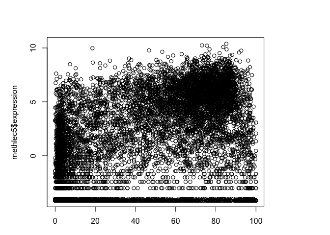<!-- -->

``` r
densCols(methlec5$gene.meth, methlec5$expression)
```

    ##    [1] "#88BEDC" "#94C4DE" "#81BADA" "#8FC2DD" "#7AB6D9" "#67ABD4"
    ##    [7] "#79B6D9" "#7DB8D9" "#083A7A" "#96C5DF" "#8EC1DD" "#9AC7E0"
    ##   [13] "#98C6DF" "#92C3DE" "#95C5DF" "#94C4DE" "#8ABFDC" "#7AB6D9"
    ##   [19] "#91C2DE" "#92C3DE" "#93C4DE" "#7CB7D9" "#7AB6D9" "#8EC1DD"
    ##   [25] "#92C3DE" "#084D96" "#9AC8E0" "#6BAED6" "#94C4DE" "#91C2DE"
    ##   [31] "#98C6DF" "#92C3DE" "#92C3DE" "#85BCDB" "#7BB6D9" "#85BCDB"
    ##   [37] "#7EB8DA" "#92C3DE" "#72B2D7" "#78B5D8" "#7FB9DA" "#98C7DF"
    ##   [43] "#7BB6D9" "#7DB8DA" "#93C4DE" "#79B5D9" "#7EB8DA" "#84BBDB"
    ##   [49] "#90C2DE" "#6DAFD6" "#95C5DF" "#6DAFD6" "#81BADA" "#6EB0D6"
    ##   [55] "#93C4DE" "#88BEDC" "#89BEDC" "#3787C0" "#98C7DF" "#08326E"
    ##   [61] "#7AB6D9" "#8FC1DD" "#71B1D7" "#93C4DE" "#6EB0D6" "#86BDDB"
    ##   [67] "#8DC1DD" "#93C4DE" "#98C7DF" "#98C6DF" "#66ABD4" "#7EB8DA"
    ##   [73] "#6FB0D7" "#94C4DE" "#67ABD4" "#85BCDB" "#93C3DE" "#92C3DE"
    ##   [79] "#69ACD5" "#67ABD4" "#84BCDB" "#69ADD5" "#7EB8DA" "#8FC1DD"
    ##   [85] "#92C3DE" "#94C4DE" "#90C2DE" "#93C4DE" "#83BBDB" "#5BA3CF"
    ##   [91] "#083A7A" "#08326E" "#7AB6D9" "#08326E" "#4F9BCB" "#115DA5"
    ##   [97] "#67ABD4" "#08478D" "#88BEDC" "#78B5D8" "#68ACD5" "#94C4DE"
    ##  [103] "#65AAD3" "#90C2DE" "#6AADD5" "#84BCDB" "#7CB7D9" "#8FC1DD"
    ##  [109] "#93C3DE" "#69ACD5" "#91C3DE" "#87BDDC" "#6AADD5" "#92C3DE"
    ##  [115] "#94C4DE" "#75B3D8" "#7EB8DA" "#65AAD3" "#7AB6D9" "#94C4DE"
    ##  [121] "#69ACD5" "#7AB6D9" "#8DC1DD" "#8BBFDD" "#76B4D8" "#80B9DA"
    ##  [127] "#7CB7D9" "#8CC0DD" "#68ACD4" "#9AC8E0" "#7CB7D9" "#94C4DE"
    ##  [133] "#95C5DF" "#8BC0DD" "#83BBDB" "#99C7E0" "#98C6DF" "#96C6DF"
    ##  [139] "#8BC0DD" "#4F9BCB" "#083978" "#7DB8D9" "#94C4DE" "#90C2DE"
    ##  [145] "#083A7A" "#81BADA" "#83BBDB" "#99C7DF" "#91C3DE" "#79B5D9"
    ##  [151] "#084489" "#7EB8DA" "#76B4D8" "#084387" "#8EC1DD" "#97C6DF"
    ##  [157] "#7AB6D9" "#8DC0DD" "#97C6DF" "#8EC1DD" "#084387" "#75B3D8"
    ##  [163] "#79B6D9" "#79B5D9" "#8BBFDD" "#86BDDB" "#76B4D8" "#89BEDC"
    ##  [169] "#8ABFDC" "#90C2DE" "#84BCDB" "#6FB0D7" "#97C6DF" "#68ACD5"
    ##  [175] "#81BADA" "#94C4DF" "#93C4DE" "#79B5D9" "#94C4DE" "#62A7D2"
    ##  [181] "#7FB9DA" "#08306B" "#98C6DF" "#7DB8DA" "#70B0D7" "#76B4D8"
    ##  [187] "#89BEDC" "#84BBDB" "#91C3DE" "#96C6DF" "#81BADA" "#87BDDC"
    ##  [193] "#9AC8E0" "#8EC1DD" "#7AB6D9" "#66AAD4" "#0D58A1" "#4A98C9"
    ##  [199] "#7BB6D9" "#98C7DF" "#08326E" "#08326E" "#97C6DF" "#91C3DE"
    ##  [205] "#67ABD4" "#7DB8D9" "#7BB7D9" "#08306B" "#084489" "#7EB8DA"
    ##  [211] "#87BDDC" "#85BCDB" "#85BCDB" "#6AADD5" "#6BAED6" "#6AADD5"
    ##  [217] "#83BBDB" "#7EB8DA" "#93C4DE" "#7EB8DA" "#82BADB" "#65AAD4"
    ##  [223] "#84BBDB" "#08326E" "#91C2DE" "#79B5D9" "#2A7AB9" "#84BCDB"
    ##  [229] "#85BCDB" "#7AB6D9" "#90C2DE" "#7AB6D9" "#94C4DF" "#89BEDC"
    ##  [235] "#98C6DF" "#95C5DF" "#91C2DE" "#74B3D8" "#65A9D3" "#7AB6D9"
    ##  [241] "#7CB7D9" "#8BC0DD" "#66ABD4" "#084489" "#7BB7D9" "#98C6DF"
    ##  [247] "#98C6DF" "#6AADD5" "#8CC0DD" "#6CAED6" "#85BCDB" "#08326E"
    ##  [253] "#084489" "#08326F" "#1B69AF" "#8EC1DD" "#83BBDB" "#7DB8DA"
    ##  [259] "#084387" "#9AC8E0" "#79B5D9" "#65AAD3" "#08478D" "#82BBDB"
    ##  [265] "#99C7E0" "#08326E" "#7BB7D9" "#8EC1DD" "#93C4DE" "#8FC2DD"
    ##  [271] "#86BDDB" "#85BCDB" "#94C4DF" "#97C6DF" "#8CC0DD" "#083978"
    ##  [277] "#7AB6D9" "#84BCDB" "#91C2DE" "#95C5DF" "#94C4DE" "#7AB6D9"
    ##  [283] "#7AB6D9" "#8EC1DD" "#96C5DF" "#083978" "#8FC2DD" "#94C4DE"
    ##  [289] "#83BBDB" "#90C2DE" "#8CC0DD" "#084489" "#7EB8DA" "#98C6DF"
    ##  [295] "#084387" "#08326F" "#7AB6D9" "#65AAD4" "#71B1D7" "#92C3DE"
    ##  [301] "#6CAED6" "#93C4DE" "#91C3DE" "#85BCDB" "#89BEDC" "#89BEDC"
    ##  [307] "#98C6DF" "#6BAED6" "#83BBDB" "#8ABFDC" "#94C4DE" "#80B9DA"
    ##  [313] "#93C4DE" "#08326E" "#8ABFDC" "#97C6DF" "#8FC2DD" "#91C2DE"
    ##  [319] "#6EAFD6" "#083A7A" "#8DC0DD" "#77B4D8" "#99C7E0" "#69ACD5"
    ##  [325] "#7AB6D9" "#94C4DE" "#68ACD5" "#08326E" "#083B7C" "#08306B"
    ##  [331] "#62A7D2" "#8CC0DD" "#8DC0DD" "#8DC0DD" "#083A7A" "#83BBDB"
    ##  [337] "#95C5DF" "#6CAED6" "#97C6DF" "#89BEDC" "#91C3DE" "#79B5D9"
    ##  [343] "#95C5DF" "#91C2DE" "#78B5D9" "#90C2DE" "#7AB6D9" "#6BAED6"
    ##  [349] "#67ABD4" "#3E8EC4" "#8DC0DD" "#78B5D9" "#7CB7D9" "#083A7A"
    ##  [355] "#7FB9DA" "#08326E" "#82BADB" "#08478D" "#78B5D9" "#4997C9"
    ##  [361] "#6AADD5" "#84BBDB" "#91C2DE" "#66AAD4" "#93C4DE" "#97C6DF"
    ##  [367] "#92C3DE" "#85BCDB" "#99C7DF" "#8FC2DD" "#90C2DE" "#89BEDC"
    ##  [373] "#083C7C" "#8CC0DD" "#08306B" "#93C4DE" "#91C3DE" "#98C6DF"
    ##  [379] "#86BDDB" "#96C5DF" "#6DAFD6" "#68ACD5" "#66AAD4" "#84BBDB"
    ##  [385] "#8FC1DD" "#80B9DA" "#8CC0DD" "#72B2D7" "#91C2DE" "#93C4DE"
    ##  [391] "#92C3DE" "#67ABD4" "#8DC0DD" "#92C3DE" "#95C5DF" "#93C4DE"
    ##  [397] "#72B1D7" "#97C6DF" "#76B4D8" "#89BEDC" "#65AAD3" "#95C5DF"
    ##  [403] "#81BADA" "#76B4D8" "#7BB7D9" "#94C4DE" "#8CC0DD" "#69ADD5"
    ##  [409] "#98C7DF" "#67ABD4" "#8EC1DD" "#7AB6D9" "#8DC1DD" "#67ABD4"
    ##  [415] "#08326F" "#8DC0DD" "#8EC1DD" "#98C6DF" "#72B2D7" "#7BB7D9"
    ##  [421] "#94C4DE" "#083A7A" "#80B9DA" "#94C4DE" "#08326E" "#74B3D8"
    ##  [427] "#7BB7D9" "#69ACD5" "#76B4D8" "#75B3D8" "#93C4DE" "#75B3D8"
    ##  [433] "#71B1D7" "#94C4DF" "#93C4DE" "#79B5D9" "#6AADD5" "#94C4DE"
    ##  [439] "#71B1D7" "#95C5DF" "#8DC0DD" "#083A7A" "#91C2DE" "#99C7E0"
    ##  [445] "#9AC7E0" "#79B5D9" "#79B5D9" "#6EAFD6" "#78B5D9" "#94C4DE"
    ##  [451] "#084489" "#98C6DF" "#8ABFDC" "#93C4DE" "#7DB8DA" "#94C4DE"
    ##  [457] "#94C4DE" "#75B3D8" "#65A9D3" "#083A7A" "#08478D" "#81BADA"
    ##  [463] "#8BC0DD" "#7CB7D9" "#81BADA" "#084D96" "#08326E" "#08478D"
    ##  [469] "#93C4DE" "#08306B" "#3E8EC4" "#7DB8D9" "#8FC1DD" "#9BC8E0"
    ##  [475] "#6CAED6" "#08306B" "#66AAD4" "#92C3DE" "#96C5DF" "#98C6DF"
    ##  [481] "#08306B" "#99C7DF" "#79B6D9" "#7EB8DA" "#91C2DE" "#97C6DF"
    ##  [487] "#92C3DE" "#85BCDB" "#94C4DE" "#7AB6D9" "#80B9DA" "#78B5D8"
    ##  [493] "#8CC0DD" "#08326E" "#8EC1DD" "#97C6DF" "#08326F" "#78B5D9"
    ##  [499] "#89BEDC" "#7CB7D9" "#6AADD5" "#92C3DE" "#87BDDC" "#97C6DF"
    ##  [505] "#91C2DE" "#96C6DF" "#72B2D7" "#67ABD4" "#93C4DE" "#8DC1DD"
    ##  [511] "#88BEDC" "#97C6DF" "#95C5DF" "#93C4DE" "#86BDDB" "#98C7DF"
    ##  [517] "#97C6DF" "#6DAFD6" "#8BBFDC" "#78B5D9" "#67ABD4" "#81BADA"
    ##  [523] "#91C2DE" "#8EC1DD" "#93C4DE" "#89BEDC" "#8BC0DD" "#1B69AF"
    ##  [529] "#88BEDC" "#86BDDB" "#65AAD3" "#084489" "#97C6DF" "#083A7A"
    ##  [535] "#084489" "#98C6DF" "#083A7A" "#8DC1DD" "#4494C7" "#7BB7D9"
    ##  [541] "#7EB8DA" "#94C4DF" "#8CC0DD" "#94C4DE" "#92C3DE" "#72B1D7"
    ##  [547] "#83BBDB" "#80B9DA" "#82BADA" "#6CAED6" "#115DA5" "#6AADD5"
    ##  [553] "#65A9D3" "#96C5DF" "#7DB8D9" "#81BADA" "#82BBDB" "#92C3DE"
    ##  [559] "#89BEDC" "#95C5DF" "#78B5D8" "#89BEDC" "#8BBFDD" "#97C6DF"
    ##  [565] "#86BDDB" "#83BBDB" "#97C6DF" "#7EB8DA" "#97C6DF" "#08478D"
    ##  [571] "#93C4DE" "#92C3DE" "#8FC2DD" "#80B9DA" "#96C5DF" "#79B5D9"
    ##  [577] "#91C2DE" "#084489" "#79B5D9" "#94C4DE" "#97C6DF" "#8EC1DD"
    ##  [583] "#87BDDC" "#84BCDB" "#85BCDB" "#9DC9E0" "#97C6DF" "#7BB7D9"
    ##  [589] "#68ACD4" "#78B5D8" "#79B6D9" "#7AB6D9" "#72B1D7" "#115DA5"
    ##  [595] "#7EB8DA" "#91C3DE" "#7FB9DA" "#85BCDB" "#9DC9E0" "#8CC0DD"
    ##  [601] "#87BDDC" "#8DC1DD" "#1B69AF" "#77B4D8" "#8CC0DD" "#8DC0DD"
    ##  [607] "#08326E" "#083A7A" "#7BB7D9" "#8BBFDD" "#79B6D9" "#08326E"
    ##  [613] "#7BB7D9" "#8EC1DD" "#7EB8DA" "#91C3DE" "#83BBDB" "#95C5DF"
    ##  [619] "#99C7DF" "#7BB7D9" "#90C2DD" "#95C5DF" "#08519C" "#8ABFDC"
    ##  [625] "#5BA3CF" "#083A7A" "#78B5D9" "#79B5D9" "#80B9DA" "#084489"
    ##  [631] "#57A1CE" "#7EB8DA" "#8DC0DD" "#4F9BCB" "#08306B" "#94C4DE"
    ##  [637] "#0D58A1" "#08326F" "#83BBDB" "#96C5DF" "#86BDDB" "#75B3D8"
    ##  [643] "#86BDDB" "#94C4DE" "#96C6DF" "#76B4D8" "#82BADB" "#08478D"
    ##  [649] "#85BCDB" "#85BCDB" "#92C3DE" "#7CB7D9" "#084387" "#83BBDB"
    ##  [655] "#83BBDB" "#95C5DF" "#94C4DE" "#08326F" "#94C4DE" "#0D58A1"
    ##  [661] "#0D58A1" "#82BBDB" "#82BBDB" "#97C6DF" "#7EB8DA" "#92C3DE"
    ##  [667] "#91C3DE" "#90C2DE" "#86BCDB" "#89BEDC" "#8EC1DD" "#70B1D7"
    ##  [673] "#95C5DF" "#68ACD5" "#8EC1DD" "#87BDDC" "#74B3D8" "#084489"
    ##  [679] "#0D58A1" "#7DB7D9" "#77B4D8" "#98C7DF" "#91C3DE" "#08306B"
    ##  [685] "#99C7DF" "#91C3DE" "#8BC0DD" "#84BBDB" "#93C4DE" "#97C6DF"
    ##  [691] "#88BEDC" "#92C3DE" "#8CC0DD" "#96C5DF" "#97C6DF" "#8DC0DD"
    ##  [697] "#93C4DE" "#7CB7D9" "#81BADA" "#81BADA" "#68ACD4" "#7BB7D9"
    ##  [703] "#89BEDC" "#92C3DE" "#97C6DF" "#7BB7D9" "#85BCDB" "#08326E"
    ##  [709] "#83BBDB" "#8FC1DD" "#65AAD3" "#6AADD5" "#94C4DF" "#80B9DA"
    ##  [715] "#87BDDC" "#6FB0D7" "#95C5DF" "#08326F" "#97C6DF" "#97C6DF"
    ##  [721] "#95C5DF" "#8ABFDC" "#68ACD5" "#66AAD4" "#7FB9DA" "#79B5D9"
    ##  [727] "#08478D" "#5BA3CF" "#7AB6D9" "#7FB9DA" "#8EC1DD" "#70B0D7"
    ##  [733] "#91C3DE" "#96C5DF" "#92C3DE" "#8ABFDC" "#88BEDC" "#084F99"
    ##  [739] "#87BDDC" "#82BADB" "#7EB8DA" "#8FC2DD" "#84BCDB" "#74B3D8"
    ##  [745] "#6BAED6" "#8EC1DD" "#7FB9DA" "#7CB7D9" "#084F99" "#08478D"
    ##  [751] "#7DB8DA" "#08306B" "#97C6DF" "#539ECC" "#80B9DA" "#90C2DE"
    ##  [757] "#94C4DE" "#78B5D8" "#95C5DF" "#80B9DA" "#8ABFDC" "#67ABD4"
    ##  [763] "#87BDDC" "#75B3D8" "#91C3DE" "#5EA5D1" "#94C4DF" "#7FB9DA"
    ##  [769] "#8FC2DD" "#98C6DF" "#94C4DE" "#7AB6D9" "#94C4DF" "#92C3DE"
    ##  [775] "#8BBFDC" "#87BDDC" "#94C4DE" "#87BDDC" "#08326F" "#90C2DE"
    ##  [781] "#79B6D9" "#1B69AF" "#94C4DE" "#08326E" "#95C5DF" "#7CB7D9"
    ##  [787] "#94C4DF" "#95C5DF" "#8BBFDC" "#94C4DE" "#08306B" "#95C5DF"
    ##  [793] "#8BC0DD" "#92C3DE" "#98C6DF" "#78B5D9" "#78B5D9" "#3787C0"
    ##  [799] "#94C4DE" "#65AAD3" "#8BBFDC" "#84BBDB" "#90C2DE" "#92C3DE"
    ##  [805] "#78B5D8" "#74B3D7" "#94C4DE" "#97C6DF" "#8BBFDD" "#75B3D8"
    ##  [811] "#81BADA" "#7BB7D9" "#65AAD3" "#8FC2DD" "#93C4DE" "#94C4DF"
    ##  [817] "#74B3D7" "#80B9DA" "#8ABFDC" "#7BB6D9" "#83BBDB" "#7BB6D9"
    ##  [823] "#6EB0D6" "#7EB8DA" "#96C5DF" "#80B9DA" "#8CC0DD" "#91C3DE"
    ##  [829] "#73B2D7" "#96C5DF" "#99C7DF" "#84BBDB" "#82BBDB" "#86BDDB"
    ##  [835] "#97C6DF" "#87BDDC" "#083A7A" "#7AB6D9" "#93C4DE" "#8EC1DD"
    ##  [841] "#95C5DF" "#96C5DF" "#9AC8E0" "#80B9DA" "#88BEDC" "#7EB8DA"
    ##  [847] "#6CAED6" "#7AB6D9" "#80B9DA" "#85BCDB" "#95C5DF" "#083A7A"
    ##  [853] "#96C6DF" "#99C7E0" "#08326E" "#115DA5" "#96C5DF" "#79B5D9"
    ##  [859] "#9AC8E0" "#7AB6D9" "#95C5DF" "#7BB7D9" "#7CB7D9" "#98C7DF"
    ##  [865] "#08326E" "#0D58A1" "#8FC1DD" "#89BEDC" "#8FC1DD" "#86BDDC"
    ##  [871] "#08326F" "#8EC1DD" "#08326F" "#08519C" "#8EC1DD" "#084489"
    ##  [877] "#1B69AF" "#78B5D9" "#7AB6D9" "#083A7A" "#3787C0" "#08326E"
    ##  [883] "#08306B" "#7CB7D9" "#78B5D8" "#8ABFDC" "#90C2DE" "#77B4D8"
    ##  [889] "#85BCDB" "#94C4DE" "#6CAED6" "#8DC0DD" "#93C4DE" "#93C4DE"
    ##  [895] "#66AAD4" "#89BEDC" "#93C4DE" "#115DA5" "#083A7A" "#08306B"
    ##  [901] "#08306B" "#08326E" "#08326E" "#08519C" "#084D96" "#8CC0DD"
    ##  [907] "#99C7E0" "#91C2DE" "#97C6DF" "#95C5DF" "#8ABFDC" "#79B6D9"
    ##  [913] "#82BADB" "#87BDDC" "#083C7C" "#8DC0DD" "#6EAFD6" "#90C2DE"
    ##  [919] "#8BBFDC" "#91C3DE" "#95C5DF" "#67ABD4" "#8ABFDC" "#7CB7D9"
    ##  [925] "#8ABFDC" "#84BBDB" "#95C5DF" "#95C5DF" "#85BCDB" "#8DC1DD"
    ##  [931] "#97C6DF" "#8FC2DD" "#6CAED6" "#79B5D9" "#80B9DA" "#65AAD4"
    ##  [937] "#9BC8E0" "#87BDDC" "#99C7E0" "#66ABD4" "#8DC0DD" "#70B1D7"
    ##  [943] "#7AB6D9" "#83BBDB" "#93C3DE" "#7AB6D9" "#7CB7D9" "#79B5D9"
    ##  [949] "#81BADA" "#8DC0DD" "#78B5D8" "#7EB8DA" "#94C4DE" "#8BBFDD"
    ##  [955] "#7DB8DA" "#7FB9DA" "#88BEDC" "#083B7C" "#7CB7D9" "#8ABFDC"
    ##  [961] "#97C6DF" "#98C7DF" "#98C6DF" "#70B0D7" "#9CC8E0" "#95C5DF"
    ##  [967] "#92C3DE" "#65AAD4" "#93C4DE" "#95C5DF" "#6DAFD6" "#7CB7D9"
    ##  [973] "#2F7FBC" "#67ABD4" "#93C4DE" "#89BEDC" "#80B9DA" "#92C3DE"
    ##  [979] "#94C4DE" "#67ABD4" "#90C2DE" "#92C3DE" "#67ABD4" "#95C5DF"
    ##  [985] "#8ABFDC" "#81BADA" "#86BDDB" "#81BADA" "#89BEDC" "#94C4DE"
    ##  [991] "#83BBDB" "#7FB9DA" "#7DB7D9" "#7DB7D9" "#98C7DF" "#80B9DA"
    ##  [997] "#65AAD3" "#8ABFDC" "#95C5DF" "#77B4D8" "#7BB7D9" "#8FC1DD"
    ## [1003] "#95C5DF" "#08306B" "#57A1CE" "#83BBDB" "#91C3DE" "#93C4DE"
    ## [1009] "#8EC1DD" "#86BCDB" "#72B1D7" "#94C4DE" "#7BB6D9" "#7FB9DA"
    ## [1015] "#7DB7D9" "#89BFDC" "#79B5D9" "#86BCDB" "#95C5DF" "#95C5DF"
    ## [1021] "#92C3DE" "#90C2DE" "#92C3DE" "#69ACD5" "#7AB6D9" "#6AADD5"
    ## [1027] "#8EC1DD" "#91C3DE" "#83BBDB" "#97C6DF" "#87BDDC" "#6BAED6"
    ## [1033] "#81BADA" "#6FB0D6" "#8DC0DD" "#79B6D9" "#86BDDC" "#083A7A"
    ## [1039] "#7CB7D9" "#83BBDB" "#79B6D9" "#67ABD4" "#8FC2DD" "#88BEDC"
    ## [1045] "#94C4DE" "#6AADD5" "#90C2DE" "#7FB9DA" "#72B2D7" "#68ACD4"
    ## [1051] "#8EC1DD" "#99C7E0" "#08326E" "#8CC0DD" "#78B5D8" "#98C7DF"
    ## [1057] "#81BADA" "#6AADD5" "#8FC2DD" "#90C2DE" "#95C5DF" "#94C4DE"
    ## [1063] "#99C7E0" "#7BB7D9" "#7BB6D9" "#99C7E0" "#7BB7D9" "#084489"
    ## [1069] "#93C4DE" "#083C7C" "#0D58A1" "#8DC0DD" "#99C7E0" "#9BC8E0"
    ## [1075] "#7BB7D9" "#84BCDB" "#72B2D7" "#7FB9DA" "#08478D" "#91C3DE"
    ## [1081] "#94C4DF" "#7EB8DA" "#97C6DF" "#8ABFDC" "#8DC1DD" "#94C4DE"
    ## [1087] "#75B3D8" "#7AB6D9" "#94C4DE" "#7CB7D9" "#94C5DF" "#80B9DA"
    ## [1093] "#62A7D2" "#7AB6D9" "#95C5DF" "#549ECD" "#7AB6D9" "#72B1D7"
    ## [1099] "#8DC0DD" "#08326F" "#8CC0DD" "#89BEDC" "#97C6DF" "#8DC1DD"
    ## [1105] "#67ABD4" "#74B3D8" "#82BADA" "#084F99" "#81BADA" "#79B5D9"
    ## [1111] "#97C6DF" "#96C5DF" "#8EC1DD" "#82BADB" "#93C3DE" "#99C7E0"
    ## [1117] "#8FC2DD" "#94C5DF" "#67ABD4" "#8FC2DD" "#94C4DE" "#90C2DE"
    ## [1123] "#99C7E0" "#98C7DF" "#7CB7D9" "#96C5DF" "#99C7DF" "#6AADD5"
    ## [1129] "#98C6DF" "#79B5D9" "#70B1D7" "#80B9DA" "#97C6DF" "#89BEDC"
    ## [1135] "#97C6DF" "#94C4DE" "#92C3DE" "#82BBDB" "#8CC0DD" "#8DC0DD"
    ## [1141] "#8DC0DD" "#99C7DF" "#65A9D3" "#85BCDB" "#74B3D8" "#67ABD4"
    ## [1147] "#70B0D7" "#68ACD5" "#74B3D8" "#7AB6D9" "#66AAD4" "#86BDDB"
    ## [1153] "#67ABD4" "#8ABFDC" "#68ACD4" "#92C3DE" "#95C5DF" "#93C4DE"
    ## [1159] "#70B0D7" "#82BADB" "#6FB0D7" "#78B5D9" "#8BBFDC" "#94C4DE"
    ## [1165] "#90C2DE" "#74B3D8" "#74B3D8" "#67ABD4" "#94C4DE" "#74B3D8"
    ## [1171] "#81BADA" "#73B2D7" "#99C7DF" "#92C3DE" "#90C2DE" "#67ABD4"
    ## [1177] "#7CB7D9" "#7EB8DA" "#66ABD4" "#94C4DE" "#7BB7D9" "#71B1D7"
    ## [1183] "#69ACD5" "#87BDDC" "#74B3D8" "#73B2D7" "#86BDDB" "#9BC8E0"
    ## [1189] "#08478D" "#08478D" "#7AB6D9" "#66ABD4" "#96C6DF" "#7DB8DA"
    ## [1195] "#92C3DE" "#90C2DE" "#7AB6D9" "#7CB7D9" "#08306B" "#8ABFDC"
    ## [1201] "#77B4D8" "#67ABD4" "#80B9DA" "#86BDDB" "#9BC8E0" "#92C3DE"
    ## [1207] "#95C5DF" "#1B69AF" "#7EB8DA" "#84BBDB" "#8ABFDC" "#1764AB"
    ## [1213] "#9BC8E0" "#91C3DE" "#7BB7D9" "#7BB7D9" "#98C7DF" "#95C5DF"
    ## [1219] "#6FB0D6" "#93C4DE" "#91C3DE" "#92C3DE" "#9BC8E0" "#9CC9E0"
    ## [1225] "#9CC9E0" "#72B2D7" "#9AC7E0" "#9CC8E0" "#8FC1DD" "#83BBDB"
    ## [1231] "#90C2DE" "#92C3DE" "#8EC1DD" "#95C5DF" "#7AB6D9" "#93C4DE"
    ## [1237] "#90C2DE" "#8DC0DD" "#6EAFD6" "#92C3DE" "#69ACD5" "#91C3DE"
    ## [1243] "#99C7E0" "#6CAED6" "#6AADD5" "#79B5D9" "#93C4DE" "#99C7E0"
    ## [1249] "#93C4DE" "#81BADA" "#8BC0DD" "#66AAD4" "#91C3DE" "#6BAED6"
    ## [1255] "#08326F" "#89BEDC" "#71B1D7" "#98C6DF" "#82BADA" "#68ACD4"
    ## [1261] "#08306B" "#95C5DF" "#93C4DE" "#94C4DE" "#08326F" "#82BADB"
    ## [1267] "#84BCDB" "#93C4DE" "#78B5D8" "#93C4DE" "#8EC1DD" "#93C4DE"
    ## [1273] "#08306B" "#98C6DF" "#86BDDB" "#8EC1DD" "#86BDDB" "#7DB7D9"
    ## [1279] "#8EC1DD" "#80B9DA" "#94C4DE" "#96C6DF" "#67ABD4" "#89BEDC"
    ## [1285] "#91C3DE" "#6CAED6" "#9AC8E0" "#99C7DF" "#74B3D7" "#7EB8DA"
    ## [1291] "#95C5DF" "#7CB7D9" "#65AAD3" "#8EC1DD" "#87BDDC" "#67ABD4"
    ## [1297] "#96C5DF" "#4494C7" "#99C7DF" "#98C7DF" "#91C3DE" "#8EC1DD"
    ## [1303] "#99C7DF" "#08306B" "#7BB7D9" "#6AADD5" "#99C7DF" "#08326F"
    ## [1309] "#08478D" "#69ACD5" "#7CB7D9" "#8DC0DD" "#69ACD5" "#93C4DE"
    ## [1315] "#6FB0D7" "#95C5DF" "#96C5DF" "#8EC1DD" "#6CAED6" "#95C5DF"
    ## [1321] "#85BCDB" "#99C7DF" "#83BBDB" "#70B0D7" "#95C5DF" "#6AADD5"
    ## [1327] "#08326E" "#89BEDC" "#7BB7D9" "#084489" "#96C5DF" "#135FA7"
    ## [1333] "#083A7A" "#8FC1DD" "#08326E" "#7DB8DA" "#93C4DE" "#95C5DF"
    ## [1339] "#97C6DF" "#70B0D7" "#97C6DF" "#70B1D7" "#8DC0DD" "#86BDDC"
    ## [1345] "#8DC0DD" "#96C6DF" "#8CC0DD" "#71B1D7" "#93C4DE" "#08519C"
    ## [1351] "#7FB8DA" "#99C7E0" "#97C6DF" "#65AAD3" "#0D58A1" "#083A7A"
    ## [1357] "#5EA5D1" "#5BA3CF" "#81BADA" "#08326F" "#74B3D8" "#7BB6D9"
    ## [1363] "#87BDDC" "#08326F" "#8CC0DD" "#9AC8E0" "#08478D" "#08478D"
    ## [1369] "#81BADA" "#95C5DF" "#2F7FBC" "#86BDDB" "#93C4DE" "#083A7A"
    ## [1375] "#83BBDB" "#7AB6D9" "#93C4DE" "#083B7C" "#83BBDB" "#68ACD4"
    ## [1381] "#08326F" "#7BB6D9" "#7AB6D9" "#084387" "#98C7DF" "#8ABFDC"
    ## [1387] "#8EC1DD" "#92C3DE" "#115DA5" "#98C6DF" "#96C5DF" "#9AC8E0"
    ## [1393] "#083A7A" "#82BBDB" "#97C6DF" "#8ABFDC" "#083978" "#7BB6D9"
    ## [1399] "#97C6DF" "#86BDDB" "#7FB9DA" "#95C5DF" "#7FB9DA" "#7DB8DA"
    ## [1405] "#7CB7D9" "#7BB7D9" "#84BCDB" "#084489" "#93C3DE" "#83BBDB"
    ## [1411] "#98C6DF" "#69ACD5" "#81BADA" "#8ABFDC" "#91C2DE" "#084387"
    ## [1417] "#8ABFDC" "#8EC1DD" "#083A7A" "#8EC1DD" "#97C6DF" "#93C4DE"
    ## [1423] "#76B4D8" "#97C6DF" "#7BB7D9" "#82BBDB" "#98C6DF" "#85BCDB"
    ## [1429] "#81BADA" "#80B9DA" "#78B5D9" "#08519C" "#1B69AF" "#93C4DE"
    ## [1435] "#97C6DF" "#95C5DF" "#7FB9DA" "#8EC1DD" "#6CAED6" "#89BEDC"
    ## [1441] "#7CB7D9" "#83BBDB" "#6BAED6" "#7DB7D9" "#75B3D8" "#08326F"
    ## [1447] "#87BDDC" "#92C3DE" "#83BBDB" "#80B9DA" "#94C4DE" "#083A7A"
    ## [1453] "#81BADA" "#93C4DE" "#77B5D8" "#91C3DE" "#78B5D8" "#08326E"
    ## [1459] "#65AAD3" "#8ABFDC" "#8FC2DD" "#77B4D8" "#94C4DE" "#7AB6D9"
    ## [1465] "#7FB9DA" "#7BB6D9" "#83BBDB" "#7FB9DA" "#8FC2DD" "#96C6DF"
    ## [1471] "#9CC9E0" "#93C4DE" "#92C3DE" "#85BCDB" "#94C4DF" "#6AADD5"
    ## [1477] "#75B3D8" "#86BDDB" "#8ABFDC" "#92C3DE" "#93C4DE" "#97C6DF"
    ## [1483] "#08326F" "#94C4DE" "#67ABD4" "#8EC1DD" "#74B3D8" "#83BBDB"
    ## [1489] "#08478D" "#87BDDC" "#95C5DF" "#94C5DF" "#7AB6D9" "#93C4DE"
    ## [1495] "#72B2D7" "#7FB9DA" "#7DB8DA" "#86BDDB" "#9CC9E0" "#68ACD4"
    ## [1501] "#08306B" "#8CC0DD" "#99C7E0" "#084489" "#7EB8DA" "#8CC0DD"
    ## [1507] "#7AB6D9" "#7AB6D9" "#083A7A" "#67ABD4" "#90C2DE" "#90C2DE"
    ## [1513] "#6AADD5" "#66AAD4" "#8EC1DD" "#91C2DE" "#74B3D8" "#9AC8E0"
    ## [1519] "#97C6DF" "#75B3D8" "#8CC0DD" "#66AAD4" "#78B5D8" "#9BC8E0"
    ## [1525] "#93C4DE" "#8EC1DD" "#91C3DE" "#92C3DE" "#083A7A" "#08326E"
    ## [1531] "#8BBFDC" "#97C6DF" "#8EC1DD" "#90C2DE" "#083A7A" "#08326E"
    ## [1537] "#69ACD5" "#8DC0DD" "#91C2DE" "#6DAFD6" "#7BB7D9" "#7DB7D9"
    ## [1543] "#76B4D8" "#81BADA" "#083B7C" "#083A7A" "#9AC8E0" "#7FB9DA"
    ## [1549] "#93C4DE" "#78B5D8" "#08519C" "#7DB8D9" "#8CC0DD" "#3787C0"
    ## [1555] "#7BB7D9" "#93C3DE" "#91C2DE" "#94C4DE" "#68ACD4" "#97C6DF"
    ## [1561] "#95C5DF" "#8ABFDC" "#7DB8DA" "#86BDDB" "#80B9DA" "#083A7A"
    ## [1567] "#9BC8E0" "#96C6DF" "#95C5DF" "#8ABFDC" "#82BBDB" "#84BCDB"
    ## [1573] "#8FC2DD" "#97C6DF" "#08478D" "#6EAFD6" "#95C5DF" "#71B1D7"
    ## [1579] "#74B3D8" "#75B3D8" "#88BEDC" "#70B0D7" "#96C6DF" "#08326E"
    ## [1585] "#1B69AF" "#2F7FBC" "#7EB8DA" "#7EB8DA" "#5EA5D1" "#2575B7"
    ## [1591] "#93C4DE" "#08326F" "#98C6DF" "#80B9DA" "#7DB7D9" "#87BDDC"
    ## [1597] "#8FC2DD" "#85BCDB" "#96C6DF" "#7FB9DA" "#9BC8E0" "#8DC0DD"
    ## [1603] "#83BBDB" "#9AC8E0" "#08326E" "#083A7A" "#7FB8DA" "#7EB8DA"
    ## [1609] "#8DC1DD" "#7BB6D9" "#8DC1DD" "#083C7C" "#7BB7D9" "#89BEDC"
    ## [1615] "#7FB9DA" "#92C3DE" "#8CC0DD" "#083A7A" "#08478D" "#8ABFDC"
    ## [1621] "#87BDDC" "#79B6D9" "#88BEDC" "#74B3D8" "#7FB9DA" "#084489"
    ## [1627] "#7CB7D9" "#94C4DE" "#08306B" "#6AADD5" "#93C4DE" "#6AADD5"
    ## [1633] "#88BEDC" "#78B5D8" "#92C3DE" "#4494C7" "#0D58A1" "#8EC1DD"
    ## [1639] "#8EC1DD" "#7CB7D9" "#93C4DE" "#97C6DF" "#90C2DE" "#82BADB"
    ## [1645] "#95C5DF" "#8CC0DD" "#1B69AF" "#83BBDB" "#083A7A" "#08519C"
    ## [1651] "#68ACD4" "#92C3DE" "#084387" "#083A7A" "#08478D" "#7AB6D9"
    ## [1657] "#95C5DF" "#86BDDB" "#7DB7D9" "#75B3D8" "#83BBDB" "#6EAFD6"
    ## [1663] "#7BB6D9" "#97C6DF" "#87BDDC" "#83BBDB" "#8DC0DD" "#91C3DE"
    ## [1669] "#7EB8DA" "#8CC0DD" "#95C5DF" "#6BAED6" "#84BCDB" "#6FB0D6"
    ## [1675] "#94C4DE" "#7AB6D9" "#7CB7D9" "#93C4DE" "#1B69AF" "#2575B7"
    ## [1681] "#0D58A1" "#115DA5" "#73B2D7" "#91C3DE" "#94C4DE" "#91C3DE"
    ## [1687] "#69ACD5" "#08326E" "#97C6DF" "#90C2DE" "#084387" "#7DB8DA"
    ## [1693] "#7BB7D9" "#81BADA" "#85BCDB" "#69ACD5" "#8CC0DD" "#87BDDC"
    ## [1699] "#8BBFDD" "#99C7E0" "#85BCDB" "#95C5DF" "#73B2D7" "#78B5D8"
    ## [1705] "#76B4D8" "#9BC8E0" "#08326E" "#08326E" "#99C7DF" "#083A7A"
    ## [1711] "#74B3D8" "#7DB8D9" "#7BB7D9" "#91C3DE" "#66AAD4" "#99C7E0"
    ## [1717] "#7AB6D9" "#95C5DF" "#8DC1DD" "#4997C9" "#083978" "#99C7E0"
    ## [1723] "#81BADA" "#84BBDB" "#95C5DF" "#92C3DE" "#7BB7D9" "#79B6D9"
    ## [1729] "#0D58A1" "#66AAD4" "#8FC1DD" "#98C7DF" "#8EC1DD" "#7BB7D9"
    ## [1735] "#97C6DF" "#90C2DE" "#9AC8E0" "#084F99" "#98C7DF" "#82BADB"
    ## [1741] "#08478D" "#95C5DF" "#95C5DF" "#9BC8E0" "#7BB6D9" "#084489"
    ## [1747] "#96C5DF" "#8FC2DD" "#6CAED6" "#94C4DF" "#08306B" "#90C2DE"
    ## [1753] "#6DAFD6" "#83BBDB" "#94C5DF" "#97C6DF" "#97C6DF" "#9BC8E0"
    ## [1759] "#084489" "#84BBDB" "#81BADA" "#08326E" "#66AAD4" "#78B5D8"
    ## [1765] "#08306B" "#8EC1DD" "#94C4DE" "#89BEDC" "#70B1D7" "#7AB6D9"
    ## [1771] "#69ACD5" "#8CC0DD" "#95C5DF" "#87BDDC" "#08326E" "#97C6DF"
    ## [1777] "#7DB8DA" "#68ACD4" "#7BB6D9" "#80B9DA" "#8DC0DD" "#91C3DE"
    ## [1783] "#8EC1DD" "#083978" "#94C4DE" "#90C2DE" "#8ABFDC" "#92C3DE"
    ## [1789] "#6CAED6" "#86BDDB" "#7FB9DA" "#81BADA" "#71B1D7" "#66ABD4"
    ## [1795] "#78B5D8" "#7CB7D9" "#8ABFDC" "#8ABFDC" "#7FB9DA" "#85BCDB"
    ## [1801] "#95C5DF" "#7AB6D9" "#97C6DF" "#8CC0DD" "#94C5DF" "#94C4DE"
    ## [1807] "#93C4DE" "#6EAFD6" "#69ACD5" "#95C5DF" "#7CB7D9" "#084489"
    ## [1813] "#08326F" "#08519C" "#3E8EC4" "#8CC0DD" "#084489" "#1B69AF"
    ## [1819] "#0D58A1" "#83BBDB" "#57A1CE" "#08519C" "#7CB7D9" "#7BB7D9"
    ## [1825] "#8FC1DD" "#6FB0D6" "#8DC0DD" "#65AAD3" "#73B2D7" "#70B0D7"
    ## [1831] "#8CC0DD" "#8ABFDC" "#69ADD5" "#9ECAE1" "#92C3DE" "#86BCDB"
    ## [1837] "#85BCDB" "#6FB0D7" "#6FB0D6" "#81BADA" "#78B5D8" "#66AAD4"
    ## [1843] "#89BFDC" "#81BADA" "#8BBFDC" "#84BBDB" "#8ABFDC" "#69ADD5"
    ## [1849] "#86BDDB" "#84BCDB" "#93C4DE" "#77B4D8" "#68ACD5" "#08306B"
    ## [1855] "#7EB8DA" "#7FB9DA" "#73B2D7" "#87BDDC" "#86BCDB" "#7EB8DA"
    ## [1861] "#93C4DE" "#95C5DF" "#7BB7D9" "#8DC0DD" "#84BBDB" "#5BA3CF"
    ## [1867] "#93C4DE" "#08326E" "#8ABFDC" "#92C3DE" "#6BAED6" "#89BEDC"
    ## [1873] "#8FC1DD" "#62A7D2" "#7DB8D9" "#7DB8DA" "#92C3DE" "#97C6DF"
    ## [1879] "#66AAD4" "#8FC1DD" "#78B5D8" "#084489" "#94C4DE" "#91C3DE"
    ## [1885] "#8CC0DD" "#8FC2DD" "#8CC0DD" "#9AC8E0" "#97C6DF" "#95C5DF"
    ## [1891] "#92C3DE" "#88BDDC" "#97C6DF" "#083B7C" "#7EB8DA" "#7FB9DA"
    ## [1897] "#083A7A" "#08306B" "#97C6DF" "#084387" "#8EC1DD" "#82BADA"
    ## [1903] "#69ACD5" "#7EB8DA" "#71B1D7" "#6DAFD6" "#08306B" "#7BB6D9"
    ## [1909] "#8FC2DD" "#67ABD4" "#7BB7D9" "#91C3DE" "#92C3DE" "#96C6DF"
    ## [1915] "#6DAFD6" "#87BDDC" "#135FA7" "#99C7DF" "#9AC8E0" "#7FB8DA"
    ## [1921] "#7FB9DA" "#7BB7D9" "#99C7DF" "#79B6D9" "#7BB6D9" "#94C4DF"
    ## [1927] "#83BBDB" "#8EC1DD" "#92C3DE" "#94C4DE" "#69ACD5" "#6CAED6"
    ## [1933] "#4F9BCB" "#8CC0DD" "#83BBDB" "#7BB7D9" "#82BBDB" "#96C5DF"
    ## [1939] "#88BEDC" "#84BBDB" "#93C4DE" "#78B5D8" "#93C4DE" "#99C7DF"
    ## [1945] "#99C7DF" "#97C6DF" "#08478D" "#8CC0DD" "#84BCDB" "#2F7FBC"
    ## [1951] "#08478D" "#8ABFDC" "#88BEDC" "#92C3DE" "#7AB6D9" "#96C5DF"
    ## [1957] "#86BDDC" "#7AB6D9" "#93C4DE" "#08326E" "#57A1CE" "#85BCDB"
    ## [1963] "#78B5D9" "#084387" "#2575B7" "#7FB9DA" "#94C4DE" "#7FB9DA"
    ## [1969] "#8BBFDD" "#08326F" "#7BB6D9" "#1B69AF" "#9BC8E0" "#72B2D7"
    ## [1975] "#90C2DE" "#1B69AF" "#8EC1DD" "#94C4DE" "#083A7A" "#8ABFDC"
    ## [1981] "#7CB7D9" "#0D58A1" "#08478D" "#91C3DE" "#08326E" "#8EC1DD"
    ## [1987] "#82BADB" "#7BB7D9" "#08478D" "#74B3D8" "#82BBDB" "#8CC0DD"
    ## [1993] "#65A9D3" "#93C4DE" "#8BBFDC" "#0D58A1" "#084F99" "#84BCDB"
    ## [1999] "#7DB8DA" "#7AB6D9" "#2F7FBC" "#084489" "#97C6DF" "#82BADB"
    ## [2005] "#67ABD4" "#8FC2DD" "#7BB7D9" "#8ABFDC" "#87BDDC" "#94C4DE"
    ## [2011] "#8BC0DD" "#97C6DF" "#91C3DE" "#083A7A" "#7EB8DA" "#7AB6D9"
    ## [2017] "#65AAD4" "#084489" "#7FB9DA" "#92C3DE" "#08326E" "#87BDDC"
    ## [2023] "#08306B" "#08326F" "#97C6DF" "#7CB7D9" "#95C5DF" "#8DC0DD"
    ## [2029] "#08306B" "#94C4DF" "#90C2DE" "#78B5D8" "#7BB7D9" "#98C6DF"
    ## [2035] "#084387" "#8BBFDD" "#81BADA" "#0D58A1" "#08326E" "#6DAFD6"
    ## [2041] "#86BDDB" "#8EC1DD" "#98C6DF" "#7FB9DA" "#89BEDC" "#93C4DE"
    ## [2047] "#9AC8E0" "#95C5DF" "#7FB9DA" "#69ACD5" "#96C5DF" "#97C6DF"
    ## [2053] "#8CC0DD" "#8DC0DD" "#81BADA" "#8EC1DD" "#8CC0DD" "#98C7DF"
    ## [2059] "#93C4DE" "#94C4DE" "#81BADA" "#7DB8DA" "#99C7E0" "#97C6DF"
    ## [2065] "#87BDDC" "#72B1D7" "#9AC8E0" "#6DAFD6" "#6BAED6" "#93C4DE"
    ## [2071] "#08326E" "#9AC8E0" "#97C6DF" "#94C4DE" "#8EC1DD" "#80B9DA"
    ## [2077] "#82BADB" "#95C5DF" "#83BBDB" "#69ACD5" "#98C7DF" "#7EB8DA"
    ## [2083] "#7AB6D9" "#92C3DE" "#92C3DE" "#08326F" "#8FC1DD" "#8ABFDC"
    ## [2089] "#89BEDC" "#7AB6D9" "#7DB8DA" "#83BBDB" "#86BDDB" "#87BDDC"
    ## [2095] "#7DB8DA" "#08306B" "#8CC0DD" "#97C6DF" "#83BBDB" "#3E8EC4"
    ## [2101] "#95C5DF" "#7BB6D9" "#88BEDC" "#81BADA" "#6BAED6" "#084489"
    ## [2107] "#7AB6D9" "#7DB8DA" "#91C3DE" "#7CB7D9" "#90C2DD" "#97C6DF"
    ## [2113] "#083978" "#95C5DF" "#084387" "#72B2D7" "#08326F" "#2F7FBC"
    ## [2119] "#79B6D9" "#7DB8DA" "#083A7A" "#86BDDB" "#9BC8E0" "#84BCDB"
    ## [2125] "#6AADD5" "#7FB9DA" "#8DC0DD" "#99C7DF" "#97C6DF" "#9DC9E0"
    ## [2131] "#91C3DE" "#99C7DF" "#81BADA" "#083A7A" "#8EC1DD" "#93C4DE"
    ## [2137] "#82BADA" "#083978" "#94C4DF" "#93C4DE" "#66AAD4" "#7CB7D9"
    ## [2143] "#80B9DA" "#8FC2DD" "#80B9DA" "#8EC1DD" "#93C3DE" "#81BADA"
    ## [2149] "#8DC1DD" "#66AAD4" "#67ABD4" "#94C4DE" "#98C6DF" "#82BADA"
    ## [2155] "#9BC8E0" "#97C6DF" "#6FB0D6" "#95C5DF" "#7AB6D9" "#08306B"
    ## [2161] "#98C7DF" "#91C3DE" "#6DAFD6" "#95C5DF" "#8EC1DD" "#5EA5D1"
    ## [2167] "#7FB8DA" "#93C4DE" "#93C4DE" "#8EC1DD" "#6CAED6" "#78B5D8"
    ## [2173] "#97C6DF" "#81BADA" "#7BB7D9" "#96C5DF" "#9AC8E0" "#8CC0DD"
    ## [2179] "#08519C" "#8ABFDC" "#83BBDB" "#08326F" "#86BCDB" "#89BEDC"
    ## [2185] "#9AC7E0" "#7FB9DA" "#08306B" "#7FB9DA" "#99C7DF" "#93C4DE"
    ## [2191] "#7AB6D9" "#7CB7D9" "#084F99" "#78B5D9" "#84BBDB" "#083A7A"
    ## [2197] "#91C3DE" "#92C3DE" "#9AC8E0" "#7FB9DA" "#97C6DF" "#91C3DE"
    ## [2203] "#8FC2DD" "#96C5DF" "#7DB7D9" "#85BCDB" "#7EB8DA" "#88BDDC"
    ## [2209] "#89BEDC" "#6FB0D6" "#79B5D9" "#82BADB" "#79B5D9" "#75B3D8"
    ## [2215] "#75B4D8" "#7BB6D9" "#85BCDB" "#71B1D7" "#8CC0DD" "#87BDDC"
    ## [2221] "#7AB6D9" "#3484BE" "#7AB6D9" "#6AADD5" "#96C5DF" "#4A98C9"
    ## [2227] "#95C5DF" "#89BEDC" "#96C6DF" "#65AAD3" "#69ADD5" "#98C6DF"
    ## [2233] "#96C5DF" "#08326E" "#95C5DF" "#79B5D9" "#92C3DE" "#87BDDC"
    ## [2239] "#083B7C" "#81BADA" "#9AC8E0" "#08306B" "#4F9BCB" "#8CC0DD"
    ## [2245] "#95C5DF" "#94C4DF" "#8FC1DD" "#083A7A" "#8CC0DD" "#6DAFD6"
    ## [2251] "#97C6DF" "#81BADA" "#8DC0DD" "#8FC1DD" "#08306B" "#8CC0DD"
    ## [2257] "#93C4DE" "#7FB9DA" "#86BDDB" "#4292C6" "#93C4DE" "#083A7A"
    ## [2263] "#94C4DE" "#8CC0DD" "#98C7DF" "#92C3DE" "#83BBDB" "#85BCDB"
    ## [2269] "#8DC1DD" "#90C2DE" "#68ACD4" "#98C6DF" "#93C4DE" "#94C4DE"
    ## [2275] "#7CB7D9" "#95C5DF" "#83BBDB" "#7CB7D9" "#94C5DF" "#69ACD5"
    ## [2281] "#98C6DF" "#8CC0DD" "#7FB9DA" "#7DB7D9" "#67ABD4" "#83BBDB"
    ## [2287] "#7FB9DA" "#8EC1DD" "#083A7A" "#94C4DF" "#92C3DE" "#7BB7D9"
    ## [2293] "#95C5DF" "#99C7DF" "#95C5DF" "#98C6DF" "#7AB6D9" "#8FC2DD"
    ## [2299] "#98C6DF" "#93C4DE" "#91C3DE" "#7AB6D9" "#87BDDC" "#91C3DE"
    ## [2305] "#88BEDC" "#0D58A1" "#93C4DE" "#73B2D7" "#7DB8D9" "#8BBFDD"
    ## [2311] "#86BDDC" "#7FB9DA" "#1B69AF" "#8ABFDC" "#79B6D9" "#68ACD4"
    ## [2317] "#66AAD4" "#90C2DE" "#79B5D9" "#81BADA" "#88BEDC" "#83BBDB"
    ## [2323] "#97C6DF" "#94C5DF" "#083A7A" "#95C5DF" "#1B69AF" "#94C4DF"
    ## [2329] "#80B9DA" "#8ABFDC" "#8CC0DD" "#90C2DE" "#08306B" "#8DC0DD"
    ## [2335] "#84BCDB" "#73B2D7" "#8ABFDC" "#79B5D9" "#83BBDB" "#97C6DF"
    ## [2341] "#87BDDC" "#93C4DE" "#91C3DE" "#90C2DE" "#90C2DE" "#89BEDC"
    ## [2347] "#80B9DA" "#94C4DF" "#83BBDB" "#71B1D7" "#2575B7" "#82BBDB"
    ## [2353] "#95C5DF" "#98C6DF" "#97C6DF" "#8EC1DD" "#79B5D9" "#93C4DE"
    ## [2359] "#8BC0DD" "#96C6DF" "#8EC1DD" "#93C4DE" "#95C5DF" "#69ADD5"
    ## [2365] "#8CC0DD" "#84BCDB" "#6FB0D7" "#95C5DF" "#88BEDC" "#79B5D9"
    ## [2371] "#71B1D7" "#8CC0DD" "#86BDDB" "#084489" "#6CAED6" "#96C5DF"
    ## [2377] "#79B6D9" "#8EC1DD" "#92C3DE" "#72B2D7" "#82BBDB" "#6BAED6"
    ## [2383] "#67ABD4" "#8CC0DD" "#80B9DA" "#99C7DF" "#95C5DF" "#6DAFD6"
    ## [2389] "#92C3DE" "#93C4DE" "#98C6DF" "#549ECD" "#083A7A" "#8ABFDC"
    ## [2395] "#91C2DE" "#7CB7D9" "#91C2DE" "#78B5D8" "#82BADB" "#87BDDC"
    ## [2401] "#96C5DF" "#78B5D8" "#7BB7D9" "#7AB6D9" "#79B5D9" "#3E8EC4"
    ## [2407] "#8FC2DD" "#8EC1DD" "#95C5DF" "#74B3D8" "#89BFDC" "#83BBDB"
    ## [2413] "#65AAD3" "#99C7E0" "#8EC1DD" "#7BB7D9" "#68ACD4" "#90C2DD"
    ## [2419] "#8DC1DD" "#87BDDC" "#86BCDB" "#67ABD4" "#89BEDC" "#89BEDC"
    ## [2425] "#69ACD5" "#76B4D8" "#90C2DE" "#08478D" "#083A7A" "#8BBFDD"
    ## [2431] "#083A7A" "#8CC0DD" "#8EC1DD" "#8DC1DD" "#78B5D8" "#135FA7"
    ## [2437] "#08326E" "#08306B" "#84BCDB" "#93C4DE" "#083A7A" "#9AC8E0"
    ## [2443] "#8DC0DD" "#67ABD4" "#08326E" "#7DB8DA" "#083A7A" "#8DC0DD"
    ## [2449] "#084387" "#7DB7D9" "#7AB6D9" "#96C6DF" "#91C3DE" "#96C5DF"
    ## [2455] "#6DAFD6" "#93C4DE" "#91C3DE" "#83BBDB" "#93C4DE" "#89BEDC"
    ## [2461] "#92C3DE" "#89BEDC" "#84BCDB" "#95C5DF" "#7AB6D9" "#86BCDB"
    ## [2467] "#94C4DE" "#6CAED6" "#82BBDB" "#81BADA" "#7BB7D9" "#9AC8E0"
    ## [2473] "#93C4DE" "#83BBDB" "#9DC9E0" "#8CC0DD" "#71B1D7" "#75B3D8"
    ## [2479] "#86BDDB" "#6AADD5" "#9BC8E0" "#7DB7D9" "#7FB9DA" "#3787C0"
    ## [2485] "#7BB7D9" "#08306B" "#78B5D8" "#083A7A" "#08326E" "#084387"
    ## [2491] "#98C7DF" "#95C5DF" "#84BBDB" "#90C2DE" "#81BADA" "#98C7DF"
    ## [2497] "#96C5DF" "#98C7DF" "#9AC8E0" "#8EC1DD" "#94C4DE" "#99C7E0"
    ## [2503] "#98C6DF" "#083A7A" "#78B5D8" "#97C6DF" "#85BCDB" "#083A7A"
    ## [2509] "#91C3DE" "#91C2DE" "#8EC1DD" "#7EB8DA" "#9AC8E0" "#93C4DE"
    ## [2515] "#96C6DF" "#91C3DE" "#78B5D9" "#4F9BCB" "#2F7FBC" "#08326E"
    ## [2521] "#96C5DF" "#08326E" "#86BDDB" "#8BC0DD" "#5BA3CF" "#083A7A"
    ## [2527] "#7BB7D9" "#08326F" "#81BADA" "#7CB7D9" "#78B5D8" "#83BBDB"
    ## [2533] "#2F7FBC" "#7DB8DA" "#8EC1DD" "#8CC0DD" "#93C4DE" "#93C4DE"
    ## [2539] "#7AB6D9" "#93C4DE" "#7BB7D9" "#86BDDB" "#3484BE" "#72B2D7"
    ## [2545] "#78B5D8" "#8EC1DD" "#7CB7D9" "#78B5D8" "#08306B" "#083A7A"
    ## [2551] "#97C6DF" "#08326E" "#08478D" "#7EB8DA" "#84BCDB" "#083C7C"
    ## [2557] "#86BDDB" "#98C7DF" "#7DB7D9" "#78B5D8" "#7AB6D9" "#7CB7D9"
    ## [2563] "#68ACD4" "#083A7A" "#95C5DF" "#80B9DA" "#8DC1DD" "#7DB8DA"
    ## [2569] "#97C6DF" "#91C3DE" "#115DA5" "#8BC0DD" "#97C6DF" "#6AADD5"
    ## [2575] "#82BADB" "#98C7DF" "#98C6DF" "#083A7A" "#539ECC" "#7AB6D9"
    ## [2581] "#92C3DE" "#95C5DF" "#7BB7D9" "#76B4D8" "#08306B" "#92C3DE"
    ## [2587] "#8FC2DD" "#78B5D9" "#08326E" "#91C2DE" "#90C2DE" "#7DB8DA"
    ## [2593] "#5BA3CF" "#7CB7D9" "#08326F" "#4494C7" "#083A7A" "#6AADD5"
    ## [2599] "#83BBDB" "#08519C" "#94C4DE" "#83BBDB" "#083A7A" "#82BADB"
    ## [2605] "#67ABD4" "#7DB8D9" "#95C5DF" "#8EC1DD" "#78B5D9" "#93C4DE"
    ## [2611] "#7AB6D9" "#66AAD4" "#6FB0D7" "#96C5DF" "#98C6DF" "#92C3DE"
    ## [2617] "#6AADD5" "#85BCDB" "#95C5DF" "#70B0D7" "#6DAFD6" "#8EC1DD"
    ## [2623] "#8EC1DD" "#83BBDB" "#83BBDB" "#69ACD5" "#81BADA" "#9AC7E0"
    ## [2629] "#94C4DF" "#91C2DE" "#7FB9DA" "#95C5DF" "#67ABD4" "#80B9DA"
    ## [2635] "#6EAFD6" "#8EC1DD" "#7CB7D9" "#6AADD5" "#70B0D7" "#8ABFDC"
    ## [2641] "#7FB9DA" "#84BCDB" "#91C2DE" "#6BAED6" "#6AADD5" "#93C4DE"
    ## [2647] "#083B7C" "#6EAFD6" "#08326F" "#7AB6D9" "#91C3DE" "#98C7DF"
    ## [2653] "#99C7DF" "#7AB6D9" "#95C5DF" "#94C4DE" "#8DC0DD" "#8CC0DD"
    ## [2659] "#95C5DF" "#08326E" "#92C3DE" "#98C7DF" "#7AB6D9" "#69ADD5"
    ## [2665] "#93C4DE" "#7AB6D9" "#8DC1DD" "#549ECD" "#8DC0DD" "#96C6DF"
    ## [2671] "#083A7A" "#78B5D9" "#08306B" "#86BDDB" "#083B7C" "#82BBDB"
    ## [2677] "#88BEDC" "#80B9DA" "#8ABFDC" "#82BADA" "#92C3DE" "#80B9DA"
    ## [2683] "#96C6DF" "#9BC8E0" "#83BBDB" "#81BADA" "#81BADA" "#85BCDB"
    ## [2689] "#94C4DE" "#93C4DE" "#95C5DF" "#67ABD4" "#67ABD4" "#8DC0DD"
    ## [2695] "#7FB9DA" "#6CAED6" "#7EB8DA" "#68ACD4" "#94C5DF" "#72B2D7"
    ## [2701] "#72B1D7" "#86BDDC" "#82BADA" "#98C6DF" "#67ABD4" "#95C5DF"
    ## [2707] "#95C5DF" "#82BBDB" "#7DB8DA" "#93C4DE" "#96C5DF" "#8EC1DD"
    ## [2713] "#8CC0DD" "#7CB7D9" "#97C6DF" "#84BCDB" "#82BBDB" "#91C3DE"
    ## [2719] "#85BCDB" "#97C6DF" "#6EB0D6" "#6AADD5" "#90C2DE" "#88BEDC"
    ## [2725] "#62A7D2" "#68ABD4" "#87BDDC" "#7BB7D9" "#73B2D7" "#93C4DE"
    ## [2731] "#86BCDB" "#08478D" "#08326E" "#81BADA" "#94C4DE" "#7FB9DA"
    ## [2737] "#8EC1DD" "#6DAFD6" "#7BB7D9" "#6AADD5" "#8FC1DD" "#7FB9DA"
    ## [2743] "#08326E" "#115DA5" "#3E8EC4" "#9AC7E0" "#95C5DF" "#08326F"
    ## [2749] "#88BEDC" "#083A7A" "#82BADA" "#7FB9DA" "#083978" "#89BEDC"
    ## [2755] "#66ABD4" "#92C3DE" "#6FB0D7" "#97C6DF" "#9BC8E0" "#95C5DF"
    ## [2761] "#08326E" "#84BCDB" "#78B5D8" "#99C7DF" "#90C2DD" "#98C7DF"
    ## [2767] "#89BEDC" "#96C5DF" "#95C5DF" "#94C4DE" "#0D58A1" "#8EC1DD"
    ## [2773] "#83BBDB" "#7CB7D9" "#7EB8DA" "#8FC2DD" "#75B3D8" "#8EC1DD"
    ## [2779] "#80B9DA" "#94C4DF" "#8BC0DD" "#8DC0DD" "#68ACD4" "#7AB6D9"
    ## [2785] "#8BC0DD" "#8CC0DD" "#77B4D8" "#8BC0DD" "#94C4DE" "#68ACD4"
    ## [2791] "#78B5D8" "#8BC0DD" "#8FC2DD" "#82BBDB" "#68ACD4" "#8ABFDC"
    ## [2797] "#66AAD4" "#95C5DF" "#7CB7D9" "#7FB9DA" "#8EC1DD" "#8ABFDC"
    ## [2803] "#68ACD5" "#85BCDB" "#6FB0D7" "#65AAD3" "#83BBDB" "#72B1D7"
    ## [2809] "#91C3DE" "#84BBDB" "#08478D" "#93C4DE" "#8FC2DD" "#79B5D9"
    ## [2815] "#2575B7" "#083A7A" "#115DA5" "#94C4DE" "#115DA5" "#3787C0"
    ## [2821] "#5BA3CF" "#084387" "#08326E" "#08326F" "#2F7FBC" "#0D58A1"
    ## [2827] "#3787C0" "#08326F" "#7BB7D9" "#2A7AB9" "#083A7A" "#083A7A"
    ## [2833] "#083978" "#86BDDC" "#7DB8DA" "#90C2DE" "#8FC1DD" "#8FC1DD"
    ## [2839] "#96C6DF" "#97C6DF" "#083A7A" "#6BAED6" "#7DB8D9" "#08326E"
    ## [2845] "#8CC0DD" "#57A1CE" "#98C7DF" "#97C6DF" "#95C5DF" "#96C5DF"
    ## [2851] "#95C5DF" "#8BC0DD" "#7AB6D9" "#96C5DF" "#8FC1DD" "#94C4DE"
    ## [2857] "#08478D" "#92C3DE" "#08478D" "#8DC0DD" "#8FC1DD" "#7EB8DA"
    ## [2863] "#69ADD5" "#73B2D7" "#80B9DA" "#95C5DF" "#93C4DE" "#93C4DE"
    ## [2869] "#8FC1DD" "#6BAED6" "#91C3DE" "#93C4DE" "#6FB0D6" "#80B9DA"
    ## [2875] "#89BEDC" "#67ABD4" "#78B5D9" "#7AB6D9" "#7FB9DA" "#9DC9E0"
    ## [2881] "#94C4DE" "#76B4D8" "#76B4D8" "#9BC8E0" "#6FB0D7" "#76B4D8"
    ## [2887] "#8ABFDC" "#91C3DE" "#8EC1DD" "#6DAFD6" "#8FC1DD" "#7EB8DA"
    ## [2893] "#08306B" "#8CC0DD" "#65AAD3" "#8BBFDC" "#6DAFD6" "#8CC0DD"
    ## [2899] "#7BB7D9" "#6BAED6" "#9AC7E0" "#7EB8DA" "#70B0D7" "#0D58A1"
    ## [2905] "#87BDDC" "#98C6DF" "#65AAD3" "#8FC1DD" "#68ACD5" "#6CAED6"
    ## [2911] "#7DB8DA" "#08326E" "#66ABD4" "#88BDDC" "#68ACD5" "#65AAD3"
    ## [2917] "#97C6DF" "#08306B" "#6AADD5" "#85BCDB" "#94C4DE" "#8CC0DD"
    ## [2923] "#8DC0DD" "#84BBDB" "#94C4DE" "#79B5D9" "#7BB7D9" "#75B3D8"
    ## [2929] "#9AC8E0" "#84BBDB" "#08306B" "#1B69AF" "#084387" "#2F7FBC"
    ## [2935] "#79B6D9" "#92C3DE" "#94C4DE" "#08306B" "#86BDDB" "#6DAFD6"
    ## [2941] "#99C7DF" "#96C5DF" "#08326F" "#95C5DF" "#9AC8E0" "#98C7DF"
    ## [2947] "#9AC8E0" "#7FB9DA" "#93C4DE" "#96C5DF" "#92C3DE" "#57A0CE"
    ## [2953] "#7FB9DA" "#7EB8DA" "#7DB8D9" "#7CB7D9" "#94C4DE" "#94C4DE"
    ## [2959] "#99C7DF" "#08326E" "#98C7DF" "#6DAFD6" "#083A7A" "#6CAED6"
    ## [2965] "#94C4DE" "#65AAD3" "#94C4DE" "#86BCDB" "#6CAED6" "#90C2DE"
    ## [2971] "#81BADA" "#76B4D8" "#97C6DF" "#9DC9E0" "#8EC1DD" "#94C5DF"
    ## [2977] "#08326E" "#79B6D9" "#93C4DE" "#8CC0DD" "#7AB6D9" "#8EC1DD"
    ## [2983] "#95C5DF" "#82BADB" "#79B5D9" "#8BBFDD" "#7CB7D9" "#92C3DE"
    ## [2989] "#7AB6D9" "#92C3DE" "#93C3DE" "#85BCDB" "#93C4DE" "#083A7A"
    ## [2995] "#79B6D9" "#6BAED6" "#8EC1DD" "#92C3DE" "#8DC0DD" "#8EC1DD"
    ## [3001] "#08326E" "#083A7A" "#08306B" "#91C3DE" "#94C4DF" "#84BCDB"
    ## [3007] "#7EB8DA" "#66ABD4" "#99C7E0" "#81BADA" "#93C3DE" "#95C5DF"
    ## [3013] "#5BA3CF" "#8EC1DD" "#79B5D9" "#8BBFDD" "#98C6DF" "#72B2D7"
    ## [3019] "#69ACD5" "#92C3DE" "#65A9D3" "#74B3D8" "#7BB7D9" "#85BCDB"
    ## [3025] "#7AB6D9" "#7FB9DA" "#86BDDB" "#08326E" "#84BBDB" "#08326F"
    ## [3031] "#6AADD5" "#97C6DF" "#7AB6D9" "#08326E" "#083B7C" "#08326E"
    ## [3037] "#083A7A" "#97C6DF" "#0D58A1" "#084489" "#08478D" "#0D58A1"
    ## [3043] "#79B5D9" "#97C6DF" "#98C7DF" "#7BB6D9" "#7FB9DA" "#3E8EC4"
    ## [3049] "#7AB6D9" "#81BADA" "#7FB9DA" "#08326F" "#08326E" "#84BBDB"
    ## [3055] "#7DB8DA" "#8FC2DD" "#4A98C9" "#7FB9DA" "#7CB7D9" "#083C7C"
    ## [3061] "#08519C" "#084489" "#98C7DF" "#7DB8DA" "#9BC8E0" "#8EC1DD"
    ## [3067] "#08326E" "#8DC0DD" "#92C3DE" "#08326E" "#98C6DF" "#98C7DF"
    ## [3073] "#4494C7" "#6DAFD6" "#6AADD5" "#7AB6D9" "#4F9BCB" "#08519C"
    ## [3079] "#08326F" "#08326E" "#8EC1DD" "#78B5D8" "#81BADA" "#2F7FBC"
    ## [3085] "#2575B7" "#8DC1DD" "#87BDDC" "#97C6DF" "#69ACD5" "#79B5D9"
    ## [3091] "#79B5D9" "#75B4D8" "#6CAED6" "#96C6DF" "#90C2DE" "#91C3DE"
    ## [3097] "#86BCDB" "#70B0D7" "#8EC1DD" "#95C5DF" "#8CC0DD" "#95C5DF"
    ## [3103] "#8ABFDC" "#76B4D8" "#93C4DE" "#78B5D8" "#6AADD5" "#76B4D8"
    ## [3109] "#80B9DA" "#6AADD5" "#80B9DA" "#8EC1DD" "#94C4DF" "#8ABFDC"
    ## [3115] "#65AAD3" "#8CC0DD" "#083A7A" "#08306B" "#6EAFD6" "#8ABFDC"
    ## [3121] "#82BBDB" "#7CB7D9" "#7CB7D9" "#87BDDC" "#98C7DF" "#8BBFDD"
    ## [3127] "#68ABD4" "#97C6DF" "#9AC8E0" "#8EC1DD" "#93C4DE" "#4F9BCB"
    ## [3133] "#8DC1DD" "#65AAD3" "#90C2DE" "#8BC0DD" "#92C3DE" "#97C6DF"
    ## [3139] "#93C4DE" "#8DC1DD" "#85BCDB" "#90C2DE" "#98C7DF" "#8EC1DD"
    ## [3145] "#81BADA" "#8DC0DD" "#8DC0DD" "#72B2D7" "#78B5D8" "#88BEDC"
    ## [3151] "#7AB6D9" "#98C6DF" "#8FC2DD" "#89BEDC" "#8CC0DD" "#9AC8E0"
    ## [3157] "#96C5DF" "#8EC1DD" "#08326E" "#8EC1DD" "#89BEDC" "#7AB6D9"
    ## [3163] "#98C6DF" "#9AC8E0" "#8DC0DD" "#8CC0DD" "#95C5DF" "#79B5D9"
    ## [3169] "#70B0D7" "#79B5D9" "#95C5DF" "#66AAD4" "#97C6DF" "#79B6D9"
    ## [3175] "#8BBFDC" "#95C5DF" "#77B5D8" "#8BBFDC" "#87BDDC" "#8EC1DD"
    ## [3181] "#9CC9E0" "#87BDDC" "#81BADA" "#82BADB" "#71B1D7" "#74B3D7"
    ## [3187] "#8ABFDC" "#80B9DA" "#79B6D9" "#7EB8DA" "#9DC9E0" "#91C2DE"
    ## [3193] "#86BCDB" "#92C3DE" "#81BADA" "#7BB7D9" "#93C4DE" "#7BB6D9"
    ## [3199] "#7BB7D9" "#99C7E0" "#7CB7D9" "#7FB9DA" "#98C6DF" "#72B1D7"
    ## [3205] "#9BC8E0" "#95C5DF" "#98C6DF" "#8CC0DD" "#98C6DF" "#94C4DF"
    ## [3211] "#98C7DF" "#91C3DE" "#95C5DF" "#68ACD4" "#89BEDC" "#7AB6D9"
    ## [3217] "#6CAED6" "#74B3D7" "#75B3D8" "#7BB7D9" "#84BBDB" "#6CAED6"
    ## [3223] "#7EB8DA" "#6DAFD6" "#87BDDC" "#81BADA" "#87BDDC" "#77B4D8"
    ## [3229] "#7AB6D9" "#87BDDC" "#98C6DF" "#78B5D9" "#96C5DF" "#92C3DE"
    ## [3235] "#98C6DF" "#89BEDC" "#7BB7D9" "#7AB6D9" "#8DC0DD" "#93C4DE"
    ## [3241] "#97C6DF" "#94C4DE" "#8EC1DD" "#97C6DF" "#92C3DE" "#8BBFDD"
    ## [3247] "#85BCDB" "#93C4DE" "#83BBDB" "#8DC1DD" "#85BCDB" "#94C4DE"
    ## [3253] "#80B9DA" "#94C5DF" "#99C7E0" "#68ACD4" "#8FC1DD" "#69ADD5"
    ## [3259] "#93C4DE" "#86BDDB" "#94C4DE" "#08326F" "#87BDDC" "#8EC1DD"
    ## [3265] "#93C4DE" "#95C5DF" "#92C3DE" "#6DAFD6" "#94C4DE" "#08306B"
    ## [3271] "#78B5D9" "#79B5D9" "#94C4DF" "#90C2DE" "#2575B7" "#99C7DF"
    ## [3277] "#90C2DE" "#87BDDC" "#84BCDB" "#72B2D7" "#85BCDB" "#96C6DF"
    ## [3283] "#89BFDC" "#88BEDC" "#92C3DE" "#6BAED6" "#80B9DA" "#79B5D9"
    ## [3289] "#99C7DF" "#92C3DE" "#98C6DF" "#9DC9E0" "#8DC0DD" "#9AC7E0"
    ## [3295] "#6AADD5" "#7FB9DA" "#76B4D8" "#8ABFDC" "#93C4DE" "#94C4DF"
    ## [3301] "#99C7E0" "#89BEDC" "#79B6D9" "#67ABD4" "#93C4DE" "#66ABD4"
    ## [3307] "#89BEDC" "#69ACD5" "#95C5DF" "#90C2DE" "#7DB8D9" "#96C5DF"
    ## [3313] "#9AC8E0" "#115DA5" "#7CB7D9" "#83BBDB" "#80B9DA" "#83BBDB"
    ## [3319] "#89BEDC" "#8DC1DD" "#90C2DE" "#8BBFDD" "#96C5DF" "#7AB6D9"
    ## [3325] "#08478D" "#98C6DF" "#7DB8DA" "#89BFDC" "#88BEDC" "#95C5DF"
    ## [3331] "#95C5DF" "#083A7A" "#08326E" "#94C4DF" "#79B6D9" "#8BBFDD"
    ## [3337] "#85BCDB" "#66AAD4" "#65AAD3" "#7FB9DA" "#81BADA" "#72B1D7"
    ## [3343] "#8ABFDC" "#93C4DE" "#93C4DE" "#94C4DE" "#94C4DE" "#7FB8DA"
    ## [3349] "#71B1D7" "#68ACD4" "#94C4DE" "#70B1D7" "#7DB8DA" "#8FC2DD"
    ## [3355] "#8DC0DD" "#90C2DE" "#86BCDB" "#79B5D9" "#7BB7D9" "#93C4DE"
    ## [3361] "#6CAED6" "#94C4DF" "#80BADA" "#8EC1DD" "#83BBDB" "#94C4DE"
    ## [3367] "#97C6DF" "#99C7E0" "#97C6DF" "#87BDDC" "#92C3DE" "#94C4DE"
    ## [3373] "#9AC7E0" "#7BB7D9" "#7DB8D9" "#83BBDB" "#92C3DE" "#7EB8DA"
    ## [3379] "#8CC0DD" "#7DB8DA" "#8CC0DD" "#8FC1DD" "#86BDDC" "#08478D"
    ## [3385] "#94C4DE" "#97C6DF" "#81BADA" "#5BA3CF" "#57A1CE" "#7CB7D9"
    ## [3391] "#65AAD3" "#084489" "#95C5DF" "#08478D" "#99C7E0" "#85BCDB"
    ## [3397] "#80B9DA" "#6FB0D6" "#7DB8DA" "#92C3DE" "#94C4DF" "#97C6DF"
    ## [3403] "#72B2D7" "#8DC0DD" "#95C5DF" "#6DAFD6" "#94C4DE" "#084D96"
    ## [3409] "#72B2D7" "#7BB6D9" "#65AAD3" "#6CAED6" "#80B9DA" "#93C4DE"
    ## [3415] "#7CB7D9" "#85BCDB" "#92C3DE" "#89BEDC" "#8EC1DD" "#084489"
    ## [3421] "#96C6DF" "#083A7A" "#8CC0DD" "#92C3DE" "#87BDDC" "#6FB0D7"
    ## [3427] "#65AAD3" "#97C6DF" "#92C3DE" "#9BC8E0" "#79B5D9" "#77B4D8"
    ## [3433] "#7BB7D9" "#7FB9DA" "#6EAFD6" "#97C6DF" "#81BADA" "#86BDDB"
    ## [3439] "#7AB6D9" "#91C2DE" "#6BAED6" "#8BBFDD" "#69ADD5" "#68ACD4"
    ## [3445] "#6EB0D6" "#72B2D7" "#67ABD4" "#08326E" "#79B5D9" "#97C6DF"
    ## [3451] "#7BB7D9" "#9AC8E0" "#08306B" "#77B4D8" "#85BCDB" "#72B2D7"
    ## [3457] "#8DC0DD" "#86BDDB" "#93C4DE" "#67ABD4" "#9CC9E0" "#80B9DA"
    ## [3463] "#6CAED6" "#7DB8DA" "#78B5D8" "#94C4DE" "#71B1D7" "#8FC1DD"
    ## [3469] "#90C2DE" "#8DC0DD" "#90C2DE" "#7BB7D9" "#81BADA" "#93C4DE"
    ## [3475] "#7DB8DA" "#72B2D7" "#68ACD4" "#80B9DA" "#82BADB" "#6AADD5"
    ## [3481] "#83BBDB" "#65A9D3" "#94C4DE" "#92C3DE" "#8CC0DD" "#2575B7"
    ## [3487] "#89BEDC" "#78B5D9" "#71B1D7" "#76B4D8" "#72B2D7" "#91C3DE"
    ## [3493] "#084489" "#2F7FBC" "#91C3DE" "#73B2D7" "#85BCDB" "#87BDDC"
    ## [3499] "#91C3DE" "#95C5DF" "#93C4DE" "#71B1D7" "#7CB7D9" "#8ABFDC"
    ## [3505] "#92C3DE" "#6DAFD6" "#79B5D9" "#74B3D8" "#83BBDB" "#73B2D7"
    ## [3511] "#8EC1DD" "#87BDDC" "#92C3DE" "#97C6DF" "#92C3DE" "#8FC2DD"
    ## [3517] "#92C3DE" "#90C2DE" "#8BBFDC" "#81BADA" "#86BDDB" "#8DC1DD"
    ## [3523] "#7AB6D9" "#82BADB" "#94C4DE" "#72B2D7" "#7EB8DA" "#8FC1DD"
    ## [3529] "#7CB7D9" "#94C4DF" "#82BADB" "#82BBDB" "#80B9DA" "#95C5DF"
    ## [3535] "#8ABFDC" "#72B2D7" "#87BDDC" "#9DC9E0" "#9BC8E0" "#94C4DF"
    ## [3541] "#96C5DF" "#96C5DF" "#74B3D8" "#71B1D7" "#7AB6D9" "#6EAFD6"
    ## [3547] "#91C3DE" "#6FB0D7" "#94C5DF" "#95C5DF" "#7BB6D9" "#7AB6D9"
    ## [3553] "#92C3DE" "#94C4DE" "#93C4DE" "#8FC2DD" "#83BBDB" "#98C7DF"
    ## [3559] "#95C5DF" "#79B5D9" "#6DAFD6" "#6AADD5" "#97C6DF" "#95C5DF"
    ## [3565] "#8DC0DD" "#8ABFDC" "#81BADA" "#91C2DE" "#96C5DF" "#96C5DF"
    ## [3571] "#6CAED6" "#8DC1DD" "#81BADA" "#08519C" "#98C6DF" "#94C4DE"
    ## [3577] "#8CC0DD" "#083A7A" "#7CB7D9" "#97C6DF" "#98C6DF" "#89BEDC"
    ## [3583] "#8EC1DD" "#92C3DE" "#78B5D8" "#95C5DF" "#94C4DE" "#8BBFDD"
    ## [3589] "#083A7A" "#083A7A" "#083A7A" "#08326E" "#08478D" "#7FB8DA"
    ## [3595] "#7FB9DA" "#85BCDB" "#92C3DE" "#73B2D7" "#79B6D9" "#92C3DE"
    ## [3601] "#85BCDB" "#83BBDB" "#90C2DE" "#77B4D8" "#85BCDB" "#82BADB"
    ## [3607] "#99C7E0" "#92C3DE" "#95C5DF" "#96C6DF" "#8FC2DD" "#94C4DE"
    ## [3613] "#6DAFD6" "#95C5DF" "#86BDDB" "#70B0D7" "#94C4DE" "#93C4DE"
    ## [3619] "#8BBFDD" "#88BEDC" "#96C5DF" "#91C3DE" "#93C4DE" "#6CAED6"
    ## [3625] "#71B1D7" "#8EC1DD" "#7AB6D9" "#6EB0D6" "#8DC1DD" "#81BADA"
    ## [3631] "#8CC0DD" "#95C5DF" "#8DC0DD" "#6EB0D6" "#83BBDB" "#08306B"
    ## [3637] "#79B6D9" "#95C5DF" "#77B4D8" "#8DC0DD" "#86BCDB" "#71B1D7"
    ## [3643] "#083978" "#82BADA" "#084489" "#08478D" "#85BCDB" "#6BAED6"
    ## [3649] "#92C3DE" "#08326F" "#91C2DE" "#93C4DE" "#94C4DE" "#89BEDC"
    ## [3655] "#94C4DF" "#08306B" "#93C4DE" "#93C4DE" "#93C4DE" "#68ACD5"
    ## [3661] "#93C4DE" "#8FC2DD" "#95C5DF" "#83BBDB" "#8DC0DD" "#95C5DF"
    ## [3667] "#7BB6D9" "#77B4D8" "#8BBFDD" "#89BEDC" "#08326E" "#85BCDB"
    ## [3673] "#70B0D7" "#2F7FBC" "#90C2DE" "#96C5DF" "#7AB6D9" "#7FB9DA"
    ## [3679] "#82BBDB" "#0D58A1" "#99C7DF" "#79B6D9" "#7EB8DA" "#79B6D9"
    ## [3685] "#6CAED6" "#8EC1DD" "#0D58A1" "#83BBDB" "#98C6DF" "#95C5DF"
    ## [3691] "#66ABD4" "#8CC0DD" "#08478D" "#083A7A" "#084F99" "#083A7A"
    ## [3697] "#083A7A" "#08478D" "#89BEDC" "#08478D" "#083A7A" "#083A7A"
    ## [3703] "#08326E" "#08478D" "#08478D" "#83BBDB" "#08478D" "#84BCDB"
    ## [3709] "#99C7E0" "#83BBDB" "#95C5DF" "#7FB9DA" "#7AB6D9" "#94C4DF"
    ## [3715] "#98C6DF" "#79B5D9" "#7BB6D9" "#81BADA" "#90C2DE" "#4494C7"
    ## [3721] "#5EA5D1" "#8BBFDD" "#98C7DF" "#8DC0DD" "#93C3DE" "#92C3DE"
    ## [3727] "#6AADD5" "#7CB7D9" "#71B1D7" "#6DAFD6" "#3E8EC4" "#84BBDB"
    ## [3733] "#97C6DF" "#8FC1DD" "#83BBDB" "#96C5DF" "#7BB7D9" "#71B1D7"
    ## [3739] "#78B5D8" "#96C6DF" "#93C4DE" "#83BBDB" "#76B4D8" "#6CAED6"
    ## [3745] "#8ABFDC" "#79B5D9" "#95C5DF" "#95C5DF" "#94C4DE" "#91C3DE"
    ## [3751] "#083978" "#72B2D7" "#93C4DE" "#8BC0DD" "#08326E" "#7AB6D9"
    ## [3757] "#94C5DF" "#08306B" "#95C5DF" "#6AADD5" "#9CC8E0" "#79B5D9"
    ## [3763] "#97C6DF" "#84BBDB" "#90C2DE" "#083A7A" "#083A7A" "#89BFDC"
    ## [3769] "#66ABD4" "#6AADD5" "#93C4DE" "#8DC1DD" "#83BBDB" "#95C5DF"
    ## [3775] "#76B4D8" "#66AAD4" "#88BDDC" "#7AB6D9" "#92C3DE" "#6CAED6"
    ## [3781] "#93C4DE" "#73B2D7" "#6BAED6" "#6AADD5" "#85BCDB" "#68ACD4"
    ## [3787] "#96C5DF" "#97C6DF" "#08326E" "#92C3DE" "#84BCDB" "#92C3DE"
    ## [3793] "#86BDDB" "#67ABD4" "#7BB6D9" "#7BB6D9" "#94C4DE" "#82BBDB"
    ## [3799] "#8CC0DD" "#95C5DF" "#539ECC" "#92C3DE" "#8DC0DD" "#2F7FBC"
    ## [3805] "#68ACD4" "#93C4DE" "#083B7C" "#92C3DE" "#92C3DE" "#5EA5D1"
    ## [3811] "#67ABD4" "#7BB7D9" "#7EB8DA" "#7CB7D9" "#89BEDC" "#7BB6D9"
    ## [3817] "#91C3DE" "#8CC0DD" "#96C6DF" "#68ACD4" "#97C6DF" "#7DB8DA"
    ## [3823] "#96C5DF" "#6FB0D6" "#93C4DE" "#8ABFDC" "#08326E" "#08326E"
    ## [3829] "#97C6DF" "#79B5D9" "#8FC2DD" "#94C4DE" "#94C4DE" "#86BDDB"
    ## [3835] "#0D58A1" "#93C3DE" "#92C3DE" "#084F99" "#08326E" "#8ABFDC"
    ## [3841] "#92C3DE" "#2A7AB9" "#6FB0D6" "#6DAFD6" "#08326E" "#81BADA"
    ## [3847] "#7BB6D9" "#7DB8DA" "#96C5DF" "#94C4DE" "#7DB7D9" "#7EB8DA"
    ## [3853] "#08326F" "#08306B" "#7BB7D9" "#083A7A" "#3E8EC4" "#9AC8E0"
    ## [3859] "#96C5DF" "#81BADA" "#08519C" "#7CB7D9" "#80B9DA" "#65AAD4"
    ## [3865] "#86BDDB" "#83BBDB" "#08306B" "#7DB8D9" "#95C5DF" "#90C2DE"
    ## [3871] "#74B3D8" "#8FC2DD" "#95C5DF" "#9AC8E0" "#86BCDB" "#86BDDC"
    ## [3877] "#8DC0DD" "#70B1D7" "#83BBDB" "#86BDDB" "#82BADA" "#85BCDB"
    ## [3883] "#95C5DF" "#8DC0DD" "#77B5D8" "#96C5DF" "#96C5DF" "#82BADA"
    ## [3889] "#8BBFDD" "#8BC0DD" "#9BC8E0" "#88BDDC" "#91C2DE" "#89BEDC"
    ## [3895] "#66AAD4" "#97C6DF" "#89BEDC" "#8FC1DD" "#75B3D8" "#7CB7D9"
    ## [3901] "#76B4D8" "#92C3DE" "#96C5DF" "#94C4DE" "#206FB4" "#7DB7D9"
    ## [3907] "#7CB7D9" "#9BC8E0" "#98C6DF" "#83BBDB" "#549ECD" "#8CC0DD"
    ## [3913] "#87BDDC" "#93C4DE" "#7BB7D9" "#9AC8E0" "#8DC0DD" "#98C6DF"
    ## [3919] "#84BCDB" "#80BADA" "#89BEDC" "#96C5DF" "#7CB7D9" "#7CB7D9"
    ## [3925] "#6EAFD6" "#7EB8DA" "#92C3DE" "#8EC1DD" "#98C6DF" "#6CAED6"
    ## [3931] "#90C2DE" "#6AADD5" "#77B5D8" "#81BADA" "#93C4DE" "#08519C"
    ## [3937] "#7AB6D9" "#68ACD5" "#93C4DE" "#7CB7D9" "#8CC0DD" "#8EC1DD"
    ## [3943] "#86BDDB" "#99C7E0" "#6CAED6" "#82BADB" "#3787C0" "#8FC2DD"
    ## [3949] "#8EC1DD" "#99C7E0" "#94C4DE" "#89BEDC" "#95C5DF" "#84BCDB"
    ## [3955] "#99C7DF" "#7CB7D9" "#70B0D7" "#7BB6D9" "#91C3DE" "#83BBDB"
    ## [3961] "#08326E" "#94C4DE" "#08306B" "#87BDDC" "#7CB7D9" "#6FB0D7"
    ## [3967] "#6DAFD6" "#97C6DF" "#8ABFDC" "#86BDDB" "#8CC0DD" "#7AB6D9"
    ## [3973] "#7AB6D9" "#82BBDB" "#91C3DE" "#6AADD5" "#83BBDB" "#94C4DE"
    ## [3979] "#94C4DF" "#90C2DE" "#8EC1DD" "#85BCDB" "#95C5DF" "#84BCDB"
    ## [3985] "#82BADB" "#97C6DF" "#94C4DE" "#94C4DE" "#96C6DF" "#8FC1DD"
    ## [3991] "#92C3DE" "#6FB0D6" "#86BDDB" "#83BBDB" "#92C3DE" "#92C3DE"
    ## [3997] "#8ABFDC" "#72B2D7" "#88BEDC" "#7EB8DA" "#91C3DE" "#88BEDC"
    ## [4003] "#65AAD3" "#83BBDB" "#88BEDC" "#8FC2DD" "#96C5DF" "#7EB8DA"
    ## [4009] "#65AAD3" "#8BC0DD" "#88BEDC" "#7DB8DA" "#97C6DF" "#84BCDB"
    ## [4015] "#97C6DF" "#75B3D8" "#69ACD5" "#66AAD4" "#7BB6D9" "#96C5DF"
    ## [4021] "#95C5DF" "#6FB0D6" "#75B3D8" "#89BEDC" "#79B6D9" "#97C6DF"
    ## [4027] "#78B5D8" "#7CB7D9" "#8BBFDD" "#72B2D7" "#74B3D7" "#2F7FBC"
    ## [4033] "#81BADA" "#8CC0DD" "#90C2DE" "#9AC8E0" "#90C2DE" "#4494C7"
    ## [4039] "#86BDDB" "#7DB8D9" "#08326E" "#5BA3CF" "#6DAFD6" "#82BADB"
    ## [4045] "#9BC8E0" "#94C4DE" "#92C3DE" "#8ABFDC" "#91C3DE" "#083A7A"
    ## [4051] "#94C5DF" "#86BDDB" "#8FC1DD" "#96C6DF" "#97C6DF" "#92C3DE"
    ## [4057] "#8EC1DD" "#8EC1DD" "#91C3DE" "#97C6DF" "#84BBDB" "#8EC1DD"
    ## [4063] "#95C5DF" "#65AAD3" "#92C3DE" "#85BCDB" "#97C6DF" "#8EC1DD"
    ## [4069] "#8CC0DD" "#8FC2DD" "#8DC0DD" "#8BC0DD" "#9AC8E0" "#8CC0DD"
    ## [4075] "#084D96" "#89BEDC" "#78B5D8" "#94C4DE" "#97C6DF" "#65A9D3"
    ## [4081] "#93C4DE" "#75B3D8" "#83BBDB" "#79B6D9" "#83BBDB" "#95C5DF"
    ## [4087] "#68ACD5" "#2F7FBC" "#93C4DE" "#08326F" "#7FB9DA" "#79B6D9"
    ## [4093] "#9BC8E0" "#7DB7D9" "#084489" "#083A7A" "#083A7A" "#94C4DE"
    ## [4099] "#93C4DE" "#96C5DF" "#96C6DF" "#08519C" "#8ABFDC" "#96C5DF"
    ## [4105] "#8BBFDD" "#6AADD5" "#8CC0DD" "#8DC1DD" "#80B9DA" "#6AADD5"
    ## [4111] "#97C6DF" "#8DC1DD" "#87BDDC" "#8CC0DD" "#89BEDC" "#65AAD3"
    ## [4117] "#98C7DF" "#95C5DF" "#7BB7D9" "#084489" "#9AC7E0" "#96C5DF"
    ## [4123] "#94C4DF" "#79B5D9" "#82BADA" "#115DA5" "#1B69AF" "#5BA3CF"
    ## [4129] "#084489" "#2575B7" "#1B69AF" "#083A7A" "#7AB6D9" "#2F7FBC"
    ## [4135] "#7DB8D9" "#78B5D8" "#08478D" "#115DA5" "#5EA5D1" "#08326E"
    ## [4141] "#115DA5" "#08519C" "#7FB9DA" "#7EB8DA" "#5BA3CF" "#90C2DE"
    ## [4147] "#7BB7D9" "#62A7D2" "#78B5D8" "#115DA5" "#5BA3CF" "#0D58A1"
    ## [4153] "#0D58A1" "#4494C7" "#08326E" "#0D58A1" "#08519C" "#0D58A1"
    ## [4159] "#4F9BCB" "#82BBDB" "#7DB7D9" "#7DB7D9" "#0D58A1" "#08306B"
    ## [4165] "#0D58A1" "#0D58A1" "#08519C" "#0D58A1" "#7CB7D9" "#8DC1DD"
    ## [4171] "#2F7FBC" "#8BC0DD" "#08326E" "#08326E" "#7DB8D9" "#115DA5"
    ## [4177] "#08306B" "#2575B7" "#5EA5D1" "#8DC0DD" "#4494C7" "#2F7FBC"
    ## [4183] "#82BBDB" "#1B69AF" "#88BEDC" "#3E8EC4" "#08519C" "#57A1CE"
    ## [4189] "#083A7A" "#5EA5D1" "#3787C0" "#08306B" "#82BBDB" "#08519C"
    ## [4195] "#0D58A1" "#0D58A1" "#0D58A1" "#78B5D8" "#8DC1DD" "#115DA5"
    ## [4201] "#0D58A1" "#2575B7" "#0D58A1" "#86BDDB" "#82BBDB" "#0D58A1"
    ## [4207] "#8CC0DD" "#0D58A1" "#8EC1DD" "#0D58A1" "#08519C" "#0D58A1"
    ## [4213] "#57A1CE" "#8CC0DD" "#0D58A1" "#8EC1DD" "#0D58A1" "#1B69AF"
    ## [4219] "#0D58A1" "#0D58A1" "#8FC1DD" "#08326F" "#82BBDB" "#0D58A1"
    ## [4225] "#8DC0DD" "#0D58A1" "#0D58A1" "#78B5D9" "#8DC0DD" "#5EA5D1"
    ## [4231] "#0D58A1" "#7EB8DA" "#083A7A" "#1B69AF" "#89BEDC" "#57A1CE"
    ## [4237] "#8EC1DD" "#65AAD3" "#4A98C9" "#0D58A1" "#7EB8DA" "#74B3D8"
    ## [4243] "#115DA5" "#72B2D7" "#0D58A1" "#82BBDB" "#083A7A" "#08306B"
    ## [4249] "#0D58A1" "#89BEDC" "#8ABFDC" "#8DC0DD" "#0D58A1" "#8DC1DD"
    ## [4255] "#8BBFDC" "#82BBDB" "#82BBDB" "#0D58A1" "#083A7A" "#82BBDB"
    ## [4261] "#1B69AF" "#083A7A" "#08326E" "#2575B7" "#083A7A" "#7BB7D9"
    ## [4267] "#4F9BCB" "#1B69AF" "#4494C7" "#86BDDB" "#6DAFD6" "#82BBDB"
    ## [4273] "#0D58A1" "#72B2D7" "#08519C" "#70B0D7" "#7DB8D9" "#82BBDB"
    ## [4279] "#8FC1DD" "#1B69AF" "#08306B" "#08519C" "#2F7FBC" "#083A7A"
    ## [4285] "#1B69AF" "#0D58A1" "#57A1CE" "#8CC0DD" "#3787C0" "#82BBDB"
    ## [4291] "#4A98C9" "#08306B" "#08326E" "#084489" "#549ECD" "#8DC1DD"
    ## [4297] "#8EC1DD" "#89BEDC" "#86BDDB" "#08519C" "#08326E" "#1B69AF"
    ## [4303] "#7FB9DA" "#08306B" "#78B5D8" "#2F7FBC" "#76B4D8" "#4494C7"
    ## [4309] "#74B3D8" "#8ABFDC" "#8EC1DD" "#0D58A1" "#68ACD4" "#083A7A"
    ## [4315] "#8DC0DD" "#08326E" "#4A98C9" "#549ECD" "#4F9BCB" "#4F9BCB"
    ## [4321] "#08306B" "#57A1CE" "#57A1CE" "#549ECD" "#0D58A1" "#74B3D8"
    ## [4327] "#549ECD" "#70B0D7" "#82BBDB" "#0D58A1" "#1B69AF" "#8BBFDC"
    ## [4333] "#8CC0DD" "#08326F" "#08306B" "#5EA5D1" "#6AADD5" "#8EC1DD"
    ## [4339] "#8EC1DD" "#8DC1DD" "#0D58A1" "#3787C0" "#5EA5D1" "#083A7A"
    ## [4345] "#083A7A" "#1B69AF" "#3787C0" "#8EC1DD" "#0D58A1" "#6DAFD6"
    ## [4351] "#3E8EC4" "#8CC0DD" "#7EB8DA" "#08306B" "#80B9DA" "#3787C0"
    ## [4357] "#08326F" "#0D58A1" "#1B69AF" "#083A7A" "#57A1CE" "#82BBDB"
    ## [4363] "#8CC0DD" "#4494C7" "#1B69AF" "#8CC0DD" "#74B3D8" "#2F7FBC"
    ## [4369] "#115DA5" "#1B69AF" "#8CC0DD" "#5BA3CF" "#1B69AF" "#8FC1DD"
    ## [4375] "#8DC1DD" "#9AC8E0" "#0D58A1" "#78B5D8" "#08326E" "#8EC1DD"
    ## [4381] "#6DAFD6" "#0D58A1" "#4F9BCB" "#86BDDB" "#0D58A1" "#68ACD4"
    ## [4387] "#0D58A1" "#4494C7" "#74B3D8" "#3787C0" "#82BBDB" "#8EC1DD"
    ## [4393] "#0D58A1" "#083A7A" "#8BBFDD" "#62A7D2" "#98C7DF" "#86BDDB"
    ## [4399] "#83BBDB" "#89BEDC" "#88BEDC" "#8CC0DD" "#7FB9DA" "#82BBDB"
    ## [4405] "#82BBDB" "#8CC0DD" "#83BBDB" "#1B69AF" "#3787C0" "#0D58A1"
    ## [4411] "#8DC0DD" "#6DAFD6" "#8DC1DD" "#82BBDB" "#86BDDB" "#4F9BCB"
    ## [4417] "#94C4DF" "#7FB9DA" "#0D58A1" "#90C2DE" "#7AB6D9" "#98C7DF"
    ## [4423] "#8BBFDC" "#8CC0DD" "#08326F" "#3787C0" "#084489" "#8EC1DD"
    ## [4429] "#08326E" "#08519C" "#7BB7D9" "#7EB8DA" "#0D58A1" "#6AADD5"
    ## [4435] "#0D58A1" "#083A7A" "#083A7A" "#084489" "#7DB8D9" "#08326E"
    ## [4441] "#083A7A" "#6AADD5" "#2F7FBC" "#083A7A" "#8FC1DD" "#0D58A1"
    ## [4447] "#08478D" "#08478D" "#08306B" "#8DC0DD" "#08326E" "#62A7D2"
    ## [4453] "#084489" "#08326E" "#62A7D2" "#7CB7D9" "#08326F" "#08326E"
    ## [4459] "#8DC0DD" "#2F7FBC" "#3787C0" "#1B69AF" "#083A7A" "#0D58A1"
    ## [4465] "#6AADD5" "#3787C0" "#08306B" "#2575B7" "#08306B" "#0D58A1"
    ## [4471] "#2F7FBC" "#6AADD5" "#8EC1DD" "#0D58A1" "#08326E" "#0D58A1"
    ## [4477] "#08519C" "#08519C" "#86BDDC" "#084489" "#083A7A" "#0D58A1"
    ## [4483] "#0D58A1" "#8EC1DD" "#4494C7" "#9AC8E0" "#82BBDB" "#82BBDB"
    ## [4489] "#82BBDB" "#7DB8DA" "#7DB7D9" "#82BBDB" "#1B69AF" "#8BC0DD"
    ## [4495] "#8CC0DD" "#62A7D2" "#08519C" "#1B69AF" "#82BBDB" "#7DB8DA"
    ## [4501] "#0D58A1" "#7DB7D9" "#7FB9DA" "#083A7A" "#6DAFD6" "#6AADD5"
    ## [4507] "#80B9DA" "#4A98C9" "#86BDDB" "#8CC0DD" "#0D58A1" "#8DC0DD"
    ## [4513] "#57A1CE" "#6DAFD6" "#0D58A1" "#08306B" "#78B5D8" "#083A7A"
    ## [4519] "#76B4D8" "#3E8EC4" "#65AAD3" "#7FB9DA" "#8CC0DD" "#8EC1DD"
    ## [4525] "#8BC0DD" "#115DA5" "#2F7FBC" "#5BA3CF" "#4A98C9" "#7DB8D9"
    ## [4531] "#0D58A1" "#7BB7D9" "#08306B" "#82BBDB" "#083A7A" "#65AAD3"
    ## [4537] "#7AB6D9" "#7BB7D9" "#4494C7" "#6DAFD6" "#65A9D3" "#08326F"
    ## [4543] "#74B3D8" "#115DA5" "#08306B" "#08326E" "#1B69AF" "#2575B7"
    ## [4549] "#4494C7" "#7EB8DA" "#57A1CE" "#80B9DA" "#89BEDC" "#78B5D8"
    ## [4555] "#084489" "#90C2DE" "#81BADA" "#0D58A1" "#3787C0" "#08326E"
    ## [4561] "#88BEDC" "#083A7A" "#0D58A1" "#0D58A1" "#72B2D7" "#85BCDB"
    ## [4567] "#083A7A" "#08326E" "#08326F" "#1B69AF" "#5EA5D1" "#115DA5"
    ## [4573] "#1B69AF" "#8DC1DD" "#65AAD3" "#5BA3CF" "#083A7A" "#86BDDB"
    ## [4579] "#8BC0DD" "#3787C0" "#7BB7D9" "#0D58A1" "#86BDDB" "#08519C"
    ## [4585] "#2F7FBC" "#62A7D2" "#8BBFDC" "#08478D" "#5BA3CF" "#57A1CE"
    ## [4591] "#65AAD3" "#08519C" "#549ECD" "#08478D" "#08326E" "#68ACD4"
    ## [4597] "#2F7FBC" "#0D58A1" "#7EB8DA" "#2575B7" "#7EB8DA" "#08306B"
    ## [4603] "#08326F" "#8BC0DD" "#78B5D8" "#0D58A1" "#083A7A" "#4A98C9"
    ## [4609] "#70B0D7" "#8DC0DD" "#9AC8E0" "#4494C7" "#083A7A" "#4A98C9"
    ## [4615] "#08306B" "#0D58A1" "#08478D" "#08306B" "#083A7A" "#97C6DF"
    ## [4621] "#08326F" "#08326F" "#08306B" "#08326F" "#86BDDB" "#8BC0DD"
    ## [4627] "#0D58A1" "#0D58A1" "#82BBDB" "#8DC0DD" "#115DA5" "#8CC0DD"
    ## [4633] "#74B3D8" "#7CB7D9" "#0D58A1" "#74B3D8" "#82BBDB" "#08306B"
    ## [4639] "#74B3D8" "#8CC0DD" "#08326E" "#8DC0DD" "#8DC1DD" "#70B0D7"
    ## [4645] "#549ECD" "#08326E" "#08326E" "#0D58A1" "#08478D" "#08306B"
    ## [4651] "#08478D" "#7DB7D9" "#08478D" "#4494C7" "#08306B" "#083A7A"
    ## [4657] "#76B4D8" "#115DA5" "#08306B" "#4494C7" "#8EC1DD" "#08306B"
    ## [4663] "#1B69AF" "#74B3D8" "#0D58A1" "#0D58A1" "#8DC1DD" "#96C5DF"
    ## [4669] "#4494C7" "#083A7A" "#08306B" "#57A1CE" "#6DAFD6" "#68ACD4"
    ## [4675] "#083A7A" "#97C6DF" "#89BEDC" "#08519C" "#08478D" "#08326E"
    ## [4681] "#08306B" "#1764AB" "#65A9D3" "#083A7A" "#8EC1DD" "#2F7FBC"
    ## [4687] "#6AADD5" "#08326F" "#08306B" "#083A7A" "#5BA3CF" "#08519C"
    ## [4693] "#95C5DF" "#4A98C9" "#083A7A" "#08478D" "#084489" "#2575B7"
    ## [4699] "#8CC0DD" "#81BADA" "#88BEDC" "#2F7FBC" "#8DC0DD" "#6DAFD6"
    ## [4705] "#8EC1DD" "#2F7FBC" "#8EC1DD" "#0D58A1" "#5BA3CF" "#72B2D7"
    ## [4711] "#80B9DA" "#80B9DA" "#8DC0DD" "#8DC0DD" "#083A7A" "#08519C"
    ## [4717] "#88BEDC" "#083A7A" "#86BDDB" "#8EC1DD" "#4A98C9" "#6DAFD6"
    ## [4723] "#083A7A" "#083A7A" "#83BBDB" "#08306B" "#084489" "#2F7FBC"
    ## [4729] "#115DA5" "#4494C7" "#8BBFDC" "#0D58A1" "#549ECD" "#57A1CE"
    ## [4735] "#82BBDB" "#08519C" "#4F9BCB" "#549ECD" "#8CC0DD" "#7DB8DA"
    ## [4741] "#8DC1DD" "#87BDDC" "#084489" "#4494C7" "#82BBDB" "#81BADA"
    ## [4747] "#5BA3CF" "#8EC1DD" "#7DB8D9" "#8EC1DD" "#8EC1DD" "#81BADA"
    ## [4753] "#2575B7" "#68ACD4" "#4A98C9" "#5EA5D1" "#5BA3CF" "#7BB7D9"
    ## [4759] "#115DA5" "#62A7D2" "#7CB7D9" "#7DB8DA" "#8CC0DD" "#08326F"
    ## [4765] "#08326F" "#6DAFD6" "#57A1CE" "#0D58A1" "#08326E" "#5EA5D1"
    ## [4771] "#82BBDB" "#57A1CE" "#08326F" "#8EC1DD" "#1B69AF" "#57A1CE"
    ## [4777] "#0D58A1" "#08326F" "#08306B" "#084489" "#08326F" "#5EA5D1"
    ## [4783] "#0D58A1" "#083A7A" "#4A98C9" "#7DB7D9" "#7BB7D9" "#82BBDB"
    ## [4789] "#08306B" "#0D58A1" "#80B9DA" "#98C7DF" "#08326F" "#08519C"
    ## [4795] "#80B9DA" "#083A7A" "#8EC1DD" "#0D58A1" "#549ECD" "#083A7A"
    ## [4801] "#6AADD5" "#82BBDB" "#7BB7D9" "#82BBDB" "#7DB7D9" "#80B9DA"
    ## [4807] "#8BC0DD" "#083A7A" "#8CC0DD" "#08326F" "#08326F" "#083A7A"
    ## [4813] "#0D58A1" "#083A7A" "#084489" "#5EA5D1" "#7FB9DA" "#4F9BCB"
    ## [4819] "#4494C7" "#88BEDC" "#0D58A1" "#08326E" "#08326F" "#0D58A1"
    ## [4825] "#96C5DF" "#8EC1DD" "#083A7A" "#084489" "#8EC1DD" "#8BC0DD"
    ## [4831] "#8CC0DD" "#4494C7" "#6DAFD6" "#115DA5" "#8CC0DD" "#8DC0DD"
    ## [4837] "#8EC1DD" "#8CC0DD" "#62A7D2" "#083A7A" "#5EA5D1" "#115DA5"
    ## [4843] "#88BEDC" "#7CB7D9" "#08306B" "#115DA5" "#084489" "#08326F"
    ## [4849] "#08326F" "#115DA5" "#8DC1DD" "#549ECD" "#083A7A" "#083A7A"
    ## [4855] "#70B0D7" "#4A98C9" "#08519C" "#0D58A1" "#74B3D8" "#083A7A"
    ## [4861] "#4A98C9" "#08306B" "#08306B" "#0D58A1" "#0D58A1" "#08326F"
    ## [4867] "#08326F" "#57A1CE" "#08478D" "#08326E" "#08306B" "#2575B7"
    ## [4873] "#7AB6D9" "#1B69AF" "#8EC1DD" "#084489" "#115DA5" "#96C5DF"
    ## [4879] "#3787C0" "#08326E" "#08326E" "#083A7A" "#083A7A" "#08326E"
    ## [4885] "#8CC0DD" "#0D58A1" "#083A7A" "#08306B" "#57A1CE" "#08326F"
    ## [4891] "#3787C0" "#08519C" "#4494C7" "#083A7A" "#68ACD4" "#084489"
    ## [4897] "#084489" "#2575B7" "#8CC0DD" "#5BA3CF" "#2575B7" "#08326E"
    ## [4903] "#08326E" "#2575B7" "#08326F" "#08326E" "#0D58A1" "#0D58A1"
    ## [4909] "#0D58A1" "#08478D" "#549ECD" "#08306B" "#0D58A1" "#083A7A"
    ## [4915] "#8CC0DD" "#08306B" "#08478D" "#08478D" "#0D58A1" "#08326F"
    ## [4921] "#08326E" "#08326F" "#2575B7" "#0D58A1" "#08326F" "#084489"
    ## [4927] "#3787C0" "#1B69AF" "#084489" "#57A1CE" "#083A7A" "#57A1CE"
    ## [4933] "#083A7A" "#4494C7" "#083A7A" "#8EC1DD" "#4494C7" "#08519C"
    ## [4939] "#7AB6D9" "#083A7A" "#549ECD" "#083A7A" "#084489" "#08326F"
    ## [4945] "#82BADB" "#4494C7" "#08519C" "#7EB8DA" "#084489" "#084489"
    ## [4951] "#083A7A" "#08478D" "#083A7A" "#08306B" "#08326F" "#2F7FBC"
    ## [4957] "#08326F" "#9AC8E0" "#8DC0DD" "#8DC0DD" "#8FC1DD" "#08326F"
    ## [4963] "#0D58A1" "#08306B" "#083A7A" "#6AADD5" "#08306B" "#3E8EC4"
    ## [4969] "#08306B" "#8BBFDC" "#82BBDB" "#82BBDB" "#88BEDC" "#1B69AF"
    ## [4975] "#8EC1DD" "#8ABFDC" "#5BA3CF" "#08326F" "#08478D" "#7BB7D9"
    ## [4981] "#95C5DF" "#7BB7D9" "#0D58A1" "#8EC1DD" "#84BCDB" "#65AAD3"
    ## [4987] "#84BCDB" "#7BB7D9" "#135FA7" "#0D58A1" "#0D58A1" "#70B0D7"
    ## [4993] "#82BBDB" "#0D58A1" "#9AC8E0" "#97C6DF" "#98C7DF" "#8BC0DD"
    ## [4999] "#8CC0DD" "#84BBDB" "#8EC1DD" "#7BB7D9" "#82BBDB" "#08306B"
    ## [5005] "#82BBDB" "#89BEDC" "#7CB7D9" "#7AB6D9" "#2F7FBC" "#6DAFD6"
    ## [5011] "#0D58A1" "#0D58A1" "#0D58A1" "#57A1CE" "#115DA5" "#08519C"
    ## [5017] "#083A7A" "#083A7A" "#3E8EC4" "#7CB7D9" "#99C7E0" "#82BBDB"
    ## [5023] "#8EC1DD" "#2F7FBC" "#08306B" "#0D58A1" "#0D58A1" "#57A1CE"
    ## [5029] "#0D58A1" "#08306B" "#57A1CE" "#65AAD3" "#0D58A1" "#8FC1DD"
    ## [5035] "#2F7FBC" "#2575B7" "#08519C" "#08306B" "#8DC0DD" "#0D58A1"
    ## [5041] "#08326E" "#7BB7D9" "#0D58A1" "#70B0D7" "#82BBDB" "#2F7FBC"
    ## [5047] "#8FC1DD" "#0D58A1" "#85BCDB" "#4494C7" "#549ECD" "#6DAFD6"
    ## [5053] "#083A7A" "#2F7FBC" "#7BB7D9" "#3E8EC4" "#8CC0DD" "#08306B"
    ## [5059] "#2F7FBC" "#8DC0DD" "#72B2D7" "#5EA5D1" "#2575B7" "#08519C"
    ## [5065] "#8DC0DD" "#57A1CE" "#08326E" "#083A7A" "#2575B7" "#084489"
    ## [5071] "#87BDDC" "#084489" "#0D58A1" "#4494C7" "#08326F" "#8EC1DD"
    ## [5077] "#7AB6D9" "#8CC0DD" "#08478D" "#083A7A" "#08326F" "#57A1CE"
    ## [5083] "#083A7A" "#0D58A1" "#549ECD" "#0D58A1" "#0D58A1" "#8CC0DD"
    ## [5089] "#0D58A1" "#0D58A1" "#084489" "#4A98C9" "#8DC0DD" "#8BC0DD"
    ## [5095] "#0D58A1" "#0D58A1" "#0D58A1" "#0D58A1" "#084489" "#08326E"
    ## [5101] "#8BC0DD" "#083A7A" "#7DB8D9" "#0D58A1" "#0D58A1" "#0D58A1"
    ## [5107] "#08306B" "#0D58A1" "#084489" "#82BBDB" "#82BBDB" "#82BBDB"
    ## [5113] "#8CC0DD" "#89BEDC" "#78B5D8" "#82BBDB" "#0D58A1" "#8DC1DD"
    ## [5119] "#7BB7D9" "#7FB9DA" "#82BBDB" "#82BBDB" "#084489" "#2F7FBC"
    ## [5125] "#549ECD" "#0D58A1" "#4494C7" "#65AAD3" "#80B9DA" "#76B4D8"
    ## [5131] "#86BDDB" "#0D58A1" "#89BEDC" "#85BCDB" "#08519C" "#5BA3CF"
    ## [5137] "#08519C" "#7DB8D9" "#8DC0DD" "#88BEDC" "#08306B" "#0D58A1"
    ## [5143] "#82BBDB" "#7FB9DA" "#83BBDB" "#74B3D8" "#62A7D2" "#57A1CE"
    ## [5149] "#4494C7" "#0D58A1" "#57A1CE" "#57A1CE" "#5EA5D1" "#1B69AF"
    ## [5155] "#0D58A1" "#57A1CE" "#115DA5" "#8DC1DD" "#8CC0DD" "#3787C0"
    ## [5161] "#0D58A1" "#0D58A1" "#0D58A1" "#6AADD5" "#135FA7" "#0D58A1"
    ## [5167] "#0D58A1" "#084489" "#2F7FBC" "#88BEDC" "#0D58A1" "#0D58A1"
    ## [5173] "#0D58A1" "#0D58A1" "#3E8EC4" "#08326F" "#2F7FBC" "#4A98C9"
    ## [5179] "#0D58A1" "#115DA5" "#8EC1DD" "#08326E" "#8CC0DD" "#0D58A1"
    ## [5185] "#3E8EC4" "#4494C7" "#6DAFD6" "#7AB6D9" "#08478D" "#115DA5"
    ## [5191] "#8DC0DD" "#0D58A1" "#0D58A1" "#083A7A" "#4494C7" "#8CC0DD"
    ## [5197] "#083A7A" "#0D58A1" "#084489" "#083A7A" "#7BB7D9" "#549ECD"
    ## [5203] "#084489" "#08326E" "#4F9BCB" "#08326E" "#115DA5" "#83BBDB"
    ## [5209] "#08306B" "#083A7A" "#0D58A1" "#4F9BCB" "#81BADA" "#083A7A"
    ## [5215] "#95C5DF" "#99C7E0" "#083A7A" "#2F7FBC" "#8EC1DD" "#2F7FBC"
    ## [5221] "#4494C7" "#083A7A" "#08519C" "#115DA5" "#083A7A" "#083A7A"
    ## [5227] "#8EC1DD" "#8DC0DD" "#8CC0DD" "#5EA5D1" "#8FC1DD" "#8DC0DD"
    ## [5233] "#68ACD4" "#89BEDC" "#083A7A" "#083A7A" "#08478D" "#7FB9DA"
    ## [5239] "#115DA5" "#81BADA" "#7DB7D9" "#98C7DF" "#7CB7D9" "#135FA7"
    ## [5245] "#08306B" "#9AC7E0" "#7AB6D9" "#08306B" "#93C4DE" "#8CC0DD"
    ## [5251] "#8DC0DD" "#8DC0DD" "#8BBFDD" "#8BC0DD" "#75B4D8" "#69ADD5"
    ## [5257] "#8CC0DD" "#98C7DF" "#8FC1DD" "#93C4DE" "#1B69AF" "#5EA5D1"
    ## [5263] "#81BADA" "#7DB8DA" "#083A7A" "#8FC2DD" "#98C6DF" "#99C7E0"
    ## [5269] "#99C7DF" "#95C5DF" "#8FC2DD" "#92C3DE" "#99C7DF" "#7BB7D9"
    ## [5275] "#94C4DE" "#7FB9DA" "#70B0D7" "#66AAD4" "#6CAED6" "#7BB6D9"
    ## [5281] "#6BAED6" "#95C5DF" "#67ABD4" "#84BBDB" "#99C7E0" "#083A7A"
    ## [5287] "#8DC0DD" "#8DC0DD" "#8ABFDC" "#94C4DE" "#8ABFDC" "#8EC1DD"
    ## [5293] "#8ABFDC" "#8EC1DD" "#96C6DF" "#6AADD5" "#80B9DA" "#6EB0D6"
    ## [5299] "#95C5DF" "#98C6DF" "#94C4DF" "#94C4DF" "#65AAD3" "#6BAED6"
    ## [5305] "#8FC2DD" "#92C3DE" "#8CC0DD" "#7CB7D9" "#97C6DF" "#7CB7D9"
    ## [5311] "#083A7A" "#98C6DF" "#7FB9DA" "#7AB6D9" "#93C4DE" "#084489"
    ## [5317] "#083A7A" "#66AAD4" "#77B4D8" "#95C5DF" "#083A7A" "#94C4DE"
    ## [5323] "#98C6DF" "#08326E" "#78B5D8" "#5EA5D1" "#084489" "#78B5D9"
    ## [5329] "#083B7C" "#7AB6D9" "#08478D" "#08326E" "#083A7A" "#85BCDB"
    ## [5335] "#8CC0DD" "#96C5DF" "#93C4DE" "#6DAFD6" "#93C4DE" "#99C7E0"
    ## [5341] "#95C5DF" "#94C4DE" "#87BDDC" "#6DAFD6" "#92C3DE" "#08478D"
    ## [5347] "#94C4DF" "#8CC0DD" "#76B4D8" "#7AB6D9" "#083A7A" "#9AC8E0"
    ## [5353] "#7AB6D9" "#72B2D7" "#08326E" "#083A7A" "#7FB9DA" "#6EAFD6"
    ## [5359] "#99C7E0" "#93C4DE" "#7AB6D9" "#083A7A" "#78B5D9" "#7DB8D9"
    ## [5365] "#98C7DF" "#82BADB" "#8EC1DD" "#8DC0DD" "#7AB6D9" "#7BB7D9"
    ## [5371] "#92C3DE" "#70B0D7" "#9AC8E0" "#97C6DF" "#7EB8DA" "#7BB6D9"
    ## [5377] "#96C5DF" "#79B6D9" "#69ADD5" "#82BADB" "#79B5D9" "#99C7DF"
    ## [5383] "#94C4DE" "#8BC0DD" "#9AC7E0" "#9AC8E0" "#08478D" "#89BEDC"
    ## [5389] "#83BBDB" "#08326E" "#89BEDC" "#96C5DF" "#8DC0DD" "#7AB6D9"
    ## [5395] "#7CB7D9" "#98C6DF" "#89BFDC" "#83BBDB" "#66AAD4" "#94C4DE"
    ## [5401] "#8DC1DD" "#90C2DE" "#78B5D9" "#94C4DE" "#79B5D9" "#8BC0DD"
    ## [5407] "#8DC0DD" "#7CB7D9" "#95C5DF" "#87BDDC" "#88BEDC" "#1B69AF"
    ## [5413] "#6EAFD6" "#90C2DE" "#8DC0DD" "#79B5D9" "#6CAED6" "#89BEDC"
    ## [5419] "#74B3D8" "#91C3DE" "#7DB7D9" "#91C3DE" "#8EC1DD" "#66AAD4"
    ## [5425] "#92C3DE" "#86BDDB" "#57A1CE" "#95C5DF" "#084387" "#93C4DE"
    ## [5431] "#96C5DF" "#79B5D9" "#84BCDB" "#6DAFD6" "#83BBDB" "#80B9DA"
    ## [5437] "#8DC0DD" "#75B3D8" "#6BAED6" "#98C7DF" "#08326E" "#94C4DE"
    ## [5443] "#8DC0DD" "#68ACD5" "#6BAED6" "#86BDDB" "#74B3D8" "#84BCDB"
    ## [5449] "#74B3D8" "#84BBDB" "#93C4DE" "#84BCDB" "#98C6DF" "#80B9DA"
    ## [5455] "#94C4DE" "#93C4DE" "#83BBDB" "#7BB7D9" "#7AB6D9" "#88BEDC"
    ## [5461] "#7FB9DA" "#8DC0DD" "#8EC1DD" "#84BCDB" "#93C3DE" "#7DB8DA"
    ## [5467] "#94C4DE" "#7DB7D9" "#65AAD4" "#7EB8DA" "#6DAFD6" "#95C5DF"
    ## [5473] "#7FB9DA" "#88BEDC" "#80B9DA" "#91C3DE" "#93C4DE" "#6EAFD6"
    ## [5479] "#87BDDC" "#8FC2DD" "#75B3D8" "#94C4DE" "#97C6DF" "#8FC2DD"
    ## [5485] "#92C3DE" "#8FC1DD" "#7CB7D9" "#6CAED6" "#97C6DF" "#7BB7D9"
    ## [5491] "#8FC1DD" "#95C5DF" "#8FC1DD" "#87BDDC" "#083B7C" "#8DC1DD"
    ## [5497] "#08326E" "#08326E" "#1B69AF" "#91C3DE" "#084489" "#08326E"
    ## [5503] "#7AB6D9" "#7DB8DA" "#6BAED6" "#8DC0DD" "#97C6DF" "#8DC1DD"
    ## [5509] "#08326E" "#79B5D9" "#8CC0DD" "#7EB8DA" "#8EC1DD" "#81BADA"
    ## [5515] "#91C2DE" "#96C5DF" "#97C6DF" "#93C4DE" "#9DC9E0" "#9AC8E0"
    ## [5521] "#87BDDC" "#94C4DE" "#7FB9DA" "#84BBDB" "#7DB8DA" "#96C6DF"
    ## [5527] "#78B5D8" "#8DC1DD" "#93C4DE" "#79B6D9" "#85BCDB" "#81BADA"
    ## [5533] "#08326E" "#7DB7D9" "#7CB7D9" "#91C3DE" "#5EA5D1" "#08326F"
    ## [5539] "#083A7A" "#08519C" "#08306B" "#083A7A" "#083A7A" "#08306B"
    ## [5545] "#083C7C" "#3787C0" "#7DB8D9" "#083A7A" "#86BDDC" "#08306B"
    ## [5551] "#083A7A" "#083A7A" "#083A7A" "#083978" "#083A7A" "#93C4DE"
    ## [5557] "#9AC8E0" "#4494C7" "#549ECD" "#8BBFDD" "#82BBDB" "#89BEDC"
    ## [5563] "#94C4DF" "#8ABFDC" "#90C2DE" "#93C4DE" "#67ABD4" "#8EC1DD"
    ## [5569] "#08306B" "#93C4DE" "#6BAED6" "#88BEDC" "#87BDDC" "#8DC1DD"
    ## [5575] "#7CB7D9" "#94C4DE" "#8CC0DD" "#6BAED6" "#84BBDB" "#98C6DF"
    ## [5581] "#96C5DF" "#94C4DE" "#89BEDC" "#98C6DF" "#2F7FBC" "#85BCDB"
    ## [5587] "#1B69AF" "#92C3DE" "#7BB6D9" "#93C4DE" "#95C5DF" "#8EC1DD"
    ## [5593] "#6AADD5" "#98C6DF" "#93C4DE" "#93C4DE" "#7BB6D9" "#92C3DE"
    ## [5599] "#71B1D7" "#8DC1DD" "#80B9DA" "#80B9DA" "#08326F" "#8BBFDC"
    ## [5605] "#93C4DE" "#8FC2DD" "#083C7C" "#8DC0DD" "#7BB7D9" "#94C4DF"
    ## [5611] "#90C2DE" "#85BCDB" "#8BC0DD" "#97C6DF" "#86BDDB" "#85BCDB"
    ## [5617] "#83BBDB" "#88BEDC" "#95C5DF" "#8EC1DD" "#93C4DE" "#94C4DE"
    ## [5623] "#92C3DE" "#90C2DE" "#98C6DF" "#92C3DE" "#80B9DA" "#96C6DF"
    ## [5629] "#8CC0DD" "#7BB7D9" "#99C7E0" "#95C5DF" "#95C5DF" "#90C2DE"
    ## [5635] "#97C6DF" "#549ECD" "#8DC1DD" "#94C4DE" "#91C3DE" "#6BAED6"
    ## [5641] "#94C4DE" "#7AB6D9" "#93C4DE" "#99C7E0" "#97C6DF" "#90C2DE"
    ## [5647] "#88BEDC" "#87BDDC" "#97C6DF" "#80B9DA" "#7FB9DA" "#86BDDB"
    ## [5653] "#6FB0D7" "#8CC0DD" "#8BBFDD" "#6BAED6" "#98C6DF" "#98C7DF"
    ## [5659] "#8BBFDD" "#7CB7D9" "#8DC0DD" "#8CC0DD" "#98C6DF" "#70B1D7"
    ## [5665] "#87BDDC" "#76B4D8" "#08306B" "#8FC2DD" "#99C7E0" "#78B5D8"
    ## [5671] "#7AB6D9" "#78B5D8" "#83BBDB" "#96C5DF" "#94C4DE" "#89BEDC"
    ## [5677] "#92C3DE" "#75B3D8" "#80BADA" "#70B0D7" "#65A9D3" "#84BCDB"
    ## [5683] "#7BB6D9" "#5EA5D1" "#97C6DF" "#8FC2DD" "#3E8EC4" "#94C5DF"
    ## [5689] "#7DB8D9" "#94C4DE" "#76B4D8" "#08326E" "#8FC1DD" "#89BEDC"
    ## [5695] "#7EB8DA" "#98C6DF" "#69ADD5" "#7FB9DA" "#90C2DE" "#97C6DF"
    ## [5701] "#93C4DE" "#92C3DE" "#8EC1DD" "#08306B" "#98C6DF" "#8DC0DD"
    ## [5707] "#6EAFD6" "#95C5DF" "#81BADA" "#99C7DF" "#89BEDC" "#94C4DE"
    ## [5713] "#85BCDB" "#8ABFDC" "#79B5D9" "#8BBFDD" "#8CC0DD" "#97C6DF"
    ## [5719] "#83BBDB" "#87BDDC" "#82BADB" "#7DB8DA" "#84BCDB" "#68ACD5"
    ## [5725] "#68ACD4" "#9AC8E0" "#67ABD4" "#83BBDB" "#7CB7D9" "#70B1D7"
    ## [5731] "#78B5D8" "#93C3DE" "#8DC0DD" "#7EB8DA" "#83BBDB" "#66ABD4"
    ## [5737] "#81BADA" "#73B2D7" "#69ACD5" "#94C4DE" "#78B5D8" "#6AADD5"
    ## [5743] "#7FB9DA" "#6AADD5" "#78B5D8" "#82BADB" "#83BBDB" "#81BADA"
    ## [5749] "#8BC0DD" "#80B9DA" "#89BEDC" "#90C2DE" "#8CC0DD" "#7FB9DA"
    ## [5755] "#94C4DE" "#98C6DF" "#97C6DF" "#8DC0DD" "#96C5DF" "#08326E"
    ## [5761] "#9BC8E0" "#95C5DF" "#97C6DF" "#80B9DA" "#99C7E0" "#83BBDB"
    ## [5767] "#93C3DE" "#8FC2DD" "#79B6D9" "#08326E" "#95C5DF" "#70B0D7"
    ## [5773] "#08326E" "#89BEDC" "#79B6D9" "#5BA3CF" "#95C5DF" "#98C7DF"
    ## [5779] "#8EC1DD" "#1B69AF" "#3E8EC4" "#98C6DF" "#8DC1DD" "#68ACD5"
    ## [5785] "#6EB0D6" "#95C5DF" "#98C7DF" "#91C2DE" "#9BC8E0" "#084D96"
    ## [5791] "#083978" "#92C3DE" "#83BBDB" "#6AADD5" "#8CC0DD" "#93C4DE"
    ## [5797] "#88BEDC" "#6FB0D6" "#8CC0DD" "#74B3D8" "#98C6DF" "#9BC8E0"
    ## [5803] "#97C6DF" "#65AAD3" "#91C3DE" "#8EC1DD" "#7BB7D9" "#3E8EC4"
    ## [5809] "#7CB7D9" "#9CC9E0" "#66ABD4" "#92C3DE" "#89BEDC" "#94C4DF"
    ## [5815] "#95C5DF" "#65AAD3" "#65AAD3" "#68ACD4" "#92C3DE" "#95C5DF"
    ## [5821] "#94C4DE" "#75B3D8" "#68ACD4" "#7CB7D9" "#93C3DE" "#81BADA"
    ## [5827] "#8FC1DD" "#08519C" "#66ABD4" "#68ACD4" "#97C6DF" "#81BADA"
    ## [5833] "#97C6DF" "#65AAD3" "#84BCDB" "#08478D" "#7BB7D9" "#89BEDC"
    ## [5839] "#87BDDC" "#92C3DE" "#85BCDB" "#74B3D8" "#81BADA" "#8CC0DD"
    ## [5845] "#92C3DE" "#08478D" "#93C4DE" "#79B5D9" "#70B1D7" "#65AAD3"
    ## [5851] "#82BBDB" "#08326F" "#98C6DF" "#89BEDC" "#7BB7D9" "#8FC2DD"
    ## [5857] "#084489" "#94C4DE" "#6EAFD6" "#84BBDB" "#91C3DE" "#76B4D8"
    ## [5863] "#66AAD4" "#8BBFDD" "#91C2DE" "#69ADD5" "#88BEDC" "#79B5D9"
    ## [5869] "#7DB8D9" "#85BCDB" "#99C7E0" "#69ADD5" "#97C6DF" "#83BBDB"
    ## [5875] "#87BDDC" "#74B3D8" "#92C3DE" "#92C3DE" "#87BDDC" "#94C4DE"
    ## [5881] "#72B2D7" "#69ADD5" "#8DC0DD" "#93C4DE" "#8EC1DD" "#87BDDC"
    ## [5887] "#71B1D7" "#7EB8DA" "#84BBDB" "#94C4DE" "#7CB7D9" "#94C4DE"
    ## [5893] "#92C3DE" "#8BBFDD" "#7FB9DA" "#93C4DE" "#7DB8DA" "#6CAED6"
    ## [5899] "#82BADB" "#81BADA" "#8FC2DD" "#74B3D8" "#6BAED6" "#76B4D8"
    ## [5905] "#7CB7D9" "#94C4DE" "#80B9DA" "#7FB9DA" "#91C3DE" "#7EB8DA"
    ## [5911] "#7AB6D9" "#78B5D9" "#73B2D7" "#98C7DF" "#8EC1DD" "#9BC8E0"
    ## [5917] "#94C4DE" "#94C4DE" "#96C5DF" "#69ADD5" "#8EC1DD" "#81BADA"
    ## [5923] "#7FB9DA" "#9BC8E0" "#4494C7" "#6FB0D7" "#6AADD5" "#75B3D8"
    ## [5929] "#69ACD5" "#89BFDC" "#78B5D9" "#3E8EC4" "#9AC8E0" "#97C6DF"
    ## [5935] "#81BADA" "#8DC1DD" "#7BB6D9" "#6FB0D7" "#8DC0DD" "#94C4DE"
    ## [5941] "#68ACD5" "#65AAD3" "#93C4DE" "#8CC0DD" "#77B4D8" "#86BCDB"
    ## [5947] "#8EC1DD" "#7BB7D9" "#083A7A" "#7EB8DA" "#98C6DF" "#9DC9E0"
    ## [5953] "#87BDDC" "#71B1D7" "#68ACD4" "#8ABFDC" "#8EC1DD" "#95C5DF"
    ## [5959] "#80B9DA" "#8EC1DD" "#94C4DF" "#6EAFD6" "#85BCDB" "#7CB7D9"
    ## [5965] "#89BEDC" "#8DC1DD" "#7EB8DA" "#99C7E0" "#71B1D7" "#08326E"
    ## [5971] "#83BBDB" "#83BBDB" "#8BBFDC" "#65AAD3" "#94C4DE" "#69ACD5"
    ## [5977] "#7CB7D9" "#08326E" "#65AAD3" "#7CB7D9" "#7BB6D9" "#9BC8E0"
    ## [5983] "#98C7DF" "#7BB6D9" "#8DC0DD" "#7CB7D9" "#8FC2DD" "#083A7A"
    ## [5989] "#08306B" "#83BBDB" "#7EB8DA" "#81BADA" "#7AB6D9" "#97C6DF"
    ## [5995] "#7DB8DA" "#7DB8DA" "#92C3DE" "#4F9BCB" "#94C4DE" "#97C6DF"
    ## [6001] "#7AB6D9" "#7CB7D9" "#7AB6D9" "#94C5DF" "#8CC0DD" "#83BBDB"
    ## [6007] "#8FC1DD" "#8EC1DD" "#57A1CE" "#4494C7" "#83BBDB" "#95C5DF"
    ## [6013] "#8FC2DD" "#90C2DE" "#7BB7D9" "#8DC0DD" "#99C7E0" "#8BC0DD"
    ## [6019] "#88BEDC" "#99C7E0" "#92C3DE" "#7EB8DA" "#93C4DE" "#7DB8DA"
    ## [6025] "#90C2DE" "#94C4DF" "#93C4DE" "#7CB7D9" "#6BAED6" "#96C5DF"
    ## [6031] "#97C6DF" "#97C6DF" "#96C6DF" "#82BBDB" "#8FC1DD" "#8DC0DD"
    ## [6037] "#084489" "#94C4DF" "#95C5DF" "#6EAFD6" "#7AB6D9" "#80BADA"
    ## [6043] "#87BDDC" "#78B5D8" "#70B0D7" "#7EB8DA" "#98C6DF" "#1764AB"
    ## [6049] "#73B2D7" "#92C3DE" "#75B3D8" "#94C4DE" "#87BDDC" "#97C6DF"
    ## [6055] "#87BDDC" "#68ACD4" "#97C6DF" "#6EAFD6" "#7AB6D9" "#8ABFDC"
    ## [6061] "#90C2DE" "#6BAED6" "#8ABFDC" "#66AAD4" "#7AB6D9" "#083A7A"
    ## [6067] "#7BB7D9" "#7CB7D9" "#95C5DF" "#95C5DF" "#7DB8D9" "#8DC0DD"
    ## [6073] "#7FB9DA" "#95C5DF" "#8CC0DD" "#85BCDB" "#6AADD5" "#083A7A"
    ## [6079] "#93C4DE" "#90C2DE" "#97C6DF" "#9AC8E0" "#75B3D8" "#66AAD4"
    ## [6085] "#94C4DE" "#4292C6" "#88BEDC" "#79B5D9" "#90C2DE" "#7DB8DA"
    ## [6091] "#94C4DE" "#82BADB" "#68ACD4" "#93C4DE" "#95C5DF" "#6FB0D7"
    ## [6097] "#83BBDB" "#93C4DE" "#96C5DF" "#084D96" "#95C5DF" "#08306B"
    ## [6103] "#7DB8DA" "#94C4DF" "#7BB7D9" "#97C6DF" "#97C6DF" "#92C3DE"
    ## [6109] "#96C6DF" "#82BADB" "#7AB6D9" "#92C3DE" "#86BDDB" "#8DC0DD"
    ## [6115] "#94C4DE" "#83BBDB" "#96C6DF" "#80B9DA" "#94C4DF" "#8DC0DD"
    ## [6121] "#94C4DE" "#69ADD5" "#98C7DF" "#8EC1DD" "#6EAFD6" "#6AADD5"
    ## [6127] "#083A7A" "#8DC0DD" "#81BADA" "#6AADD5" "#92C3DE" "#6DAFD6"
    ## [6133] "#8DC0DD" "#92C3DE" "#89BEDC" "#82BADB" "#6BAED6" "#7CB7D9"
    ## [6139] "#80B9DA" "#78B5D9" "#7AB6D9" "#4494C7" "#8DC0DD" "#95C5DF"
    ## [6145] "#97C6DF" "#81BADA" "#2575B7" "#8FC2DD" "#7EB8DA" "#083A7A"
    ## [6151] "#95C5DF" "#97C6DF" "#8EC1DD" "#8FC1DD" "#97C6DF" "#98C6DF"
    ## [6157] "#7EB8DA" "#81BADA" "#92C3DE" "#6FB0D7" "#7CB7D9" "#97C6DF"
    ## [6163] "#93C4DE" "#86BDDB" "#83BBDB" "#7BB6D9" "#94C4DE" "#8BC0DD"
    ## [6169] "#94C4DE" "#98C6DF" "#3E8EC4" "#6DAFD6" "#80B9DA" "#8FC2DD"
    ## [6175] "#7CB7D9" "#86BDDB" "#7AB6D9" "#7EB8DA" "#72B1D7" "#7BB7D9"
    ## [6181] "#72B1D7" "#69ACD5" "#92C3DE" "#8ABFDC" "#84BBDB" "#8ABFDC"
    ## [6187] "#91C3DE" "#8DC1DD" "#82BADB" "#85BCDB" "#89BEDC" "#79B5D9"
    ## [6193] "#67ABD4" "#8BBFDD" "#79B6D9" "#93C4DE" "#74B3D7" "#70B0D7"
    ## [6199] "#70B0D7" "#76B4D8" "#81BADA" "#6DAFD6" "#76B4D8" "#9DC9E0"
    ## [6205] "#91C3DE" "#82BBDB" "#88BEDC" "#7FB9DA" "#6EAFD6" "#98C7DF"
    ## [6211] "#93C4DE" "#95C5DF" "#90C2DE" "#92C3DE" "#94C4DE" "#65A9D3"
    ## [6217] "#6AADD5" "#80B9DA" "#6DAFD6" "#69ACD5" "#7FB9DA" "#6CAFD6"
    ## [6223] "#8ABFDC" "#71B1D7" "#8DC1DD" "#7AB6D9" "#7DB8DA" "#7AB6D9"
    ## [6229] "#7EB8DA" "#83BBDB" "#69ACD5" "#67ABD4" "#80B9DA" "#08306B"
    ## [6235] "#7AB6D9" "#95C5DF" "#6FB0D6" "#67ABD4" "#92C3DE" "#95C5DF"
    ## [6241] "#98C7DF" "#83BBDB" "#6FB0D6" "#94C5DF" "#94C4DE" "#8ABFDC"
    ## [6247] "#7EB8DA" "#5BA3CF" "#08306B" "#79B5D9" "#76B4D8" "#98C6DF"
    ## [6253] "#99C7E0" "#90C2DE" "#7BB6D9" "#7FB9DA" "#083A7A" "#97C6DF"
    ## [6259] "#08478D" "#08478D" "#95C5DF" "#93C4DE" "#8FC1DD" "#66AAD4"
    ## [6265] "#89BEDC" "#80BADA" "#8BBFDC" "#8EC1DD" "#95C5DF" "#9BC8E0"
    ## [6271] "#93C4DE" "#8EC1DD" "#97C6DF" "#96C5DF" "#82BBDB" "#91C2DE"
    ## [6277] "#96C5DF" "#9AC8E0" "#72B1D7" "#08326F" "#91C2DE" "#95C5DF"
    ## [6283] "#81BADA" "#96C5DF" "#99C7E0" "#6BAED6" "#1B69AF" "#7AB6D9"
    ## [6289] "#97C6DF" "#84BCDB" "#6BAED6" "#6FB0D6" "#9DC9E0" "#95C5DF"
    ## [6295] "#84BCDB" "#7CB7D9" "#71B1D7" "#84BBDB" "#8BC0DD" "#7BB6D9"
    ## [6301] "#72B1D7" "#6AADD5" "#85BCDB" "#72B2D7" "#95C5DF" "#71B1D7"
    ## [6307] "#69ADD5" "#99C7E0" "#82BBDB" "#83BBDB" "#7DB8DA" "#85BCDB"
    ## [6313] "#78B5D8" "#82BADA" "#78B5D8" "#7CB7D9" "#97C6DF" "#8FC1DD"
    ## [6319] "#8BC0DD" "#08478D" "#82BADB" "#7BB7D9" "#9BC8E0" "#90C2DE"
    ## [6325] "#74B3D8" "#9AC8E0" "#8BBFDD" "#69ACD5" "#80B9DA" "#67ABD4"
    ## [6331] "#96C6DF" "#90C2DE" "#79B5D9" "#85BCDB" "#9BC8E0" "#96C5DF"
    ## [6337] "#86BDDB" "#94C4DE" "#68ACD4" "#98C7DF" "#8DC0DD" "#084387"
    ## [6343] "#08306B" "#8BBFDC" "#3787C0" "#80B9DA" "#7FB9DA" "#85BCDB"
    ## [6349] "#91C3DE" "#72B2D7" "#79B6D9" "#85BCDB" "#66AAD4" "#86BDDB"
    ## [6355] "#8BBFDC" "#94C4DE" "#67ABD4" "#81BADA" "#7DB8D9" "#68ACD4"
    ## [6361] "#94C4DE" "#7BB6D9" "#65A9D3" "#69ADD5" "#90C2DD" "#7FB9DA"
    ## [6367] "#89BEDC" "#7EB8DA" "#90C2DE" "#74B3D8" "#76B4D8" "#8FC2DD"
    ## [6373] "#7DB8D9" "#6AADD5" "#6EAFD6" "#95C5DF" "#90C2DE" "#75B3D8"
    ## [6379] "#88BEDC" "#86BDDB" "#94C5DF" "#74B3D8" "#81BADA" "#96C5DF"
    ## [6385] "#96C6DF" "#7BB6D9" "#67ABD4" "#68ACD5" "#9AC8E0" "#66AAD4"
    ## [6391] "#93C4DE" "#6AADD5" "#78B5D8" "#0D58A1" "#7BB6D9" "#84BCDB"
    ## [6397] "#95C5DF" "#84BCDB" "#96C5DF" "#99C7E0" "#92C3DE" "#2575B7"
    ## [6403] "#8CC0DD" "#82BBDB" "#3E8EC4" "#87BDDC" "#94C4DE" "#90C2DE"
    ## [6409] "#8DC1DD" "#7BB7D9" "#08478D" "#08326F" "#8CC0DD" "#8FC1DD"
    ## [6415] "#7AB6D9" "#6AADD5" "#95C5DF" "#92C3DE" "#7CB7D9" "#90C2DD"
    ## [6421] "#7CB7D9" "#79B5D9" "#083A7A" "#73B2D7" "#9DC9E0" "#78B5D8"
    ## [6427] "#83BBDB" "#90C2DE" "#86BDDB" "#083A7A" "#86BDDB" "#93C4DE"
    ## [6433] "#94C4DF" "#7FB9DA" "#99C7E0" "#97C6DF" "#95C5DF" "#81BADA"
    ## [6439] "#77B4D8" "#88BEDC" "#8DC0DD" "#94C4DE" "#97C6DF" "#74B3D8"
    ## [6445] "#90C2DE" "#92C3DE" "#08306B" "#08326F" "#115DA5" "#97C6DF"
    ## [6451] "#1B69AF" "#083A7A" "#67ABD4" "#92C3DE" "#98C6DF" "#97C6DF"
    ## [6457] "#69ADD5" "#91C2DE" "#08326E" "#72B2D7" "#95C5DF" "#6FB0D7"
    ## [6463] "#72B1D7" "#6CAED6" "#7DB7D9" "#76B4D8" "#94C5DF" "#083A7A"
    ## [6469] "#97C6DF" "#92C3DE" "#6AADD5" "#90C2DE" "#83BBDB" "#98C7DF"
    ## [6475] "#7BB6D9" "#83BBDB" "#80B9DA" "#81BADA" "#80BADA" "#82BBDB"
    ## [6481] "#08326F" "#70B1D7" "#93C4DE" "#70B1D7" "#97C6DF" "#7AB6D9"
    ## [6487] "#90C2DE" "#9AC8E0" "#8EC1DD" "#95C5DF" "#74B3D8" "#85BCDB"
    ## [6493] "#84BCDB" "#084489" "#4A98C9" "#084489" "#8EC1DD" "#81BADA"
    ## [6499] "#76B4D8" "#8DC0DD" "#5BA3CF" "#4494C7" "#76B4D8" "#4494C7"
    ## [6505] "#08306B" "#2575B7" "#2F7FBC" "#115DA5" "#62A7D2" "#5BA3CF"
    ## [6511] "#08519C" "#6AADD5" "#3787C0" "#8EC1DD" "#2575B7" "#8EC1DD"
    ## [6517] "#1B69AF" "#62A7D2" "#4494C7" "#0D58A1" "#08478D" "#95C5DF"
    ## [6523] "#08326E" "#0D58A1" "#0D58A1" "#6FB0D7" "#65AAD3" "#90C2DE"
    ## [6529] "#65AAD3" "#66AAD4" "#8FC1DD" "#83BBDB" "#08326E" "#98C7DF"
    ## [6535] "#93C4DE" "#8EC1DD" "#98C6DF" "#7BB6D9" "#90C2DE" "#8DC0DD"
    ## [6541] "#083A7A" "#96C6DF" "#80B9DA" "#084489" "#4A98C9" "#91C3DE"
    ## [6547] "#7BB7D9" "#78B5D8" "#94C4DF" "#91C3DE" "#75B3D8" "#6AADD5"
    ## [6553] "#84BBDB" "#92C3DE" "#9AC7E0" "#72B2D7" "#7CB7D9" "#83BBDB"
    ## [6559] "#69ACD5" "#73B2D7" "#75B3D8" "#90C2DE" "#80B9DA" "#66AAD4"
    ## [6565] "#6BAED6" "#69ADD5" "#70B0D7" "#8FC1DD" "#9CC9E0" "#2575B7"
    ## [6571] "#3484BE" "#08519C" "#8BBFDC" "#8EC1DD" "#8ABFDC" "#86BDDB"
    ## [6577] "#6FB0D6" "#92C3DE" "#97C6DF" "#98C7DF" "#94C4DE" "#7DB8DA"
    ## [6583] "#7FB9DA" "#97C6DF" "#5BA3CF" "#98C6DF" "#95C5DF" "#99C7E0"
    ## [6589] "#7FB9DA" "#94C4DE" "#8BBFDD" "#87BDDC" "#97C6DF" "#94C4DE"
    ## [6595] "#083A7A" "#92C3DE" "#9DC9E0" "#91C3DE" "#99C7DF" "#8CC0DD"
    ## [6601] "#94C4DF" "#94C4DF" "#9BC8E0" "#98C7DF" "#94C4DE" "#7BB7D9"
    ## [6607] "#7DB8DA" "#8EC1DD" "#7EB8DA" "#083978" "#084489" "#77B4D8"
    ## [6613] "#83BBDB" "#7FB9DA" "#08326E" "#083A7A" "#7DB8DA" "#88BEDC"
    ## [6619] "#08326F" "#08326E" "#0D58A1" "#86BDDB" "#08326E" "#08306B"
    ## [6625] "#78B5D9" "#86BCDB" "#91C2DE" "#8CC0DD" "#7DB8D9" "#08306B"
    ## [6631] "#99C7DF" "#7DB8D9" "#8DC1DD" "#98C7DF" "#88BEDC" "#98C6DF"
    ## [6637] "#7AB6D9" "#8DC0DD" "#86BDDB" "#86BDDC" "#084489" "#08519C"
    ## [6643] "#7DB7D9" "#3787C0" "#08306B" "#8ABFDC" "#72B2D7" "#95C5DF"
    ## [6649] "#96C5DF" "#7BB6D9" "#6AADD5" "#93C3DE" "#95C5DF" "#89BFDC"
    ## [6655] "#7CB7D9" "#92C3DE" "#7FB9DA" "#94C4DE" "#97C6DF" "#7AB6D9"
    ## [6661] "#7AB6D9" "#74B3D8" "#72B2D7" "#91C2DE" "#8DC1DD" "#9BC8E0"
    ## [6667] "#3E8EC4" "#81BADA" "#8DC0DD" "#89BEDC" "#08306B" "#70B0D7"
    ## [6673] "#8CC0DD" "#3787C0" "#2575B7" "#549ECD" "#74B3D8" "#7DB8DA"
    ## [6679] "#7FB9DA" "#73B2D7" "#7FB9DA" "#67ABD4" "#7BB7D9" "#89BEDC"
    ## [6685] "#85BCDB" "#96C5DF" "#93C4DE" "#90C2DE" "#6CAED6" "#89BEDC"
    ## [6691] "#81BADA" "#77B5D8" "#85BCDB" "#96C5DF" "#88BEDC" "#68ACD4"
    ## [6697] "#6DAFD6" "#8BBFDD" "#7FB9DA" "#66AAD4" "#84BCDB" "#7CB7D9"
    ## [6703] "#88BEDC" "#76B4D8" "#65A9D3" "#71B1D7" "#81BADA" "#69ADD5"
    ## [6709] "#65AAD3" "#65AAD3" "#6BAED6" "#90C2DE" "#8EC1DD" "#7BB7D9"
    ## [6715] "#74B3D8" "#68ACD5" "#92C3DE" "#89BEDC" "#8DC0DD" "#81BADA"
    ## [6721] "#7CB7D9" "#97C6DF" "#7AB6D9" "#99C7E0" "#7BB6D9" "#80B9DA"
    ## [6727] "#8DC0DD" "#68ACD4" "#8ABFDC" "#81BADA" "#083B7C" "#69ADD5"
    ## [6733] "#91C2DE" "#98C7DF" "#97C6DF" "#8CC0DD" "#83BBDB" "#97C6DF"
    ## [6739] "#79B5D9" "#90C2DE" "#7FB9DA" "#8FC2DD" "#69ADD5" "#71B1D7"
    ## [6745] "#67ABD4" "#89BEDC" "#7EB8DA" "#3787C0" "#98C6DF" "#78B5D8"
    ## [6751] "#66AAD4" "#8ABFDC" "#65AAD3" "#91C2DE" "#083A7A" "#08519C"
    ## [6757] "#83BBDB" "#94C4DE" "#08306B" "#98C6DF" "#90C2DE" "#81BADA"
    ## [6763] "#8ABFDC" "#8ABFDC" "#9AC8E0" "#83BBDB" "#2F7FBC" "#94C4DE"
    ## [6769] "#95C5DF" "#67ABD4" "#80B9DA" "#6DAFD6" "#0D58A1" "#94C4DE"
    ## [6775] "#84BBDB" "#57A1CE" "#5BA3CF" "#78B5D8" "#94C4DE" "#4F9BCB"
    ## [6781] "#8EC1DD" "#9CC9E0" "#90C2DE" "#96C5DF" "#83BBDB" "#94C4DF"
    ## [6787] "#92C3DE" "#8BBFDC" "#6BAED6" "#84BCDB" "#78B5D8" "#7BB6D9"
    ## [6793] "#6FB0D7" "#93C4DE" "#65AAD3" "#7EB8DA" "#69ACD5" "#6EAFD6"
    ## [6799] "#8FC2DD" "#80B9DA" "#6DAFD6" "#8ABFDC" "#70B0D7" "#97C6DF"
    ## [6805] "#87BDDC" "#93C4DE" "#66ABD4" "#8FC1DD" "#96C5DF" "#7FB9DA"
    ## [6811] "#6CAED6" "#74B3D7" "#97C6DF" "#08326F" "#99C7DF" "#94C4DE"
    ## [6817] "#92C3DE" "#9AC8E0" "#7BB6D9" "#8CC0DD" "#6AADD5" "#8FC2DD"
    ## [6823] "#82BBDB" "#93C4DE" "#95C5DF" "#90C2DE" "#94C4DE" "#74B3D8"
    ## [6829] "#9DC9E0" "#91C2DE" "#94C4DE" "#99C7E0" "#7DB8D9" "#8CC0DD"
    ## [6835] "#8EC1DD" "#8EC1DD" "#8DC1DD" "#8CC0DD" "#75B3D8" "#7FB9DA"
    ## [6841] "#7AB6D9" "#96C5DF" "#7CB7D9" "#8BC0DD" "#78B5D8" "#94C4DE"
    ## [6847] "#93C4DE" "#7FB9DA" "#67ABD4" "#89BEDC" "#81BADA" "#8ABFDC"
    ## [6853] "#94C4DE" "#083A7A" "#93C4DE" "#94C4DF" "#88BEDC" "#72B2D7"
    ## [6859] "#78B5D8" "#96C5DF" "#68ACD5" "#6CAED6" "#7AB6D9" "#7DB8DA"
    ## [6865] "#98C6DF" "#85BCDB" "#8EC1DD" "#8EC1DD" "#85BCDB" "#93C3DE"
    ## [6871] "#98C7DF" "#7CB7D9" "#92C3DE" "#94C4DE" "#91C3DE" "#3E8EC4"
    ## [6877] "#8DC0DD" "#7DB8DA" "#94C5DF" "#94C4DF" "#83BBDB" "#84BBDB"
    ## [6883] "#68ACD4" "#67ABD4" "#7BB6D9" "#084F99" "#94C4DE" "#95C5DF"
    ## [6889] "#78B5D9" "#90C2DE" "#9AC8E0" "#83BBDB" "#78B5D8" "#96C6DF"
    ## [6895] "#083B7C" "#93C4DE" "#8CC0DD" "#73B2D7" "#83BBDB" "#6DAFD6"
    ## [6901] "#68ACD4" "#96C5DF" "#72B2D7" "#92C3DE" "#86BDDC" "#92C3DE"
    ## [6907] "#95C5DF" "#78B5D9" "#84BCDB" "#7AB6D9" "#92C3DE" "#8DC0DD"
    ## [6913] "#6BAED6" "#7EB8DA" "#6BAED6" "#8EC1DD" "#72B1D7" "#7DB7D9"
    ## [6919] "#93C4DE" "#96C5DF" "#083978" "#08326E" "#7EB8DA" "#86BDDB"
    ## [6925] "#80BADA" "#98C7DF" "#69ACD5" "#78B5D8" "#69ACD5" "#96C5DF"
    ## [6931] "#93C4DE" "#97C6DF" "#8ABFDC" "#7EB8DA" "#69ADD5" "#67ABD4"
    ## [6937] "#86BDDB" "#94C4DE" "#93C4DE" "#97C6DF" "#8BC0DD" "#90C2DE"
    ## [6943] "#8ABFDC" "#65AAD3" "#96C5DF" "#99C7E0" "#9AC8E0" "#79B5D9"
    ## [6949] "#7FB9DA" "#91C3DE" "#94C4DF" "#5BA3CF" "#7FB9DA" "#71B1D7"
    ## [6955] "#95C5DF" "#91C3DE" "#65A9D3" "#7AB6D9" "#66AAD4" "#083A7A"
    ## [6961] "#86BDDC" "#9BC8E0" "#83BBDB" "#79B6D9" "#8EC1DD" "#8CC0DD"
    ## [6967] "#75B3D8" "#89BEDC" "#96C5DF" "#83BBDB" "#95C5DF" "#6EAFD6"
    ## [6973] "#7CB7D9" "#93C4DE" "#8EC1DD" "#96C6DF" "#74B3D8" "#91C3DE"
    ## [6979] "#7AB6D9" "#82BADA" "#77B5D8" "#6BAED6" "#6DAFD6" "#8BBFDC"
    ## [6985] "#71B1D7" "#72B2D7" "#83BBDB" "#8EC1DD" "#7DB8D9" "#79B5D9"
    ## [6991] "#94C4DE" "#68ACD4" "#8ABFDC" "#6EAFD6" "#6BAED6" "#69ACD5"
    ## [6997] "#96C5DF" "#95C5DF" "#89BEDC" "#7DB8DA" "#72B2D7" "#74B3D8"
    ## [7003] "#94C4DE" "#78B5D8" "#94C4DF" "#7FB9DA" "#80B9DA" "#6DAFD6"
    ## [7009] "#86BDDB" "#8ABFDC" "#81BADA" "#71B1D7" "#96C5DF" "#6DAFD6"
    ## [7015] "#96C5DF" "#8FC2DD" "#71B1D7" "#79B6D9" "#08306B" "#9AC7E0"
    ## [7021] "#92C3DE" "#94C4DF" "#86BDDB" "#6BAED6" "#7FB8DA" "#7BB6D9"
    ## [7027] "#70B1D7" "#8FC2DD" "#75B3D8" "#67ABD4" "#95C5DF" "#66AAD4"
    ## [7033] "#96C5DF" "#89BEDC" "#92C3DE" "#99C7E0" "#97C6DF" "#96C5DF"
    ## [7039] "#8CC0DD" "#84BCDB" "#80BADA" "#91C2DE" "#70B0D7" "#62A7D2"
    ## [7045] "#90C2DE" "#6EB0D6" "#74B3D8" "#94C4DE" "#90C2DE" "#6DAFD6"
    ## [7051] "#67ABD4" "#91C3DE" "#7AB6D9" "#7EB8DA" "#94C4DF" "#95C5DF"
    ## [7057] "#78B5D8" "#91C3DE" "#98C6DF" "#95C5DF" "#81BADA" "#75B4D8"
    ## [7063] "#67ABD4" "#71B1D7" "#9AC7E0" "#93C4DE" "#9BC8E0" "#7BB7D9"
    ## [7069] "#98C6DF" "#8DC0DD" "#78B5D8" "#71B1D7" "#80B9DA" "#66AAD4"
    ## [7075] "#8FC1DD" "#94C4DE" "#80B9DA" "#78B5D8" "#7BB7D9" "#8FC1DD"
    ## [7081] "#90C2DE" "#94C4DE" "#78B5D9" "#94C4DE" "#7DB8D9" "#8FC2DD"
    ## [7087] "#80B9DA" "#7EB8DA" "#7DB7D9" "#8DC1DD" "#90C2DE" "#89BEDC"
    ## [7093] "#7AB6D9" "#81BADA" "#78B5D9" "#97C6DF" "#79B6D9" "#99C7DF"
    ## [7099] "#95C5DF" "#7AB6D9" "#6EAFD6" "#92C3DE" "#91C3DE" "#97C6DF"
    ## [7105] "#8DC0DD" "#7EB8DA" "#08326F" "#7BB6D9" "#69ADD5" "#08478D"
    ## [7111] "#08478D" "#65AAD3" "#74B3D8" "#7DB7D9" "#97C6DF" "#6DAFD6"
    ## [7117] "#8DC0DD" "#92C3DE" "#6CAED6" "#8ABFDC" "#78B5D8" "#76B4D8"
    ## [7123] "#99C7E0" "#65AAD3" "#7AB6D9" "#8FC2DD" "#7CB7D9" "#90C2DE"
    ## [7129] "#76B4D8" "#87BDDC" "#87BDDC" "#94C4DE" "#91C2DE" "#92C3DE"
    ## [7135] "#71B1D7" "#7CB7D9" "#6EB0D6" "#6BAED6" "#93C4DE" "#7CB7D9"
    ## [7141] "#08326E" "#8DC0DD" "#66AAD4" "#67ABD4" "#66AAD4" "#87BDDC"
    ## [7147] "#68ACD4" "#7AB6D9" "#97C6DF" "#8FC1DD" "#8FC2DD" "#70B0D7"
    ## [7153] "#84BCDB" "#72B2D7" "#6AADD5" "#95C5DF" "#93C4DE" "#81BADA"
    ## [7159] "#77B4D8" "#6FB0D7" "#88BEDC" "#8ABFDC" "#93C4DE" "#87BDDC"
    ## [7165] "#90C2DE" "#8EC1DD" "#7FB9DA" "#93C4DE" "#93C4DE" "#7AB6D9"
    ## [7171] "#08326E" "#08326E" "#7DB8DA" "#084387" "#95C5DF" "#083A7A"
    ## [7177] "#7CB7D9" "#95C5DF" "#94C4DF" "#94C4DE" "#65AAD3" "#69ACD5"
    ## [7183] "#72B2D7" "#7AB6D9" "#67ABD4" "#66AAD4" "#8EC1DD" "#7FB9DA"
    ## [7189] "#77B5D8" "#81BADA" "#8EC1DD" "#8DC0DD" "#69ACD5" "#85BCDB"
    ## [7195] "#6CAED6" "#7DB8DA" "#7FB9DA" "#95C5DF" "#78B5D8" "#94C4DE"
    ## [7201] "#08306B" "#08326E" "#8BC0DD" "#7BB6D9" "#69ADD5" "#87BDDC"
    ## [7207] "#91C3DE" "#8EC1DD" "#94C4DE" "#8CC0DD" "#7BB7D9" "#76B4D8"
    ## [7213] "#85BCDB" "#4A98C9" "#083A7A" "#8BBFDD" "#8DC1DD" "#9BC8E0"
    ## [7219] "#95C5DF" "#8DC0DD" "#83BBDB" "#68ACD5" "#81BADA" "#93C4DE"
    ## [7225] "#66AAD4" "#90C2DE" "#7EB8DA" "#7EB8DA" "#89BEDC" "#86BDDB"
    ## [7231] "#8DC0DD" "#94C4DE" "#08326E" "#539ECC" "#76B4D8" "#8CC0DD"
    ## [7237] "#08326E" "#95C5DF" "#72B2D7" "#95C5DF" "#93C4DE" "#8EC1DD"
    ## [7243] "#99C7E0" "#90C2DE" "#7EB8DA" "#7DB8D9" "#7BB7D9" "#93C4DE"
    ## [7249] "#9AC8E0" "#94C4DE" "#7AB6D9" "#81BADA" "#69ADD5" "#8BC0DD"
    ## [7255] "#8EC1DD" "#084489" "#8CC0DD" "#8CC0DD" "#7DB8D9" "#7AB6D9"
    ## [7261] "#2575B7" "#083A7A" "#0D58A1" "#7FB9DA" "#76B4D8" "#7CB7D9"
    ## [7267] "#82BBDB" "#69ACD5" "#6BAED6" "#6CAED6" "#89BEDC" "#74B3D8"
    ## [7273] "#72B2D7" "#67ABD4" "#65AAD3" "#89BEDC" "#83BBDB" "#96C6DF"
    ## [7279] "#8BBFDC" "#96C5DF" "#96C5DF" "#83BBDB" "#90C2DD" "#94C4DF"
    ## [7285] "#7BB6D9" "#81BADA" "#65A9D3" "#65AAD3" "#89BEDC" "#97C6DF"
    ## [7291] "#8BBFDC" "#549ECD" "#7DB7D9" "#83BBDB" "#84BCDB" "#94C4DE"
    ## [7297] "#94C4DE" "#78B5D8" "#85BCDB" "#7FB9DA" "#95C5DF" "#95C5DF"
    ## [7303] "#89BEDC" "#81BADA" "#83BBDB" "#82BADB" "#88BEDC" "#95C5DF"
    ## [7309] "#95C5DF" "#08306B" "#78B5D8" "#97C6DF" "#94C4DE" "#65A9D3"
    ## [7315] "#08326F" "#7BB6D9" "#7AB6D9" "#98C6DF" "#084489" "#97C6DF"
    ## [7321] "#93C4DE" "#78B5D8" "#084489" "#96C5DF" "#8DC0DD" "#78B5D9"
    ## [7327] "#7DB7D9" "#8DC0DD" "#96C6DF" "#65AAD3" "#083C7C" "#90C2DE"
    ## [7333] "#083A7A" "#8CC0DD" "#084489" "#81BADA" "#77B4D8" "#94C5DF"
    ## [7339] "#94C4DE" "#65AAD3" "#96C5DF" "#084489" "#86BCDB" "#92C3DE"
    ## [7345] "#7AB6D9" "#97C6DF" "#8ABFDC" "#82BADB" "#98C6DF" "#77B4D8"
    ## [7351] "#88BEDC" "#96C5DF" "#8DC1DD" "#87BDDC" "#94C4DF" "#7DB8DA"
    ## [7357] "#85BCDB" "#8FC1DD" "#94C4DE" "#7BB7D9" "#8CC0DD" "#67ABD4"
    ## [7363] "#85BCDB" "#8EC1DD" "#93C4DE" "#95C5DF" "#9AC7E0" "#08519C"
    ## [7369] "#8EC1DD" "#97C6DF" "#115DA5" "#083978" "#86BDDB" "#83BBDB"
    ## [7375] "#82BBDB" "#549ECD" "#08306B" "#083A7A" "#08326E" "#1764AB"
    ## [7381] "#4A98C9" "#62A7D2" "#115DA5" "#08326F" "#08306B" "#0D58A1"
    ## [7387] "#115DA5" "#084489" "#08326F" "#083A7A" "#084489" "#7EB8DA"
    ## [7393] "#83BBDB" "#7AB6D9" "#7BB7D9" "#8ABFDC" "#75B3D8" "#97C6DF"
    ## [7399] "#67ABD4" "#92C3DE" "#8FC2DD" "#70B1D7" "#8ABFDC" "#7CB7D9"
    ## [7405] "#93C4DE" "#7AB6D9" "#92C3DE" "#94C4DE" "#92C3DE" "#98C6DF"
    ## [7411] "#82BADA" "#92C3DE" "#72B2D7" "#90C2DE" "#8EC1DD" "#6EAFD6"
    ## [7417] "#7AB6D9" "#95C5DF" "#91C3DE" "#95C5DF" "#79B6D9" "#94C4DE"
    ## [7423] "#6FB0D6" "#81BADA" "#78B5D8" "#76B4D8" "#81BADA" "#81BADA"
    ## [7429] "#7AB6D9" "#77B4D8" "#084489" "#08326E" "#78B5D9" "#82BADB"
    ## [7435] "#9BC8E0" "#78B5D8" "#7DB7D9" "#78B5D8" "#083A7A" "#3E8EC4"
    ## [7441] "#92C3DE" "#8CC0DD" "#91C2DE" "#7BB7D9" "#66ABD4" "#80B9DA"
    ## [7447] "#8CC0DD" "#08306B" "#083A7A" "#083A7A" "#0D58A1" "#99C7DF"
    ## [7453] "#7EB8DA" "#115DA5" "#87BDDC" "#91C3DE" "#8BBFDC" "#94C4DE"
    ## [7459] "#8EC1DD" "#7EB8DA" "#97C6DF" "#8EC1DD" "#98C6DF" "#96C6DF"
    ## [7465] "#8EC1DD" "#96C5DF" "#83BBDB" "#93C4DE" "#6FB0D6" "#79B5D9"
    ## [7471] "#85BCDB" "#9DC9E0" "#68ACD4" "#6FB0D7" "#96C5DF" "#6BAED6"
    ## [7477] "#98C7DF" "#7BB7D9" "#93C3DE" "#7EB8DA" "#68ACD5" "#97C6DF"
    ## [7483] "#95C5DF" "#8EC1DD" "#90C2DE" "#88BEDC" "#8CC0DD" "#93C4DE"
    ## [7489] "#87BDDC" "#78B5D8" "#90C2DE" "#86BDDB" "#80B9DA" "#84BBDB"
    ## [7495] "#99C7DF" "#9BC8E0" "#92C3DE" "#98C6DF" "#7AB6D9" "#97C6DF"
    ## [7501] "#88BEDC" "#67ABD4" "#89BEDC" "#90C2DE" "#80B9DA" "#95C5DF"
    ## [7507] "#8CC0DD" "#7AB6D9" "#77B5D8" "#083A7A" "#99C7E0" "#7BB6D9"
    ## [7513] "#82BADB" "#76B4D8" "#6CAED6" "#98C6DF" "#94C4DE" "#83BBDB"
    ## [7519] "#7DB7D9" "#68ACD4" "#95C5DF" "#95C5DF" "#94C4DE" "#7BB7D9"
    ## [7525] "#9AC8E0" "#80B9DA" "#89BEDC" "#82BBDB" "#95C5DF" "#85BCDB"
    ## [7531] "#67ABD4" "#6CAED6" "#81BADA" "#084489" "#99C7E0" "#7AB6D9"
    ## [7537] "#78B5D8" "#96C5DF" "#92C3DE" "#90C2DE" "#7FB9DA" "#8EC1DD"
    ## [7543] "#8DC1DD" "#91C3DE" "#6AADD5" "#89BEDC" "#92C3DE" "#7EB8DA"
    ## [7549] "#69ACD5" "#85BCDB" "#81BADA" "#94C4DE" "#65AAD3" "#7FB9DA"
    ## [7555] "#86BDDB" "#92C3DE" "#9AC7E0" "#7BB6D9" "#78B5D8" "#68ACD4"
    ## [7561] "#75B3D8" "#87BDDC" "#95C5DF" "#8FC2DD" "#083A7A" "#93C4DE"
    ## [7567] "#9AC8E0" "#94C4DF" "#94C4DE" "#96C6DF" "#96C6DF" "#92C3DE"
    ## [7573] "#8EC1DD" "#08326E" "#0D58A1" "#083A7A" "#084F99" "#92C3DE"
    ## [7579] "#7FB9DA" "#82BBDB" "#08326F" "#8DC0DD" "#99C7DF" "#08306B"
    ## [7585] "#08519C" "#72B2D7" "#7CB7D9" "#89BEDC" "#083A7A" "#7FB9DA"
    ## [7591] "#7FB9DA" "#97C6DF" "#08306B" "#7FB9DA" "#81BADA" "#2575B7"
    ## [7597] "#90C2DE" "#7BB6D9" "#93C4DE" "#7DB8DA" "#084387" "#93C4DE"
    ## [7603] "#83BBDB" "#08326E" "#7AB6D9" "#97C6DF" "#57A1CE" "#8FC2DD"
    ## [7609] "#94C4DE" "#083A7A" "#98C6DF" "#083A7A" "#7EB8DA" "#08306B"
    ## [7615] "#115DA5" "#95C5DF" "#083A7A" "#7DB7D9" "#97C6DF" "#79B5D9"
    ## [7621] "#8BBFDC" "#92C3DE" "#08478D" "#8ABFDC" "#7EB8DA" "#83BBDB"
    ## [7627] "#77B4D8" "#08326E" "#7DB7D9" "#9AC8E0" "#95C5DF" "#08478D"
    ## [7633] "#084F99" "#8DC0DD" "#94C4DE" "#81BADA" "#71B1D7" "#7EB8DA"
    ## [7639] "#93C4DE" "#81BADA" "#80B9DA" "#6FB0D7" "#6FB0D7" "#87BDDC"
    ## [7645] "#70B0D7" "#7EB8DA" "#90C2DD" "#8BC0DD" "#74B3D8" "#93C4DE"
    ## [7651] "#85BCDB" "#8EC1DD" "#67ABD4" "#92C3DE" "#99C7DF" "#084F99"
    ## [7657] "#8BBFDD" "#93C3DE" "#72B1D7" "#97C6DF" "#1B69AF" "#98C7DF"
    ## [7663] "#94C4DF" "#7BB7D9" "#08478D" "#96C5DF" "#95C5DF" "#7BB7D9"
    ## [7669] "#9DC9E0" "#0D58A1" "#91C3DE" "#93C4DE" "#93C4DE" "#97C6DF"
    ## [7675] "#4494C7" "#3E8EC4" "#0D58A1" "#08326F" "#74B3D8" "#0D58A1"
    ## [7681] "#08326E" "#0D58A1" "#08519C" "#7EB8DA" "#8EC1DD" "#94C4DE"
    ## [7687] "#96C5DF" "#083A7A" "#0D58A1" "#90C2DE" "#8DC1DD" "#7BB7D9"
    ## [7693] "#7BB7D9" "#92C3DE" "#95C5DF" "#0D58A1" "#0D58A1" "#08326E"
    ## [7699] "#82BBDB" "#94C4DE" "#135FA7" "#95C5DF" "#083A7A" "#7EB8DA"
    ## [7705] "#87BDDC" "#7EB8DA" "#94C4DF" "#0D58A1" "#7BB7D9" "#96C6DF"
    ## [7711] "#7BB7D9" "#95C5DF" "#84BBDB" "#90C2DE" "#97C6DF" "#8DC0DD"
    ## [7717] "#92C3DE" "#95C5DF" "#8BBFDD" "#7BB7D9" "#91C3DE" "#93C4DE"
    ## [7723] "#08326E" "#95C5DF" "#95C5DF" "#8EC1DD" "#8EC1DD" "#88BEDC"
    ## [7729] "#95C5DF" "#8FC1DD" "#94C4DF" "#9CC9E0" "#0D58A1" "#083978"
    ## [7735] "#0D58A1" "#0D58A1" "#67ABD4" "#9AC8E0" "#97C6DF" "#0D58A1"
    ## [7741] "#08306B" "#91C3DE" "#98C7DF" "#94C4DF" "#98C6DF" "#90C2DD"
    ## [7747] "#95C5DF" "#87BDDC" "#95C5DF" "#81BADA" "#79B6D9" "#95C5DF"
    ## [7753] "#84BCDB" "#7AB6D9" "#85BCDB" "#67ABD4" "#7FB9DA" "#083A7A"
    ## [7759] "#8FC2DD" "#8EC1DD" "#9BC8E0" "#08326E" "#82BBDB" "#96C5DF"
    ## [7765] "#0D58A1" "#97C6DF" "#93C4DE" "#92C3DE" "#94C4DE" "#97C6DF"
    ## [7771] "#8DC1DD" "#8EC1DD" "#8DC0DD" "#539ECC" "#99C7E0" "#99C7E0"
    ## [7777] "#9BC8E0" "#95C5DF" "#97C6DF" "#95C5DF" "#8DC1DD" "#8FC1DD"
    ## [7783] "#99C7E0" "#9AC8E0" "#97C6DF" "#8BC0DD" "#94C4DE" "#85BCDB"
    ## [7789] "#98C6DF" "#135FA7" "#74B3D8" "#8DC0DD" "#91C3DE" "#96C5DF"
    ## [7795] "#98C6DF" "#9DC9E0" "#98C7DF" "#85BCDB" "#94C4DE" "#91C3DE"
    ## [7801] "#96C6DF" "#85BCDB" "#71B1D7" "#69ACD5" "#69ACD5" "#8DC1DD"
    ## [7807] "#80B9DA" "#083978" "#88BEDC" "#9AC7E0" "#94C4DE" "#083A7A"
    ## [7813] "#90C2DE" "#93C4DE" "#79B5D9" "#57A1CE" "#8ABFDC" "#8EC1DD"
    ## [7819] "#91C3DE" "#90C2DE" "#78B5D8" "#96C5DF" "#81BADA" "#99C7DF"
    ## [7825] "#94C4DE" "#92C3DE" "#85BCDB" "#96C5DF" "#83BBDB" "#95C5DF"
    ## [7831] "#84BCDB" "#9AC8E0" "#65AAD3" "#8ABFDC" "#90C2DE" "#79B6D9"
    ## [7837] "#93C4DE" "#6CAED6" "#87BDDC" "#77B5D8" "#67ABD4" "#8EC1DD"
    ## [7843] "#7EB8DA" "#94C4DF" "#84BBDB" "#8CC0DD" "#4292C6" "#94C4DE"
    ## [7849] "#08326E" "#7FB9DA" "#6DAFD6" "#99C7E0" "#6BAED6" "#083C7C"
    ## [7855] "#8EC1DD" "#90C2DE" "#90C2DE" "#93C3DE" "#90C2DD" "#92C3DE"
    ## [7861] "#08519C" "#81BADA" "#95C5DF" "#84BCDB" "#84BCDB" "#85BCDB"
    ## [7867] "#7DB8D9" "#68ACD4" "#66AAD4" "#72B2D7" "#7FB9DA" "#98C6DF"
    ## [7873] "#68ACD4" "#8FC1DD" "#69ADD5" "#67ABD4" "#97C6DF" "#91C3DE"
    ## [7879] "#98C6DF" "#80B9DA" "#7CB7D9" "#90C2DE" "#8EC1DD" "#76B4D8"
    ## [7885] "#8EC1DD" "#99C7E0" "#084387" "#08306B" "#08478D" "#93C4DE"
    ## [7891] "#78B5D9" "#77B5D8" "#69ACD5" "#6BAED6" "#80B9DA" "#78B5D9"
    ## [7897] "#83BBDB" "#8CC0DD" "#66AAD4" "#7AB6D9" "#8BC0DD" "#98C7DF"
    ## [7903] "#7DB8DA" "#94C4DE" "#7DB8DA" "#92C3DE" "#73B2D7" "#8CC0DD"
    ## [7909] "#94C4DF" "#8FC1DD" "#7AB6D9" "#91C3DE" "#3E8EC4" "#7CB7D9"
    ## [7915] "#08478D" "#0D58A1" "#73B2D7" "#8EC1DD" "#79B6D9" "#94C4DE"
    ## [7921] "#75B4D8" "#8CC0DD" "#77B4D8" "#81BADA" "#89BEDC" "#85BCDB"
    ## [7927] "#97C6DF" "#6AADD5" "#083A7A" "#95C5DF" "#08326F" "#08478D"
    ## [7933] "#083A7A" "#82BADB" "#084489" "#08306B" "#1B69AF" "#9AC8E0"
    ## [7939] "#82BBDB" "#7EB8DA" "#08326E" "#7BB7D9" "#92C3DE" "#97C6DF"
    ## [7945] "#08478D" "#083A7A" "#08306B" "#7EB8DA" "#08326E" "#08478D"
    ## [7951] "#7CB7D9" "#96C5DF" "#66ABD4" "#96C6DF" "#83BBDB" "#6DAFD6"
    ## [7957] "#6EAFD6" "#97C6DF" "#8BBFDC" "#7CB7D9" "#8ABFDC" "#8EC1DD"
    ## [7963] "#98C6DF" "#93C3DE" "#92C3DE" "#7BB7D9" "#7DB8DA" "#83BBDB"
    ## [7969] "#08306B" "#89BEDC" "#9AC8E0" "#97C6DF" "#8FC2DD" "#72B2D7"
    ## [7975] "#98C6DF" "#6DAFD6" "#93C4DE" "#83BBDB" "#82BADA" "#94C4DE"
    ## [7981] "#95C5DF" "#93C4DE" "#71B1D7" "#8FC2DD" "#7BB7D9" "#8BBFDD"
    ## [7987] "#7AB6D9" "#92C3DE" "#98C6DF" "#7DB8D9" "#88BEDC" "#7AB6D9"
    ## [7993] "#6EAFD6" "#72B2D7" "#98C7DF" "#80B9DA" "#95C5DF" "#7CB7D9"
    ## [7999] "#76B4D8" "#7BB6D9" "#8DC1DD" "#76B4D8" "#90C2DE" "#93C4DE"
    ## [8005] "#83BBDB" "#67ABD4" "#62A7D2" "#8DC1DD" "#80BADA" "#4494C7"
    ## [8011] "#084489" "#98C6DF" "#90C2DE" "#90C2DE" "#8DC0DD" "#84BCDB"
    ## [8017] "#68ACD5" "#66AAD4" "#72B1D7" "#65AAD3" "#6DAFD6" "#87BDDC"
    ## [8023] "#71B1D7" "#6DAFD6" "#91C3DE" "#8ABFDC" "#8ABFDC" "#78B5D9"
    ## [8029] "#94C4DE" "#89BFDC" "#8EC1DD" "#91C3DE" "#87BDDC" "#71B1D7"
    ## [8035] "#7DB8D9" "#92C3DE" "#95C5DF" "#08326E" "#7EB8DA" "#91C2DE"
    ## [8041] "#8BC0DD" "#8CC0DD" "#8BC0DD" "#98C7DF" "#2575B7" "#08326E"
    ## [8047] "#97C6DF" "#08306B" "#89BEDC" "#99C7DF" "#8FC1DD" "#7EB8DA"
    ## [8053] "#86BDDB" "#72B2D7" "#93C4DE" "#95C5DF" "#08326E" "#8CC0DD"
    ## [8059] "#90C2DE" "#083A7A" "#78B5D9" "#4F9BCB" "#7BB7D9" "#1B69AF"
    ## [8065] "#82BADB" "#08326F" "#7FB9DA" "#84BBDB" "#3484BE" "#6DAFD6"
    ## [8071] "#86BDDC" "#7EB8DA" "#5EA5D1" "#08326E" "#78B5D8" "#95C5DF"
    ## [8077] "#90C2DE" "#88BEDC" "#8FC2DD" "#549ECD" "#89BEDC" "#7CB7D9"
    ## [8083] "#97C6DF" "#74B3D8" "#083A7A" "#7CB7D9" "#84BCDB" "#084387"
    ## [8089] "#92C3DE" "#7AB6D9" "#86BDDB" "#97C6DF" "#8FC1DD" "#69ADD5"
    ## [8095] "#75B3D8" "#87BDDC" "#75B3D8" "#97C6DF" "#95C5DF" "#80B9DA"
    ## [8101] "#6DAFD6" "#91C3DE" "#92C3DE" "#89BEDC" "#8BBFDC" "#96C5DF"
    ## [8107] "#83BBDB" "#8EC1DD" "#8EC1DD" "#6CAFD6" "#80B9DA" "#76B4D8"
    ## [8113] "#6AADD5" "#72B2D7" "#90C2DE" "#7CB7D9" "#084489" "#4A98C9"
    ## [8119] "#96C5DF" "#92C3DE" "#2F7FBC" "#89BEDC" "#7BB7D9" "#084489"
    ## [8125] "#96C5DF" "#65AAD3" "#81BADA" "#71B1D7" "#74B3D8" "#97C6DF"
    ## [8131] "#99C7DF" "#97C6DF" "#84BBDB" "#8DC1DD" "#97C6DF" "#67ABD4"
    ## [8137] "#6AADD5" "#70B0D7" "#7BB6D9" "#7CB7D9" "#6CAED6" "#6FB0D7"
    ## [8143] "#77B4D8" "#79B5D9" "#88BEDC" "#8DC0DD" "#84BCDB" "#90C2DE"
    ## [8149] "#7FB9DA" "#8DC1DD" "#8EC1DD" "#92C3DE" "#67ABD4" "#6AADD5"
    ## [8155] "#72B2D7" "#6AADD5" "#083A7A" "#86BDDB" "#94C4DE" "#5EA5D1"
    ## [8161] "#96C5DF" "#083A7A" "#8DC0DD" "#97C6DF" "#89BEDC" "#08326E"
    ## [8167] "#98C6DF" "#9AC8E0" "#85BCDB" "#95C5DF" "#97C6DF" "#90C2DE"
    ## [8173] "#8FC2DD" "#99C7E0" "#93C4DE" "#083A7A" "#96C6DF" "#81BADA"
    ## [8179] "#95C5DF" "#68ACD4" "#93C4DE" "#94C4DE" "#92C3DE" "#96C5DF"
    ## [8185] "#97C6DF" "#79B5D9" "#84BCDB" "#77B4D8" "#81BADA" "#66AAD4"
    ## [8191] "#78B5D9" "#95C5DF" "#69ADD5" "#74B3D8" "#8BC0DD" "#6DAFD6"
    ## [8197] "#6FB0D7" "#97C6DF" "#92C3DE" "#94C4DE" "#87BDDC" "#82BADB"
    ## [8203] "#91C3DE" "#82BADB" "#96C5DF" "#93C4DE" "#97C6DF" "#93C4DE"
    ## [8209] "#85BCDB" "#8DC0DD" "#7AB6D9" "#9AC7E0" "#95C5DF" "#65AAD3"
    ## [8215] "#93C4DE" "#7BB7D9" "#083A7A" "#08326F" "#80B9DA" "#5EA5D1"
    ## [8221] "#1B69AF" "#57A1CE" "#4F9BCB" "#3787C0" "#89BEDC" "#89BFDC"
    ## [8227] "#3787C0" "#549ECD" "#084489" "#08519C" "#7AB6D9" "#083A7A"
    ## [8233] "#115DA5" "#74B3D8" "#3E8EC4" "#1B69AF" "#2575B7" "#7FB9DA"
    ## [8239] "#9BC8E0" "#083A7A" "#083A7A" "#8DC0DD" "#083A7A" "#94C4DE"
    ## [8245] "#084489" "#8DC1DD" "#88BEDC" "#7BB7D9" "#70B0D7" "#57A1CE"
    ## [8251] "#57A1CE" "#08326F" "#66ABD4" "#95C5DF" "#98C6DF" "#3E8EC4"
    ## [8257] "#6DAFD6" "#5BA3CF" "#8FC1DD" "#97C6DF" "#68ACD4" "#84BBDB"
    ## [8263] "#86BDDC" "#3787C0" "#4494C7" "#4A98C9" "#99C7DF" "#99C7E0"
    ## [8269] "#91C2DE" "#90C2DE" "#98C6DF" "#96C6DF" "#86BDDB" "#7BB7D9"
    ## [8275] "#8BBFDD" "#93C4DE" "#8DC0DD" "#93C4DE" "#68ACD5" "#92C3DE"
    ## [8281] "#86BDDB" "#87BDDC" "#8CC0DD" "#70B0D7" "#80B9DA" "#96C6DF"
    ## [8287] "#83BBDB" "#92C3DE" "#7EB8DA" "#7EB8DA" "#66AAD4" "#8EC1DD"
    ## [8293] "#88BEDC" "#93C4DE" "#7DB8D9" "#7CB7D9" "#8DC0DD" "#78B5D8"
    ## [8299] "#90C2DE" "#95C5DF" "#7AB6D9" "#08326E" "#98C6DF" "#98C7DF"
    ## [8305] "#8BBFDD" "#95C5DF" "#6AADD5" "#8DC1DD" "#8BBFDD" "#91C3DE"
    ## [8311] "#91C3DE" "#98C6DF" "#94C4DE" "#77B5D8" "#88BEDC" "#57A1CE"
    ## [8317] "#83BBDB" "#9AC7E0" "#96C6DF" "#94C4DE" "#8DC1DD" "#7FB9DA"
    ## [8323] "#7EB8DA" "#79B5D9" "#78B5D9" "#8DC1DD" "#68ACD5" "#7FB9DA"
    ## [8329] "#8ABFDC" "#9BC8E0" "#99C7E0" "#08326F" "#7CB7D9" "#82BADA"
    ## [8335] "#85BCDB" "#8CC0DD" "#91C2DE" "#8ABFDC" "#7DB8DA" "#93C4DE"
    ## [8341] "#97C6DF" "#84BBDB" "#7DB8DA" "#4494C7" "#94C4DF" "#90C2DE"
    ## [8347] "#98C7DF" "#81BADA" "#83BBDB" "#92C3DE" "#82BADB" "#7BB7D9"
    ## [8353] "#7BB7D9" "#8FC1DD" "#94C4DE" "#93C4DE" "#95C5DF" "#67ABD4"
    ## [8359] "#6CAED6" "#7AB6D9" "#8EC1DD" "#7EB8DA" "#89BEDC" "#71B1D7"
    ## [8365] "#08326F" "#083A7A" "#08306B" "#7CB7D9" "#98C6DF" "#7AB6D9"
    ## [8371] "#98C7DF" "#95C5DF" "#96C5DF" "#7AB6D9" "#89BEDC" "#95C5DF"
    ## [8377] "#83BBDB" "#95C5DF" "#93C4DE" "#83BBDB" "#95C5DF" "#93C4DE"
    ## [8383] "#7AB6D9" "#92C3DE" "#65AAD3" "#8DC0DD" "#88BEDC" "#6AADD5"
    ## [8389] "#79B5D9" "#93C4DE" "#69ADD5" "#8EC1DD" "#96C6DF" "#99C7DF"
    ## [8395] "#82BADB" "#92C3DE" "#93C4DE" "#8CC0DD" "#8EC1DD" "#93C4DE"
    ## [8401] "#92C3DE" "#94C5DF" "#67ABD4" "#84BBDB" "#84BCDB" "#7DB8DA"
    ## [8407] "#8DC0DD" "#93C4DE" "#95C5DF" "#7DB8D9" "#7AB6D9" "#86BCDB"
    ## [8413] "#8ABFDC" "#7BB7D9" "#94C4DE" "#95C5DF" "#7FB9DA" "#91C2DE"
    ## [8419] "#94C4DE" "#95C5DF" "#99C7DF" "#80B9DA" "#7EB8DA" "#93C4DE"
    ## [8425] "#70B0D7" "#7DB8DA" "#92C3DE" "#71B1D7" "#7BB6D9" "#7BB7D9"
    ## [8431] "#6AADD5" "#68ACD5" "#81BADA" "#82BBDB" "#92C3DE" "#8BBFDC"
    ## [8437] "#94C4DE" "#08306B" "#8CC0DD" "#6FB0D6" "#7DB8D9" "#7AB6D9"
    ## [8443] "#08326E" "#8DC0DD" "#97C6DF" "#7AB6D9" "#08306B" "#94C4DE"
    ## [8449] "#8BBFDC" "#66ABD4" "#9AC7E0" "#83BBDB" "#7FB9DA" "#084D96"
    ## [8455] "#083A7A" "#9AC8E0" "#8FC2DD" "#87BDDC" "#73B2D7" "#88BEDC"
    ## [8461] "#90C2DE" "#96C6DF" "#90C2DE" "#8DC1DD" "#8DC0DD" "#8DC0DD"
    ## [8467] "#8BBFDC" "#77B4D8" "#75B3D8" "#8DC0DD" "#93C3DE" "#79B6D9"
    ## [8473] "#79B6D9" "#8DC0DD" "#083A7A" "#8FC2DD" "#81BADA" "#08478D"
    ## [8479] "#084387" "#083A7A" "#92C3DE" "#93C4DE" "#084F99" "#88BEDC"
    ## [8485] "#91C3DE" "#8CC0DD" "#81BADA" "#93C4DE" "#549ECD" "#81BADA"
    ## [8491] "#8DC0DD" "#8CC0DD" "#83BBDB" "#6AADD5" "#74B3D8" "#7DB8D9"
    ## [8497] "#5EA5D1" "#98C7DF" "#8DC1DD" "#83BBDB" "#8EC1DD" "#7EB8DA"
    ## [8503] "#08326F" "#99C7DF" "#8DC1DD" "#97C6DF" "#74B3D7" "#74B3D8"
    ## [8509] "#67ABD4" "#8DC1DD" "#08306B" "#97C6DF" "#08306B" "#98C6DF"
    ## [8515] "#8EC1DD" "#85BCDB" "#08326E" "#90C2DE" "#4494C7" "#08326E"
    ## [8521] "#99C7DF" "#82BADB" "#92C3DE" "#6AADD5" "#99C7E0" "#68ACD5"
    ## [8527] "#08519C" "#7DB8DA" "#91C3DE" "#8ABFDC" "#84BBDB" "#96C5DF"
    ## [8533] "#89BEDC" "#549ECD" "#9BC8E0" "#7CB7D9" "#81BADA" "#7CB7D9"
    ## [8539] "#79B5D9" "#92C3DE" "#97C6DF" "#90C2DE" "#7DB8DA" "#90C2DE"
    ## [8545] "#8FC2DD" "#8ABFDC" "#87BDDC" "#7FB9DA" "#94C4DE" "#98C7DF"
    ## [8551] "#08326E" "#7BB7D9" "#94C4DE" "#94C4DE" "#7BB7D9" "#93C4DE"
    ## [8557] "#94C4DF" "#95C5DF" "#99C7E0" "#08326F" "#8EC1DD" "#7FB9DA"
    ## [8563] "#206FB4" "#93C4DE" "#08326E" "#7EB8DA" "#8FC1DD" "#96C5DF"
    ## [8569] "#8CC0DD" "#94C4DF" "#88BDDC" "#95C5DF" "#94C4DE" "#96C5DF"
    ## [8575] "#7AB6D9" "#7AB6D9" "#97C6DF" "#85BCDB" "#0D58A1" "#083A7A"
    ## [8581] "#95C5DF" "#6BAED6" "#86BDDB" "#08326E" "#95C5DF" "#97C6DF"
    ## [8587] "#92C3DE" "#7CB7D9" "#8BBFDD" "#93C3DE" "#2575B7" "#4494C7"
    ## [8593] "#08306B" "#81BADA" "#68ACD4" "#78B5D8" "#7DB8D9" "#8CC0DD"
    ## [8599] "#8EC1DD" "#8DC1DD" "#96C5DF" "#68ACD4" "#08326E" "#85BCDB"
    ## [8605] "#08326E" "#2F7FBC" "#08306B" "#98C6DF" "#6BAED6" "#78B5D8"
    ## [8611] "#0D58A1" "#83BBDB" "#7EB8DA" "#084D96" "#97C6DF" "#79B5D9"
    ## [8617] "#96C6DF" "#7AB6D9" "#93C4DE" "#92C3DE" "#93C4DE" "#74B3D8"
    ## [8623] "#65AAD3" "#86BDDB" "#77B5D8" "#96C5DF" "#74B3D7" "#99C7E0"
    ## [8629] "#76B4D8" "#98C6DF" "#92C3DE" "#7EB8DA" "#84BCDB" "#7DB8DA"
    ## [8635] "#8FC2DD" "#8DC0DD" "#6DAFD6" "#95C5DF" "#95C5DF" "#94C4DE"
    ## [8641] "#8DC0DD" "#8BBFDC" "#8ABFDC" "#78B5D8" "#90C2DE" "#7BB6D9"
    ## [8647] "#93C4DE" "#7AB6D9" "#92C3DE" "#98C6DF" "#94C4DE" "#97C6DF"
    ## [8653] "#7FB9DA" "#7AB6D9" "#76B4D8" "#92C3DE" "#88BEDC" "#97C6DF"
    ## [8659] "#90C2DE" "#94C4DF" "#98C7DF" "#82BBDB" "#7BB7D9" "#69ACD5"
    ## [8665] "#08306B" "#7DB7D9" "#94C4DE" "#94C4DF" "#85BCDB" "#67ABD4"
    ## [8671] "#9AC7E0" "#8ABFDC" "#94C4DE" "#94C4DE" "#7FB9DA" "#8CC0DD"
    ## [8677] "#94C4DF" "#9AC7E0" "#2F7FBC" "#8EC1DD" "#8EC1DD" "#85BCDB"
    ## [8683] "#94C4DF" "#7CB7D9" "#87BDDC" "#8FC1DD" "#92C3DE" "#98C6DF"
    ## [8689] "#93C4DE" "#81BADA" "#8DC1DD" "#6FB0D6" "#94C4DE" "#86BDDB"
    ## [8695] "#96C6DF" "#8EC1DD" "#083B7C" "#9DC9E0" "#9AC7E0" "#66ABD4"
    ## [8701] "#97C6DF" "#91C3DE" "#93C4DE" "#92C3DE" "#83BBDB" "#90C2DE"
    ## [8707] "#93C4DE" "#93C4DE" "#8DC0DD" "#7FB9DA" "#6FB0D7" "#66ABD4"
    ## [8713] "#8EC1DD" "#93C4DE" "#93C4DE" "#9AC8E0" "#7FB8DA" "#80B9DA"
    ## [8719] "#8DC0DD" "#6DAFD6" "#97C6DF" "#91C3DE" "#68ACD4" "#7FB9DA"
    ## [8725] "#7CB7D9" "#2F7FBC" "#95C5DF" "#6CAED6" "#74B3D8" "#08326E"
    ## [8731] "#94C4DF" "#87BDDC" "#6EAFD6" "#66AAD4" "#91C3DE" "#7AB6D9"
    ## [8737] "#65AAD3" "#67ABD4" "#92C3DE" "#65AAD3" "#79B5D9" "#79B6D9"
    ## [8743] "#7BB6D9" "#95C5DF" "#6FB0D7" "#8DC0DD" "#8ABFDC" "#94C4DE"
    ## [8749] "#85BCDB" "#86BCDB" "#86BDDB" "#8CC0DD" "#96C6DF" "#94C4DF"
    ## [8755] "#6FB0D7" "#75B4D8" "#93C4DE" "#91C3DE" "#8ABFDC" "#98C7DF"
    ## [8761] "#95C5DF" "#95C5DF" "#85BCDB" "#8EC1DD" "#7CB7D9" "#87BDDC"
    ## [8767] "#92C3DE" "#9AC8E0" "#1B69AF" "#79B5D9" "#8ABFDC" "#99C7E0"
    ## [8773] "#91C3DE" "#90C2DE" "#9AC7E0" "#97C6DF" "#86BDDB" "#7EB8DA"
    ## [8779] "#7EB8DA" "#83BBDB" "#7FB9DA" "#85BCDB" "#87BDDC" "#8FC1DD"
    ## [8785] "#87BDDC" "#93C4DE" "#80B9DA" "#65AAD3" "#8DC1DD" "#86BCDB"
    ## [8791] "#93C4DE" "#95C5DF" "#89BEDC" "#8DC1DD" "#7AB6D9" "#92C3DE"
    ## [8797] "#94C4DE" "#88BEDC" "#93C4DE" "#6EAFD6" "#9AC8E0" "#94C4DE"
    ## [8803] "#89BEDC" "#8ABFDC" "#7EB8DA" "#7BB7D9" "#81BADA" "#8DC0DD"
    ## [8809] "#82BADA" "#6FB0D6" "#75B3D8" "#88BEDC" "#93C4DE" "#93C4DE"
    ## [8815] "#8ABFDC" "#99C7DF" "#89BEDC" "#70B1D7" "#8DC0DD" "#92C3DE"
    ## [8821] "#6AADD5" "#89BEDC" "#75B3D8" "#8FC2DD" "#6BAED6" "#84BCDB"
    ## [8827] "#86BDDB" "#8BBFDD" "#8ABFDC" "#94C4DF" "#8FC2DD" "#87BDDC"
    ## [8833] "#7EB8DA" "#94C4DE" "#95C5DF" "#98C6DF" "#97C6DF" "#7CB7D9"
    ## [8839] "#96C5DF" "#6CAFD6" "#7CB7D9" "#87BDDC" "#75B3D8" "#67ABD4"
    ## [8845] "#83BBDB" "#8FC1DD" "#70B1D7" "#79B5D9" "#1B69AF" "#115DA5"
    ## [8851] "#7BB7D9" "#94C4DE" "#87BDDC" "#8BBFDC" "#84BBDB" "#95C5DF"
    ## [8857] "#083978" "#08326E" "#91C3DE" "#93C3DE" "#89BEDC" "#9CC9E0"
    ## [8863] "#87BDDC" "#91C3DE" "#94C4DE" "#67ABD4" "#6EAFD6" "#95C5DF"
    ## [8869] "#96C6DF" "#94C4DE" "#86BDDB" "#75B3D8" "#8FC1DD" "#81BADA"
    ## [8875] "#93C4DE" "#68ACD5" "#70B0D7" "#74B3D8" "#65AAD3" "#7FB9DA"
    ## [8881] "#90C2DE" "#88BEDC" "#89BEDC" "#8EC1DD" "#99C7DF" "#93C4DE"
    ## [8887] "#69ACD5" "#81BADA" "#7AB6D9" "#69ADD5" "#8CC0DD" "#76B4D8"
    ## [8893] "#99C7E0" "#7BB7D9" "#83BBDB" "#7AB6D9" "#7DB8DA" "#87BDDC"
    ## [8899] "#9BC8E0" "#93C4DE" "#97C6DF" "#99C7E0" "#8BBFDD" "#7DB8DA"
    ## [8905] "#8BBFDC" "#8CC0DD" "#91C3DE" "#68ACD4" "#084489" "#91C3DE"
    ## [8911] "#92C3DE" "#92C3DE" "#77B5D8" "#95C5DF" "#91C2DE" "#73B2D7"
    ## [8917] "#92C3DE" "#75B3D8" "#71B1D7" "#81BADA" "#9AC7E0" "#94C4DE"
    ## [8923] "#65AAD3" "#91C2DE" "#7DB8D9" "#92C3DE" "#75B3D8" "#70B0D7"
    ## [8929] "#8DC0DD" "#80B9DA" "#89BEDC" "#97C6DF" "#97C6DF" "#8FC2DD"
    ## [8935] "#87BDDC" "#95C5DF" "#90C2DE" "#6EAFD6" "#8BBFDD" "#69ADD5"
    ## [8941] "#7FB9DA" "#84BCDB" "#93C3DE" "#93C4DE" "#93C4DE" "#8DC1DD"
    ## [8947] "#7CB7D9" "#90C2DE" "#97C6DF" "#87BDDC" "#7EB8DA" "#80B9DA"
    ## [8953] "#80B9DA" "#8DC0DD" "#8EC1DD" "#86BCDB" "#9AC8E0" "#92C3DE"
    ## [8959] "#8BBFDC" "#8BBFDC" "#78B5D8" "#8EC1DD" "#93C4DE" "#89BEDC"
    ## [8965] "#97C6DF" "#8FC2DD" "#8DC0DD" "#92C3DE" "#90C2DE" "#95C5DF"
    ## [8971] "#97C6DF" "#89BEDC" "#93C4DE" "#8EC1DD" "#82BBDB" "#84BCDB"
    ## [8977] "#94C4DE" "#86BDDB" "#7BB6D9" "#084387" "#94C4DF" "#92C3DE"
    ## [8983] "#8BBFDC" "#99C7E0" "#90C2DE" "#7CB7D9" "#93C4DE" "#08306B"
    ## [8989] "#96C5DF" "#94C4DE" "#8BBFDD" "#7CB7D9" "#99C7E0" "#7CB7D9"
    ## [8995] "#9BC8E0" "#91C3DE" "#86BDDC" "#8DC1DD" "#92C3DE" "#83BBDB"
    ## [9001] "#93C4DE" "#95C5DF" "#80B9DA" "#80B9DA" "#8EC1DD" "#81BADA"
    ## [9007] "#98C6DF" "#99C7DF" "#90C2DD" "#92C3DE" "#93C4DE" "#91C3DE"
    ## [9013] "#88BEDC" "#95C5DF" "#95C5DF" "#8CC0DD" "#97C6DF" "#85BCDB"
    ## [9019] "#7EB8DA" "#85BCDB" "#92C3DE" "#84BCDB" "#9BC8E0" "#97C6DF"
    ## [9025] "#9AC8E0" "#96C5DF" "#95C5DF" "#7FB9DA" "#95C5DF" "#89BEDC"
    ## [9031] "#95C5DF" "#92C3DE" "#7CB7D9" "#84BCDB" "#8DC1DD" "#98C7DF"
    ## [9037] "#96C5DF" "#7BB7D9" "#7CB7D9" "#93C4DE" "#94C4DE" "#71B1D7"
    ## [9043] "#8FC1DD" "#8FC2DD" "#90C2DE" "#7CB7D9" "#94C4DE" "#81BADA"
    ## [9049] "#62A7D2" "#8FC2DD" "#93C4DE" "#92C3DE" "#8EC1DD" "#08326E"
    ## [9055] "#7AB6D9" "#90C2DE" "#9BC8E0" "#70B0D7" "#8DC1DD" "#85BCDB"
    ## [9061] "#7FB9DA" "#92C3DE" "#87BDDC" "#6DAFD6" "#84BCDB" "#84BBDB"
    ## [9067] "#9BC8E0" "#9BC8E0" "#95C5DF" "#6AADD5" "#91C3DE" "#8DC1DD"
    ## [9073] "#9AC7E0" "#98C6DF" "#95C5DF" "#94C4DF" "#7FB9DA" "#95C5DF"
    ## [9079] "#95C5DF" "#97C6DF" "#8BBFDD" "#94C4DE" "#8DC1DD" "#8ABFDC"
    ## [9085] "#93C4DE" "#8BC0DD" "#98C6DF" "#97C6DF" "#8DC0DD" "#9BC8E0"
    ## [9091] "#8EC1DD" "#81BADA" "#8FC2DD" "#7FB9DA" "#9AC7E0" "#9BC8E0"
    ## [9097] "#97C6DF" "#8EC1DD" "#94C4DE" "#79B5D9" "#92C3DE" "#97C6DF"
    ## [9103] "#94C4DF" "#93C4DE" "#93C4DE" "#9AC8E0" "#99C7E0" "#90C2DE"
    ## [9109] "#96C5DF" "#9AC8E0" "#93C4DE" "#96C5DF" "#94C4DE" "#96C6DF"
    ## [9115] "#97C6DF" "#7EB8DA" "#97C6DF" "#9AC7E0" "#8DC1DD" "#99C7DF"
    ## [9121] "#95C5DF" "#94C4DE" "#98C7DF" "#7DB7D9" "#8FC2DD" "#7BB6D9"
    ## [9127] "#93C4DE" "#74B3D7" "#7CB7D9" "#82BBDB" "#8ABFDC" "#3787C0"
    ## [9133] "#75B3D8" "#6FB0D7" "#80B9DA" "#73B2D7" "#77B4D8" "#96C5DF"
    ## [9139] "#93C4DE" "#94C4DE" "#80BADA" "#99C7DF" "#8EC1DD" "#8EC1DD"
    ## [9145] "#8FC1DD" "#94C4DE" "#6BAED6" "#083A7A" "#88BDDC" "#7BB7D9"
    ## [9151] "#7DB8DA" "#7AB6D9" "#91C3DE" "#91C3DE" "#76B4D8" "#8DC0DD"
    ## [9157] "#8DC1DD" "#6FB0D6" "#97C6DF" "#90C2DE" "#98C7DF" "#80B9DA"
    ## [9163] "#83BBDB" "#93C4DE" "#69ADD5" "#7FB9DA" "#97C6DF" "#82BADB"
    ## [9169] "#88BDDC" "#98C6DF" "#77B5D8" "#67ABD4" "#6BAED6" "#70B0D7"
    ## [9175] "#7BB7D9" "#80B9DA" "#74B3D7" "#92C3DE" "#69ACD5" "#90C2DE"
    ## [9181] "#97C6DF" "#94C4DE" "#92C3DE" "#8CC0DD" "#97C6DF" "#75B4D8"
    ## [9187] "#95C5DF" "#94C4DF" "#87BDDC" "#65AAD3" "#84BBDB" "#93C4DE"
    ## [9193] "#68ACD4" "#85BCDB" "#72B1D7" "#083A7A" "#93C4DE" "#67ABD4"
    ## [9199] "#96C5DF" "#8BBFDD" "#86BCDB" "#81BADA" "#91C3DE" "#7DB8D9"
    ## [9205] "#8DC0DD" "#87BDDC" "#96C5DF" "#7BB7D9" "#97C6DF" "#89BEDC"
    ## [9211] "#97C6DF" "#8EC1DD" "#78B5D8" "#83BBDB" "#8FC2DD" "#80B9DA"
    ## [9217] "#96C6DF" "#8DC1DD" "#80B9DA" "#76B4D8" "#76B4D8" "#8CC0DD"
    ## [9223] "#83BBDB" "#96C5DF" "#57A1CE" "#6EAFD6" "#6EB0D6" "#96C5DF"
    ## [9229] "#7CB7D9" "#6DAFD6" "#77B5D8" "#76B4D8" "#6AADD5" "#74B3D8"
    ## [9235] "#94C4DE" "#90C2DE" "#80B9DA" "#74B3D7" "#8BC0DD" "#8BBFDC"
    ## [9241] "#6EAFD6"

``` r
dcols <- densCols(methlec5$gene.meth, methlec5$expression)

# Plot changing the plot character ('pch') to a solid character
plot(methlec5$gene.meth, methlec5$expression, col = dcols, pch = 20)
```

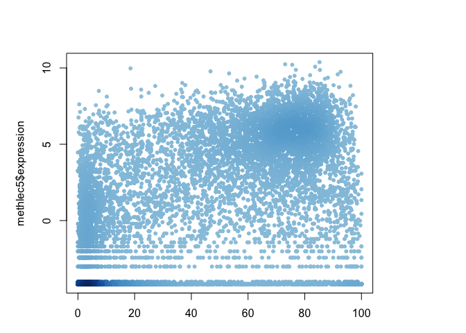<!-- -->

``` r
# Find the indices of genese with exp. levels above 0
inds <- methlec5$expression > 0

# Plot just these points
plot(methlec5$gene.meth[inds], methlec5$expression[inds])
```

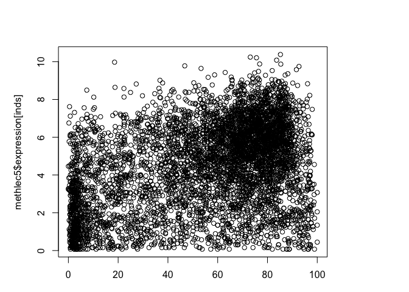<!-- -->

``` r
## Make a color vector for these genes and plot
dcols <- densCols(methlec5$gene.meth[inds], methlec5$expression[inds])
plot(methlec5$gene.meth[inds], methlec5$expression[inds], col = dcols, pch = 20)
```

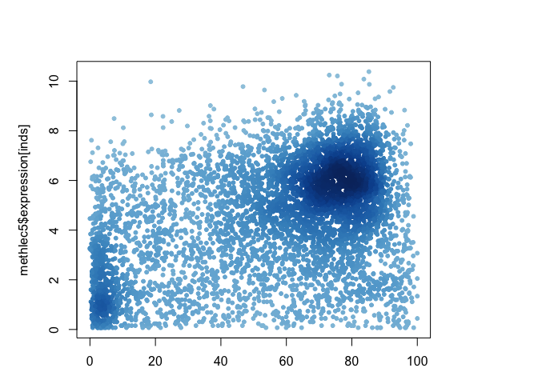<!-- -->

``` r
dcols.custom <- densCols(methlec5$gene.meth[inds], methlec5$expression[inds],
                         colramp = colorRampPalette(c("blue2",
                                                      "green2",
                                                      "red2",
                                                      "yellow")) )

plot(methlec5$gene.meth[inds], methlec5$expression[inds], 
     col = dcols.custom, pch = 20)
```

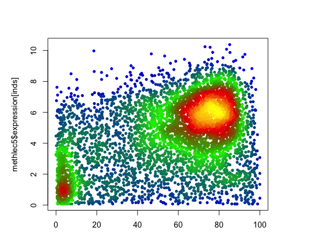<!-- -->
