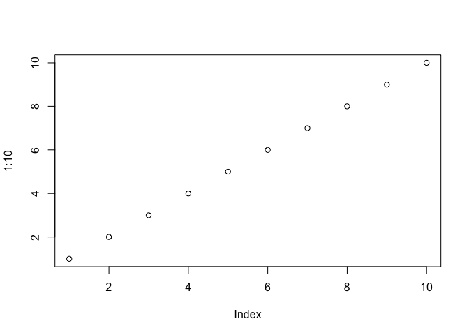
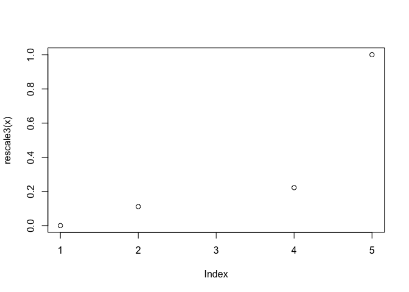
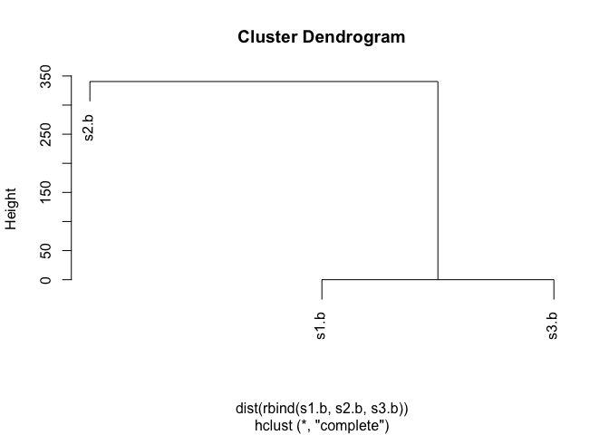
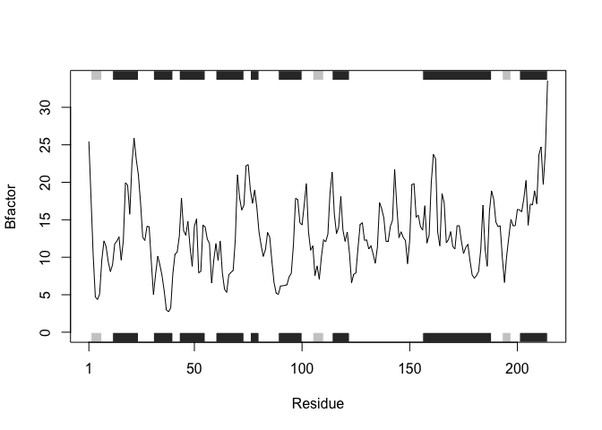

Lecture06 R Functions
================
Michael Nguyen
10/17/2019

# This is H1 (Heading 1)

This is my work from lecture 6 for **BIMM143**

``` r
# This is to demo a code chunk. This area is code, same as R envir't
plot(1:10)
```

<!-- -->

## This is H2

### This is H3, etc.

## Practice reading files (again…)

Here is to practice reading 3 different files

``` r
read.table("Bimm143_L6_test1.txt", sep="," , header = TRUE)
```

    ##   Col1 Col2 Col3
    ## 1    1    2    3
    ## 2    4    5    6
    ## 3    7    8    9
    ## 4    a    b    c

``` r
read.csv("Bimm143_L6_test1.txt")
```

    ##   Col1 Col2 Col3
    ## 1    1    2    3
    ## 2    4    5    6
    ## 3    7    8    9
    ## 4    a    b    c

``` r
read.table("Bimm143_L6_test2.txt", sep="$", header = TRUE)
```

    ##   Col1 Col2 Col3
    ## 1    1    2    3
    ## 2    4    5    6
    ## 3    7    8    9
    ## 4    a    b    c

``` r
read.table("Bimm143_L6_test3.txt", sep="", header=FALSE)
```

    ##   V1 V2 V3
    ## 1  1  6  a
    ## 2  2  7  b
    ## 3  3  8  c
    ## 4  4  9  d
    ## 5  5 10  e

## Writing Functions

### Use shortcut

``` r
add <- function(x, y=1) {# sum the input x and y 
  x + y
  }
```

``` r
add(1)
```

    ## [1] 2

``` r
add(5,5)
```

    ## [1] 10

``` r
# Erros: add(5, 5, 5) and add(5, "barry")
```

\#\#Functions can be
vectorized

``` r
add(x=1, y=4) 
```

    ## [1] 5

``` r
add(1, 4) 
```

    ## [1] 5

``` r
add(1)
```

    ## [1] 2

``` r
add( c(1, 2, 3) )
```

    ## [1] 2 3 4

``` r
add( c(1, 2, 3), 4 )
```

    ## [1] 5 6 7

## Using Data frames and rescale funciton–\> MAKE THINGS EASIER FOR YOURSELF

### You need a “name”, “arguments”, and “body”

``` r
rescale <- function(x) {
rng <-range(x)
(x - rng[1]) / (rng[2] - rng[1])
}
```

``` r
rescale(1:10)
```

    ##  [1] 0.0000000 0.1111111 0.2222222 0.3333333 0.4444444 0.5555556 0.6666667
    ##  [8] 0.7777778 0.8888889 1.0000000

## Test, Fail, change test

### NA = Not Available

Testing some stuff

``` r
rescale( c(1, 2, NA, 3, 10))
```

    ## [1] NA NA NA NA NA

``` r
x <- c(1,2,NA,3,10)
rng <- range(x, na.rm = TRUE)
rng
```

    ## [1]  1 10

``` r
rescale2 <- function(x) {
rng <-range(x, na.rm = TRUE)
(x - rng[1]) / (rng[2] - rng[1])
}
```

``` r
rescale2( c(1,2,NA,3,10))
```

    ## [1] 0.0000000 0.1111111        NA 0.2222222 1.0000000

rescale2(x) also works because we have alread assigned that vector to x

## 

## 

## 

## 

``` r
rescale3 <- function(x, na.rm=TRUE, plot=FALSE) { 
  rng <-range(x, na.rm=na.rm)
  print("Hello")

  answer <- (x - rng[1]) / (rng[2] - rng[1])
  print("is it me you are looking for?")

  if(plot) {

    plot(answer, typ="b", lwd=4)
  }

  print("I can see it in ...") 
  return(answer)
}
```

``` r
rescale3(1:10)
```

    ## [1] "Hello"
    ## [1] "is it me you are looking for?"
    ## [1] "I can see it in ..."

    ##  [1] 0.0000000 0.1111111 0.2222222 0.3333333 0.4444444 0.5555556 0.6666667
    ##  [8] 0.7777778 0.8888889 1.0000000

If insert return(answer) to after answer and before print, it will only
show you hello

``` r
plot(rescale3(x))
```

    ## [1] "Hello"
    ## [1] "is it me you are looking for?"
    ## [1] "I can see it in ..."

<!-- -->

# Lectur 6 Section 2 Lab answers - MICHAEL NGUYEN

Install the **bio3d** package for sequence and structure analysis

``` r
#install.packages("bio3d") <- don't download here in rmd. 
```

``` r
library(bio3d)
s1 <- read.pdb("4AKE") # kinase with drug 
```

    ##   Note: Accessing on-line PDB file

``` r
s2 <- read.pdb("1AKE") # kinase no drug 
```

    ##   Note: Accessing on-line PDB file
    ##    PDB has ALT records, taking A only, rm.alt=TRUE

``` r
s3 <- read.pdb("1E4Y") # kinase with drug
```

    ##   Note: Accessing on-line PDB file

``` r
s1.chainA <- trim.pdb(s1, chain="A", elety="CA") 
s2.chainA <- trim.pdb(s2, chain="A", elety="CA") 
s3.chainA <- trim.pdb(s1, chain="A", elety="CA")

s1.b <- s1.chainA$atom$b 
s2.b <- s2.chainA$atom$b 
s3.b <- s3.chainA$atom$b

plotb3(s1.b, sse=s1.chainA, typ="l", ylab="Bfactor") 
```

<!-- -->

``` r
plotb3(s2.b, sse=s2.chainA, typ="l", ylab="Bfactor") 
```

<!-- -->

``` r
plotb3(s3.b, sse=s3.chainA, typ="l", ylab="Bfactor")
```

<!-- -->

## Q1

The type of object returned from the read.pdf()function are protein
expression levels depending if there is a drug or not.

## Q2

Produce a new similar PDB object, containing a subset of atoms, from a
given larger PDB object

\#\#Q3  
rug()

## Q4 better plot

Bar plot

## Q5

Dendrogram plot

``` r
hc <- hclust( dist( rbind(s1.b, s2.b, s3.b) ) ) 
plot(hc)
```

<!-- --> S1 and S3
both have drugs applied to it and therefore are more related. S1 isn’t
related because no drug. Bar plot or the plot above.

## Q6

Name of new function: kinase

``` r
kinase <- function(x) {
  # Vectorization of the read.pdb() function to reduce duplication. The function reads pdb coordinate data file, with the object being kinase proteins. 
  s1 <- read.pdb(x)  
  # Reduce duplicated ines of vectors for the trim.pdb() function. trim.pdb() produces a new smaller PDB object, containing a subset of atoms, from a given larger PDB object. This function is specifically looking at "hain "A" and Atom type (elety) "CA"
  s1.chainA <- trim.pdb(s1, chain="A", elety="CA") 
  # Reduced duplicaiton. From the smaller PDB object, code looks specifically at the B-factor of chain A. 
  s1.b <- s1.chainA$atom$b 
  # Reduced duplication for plot() function. plot() function plotted the protein data in a line graph. 
  plotb3(s1.b, sse=s1.chainA, typ="l", ylab="Bfactor")
}
```

``` r
# Function reads and plots following PDB data for the "4AKE" protein 
kinase("4AKE")
```

    ##   Note: Accessing on-line PDB file

    ## Warning in get.pdb(file, path = tempdir(), verbose = FALSE): /var/folders/
    ## fg/nhb68dd57_z8_4wsdh4c5lvc0000gn/T//RtmpdweDmI/4AKE.pdb exists. Skipping
    ## download

<!-- -->

``` r
# Function reads and plots following PDB data for the "1AKE" protein 
kinase("1AKE")
```

    ##   Note: Accessing on-line PDB file

    ## Warning in get.pdb(file, path = tempdir(), verbose = FALSE): /var/folders/
    ## fg/nhb68dd57_z8_4wsdh4c5lvc0000gn/T//RtmpdweDmI/1AKE.pdb exists. Skipping
    ## download

    ##    PDB has ALT records, taking A only, rm.alt=TRUE

<!-- -->

``` r
# Function reads and plots following PDB data for the "1E4Y" protein 
kinase("1E4Y")
```

    ##   Note: Accessing on-line PDB file

    ## Warning in get.pdb(file, path = tempdir(), verbose = FALSE): /var/folders/
    ## fg/nhb68dd57_z8_4wsdh4c5lvc0000gn/T//RtmpdweDmI/1E4Y.pdb exists. Skipping
    ## download

<!-- -->
