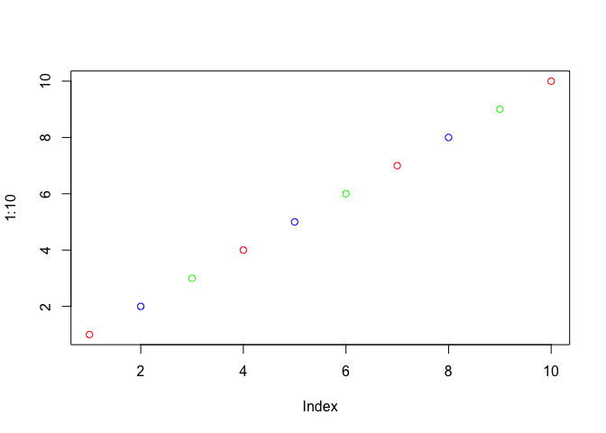

lec07 R Functions and Packages
================
Michael Nguyen
10/22/2019

## R functions, revisited

Source my functions from last day

# RECAP

Control + Opt + I = Bring down R

``` r
source("http://tinyurl.com/rescale-R")
```

take any numeric value and rescale
    it.

``` r
rescale(1:10)
```

    ##  [1] 0.0000000 0.1111111 0.2222222 0.3333333 0.4444444 0.5555556 0.6666667
    ##  [8] 0.7777778 0.8888889 1.0000000

``` r
rescale( c(1, 10, 5, NA, 6))
```

    ## [1] 0.0000000 1.0000000 0.4444444        NA 0.5555556

na.rm = TRUE therfore we have the NA.

Errors: rescale2(c(1:10, “barry”)) *Error: Input x should be numeric*

rescale(c(1:10, “barry”)) *Error in x - rng\[1\] : non-numeric argument
to binary operator*

\#\#Write new function for NA Write a function to find where there are
NA elements in two input vectors. 1. Make some simple inputs where I
**know** the answer

``` r
x <- c(1, 2, NA, 3, NA)
y <- c(NA, 3, NA, 3, 4)
```

Looked online and found the **is.na()**

``` r
is.na(x)
```

    ## [1] FALSE FALSE  TRUE FALSE  TRUE

and the **which** function tells me the elements/values are true

``` r
which(is.na(x))
```

    ## [1] 3 5

``` r
is.na(y)
```

    ## [1]  TRUE FALSE  TRUE FALSE FALSE

``` r
which(is.na(y))
```

    ## [1] 1 3

``` r
is.na(x)
```

    ## [1] FALSE FALSE  TRUE FALSE  TRUE

``` r
is.na(y)
```

    ## [1]  TRUE FALSE  TRUE FALSE FALSE

The **AND (&)** function requries two inputs that are TRUE to give a
TRUE output

``` r
is.na(x) & is.na(y)
```

    ## [1] FALSE FALSE  TRUE FALSE FALSE

Taking the **sum()** of TRUE FALSE vector will tell me how many TRUE
elements I have THIS IS MY WORKING SNIPPET\!\!

``` r
sum(is.na(x) & is.na(y))
```

    ## [1] 1

ex/of sum function

``` r
sum( c(TRUE, TRUE, FALSE, TRUE))
```

    ## [1] 3

\#\#So let’s turn it into a function (both\_na) \#\#\# function\_name
\<- **function**(input arguments) {body}

``` r
both_na <- function (x,y) {
  sum(is.na(x) & is.na(y))
}
```

``` r
both_na(x, y)
```

    ## [1] 1

``` r
x <- c(NA, NA, NA)
y1 <- c( 1, NA, NA)
y2 <- c( 1, NA, NA, NA)
```

``` r
both_na(x, y1)
```

    ## [1] 2

2 because two matching
    NAs.

``` r
both_na(x, y2)
```

    ## Warning in is.na(x) & is.na(y): longer object length is not a multiple of
    ## shorter object length

    ## [1] 3

``` r
x2 <- c(NA, NA)
```

Test

``` r
both_na(x2, y2)
```

    ## [1] 3

RECYCLING VARIABLES/VALUES example:

``` r
plot(1:10, col=c("red", "blue", "green"))
```

<!-- -->

``` r
x <- c(NA, NA, NA)
x2 <- c(NA, NA)
y1 <- c( 1, NA, NA)
y2 <- c( 1, NA, NA, NA)
y3 <- c(1, NA, NA, NA, NA, NA, NA)
both_na(x, y3)
```

    ## Warning in is.na(x) & is.na(y): longer object length is not a multiple of
    ## shorter object length

    ## [1] 6

``` r
x3 <- c(1, NA, NA)
y3 <- c(1, NA, NA, NA, NA, NA, NA)
both_na(x3, y3)
```

    ## Warning in is.na(x) & is.na(y): longer object length is not a multiple of
    ## shorter object length

    ## [1] 4

Viewing length

``` r
length(x)
```

    ## [1] 3

``` r
length(y3)
```

    ## [1] 7

Adding stop() to new funciton **both\_na2**. Add a check for when inputs
x, y are *not* same length

``` r
both_na2 <- function (x,y) {
  if(length(x) != length(y)) {
    stop("Inputs x and y should be the same length!")
  }
  sum(is.na(x) & is.na(y))
}
```

Error in “both\_na2(x, y3)” : **Inputs x and y should be the same
length\!**

\#Lab 7 \#\# Write a function **grade** to determine an overall grade
from a vector of student homework assignment scores dropping the lowest
single slignment score.

``` r
#Student 1
s1 <- c(100, 100, 100, 100, 100, 100, 100, 90)
which.min(s1)
```

    ## [1] 8

``` r
s1[which.min(s1)]
```

    ## [1] 90

``` r
#THIS
s1[-which.min(s1)]
```

    ## [1] 100 100 100 100 100 100 100

``` r
#Student 2
s2 <- c(100, NA, 90, 90, 90, 90, 97, 80)
which.min(s2)
```

    ## [1] 8

``` r
s2[which.min(s2)]
```

    ## [1] 80

Function, round 1

``` r
grade <- function(s) {
  mean(s[-which.min(s)], na.rm = TRUE)
}
```

``` r
grade(s1)
```

    ## [1] 100

``` r
grade(s2)
```

    ## [1] 92.83333

Is there an NA in the student’s grade?

``` r
is.na(s2)
```

    ## [1] FALSE  TRUE FALSE FALSE FALSE FALSE FALSE FALSE

``` r
any(is.na(s2))
```

    ## [1] TRUE

``` r
any(is.na(s1))
```

    ## [1] FALSE

``` r
grade <- function(s) {
  if(any(is.na(s))) {
    warning("Student is missing a homework")
  }
  mean(s[-which.min(s)], na.rm = TRUE)
}
```

``` r
grade(s1)
```

    ## [1] 100

``` r
grade(s2)
```

    ## Warning in grade(s2): Student is missing a homework

    ## [1] 92.83333

if you wanna really take out NA (if you only did one, and rest are NAs)

``` r
grade <- function(s) {
  if(any(is.na(s))) {
    warning("Student is missing a homework")
  }
  sum(s[-which.min(s)], na.rm = TRUE)/(length(s) - 1)
}
```

``` r
grade(s2)
```

    ## Warning in grade(s2): Student is missing a homework

    ## [1] 79.57143

``` r
s3 <- c(100, NA, NA, NA, NA)
grade(s3)
```

    ## Warning in grade(s3): Student is missing a homework

    ## [1] 0

``` r
url <- "https://tinyurl.com/gradeinput"
hw <- read.csv(url, row.names=1)
```

``` r
apply(hw, 1, grade)
```

    ## Warning in FUN(newX[, i], ...): Student is missing a homework
    
    ## Warning in FUN(newX[, i], ...): Student is missing a homework
    
    ## Warning in FUN(newX[, i], ...): Student is missing a homework
    
    ## Warning in FUN(newX[, i], ...): Student is missing a homework

    ##  student-1  student-2  student-3  student-4  student-5  student-6 
    ##      91.75      82.50      84.25      66.00      88.25      89.00 
    ##  student-7  student-8  student-9 student-10 student-11 student-12 
    ##      94.00      93.75      87.75      61.00      86.00      91.75 
    ## student-13 student-14 student-15 student-16 student-17 student-18 
    ##      92.25      87.75      62.50      89.50      88.00      72.75 
    ## student-19 student-20 
    ##      82.75      82.75
