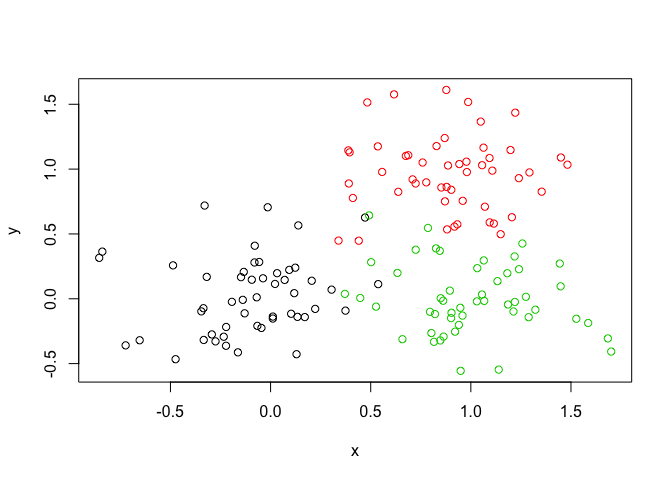

Lec08 Intro to Machine Learning
================
Michael Nguyen
10/24/2019

## K-means clustering

``` r
# Generate some example data for clustering 
tmp <- c(rnorm(30, -3), rnorm(30,3))
x <- cbind(x=tmp, y=rev(tmp)) 

plot (x)
```

<!-- -->

Use the kmeans() function setting k to 2 and nstart=20 Inspect/print the
results

``` r
k <- kmeans(x, centers = 2, nstart = 20)
k
```

    ## K-means clustering with 2 clusters of sizes 30, 30
    ## 
    ## Cluster means:
    ##           x         y
    ## 1  3.178382 -2.999494
    ## 2 -2.999494  3.178382
    ## 
    ## Clustering vector:
    ##  [1] 2 2 2 2 2 2 2 2 2 2 2 2 2 2 2 2 2 2 2 2 2 2 2 2 2 2 2 2 2 2 1 1 1 1 1
    ## [36] 1 1 1 1 1 1 1 1 1 1 1 1 1 1 1 1 1 1 1 1 1 1 1 1 1
    ## 
    ## Within cluster sum of squares by cluster:
    ## [1] 46.24485 46.24485
    ##  (between_SS / total_SS =  92.5 %)
    ## 
    ## Available components:
    ## 
    ## [1] "cluster"      "centers"      "totss"        "withinss"    
    ## [5] "tot.withinss" "betweenss"    "size"         "iter"        
    ## [9] "ifault"

Q. How many points are in each cluster? -\>30 each Q. What ‘component’
of your result object details - cluster size?

``` r
k$size
```

    ## [1] 30 30

  - cluster
    assignment/membership?

<!-- end list -->

``` r
k$cluster
```

    ##  [1] 2 2 2 2 2 2 2 2 2 2 2 2 2 2 2 2 2 2 2 2 2 2 2 2 2 2 2 2 2 2 1 1 1 1 1
    ## [36] 1 1 1 1 1 1 1 1 1 1 1 1 1 1 1 1 1 1 1 1 1 1 1 1 1

  - cluster center?

<!-- end list -->

``` r
k$centers
```

    ##           x         y
    ## 1  3.178382 -2.999494
    ## 2 -2.999494  3.178382

Plot x colored by the kmeans cluster assignment and add cluster centers
as blue points

``` r
plot(x, col = k$cluster)
points(k$centers, col = "blue", pch = 15)
```

<!-- -->

## Heirarchal clustering in R

The `hclust()` function requires a distance matrix as input. You can get
this from the `dist()`
function

``` r
# First we need to calculate point (dis)similarity # as the Euclidean distance between observations 
dist_matrix <- dist(x)

# The hclust() function returns a hierarchical # clustering model
hc <- hclust(d = dist_matrix)

# the print method is not so useful here
hc
```

    ## 
    ## Call:
    ## hclust(d = dist_matrix)
    ## 
    ## Cluster method   : complete 
    ## Distance         : euclidean 
    ## Number of objects: 60

``` r
plot(hc)
# There are 2 clusters. numbers < 30 on L; numbers > 30 on R

abline(h = 6, col="red")
```

<!-- -->

``` r
# cut by height h
cutree(hc, h = 6)
```

    ##  [1] 1 1 1 1 1 1 1 1 1 1 1 1 1 1 1 1 1 1 1 1 1 1 1 1 1 1 1 1 1 1 2 2 2 2 2
    ## [36] 2 2 2 2 2 2 2 2 2 2 2 2 2 2 2 2 2 2 2 2 2 2 2 2 2

``` r
# can save cutree() data into variabel (grps for ex)
```

``` r
cutree(hc, k =4)
```

    ##  [1] 1 2 1 2 1 2 1 1 2 2 2 1 2 2 1 2 1 1 2 2 1 2 2 2 2 1 1 2 1 2 3 4 3 4 4
    ## [36] 3 3 3 3 4 3 3 4 4 3 4 3 3 4 3 3 3 4 4 3 4 3 4 3 4

### Can cut by HEIGHT h or k

Practice

``` r
# Step 1. Generate some example data for clustering
y <- rbind(
matrix(rnorm(100, mean=0, sd = 0.3), ncol = 2), # c1 
matrix(rnorm(100, mean = 1, sd = 0.3), ncol = 2), # c2 
matrix(c(rnorm(50, mean = 1, sd = 0.3), # c3
         rnorm(50, mean = 0, sd = 0.3)), ncol = 2)) 
colnames(y) <- c("x", "y")

# Step 2. Plot the data without clustering
plot(y)
```

<!-- -->

``` r
# Step 3. Generate colors for known clusters (just so we can compare to hclust results) 

col <- as.factor( rep(c("c1","c2","c3"), each=50) )
plot(y, col=col)
```

<!-- -->

### kmeans(x, centers, nstart); hclust(dist(x))

``` r
# K-means
kmeans(y, centers = 3, nstart = 20)
```

    ## K-means clustering with 3 clusters of sizes 48, 52, 50
    ## 
    ## Cluster means:
    ##             x           y
    ## 1  1.03735415 -0.01570573
    ## 2 -0.08709453  0.02861759
    ## 3  0.88270682  0.97506512
    ## 
    ## Clustering vector:
    ##   [1] 2 2 2 2 2 2 2 2 2 2 2 2 2 2 2 2 2 2 2 2 2 2 2 2 3 2 2 2 2 2 2 2 1 2 2
    ##  [36] 2 2 2 2 2 2 2 2 2 2 2 2 2 2 2 3 3 3 3 3 3 3 3 3 3 3 3 3 3 3 3 3 3 2 3
    ##  [71] 3 3 3 3 3 3 3 3 1 2 3 3 3 3 3 3 3 3 3 3 3 3 3 3 3 3 3 3 3 3 1 1 1 3 1
    ## [106] 1 1 1 1 1 1 1 1 1 1 1 1 1 1 1 2 1 1 1 1 2 1 1 1 1 1 1 1 1 1 1 1 1 1 1
    ## [141] 1 1 1 1 1 3 1 1 1 1
    ## 
    ## Within cluster sum of squares by cluster:
    ## [1] 6.971120 8.868105 7.603458
    ##  (between_SS / total_SS =  74.6 %)
    ## 
    ## Available components:
    ## 
    ## [1] "cluster"      "centers"      "totss"        "withinss"    
    ## [5] "tot.withinss" "betweenss"    "size"         "iter"        
    ## [9] "ifault"

``` r
# heirarchal clustering
hclust(dist(y))
```

    ## 
    ## Call:
    ## hclust(d = dist(y))
    ## 
    ## Cluster method   : complete 
    ## Distance         : euclidean 
    ## Number of objects: 150

Q. Use the dist(), hclust(), plot() and cutree() functions to return 2
and 3 clusters

``` r
# Clustering
hc2 <- hclust(dist(y))

# Draw Tree
plot(hc2)
abline(h = 2, col = "red")
```

<!-- -->

``` r
#Cut tree into clusters/groups
cutree(hc2, h = 2)
```

    ##   [1] 1 1 1 1 1 1 1 1 1 1 1 1 1 1 1 1 1 1 1 1 1 1 1 1 1 1 1 1 1 1 1 1 1 1 1
    ##  [36] 1 1 1 1 1 1 1 1 1 1 1 1 1 1 1 2 2 2 2 2 2 2 2 2 2 2 2 2 2 2 2 2 2 1 2
    ##  [71] 2 3 3 2 3 2 2 2 3 1 2 2 2 2 2 2 3 2 2 2 2 3 2 2 2 2 2 3 2 3 3 3 3 1 3
    ## [106] 3 3 3 3 3 3 1 3 3 3 3 3 3 3 3 1 3 3 3 3 1 3 3 3 3 3 3 3 3 1 3 3 3 3 3
    ## [141] 3 3 3 3 3 3 3 1 3 3

``` r
# Try K instead of h
hc2 <- hclust(dist(y))
plot(hc2)
abline(h = 2, col = "red")
```

<!-- -->

``` r
grps <- cutree(hc2, k = 3)
grps
```

    ##   [1] 1 1 1 1 1 1 1 1 1 1 1 1 1 1 1 1 1 1 1 1 1 1 1 1 1 1 1 1 1 1 1 1 1 1 1
    ##  [36] 1 1 1 1 1 1 1 1 1 1 1 1 1 1 1 2 2 2 2 2 2 2 2 2 2 2 2 2 2 2 2 2 2 1 2
    ##  [71] 2 3 3 2 3 2 2 2 3 1 2 2 2 2 2 2 3 2 2 2 2 3 2 2 2 2 2 3 2 3 3 3 3 1 3
    ## [106] 3 3 3 3 3 3 1 3 3 3 3 3 3 3 3 1 3 3 3 3 1 3 3 3 3 3 3 3 3 1 3 3 3 3 3
    ## [141] 3 3 3 3 3 3 3 1 3 3

Q. How does this compare to your known ‘col’ groups? plot the data
colored by their `hclust()` result with k =
3

``` r
plot(y, col = grps)
```

<!-- -->

How many points in each cluster?

``` r
table(grps)
```

    ## grps
    ##  1  2  3 
    ## 58 40 52

Cross - tabulate i.e. compare your clustering result with the known
answer\!

``` r
table(grps, col)
```

    ##     col
    ## grps c1 c2 c3
    ##    1 50  2  6
    ##    2  0 40  0
    ##    3  0  8 44

## PCA

### Ex/ Gene Expression

``` r
mydata <- read.csv("https://tinyurl.com/expression-CSV", row.names=1)

head(mydata)
```

    ##        wt1 wt2  wt3  wt4 wt5 ko1 ko2 ko3 ko4 ko5
    ## gene1  439 458  408  429 420  90  88  86  90  93
    ## gene2  219 200  204  210 187 427 423 434 433 426
    ## gene3 1006 989 1030 1017 973 252 237 238 226 210
    ## gene4  783 792  829  856 760 849 856 835 885 894
    ## gene5  181 249  204  244 225 277 305 272 270 279
    ## gene6  460 502  491  491 493 612 594 577 618 638

``` r
dim(mydata)
```

    ## [1] 100  10

``` r
nrow(mydata)
```

    ## [1] 100

``` r
#samples are columns, genes are rows
```

There are 100 genes

``` r
# Let's do prcomp()

pca <- prcomp(t(mydata), scale = TRUE)
attributes(pca)
```

    ## $names
    ## [1] "sdev"     "rotation" "center"   "scale"    "x"       
    ## 
    ## $class
    ## [1] "prcomp"

Gonna focus on “x” -\> `pca$x`

``` r
# PC1 vs. PC2
plot(pca$x[,1], pca$x[,2])
```

<!-- -->

``` r
#Variance captured per PC. Present variance is often more informative to look at
pca.var <- pca$sdev^2
pca.var.per <- round(pca.var/sum(pca.var)*100, 1)
pca.var.per
```

    ##  [1] 92.6  2.3  1.1  1.1  0.8  0.7  0.6  0.4  0.4  0.0

### NOW let’s make a Scree Plot

``` r
barplot(pca.var.per, main="Scree Plot", xlab="Principal Component", ylab="Percent Variation")
```

<!-- -->

Make Color vector

``` r
# A vector of colors for wt and ko samples
plot(pca$x[,1], pca$x[,2], 
     col = c("red", "red", "red", "red", "red", "blue", "blue", "blue", "blue", "blue"))
```

<!-- -->

### A more “elegant” code for this ^

``` r
# A vector of colors for wt and ko samples
colvec <- colnames(mydata) 
colvec[grep("wt", colvec)] <- "red" 
colvec[grep("ko", colvec)] <- "blue"

plot(pca$x[,1], pca$x[,2], col=colvec, pch=16, 
     xlab=paste0("PC1 (", pca.var.per[1], "%)"), 
     ylab=paste0("PC2 (", pca.var.per[2], "%)"))


identify(pca$x[,1], pca$x[,2], labels=colnames(mydata))
```

    ## integer(0)

``` r
text(pca$x[,1], pca$x[,2], labels = colnames(mydata), pos=c(rep(4,5), rep(2,5)))
```

<!-- -->

# Lecture 8 Lab

## Part 1

``` r
food <- read.csv("UK_foods.csv")
head(food)
```

    ##                X England Wales Scotland N.Ireland
    ## 1         Cheese     105   103      103        66
    ## 2  Carcass_meat      245   227      242       267
    ## 3    Other_meat      685   803      750       586
    ## 4           Fish     147   160      122        93
    ## 5 Fats_and_oils      193   235      184       209
    ## 6         Sugars     156   175      147       139

Questions

``` r
# Q1. How many rows and columns are in your new data frame named x? What R functions could you use to answer this questions?

dim(food)
```

    ## [1] 17  5

``` r
nrow(food)
```

    ## [1] 17

``` r
ncol(food)
```

    ## [1] 5

``` r
# 17 rows and 5 columns. R functions: dim(), nrow(), ncol(). 
```

``` r
food <- read.csv("UK_foods.csv", row.names = 1)
head(food)
```

    ##                England Wales Scotland N.Ireland
    ## Cheese             105   103      103        66
    ## Carcass_meat       245   227      242       267
    ## Other_meat         685   803      750       586
    ## Fish               147   160      122        93
    ## Fats_and_oils      193   235      184       209
    ## Sugars             156   175      147       139

``` r
dim(food)
```

    ## [1] 17  4

Q2. Which approach to solving the ‘row-names problem’ mentioned above do
you prefer and why? Is one approach more robust than another under
certain circumstances? - I like the first version over the “x \<-
x\[,-1\]” version because if you kept doing this it would take away the
first columns. Therefore DANGEROUS.

\#\#Spotting major differences and trends A cursory glance over the
numbers in this table does not reveal much of anything. Indeed in
general it is difficult to extract meaning in regard to major
differences and trends from any given array of numbers. Generating
regular bar-plots and various pairwise plots does not help too much
either:

``` r
barplot(as.matrix(food), beside=T, col=rainbow(nrow(food)))
```

<!-- -->

``` r
# Q3: Changing what optional argument in the above barplot() function results in the following plot?
barplot(as.matrix(food), beside=F, col=rainbow(nrow(food)))
```

<!-- -->

*NO
Q4*

``` r
# Q5: Generating all pairwise plots may help somewhat. Can you make sense of the following code and resulting figure? What does it mean if a given point lies on the diagonal for a given plot?
pairs(food, col=rainbow(10), pch=16)
```

<!-- -->

``` r
# Each country is pairwised with each food group. 
# Ex/ First Row: England on y axis and other three countries on x. A linear graph shows similarities. So England is similar to Wales and Scotland 
# this isn't useful if you're using several data points. 
```

Q6. What is the main differences between N. Ireland and the other
countries of the UK in terms of this data-set? - eat it’s more food…

## PCA to the rescue

``` r
pcaUK <- prcomp( t(food) )
summary(pcaUK)
```

    ## Importance of components:
    ##                             PC1      PC2      PC3       PC4
    ## Standard deviation     324.1502 212.7478 73.87622 4.189e-14
    ## Proportion of Variance   0.6744   0.2905  0.03503 0.000e+00
    ## Cumulative Proportion    0.6744   0.9650  1.00000 1.000e+00

–\> Proportion of Variance shows us true variance. How PC1 is the
biggest\!

``` r
# Q7. Complete the code below to generate a plot of PC1 vs PC2. The second line adds text labels over the data points.

plot(pcaUK$x[,1], pcaUK$x[,2], xlab="PC1", ylab="PC2", xlim=c(-270,500))
```

<!-- -->

``` r
# Q8. Customize your plot so that the colors of the country names match the colors in our UK and Ireland map and table at start of this document.

plot(pcaUK$x[,1], pcaUK$x[,2], xlab="PC1", ylab="PC2", xlim=c(-270,500))
text(pcaUK$x[,1], pcaUK$x[,2], colnames(food), col = c("yellow", "red", "blue", "green3"))
```

<!-- -->

## Calculating how much variation in the original data each PC accounts for.

``` r
v <- round( pcaUK$sdev^2/sum(pcaUK$sdev^2) * 100 )
v
```

    ## [1] 67 29  4  0

``` r
z <- summary(pcaUK)
z$importance
```

    ##                              PC1       PC2      PC3          PC4
    ## Standard deviation     324.15019 212.74780 73.87622 4.188568e-14
    ## Proportion of Variance   0.67444   0.29052  0.03503 0.000000e+00
    ## Cumulative Proportion    0.67444   0.96497  1.00000 1.000000e+00

``` r
barplot(v, xlab="Principal Component", ylab="Percent Variation")
```

<!-- -->

## Digging deeper (variable loadings)

We can also consider the influence of each of the original variables
upon the principal components (typically known as loading scores). This
information can be obtained from the prcomp() returned $rotation
component. It can also be summarized with a call to biplot(), see below:

``` r
## Lets focus on PC1 as it accounts for > 90% of variance 
par(mar=c(10, 3, 0.35, 0))
barplot( pcaUK$rotation[,1], las=2 )
```

<!-- -->

Here we see observations (foods) with the largest positive loading
scores that effectively “push” N. Ireland to right positive side of the
plot (including Fresh\_potatoes and Soft\_drinks).

We can also see the observations/foods with high negative scores that
push the other countries to the left side of the plot (including
Fresh\_fruit and
Alcoholic\_drinks).

``` r
# Q9: Generate a similar ‘loadings plot’ for PC2. What two food groups feature prominantely and what does PC2 maninly tell us about?

par(mar=c(10, 3, 0.35, 0))
barplot( pcaUK$rotation[,2], las=2 )
```

<!-- -->

``` r
# Fresh_potatoes and soft_drinks. they show us that in PC 2, fresh_potatoes pushes Scotland and Wales variance. Wales like their portatoes, and Scotland like their soda. 
```

## Part 2 PCA for RNA-seq data

RNA-seq results often contain a PCA (or related MDS plot). Usually we
use these graphs to verify that the control samples cluster together.
However, there’s a lot more going on, and if you are willing to dive in,
you can extract a lot more information from these plots. The good news
is that PCA only sounds complicated. Conceptually, as we have hopefully
demonstrated here and in the lecture, it is readily accessible and
understandable.

``` r
rna.data <- read.csv("expression.csv", row.names=1)
head(rna.data)
```

    ##        wt1 wt2  wt3  wt4 wt5 ko1 ko2 ko3 ko4 ko5
    ## gene1  439 458  408  429 420  90  88  86  90  93
    ## gene2  219 200  204  210 187 427 423 434 433 426
    ## gene3 1006 989 1030 1017 973 252 237 238 226 210
    ## gene4  783 792  829  856 760 849 856 835 885 894
    ## gene5  181 249  204  244 225 277 305 272 270 279
    ## gene6  460 502  491  491 493 612 594 577 618 638

genes = row, samples = columns

``` r
# Q10: How many genes and samples are in this data?

dim(rna.data)
```

    ## [1] 100  10

``` r
nrow(rna.data)
```

    ## [1] 100

``` r
ncol(rna.data)
```

    ## [1] 10

REST LOOK ABOVE –\> DID IN CLASS

Additional stuff:

``` r
## Another way to color by sample type
## Extract the first 2 characters of the sample name
sample.type <- substr(colnames(rna.data),1,2)
sample.type
```

    ##  [1] "wt" "wt" "wt" "wt" "wt" "ko" "ko" "ko" "ko" "ko"

``` r
## now use this as a factor input to color our plot
plot(pca$x[,1], pca$x[,2], col=as.factor(sample.type), pch=16)
```

<!-- -->

``` r
loading_scores <- pca$rotation[,1]

## Find the top 10 measurements (genes) that contribute
## most to PC1 in either direction (+ or -)
gene_scores <- abs(loading_scores) 
gene_score_ranked <- sort(gene_scores, decreasing=TRUE)

## show the names of the top 10 genes
top_10_genes <- names(gene_score_ranked[1:10])
top_10_genes 
```

    ##  [1] "gene100" "gene66"  "gene45"  "gene68"  "gene98"  "gene60"  "gene21" 
    ##  [8] "gene56"  "gene10"  "gene90"
