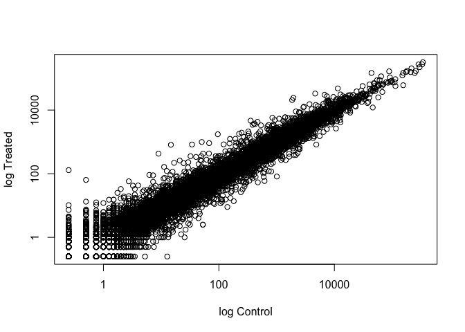
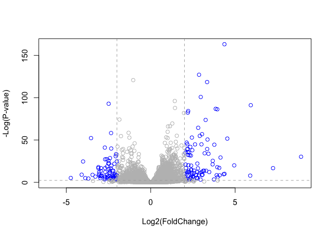
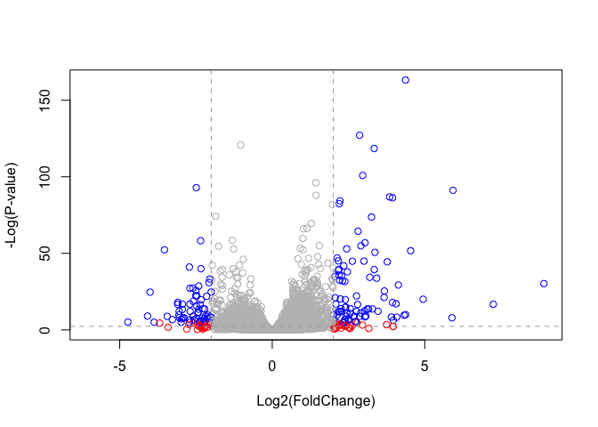

lec14
================
Michael Nguyen
11/12/2019

## DESeq2 setup

We will use the DESeq2 package from bioconductor. To install this, we
ran **in the CONSOLE** - *note: eval=FALSE* option\!:

``` r
install.packages("BiocManager")
BiocManager::install("DESeq2")
```

# Lab 14

## 1\. Bioconductor and DESeq2 setup

### DESeq2 Required Inputs

As input, the DESeq2 package expects (1) a data.frame of count data (as
obtained from RNA-seq or another high-throughput sequencing experiment)
and (2) a second data.frame with information about the samples - often
called sample metadata (or colData in DESeq2-speak because it supplies
metadata/information about the columns of the countData
matrix).

### First Column of of `colData` must MATCH column names of `countData` (-1st)

The “count matrix” (called the countData in DESeq2-speak) the value in
the i-th row and the j-th column of the data.frame tells us how many
reads can be assigned to gene i in sample j. Analogously, for other
types of assays, the rows of this matrix might correspond e.g. to
binding regions (with ChIP-Seq) or peptide sequences (with quantitative
mass spectrometry). For the sample metadata (i.e. colData in
DESeq2-speak) samples are in rows and metadata about those samples are
in columns. Notice that the first column of colData must match the
column names of countData (except the first, which is the gene ID
column).

## 2\. Import countData and colData

First, create a new RStudio project in your GitHub tracked directory
(File \> New Project \> New Directory \> New Project) and download the
input airway\_scaledcounts.csv and airway\_metadata.csv into a new data
sub-directory of your project directory.

Begin a new Rmarkdown document and use the read.csv() function to read
these count data and metadata files.

### Inputting dataset

``` r
counts <- read.csv("airway_scaledcounts.csv", stringsAsFactors = FALSE)
metadata <-  read.csv("airway_metadata.csv", stringsAsFactors = FALSE)
```

Have a
    peak…

``` r
head(counts)
```

    ##           ensgene SRR1039508 SRR1039509 SRR1039512 SRR1039513 SRR1039516
    ## 1 ENSG00000000003        723        486        904        445       1170
    ## 2 ENSG00000000005          0          0          0          0          0
    ## 3 ENSG00000000419        467        523        616        371        582
    ## 4 ENSG00000000457        347        258        364        237        318
    ## 5 ENSG00000000460         96         81         73         66        118
    ## 6 ENSG00000000938          0          0          1          0          2
    ##   SRR1039517 SRR1039520 SRR1039521
    ## 1       1097        806        604
    ## 2          0          0          0
    ## 3        781        417        509
    ## 4        447        330        324
    ## 5         94        102         74
    ## 6          0          0          0

``` r
head(metadata)
```

    ##           id     dex celltype     geo_id
    ## 1 SRR1039508 control   N61311 GSM1275862
    ## 2 SRR1039509 treated   N61311 GSM1275863
    ## 3 SRR1039512 control  N052611 GSM1275866
    ## 4 SRR1039513 treated  N052611 GSM1275867
    ## 5 SRR1039516 control  N080611 GSM1275870
    ## 6 SRR1039517 treated  N080611 GSM1275871

You can also use the View() function to view the entire object. Notice
something here. The sample IDs in the metadata sheet (SRR1039508,
SRR1039509, etc.) exactly match the column names of the countdata,
except for the first column, which contains the Ensembl gene ID. This is
important, and we’ll get more strict about it later on.

``` r
# Number of genes in `counts` dataset?
nrow(counts)
```

    ## [1] 38694

``` r
# How many experiments do we have?
ncol(counts)
```

    ## [1] 9

``` r
nrow(metadata)
```

    ## [1] 8

Metadata has 8 because it’s -1st

## 3\. Toy differential gene expression

Lets perform some exploratory differential gene expression analysis.
Note: this analysis is for demonstration only. NEVER do differential
expression analysis this way\!

Look at the metadata object again to see which samples are control and
which are drug treated

``` r
head(metadata)
```

    ##           id     dex celltype     geo_id
    ## 1 SRR1039508 control   N61311 GSM1275862
    ## 2 SRR1039509 treated   N61311 GSM1275863
    ## 3 SRR1039512 control  N052611 GSM1275866
    ## 4 SRR1039513 treated  N052611 GSM1275867
    ## 5 SRR1039516 control  N080611 GSM1275870
    ## 6 SRR1039517 treated  N080611 GSM1275871

If we look at our metadata, we see that the control samples are
SRR1039508, SRR1039512, SRR1039516, and SRR1039520. This bit of code
will first find the sample id for those labeled control. Then calculate
the mean counts per gene across these samples

We all want to know if there is a difference in expression values for
control (non-drug) vs. treated (w/ drug cell lines)

First step is to find which experiments were the control (and which were
the treated/experimental ones) and then get the average values across
all control experiments (or treated).

``` r
control <- metadata[metadata[,"dex"]=="control",]
control.mean <- rowSums( counts[ ,control$id] )/4 
names(control.mean) <- counts$ensgene
```

``` r
control <- metadata[metadata[,"dex"]=="control",]
control
```

    ##           id     dex celltype     geo_id
    ## 1 SRR1039508 control   N61311 GSM1275862
    ## 3 SRR1039512 control  N052611 GSM1275866
    ## 5 SRR1039516 control  N080611 GSM1275870
    ## 7 SRR1039520 control  N061011 GSM1275874

``` r
# shows which rows are just control
# can also do `metadata$x` (x = what you're looking for)
control$id
```

    ## [1] "SRR1039508" "SRR1039512" "SRR1039516" "SRR1039520"

``` r
# accessing columnes ( [ ,x])
```

Q1. How would you make the above code more robust? What would happen if
you were to add more samples. Would the values obtained with the exact
code above be correct? - Maybe make a function out of it? If I were able
to add more samples then I would have to change denominator (in this
case chanigng the 4). Not sure…

  - So now let’s calculate the mean values across these control columns
    of the **countdata**

<!-- end list -->

``` r
control.mean<- rowSums(counts[ ,control$id])/length(control$id)
names(control.mean) <- counts$ensgene
# Want a mean of the rows presented below
```

Q2. Follow the same procedure for the treated samples (i.e. calculate
the mean per gene accross drug treated samples and assign to a labeled
vector called treated.mean)

``` r
treated <- metadata[metadata[,"dex"]=="treated",]
treated.mean <- rowSums( counts[ ,treated$id] )/4 
names(treated.mean) <- counts$ensgene
```

``` r
treated <- metadata[metadata[,"dex"]=="treated",]
treated
```

    ##           id     dex celltype     geo_id
    ## 2 SRR1039509 treated   N61311 GSM1275863
    ## 4 SRR1039513 treated  N052611 GSM1275867
    ## 6 SRR1039517 treated  N080611 GSM1275871
    ## 8 SRR1039521 treated  N061011 GSM1275875

``` r
treated$id
```

    ## [1] "SRR1039509" "SRR1039513" "SRR1039517" "SRR1039521"

``` r
treated.mean <- rowSums( counts[ ,treated$id] )/length(treated$id)
names(treated.mean) <- counts$ensgene
```

``` r
meanx <- function(control, treated) {
  
}
```

``` r
meancounts <- data.frame(control.mean, treated.mean)
```

Directly comparing the raw counts is going to be problematic if we just
happened to sequence one group at a higher depth than another. Later on
we’ll do this analysis properly, normalizing by sequencing depth per
sample using a better approach. But for now, colSums() the data to show
the sum of the mean counts across all genes for each group. Your answer
should look like this:

``` r
colSums(meancounts)
```

    ## control.mean treated.mean 
    ##     23005324     22196524

Q3. Create a scatter plot showing the mean of the treated samples
against the mean of the control samples. Your plot should look something
like the
following.

``` r
plot(meancounts$control.mean, meancounts$treated.mean, log = "xy", xlab = "log Control", ylab = "log Treated")
```

    ## Warning in xy.coords(x, y, xlabel, ylabel, log): 15032 x values <= 0
    ## omitted from logarithmic plot

    ## Warning in xy.coords(x, y, xlabel, ylabel, log): 15281 y values <= 0
    ## omitted from logarithmic plot

<!-- -->

``` r
plot(control.mean, treated.mean, log = "xy", xlab = "log Control", ylab = "log Treated")
```

    ## Warning in xy.coords(x, y, xlabel, ylabel, log): 15032 x values <= 0
    ## omitted from logarithmic plot
    
    ## Warning in xy.coords(x, y, xlabel, ylabel, log): 15281 y values <= 0
    ## omitted from logarithmic plot

<!-- -->

``` r
# SAME PLOTS
```

We can find candidate differentially expressed genes by looking for
genes with a large change between control and dex-treated samples. We
usually look at the log2 of the fold change, because this has better
mathematical properties.

Here we calculate **log2foldchange**, add it to our meancounts
data.frame and inspect the results either with the head() or the View()
function for
example.

``` r
meancounts$log2fc <- log2(meancounts[,"treated.mean"]/meancounts[,"control.mean"])
head(meancounts)
```

    ##                 control.mean treated.mean      log2fc
    ## ENSG00000000003       900.75       658.00 -0.45303916
    ## ENSG00000000005         0.00         0.00         NaN
    ## ENSG00000000419       520.50       546.00  0.06900279
    ## ENSG00000000457       339.75       316.50 -0.10226805
    ## ENSG00000000460        97.25        78.75 -0.30441833
    ## ENSG00000000938         0.75         0.00        -Inf

``` r
# or
meancounts$log2fc <- log2(meancounts$treated.mean/meancounts$control.mean)
```

There are a couple of “weird” results. Namely, the **NaN** (“not a
number”“) and **-Inf** (negative infinity) results.

The NaN is returned when you divide by zero and try to take the log. The
-Inf is returned when you try to take the log of zero. It turns out that
there are a lot of genes with zero expression. Let’s filter our data to
remove these genes. Again inspect your result (and the intermediate
steps) to see if things make sense to you

``` r
zero.vals <-  which(meancounts[, 1:2]==0, arr.ind =TRUE)
# == tests for which ones are whatever value
# arr.ind tells us where these values of interest are at. (in this case, 0)
to.rm <- unique(zero.vals[,1])
mycounts <- meancounts[-to.rm,]
head(mycounts)
```

    ##                 control.mean treated.mean      log2fc
    ## ENSG00000000003       900.75       658.00 -0.45303916
    ## ENSG00000000419       520.50       546.00  0.06900279
    ## ENSG00000000457       339.75       316.50 -0.10226805
    ## ENSG00000000460        97.25        78.75 -0.30441833
    ## ENSG00000000971      5219.00      6687.50  0.35769358
    ## ENSG00000001036      2327.00      1785.75 -0.38194109

``` r
# unique() allows us to specifically choose either a column or a row (or both) to anyalize the data. In this case, we're interested in col. 1
```

Q4. What is the purpose of the arr.ind argument in the which() function
call above? Why would we then take the first column of the output and
need to call the unique() function? - unique returns a vector, data
frame or array like x but with duplicate elements/rows removed.

A common threshold used for calling something differentially expressed
is a log2(FoldChange) of greater than 2 or less than -2. Let’s filter
the dataset both ways to see how many genes are up or down-regulated.

``` r
up.ind <- mycounts$log2fc > 2
down.ind <- mycounts$log2fc < (-2)
```

Q5. Using the up.ind and down.ind vectors above can you determine how
many up and down regulated genes we have at the greater than 2 fc level?
- yes.

``` r
sum(up.ind)
```

    ## [1] 250

``` r
# Sum logicals (1 =T, 0 = F)
sum(down.ind)
```

    ## [1] 367

``` r
total_counts<- sum(up.ind, down.ind)
total_counts
```

    ## [1] 617

``` r
head(mycounts[up.ind,])
```

    ##                 control.mean treated.mean   log2fc
    ## ENSG00000004799       270.50      1429.25 2.401558
    ## ENSG00000006788         2.75        19.75 2.844349
    ## ENSG00000008438         0.50         2.75 2.459432
    ## ENSG00000011677         0.50         2.25 2.169925
    ## ENSG00000015413         0.50         3.00 2.584963
    ## ENSG00000015592         0.50         2.25 2.169925

``` r
head(mycounts[down.ind,])
```

    ##                 control.mean treated.mean    log2fc
    ## ENSG00000015520        32.00         6.00 -2.415037
    ## ENSG00000019186        26.50         1.75 -3.920566
    ## ENSG00000025423       295.00        54.25 -2.443020
    ## ENSG00000028277        88.25        22.00 -2.004093
    ## ENSG00000029559         1.25         0.25 -2.321928
    ## ENSG00000049246       405.00        93.00 -2.122619

## 4\. Adding annotation data

Our mycounts result table so far only contains the Ensembl gene IDs.
However, alternative gene names and extra annotation are usually
required for informative for interpretation.

We can add annotation from a supplied CSV file, such as those available
from ENSEMBLE or UCSC. The **annotables\_grch38.csv** annotation table
links the unambiguous Ensembl gene ID to other useful annotation like
the gene symbol, full gene name, location, Entrez gene ID, etc.

``` r
anno <- read.csv("annotables_grch38.csv")
head(anno)
```

    ##           ensgene entrez   symbol chr     start       end strand
    ## 1 ENSG00000000003   7105   TSPAN6   X 100627109 100639991     -1
    ## 2 ENSG00000000005  64102     TNMD   X 100584802 100599885      1
    ## 3 ENSG00000000419   8813     DPM1  20  50934867  50958555     -1
    ## 4 ENSG00000000457  57147    SCYL3   1 169849631 169894267     -1
    ## 5 ENSG00000000460  55732 C1orf112   1 169662007 169854080      1
    ## 6 ENSG00000000938   2268      FGR   1  27612064  27635277     -1
    ##          biotype
    ## 1 protein_coding
    ## 2 protein_coding
    ## 3 protein_coding
    ## 4 protein_coding
    ## 5 protein_coding
    ## 6 protein_coding
    ##                                                                                                  description
    ## 1                                                          tetraspanin 6 [Source:HGNC Symbol;Acc:HGNC:11858]
    ## 2                                                            tenomodulin [Source:HGNC Symbol;Acc:HGNC:17757]
    ## 3 dolichyl-phosphate mannosyltransferase polypeptide 1, catalytic subunit [Source:HGNC Symbol;Acc:HGNC:3005]
    ## 4                                               SCY1-like, kinase-like 3 [Source:HGNC Symbol;Acc:HGNC:19285]
    ## 5                                    chromosome 1 open reading frame 112 [Source:HGNC Symbol;Acc:HGNC:25565]
    ## 6                          FGR proto-oncogene, Src family tyrosine kinase [Source:HGNC Symbol;Acc:HGNC:3697]

WILL CONTINUE LATER

question 8…

FOLD CHANGE

## 5\. DESeq2 analysis

Let’s do this the right way. DESeq2 is an R package for analyzing
count-based NGS data like RNA-seq. It is available from Bioconductor.
Bioconductor is a project to provide tools for analyzing high-throughput
genomic data including RNA-seq, ChIP-seq and arrays. You can explore
Bioconductor packages here.

Just like R packages from CRAN, you only need to install Bioconductor
packages once (instructions here), then load them every time you start a
new R session.

``` r
library(DESeq2)
```

    ## Loading required package: S4Vectors

    ## Loading required package: stats4

    ## Loading required package: BiocGenerics

    ## Loading required package: parallel

    ## 
    ## Attaching package: 'BiocGenerics'

    ## The following objects are masked from 'package:parallel':
    ## 
    ##     clusterApply, clusterApplyLB, clusterCall, clusterEvalQ,
    ##     clusterExport, clusterMap, parApply, parCapply, parLapply,
    ##     parLapplyLB, parRapply, parSapply, parSapplyLB

    ## The following objects are masked from 'package:stats':
    ## 
    ##     IQR, mad, sd, var, xtabs

    ## The following objects are masked from 'package:base':
    ## 
    ##     anyDuplicated, append, as.data.frame, basename, cbind,
    ##     colnames, dirname, do.call, duplicated, eval, evalq, Filter,
    ##     Find, get, grep, grepl, intersect, is.unsorted, lapply, Map,
    ##     mapply, match, mget, order, paste, pmax, pmax.int, pmin,
    ##     pmin.int, Position, rank, rbind, Reduce, rownames, sapply,
    ##     setdiff, sort, table, tapply, union, unique, unsplit, which,
    ##     which.max, which.min

    ## 
    ## Attaching package: 'S4Vectors'

    ## The following object is masked from 'package:base':
    ## 
    ##     expand.grid

    ## Loading required package: IRanges

    ## Loading required package: GenomicRanges

    ## Loading required package: GenomeInfoDb

    ## Loading required package: SummarizedExperiment

    ## Loading required package: Biobase

    ## Welcome to Bioconductor
    ## 
    ##     Vignettes contain introductory material; view with
    ##     'browseVignettes()'. To cite Bioconductor, see
    ##     'citation("Biobase")', and for packages 'citation("pkgname")'.

    ## Loading required package: DelayedArray

    ## Loading required package: matrixStats

    ## 
    ## Attaching package: 'matrixStats'

    ## The following objects are masked from 'package:Biobase':
    ## 
    ##     anyMissing, rowMedians

    ## Loading required package: BiocParallel

    ## 
    ## Attaching package: 'DelayedArray'

    ## The following objects are masked from 'package:matrixStats':
    ## 
    ##     colMaxs, colMins, colRanges, rowMaxs, rowMins, rowRanges

    ## The following objects are masked from 'package:base':
    ## 
    ##     aperm, apply, rowsum

## Importing data

We will use the DESeqDataSetFromMatrix() function to build the required
DESeqDataSet object and call it dds, short for our DESeqDataSet. If you
get a warning about “some variables in design formula are characters,
converting to factors” don’t worry about it. Take a look at the dds
object once you create it.

``` r
dds <- DESeqDataSetFromMatrix(countData=counts, 
                              colData=metadata, 
                              design=~dex, 
                              tidy=TRUE)
```

    ## converting counts to integer mode

    ## Warning in DESeqDataSet(se, design = design, ignoreRank): some variables in
    ## design formula are characters, converting to factors

``` r
dds
```

    ## class: DESeqDataSet 
    ## dim: 38694 8 
    ## metadata(1): version
    ## assays(1): counts
    ## rownames(38694): ENSG00000000003 ENSG00000000005 ...
    ##   ENSG00000283120 ENSG00000283123
    ## rowData names(0):
    ## colnames(8): SRR1039508 SRR1039509 ... SRR1039520 SRR1039521
    ## colData names(4): id dex celltype geo_id

Run DESeq2

``` r
dds <- DESeq(dds)
```

    ## estimating size factors

    ## estimating dispersions

    ## gene-wise dispersion estimates

    ## mean-dispersion relationship

    ## final dispersion estimates

    ## fitting model and testing

## Get the Results

``` r
res <- results(dds)
res
```

    ## log2 fold change (MLE): dex treated vs control 
    ## Wald test p-value: dex treated vs control 
    ## DataFrame with 38694 rows and 6 columns
    ##                          baseMean     log2FoldChange             lfcSE
    ##                         <numeric>          <numeric>         <numeric>
    ## ENSG00000000003  747.194195359907 -0.350703020686579 0.168245681332529
    ## ENSG00000000005                 0                 NA                NA
    ## ENSG00000000419  520.134160051965  0.206107766417861 0.101059218008052
    ## ENSG00000000457  322.664843927049 0.0245269479387471 0.145145067649248
    ## ENSG00000000460   87.682625164828  -0.14714204922212 0.257007253994673
    ## ...                           ...                ...               ...
    ## ENSG00000283115                 0                 NA                NA
    ## ENSG00000283116                 0                 NA                NA
    ## ENSG00000283119                 0                 NA                NA
    ## ENSG00000283120 0.974916032393564  -0.66825846051647  1.69456285241871
    ## ENSG00000283123                 0                 NA                NA
    ##                               stat             pvalue              padj
    ##                          <numeric>          <numeric>         <numeric>
    ## ENSG00000000003   -2.0844696749953 0.0371174658432827 0.163034808641681
    ## ENSG00000000005                 NA                 NA                NA
    ## ENSG00000000419    2.0394751758463 0.0414026263001167 0.176031664879168
    ## ENSG00000000457  0.168982303952746  0.865810560623561 0.961694238404388
    ## ENSG00000000460  -0.57252099672319  0.566969065257939 0.815848587637724
    ## ...                            ...                ...               ...
    ## ENSG00000283115                 NA                 NA                NA
    ## ENSG00000283116                 NA                 NA                NA
    ## ENSG00000283119                 NA                 NA                NA
    ## ENSG00000283120 -0.394354484734893  0.693319342566817                NA
    ## ENSG00000283123                 NA                 NA                NA

### WE GOT OUR FOLDCHANGE *AND* and P-VALUE

Volvano plot \>\> annotation of genes \>\> save results for next day

## Making a Volcano (Summary) Plot

What’s plotted: foldchange at x, -log (pvalue) at y This figure will
combine both Fold Change and the p-value into one overview figure
indicating the proportion of genes with large scale sig. differences in
their
expression.

### Let’s make another commonly produced visualization from this data, namely so-called Volcano plots. These summary figures are frequently used to highlight the proportion of genes that are both significantly regulated and display a high fold change.

First, let’s add a column called sig to our full res results that
evaluates to TRUE only if padj\<0.05 and the absolute log2FoldChange\>2,
FALSE if not, and NA if padj is also NA.

``` r
res$sig <- res$padj<0.05 & abs(res$log2FoldChange)>2
table(res$sig)
```

    ## 
    ## FALSE  TRUE 
    ## 24282   167

``` r
sum(is.na(res$sig))
```

    ## [1] 14245

A volcano plot shows the log fold change on the X-axis, and the −log10
of the p-value on the Y-axis (the more significant the p-value, the
larger the −log10 of that value will be).

Want -log for smaller p-values.

Here we first make a volcano plot with base graphics and color by our
res$sig+1 (we add 1 so we dont have 0 as a color and end up with white
points):

KEY version

``` r
# Set the color palette for our plot
palette( c("gray","blue") )

plot( res$log2FoldChange,  -log(res$padj), 
 col=res$sig+1, ylab="-Log(P-value)", xlab="Log2(FoldChange)")

# Add some cut-off lines
abline(v=c(-2,2), col="darkgray", lty=2)
abline(h=-log(0.1), col="darkgray", lty=2)
```

<!-- -->

``` r
# Reset the color palette
palette("default")   
```

``` r
# Setup our custom point color vector 
mycols <- rep("gray", nrow(res))
mycols[ abs(res$log2FoldChange) > 2 ]  <- "red" 

inds <- (res$padj < 0.01) & (abs(res$log2FoldChange) > 2 )
mycols[ inds ] <- "blue"

#Volcano plot with custom colors 
plot( res$log2FoldChange,  -log(res$padj), 
 col=mycols, ylab="-Log(P-value)", xlab="Log2(FoldChange)" )

abline(v=c(-2,2), col="darkgray", lty=2)
abline(h=-log(0.1), col="darkgray", lty=2)
```

<!-- -->

``` r
# Add some color please
mycols <- rep("gray", nrow(res))
# Make points with +2 -2 fold change to BLUE
mycols[abs(res$log2FoldChange) > 2] <- "blue"

# make points below pvalue cuttoff (red or gray)
mycols[ abs(res$padj) > 0.05]  <- "gray" 
plot(res$log2FoldChange, -log(res$padj),col=mycols)
abline(v=c(-2,2), col="black", lty=2)
abline(h=-log(0.05), col="black", lty=2)
```

<!-- -->

## Saving our results

``` r
write.csv(res, file= "expression_results.csv")
```
