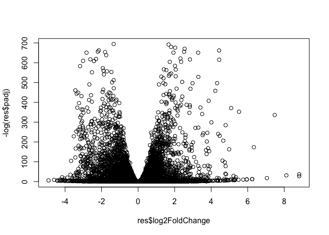
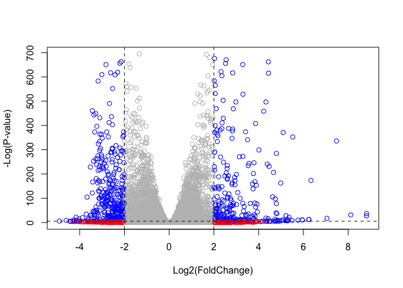

lec15
================
Michael Nguyen
11/14/2019

# Lab 15: Pathway Analysis from RNA-Seq Results

## About our Input Data

The data for for hands-on session comes from GEO entry: GSE37704, which
is associated with the following publication:

> Trapnell C, Hendrickson DG, Sauvageau M, Goff L et al. “Differential
> analysis of gene regulation at transcript resolution with RNA-seq”.
> Nat Biotechnol 2013 Jan;31(1):46-53. PMID: 23222703

The authors report on differential analysis of lung fibroblasts in
response to loss of the developmental transcription factor HOXA1. Their
results and others indicate that HOXA1 is required for lung fibroblast
and HeLa cell cycle progression. In particular their analysis show that
“loss of HOXA1 results in significant expression level changes in
thousands of individual transcripts, along with isoform switching events
in key regulators of the cell cycle”. For our session we have used their
Sailfish gene-level estimated counts and hence are restricted to
protein-coding genes only.

``` r
library(DESeq2)
```

    ## Loading required package: S4Vectors

    ## Loading required package: stats4

    ## Loading required package: BiocGenerics

    ## Loading required package: parallel

    ## 
    ## Attaching package: 'BiocGenerics'

    ## The following objects are masked from 'package:parallel':
    ## 
    ##     clusterApply, clusterApplyLB, clusterCall, clusterEvalQ,
    ##     clusterExport, clusterMap, parApply, parCapply, parLapply,
    ##     parLapplyLB, parRapply, parSapply, parSapplyLB

    ## The following objects are masked from 'package:stats':
    ## 
    ##     IQR, mad, sd, var, xtabs

    ## The following objects are masked from 'package:base':
    ## 
    ##     anyDuplicated, append, as.data.frame, basename, cbind,
    ##     colnames, dirname, do.call, duplicated, eval, evalq, Filter,
    ##     Find, get, grep, grepl, intersect, is.unsorted, lapply, Map,
    ##     mapply, match, mget, order, paste, pmax, pmax.int, pmin,
    ##     pmin.int, Position, rank, rbind, Reduce, rownames, sapply,
    ##     setdiff, sort, table, tapply, union, unique, unsplit, which,
    ##     which.max, which.min

    ## 
    ## Attaching package: 'S4Vectors'

    ## The following object is masked from 'package:base':
    ## 
    ##     expand.grid

    ## Loading required package: IRanges

    ## Loading required package: GenomicRanges

    ## Loading required package: GenomeInfoDb

    ## Loading required package: SummarizedExperiment

    ## Loading required package: Biobase

    ## Welcome to Bioconductor
    ## 
    ##     Vignettes contain introductory material; view with
    ##     'browseVignettes()'. To cite Bioconductor, see
    ##     'citation("Biobase")', and for packages 'citation("pkgname")'.

    ## Loading required package: DelayedArray

    ## Loading required package: matrixStats

    ## 
    ## Attaching package: 'matrixStats'

    ## The following objects are masked from 'package:Biobase':
    ## 
    ##     anyMissing, rowMedians

    ## Loading required package: BiocParallel

    ## 
    ## Attaching package: 'DelayedArray'

    ## The following objects are masked from 'package:matrixStats':
    ## 
    ##     colMaxs, colMins, colRanges, rowMaxs, rowMins, rowRanges

    ## The following objects are masked from 'package:base':
    ## 
    ##     aperm, apply, rowsum

## 1\. Differential Expression Analysis

``` r
metaFile <- "GSE37704_metadata.csv"
countFile <- "GSE37704_featurecounts.csv"

# Import metadata and take a peak
colData = read.csv(metaFile, row.names=1)
head(colData)
```

    ##               condition
    ## SRR493366 control_sirna
    ## SRR493367 control_sirna
    ## SRR493368 control_sirna
    ## SRR493369      hoxa1_kd
    ## SRR493370      hoxa1_kd
    ## SRR493371      hoxa1_kd

Using a control with siRNA and KD HOXa1 gene

``` r
# Import countdata
countData = read.csv(countFile, row.names=1)
head(countData)
```

    ##                 length SRR493366 SRR493367 SRR493368 SRR493369 SRR493370
    ## ENSG00000186092    918         0         0         0         0         0
    ## ENSG00000279928    718         0         0         0         0         0
    ## ENSG00000279457   1982        23        28        29        29        28
    ## ENSG00000278566    939         0         0         0         0         0
    ## ENSG00000273547    939         0         0         0         0         0
    ## ENSG00000187634   3214       124       123       205       207       212
    ##                 SRR493371
    ## ENSG00000186092         0
    ## ENSG00000279928         0
    ## ENSG00000279457        46
    ## ENSG00000278566         0
    ## ENSG00000273547         0
    ## ENSG00000187634       258

  - don’t match because there is a length data…\* REMOVE COL

The *length* of the column in countData is going to cause problems with
the required matching to the metadata file so let’s remove it her.

``` r
# Note we need to remove the odd first $length col
countData <- as.matrix(countData[,-1])
head(countData)
```

    ##                 SRR493366 SRR493367 SRR493368 SRR493369 SRR493370
    ## ENSG00000186092         0         0         0         0         0
    ## ENSG00000279928         0         0         0         0         0
    ## ENSG00000279457        23        28        29        29        28
    ## ENSG00000278566         0         0         0         0         0
    ## ENSG00000273547         0         0         0         0         0
    ## ENSG00000187634       124       123       205       207       212
    ##                 SRR493371
    ## ENSG00000186092         0
    ## ENSG00000279928         0
    ## ENSG00000279457        46
    ## ENSG00000278566         0
    ## ENSG00000273547         0
    ## ENSG00000187634       258

Double check that the *colnames* in countData matches the ID values in
the colData with
    *rownames*

``` r
colnames(countData)
```

    ## [1] "SRR493366" "SRR493367" "SRR493368" "SRR493369" "SRR493370" "SRR493371"

``` r
rownames(colData)
```

    ## [1] "SRR493366" "SRR493367" "SRR493368" "SRR493369" "SRR493370" "SRR493371"

``` r
colnames(countData) == rownames(colData)
```

    ## [1] TRUE TRUE TRUE TRUE TRUE TRUE

``` r
all(colnames(countData) == rownames(colData))
```

    ## [1] TRUE

``` r
# example of all() to check if all entries in a vector are true

all(c(T, T, T))
```

    ## [1] TRUE

``` r
all(c(T, F, T))
```

    ## [1] FALSE

`View(countData)`

### Now get Rid of the Zeros\!

Q. Complete the code below to filter countData to exclude genes
(i.e. rows) where we have 0 read count across all samples
(i.e. columns).

Tip: What will rowSums() of countData return and how could you use it in
this context?

``` r
countData = countData[rowSums(countData) != 0, ]
head(countData)
```

    ##                 SRR493366 SRR493367 SRR493368 SRR493369 SRR493370
    ## ENSG00000279457        23        28        29        29        28
    ## ENSG00000187634       124       123       205       207       212
    ## ENSG00000188976      1637      1831      2383      1226      1326
    ## ENSG00000187961       120       153       180       236       255
    ## ENSG00000187583        24        48        65        44        48
    ## ENSG00000187642         4         9        16        14        16
    ##                 SRR493371
    ## ENSG00000279457        46
    ## ENSG00000187634       258
    ## ENSG00000188976      1504
    ## ENSG00000187961       357
    ## ENSG00000187583        64
    ## ENSG00000187642        16

can also use \> 0 instead of \!=

## Running DESeq2

``` r
dds = DESeqDataSetFromMatrix(countData=countData,
                             colData=colData,
                             design=~condition)
dds = DESeq(dds)
```

    ## estimating size factors

    ## estimating dispersions

    ## gene-wise dispersion estimates

    ## mean-dispersion relationship

    ## final dispersion estimates

    ## fitting model and testing

``` r
# What runs the analysis^
```

``` r
dds
```

    ## class: DESeqDataSet 
    ## dim: 15975 6 
    ## metadata(1): version
    ## assays(4): counts mu H cooks
    ## rownames(15975): ENSG00000279457 ENSG00000187634 ...
    ##   ENSG00000276345 ENSG00000271254
    ## rowData names(22): baseMean baseVar ... deviance maxCooks
    ## colnames(6): SRR493366 SRR493367 ... SRR493370 SRR493371
    ## colData names(2): condition sizeFactor

Next, get results for the HoxA1 knockdown versus control siRNA (remember
that these were labeled as “hoxa1\_kd” and “control\_sirna” in our
original colData metaFile input to DESeq, you can check this above and
by running resultsNames(dds) command).

``` r
resultsNames(dds)
```

    ## [1] "Intercept"                          
    ## [2] "condition_hoxa1_kd_vs_control_sirna"

``` r
res = results(dds, contrast=c("condition","hoxa1_kd", "control_sirna"))
res
```

    ## log2 fold change (MLE): condition hoxa1_kd vs control_sirna 
    ## Wald test p-value: condition hoxa1 kd vs control sirna 
    ## DataFrame with 15975 rows and 6 columns
    ##                         baseMean     log2FoldChange              lfcSE
    ##                        <numeric>          <numeric>          <numeric>
    ## ENSG00000279457 29.9135794276176  0.179257083672691  0.324821565250144
    ## ENSG00000187634 183.229649921658  0.426457118403307  0.140265820376891
    ## ENSG00000188976 1651.18807619944 -0.692720464846367 0.0548465415913881
    ## ENSG00000187961 209.637938486147  0.729755610585227  0.131859899969346
    ## ENSG00000187583 47.2551232589398 0.0405765278756319  0.271892808601774
    ## ...                          ...                ...                ...
    ## ENSG00000273748 35.3026523877463  0.674387102558604  0.303666187454138
    ## ENSG00000278817 2.42302393023632 -0.388988266500022   1.13039377720312
    ## ENSG00000278384 1.10179649846993  0.332990658240633    1.6602614216556
    ## ENSG00000276345 73.6449563127136 -0.356180759105171  0.207715658398249
    ## ENSG00000271254 181.595902546813 -0.609666545167282   0.14132048280351
    ##                               stat               pvalue
    ##                          <numeric>            <numeric>
    ## ENSG00000279457  0.551863246932653    0.581042050747029
    ## ENSG00000187634   3.04034951107424  0.00236303749730971
    ## ENSG00000188976  -12.6301576133496 1.43989540153787e-36
    ## ENSG00000187961   5.53432552849561 3.12428248077716e-08
    ## ENSG00000187583   0.14923722361139    0.881366448669145
    ## ...                            ...                  ...
    ## ENSG00000273748   2.22081723425482   0.0263633428047818
    ## ENSG00000278817 -0.344117487502873    0.730757932009184
    ## ENSG00000278384  0.200565196478864    0.841038574220432
    ## ENSG00000276345  -1.71475160732598   0.0863907773559442
    ## ENSG00000271254  -4.31407063627822 1.60275699407023e-05
    ##                                 padj
    ##                            <numeric>
    ## ENSG00000279457    0.686554777832896
    ## ENSG00000187634  0.00515718149494307
    ## ENSG00000188976 1.76548905389893e-35
    ## ENSG00000187961  1.1341299310762e-07
    ## ENSG00000187583    0.919030615571379
    ## ...                              ...
    ## ENSG00000273748   0.0479091179108353
    ## ENSG00000278817    0.809772069001613
    ## ENSG00000278384    0.892653531513564
    ## ENSG00000276345    0.139761501281219
    ## ENSG00000271254 4.53647639304918e-05

Q. Call the summary() function on your results to get a sense of how
many genes are up or down-regulated at the default 0.1 p-value cutoff.

``` r
summary(res)
```

    ## 
    ## out of 15975 with nonzero total read count
    ## adjusted p-value < 0.1
    ## LFC > 0 (up)       : 4349, 27%
    ## LFC < 0 (down)     : 4396, 28%
    ## outliers [1]       : 0, 0%
    ## low counts [2]     : 1237, 7.7%
    ## (mean count < 0)
    ## [1] see 'cooksCutoff' argument of ?results
    ## [2] see 'independentFiltering' argument of ?results

### Volcano Plot

``` r
plot(res$log2FoldChange, -log(res$padj))
```

<!-- -->

``` r
res$sig <- res$padj<0.05 & abs(res$log2FoldChange)>2
table(res$sig)
```

    ## 
    ## FALSE  TRUE 
    ## 15218   681

``` r
sum(is.na(res$sig))
```

    ## [1] 76

``` r
mycols <- rep("gray", nrow(res))
mycols[abs(res$log2FoldChange)>2] <- "red"
inds <- (res$padj < 0.01) & (abs(res$log2FoldChange) > 2 )
mycols[ inds ] <- "blue"

plot(res$log2FoldChange,  -log(res$padj), col=mycols, ylab="-Log(P-value)", xlab="Log2(FoldChange)")

abline(v=c(-2,2), col="black", lty=2)
abline(h=-log(0.005), col="black", lty=2)
```

<!-- -->

## Addimg Gene symbols and entrez IDs

`BiocManager::install("AnnotationDbi")`
`BiocManager::install("org.Hs.eg.db")`

``` r
library("AnnotationDbi")
library("org.Hs.eg.db")
```

    ## 

``` r
columns(org.Hs.eg.db)
```

    ##  [1] "ACCNUM"       "ALIAS"        "ENSEMBL"      "ENSEMBLPROT" 
    ##  [5] "ENSEMBLTRANS" "ENTREZID"     "ENZYME"       "EVIDENCE"    
    ##  [9] "EVIDENCEALL"  "GENENAME"     "GO"           "GOALL"       
    ## [13] "IPI"          "MAP"          "OMIM"         "ONTOLOGY"    
    ## [17] "ONTOLOGYALL"  "PATH"         "PFAM"         "PMID"        
    ## [21] "PROSITE"      "REFSEQ"       "SYMBOL"       "UCSCKG"      
    ## [25] "UNIGENE"      "UNIPROT"

``` r
res$symbol = mapIds(org.Hs.eg.db,
                    keys=row.names(countData), # where are my IDS
                    keytype="ENSEMBL",         # What Format are my IDS
                    column="SYMBOL",           #the new format I want
                    multiVals="first")
```

    ## 'select()' returned 1:many mapping between keys and columns

``` r
res
```

    ## log2 fold change (MLE): condition hoxa1_kd vs control_sirna 
    ## Wald test p-value: condition hoxa1 kd vs control sirna 
    ## DataFrame with 15975 rows and 8 columns
    ##                         baseMean     log2FoldChange              lfcSE
    ##                        <numeric>          <numeric>          <numeric>
    ## ENSG00000279457 29.9135794276176  0.179257083672691  0.324821565250144
    ## ENSG00000187634 183.229649921658  0.426457118403307  0.140265820376891
    ## ENSG00000188976 1651.18807619944 -0.692720464846367 0.0548465415913881
    ## ENSG00000187961 209.637938486147  0.729755610585227  0.131859899969346
    ## ENSG00000187583 47.2551232589398 0.0405765278756319  0.271892808601774
    ## ...                          ...                ...                ...
    ## ENSG00000273748 35.3026523877463  0.674387102558604  0.303666187454138
    ## ENSG00000278817 2.42302393023632 -0.388988266500022   1.13039377720312
    ## ENSG00000278384 1.10179649846993  0.332990658240633    1.6602614216556
    ## ENSG00000276345 73.6449563127136 -0.356180759105171  0.207715658398249
    ## ENSG00000271254 181.595902546813 -0.609666545167282   0.14132048280351
    ##                               stat               pvalue
    ##                          <numeric>            <numeric>
    ## ENSG00000279457  0.551863246932653    0.581042050747029
    ## ENSG00000187634   3.04034951107424  0.00236303749730971
    ## ENSG00000188976  -12.6301576133496 1.43989540153787e-36
    ## ENSG00000187961   5.53432552849561 3.12428248077716e-08
    ## ENSG00000187583   0.14923722361139    0.881366448669145
    ## ...                            ...                  ...
    ## ENSG00000273748   2.22081723425482   0.0263633428047818
    ## ENSG00000278817 -0.344117487502873    0.730757932009184
    ## ENSG00000278384  0.200565196478864    0.841038574220432
    ## ENSG00000276345  -1.71475160732598   0.0863907773559442
    ## ENSG00000271254  -4.31407063627822 1.60275699407023e-05
    ##                                 padj       sig       symbol
    ##                            <numeric> <logical>  <character>
    ## ENSG00000279457    0.686554777832896     FALSE           NA
    ## ENSG00000187634  0.00515718149494307     FALSE       SAMD11
    ## ENSG00000188976 1.76548905389893e-35     FALSE        NOC2L
    ## ENSG00000187961  1.1341299310762e-07     FALSE       KLHL17
    ## ENSG00000187583    0.919030615571379     FALSE      PLEKHN1
    ## ...                              ...       ...          ...
    ## ENSG00000273748   0.0479091179108353     FALSE           NA
    ## ENSG00000278817    0.809772069001613     FALSE LOC102724770
    ## ENSG00000278384    0.892653531513564     FALSE           NA
    ## ENSG00000276345    0.139761501281219     FALSE LOC107987373
    ## ENSG00000271254 4.53647639304918e-05     FALSE LOC102724250

``` r
res$entrez = mapIds(org.Hs.eg.db,
                    keys= row.names(countData),
                    keytype="ENSEMBL",
                    column="ENTREZID",
                    multiVals="first")
```

    ## 'select()' returned 1:many mapping between keys and columns

``` r
res$name =   mapIds(org.Hs.eg.db,
                    keys=row.names(res),
                    keytype="ENSEMBL",
                    column="GENENAME",
                    multiVals="first")
```

    ## 'select()' returned 1:many mapping between keys and columns

``` r
head(res, 10)
```

    ## log2 fold change (MLE): condition hoxa1_kd vs control_sirna 
    ## Wald test p-value: condition hoxa1 kd vs control sirna 
    ## DataFrame with 10 rows and 10 columns
    ##                          baseMean     log2FoldChange              lfcSE
    ##                         <numeric>          <numeric>          <numeric>
    ## ENSG00000279457  29.9135794276176  0.179257083672691  0.324821565250144
    ## ENSG00000187634  183.229649921658  0.426457118403307  0.140265820376891
    ## ENSG00000188976  1651.18807619944 -0.692720464846367 0.0548465415913881
    ## ENSG00000187961  209.637938486147  0.729755610585227  0.131859899969346
    ## ENSG00000187583  47.2551232589398 0.0405765278756319  0.271892808601774
    ## ENSG00000187642  11.9797501642461  0.542810491577361  0.521559849534146
    ## ENSG00000188290  108.922127976716    2.0570638345631  0.196905312993835
    ## ENSG00000187608   350.71686801731  0.257383686481772  0.102726560033547
    ## ENSG00000188157    9128.439421961  0.389908792022771 0.0467163395511497
    ## ENSG00000237330 0.158192358990472  0.785955208142751    4.0804728567969
    ##                              stat               pvalue
    ##                         <numeric>            <numeric>
    ## ENSG00000279457 0.551863246932653    0.581042050747029
    ## ENSG00000187634  3.04034951107424  0.00236303749730971
    ## ENSG00000188976 -12.6301576133496 1.43989540153787e-36
    ## ENSG00000187961  5.53432552849561 3.12428248077716e-08
    ## ENSG00000187583  0.14923722361139    0.881366448669145
    ## ENSG00000187642  1.04074439790984    0.297994191720984
    ## ENSG00000188290   10.446969679419   1.512818754073e-25
    ## ENSG00000187608  2.50552229528292     0.01222706894099
    ## ENSG00000188157  8.34630443585718  7.0432114877135e-17
    ## ENSG00000237330 0.192613757210411    0.847261469988086
    ##                                 padj       sig      symbol      entrez
    ##                            <numeric> <logical> <character> <character>
    ## ENSG00000279457    0.686554777832896     FALSE          NA          NA
    ## ENSG00000187634  0.00515718149494307     FALSE      SAMD11      148398
    ## ENSG00000188976 1.76548905389893e-35     FALSE       NOC2L       26155
    ## ENSG00000187961  1.1341299310762e-07     FALSE      KLHL17      339451
    ## ENSG00000187583    0.919030615571379     FALSE     PLEKHN1       84069
    ## ENSG00000187642    0.403379309754101     FALSE       PERM1       84808
    ## ENSG00000188290 1.30538189681077e-24      TRUE        HES4       57801
    ## ENSG00000187608   0.0237452288908038     FALSE       ISG15        9636
    ## ENSG00000188157 4.21962808560657e-16     FALSE        AGRN      375790
    ## ENSG00000237330                   NA     FALSE      RNF223      401934
    ##                                                                     name
    ##                                                              <character>
    ## ENSG00000279457                                                       NA
    ## ENSG00000187634                 sterile alpha motif domain containing 11
    ## ENSG00000188976 NOC2 like nucleolar associated transcriptional repressor
    ## ENSG00000187961                              kelch like family member 17
    ## ENSG00000187583                 pleckstrin homology domain containing N1
    ## ENSG00000187642             PPARGC1 and ESRR induced regulator, muscle 1
    ## ENSG00000188290                   hes family bHLH transcription factor 4
    ## ENSG00000187608                            ISG15 ubiquitin like modifier
    ## ENSG00000188157                                                    agrin
    ## ENSG00000237330                                  ring finger protein 223

Q. Finally for this section let’s reorder these results by adjusted
p-value and save them to a CSV file in your current project directory.

``` r
res = res[order(res$pvalue),]
write.csv(res, file="deseq_results.csv")
```

## 2\. Pathway Analysis

Install packages

The gageData package has pre-compiled databases mapping genes to KEGG
pathways and GO terms for common organisms. **kegg.sets.hs** is a named
list of 229 elements. Each element is a character vector of member gene
Entrez IDs for a single KEGG pathway. (See also go.sets.hs). The
**sigmet.idx.hs** is an index of numbers of signaling and metabolic
pathways in kegg.set.gs. In other words, KEGG pathway include other
types of pathway definitions, like “Global Map” and “Human Diseases”,
which may be undesirable in a particular pathway analysis. Therefore,
**kegg.sets.hs\[sigmet.idx.hs\]** gives you the “cleaner” gene sets of
signaling and metabolic pathways
    only.

``` r
library(pathview)
```

    ## ##############################################################################
    ## Pathview is an open source software package distributed under GNU General
    ## Public License version 3 (GPLv3). Details of GPLv3 is available at
    ## http://www.gnu.org/licenses/gpl-3.0.html. Particullary, users are required to
    ## formally cite the original Pathview paper (not just mention it) in publications
    ## or products. For details, do citation("pathview") within R.
    ## 
    ## The pathview downloads and uses KEGG data. Non-academic uses may require a KEGG
    ## license agreement (details at http://www.kegg.jp/kegg/legal.html).
    ## ##############################################################################

``` r
library(gage)
library(gageData)
```

``` r
data(kegg.sets.hs)    # Kegg sets of Human Signaling
data(sigmet.idx.hs)   # Signaling and Metabolism index

kegg.sets.hs = kegg.sets.hs[sigmet.idx.hs]

head(kegg.sets.hs, 3)
```

    ## $`hsa00232 Caffeine metabolism`
    ## [1] "10"   "1544" "1548" "1549" "1553" "7498" "9"   
    ## 
    ## $`hsa00983 Drug metabolism - other enzymes`
    ##  [1] "10"     "1066"   "10720"  "10941"  "151531" "1548"   "1549"  
    ##  [8] "1551"   "1553"   "1576"   "1577"   "1806"   "1807"   "1890"  
    ## [15] "221223" "2990"   "3251"   "3614"   "3615"   "3704"   "51733" 
    ## [22] "54490"  "54575"  "54576"  "54577"  "54578"  "54579"  "54600" 
    ## [29] "54657"  "54658"  "54659"  "54963"  "574537" "64816"  "7083"  
    ## [36] "7084"   "7172"   "7363"   "7364"   "7365"   "7366"   "7367"  
    ## [43] "7371"   "7372"   "7378"   "7498"   "79799"  "83549"  "8824"  
    ## [50] "8833"   "9"      "978"   
    ## 
    ## $`hsa00230 Purine metabolism`
    ##   [1] "100"    "10201"  "10606"  "10621"  "10622"  "10623"  "107"   
    ##   [8] "10714"  "108"    "10846"  "109"    "111"    "11128"  "11164" 
    ##  [15] "112"    "113"    "114"    "115"    "122481" "122622" "124583"
    ##  [22] "132"    "158"    "159"    "1633"   "171568" "1716"   "196883"
    ##  [29] "203"    "204"    "205"    "221823" "2272"   "22978"  "23649" 
    ##  [36] "246721" "25885"  "2618"   "26289"  "270"    "271"    "27115" 
    ##  [43] "272"    "2766"   "2977"   "2982"   "2983"   "2984"   "2986"  
    ##  [50] "2987"   "29922"  "3000"   "30833"  "30834"  "318"    "3251"  
    ##  [57] "353"    "3614"   "3615"   "3704"   "377841" "471"    "4830"  
    ##  [64] "4831"   "4832"   "4833"   "4860"   "4881"   "4882"   "4907"  
    ##  [71] "50484"  "50940"  "51082"  "51251"  "51292"  "5136"   "5137"  
    ##  [78] "5138"   "5139"   "5140"   "5141"   "5142"   "5143"   "5144"  
    ##  [85] "5145"   "5146"   "5147"   "5148"   "5149"   "5150"   "5151"  
    ##  [92] "5152"   "5153"   "5158"   "5167"   "5169"   "51728"  "5198"  
    ##  [99] "5236"   "5313"   "5315"   "53343"  "54107"  "5422"   "5424"  
    ## [106] "5425"   "5426"   "5427"   "5430"   "5431"   "5432"   "5433"  
    ## [113] "5434"   "5435"   "5436"   "5437"   "5438"   "5439"   "5440"  
    ## [120] "5441"   "5471"   "548644" "55276"  "5557"   "5558"   "55703" 
    ## [127] "55811"  "55821"  "5631"   "5634"   "56655"  "56953"  "56985" 
    ## [134] "57804"  "58497"  "6240"   "6241"   "64425"  "646625" "654364"
    ## [141] "661"    "7498"   "8382"   "84172"  "84265"  "84284"  "84618" 
    ## [148] "8622"   "8654"   "87178"  "8833"   "9060"   "9061"   "93034" 
    ## [155] "953"    "9533"   "954"    "955"    "956"    "957"    "9583"  
    ## [162] "9615"

The main gage() function requires a named vector of fold changes, where
the names of the values are the Entrez gene IDs.

Note that we used the mapIDs() function above to obtain Entrez gene IDs
(stored in
res\(entrez) and we have the fold change results from DESeq2 analysis (stored in res\)log2FoldChange).

``` r
foldchanges = res$log2FoldChange
names(foldchanges) <- res$entrez
head(foldchanges)
```

    ##      1266     54855      1465     51232      2034      2317 
    ## -2.422719  3.201955 -2.313738 -2.059631 -1.888019 -1.649792

Now, let’s run the gage pathway analysis.

``` r
# Get the results
keggres = gage(foldchanges, gsets=kegg.sets.hs)
```

> ?gage

Now lets look at the object returned from gage().

``` r
attributes(keggres)
```

    ## $names
    ## [1] "greater" "less"    "stats"

``` r
str(keggres)
```

    ## List of 3
    ##  $ greater: num [1:177, 1:6] 0.00282 0.0052 0.00726 0.01011 0.01875 ...
    ##   ..- attr(*, "dimnames")=List of 2
    ##   .. ..$ : chr [1:177] "hsa04640 Hematopoietic cell lineage" "hsa04630 Jak-STAT signaling pathway" "hsa00140 Steroid hormone biosynthesis" "hsa04142 Lysosome" ...
    ##   .. ..$ : chr [1:6] "p.geomean" "stat.mean" "p.val" "q.val" ...
    ##  $ less   : num [1:177, 1:6] 9.00e-06 9.42e-05 1.38e-03 3.07e-03 3.78e-03 ...
    ##   ..- attr(*, "dimnames")=List of 2
    ##   .. ..$ : chr [1:177] "hsa04110 Cell cycle" "hsa03030 DNA replication" "hsa03013 RNA transport" "hsa03440 Homologous recombination" ...
    ##   .. ..$ : chr [1:6] "p.geomean" "stat.mean" "p.val" "q.val" ...
    ##  $ stats  : num [1:177, 1:2] 2.83 2.59 2.53 2.34 2.11 ...
    ##   ..- attr(*, "dimnames")=List of 2
    ##   .. ..$ : chr [1:177] "hsa04640 Hematopoietic cell lineage" "hsa04630 Jak-STAT signaling pathway" "hsa00140 Steroid hormone biosynthesis" "hsa04142 Lysosome" ...
    ##   .. ..$ : chr [1:2] "stat.mean" "exp1"

``` r
head(keggres$less)
```

    ##                                          p.geomean stat.mean        p.val
    ## hsa04110 Cell cycle                   8.995727e-06 -4.378644 8.995727e-06
    ## hsa03030 DNA replication              9.424076e-05 -3.951803 9.424076e-05
    ## hsa03013 RNA transport                1.375901e-03 -3.028500 1.375901e-03
    ## hsa03440 Homologous recombination     3.066756e-03 -2.852899 3.066756e-03
    ## hsa04114 Oocyte meiosis               3.784520e-03 -2.698128 3.784520e-03
    ## hsa00010 Glycolysis / Gluconeogenesis 8.961413e-03 -2.405398 8.961413e-03
    ##                                             q.val set.size         exp1
    ## hsa04110 Cell cycle                   0.001448312      121 8.995727e-06
    ## hsa03030 DNA replication              0.007586381       36 9.424076e-05
    ## hsa03013 RNA transport                0.073840037      144 1.375901e-03
    ## hsa03440 Homologous recombination     0.121861535       28 3.066756e-03
    ## hsa04114 Oocyte meiosis               0.121861535      102 3.784520e-03
    ## hsa00010 Glycolysis / Gluconeogenesis 0.212222694       53 8.961413e-03

Each **keggres\(less** and **keggres\)greater** object is data matrix
with gene sets as rows sorted by p-value.

The top “less/down” pathways is “Cell cycle” with the KEGG pathway
identifier
    hsa04110.

### Useing Pathview

``` r
pathview(gene.data=foldchanges, pathway.id="hsa04110")
```

    ## 'select()' returned 1:1 mapping between keys and columns

    ## Info: Working in directory /Users/michaelnguyen/Desktop/BIMM143_F19_R projects/Bimm-143_github/lec15

    ## Info: Writing image file hsa04110.pathview.png

``` r
head(keggres$greater)
```

    ##                                         p.geomean stat.mean       p.val
    ## hsa04640 Hematopoietic cell lineage   0.002822776  2.833362 0.002822776
    ## hsa04630 Jak-STAT signaling pathway   0.005202070  2.585673 0.005202070
    ## hsa00140 Steroid hormone biosynthesis 0.007255099  2.526744 0.007255099
    ## hsa04142 Lysosome                     0.010107392  2.338364 0.010107392
    ## hsa04330 Notch signaling pathway      0.018747253  2.111725 0.018747253
    ## hsa04916 Melanogenesis                0.019399766  2.081927 0.019399766
    ##                                           q.val set.size        exp1
    ## hsa04640 Hematopoietic cell lineage   0.3893570       55 0.002822776
    ## hsa04630 Jak-STAT signaling pathway   0.3893570      109 0.005202070
    ## hsa00140 Steroid hormone biosynthesis 0.3893570       31 0.007255099
    ## hsa04142 Lysosome                     0.4068225      118 0.010107392
    ## hsa04330 Notch signaling pathway      0.4391731       46 0.018747253
    ## hsa04916 Melanogenesis                0.4391731       90 0.019399766

``` r
# A different PDF based output of the same data
pathview(gene.data=foldchanges, pathway.id="hsa04110", kegg.native=FALSE)
```

    ## 'select()' returned 1:1 mapping between keys and columns

    ## Info: Working in directory /Users/michaelnguyen/Desktop/BIMM143_F19_R projects/Bimm-143_github/lec15

    ## Info: Writing image file hsa04110.pathview.pdf

## Focus on top 5 upregulated pathways here for demo purposes only

``` r
keggrespathways <- rownames(keggres$greater)[1:5]

# Extract the 8 character long IDs part of each string
keggresids = substr(keggrespathways, start=1, stop=8)
keggresids
```

    ## [1] "hsa04640" "hsa04630" "hsa00140" "hsa04142" "hsa04330"

``` r
pathview(gene.data = foldchanges, pathway.id = keggresids, species = "hsa")
```

    ## 'select()' returned 1:1 mapping between keys and columns

    ## Info: Working in directory /Users/michaelnguyen/Desktop/BIMM143_F19_R projects/Bimm-143_github/lec15

    ## Info: Writing image file hsa04640.pathview.png

    ## 'select()' returned 1:1 mapping between keys and columns

    ## Info: Working in directory /Users/michaelnguyen/Desktop/BIMM143_F19_R projects/Bimm-143_github/lec15

    ## Info: Writing image file hsa04630.pathview.png

    ## Warning in structure(x$children, class = "XMLNodeList"): Calling 'structure(NULL, *)' is deprecated, as NULL cannot have attributes.
    ##   Consider 'structure(list(), *)' instead.
    
    ## Warning in structure(x$children, class = "XMLNodeList"): Calling 'structure(NULL, *)' is deprecated, as NULL cannot have attributes.
    ##   Consider 'structure(list(), *)' instead.
    
    ## Warning in structure(x$children, class = "XMLNodeList"): Calling 'structure(NULL, *)' is deprecated, as NULL cannot have attributes.
    ##   Consider 'structure(list(), *)' instead.
    
    ## Warning in structure(x$children, class = "XMLNodeList"): Calling 'structure(NULL, *)' is deprecated, as NULL cannot have attributes.
    ##   Consider 'structure(list(), *)' instead.
    
    ## Warning in structure(x$children, class = "XMLNodeList"): Calling 'structure(NULL, *)' is deprecated, as NULL cannot have attributes.
    ##   Consider 'structure(list(), *)' instead.
    
    ## Warning in structure(x$children, class = "XMLNodeList"): Calling 'structure(NULL, *)' is deprecated, as NULL cannot have attributes.
    ##   Consider 'structure(list(), *)' instead.
    
    ## Warning in structure(x$children, class = "XMLNodeList"): Calling 'structure(NULL, *)' is deprecated, as NULL cannot have attributes.
    ##   Consider 'structure(list(), *)' instead.
    
    ## Warning in structure(x$children, class = "XMLNodeList"): Calling 'structure(NULL, *)' is deprecated, as NULL cannot have attributes.
    ##   Consider 'structure(list(), *)' instead.
    
    ## Warning in structure(x$children, class = "XMLNodeList"): Calling 'structure(NULL, *)' is deprecated, as NULL cannot have attributes.
    ##   Consider 'structure(list(), *)' instead.
    
    ## Warning in structure(x$children, class = "XMLNodeList"): Calling 'structure(NULL, *)' is deprecated, as NULL cannot have attributes.
    ##   Consider 'structure(list(), *)' instead.
    
    ## Warning in structure(x$children, class = "XMLNodeList"): Calling 'structure(NULL, *)' is deprecated, as NULL cannot have attributes.
    ##   Consider 'structure(list(), *)' instead.
    
    ## Warning in structure(x$children, class = "XMLNodeList"): Calling 'structure(NULL, *)' is deprecated, as NULL cannot have attributes.
    ##   Consider 'structure(list(), *)' instead.
    
    ## Warning in structure(x$children, class = "XMLNodeList"): Calling 'structure(NULL, *)' is deprecated, as NULL cannot have attributes.
    ##   Consider 'structure(list(), *)' instead.
    
    ## Warning in structure(x$children, class = "XMLNodeList"): Calling 'structure(NULL, *)' is deprecated, as NULL cannot have attributes.
    ##   Consider 'structure(list(), *)' instead.
    
    ## Warning in structure(x$children, class = "XMLNodeList"): Calling 'structure(NULL, *)' is deprecated, as NULL cannot have attributes.
    ##   Consider 'structure(list(), *)' instead.
    
    ## Warning in structure(x$children, class = "XMLNodeList"): Calling 'structure(NULL, *)' is deprecated, as NULL cannot have attributes.
    ##   Consider 'structure(list(), *)' instead.
    
    ## Warning in structure(x$children, class = "XMLNodeList"): Calling 'structure(NULL, *)' is deprecated, as NULL cannot have attributes.
    ##   Consider 'structure(list(), *)' instead.
    
    ## Warning in structure(x$children, class = "XMLNodeList"): Calling 'structure(NULL, *)' is deprecated, as NULL cannot have attributes.
    ##   Consider 'structure(list(), *)' instead.
    
    ## Warning in structure(x$children, class = "XMLNodeList"): Calling 'structure(NULL, *)' is deprecated, as NULL cannot have attributes.
    ##   Consider 'structure(list(), *)' instead.
    
    ## Warning in structure(x$children, class = "XMLNodeList"): Calling 'structure(NULL, *)' is deprecated, as NULL cannot have attributes.
    ##   Consider 'structure(list(), *)' instead.
    
    ## Warning in structure(x$children, class = "XMLNodeList"): Calling 'structure(NULL, *)' is deprecated, as NULL cannot have attributes.
    ##   Consider 'structure(list(), *)' instead.
    
    ## Warning in structure(x$children, class = "XMLNodeList"): Calling 'structure(NULL, *)' is deprecated, as NULL cannot have attributes.
    ##   Consider 'structure(list(), *)' instead.
    
    ## Warning in structure(x$children, class = "XMLNodeList"): Calling 'structure(NULL, *)' is deprecated, as NULL cannot have attributes.
    ##   Consider 'structure(list(), *)' instead.
    
    ## Warning in structure(x$children, class = "XMLNodeList"): Calling 'structure(NULL, *)' is deprecated, as NULL cannot have attributes.
    ##   Consider 'structure(list(), *)' instead.
    
    ## Warning in structure(x$children, class = "XMLNodeList"): Calling 'structure(NULL, *)' is deprecated, as NULL cannot have attributes.
    ##   Consider 'structure(list(), *)' instead.
    
    ## Warning in structure(x$children, class = "XMLNodeList"): Calling 'structure(NULL, *)' is deprecated, as NULL cannot have attributes.
    ##   Consider 'structure(list(), *)' instead.
    
    ## Warning in structure(x$children, class = "XMLNodeList"): Calling 'structure(NULL, *)' is deprecated, as NULL cannot have attributes.
    ##   Consider 'structure(list(), *)' instead.
    
    ## Warning in structure(x$children, class = "XMLNodeList"): Calling 'structure(NULL, *)' is deprecated, as NULL cannot have attributes.
    ##   Consider 'structure(list(), *)' instead.
    
    ## Warning in structure(x$children, class = "XMLNodeList"): Calling 'structure(NULL, *)' is deprecated, as NULL cannot have attributes.
    ##   Consider 'structure(list(), *)' instead.
    
    ## Warning in structure(x$children, class = "XMLNodeList"): Calling 'structure(NULL, *)' is deprecated, as NULL cannot have attributes.
    ##   Consider 'structure(list(), *)' instead.
    
    ## Warning in structure(x$children, class = "XMLNodeList"): Calling 'structure(NULL, *)' is deprecated, as NULL cannot have attributes.
    ##   Consider 'structure(list(), *)' instead.
    
    ## Warning in structure(x$children, class = "XMLNodeList"): Calling 'structure(NULL, *)' is deprecated, as NULL cannot have attributes.
    ##   Consider 'structure(list(), *)' instead.
    
    ## Warning in structure(x$children, class = "XMLNodeList"): Calling 'structure(NULL, *)' is deprecated, as NULL cannot have attributes.
    ##   Consider 'structure(list(), *)' instead.
    
    ## Warning in structure(x$children, class = "XMLNodeList"): Calling 'structure(NULL, *)' is deprecated, as NULL cannot have attributes.
    ##   Consider 'structure(list(), *)' instead.
    
    ## Warning in structure(x$children, class = "XMLNodeList"): Calling 'structure(NULL, *)' is deprecated, as NULL cannot have attributes.
    ##   Consider 'structure(list(), *)' instead.
    
    ## Warning in structure(x$children, class = "XMLNodeList"): Calling 'structure(NULL, *)' is deprecated, as NULL cannot have attributes.
    ##   Consider 'structure(list(), *)' instead.
    
    ## Warning in structure(x$children, class = "XMLNodeList"): Calling 'structure(NULL, *)' is deprecated, as NULL cannot have attributes.
    ##   Consider 'structure(list(), *)' instead.
    
    ## Warning in structure(x$children, class = "XMLNodeList"): Calling 'structure(NULL, *)' is deprecated, as NULL cannot have attributes.
    ##   Consider 'structure(list(), *)' instead.
    
    ## Warning in structure(x$children, class = "XMLNodeList"): Calling 'structure(NULL, *)' is deprecated, as NULL cannot have attributes.
    ##   Consider 'structure(list(), *)' instead.
    
    ## Warning in structure(x$children, class = "XMLNodeList"): Calling 'structure(NULL, *)' is deprecated, as NULL cannot have attributes.
    ##   Consider 'structure(list(), *)' instead.
    
    ## Warning in structure(x$children, class = "XMLNodeList"): Calling 'structure(NULL, *)' is deprecated, as NULL cannot have attributes.
    ##   Consider 'structure(list(), *)' instead.
    
    ## Warning in structure(x$children, class = "XMLNodeList"): Calling 'structure(NULL, *)' is deprecated, as NULL cannot have attributes.
    ##   Consider 'structure(list(), *)' instead.
    
    ## Warning in structure(x$children, class = "XMLNodeList"): Calling 'structure(NULL, *)' is deprecated, as NULL cannot have attributes.
    ##   Consider 'structure(list(), *)' instead.
    
    ## Warning in structure(x$children, class = "XMLNodeList"): Calling 'structure(NULL, *)' is deprecated, as NULL cannot have attributes.
    ##   Consider 'structure(list(), *)' instead.
    
    ## Warning in structure(x$children, class = "XMLNodeList"): Calling 'structure(NULL, *)' is deprecated, as NULL cannot have attributes.
    ##   Consider 'structure(list(), *)' instead.
    
    ## Warning in structure(x$children, class = "XMLNodeList"): Calling 'structure(NULL, *)' is deprecated, as NULL cannot have attributes.
    ##   Consider 'structure(list(), *)' instead.
    
    ## Warning in structure(x$children, class = "XMLNodeList"): Calling 'structure(NULL, *)' is deprecated, as NULL cannot have attributes.
    ##   Consider 'structure(list(), *)' instead.
    
    ## Warning in structure(x$children, class = "XMLNodeList"): Calling 'structure(NULL, *)' is deprecated, as NULL cannot have attributes.
    ##   Consider 'structure(list(), *)' instead.
    
    ## Warning in structure(x$children, class = "XMLNodeList"): Calling 'structure(NULL, *)' is deprecated, as NULL cannot have attributes.
    ##   Consider 'structure(list(), *)' instead.
    
    ## Warning in structure(x$children, class = "XMLNodeList"): Calling 'structure(NULL, *)' is deprecated, as NULL cannot have attributes.
    ##   Consider 'structure(list(), *)' instead.
    
    ## Warning in structure(x$children, class = "XMLNodeList"): Calling 'structure(NULL, *)' is deprecated, as NULL cannot have attributes.
    ##   Consider 'structure(list(), *)' instead.
    
    ## Warning in structure(x$children, class = "XMLNodeList"): Calling 'structure(NULL, *)' is deprecated, as NULL cannot have attributes.
    ##   Consider 'structure(list(), *)' instead.
    
    ## Warning in structure(x$children, class = "XMLNodeList"): Calling 'structure(NULL, *)' is deprecated, as NULL cannot have attributes.
    ##   Consider 'structure(list(), *)' instead.
    
    ## Warning in structure(x$children, class = "XMLNodeList"): Calling 'structure(NULL, *)' is deprecated, as NULL cannot have attributes.
    ##   Consider 'structure(list(), *)' instead.
    
    ## Warning in structure(x$children, class = "XMLNodeList"): Calling 'structure(NULL, *)' is deprecated, as NULL cannot have attributes.
    ##   Consider 'structure(list(), *)' instead.
    
    ## Warning in structure(x$children, class = "XMLNodeList"): Calling 'structure(NULL, *)' is deprecated, as NULL cannot have attributes.
    ##   Consider 'structure(list(), *)' instead.
    
    ## Warning in structure(x$children, class = "XMLNodeList"): Calling 'structure(NULL, *)' is deprecated, as NULL cannot have attributes.
    ##   Consider 'structure(list(), *)' instead.
    
    ## Warning in structure(x$children, class = "XMLNodeList"): Calling 'structure(NULL, *)' is deprecated, as NULL cannot have attributes.
    ##   Consider 'structure(list(), *)' instead.
    
    ## Warning in structure(x$children, class = "XMLNodeList"): Calling 'structure(NULL, *)' is deprecated, as NULL cannot have attributes.
    ##   Consider 'structure(list(), *)' instead.
    
    ## Warning in structure(x$children, class = "XMLNodeList"): Calling 'structure(NULL, *)' is deprecated, as NULL cannot have attributes.
    ##   Consider 'structure(list(), *)' instead.
    
    ## Warning in structure(x$children, class = "XMLNodeList"): Calling 'structure(NULL, *)' is deprecated, as NULL cannot have attributes.
    ##   Consider 'structure(list(), *)' instead.
    
    ## Warning in structure(x$children, class = "XMLNodeList"): Calling 'structure(NULL, *)' is deprecated, as NULL cannot have attributes.
    ##   Consider 'structure(list(), *)' instead.
    
    ## Warning in structure(x$children, class = "XMLNodeList"): Calling 'structure(NULL, *)' is deprecated, as NULL cannot have attributes.
    ##   Consider 'structure(list(), *)' instead.
    
    ## Warning in structure(x$children, class = "XMLNodeList"): Calling 'structure(NULL, *)' is deprecated, as NULL cannot have attributes.
    ##   Consider 'structure(list(), *)' instead.
    
    ## Warning in structure(x$children, class = "XMLNodeList"): Calling 'structure(NULL, *)' is deprecated, as NULL cannot have attributes.
    ##   Consider 'structure(list(), *)' instead.
    
    ## Warning in structure(x$children, class = "XMLNodeList"): Calling 'structure(NULL, *)' is deprecated, as NULL cannot have attributes.
    ##   Consider 'structure(list(), *)' instead.
    
    ## Warning in structure(x$children, class = "XMLNodeList"): Calling 'structure(NULL, *)' is deprecated, as NULL cannot have attributes.
    ##   Consider 'structure(list(), *)' instead.
    
    ## Warning in structure(x$children, class = "XMLNodeList"): Calling 'structure(NULL, *)' is deprecated, as NULL cannot have attributes.
    ##   Consider 'structure(list(), *)' instead.
    
    ## Warning in structure(x$children, class = "XMLNodeList"): Calling 'structure(NULL, *)' is deprecated, as NULL cannot have attributes.
    ##   Consider 'structure(list(), *)' instead.
    
    ## Warning in structure(x$children, class = "XMLNodeList"): Calling 'structure(NULL, *)' is deprecated, as NULL cannot have attributes.
    ##   Consider 'structure(list(), *)' instead.
    
    ## Warning in structure(x$children, class = "XMLNodeList"): Calling 'structure(NULL, *)' is deprecated, as NULL cannot have attributes.
    ##   Consider 'structure(list(), *)' instead.
    
    ## Warning in structure(x$children, class = "XMLNodeList"): Calling 'structure(NULL, *)' is deprecated, as NULL cannot have attributes.
    ##   Consider 'structure(list(), *)' instead.
    
    ## Warning in structure(x$children, class = "XMLNodeList"): Calling 'structure(NULL, *)' is deprecated, as NULL cannot have attributes.
    ##   Consider 'structure(list(), *)' instead.
    
    ## Warning in structure(x$children, class = "XMLNodeList"): Calling 'structure(NULL, *)' is deprecated, as NULL cannot have attributes.
    ##   Consider 'structure(list(), *)' instead.
    
    ## Warning in structure(x$children, class = "XMLNodeList"): Calling 'structure(NULL, *)' is deprecated, as NULL cannot have attributes.
    ##   Consider 'structure(list(), *)' instead.
    
    ## Warning in structure(x$children, class = "XMLNodeList"): Calling 'structure(NULL, *)' is deprecated, as NULL cannot have attributes.
    ##   Consider 'structure(list(), *)' instead.
    
    ## Warning in structure(x$children, class = "XMLNodeList"): Calling 'structure(NULL, *)' is deprecated, as NULL cannot have attributes.
    ##   Consider 'structure(list(), *)' instead.
    
    ## Warning in structure(x$children, class = "XMLNodeList"): Calling 'structure(NULL, *)' is deprecated, as NULL cannot have attributes.
    ##   Consider 'structure(list(), *)' instead.
    
    ## Warning in structure(x$children, class = "XMLNodeList"): Calling 'structure(NULL, *)' is deprecated, as NULL cannot have attributes.
    ##   Consider 'structure(list(), *)' instead.
    
    ## Warning in structure(x$children, class = "XMLNodeList"): Calling 'structure(NULL, *)' is deprecated, as NULL cannot have attributes.
    ##   Consider 'structure(list(), *)' instead.
    
    ## Warning in structure(x$children, class = "XMLNodeList"): Calling 'structure(NULL, *)' is deprecated, as NULL cannot have attributes.
    ##   Consider 'structure(list(), *)' instead.
    
    ## Warning in structure(x$children, class = "XMLNodeList"): Calling 'structure(NULL, *)' is deprecated, as NULL cannot have attributes.
    ##   Consider 'structure(list(), *)' instead.
    
    ## Warning in structure(x$children, class = "XMLNodeList"): Calling 'structure(NULL, *)' is deprecated, as NULL cannot have attributes.
    ##   Consider 'structure(list(), *)' instead.
    
    ## Warning in structure(x$children, class = "XMLNodeList"): Calling 'structure(NULL, *)' is deprecated, as NULL cannot have attributes.
    ##   Consider 'structure(list(), *)' instead.
    
    ## Warning in structure(x$children, class = "XMLNodeList"): Calling 'structure(NULL, *)' is deprecated, as NULL cannot have attributes.
    ##   Consider 'structure(list(), *)' instead.
    
    ## Warning in structure(x$children, class = "XMLNodeList"): Calling 'structure(NULL, *)' is deprecated, as NULL cannot have attributes.
    ##   Consider 'structure(list(), *)' instead.
    
    ## Warning in structure(x$children, class = "XMLNodeList"): Calling 'structure(NULL, *)' is deprecated, as NULL cannot have attributes.
    ##   Consider 'structure(list(), *)' instead.
    
    ## Warning in structure(x$children, class = "XMLNodeList"): Calling 'structure(NULL, *)' is deprecated, as NULL cannot have attributes.
    ##   Consider 'structure(list(), *)' instead.
    
    ## Warning in structure(x$children, class = "XMLNodeList"): Calling 'structure(NULL, *)' is deprecated, as NULL cannot have attributes.
    ##   Consider 'structure(list(), *)' instead.
    
    ## Warning in structure(x$children, class = "XMLNodeList"): Calling 'structure(NULL, *)' is deprecated, as NULL cannot have attributes.
    ##   Consider 'structure(list(), *)' instead.
    
    ## Warning in structure(x$children, class = "XMLNodeList"): Calling 'structure(NULL, *)' is deprecated, as NULL cannot have attributes.
    ##   Consider 'structure(list(), *)' instead.
    
    ## Warning in structure(x$children, class = "XMLNodeList"): Calling 'structure(NULL, *)' is deprecated, as NULL cannot have attributes.
    ##   Consider 'structure(list(), *)' instead.
    
    ## Warning in structure(x$children, class = "XMLNodeList"): Calling 'structure(NULL, *)' is deprecated, as NULL cannot have attributes.
    ##   Consider 'structure(list(), *)' instead.
    
    ## Warning in structure(x$children, class = "XMLNodeList"): Calling 'structure(NULL, *)' is deprecated, as NULL cannot have attributes.
    ##   Consider 'structure(list(), *)' instead.
    
    ## Warning in structure(x$children, class = "XMLNodeList"): Calling 'structure(NULL, *)' is deprecated, as NULL cannot have attributes.
    ##   Consider 'structure(list(), *)' instead.
    
    ## Warning in structure(x$children, class = "XMLNodeList"): Calling 'structure(NULL, *)' is deprecated, as NULL cannot have attributes.
    ##   Consider 'structure(list(), *)' instead.
    
    ## Warning in structure(x$children, class = "XMLNodeList"): Calling 'structure(NULL, *)' is deprecated, as NULL cannot have attributes.
    ##   Consider 'structure(list(), *)' instead.
    
    ## Warning in structure(x$children, class = "XMLNodeList"): Calling 'structure(NULL, *)' is deprecated, as NULL cannot have attributes.
    ##   Consider 'structure(list(), *)' instead.
    
    ## Warning in structure(x$children, class = "XMLNodeList"): Calling 'structure(NULL, *)' is deprecated, as NULL cannot have attributes.
    ##   Consider 'structure(list(), *)' instead.
    
    ## Warning in structure(x$children, class = "XMLNodeList"): Calling 'structure(NULL, *)' is deprecated, as NULL cannot have attributes.
    ##   Consider 'structure(list(), *)' instead.
    
    ## Warning in structure(x$children, class = "XMLNodeList"): Calling 'structure(NULL, *)' is deprecated, as NULL cannot have attributes.
    ##   Consider 'structure(list(), *)' instead.
    
    ## Warning in structure(x$children, class = "XMLNodeList"): Calling 'structure(NULL, *)' is deprecated, as NULL cannot have attributes.
    ##   Consider 'structure(list(), *)' instead.
    
    ## Warning in structure(x$children, class = "XMLNodeList"): Calling 'structure(NULL, *)' is deprecated, as NULL cannot have attributes.
    ##   Consider 'structure(list(), *)' instead.
    
    ## Warning in structure(x$children, class = "XMLNodeList"): Calling 'structure(NULL, *)' is deprecated, as NULL cannot have attributes.
    ##   Consider 'structure(list(), *)' instead.
    
    ## Warning in structure(x$children, class = "XMLNodeList"): Calling 'structure(NULL, *)' is deprecated, as NULL cannot have attributes.
    ##   Consider 'structure(list(), *)' instead.
    
    ## Warning in structure(x$children, class = "XMLNodeList"): Calling 'structure(NULL, *)' is deprecated, as NULL cannot have attributes.
    ##   Consider 'structure(list(), *)' instead.
    
    ## Warning in structure(x$children, class = "XMLNodeList"): Calling 'structure(NULL, *)' is deprecated, as NULL cannot have attributes.
    ##   Consider 'structure(list(), *)' instead.
    
    ## Warning in structure(x$children, class = "XMLNodeList"): Calling 'structure(NULL, *)' is deprecated, as NULL cannot have attributes.
    ##   Consider 'structure(list(), *)' instead.
    
    ## Warning in structure(x$children, class = "XMLNodeList"): Calling 'structure(NULL, *)' is deprecated, as NULL cannot have attributes.
    ##   Consider 'structure(list(), *)' instead.
    
    ## Warning in structure(x$children, class = "XMLNodeList"): Calling 'structure(NULL, *)' is deprecated, as NULL cannot have attributes.
    ##   Consider 'structure(list(), *)' instead.
    
    ## Warning in structure(x$children, class = "XMLNodeList"): Calling 'structure(NULL, *)' is deprecated, as NULL cannot have attributes.
    ##   Consider 'structure(list(), *)' instead.
    
    ## Warning in structure(x$children, class = "XMLNodeList"): Calling 'structure(NULL, *)' is deprecated, as NULL cannot have attributes.
    ##   Consider 'structure(list(), *)' instead.
    
    ## Warning in structure(x$children, class = "XMLNodeList"): Calling 'structure(NULL, *)' is deprecated, as NULL cannot have attributes.
    ##   Consider 'structure(list(), *)' instead.
    
    ## Warning in structure(x$children, class = "XMLNodeList"): Calling 'structure(NULL, *)' is deprecated, as NULL cannot have attributes.
    ##   Consider 'structure(list(), *)' instead.
    
    ## Warning in structure(x$children, class = "XMLNodeList"): Calling 'structure(NULL, *)' is deprecated, as NULL cannot have attributes.
    ##   Consider 'structure(list(), *)' instead.
    
    ## Warning in structure(x$children, class = "XMLNodeList"): Calling 'structure(NULL, *)' is deprecated, as NULL cannot have attributes.
    ##   Consider 'structure(list(), *)' instead.
    
    ## Warning in structure(x$children, class = "XMLNodeList"): Calling 'structure(NULL, *)' is deprecated, as NULL cannot have attributes.
    ##   Consider 'structure(list(), *)' instead.
    
    ## Warning in structure(x$children, class = "XMLNodeList"): Calling 'structure(NULL, *)' is deprecated, as NULL cannot have attributes.
    ##   Consider 'structure(list(), *)' instead.
    
    ## Warning in structure(x$children, class = "XMLNodeList"): Calling 'structure(NULL, *)' is deprecated, as NULL cannot have attributes.
    ##   Consider 'structure(list(), *)' instead.
    
    ## Warning in structure(x$children, class = "XMLNodeList"): Calling 'structure(NULL, *)' is deprecated, as NULL cannot have attributes.
    ##   Consider 'structure(list(), *)' instead.
    
    ## Warning in structure(x$children, class = "XMLNodeList"): Calling 'structure(NULL, *)' is deprecated, as NULL cannot have attributes.
    ##   Consider 'structure(list(), *)' instead.
    
    ## Warning in structure(x$children, class = "XMLNodeList"): Calling 'structure(NULL, *)' is deprecated, as NULL cannot have attributes.
    ##   Consider 'structure(list(), *)' instead.
    
    ## Warning in structure(x$children, class = "XMLNodeList"): Calling 'structure(NULL, *)' is deprecated, as NULL cannot have attributes.
    ##   Consider 'structure(list(), *)' instead.
    
    ## Warning in structure(x$children, class = "XMLNodeList"): Calling 'structure(NULL, *)' is deprecated, as NULL cannot have attributes.
    ##   Consider 'structure(list(), *)' instead.
    
    ## Warning in structure(x$children, class = "XMLNodeList"): Calling 'structure(NULL, *)' is deprecated, as NULL cannot have attributes.
    ##   Consider 'structure(list(), *)' instead.
    
    ## Warning in structure(x$children, class = "XMLNodeList"): Calling 'structure(NULL, *)' is deprecated, as NULL cannot have attributes.
    ##   Consider 'structure(list(), *)' instead.
    
    ## Warning in structure(x$children, class = "XMLNodeList"): Calling 'structure(NULL, *)' is deprecated, as NULL cannot have attributes.
    ##   Consider 'structure(list(), *)' instead.
    
    ## Warning in structure(x$children, class = "XMLNodeList"): Calling 'structure(NULL, *)' is deprecated, as NULL cannot have attributes.
    ##   Consider 'structure(list(), *)' instead.
    
    ## Warning in structure(x$children, class = "XMLNodeList"): Calling 'structure(NULL, *)' is deprecated, as NULL cannot have attributes.
    ##   Consider 'structure(list(), *)' instead.
    
    ## Warning in structure(x$children, class = "XMLNodeList"): Calling 'structure(NULL, *)' is deprecated, as NULL cannot have attributes.
    ##   Consider 'structure(list(), *)' instead.
    
    ## Warning in structure(x$children, class = "XMLNodeList"): Calling 'structure(NULL, *)' is deprecated, as NULL cannot have attributes.
    ##   Consider 'structure(list(), *)' instead.
    
    ## Warning in structure(x$children, class = "XMLNodeList"): Calling 'structure(NULL, *)' is deprecated, as NULL cannot have attributes.
    ##   Consider 'structure(list(), *)' instead.
    
    ## Warning in structure(x$children, class = "XMLNodeList"): Calling 'structure(NULL, *)' is deprecated, as NULL cannot have attributes.
    ##   Consider 'structure(list(), *)' instead.
    
    ## Warning in structure(x$children, class = "XMLNodeList"): Calling 'structure(NULL, *)' is deprecated, as NULL cannot have attributes.
    ##   Consider 'structure(list(), *)' instead.
    
    ## Warning in structure(x$children, class = "XMLNodeList"): Calling 'structure(NULL, *)' is deprecated, as NULL cannot have attributes.
    ##   Consider 'structure(list(), *)' instead.
    
    ## Warning in structure(x$children, class = "XMLNodeList"): Calling 'structure(NULL, *)' is deprecated, as NULL cannot have attributes.
    ##   Consider 'structure(list(), *)' instead.
    
    ## Warning in structure(x$children, class = "XMLNodeList"): Calling 'structure(NULL, *)' is deprecated, as NULL cannot have attributes.
    ##   Consider 'structure(list(), *)' instead.
    
    ## Warning in structure(x$children, class = "XMLNodeList"): Calling 'structure(NULL, *)' is deprecated, as NULL cannot have attributes.
    ##   Consider 'structure(list(), *)' instead.
    
    ## Warning in structure(x$children, class = "XMLNodeList"): Calling 'structure(NULL, *)' is deprecated, as NULL cannot have attributes.
    ##   Consider 'structure(list(), *)' instead.
    
    ## Warning in structure(x$children, class = "XMLNodeList"): Calling 'structure(NULL, *)' is deprecated, as NULL cannot have attributes.
    ##   Consider 'structure(list(), *)' instead.
    
    ## Warning in structure(x$children, class = "XMLNodeList"): Calling 'structure(NULL, *)' is deprecated, as NULL cannot have attributes.
    ##   Consider 'structure(list(), *)' instead.
    
    ## Warning in structure(x$children, class = "XMLNodeList"): Calling 'structure(NULL, *)' is deprecated, as NULL cannot have attributes.
    ##   Consider 'structure(list(), *)' instead.
    
    ## Warning in structure(x$children, class = "XMLNodeList"): Calling 'structure(NULL, *)' is deprecated, as NULL cannot have attributes.
    ##   Consider 'structure(list(), *)' instead.
    
    ## Warning in structure(x$children, class = "XMLNodeList"): Calling 'structure(NULL, *)' is deprecated, as NULL cannot have attributes.
    ##   Consider 'structure(list(), *)' instead.
    
    ## Warning in structure(x$children, class = "XMLNodeList"): Calling 'structure(NULL, *)' is deprecated, as NULL cannot have attributes.
    ##   Consider 'structure(list(), *)' instead.
    
    ## Warning in structure(x$children, class = "XMLNodeList"): Calling 'structure(NULL, *)' is deprecated, as NULL cannot have attributes.
    ##   Consider 'structure(list(), *)' instead.
    
    ## Warning in structure(x$children, class = "XMLNodeList"): Calling 'structure(NULL, *)' is deprecated, as NULL cannot have attributes.
    ##   Consider 'structure(list(), *)' instead.
    
    ## Warning in structure(x$children, class = "XMLNodeList"): Calling 'structure(NULL, *)' is deprecated, as NULL cannot have attributes.
    ##   Consider 'structure(list(), *)' instead.
    
    ## Warning in structure(x$children, class = "XMLNodeList"): Calling 'structure(NULL, *)' is deprecated, as NULL cannot have attributes.
    ##   Consider 'structure(list(), *)' instead.
    
    ## Warning in structure(x$children, class = "XMLNodeList"): Calling 'structure(NULL, *)' is deprecated, as NULL cannot have attributes.
    ##   Consider 'structure(list(), *)' instead.
    
    ## Warning in structure(x$children, class = "XMLNodeList"): Calling 'structure(NULL, *)' is deprecated, as NULL cannot have attributes.
    ##   Consider 'structure(list(), *)' instead.
    
    ## Warning in structure(x$children, class = "XMLNodeList"): Calling 'structure(NULL, *)' is deprecated, as NULL cannot have attributes.
    ##   Consider 'structure(list(), *)' instead.
    
    ## Warning in structure(x$children, class = "XMLNodeList"): Calling 'structure(NULL, *)' is deprecated, as NULL cannot have attributes.
    ##   Consider 'structure(list(), *)' instead.
    
    ## Warning in structure(x$children, class = "XMLNodeList"): Calling 'structure(NULL, *)' is deprecated, as NULL cannot have attributes.
    ##   Consider 'structure(list(), *)' instead.
    
    ## Warning in structure(x$children, class = "XMLNodeList"): Calling 'structure(NULL, *)' is deprecated, as NULL cannot have attributes.
    ##   Consider 'structure(list(), *)' instead.
    
    ## Warning in structure(x$children, class = "XMLNodeList"): Calling 'structure(NULL, *)' is deprecated, as NULL cannot have attributes.
    ##   Consider 'structure(list(), *)' instead.
    
    ## Warning in structure(x$children, class = "XMLNodeList"): Calling 'structure(NULL, *)' is deprecated, as NULL cannot have attributes.
    ##   Consider 'structure(list(), *)' instead.
    
    ## Warning in structure(x$children, class = "XMLNodeList"): Calling 'structure(NULL, *)' is deprecated, as NULL cannot have attributes.
    ##   Consider 'structure(list(), *)' instead.
    
    ## Warning in structure(x$children, class = "XMLNodeList"): Calling 'structure(NULL, *)' is deprecated, as NULL cannot have attributes.
    ##   Consider 'structure(list(), *)' instead.
    
    ## Warning in structure(x$children, class = "XMLNodeList"): Calling 'structure(NULL, *)' is deprecated, as NULL cannot have attributes.
    ##   Consider 'structure(list(), *)' instead.
    
    ## Warning in structure(x$children, class = "XMLNodeList"): Calling 'structure(NULL, *)' is deprecated, as NULL cannot have attributes.
    ##   Consider 'structure(list(), *)' instead.
    
    ## Warning in structure(x$children, class = "XMLNodeList"): Calling 'structure(NULL, *)' is deprecated, as NULL cannot have attributes.
    ##   Consider 'structure(list(), *)' instead.
    
    ## Warning in structure(x$children, class = "XMLNodeList"): Calling 'structure(NULL, *)' is deprecated, as NULL cannot have attributes.
    ##   Consider 'structure(list(), *)' instead.
    
    ## Warning in structure(x$children, class = "XMLNodeList"): Calling 'structure(NULL, *)' is deprecated, as NULL cannot have attributes.
    ##   Consider 'structure(list(), *)' instead.
    
    ## Warning in structure(x$children, class = "XMLNodeList"): Calling 'structure(NULL, *)' is deprecated, as NULL cannot have attributes.
    ##   Consider 'structure(list(), *)' instead.
    
    ## Warning in structure(x$children, class = "XMLNodeList"): Calling 'structure(NULL, *)' is deprecated, as NULL cannot have attributes.
    ##   Consider 'structure(list(), *)' instead.
    
    ## Warning in structure(x$children, class = "XMLNodeList"): Calling 'structure(NULL, *)' is deprecated, as NULL cannot have attributes.
    ##   Consider 'structure(list(), *)' instead.
    
    ## Warning in structure(x$children, class = "XMLNodeList"): Calling 'structure(NULL, *)' is deprecated, as NULL cannot have attributes.
    ##   Consider 'structure(list(), *)' instead.
    
    ## Warning in structure(x$children, class = "XMLNodeList"): Calling 'structure(NULL, *)' is deprecated, as NULL cannot have attributes.
    ##   Consider 'structure(list(), *)' instead.
    
    ## Warning in structure(x$children, class = "XMLNodeList"): Calling 'structure(NULL, *)' is deprecated, as NULL cannot have attributes.
    ##   Consider 'structure(list(), *)' instead.
    
    ## Warning in structure(x$children, class = "XMLNodeList"): Calling 'structure(NULL, *)' is deprecated, as NULL cannot have attributes.
    ##   Consider 'structure(list(), *)' instead.
    
    ## Warning in structure(x$children, class = "XMLNodeList"): Calling 'structure(NULL, *)' is deprecated, as NULL cannot have attributes.
    ##   Consider 'structure(list(), *)' instead.
    
    ## Warning in structure(x$children, class = "XMLNodeList"): Calling 'structure(NULL, *)' is deprecated, as NULL cannot have attributes.
    ##   Consider 'structure(list(), *)' instead.
    
    ## Warning in structure(x$children, class = "XMLNodeList"): Calling 'structure(NULL, *)' is deprecated, as NULL cannot have attributes.
    ##   Consider 'structure(list(), *)' instead.
    
    ## Warning in structure(x$children, class = "XMLNodeList"): Calling 'structure(NULL, *)' is deprecated, as NULL cannot have attributes.
    ##   Consider 'structure(list(), *)' instead.
    
    ## Warning in structure(x$children, class = "XMLNodeList"): Calling 'structure(NULL, *)' is deprecated, as NULL cannot have attributes.
    ##   Consider 'structure(list(), *)' instead.
    
    ## Warning in structure(x$children, class = "XMLNodeList"): Calling 'structure(NULL, *)' is deprecated, as NULL cannot have attributes.
    ##   Consider 'structure(list(), *)' instead.
    
    ## Warning in structure(x$children, class = "XMLNodeList"): Calling 'structure(NULL, *)' is deprecated, as NULL cannot have attributes.
    ##   Consider 'structure(list(), *)' instead.
    
    ## Warning in structure(x$children, class = "XMLNodeList"): Calling 'structure(NULL, *)' is deprecated, as NULL cannot have attributes.
    ##   Consider 'structure(list(), *)' instead.
    
    ## Warning in structure(x$children, class = "XMLNodeList"): Calling 'structure(NULL, *)' is deprecated, as NULL cannot have attributes.
    ##   Consider 'structure(list(), *)' instead.
    
    ## Warning in structure(x$children, class = "XMLNodeList"): Calling 'structure(NULL, *)' is deprecated, as NULL cannot have attributes.
    ##   Consider 'structure(list(), *)' instead.
    
    ## Warning in structure(x$children, class = "XMLNodeList"): Calling 'structure(NULL, *)' is deprecated, as NULL cannot have attributes.
    ##   Consider 'structure(list(), *)' instead.
    
    ## Warning in structure(x$children, class = "XMLNodeList"): Calling 'structure(NULL, *)' is deprecated, as NULL cannot have attributes.
    ##   Consider 'structure(list(), *)' instead.
    
    ## Warning in structure(x$children, class = "XMLNodeList"): Calling 'structure(NULL, *)' is deprecated, as NULL cannot have attributes.
    ##   Consider 'structure(list(), *)' instead.
    
    ## Warning in structure(x$children, class = "XMLNodeList"): Calling 'structure(NULL, *)' is deprecated, as NULL cannot have attributes.
    ##   Consider 'structure(list(), *)' instead.
    
    ## Warning in structure(x$children, class = "XMLNodeList"): Calling 'structure(NULL, *)' is deprecated, as NULL cannot have attributes.
    ##   Consider 'structure(list(), *)' instead.
    
    ## Warning in structure(x$children, class = "XMLNodeList"): Calling 'structure(NULL, *)' is deprecated, as NULL cannot have attributes.
    ##   Consider 'structure(list(), *)' instead.
    
    ## Warning in structure(x$children, class = "XMLNodeList"): Calling 'structure(NULL, *)' is deprecated, as NULL cannot have attributes.
    ##   Consider 'structure(list(), *)' instead.
    
    ## Warning in structure(x$children, class = "XMLNodeList"): Calling 'structure(NULL, *)' is deprecated, as NULL cannot have attributes.
    ##   Consider 'structure(list(), *)' instead.
    
    ## Warning in structure(x$children, class = "XMLNodeList"): Calling 'structure(NULL, *)' is deprecated, as NULL cannot have attributes.
    ##   Consider 'structure(list(), *)' instead.
    
    ## Warning in structure(x$children, class = "XMLNodeList"): Calling 'structure(NULL, *)' is deprecated, as NULL cannot have attributes.
    ##   Consider 'structure(list(), *)' instead.
    
    ## Warning in structure(x$children, class = "XMLNodeList"): Calling 'structure(NULL, *)' is deprecated, as NULL cannot have attributes.
    ##   Consider 'structure(list(), *)' instead.
    
    ## Warning in structure(x$children, class = "XMLNodeList"): Calling 'structure(NULL, *)' is deprecated, as NULL cannot have attributes.
    ##   Consider 'structure(list(), *)' instead.
    
    ## Warning in structure(x$children, class = "XMLNodeList"): Calling 'structure(NULL, *)' is deprecated, as NULL cannot have attributes.
    ##   Consider 'structure(list(), *)' instead.
    
    ## Warning in structure(x$children, class = "XMLNodeList"): Calling 'structure(NULL, *)' is deprecated, as NULL cannot have attributes.
    ##   Consider 'structure(list(), *)' instead.
    
    ## Warning in structure(x$children, class = "XMLNodeList"): Calling 'structure(NULL, *)' is deprecated, as NULL cannot have attributes.
    ##   Consider 'structure(list(), *)' instead.
    
    ## Warning in structure(x$children, class = "XMLNodeList"): Calling 'structure(NULL, *)' is deprecated, as NULL cannot have attributes.
    ##   Consider 'structure(list(), *)' instead.
    
    ## Warning in structure(x$children, class = "XMLNodeList"): Calling 'structure(NULL, *)' is deprecated, as NULL cannot have attributes.
    ##   Consider 'structure(list(), *)' instead.
    
    ## Warning in structure(x$children, class = "XMLNodeList"): Calling 'structure(NULL, *)' is deprecated, as NULL cannot have attributes.
    ##   Consider 'structure(list(), *)' instead.
    
    ## Warning in structure(x$children, class = "XMLNodeList"): Calling 'structure(NULL, *)' is deprecated, as NULL cannot have attributes.
    ##   Consider 'structure(list(), *)' instead.
    
    ## Warning in structure(x$children, class = "XMLNodeList"): Calling 'structure(NULL, *)' is deprecated, as NULL cannot have attributes.
    ##   Consider 'structure(list(), *)' instead.
    
    ## Warning in structure(x$children, class = "XMLNodeList"): Calling 'structure(NULL, *)' is deprecated, as NULL cannot have attributes.
    ##   Consider 'structure(list(), *)' instead.
    
    ## Warning in structure(x$children, class = "XMLNodeList"): Calling 'structure(NULL, *)' is deprecated, as NULL cannot have attributes.
    ##   Consider 'structure(list(), *)' instead.
    
    ## Warning in structure(x$children, class = "XMLNodeList"): Calling 'structure(NULL, *)' is deprecated, as NULL cannot have attributes.
    ##   Consider 'structure(list(), *)' instead.
    
    ## Warning in structure(x$children, class = "XMLNodeList"): Calling 'structure(NULL, *)' is deprecated, as NULL cannot have attributes.
    ##   Consider 'structure(list(), *)' instead.
    
    ## Warning in structure(x$children, class = "XMLNodeList"): Calling 'structure(NULL, *)' is deprecated, as NULL cannot have attributes.
    ##   Consider 'structure(list(), *)' instead.
    
    ## Warning in structure(x$children, class = "XMLNodeList"): Calling 'structure(NULL, *)' is deprecated, as NULL cannot have attributes.
    ##   Consider 'structure(list(), *)' instead.
    
    ## Warning in structure(x$children, class = "XMLNodeList"): Calling 'structure(NULL, *)' is deprecated, as NULL cannot have attributes.
    ##   Consider 'structure(list(), *)' instead.
    
    ## Warning in structure(x$children, class = "XMLNodeList"): Calling 'structure(NULL, *)' is deprecated, as NULL cannot have attributes.
    ##   Consider 'structure(list(), *)' instead.
    
    ## Warning in structure(x$children, class = "XMLNodeList"): Calling 'structure(NULL, *)' is deprecated, as NULL cannot have attributes.
    ##   Consider 'structure(list(), *)' instead.
    
    ## Warning in structure(x$children, class = "XMLNodeList"): Calling 'structure(NULL, *)' is deprecated, as NULL cannot have attributes.
    ##   Consider 'structure(list(), *)' instead.
    
    ## Warning in structure(x$children, class = "XMLNodeList"): Calling 'structure(NULL, *)' is deprecated, as NULL cannot have attributes.
    ##   Consider 'structure(list(), *)' instead.
    
    ## Warning in structure(x$children, class = "XMLNodeList"): Calling 'structure(NULL, *)' is deprecated, as NULL cannot have attributes.
    ##   Consider 'structure(list(), *)' instead.
    
    ## Warning in structure(x$children, class = "XMLNodeList"): Calling 'structure(NULL, *)' is deprecated, as NULL cannot have attributes.
    ##   Consider 'structure(list(), *)' instead.
    
    ## Warning in structure(x$children, class = "XMLNodeList"): Calling 'structure(NULL, *)' is deprecated, as NULL cannot have attributes.
    ##   Consider 'structure(list(), *)' instead.
    
    ## Warning in structure(x$children, class = "XMLNodeList"): Calling 'structure(NULL, *)' is deprecated, as NULL cannot have attributes.
    ##   Consider 'structure(list(), *)' instead.
    
    ## Warning in structure(x$children, class = "XMLNodeList"): Calling 'structure(NULL, *)' is deprecated, as NULL cannot have attributes.
    ##   Consider 'structure(list(), *)' instead.
    
    ## Warning in structure(x$children, class = "XMLNodeList"): Calling 'structure(NULL, *)' is deprecated, as NULL cannot have attributes.
    ##   Consider 'structure(list(), *)' instead.
    
    ## Warning in structure(x$children, class = "XMLNodeList"): Calling 'structure(NULL, *)' is deprecated, as NULL cannot have attributes.
    ##   Consider 'structure(list(), *)' instead.
    
    ## Warning in structure(x$children, class = "XMLNodeList"): Calling 'structure(NULL, *)' is deprecated, as NULL cannot have attributes.
    ##   Consider 'structure(list(), *)' instead.
    
    ## Warning in structure(x$children, class = "XMLNodeList"): Calling 'structure(NULL, *)' is deprecated, as NULL cannot have attributes.
    ##   Consider 'structure(list(), *)' instead.
    
    ## Warning in structure(x$children, class = "XMLNodeList"): Calling 'structure(NULL, *)' is deprecated, as NULL cannot have attributes.
    ##   Consider 'structure(list(), *)' instead.
    
    ## Warning in structure(x$children, class = "XMLNodeList"): Calling 'structure(NULL, *)' is deprecated, as NULL cannot have attributes.
    ##   Consider 'structure(list(), *)' instead.
    
    ## Warning in structure(x$children, class = "XMLNodeList"): Calling 'structure(NULL, *)' is deprecated, as NULL cannot have attributes.
    ##   Consider 'structure(list(), *)' instead.
    
    ## Warning in structure(x$children, class = "XMLNodeList"): Calling 'structure(NULL, *)' is deprecated, as NULL cannot have attributes.
    ##   Consider 'structure(list(), *)' instead.
    
    ## Warning in structure(x$children, class = "XMLNodeList"): Calling 'structure(NULL, *)' is deprecated, as NULL cannot have attributes.
    ##   Consider 'structure(list(), *)' instead.
    
    ## Warning in structure(x$children, class = "XMLNodeList"): Calling 'structure(NULL, *)' is deprecated, as NULL cannot have attributes.
    ##   Consider 'structure(list(), *)' instead.
    
    ## Warning in structure(x$children, class = "XMLNodeList"): Calling 'structure(NULL, *)' is deprecated, as NULL cannot have attributes.
    ##   Consider 'structure(list(), *)' instead.
    
    ## Warning in structure(x$children, class = "XMLNodeList"): Calling 'structure(NULL, *)' is deprecated, as NULL cannot have attributes.
    ##   Consider 'structure(list(), *)' instead.
    
    ## Warning in structure(x$children, class = "XMLNodeList"): Calling 'structure(NULL, *)' is deprecated, as NULL cannot have attributes.
    ##   Consider 'structure(list(), *)' instead.

    ## 'select()' returned 1:1 mapping between keys and columns

    ## Info: Working in directory /Users/michaelnguyen/Desktop/BIMM143_F19_R projects/Bimm-143_github/lec15

    ## Info: Writing image file hsa00140.pathview.png

    ## 'select()' returned 1:1 mapping between keys and columns

    ## Info: Working in directory /Users/michaelnguyen/Desktop/BIMM143_F19_R projects/Bimm-143_github/lec15

    ## Info: Writing image file hsa04142.pathview.png

    ## Info: some node width is different from others, and hence adjusted!

    ## 'select()' returned 1:1 mapping between keys and columns

    ## Info: Working in directory /Users/michaelnguyen/Desktop/BIMM143_F19_R projects/Bimm-143_github/lec15

    ## Info: Writing image file hsa04330.pathview.png

Q. Can you do the same procedure as above to plot the pathview figures
for the top 5 down-reguled pathways?

  - YES

## 3\. Gene Ontology (GO)

We can also do a similar procedure with gene ontology. Similar to above,
go.sets.hs has all GO terms. go.subs.hs is a named list containing
indexes for the BP, CC, and MF ontologies. Let’s focus on BP (a.k.a
Biological Process) here.

``` r
data(go.sets.hs)
data(go.subs.hs)

# Focus on Biological Process subset of GO
gobpsets = go.sets.hs[go.subs.hs$BP]

gobpres = gage(foldchanges, gsets=gobpsets, same.dir=TRUE)

lapply(gobpres, head)
```

    ## $greater
    ##                                              p.geomean stat.mean
    ## GO:0007156 homophilic cell adhesion       8.519724e-05  3.824205
    ## GO:0002009 morphogenesis of an epithelium 1.396681e-04  3.653886
    ## GO:0048729 tissue morphogenesis           1.432451e-04  3.643242
    ## GO:0007610 behavior                       2.195494e-04  3.530241
    ## GO:0060562 epithelial tube morphogenesis  5.932837e-04  3.261376
    ## GO:0035295 tube development               5.953254e-04  3.253665
    ##                                                  p.val     q.val set.size
    ## GO:0007156 homophilic cell adhesion       8.519724e-05 0.1952430      113
    ## GO:0002009 morphogenesis of an epithelium 1.396681e-04 0.1952430      339
    ## GO:0048729 tissue morphogenesis           1.432451e-04 0.1952430      424
    ## GO:0007610 behavior                       2.195494e-04 0.2244344      427
    ## GO:0060562 epithelial tube morphogenesis  5.932837e-04 0.3712298      257
    ## GO:0035295 tube development               5.953254e-04 0.3712298      391
    ##                                                   exp1
    ## GO:0007156 homophilic cell adhesion       8.519724e-05
    ## GO:0002009 morphogenesis of an epithelium 1.396681e-04
    ## GO:0048729 tissue morphogenesis           1.432451e-04
    ## GO:0007610 behavior                       2.195494e-04
    ## GO:0060562 epithelial tube morphogenesis  5.932837e-04
    ## GO:0035295 tube development               5.953254e-04
    ## 
    ## $less
    ##                                             p.geomean stat.mean
    ## GO:0048285 organelle fission             1.536227e-15 -8.063910
    ## GO:0000280 nuclear division              4.286961e-15 -7.939217
    ## GO:0007067 mitosis                       4.286961e-15 -7.939217
    ## GO:0000087 M phase of mitotic cell cycle 1.169934e-14 -7.797496
    ## GO:0007059 chromosome segregation        2.028624e-11 -6.878340
    ## GO:0000236 mitotic prometaphase          1.729553e-10 -6.695966
    ##                                                 p.val        q.val
    ## GO:0048285 organelle fission             1.536227e-15 5.843127e-12
    ## GO:0000280 nuclear division              4.286961e-15 5.843127e-12
    ## GO:0007067 mitosis                       4.286961e-15 5.843127e-12
    ## GO:0000087 M phase of mitotic cell cycle 1.169934e-14 1.195965e-11
    ## GO:0007059 chromosome segregation        2.028624e-11 1.659009e-08
    ## GO:0000236 mitotic prometaphase          1.729553e-10 1.178690e-07
    ##                                          set.size         exp1
    ## GO:0048285 organelle fission                  376 1.536227e-15
    ## GO:0000280 nuclear division                   352 4.286961e-15
    ## GO:0007067 mitosis                            352 4.286961e-15
    ## GO:0000087 M phase of mitotic cell cycle      362 1.169934e-14
    ## GO:0007059 chromosome segregation             142 2.028624e-11
    ## GO:0000236 mitotic prometaphase                84 1.729553e-10
    ## 
    ## $stats
    ##                                           stat.mean     exp1
    ## GO:0007156 homophilic cell adhesion        3.824205 3.824205
    ## GO:0002009 morphogenesis of an epithelium  3.653886 3.653886
    ## GO:0048729 tissue morphogenesis            3.643242 3.643242
    ## GO:0007610 behavior                        3.530241 3.530241
    ## GO:0060562 epithelial tube morphogenesis   3.261376 3.261376
    ## GO:0035295 tube development                3.253665 3.253665
