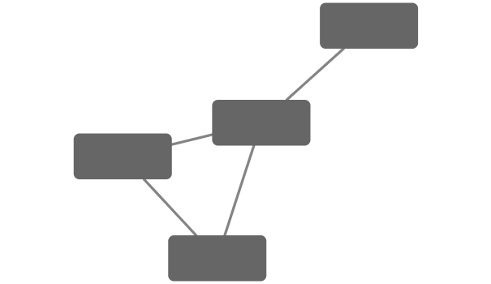
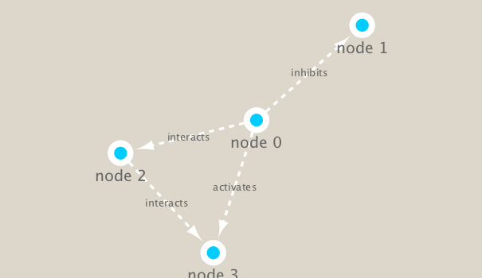

```{r setup, include=FALSE}
knitr::opts_chunk$set(echo = TRUE)
```

# Lab 17b

## Metagenomics co-occurence networks 

Here examine data from the Tara Ocean project. 

We will use the **igraph** package from CRAN and the **RCy3** package from bioconductor to build and visualize networks of this data. 


```{r}
# load the packages 
library(RCy3)
library(igraph)
library(RColorBrewer)
```

```{r}
# Test the connection to Cytoscape.
cytoscapePing()
```


```{r}
g <- makeSimpleIgraph()
createNetworkFromIgraph(g,"myGraph")
```
```{r}
plot(g)
```

Tell cytocape to export image
```{r}
fig <- exportImage(filename="demo", type="png", height=350)
```

Insert this image into this Rmd
```{r}

```
```{r}
setVisualStyle("Marquee")
```

```{r}
fig <- exportImage(filename="demo_marquee", type="png", height=350)


```

```{r}
styles <- getVisualStyleNames()
styles
```

```{r}
#setVisualStyle(styles[13])
setVisualStyle(styles[13])
```

```{r}
#setVisualStyle(styles[18])
setVisualStyle(styles[18])
```

```{r}
plot(g)
```

We will read in a species co-occurrence matrix that was calculated using Spearman Rank coefficient. (see reference Lima-Mendez et al. (2015) for details).


```{r}
## scripts for processing located in "inst/data-raw/"
prok_vir_cor <- read.delim("virus_prok_cor_abundant.tsv", stringsAsFactors = FALSE)

## Have a peak at the first 6 rows
head(prok_vir_cor)
```

There are many different ways to work with graphs in R. We will primarily use the igraph package (see: http://igraph.org/r/ ) and also work with our network within Cytoscape.

Here we will use the igraph package to convert the co-occurrence dataframe into a network that we can send to Cytoscape. In this case our graph is undirected (so we will set directed = FALSE) since we do not have any information about the direction of the interactions from this type of data.


```{r}
g <- graph.data.frame(prok_vir_cor, directed = FALSE)
```

```{r}
class(g)
```

```{r}
g
```

In this case the first line of output (“UNW- 854 1544 –”) tells that our network graph has 845 vertices (i.e. nodes, which represent our bacteria and viruses) and 1544 edges (i.e. linking lines, which indicate their co-occurrence). Note that the first four characters (i.e. the “UNW-” part) tell us about the network setup. In this case our network is Undirected, Named (i.e. has the ‘name’ node/vertex attribute set) and Weighted (i.e. the ‘weight’ edge attribute is set).

Common igraph functions for creating network graphs include: graph_from_data_frame(), graph_from_edgelist(), and graph_from_adjacency_matrix(). You can find out more about these functions from their associated help pages.

Our current graph is a little too dense in terms of node labels etc. to have a useful ‘default’ plot figure. But we can have a look anyway.


```{r}
plot(g)
```


```{r}
plot(g, vertex.label = NA)
```


```{r}
plot(g, vertex.size = 3, vertex.label = NA)
```

To find out more about igraph network plot options see http://igraph.org/r/doc/plot.common.html. Note that we can tune lots of plot attributes (see the help page ?igraph.plotting for details). Here we just turned down our vertex size from the default value of 15 and turned of our vertex labels.

Optional: ggplot

```{r}
library(ggraph)
```


```{r}
ggraph(g, layout = 'auto') +
  geom_edge_link(alpha = 0.25) +
  geom_node_point(color="steelblue") +
  theme_graph()
```


```{r}
createNetworkFromIgraph(g,"myIgraph")
```


## Network Query 

```{r}
# Vertex
V(g)

```

```{r}
# Edge
E(g)
```

## Network Community Detection and Centrality Analysis 
Community structure detection algorithms try to find dense sub-graphs within larger network graphs (i.e. clusters of well connected nodes that are densely connected themselves but sparsely connected to other nodes outside the cluster) . Here we use the classic Girvan & Newman betweenness clustering method. The igraph package has lots of different community detection algorithms (i.e. different methods for finding communities).

```{r}
cb <- cluster_edge_betweenness(g)
cb
```

```{r}
plot(cb, y=g, vertex.label=NA,  vertex.size=3)
```


```{r}
head( membership(cb) )
```


## Node degree

The degree of a node or vertex is its most basic structural property, the number of its adjacent edges. Here we calculate and plot the node degree distribution.


```{r}
# Calculate and plot node degree of our network
d <- degree(g)
hist(d, breaks=30, col="lightblue", main ="Node Degree Distribution")

```
For the degree_distribution() function a numeric vector of the same length as the maximum degree plus one is returned. The first element is the relative frequency zero degree vertices, the second vertices with degree one, etc.


```{r}
plot( degree_distribution(g), type="h" )
```


Centrality analysis
Centrality gives an estimation on how important a node or edge is for the connectivity (or the information flow) of a network. It is a particularly useful parameter in signaling networks and it is often used when trying to find drug targets for example.

Centrality analysis often aims to answer the following question: Which nodes are the most important and why?

One centrality method that you can often find in publications is the Google PageRank score. For the explanation of the PageRank algorithm, see the following webpage: http://infolab.stanford.edu/~backrub/google.html


```{r}
pr <- page_rank(g)
head(pr$vector)
```

```{r}
# Make a size vector btwn 2 and 20 for node plotting size

v.size <- BBmisc::normalize(pr$vector, range=c(2,20), method="range")
plot(g, vertex.size=v.size, vertex.label=NA)
```

One of the simplest centrality scores is of course degree that we calculated previously and stored as the object d. Lets plot this one out also

```{r}
v.size <- BBmisc::normalize(d, range=c(2,20), method="range")
plot(g, vertex.size=v.size, vertex.label=NA)
```

Another very common centrality score is betweenness. The vertex and edge betweenness are (roughly) defined by the number of geodesics (shortest paths) going through a vertex or an edge.


```{r}
b <- betweenness(g)
v.size <- BBmisc::normalize(b, range=c(2,20), method="range")
plot(g, vertex.size=v.size, vertex.label=NA)
```

END HERE