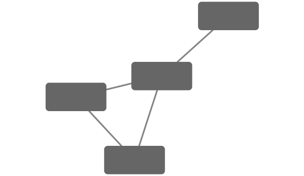
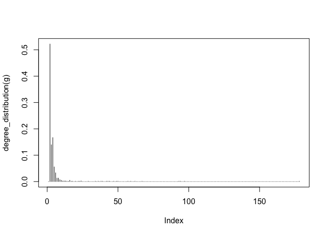

lec17
================
Michael Nguyen
11/19/2019

Lab 17b
=======

Metagenomics co-occurence networks
----------------------------------

Here examine data from the Tara Ocean project.

We will use the **igraph** package from CRAN and the **RCy3** package from bioconductor to build and visualize networks of this data.

``` r
# load the packages 
library(RCy3)
library(igraph)
```

    ## 
    ## Attaching package: 'igraph'

    ## The following objects are masked from 'package:stats':
    ## 
    ##     decompose, spectrum

    ## The following object is masked from 'package:base':
    ## 
    ##     union

``` r
library(RColorBrewer)
```

``` r
# Test the connection to Cytoscape.
cytoscapePing()
```

    ## [1] "You are connected to Cytoscape!"

``` r
g <- makeSimpleIgraph()
createNetworkFromIgraph(g,"myGraph")
```

    ## Loading data...
    ## Applying default style...
    ## Applying preferred layout...

    ## networkSUID 
    ##        6352

``` r
plot(g)
```


Tell cytocape to export image

``` r
fig <- exportImage(filename="demo", type="png", height=350)
```

Insert this image into this Rmd

``` r

```


``` r
setVisualStyle("Marquee")
```

    ##                 message 
    ## "Visual Style applied."

``` r
fig <- exportImage(filename="demo_marquee", type="png", height=350)

knitr::include_graphics("./demo_marquee.png")
```


``` r
styles <- getVisualStyleNames()
styles
```

    ##  [1] "Minimal"              "BioPAX"               "Curved"              
    ##  [4] "Big Labels"           "Sample1"              "Sample2"             
    ##  [7] "BioPAX_SIF"           "default"              "Ripple"              
    ## [10] "Nested Network Style" "Directed"             "default black"       
    ## [13] "Solid"                "Universe"             "Marquee"             
    ## [16] "Gradient1"            "Sample3"              "size_rank"

``` r
#setVisualStyle(styles[13])
setVisualStyle(styles[13])
```

    ##                 message 
    ## "Visual Style applied."

``` r
#setVisualStyle(styles[18])
setVisualStyle(styles[18])
```

    ##                 message 
    ## "Visual Style applied."

``` r
plot(g)
```


We will read in a species co-occurrence matrix that was calculated using Spearman Rank coefficient. (see reference Lima-Mendez et al. (2015) for details).

``` r
## scripts for processing located in "inst/data-raw/"
prok_vir_cor <- read.delim("virus_prok_cor_abundant.tsv", stringsAsFactors = FALSE)

## Have a peak at the first 6 rows
head(prok_vir_cor)
```

    ##       Var1          Var2    weight
    ## 1  ph_1061 AACY020068177 0.8555342
    ## 2  ph_1258 AACY020207233 0.8055750
    ## 3  ph_3164 AACY020207233 0.8122517
    ## 4  ph_1033 AACY020255495 0.8487498
    ## 5 ph_10996 AACY020255495 0.8734617
    ## 6 ph_11038 AACY020255495 0.8740782

There are many different ways to work with graphs in R. We will primarily use the igraph package (see: <http://igraph.org/r/> ) and also work with our network within Cytoscape.

Here we will use the igraph package to convert the co-occurrence dataframe into a network that we can send to Cytoscape. In this case our graph is undirected (so we will set directed = FALSE) since we do not have any information about the direction of the interactions from this type of data.

``` r
g <- graph.data.frame(prok_vir_cor, directed = FALSE)
```

``` r
class(g)
```

    ## [1] "igraph"

``` r
g
```

    ## IGRAPH f6960d1 UNW- 845 1544 -- 
    ## + attr: name (v/c), weight (e/n)
    ## + edges from f6960d1 (vertex names):
    ##  [1] ph_1061 --AACY020068177 ph_1258 --AACY020207233 ph_3164 --AACY020207233
    ##  [4] ph_1033 --AACY020255495 ph_10996--AACY020255495 ph_11038--AACY020255495
    ##  [7] ph_11040--AACY020255495 ph_11048--AACY020255495 ph_11096--AACY020255495
    ## [10] ph_1113 --AACY020255495 ph_1208 --AACY020255495 ph_13207--AACY020255495
    ## [13] ph_1346 --AACY020255495 ph_14679--AACY020255495 ph_1572 --AACY020255495
    ## [16] ph_16045--AACY020255495 ph_1909 --AACY020255495 ph_1918 --AACY020255495
    ## [19] ph_19894--AACY020255495 ph_2117 --AACY020255495 ph_2231 --AACY020255495
    ## [22] ph_2363 --AACY020255495 ph_276  --AACY020255495 ph_2775 --AACY020255495
    ## + ... omitted several edges

In this case the first line of output (“UNW- 854 1544 –”) tells that our network graph has 845 vertices (i.e. nodes, which represent our bacteria and viruses) and 1544 edges (i.e. linking lines, which indicate their co-occurrence). Note that the first four characters (i.e. the “UNW-” part) tell us about the network setup. In this case our network is Undirected, Named (i.e. has the ‘name’ node/vertex attribute set) and Weighted (i.e. the ‘weight’ edge attribute is set).

Common igraph functions for creating network graphs include: graph\_from\_data\_frame(), graph\_from\_edgelist(), and graph\_from\_adjacency\_matrix(). You can find out more about these functions from their associated help pages.

Our current graph is a little too dense in terms of node labels etc. to have a useful ‘default’ plot figure. But we can have a look anyway.

``` r
plot(g)
```


``` r
plot(g, vertex.label = NA)
```


``` r
plot(g, vertex.size = 3, vertex.label = NA)
```


To find out more about igraph network plot options see <http://igraph.org/r/doc/plot.common.html>. Note that we can tune lots of plot attributes (see the help page ?igraph.plotting for details). Here we just turned down our vertex size from the default value of 15 and turned of our vertex labels.

Optional: ggplot

``` r
library(ggraph)
```

    ## Loading required package: ggplot2

``` r
ggraph(g, layout = 'auto') +
  geom_edge_link(alpha = 0.25) +
  geom_node_point(color="steelblue") +
  theme_graph()
```

    ## Using `stress` as default layout


``` r
createNetworkFromIgraph(g,"myIgraph")
```

    ## Loading data...
    ## Applying default style...
    ## Applying preferred layout...

    ## networkSUID 
    ##        6380

Network Query
-------------

``` r
# Vertex
V(g)
```

    ## + 845/845 vertices, named, from f6960d1:
    ##   [1] ph_1061       ph_1258       ph_3164       ph_1033       ph_10996     
    ##   [6] ph_11038      ph_11040      ph_11048      ph_11096      ph_1113      
    ##  [11] ph_1208       ph_13207      ph_1346       ph_14679      ph_1572      
    ##  [16] ph_16045      ph_1909       ph_1918       ph_19894      ph_2117      
    ##  [21] ph_2231       ph_2363       ph_276        ph_2775       ph_2798      
    ##  [26] ph_3217       ph_3336       ph_3493       ph_3541       ph_3892      
    ##  [31] ph_4194       ph_4602       ph_4678       ph_484        ph_4993      
    ##  [36] ph_4999       ph_5001       ph_5010       ph_5286       ph_5287      
    ##  [41] ph_5302       ph_5321       ph_5643       ph_6441       ph_654       
    ##  [46] ph_6954       ph_7389       ph_7920       ph_8039       ph_8695      
    ## + ... omitted several vertices

``` r
# Edge
E(g)
```

    ## + 1544/1544 edges from f6960d1 (vertex names):
    ##  [1] ph_1061 --AACY020068177 ph_1258 --AACY020207233 ph_3164 --AACY020207233
    ##  [4] ph_1033 --AACY020255495 ph_10996--AACY020255495 ph_11038--AACY020255495
    ##  [7] ph_11040--AACY020255495 ph_11048--AACY020255495 ph_11096--AACY020255495
    ## [10] ph_1113 --AACY020255495 ph_1208 --AACY020255495 ph_13207--AACY020255495
    ## [13] ph_1346 --AACY020255495 ph_14679--AACY020255495 ph_1572 --AACY020255495
    ## [16] ph_16045--AACY020255495 ph_1909 --AACY020255495 ph_1918 --AACY020255495
    ## [19] ph_19894--AACY020255495 ph_2117 --AACY020255495 ph_2231 --AACY020255495
    ## [22] ph_2363 --AACY020255495 ph_276  --AACY020255495 ph_2775 --AACY020255495
    ## [25] ph_2798 --AACY020255495 ph_3217 --AACY020255495 ph_3336 --AACY020255495
    ## [28] ph_3493 --AACY020255495 ph_3541 --AACY020255495 ph_3892 --AACY020255495
    ## + ... omitted several edges

Network Community Detection and Centrality Analysis
---------------------------------------------------

Community structure detection algorithms try to find dense sub-graphs within larger network graphs (i.e. clusters of well connected nodes that are densely connected themselves but sparsely connected to other nodes outside the cluster) . Here we use the classic Girvan & Newman betweenness clustering method. The igraph package has lots of different community detection algorithms (i.e. different methods for finding communities).

``` r
cb <- cluster_edge_betweenness(g)
```

    ## Warning in cluster_edge_betweenness(g): At community.c:460 :Membership vector
    ## will be selected based on the lowest modularity score.

    ## Warning in cluster_edge_betweenness(g): At community.c:467 :Modularity
    ## calculation with weighted edge betweenness community detection might not make
    ## sense -- modularity treats edge weights as similarities while edge betwenness
    ## treats them as distances

``` r
cb
```

    ## IGRAPH clustering edge betweenness, groups: 18, mod: 0.82
    ## + groups:
    ##   $`1`
    ##   [1] "ph_1061"       "AACY020068177"
    ##   
    ##   $`2`
    ##    [1] "ph_1258"       "ph_5861"       "ph_7172"       "ph_11569"     
    ##    [5] "ph_1291"       "ph_1600"       "ph_2702"       "ph_5790"      
    ##    [9] "ph_5858"       "ph_7594"       "ph_7816"       "ph_784"       
    ##   [13] "ph_1359"       "ph_1534"       "ph_1874"       "ph_2465"      
    ##   [17] "ph_5453"       "ph_900"        "ph_908"        "ph_811"       
    ##   [21] "ph_1367"       "ph_1452"       "ph_1458"       "ph_1723"      
    ##   + ... omitted several groups/vertices

``` r
plot(cb, y=g, vertex.label=NA,  vertex.size=3)
```


``` r
head( membership(cb) )
```

    ##  ph_1061  ph_1258  ph_3164  ph_1033 ph_10996 ph_11038 
    ##        1        2        3        4        4        4

Node degree
-----------

The degree of a node or vertex is its most basic structural property, the number of its adjacent edges. Here we calculate and plot the node degree distribution.

``` r
# Calculate and plot node degree of our network
d <- degree(g)
hist(d, breaks=30, col="lightblue", main ="Node Degree Distribution")
```

 For the degree\_distribution() function a numeric vector of the same length as the maximum degree plus one is returned. The first element is the relative frequency zero degree vertices, the second vertices with degree one, etc.

``` r
plot( degree_distribution(g), type="h" )
```



Centrality analysis Centrality gives an estimation on how important a node or edge is for the connectivity (or the information flow) of a network. It is a particularly useful parameter in signaling networks and it is often used when trying to find drug targets for example.

Centrality analysis often aims to answer the following question: Which nodes are the most important and why?

One centrality method that you can often find in publications is the Google PageRank score. For the explanation of the PageRank algorithm, see the following webpage: <http://infolab.stanford.edu/~backrub/google.html>

``` r
pr <- page_rank(g)
head(pr$vector)
```

    ##      ph_1061      ph_1258      ph_3164      ph_1033     ph_10996     ph_11038 
    ## 0.0011834320 0.0011599483 0.0019042088 0.0005788564 0.0005769663 0.0005745460

``` r
# Make a size vector btwn 2 and 20 for node plotting size

v.size <- BBmisc::normalize(pr$vector, range=c(2,20), method="range")
plot(g, vertex.size=v.size, vertex.label=NA)
```


One of the simplest centrality scores is of course degree that we calculated previously and stored as the object d. Lets plot this one out also

``` r
v.size <- BBmisc::normalize(d, range=c(2,20), method="range")
plot(g, vertex.size=v.size, vertex.label=NA)
```


Another very common centrality score is betweenness. The vertex and edge betweenness are (roughly) defined by the number of geodesics (shortest paths) going through a vertex or an edge.

``` r
b <- betweenness(g)
v.size <- BBmisc::normalize(b, range=c(2,20), method="range")
plot(g, vertex.size=v.size, vertex.label=NA)
```


END HERE
